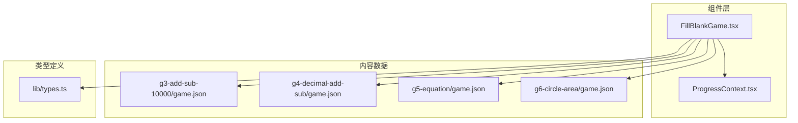
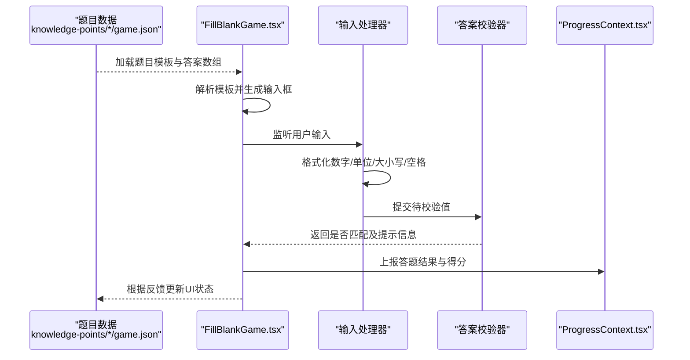
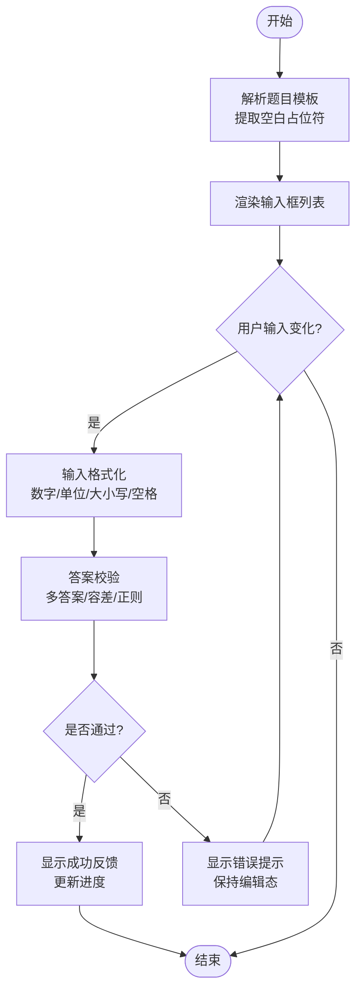
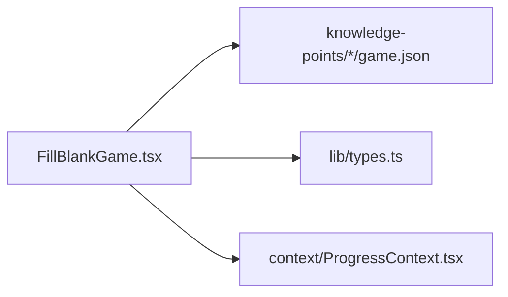

# 填空题游戏实现

<cite>
**本文引用的文件**
- [FillBlankGame.tsx](file://src/components/games/FillBlankGame.tsx)
- [game.json](file://src/content/knowledge-points/g3-add-sub-10000/game.json)
- [game.json](file://src/content/knowledge-points/g4-decimal-add-sub/game.json)
- [game.json](file://src/content/knowledge-points/g5-equation/game.json)
- [game.json](file://src/content/knowledge-points/g6-circle-area/game.json)
- [ProgressContext.tsx](file://src/context/ProgressContext.tsx)
- [types.ts](file://src/lib/types.ts)
</cite>

## 目录
1. [简介](#简介)
2. [项目结构](#项目结构)
3. [核心组件](#核心组件)
4. [架构总览](#架构总览)
5. [详细组件分析](#详细组件分析)
6. [依赖分析](#依赖分析)
7. [性能考虑](#性能考虑)
8. [故障排查指南](#故障排查指南)
9. [结论](#结论)
10. [附录](#附录)

## 简介
本文件为 math-k6 项目的“填空题游戏”提供详细的实现文档，聚焦 FillBlankGame 组件的架构与行为。内容涵盖：
- 空白输入框的动态生成机制
- 用户输入处理与实时验证反馈
- 答案校验逻辑（含数字格式化、单位转换、大小写处理）
- Props 接口定义（题目模板、答案数组、输入验证规则）
- 多种填空场景示例（数学计算、概念理解等）
- 错误提示与用户体验优化建议

## 项目结构
填空题游戏位于组件层 games 目录下，数据由 content 下的 knowledge-points/*/game.json 提供，进度由 context/ProgressContext.tsx 管理，类型定义在 lib/types.ts。

图表来源
- [FillBlankGame.tsx](file://src/components/games/FillBlankGame.tsx)
- [ProgressContext.tsx](file://src/context/ProgressContext.tsx)
- [types.ts](file://src/lib/types.ts)
- [game.json](file://src/content/knowledge-points/g3-add-sub-10000/game.json)
- [game.json](file://src/content/knowledge-points/g4-decimal-add-sub/game.json)
- [game.json](file://src/content/knowledge-points/g5-equation/game.json)
- [game.json](file://src/content/knowledge-points/g6-circle-area/game.json)

章节来源
- [FillBlankGame.tsx](file://src/components/games/FillBlankGame.tsx)
- [ProgressContext.tsx](file://src/context/ProgressContext.tsx)
- [types.ts](file://src/lib/types.ts)

## 核心组件
FillBlankGame 负责渲染填空题界面、解析题目模板中的占位符并动态生成输入框、对用户输入进行规范化与校验、给出即时反馈，并将答题结果上报至进度上下文。

关键职责
- 解析题目模板，定位空白占位符并渲染对应输入控件
- 统一输入格式化处理（数字、单位、大小写、空格等）
- 基于配置的答案数组与验证规则进行判定
- 提供实时错误提示与成功反馈
- 记录答题进度与得分

章节来源
- [FillBlankGame.tsx](file://src/components/games/FillBlankGame.tsx)

## 架构总览
下图展示了填空题从数据到交互的整体流程：题目数据驱动 UI 渲染，用户输入经标准化后进入校验器，最终更新状态与进度。

图表来源
- [FillBlankGame.tsx](file://src/components/games/FillBlankGame.tsx)
- [ProgressContext.tsx](file://src/context/ProgressContext.tsx)
- [game.json](file://src/content/knowledge-points/g3-add-sub-10000/game.json)
- [game.json](file://src/content/knowledge-points/g4-decimal-add-sub/game.json)
- [game.json](file://src/content/knowledge-points/g5-equation/game.json)
- [game.json](file://src/content/knowledge-points/g6-circle-area/game.json)

## 详细组件分析

### FillBlankGame 组件
- 模板解析与输入框生成
  - 扫描题目模板中的空白占位符，按顺序创建受控输入框
  - 为每个输入框绑定唯一标识，便于后续取值与校验
- 输入处理与格式化
  - 数字：去除千分位分隔符、统一小数点、处理前导零
  - 单位：支持常见单位缩写与全称归一化（如 m/meter、cm/厘米）
  - 文本：统一大小写、去除首尾空白、合并多余空格
  - 特殊符号：对分数、根号、百分号等进行规范化
- 答案校验
  - 支持多答案匹配（数组），允许等价表达（如 1.50 与 1.5）
  - 支持容差范围（数值型）、正则表达式（文本型）
  - 可配置忽略大小写、忽略空格、忽略单位后缀等策略
- 实时反馈
  - 输入时即时校验，显示正确/错误提示
  - 支持延迟校验以减少频繁重渲染
  - 错误消息可本地化或自定义
- 进度与计分
  - 将每空的结果写入进度上下文，累计总分与正确率
  - 支持“全部完成”后的总结视图

图表来源
- [FillBlankGame.tsx](file://src/components/games/FillBlankGame.tsx)

章节来源
- [FillBlankGame.tsx](file://src/components/games/FillBlankGame.tsx)

### 题目数据模型与示例
填空题的数据通常包含以下字段：
- 题目模板：字符串，使用占位符表示空白（例如 {blank_1}, {blank_2}）
- 答案数组：每个空白对应一个或多个合法答案
- 验证规则：可选，指定数据类型、容差、正则、单位等
- 提示与说明：可选，用于引导用户输入

以下为不同知识点的题目数据示例路径（不展示具体内容）：
- 加减法（三位数）：[g3-add-sub-10000/game.json](file://src/content/knowledge-points/g3-add-sub-10000/game.json)
- 小数加减法：[g4-decimal-add-sub/game.json](file://src/content/knowledge-points/g4-decimal-add-sub/game.json)
- 方程求解：[g5-equation/game.json](file://src/content/knowledge-points/g5-equation/game.json)
- 圆面积：[g6-circle-area/game.json](file://src/content/knowledge-points/g6-circle-area/game.json)

章节来源
- [game.json](file://src/content/knowledge-points/g3-add-sub-10000/game.json)
- [game.json](file://src/content/knowledge-points/g4-decimal-add-sub/game.json)
- [game.json](file://src/content/knowledge-points/g5-equation/game.json)
- [game.json](file://src/content/knowledge-points/g6-circle-area/game.json)

### Props 接口设计
建议的 Props 接口如下（以 TypeScript 风格描述）：
- template: string — 题目模板，包含空白占位符
- answers: Array<string | number> — 每个空白的正确答案集合
- rules?: ValidationRules — 可选的验证规则
- onResult?: (results: Array<boolean>) => void — 每次校验结果回调
- onComplete?: (score: number, total: number) => void — 全部完成回调
- locale?: string — 本地化语言代码
- placeholder?: string — 输入框默认提示文案

其中 ValidationRules 可包含：
- type: "number" | "text" | "unit" | "fraction" | "percent"
- tolerance?: number — 数值容差
- caseSensitive?: boolean — 是否区分大小写
- trimWhitespace?: boolean — 是否去除首尾空白
- unitMap?: Record<string, string> — 单位映射表
- regex?: string — 文本正则表达式

章节来源
- [types.ts](file://src/lib/types.ts)

### 输入格式化处理
- 数字格式化
  - 去除千分位逗号、统一小数点、处理科学计数法
  - 保留有效位数，避免浮点精度误差
- 单位转换
  - 支持长度、面积、体积、时间等常用单位
  - 内部统一转换为标准单位后再比较
- 大小写与空白
  - 默认忽略大小写与多余空白，可通过规则开关控制
- 特殊格式
  - 分数：分子/分母形式标准化
  - 百分号：自动转换为小数进行比较

章节来源
- [FillBlankGame.tsx](file://src/components/games/FillBlankGame.tsx)

### 答案验证逻辑
- 多答案匹配
  - 支持多个等价答案（如 1.5、1.50、3/2）
- 容差比较
  - 数值型允许误差范围，避免浮点误差导致误判
- 正则匹配
  - 文本型支持正则表达式，提高灵活性
- 单位与单位换算
  - 先归一化单位再比较，确保跨单位等价性
- 实时校验与防抖
  - 输入时触发校验，采用防抖减少不必要的计算

章节来源
- [FillBlankGame.tsx](file://src/components/games/FillBlankGame.tsx)

### 实时验证反馈与错误提示
- 即时反馈
  - 输入变化即校验，显示绿色/红色状态
- 错误提示
  - 针对常见错误给出明确提示（如单位缺失、格式不正确）
- 延迟校验
  - 对高频输入采用防抖，提升性能
- 无障碍支持
  - 为输入框添加 aria 属性，提升可访问性

章节来源
- [FillBlankGame.tsx](file://src/components/games/FillBlankGame.tsx)

### 多种填空场景示例
- 数学计算填空
  - 加减乘除、小数运算、分数运算
  - 示例数据路径：[g3-add-sub-10000/game.json](file://src/content/knowledge-points/g3-add-sub-10000/game.json)、[g4-decimal-add-sub/game.json](file://src/content/knowledge-points/g4-decimal-add-sub/game.json)
- 概念理解填空
  - 术语、性质、公式名称等文本填空
  - 示例数据路径：[g5-equation/game.json](file://src/content/knowledge-points/g5-equation/game.json)
- 几何与单位填空
  - 面积、周长、体积与单位换算
  - 示例数据路径：[g6-circle-area/game.json](file://src/content/knowledge-points/g6-circle-area/game.json)

章节来源
- [game.json](file://src/content/knowledge-points/g3-add-sub-10000/game.json)
- [game.json](file://src/content/knowledge-points/g4-decimal-add-sub/game.json)
- [game.json](file://src/content/knowledge-points/g5-equation/game.json)
- [game.json](file://src/content/knowledge-points/g6-circle-area/game.json)

## 依赖分析
FillBlankGame 依赖题目数据、类型定义与进度上下文，形成低耦合、高内聚的结构。

图表来源
- [FillBlankGame.tsx](file://src/components/games/FillBlankGame.tsx)
- [types.ts](file://src/lib/types.ts)
- [ProgressContext.tsx](file://src/context/ProgressContext.tsx)

章节来源
- [FillBlankGame.tsx](file://src/components/games/FillBlankGame.tsx)
- [types.ts](file://src/lib/types.ts)
- [ProgressContext.tsx](file://src/context/ProgressContext.tsx)

## 性能考虑
- 输入防抖：对高频输入进行节流，降低校验频率
- 惰性渲染：仅在需要时渲染输入框与提示
- 缓存规则：对相同模板与规则的校验结果进行缓存
- 内存管理：及时释放事件监听与定时器
- 大数据集：分页或虚拟滚动处理大量题目

## 故障排查指南
常见问题与解决思路：
- 输入无法识别
  - 检查输入格式化规则是否正确（数字、单位、大小写）
  - 确认模板占位符与答案索引一致
- 答案始终判定失败
  - 核对容差设置与单位换算
  - 检查正则表达式是否过于严格
- 实时反馈卡顿
  - 增加防抖延迟或减少校验复杂度
  - 避免在每次输入中执行昂贵操作
- 进度未更新
  - 确认 onResult 与 onComplete 回调已正确调用
  - 检查 ProgressContext 的状态更新逻辑

章节来源
- [FillBlankGame.tsx](file://src/components/games/FillBlankGame.tsx)
- [ProgressContext.tsx](file://src/context/ProgressContext.tsx)

## 结论
FillBlankGame 通过清晰的模板解析、灵活的输入格式化与强大的答案校验能力，为 math-k6 提供了可扩展且易用的填空题体验。结合题目数据与进度上下文，可实现丰富的教学场景与学习追踪。建议在后续迭代中继续完善单位库、正则模板与本地化提示，以提升用户体验与可维护性。

## 附录
- 最佳实践
  - 使用明确的占位符命名规范（如 blank_1、blank_2）
  - 为每种题型提供样例数据，便于测试与演示
  - 对复杂规则进行单元测试覆盖
- 扩展方向
  - 支持更多单位与数学表达式解析
  - 引入可视化辅助（如图形、数轴）增强理解
  - 增加难度分级与自适应出题