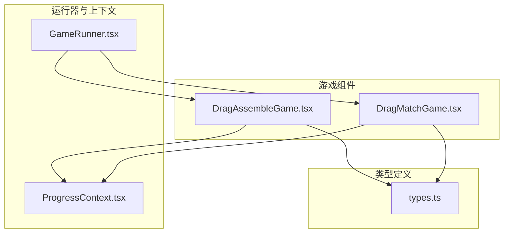
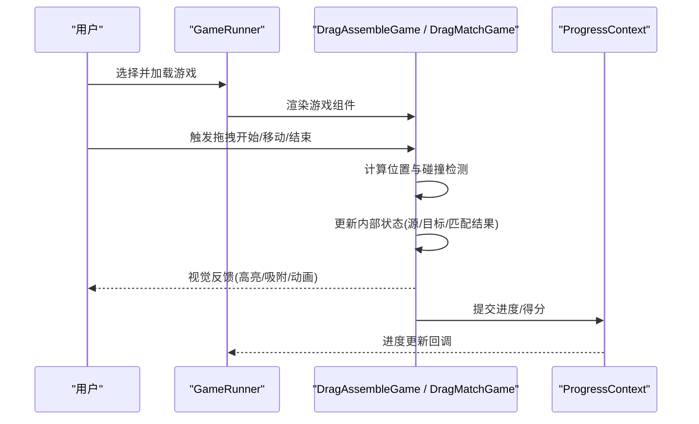
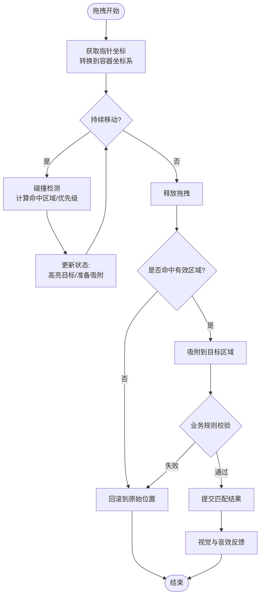
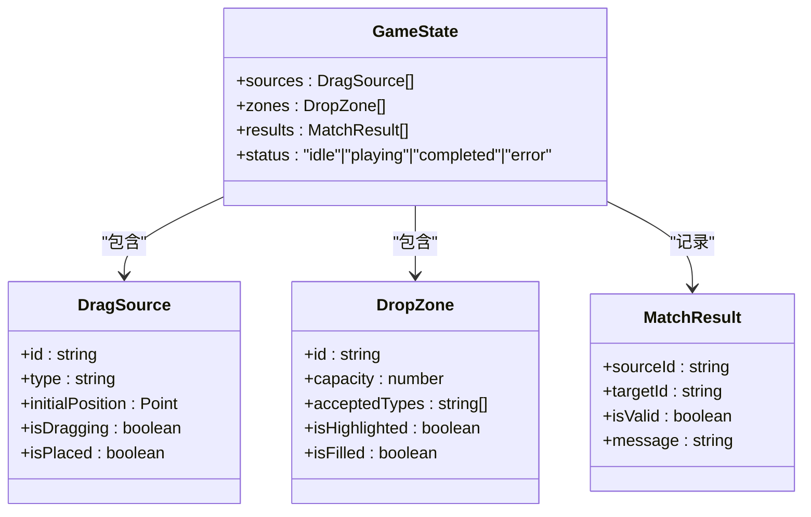
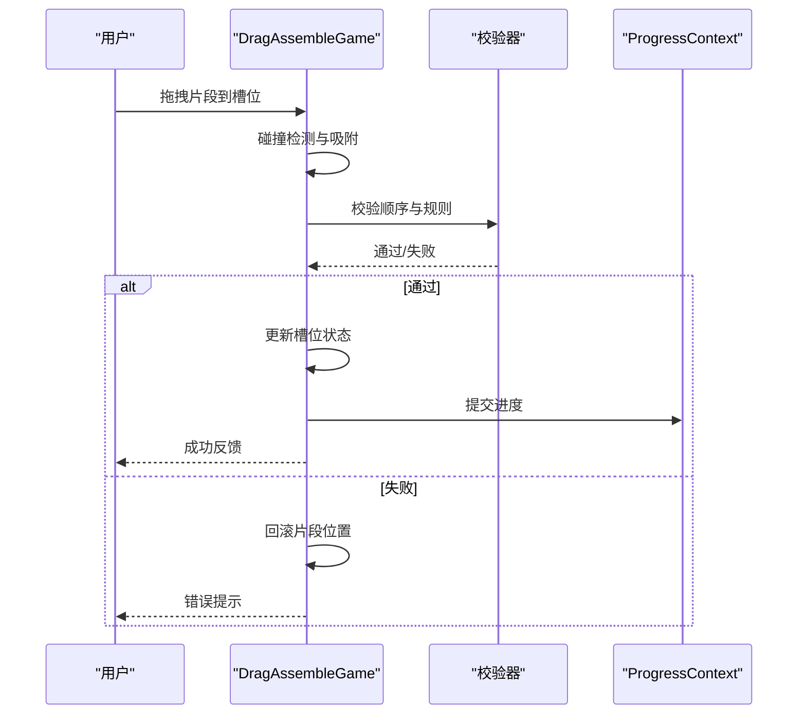
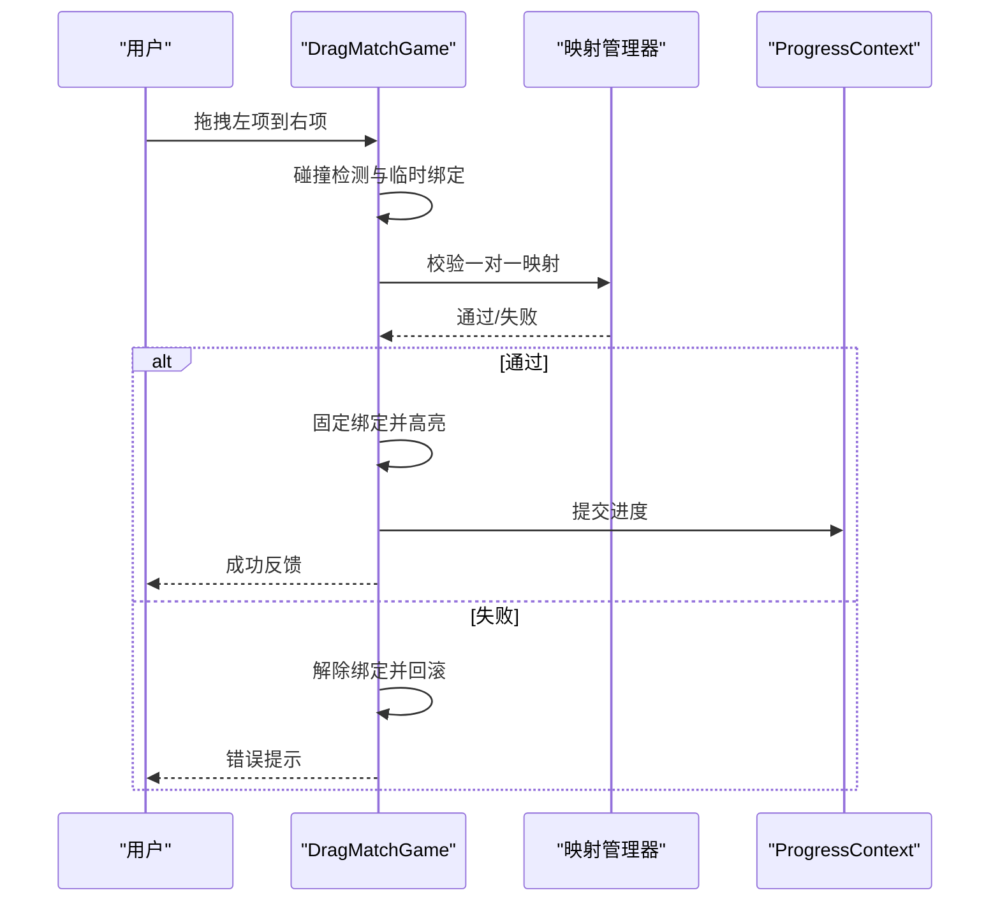
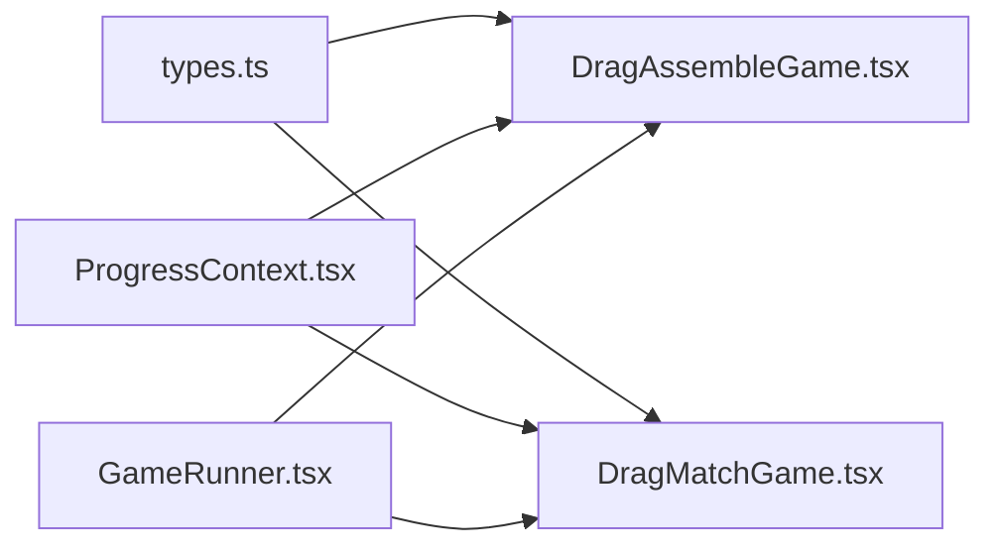

# 拖拽类游戏实现

<cite>
**本文引用的文件**   
- [DragAssembleGame.tsx](file://src/components/games/DragAssembleGame.tsx)
- [DragMatchGame.tsx](file://src/components/games/DragMatchGame.tsx)
- [GameRunner.tsx](file://src/components/GameRunner.tsx)
- [types.ts](file://src/lib/types.ts)
- [ProgressContext.tsx](file://src/context/ProgressContext.tsx)
</cite>

## 目录
1. [简介](#简介)
2. [项目结构](#项目结构)
3. [核心组件](#核心组件)
4. [架构总览](#架构总览)
5. [详细组件分析](#详细组件分析)
6. [依赖关系分析](#依赖关系分析)
7. [性能考量](#性能考量)
8. [故障排查指南](#故障排查指南)
9. [结论](#结论)
10. [附录](#附录)

## 简介
本文件面向 math-k6 项目的拖拽类教学游戏，聚焦两个核心组件：组装匹配（DragAssembleGame）与配对匹配（DragMatchGame）。文档从系统架构、数据流、交互逻辑到状态管理进行系统化说明，帮助读者理解并扩展拖拽游戏的实现。内容涵盖：
- 拖拽事件处理、位置计算与碰撞检测
- 拖拽源、目标区域与匹配验证的状态管理
- 组装匹配与配对匹配的差异与适用场景
- 配置示例与自定义扩展方法
- 触摸设备与鼠标设备的兼容性处理

## 项目结构
与拖拽游戏相关的代码主要位于 components/games 目录，并由 GameRunner 统一调度；类型定义集中在 lib/types.ts；进度与反馈通过 context 管理。

图表来源
- [DragAssembleGame.tsx](file://src/components/games/DragAssembleGame.tsx)
- [DragMatchGame.tsx](file://src/components/games/DragMatchGame.tsx)
- [GameRunner.tsx](file://src/components/GameRunner.tsx)
- [types.ts](file://src/lib/types.ts)
- [ProgressContext.tsx](file://src/context/ProgressContext.tsx)

章节来源
- [DragAssembleGame.tsx](file://src/components/games/DragAssembleGame.tsx)
- [DragMatchGame.tsx](file://src/components/games/DragMatchGame.tsx)
- [GameRunner.tsx](file://src/components/GameRunner.tsx)
- [types.ts](file://src/lib/types.ts)
- [ProgressContext.tsx](file://src/context/ProgressContext.tsx)

## 核心组件
- DragAssembleGame：用于“组装式”任务，将多个可拖拽元素按顺序或规则放入目标槽位，形成完整答案。
- DragMatchGame：用于“配对式”任务，将左侧项与右侧项一一匹配，强调一对一对应关系。

共同点
- 均基于 HTML5 拖拽 API 与 Pointer Events 的兼容层，支持鼠标与触摸设备。
- 使用 React 状态管理拖拽源、目标区域、命中判定结果与完成状态。
- 提供统一的校验与反馈机制，驱动进度上报。

差异点
- 组装匹配关注“序列/布局约束”，通常要求所有槽位填满且顺序正确。
- 配对匹配关注“一对一映射”，允许打乱顺序但必须成对匹配。

章节来源
- [DragAssembleGame.tsx](file://src/components/games/DragAssembleGame.tsx)
- [DragMatchGame.tsx](file://src/components/games/DragMatchGame.tsx)

## 架构总览
拖拽游戏由“运行器 + 游戏组件 + 类型定义 + 进度上下文”构成。运行器负责渲染具体游戏组件；游戏组件封装拖拽交互与业务规则；类型定义约束数据结构；进度上下文记录学习进度与得分。

图表来源
- [GameRunner.tsx](file://src/components/GameRunner.tsx)
- [DragAssembleGame.tsx](file://src/components/games/DragAssembleGame.tsx)
- [DragMatchGame.tsx](file://src/components/games/DragMatchGame.tsx)
- [ProgressContext.tsx](file://src/context/ProgressContext.tsx)

## 详细组件分析

### 拖拽交互核心逻辑
- 事件处理
  - 鼠标：mousedown/mousemove/mouseup
  - 触摸：touchstart/touchmove/touchend
  - 兼容层：统一为 pointerdown/pointermove/pointerup，必要时回退到 mouse/touch 事件
- 位置计算
  - 获取指针相对于视口坐标，转换为相对目标容器坐标
  - 考虑缩放、滚动偏移与 transform，确保落点准确
- 碰撞检测
  - 矩形相交检测：比较拖拽元素边界与目标区域边界
  - 命中优先级：根据层级、距离中心远近、规则权重排序
  - 吸附策略：命中后自动对齐到最近槽位或匹配对

图表来源
- [DragAssembleGame.tsx](file://src/components/games/DragAssembleGame.tsx)
- [DragMatchGame.tsx](file://src/components/games/DragMatchGame.tsx)

章节来源
- [DragAssembleGame.tsx](file://src/components/games/DragAssembleGame.tsx)
- [DragMatchGame.tsx](file://src/components/games/DragMatchGame.tsx)

### 状态管理模型
- 拖拽源
  - 标识：唯一 ID、类型、初始位置
  - 行为：可被拖拽、禁用态、已放置标记
- 目标区域
  - 标识：槽位 ID、容量、接受类型、占位状态
  - 行为：高亮、吸附、校验通过/失败
- 匹配验证
  - 组装匹配：顺序校验、必填校验、重复校验
  - 配对匹配：一对一映射、去重校验、双向一致性
- 完成状态
  - 未完成、进行中、已完成、错误提示

图表来源
- [DragAssembleGame.tsx](file://src/components/games/DragAssembleGame.tsx)
- [DragMatchGame.tsx](file://src/components/games/DragMatchGame.tsx)
- [types.ts](file://src/lib/types.ts)

章节来源
- [DragAssembleGame.tsx](file://src/components/games/DragAssembleGame.tsx)
- [DragMatchGame.tsx](file://src/components/games/DragMatchGame.tsx)
- [types.ts](file://src/lib/types.ts)

### 组装匹配（DragAssembleGame）
- 设计目标：将若干片段按正确顺序或规则拼接到目标槽位中，形成完整答案。
- 关键流程
  - 初始化：生成可拖拽片段与目标槽位，设置接受类型与容量
  - 拖拽命中：检测片段与槽位的相交，优先选择空槽位
  - 顺序校验：检查已放置片段的顺序是否符合预期
  - 完成判定：所有槽位填满且顺序正确即完成
- 常见变体
  - 线性序列：如数字排列、公式步骤
  - 二维布局：如表格填充、图形拼接

图表来源
- [DragAssembleGame.tsx](file://src/components/games/DragAssembleGame.tsx)
- [ProgressContext.tsx](file://src/context/ProgressContext.tsx)

章节来源
- [DragAssembleGame.tsx](file://src/components/games/DragAssembleGame.tsx)
- [ProgressContext.tsx](file://src/context/ProgressContext.tsx)

### 配对匹配（DragMatchGame）
- 设计目标：将左侧项与右侧项一一匹配，强调映射关系而非顺序。
- 关键流程
  - 初始化：生成左右两列项，设置唯一映射关系
  - 拖拽命中：检测左项与右项的相交，建立临时绑定
  - 映射校验：检查是否满足一对一映射、无重复绑定
  - 完成判定：所有项均成功配对即完成
- 常见变体
  - 概念配对：术语与定义、单位与数值
  - 图像配对：图形与属性、图表与描述

图表来源
- [DragMatchGame.tsx](file://src/components/games/DragMatchGame.tsx)
- [ProgressContext.tsx](file://src/context/ProgressContext.tsx)

章节来源
- [DragMatchGame.tsx](file://src/components/games/DragMatchGame.tsx)
- [ProgressContext.tsx](file://src/context/ProgressContext.tsx)

### 配置示例与自定义扩展
- 通用配置项
  - items：可拖拽项列表（含 id、label、type、initialPosition）
  - zones：目标区域列表（含 id、capacity、acceptedTypes）
  - rules：校验规则（顺序、映射、必填、去重等）
  - feedback：反馈文案与提示策略
- 组装匹配扩展
  - 增加“插入模式”：在已有片段间插入新片段
  - 增加“撤销/重做”：记录历史操作栈
- 配对匹配扩展
  - 增加“多对一”：一个目标可接受多个来源
  - 增加“动态配对”：运行时生成新的配对关系

章节来源
- [DragAssembleGame.tsx](file://src/components/games/DragAssembleGame.tsx)
- [DragMatchGame.tsx](file://src/components/games/DragMatchGame.tsx)
- [types.ts](file://src/lib/types.ts)

### 触摸与鼠标兼容性
- 事件统一
  - 使用 Pointer Events 作为主接口，回退到 mouse/touch 事件
  - 阻止默认滚动与缩放，避免页面干扰
- 坐标转换
  - 考虑设备像素比、滚动偏移、transform 缩放
  - 使用 getBoundingClientRect 与 clientX/Y/clientY 计算
- 手势优化
  - 长按防误触、滑动阈值、惯性拖拽
  - 移动端吸附更灵敏，提升命中率

章节来源
- [DragAssembleGame.tsx](file://src/components/games/DragAssembleGame.tsx)
- [DragMatchGame.tsx](file://src/components/games/DragMatchGame.tsx)

## 依赖关系分析
- 组件内聚性
  - DragAssembleGame 与 DragMatchGame 各自封装拖拽逻辑与业务规则，耦合度低
- 外部依赖
  - types.ts 提供统一的数据结构约束
  - ProgressContext.tsx 提供进度与得分上报能力
  - GameRunner.tsx 负责组件渲染与生命周期管理

图表来源
- [types.ts](file://src/lib/types.ts)
- [DragAssembleGame.tsx](file://src/components/games/DragAssembleGame.tsx)
- [DragMatchGame.tsx](file://src/components/games/DragMatchGame.tsx)
- [ProgressContext.tsx](file://src/context/ProgressContext.tsx)
- [GameRunner.tsx](file://src/components/GameRunner.tsx)

章节来源
- [types.ts](file://src/lib/types.ts)
- [DragAssembleGame.tsx](file://src/components/games/DragAssembleGame.tsx)
- [DragMatchGame.tsx](file://src/components/games/DragMatchGame.tsx)
- [ProgressContext.tsx](file://src/context/ProgressContext.tsx)
- [GameRunner.tsx](file://src/components/GameRunner.tsx)

## 性能考量
- 碰撞检测优化
  - 使用空间分区或四叉树减少 O(n^2) 检测
  - 仅在拖拽移动时执行命中测试，静止时跳过
- 状态更新节流
  - 合并多次 setState，避免频繁重渲染
  - 使用不可变数据与浅比较提升渲染效率
- 动画与过渡
  - 使用 CSS transform 与 requestAnimationFrame 保证流畅
  - 避免在高频事件中创建对象

[本节为通用指导，不直接分析具体文件]

## 故障排查指南
- 常见问题
  - 拖拽不生效：检查事件监听是否注册、是否阻止了默认行为
  - 命中不准确：确认坐标转换是否正确，考虑滚动与缩放
  - 匹配失败：检查规则配置与数据类型是否一致
  - 移动端异常：确认 Pointer Events 回退逻辑与手势冲突
- 调试建议
  - 输出拖拽源与目标区域的边界信息
  - 打印命中测试结果与优先级排序
  - 记录状态变更前后快照，定位问题阶段

章节来源
- [DragAssembleGame.tsx](file://src/components/games/DragAssembleGame.tsx)
- [DragMatchGame.tsx](file://src/components/games/DragMatchGame.tsx)

## 结论
DragAssembleGame 与 DragMatchGame 在拖拽交互上共享一致的底层逻辑，但在业务规则与状态管理上各有侧重。通过清晰的类型定义、健壮的事件兼容与高效的碰撞检测，二者能够灵活适配多种教学场景。建议在扩展时保持组件内聚，复用公共能力，并通过配置化降低定制成本。

[本节为总结性内容，不直接分析具体文件]

## 附录
- 最佳实践
  - 将拖拽逻辑抽象为 Hook 或工具函数，便于复用
  - 使用单元测试覆盖碰撞检测与规则校验
  - 提供可视化调试面板辅助定位问题
- 参考资源
  - HTML5 拖拽 API 与 Pointer Events 规范
  - React 状态管理与性能优化指南

[本节为补充信息，不直接分析具体文件]