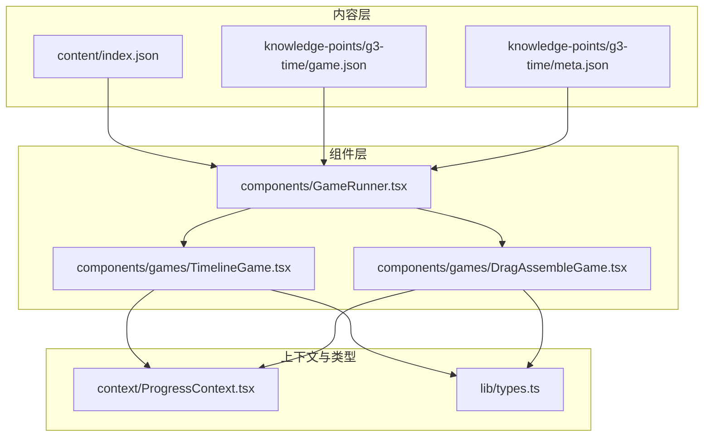
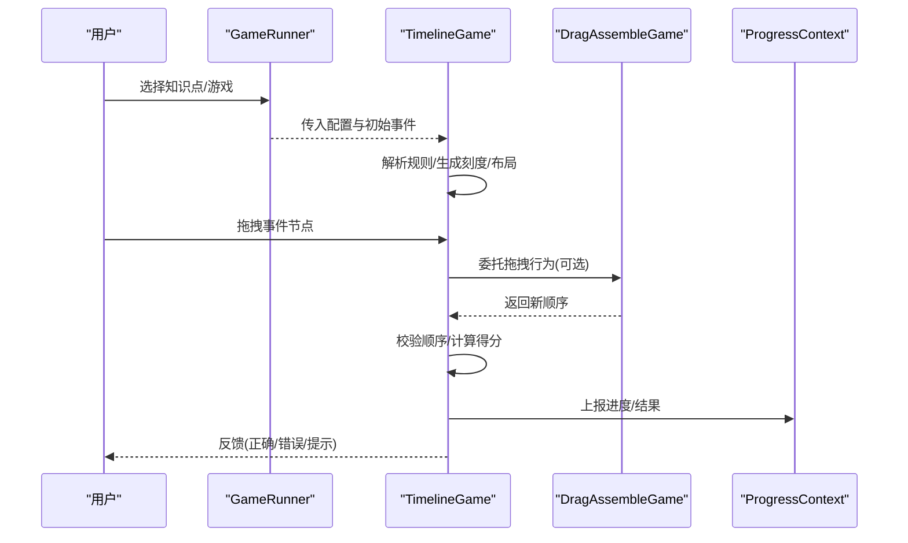
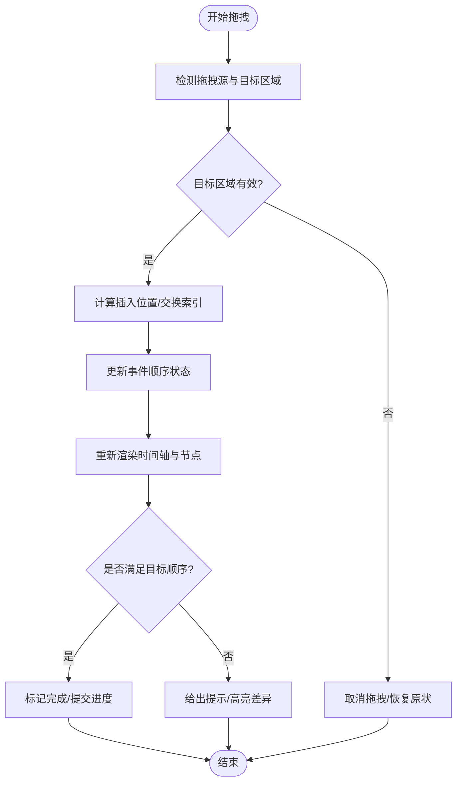
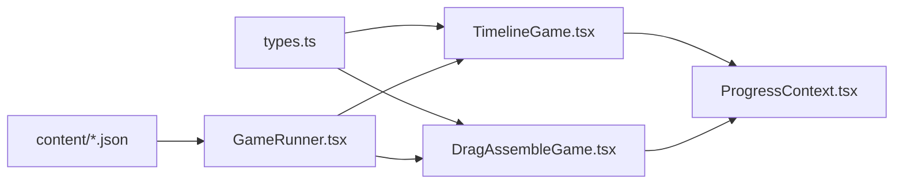

# 时间线游戏实现

<cite>
**本文引用的文件**   
- [TimelineGame.tsx](file://src/components/games/TimelineGame.tsx)
- [DragAssembleGame.tsx](file://src/components/games/DragAssembleGame.tsx)
- [game.json](file://src/content/knowledge-points/g3-time/game.json)
- [meta.json](file://src/content/knowledge-points/g3-time/meta.json)
- [index.json](file://src/content/index.json)
- [ProgressContext.tsx](file://src/context/ProgressContext.tsx)
- [GameRunner.tsx](file://src/components/GameRunner.tsx)
- [types.ts](file://src/lib/types.ts)
</cite>

## 目录
1. [简介](#简介)
2. [项目结构](#项目结构)
3. [核心组件](#核心组件)
4. [架构总览](#架构总览)
5. [详细组件分析](#详细组件分析)
6. [依赖关系分析](#依赖关系分析)
7. [性能考量](#性能考量)
8. [故障排查指南](#故障排查指南)
9. [结论](#结论)
10. [附录](#附录)

## 简介
本文件为 math-k6 项目中“时间线游戏”（TimelineGame）的详细实现文档。重点覆盖：
- TimelineGame 组件的布局算法与用户交互逻辑（时间轴渲染、事件排序、拖拽操作）
- 数据结构设计（时间事件数组、排序规则、验证逻辑）
- 可视化实现（刻度标记、事件节点、连接线绘制）
- 配置示例（历史事件排序、数学步骤排列等）
- 响应式设计与无障碍访问支持

## 项目结构
时间线游戏位于组件层，由 GameRunner 统一调度，数据来源于 content 下的知识点对应 game.json 与 meta.json。类型定义集中在 lib/types.ts。进度状态通过 ProgressContext 管理。



图表来源
- [GameRunner.tsx](file://src/components/GameRunner.tsx)
- [TimelineGame.tsx](file://src/components/games/TimelineGame.tsx)
- [DragAssembleGame.tsx](file://src/components/games/DragAssembleGame.tsx)
- [ProgressContext.tsx](file://src/context/ProgressContext.tsx)
- [types.ts](file://src/lib/types.ts)
- [index.json](file://src/content/index.json)
- [game.json](file://src/content/knowledge-points/g3-time/game.json)
- [meta.json](file://src/content/knowledge-points/g3-time/meta.json)

章节来源
- [GameRunner.tsx](file://src/components/GameRunner.tsx)
- [TimelineGame.tsx](file://src/components/games/TimelineGame.tsx)
- [DragAssembleGame.tsx](file://src/components/games/DragAssembleGame.tsx)
- [ProgressContext.tsx](file://src/context/ProgressContext.tsx)
- [types.ts](file://src/lib/types.ts)
- [index.json](file://src/content/index.json)
- [game.json](file://src/content/knowledge-points/g3-time/game.json)
- [meta.json](file://src/content/knowledge-points/g3-time/meta.json)

## 核心组件
- TimelineGame：负责时间线渲染、事件排序、拖拽交互、校验与反馈。
- DragAssembleGame：通用拖拽拼装组件，可被 TimelineGame 复用或作为参考实现。
- GameRunner：根据 content 配置加载并运行具体游戏。
- ProgressContext：集中管理学习进度与结果上报。
- types.ts：定义游戏数据模型、事件结构、排序与校验接口。

章节来源
- [TimelineGame.tsx](file://src/components/games/TimelineGame.tsx)
- [DragAssembleGame.tsx](file://src/components/games/DragAssembleGame.tsx)
- [GameRunner.tsx](file://src/components/GameRunner.tsx)
- [ProgressContext.tsx](file://src/context/ProgressContext.tsx)
- [types.ts](file://src/lib/types.ts)

## 架构总览
时间线游戏的整体流程如下：
- 内容加载：GameRunner 读取 index.json 与对应 knowledge-point 的 game.json/meta.json。
- 初始化：TimelineGame 解析事件列表与排序规则，构建初始状态。
- 渲染：计算时间轴刻度、事件节点位置与连接线。
- 交互：处理拖拽、插入、交换等操作，更新顺序。
- 校验：按规则判定是否完成，提交进度到 ProgressContext。



图表来源
- [GameRunner.tsx](file://src/components/GameRunner.tsx)
- [TimelineGame.tsx](file://src/components/games/TimelineGame.tsx)
- [DragAssembleGame.tsx](file://src/components/games/DragAssembleGame.tsx)
- [ProgressContext.tsx](file://src/context/ProgressContext.tsx)

## 详细组件分析

### TimelineGame 组件
职责：
- 接收配置：事件数组、排序规则、校验函数、显示选项（如是否显示刻度、连接线样式）。
- 布局算法：基于容器宽度与事件数量计算刻度间距、节点尺寸与对齐方式；支持水平/垂直布局切换。
- 渲染：绘制时间轴基线、刻度标记、事件节点（文本/图标）、连接箭头/曲线。
- 交互：拖拽排序、点击插入、键盘导航、撤销/重做（可选）。
- 校验：比较当前顺序与目标顺序，给出即时反馈与最终评分。

关键数据结构（概念说明）：
- 事件项：包含唯一标识、标题、描述、时间戳或相对序号、权重、分组等字段。
- 排序规则：升序/降序、自定义比较器、分组内排序、稳定排序要求。
- 校验逻辑：逐项比对、容错阈值、部分正确计分策略。

交互流程图（拖拽排序）：


图表来源
- [TimelineGame.tsx](file://src/components/games/TimelineGame.tsx)

章节来源
- [TimelineGame.tsx](file://src/components/games/TimelineGame.tsx)

### DragAssembleGame 组件
职责：
- 提供通用拖拽拼装能力（拖放、占位符、插入点、交换）。
- 暴露回调：onOrderChange、onValidate、onSubmit。
- 与 TimelineGame 协作：TimelineGame 可将拖拽细节委托给该组件，降低耦合。

类关系图（概念）：
```mermaid
classDiagram
class DragAssembleGame {
+props : { items, onOrderChange, onValidate }
+render()
-handleDragStart(item)
-handleDrop(targetIndex)
-reorder(items, from, to)
}
class TimelineGame {
+props : { events, rules, options }
+render()
-computeLayout()
-validateOrder()
}
TimelineGame --> DragAssembleGame : "委托拖拽拼装"
```

图表来源
- [DragAssembleGame.tsx](file://src/components/games/DragAssembleGame.tsx)
- [TimelineGame.tsx](file://src/components/games/TimelineGame.tsx)

章节来源
- [DragAssembleGame.tsx](file://src/components/games/DragAssembleGame.tsx)
- [TimelineGame.tsx](file://src/components/games/TimelineGame.tsx)

### 数据模型与类型（types.ts）
建议的数据模型（概念说明）：
- EventItem：id、title、description、timeValue（数值或日期）、group、weight、metadata。
- SortRule：direction（asc/desc）、customCompare、groupBy、stable。
- ValidationRule：exactMatch、tolerance、partialScore、feedbackMessage。
- TimelineOptions：layout（horizontal/vertical）、showTicks、tickInterval、showConnections、connectionStyle、snapToGrid、readOnly。

章节来源
- [types.ts](file://src/lib/types.ts)

### 内容配置（game.json / meta.json）
- game.json：定义事件列表、排序规则、校验策略、UI 选项与提示信息。
- meta.json：元信息（难度、适用年级、标签、预计时长）。
- index.json：知识点索引，供 GameRunner 快速定位资源。

章节来源
- [game.json](file://src/content/knowledge-points/g3-time/game.json)
- [meta.json](file://src/content/knowledge-points/g3-time/meta.json)
- [index.json](file://src/content/index.json)

### 进度与结果（ProgressContext.tsx）
- 记录每次尝试的顺序、得分、耗时、错误次数。
- 提供重置、提交、查询进度的 API。
- 与 GameRunner 集成，在关卡完成后自动推进。

章节来源
- [ProgressContext.tsx](file://src/context/ProgressContext.tsx)
- [GameRunner.tsx](file://src/components/GameRunner.tsx)

## 依赖关系分析
- TimelineGame 依赖 DragAssembleGame（拖拽能力）、types（类型定义）、ProgressContext（进度上报）。
- GameRunner 依赖 content 配置与 ProgressContext。
- 所有组件共享 types.ts 的类型契约，确保数据一致性。



图表来源
- [types.ts](file://src/lib/types.ts)
- [TimelineGame.tsx](file://src/components/games/TimelineGame.tsx)
- [DragAssembleGame.tsx](file://src/components/games/DragAssembleGame.tsx)
- [GameRunner.tsx](file://src/components/GameRunner.tsx)
- [ProgressContext.tsx](file://src/context/ProgressContext.tsx)
- [index.json](file://src/content/index.json)
- [game.json](file://src/content/knowledge-points/g3-time/game.json)
- [meta.json](file://src/content/knowledge-points/g3-time/meta.json)

章节来源
- [types.ts](file://src/lib/types.ts)
- [TimelineGame.tsx](file://src/components/games/TimelineGame.tsx)
- [DragAssembleGame.tsx](file://src/components/games/DragAssembleGame.tsx)
- [GameRunner.tsx](file://src/components/GameRunner.tsx)
- [ProgressContext.tsx](file://src/context/ProgressContext.tsx)
- [index.json](file://src/content/index.json)
- [game.json](file://src/content/knowledge-points/g3-time/game.json)
- [meta.json](file://src/content/knowledge-points/g3-time/meta.json)

## 性能考量
- 布局计算：使用 memoization 缓存刻度与节点布局，避免频繁重排。
- 拖拽优化：节流/防抖 drop 事件，批量更新顺序后一次性重绘。
- 渲染优化：对长列表采用虚拟滚动或分页渲染。
- 校验优化：增量校验，仅对比变动区间。
- 内存管理：及时释放拖拽临时对象与监听器。

[本节为通用指导，不直接分析具体文件]

## 故障排查指南
常见问题与解决思路：
- 事件重叠或错位：检查刻度间距与节点尺寸计算，确认容器宽度变化后的重布局触发。
- 拖拽无效：确认 dragstart/drop 事件绑定与阻止默认行为，检查目标区域命中测试。
- 排序异常：核对排序规则与比较器稳定性，确认分组与权重优先级。
- 校验误判：检查容差阈值与 partialScore 策略，确认时间值单位一致。
- 进度未上报：确认 ProgressContext 的提交 API 调用时机与参数完整性。

章节来源
- [TimelineGame.tsx](file://src/components/games/TimelineGame.tsx)
- [DragAssembleGame.tsx](file://src/components/games/DragAssembleGame.tsx)
- [ProgressContext.tsx](file://src/context/ProgressContext.tsx)

## 结论
TimelineGame 通过清晰的布局算法、稳健的拖拽交互与灵活的配置体系，实现了可扩展的时间线游戏。结合 DragAssembleGame 的通用能力与 ProgressContext 的进度管理，可在不同学科场景下快速搭建高质量互动体验。建议在后续迭代中增强无障碍支持与移动端适配，提升用户体验与可达性。

[本节为总结，不直接分析具体文件]

## 附录

### 配置示例（概念）
- 历史事件排序：事件包含年份与描述，按年份升序排列，启用刻度与连接线。
- 数学步骤排列：事件为解题步骤，按逻辑顺序排列，启用分组与权重，允许部分得分。
- 科学实验流程：事件为实验步骤，需严格顺序，禁用回退，提供即时反馈。

[本节为概念性内容，不直接分析具体文件]

### 响应式设计要点
- 自适应刻度密度：根据屏幕宽度动态调整 tickInterval。
- 触摸友好：增大拖拽热区，支持长按与滑动插入。
- 字体与对比度：确保可读性与 WCAG 对比度标准。

[本节为概念性内容，不直接分析具体文件]

### 无障碍访问要点
- 键盘导航：Tab 顺序、方向键移动、Enter/Space 确认。
- 屏幕阅读器：为事件节点添加 aria-label、role="list/listitem"、aria-checked 等语义。
- 焦点管理：拖拽结束后将焦点置于合适元素，避免丢失。

[本节为概念性内容，不直接分析具体文件]