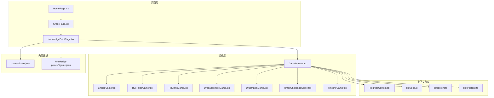
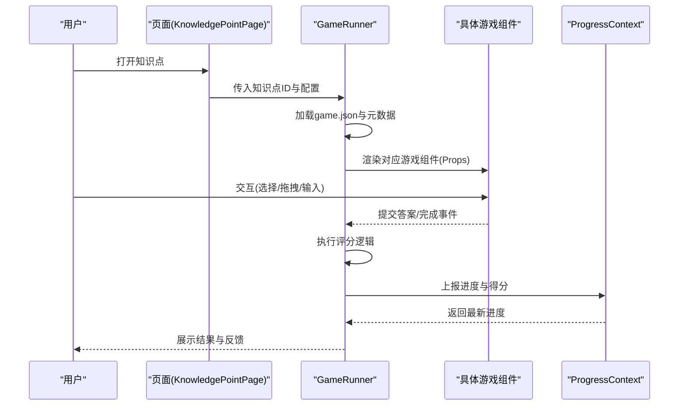
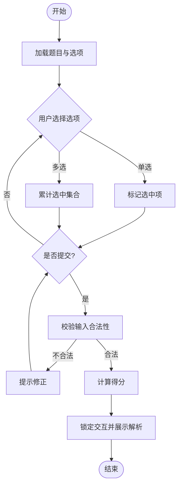
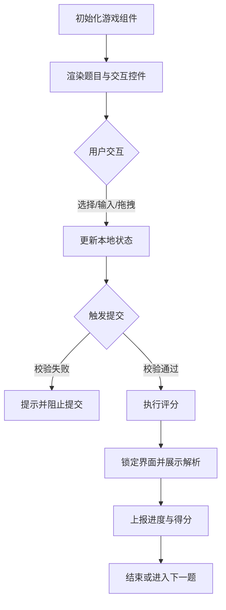
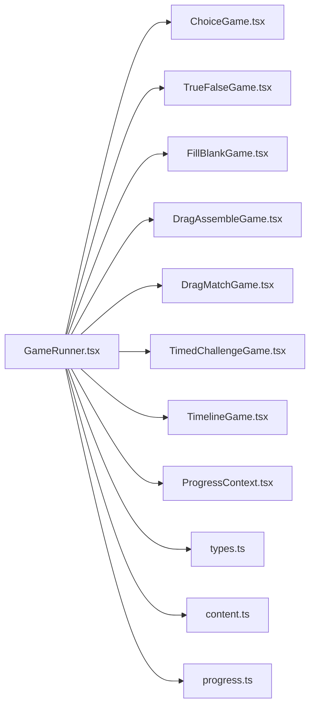

# 现有游戏实现模式

<cite>
**本文引用的文件**   
- [GameRunner.tsx](file://src/components/GameRunner.tsx)
- [ChoiceGame.tsx](file://src/components/games/ChoiceGame.tsx)
- [DragAssembleGame.tsx](file://src/components/games/DragAssembleGame.tsx)
- [DragMatchGame.tsx](file://src/components/games/DragMatchGame.tsx)
- [FillBlankGame.tsx](file://src/components/games/FillBlankGame.tsx)
- [TimedChallengeGame.tsx](file://src/components/games/TimedChallengeGame.tsx)
- [TimelineGame.tsx](file://src/components/games/TimelineGame.tsx)
- [TrueFalseGame.tsx](file://src/components/games/TrueFalseGame.tsx)
- [ProgressContext.tsx](file://src/context/ProgressContext.tsx)
- [types.ts](file://src/lib/types.ts)
- [content.ts](file://src/lib/content.ts)
- [progress.ts](file://src/lib/progress.ts)
- [KnowledgePointPage.tsx](file://src/pages/KnowledgePointPage.tsx)
- [GradePage.tsx](file://src/pages/GradePage.tsx)
- [HomePage.tsx](file://src/pages/HomePage.tsx)
- [index.json](file://src/content/index.json)
</cite>

## 目录
1. [简介](#简介)
2. [项目结构](#项目结构)
3. [核心组件](#核心组件)
4. [架构总览](#架构总览)
5. [详细组件分析](#详细组件分析)
6. [依赖关系分析](#依赖关系分析)
7. [性能考量](#性能考量)
8. [故障排查指南](#故障排查指南)
9. [结论](#结论)
10. [附录](#附录)

## 简介
本文件系统化梳理 math-k6 项目中所有内置数学游戏的实现模式与设计原则，重点覆盖：
- 统一的游戏状态管理、用户交互处理与评分逻辑
- 各类游戏（选择题、判断题、拖拽组装、拖拽匹配、填空题、限时挑战、时间线排序）的特定实现细节
- 游戏组件的 Props 接口、事件回调与状态更新机制
- 代码复用策略与最佳实践
- 常见问题解决方案与性能优化建议

目标读者包括前端开发者、内容编辑与教学产品负责人，帮助快速理解并扩展新的游戏类型。

## 项目结构
项目采用“按功能分层 + 内容驱动”的组织方式：
- components/games：各游戏类型的具体实现
- components：通用容器与编排器（如 GameRunner）
- context：全局进度上下文（ProgressContext）
- lib：类型定义、内容与进度工具
- pages：页面路由与知识点对接
- content：知识点数据（game.json、meta.json、explain.md 等）

图表来源
- [GameRunner.tsx](file://src/components/GameRunner.tsx)
- [ChoiceGame.tsx](file://src/components/games/ChoiceGame.tsx)
- [TrueFalseGame.tsx](file://src/components/games/TrueFalseGame.tsx)
- [FillBlankGame.tsx](file://src/components/games/FillBlankGame.tsx)
- [DragAssembleGame.tsx](file://src/components/games/DragAssembleGame.tsx)
- [DragMatchGame.tsx](file://src/components/games/DragMatchGame.tsx)
- [TimedChallengeGame.tsx](file://src/components/games/TimedChallengeGame.tsx)
- [TimelineGame.tsx](file://src/components/games/TimelineGame.tsx)
- [ProgressContext.tsx](file://src/context/ProgressContext.tsx)
- [types.ts](file://src/lib/types.ts)
- [content.ts](file://src/lib/content.ts)
- [progress.ts](file://src/lib/progress.ts)
- [KnowledgePointPage.tsx](file://src/pages/KnowledgePointPage.tsx)
- [GradePage.tsx](file://src/pages/GradePage.tsx)
- [HomePage.tsx](file://src/pages/HomePage.tsx)
- [index.json](file://src/content/index.json)

章节来源
- [GameRunner.tsx](file://src/components/GameRunner.tsx)
- [ProgressContext.tsx](file://src/context/ProgressContext.tsx)
- [types.ts](file://src/lib/types.ts)
- [content.ts](file://src/lib/content.ts)
- [progress.ts](file://src/lib/progress.ts)
- [KnowledgePointPage.tsx](file://src/pages/KnowledgePointPage.tsx)
- [GradePage.tsx](file://src/pages/GradePage.tsx)
- [HomePage.tsx](file://src/pages/HomePage.tsx)
- [index.json](file://src/content/index.json)

## 核心组件
- GameRunner：统一加载知识点内容、选择并渲染具体游戏组件、聚合进度上报与结果统计。负责生命周期控制、错误边界与重试逻辑。
- ProgressContext：提供跨组件的进度读写能力，支持持久化与增量更新。
- types：统一定义题目、选项、答案、评分规则、游戏配置等类型契约。
- content：解析与缓存知识点内容（含 game.json），提供按需加载与降级策略。
- progress：封装进度计算、去重、合并与导出。

章节来源
- [GameRunner.tsx](file://src/components/GameRunner.tsx)
- [ProgressContext.tsx](file://src/context/ProgressContext.tsx)
- [types.ts](file://src/lib/types.ts)
- [content.ts](file://src/lib/content.ts)
- [progress.ts](file://src/lib/progress.ts)

## 架构总览
整体采用“内容驱动 + 组件编排”的模式：
- 页面层根据年级/知识点选择对应的 game.json 配置
- GameRunner 读取配置并实例化对应游戏组件
- 游戏组件通过统一的 Props 接口接收题目与校验规则，内部维护本地交互状态
- 提交时由 GameRunner 调用评分函数，汇总结果并通过 ProgressContext 上报

图表来源
- [GameRunner.tsx](file://src/components/GameRunner.tsx)
- [ProgressContext.tsx](file://src/context/ProgressContext.tsx)
- [types.ts](file://src/lib/types.ts)
- [content.ts](file://src/lib/content.ts)
- [progress.ts](file://src/lib/progress.ts)

## 详细组件分析

### 通用模式与统一接口
- 统一 Props 约定
  - 题目数据：题干、选项、正确答案或判定规则
  - 交互状态：当前选择、已提交、是否允许修改、提示消息
  - 回调接口：onSubmit、onScore、onRetry、onComplete
- 统一状态管理
  - 本地状态：用于即时反馈（选中项、输入值、拖拽位置）
  - 提交后状态：锁定交互、显示解析与正确率
- 统一评分逻辑
  - 单项题：精确匹配或容差比较
  - 多步题：逐项打分并加权汇总
  - 时间相关：用时惩罚或阈值判定
- 统一错误处理
  - 输入校验失败提示
  - 网络或资源加载失败的降级与重试

章节来源
- [types.ts](file://src/lib/types.ts)
- [GameRunner.tsx](file://src/components/GameRunner.tsx)

### 选择题游戏 ChoiceGame
- 选项处理
  - 单选/多选模式切换
  - 选项顺序打乱与稳定标识
  - 禁用重复选择与非法提交
- 交互逻辑
  - 点击选择高亮，支持撤销
  - 提交后锁定选项并展示解析
- 评分逻辑
  - 完全正确得满分，部分正确按比例计分
  - 支持容错（忽略大小写、空白符）

图表来源
- [ChoiceGame.tsx](file://src/components/games/ChoiceGame.tsx)
- [types.ts](file://src/lib/types.ts)

章节来源
- [ChoiceGame.tsx](file://src/components/games/ChoiceGame.tsx)
- [types.ts](file://src/lib/types.ts)

### 判断题 TrueFalseGame
- 交互逻辑
  - 二选一（对/错），支持快速切换
  - 提交后即时反馈
- 评分逻辑
  - 严格匹配布尔值
  - 可配置容错（如“正确/错误”文本归一化）

章节来源
- [TrueFalseGame.tsx](file://src/components/games/TrueFalseGame.tsx)
- [types.ts](file://src/lib/types.ts)

### 填空题 FillBlankGame
- 输入验证
  - 空值检测、格式校验（数字、单位、范围）
  - 多空格与大小写归一化
- 交互逻辑
  - 单空/多空支持，Tab 导航
  - 实时校验与提交前二次确认
- 评分逻辑
  - 数值容差（绝对误差/相对误差）
  - 字符串模糊匹配（同义词、单位换算）

章节来源
- [FillBlankGame.tsx](file://src/components/games/FillBlankGame.tsx)
- [types.ts](file://src/lib/types.ts)

### 拖拽组装 DragAssembleGame
- 交互逻辑
  - 拖拽源与放置区绑定
  - 防抖与碰撞检测，避免重叠
  - 支持撤销与重置
- 评分逻辑
  - 序列比对（顺序敏感/不敏感）
  - 部分正确奖励（按命中比例计分）

章节来源
- [DragAssembleGame.tsx](file://src/components/games/DragAssembleGame.tsx)
- [types.ts](file://src/lib/types.ts)

### 拖拽匹配 DragMatchGame
- 交互逻辑
  - 左右两列配对，连线或拖放匹配
  - 冲突解决（一个目标仅接受一次匹配）
- 评分逻辑
  - 成对匹配计数
  - 支持权重（难度不同项加权）

章节来源
- [DragMatchGame.tsx](file://src/components/games/DragMatchGame.tsx)
- [types.ts](file://src/lib/types.ts)

### 限时挑战 TimedChallengeGame
- 计时逻辑
  - 倒计时与暂停/恢复
  - 超时自动提交
- 评分逻辑
  - 基础分 + 用时奖励
  - 未完成扣分策略

章节来源
- [TimedChallengeGame.tsx](file://src/components/games/TimedChallengeGame.tsx)
- [types.ts](file://src/lib/types.ts)

### 时间线排序 TimelineGame
- 交互逻辑
  - 列表拖拽排序，支持键盘操作
  - 插入点预览与动画过渡
- 评分逻辑
  - 序列相似度（相邻逆序数或编辑距离）
  - 分段评分（关键节点优先）

章节来源
- [TimelineGame.tsx](file://src/components/games/TimelineGame.tsx)
- [types.ts](file://src/lib/types.ts)

### 概念性概览
以下流程图概括了所有游戏类型的共性流程，便于新增游戏类型时参考：

[此图为概念性流程，不直接映射到具体源码文件]

## 依赖关系分析
- 组件耦合
  - GameRunner 与具体游戏组件松耦合，通过统一 Props 接口解耦
  - 进度上报通过 ProgressContext 集中管理，避免重复逻辑
- 外部依赖
  - 内容加载依赖 content.ts 的解析与缓存
  - 类型约束集中在 types.ts，保证一致性
- 潜在循环依赖
  - 组件间无直接相互引用，均通过 GameRunner 编排，降低循环风险

图表来源
- [GameRunner.tsx](file://src/components/GameRunner.tsx)
- [ProgressContext.tsx](file://src/context/ProgressContext.tsx)
- [types.ts](file://src/lib/types.ts)
- [content.ts](file://src/lib/content.ts)
- [progress.ts](file://src/lib/progress.ts)

章节来源
- [GameRunner.tsx](file://src/components/GameRunner.tsx)
- [ProgressContext.tsx](file://src/context/ProgressContext.tsx)
- [types.ts](file://src/lib/types.ts)
- [content.ts](file://src/lib/content.ts)
- [progress.ts](file://src/lib/progress.ts)

## 性能考量
- 渲染优化
  - 使用 React.memo 包裹纯展示型子组件
  - 大列表拖拽场景采用虚拟滚动或分页加载
- 状态更新
  - 批量更新与受控/非受控状态分离，减少重渲染
  - 拖拽事件节流与防抖，避免频繁计算
- 内存与资源
  - 图片与可视化资源懒加载
  - 及时清理定时器与事件监听器
- 评分计算
  - 复杂评分逻辑预计算或缓存中间结果
  - 避免在渲染路径中进行昂贵计算

[本节为通用指导，不直接分析具体文件]

## 故障排查指南
- 常见错误
  - 题目数据缺失或字段类型不符：检查 game.json 结构与 types.ts 定义
  - 拖拽失效：确认事件冒泡与 z-index 层级
  - 计时异常：确保组件卸载时清除定时器
  - 进度未上报：检查 ProgressContext 的订阅与写入权限
- 调试建议
  - 在 GameRunner 中打印关键状态变化
  - 使用浏览器开发者工具的 Performance 面板定位卡顿
  - 针对拖拽与输入增加日志断点

章节来源
- [GameRunner.tsx](file://src/components/GameRunner.tsx)
- [ProgressContext.tsx](file://src/context/ProgressContext.tsx)
- [types.ts](file://src/lib/types.ts)

## 结论
math-k6 的游戏实现以统一接口与上下文为核心，将多样化交互抽象为一致的 Props 与事件模型，既保证了可扩展性，又提升了可维护性。通过内容驱动的架构，新增游戏类型只需遵循类型契约与评分规范即可无缝接入。建议在后续迭代中继续强化性能优化与错误边界，提升用户体验与稳定性。

[本节为总结性内容，不直接分析具体文件]

## 附录
- 最佳实践
  - 始终在组件内做输入校验，并在提交前进行二次确认
  - 将评分规则与业务逻辑解耦，便于测试与替换
  - 使用统一的错误码与提示文案，提升一致性
- 代码复用策略
  - 抽取通用 Hook（如 useTimer、useDragDrop、useValidation）
  - 将解析与反馈 UI 抽离为独立组件
  - 通过配置化参数驱动行为差异，减少分支判断

[本节为通用指导，不直接分析具体文件]