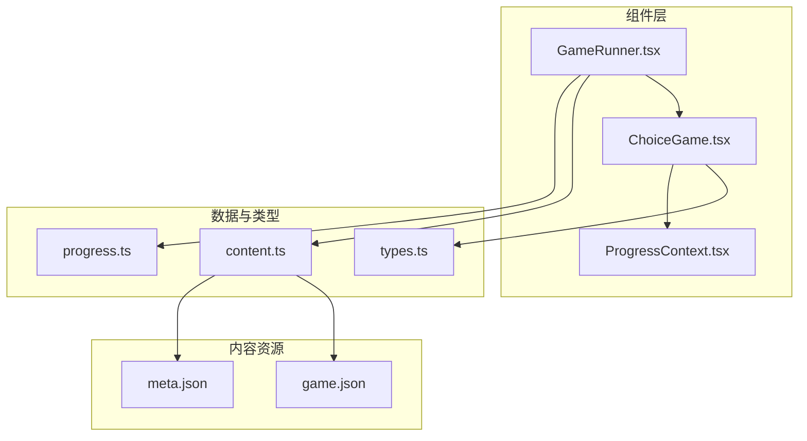
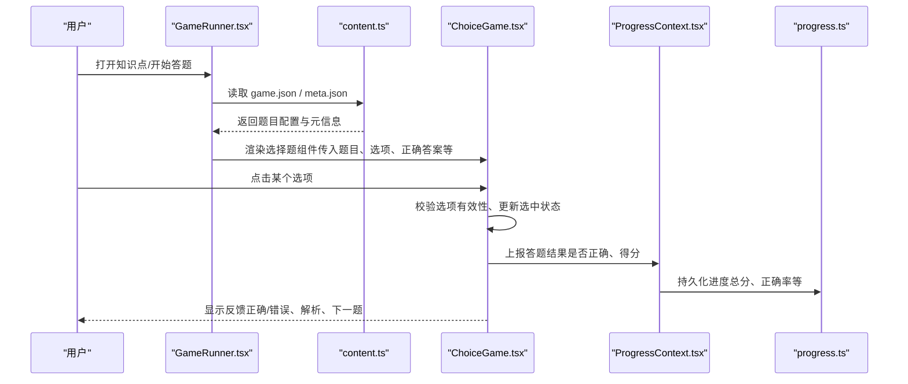
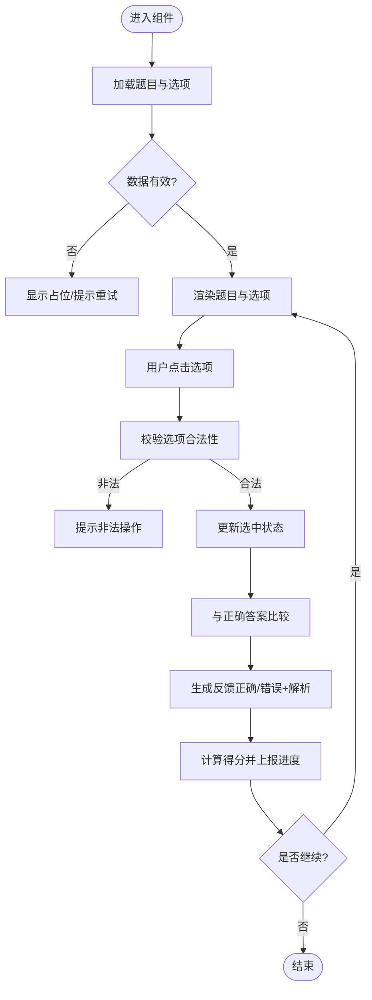
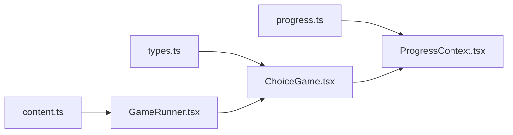

# 选择题游戏实现

<cite>
**本文引用的文件**
- [ChoiceGame.tsx](file://src/components/games/ChoiceGame.tsx)
- [GameRunner.tsx](file://src/components/GameRunner.tsx)
- [ProgressContext.tsx](file://src/context/ProgressContext.tsx)
- [types.ts](file://src/lib/types.ts)
- [content.ts](file://src/lib/content.ts)
- [progress.ts](file://src/lib/progress.ts)
- [game.json（示例：g3-add-sub-10000）](file://src/content/knowledge-points/g3-add-sub-10000/game.json)
- [meta.json（示例：g3-add-sub-10000）](file://src/content/knowledge-points/g3-add-sub-10000/meta.json)
</cite>

## 目录
1. [简介](#简介)
2. [项目结构](#项目结构)
3. [核心组件](#核心组件)
4. [架构总览](#架构总览)
5. [详细组件分析](#详细组件分析)
6. [依赖关系分析](#依赖关系分析)
7. [性能考虑](#性能考虑)
8. [故障排查指南](#故障排查指南)
9. [结论](#结论)
10. [附录](#附录)

## 简介
本文件为 math-k6 项目中“选择题游戏”的详细实现文档，聚焦 ChoiceGame 组件的架构设计、数据模型、用户交互流程与答案验证机制。文档同时覆盖 Props 接口定义、状态管理（当前选中项、答案反馈、评分计算）、错误处理与边界情况，并提供配置与使用示例路径，帮助开发者快速集成与扩展。

## 项目结构
- 组件层
  - src/components/games/ChoiceGame.tsx：选择题游戏的核心 UI 与交互逻辑
  - src/components/GameRunner.tsx：统一的游戏运行器，负责加载题目、驱动各题型组件
  - src/context/ProgressContext.tsx：学习进度上下文，提供答题记录与分数持久化能力
- 数据与类型
  - src/lib/types.ts：通用类型定义（如题目、选项、结果等）
  - src/lib/content.ts：内容加载与解析（读取 game.json、meta.json 等）
  - src/lib/progress.ts：进度存储与统计（本地缓存、聚合统计）
- 内容资源
  - src/content/knowledge-points/*/game.json：各知识点的题目配置（含题干、选项、正确答案、分值等）
  - src/content/knowledge-points/*/meta.json：知识点元信息（名称、年级、难度等）

图表来源
- [GameRunner.tsx](file://src/components/GameRunner.tsx)
- [ChoiceGame.tsx](file://src/components/games/ChoiceGame.tsx)
- [ProgressContext.tsx](file://src/context/ProgressContext.tsx)
- [types.ts](file://src/lib/types.ts)
- [content.ts](file://src/lib/content.ts)
- [progress.ts](file://src/lib/progress.ts)
- [game.json（示例：g3-add-sub-10000）](file://src/content/knowledge-points/g3-add-sub-10000/game.json)
- [meta.json（示例：g3-add-sub-10000）](file://src/content/knowledge-points/g3-add-sub-10000/meta.json)

章节来源
- [GameRunner.tsx](file://src/components/GameRunner.tsx)
- [ChoiceGame.tsx](file://src/components/games/ChoiceGame.tsx)
- [ProgressContext.tsx](file://src/context/ProgressContext.tsx)
- [types.ts](file://src/lib/types.ts)
- [content.ts](file://src/lib/content.ts)
- [progress.ts](file://src/lib/progress.ts)
- [game.json（示例：g3-add-sub-10000）](file://src/content/knowledge-points/g3-add-sub-10000/game.json)
- [meta.json（示例：g3-add-sub-10000）](file://src/content/knowledge-points/g3-add-sub-10000/meta.json)

## 核心组件
- ChoiceGame 组件
  - 职责：渲染单选题目、处理用户选择、即时反馈、计分与提交
  - 输入：通过 Props 接收题目、选项、正确答案、分值、是否已作答等
  - 输出：向父组件或上下文上报答题结果（正确/错误、得分、耗时等）
- GameRunner 运行器
  - 职责：按知识点加载题目集、驱动具体题型组件、汇总成绩并写入进度
- ProgressContext 进度上下文
  - 职责：维护答题历史、总分、正确率、完成度等，支持跨页面共享

章节来源
- [ChoiceGame.tsx](file://src/components/games/ChoiceGame.tsx)
- [GameRunner.tsx](file://src/components/GameRunner.tsx)
- [ProgressContext.tsx](file://src/context/ProgressContext.tsx)

## 架构总览
下图展示了从内容加载到答题反馈的整体流程：

图表来源
- [GameRunner.tsx](file://src/components/GameRunner.tsx)
- [content.ts](file://src/lib/content.ts)
- [ChoiceGame.tsx](file://src/components/games/ChoiceGame.tsx)
- [ProgressContext.tsx](file://src/context/ProgressContext.tsx)
- [progress.ts](file://src/lib/progress.ts)

## 详细组件分析

### ChoiceGame 组件
- 数据结构
  - 题目对象：包含题干、选项数组、正确答案索引或标识、分值、提示/解析等字段
  - 选项数组：每个选项包含文本、是否正确的标记、可选的图标/样式标识
  - 答案验证：将用户选择的选项与正确答案进行比对，判定对错并计算得分
- 用户交互
  - 点击选项：更新当前选中项，禁用重复选择（可选），立即给出反馈
  - 提交/下一题：在允许重选模式下，支持重新选择；否则锁定答案并进入下一题
- 状态管理
  - 当前选中项：记录用户本次选择的选项索引或 ID
  - 答案反馈：根据对比结果展示正确/错误状态及解析
  - 评分计算：基于分值与正确性累加总分，并更新进度上下文
- 错误处理与边界
  - 空题目/空选项：降级显示占位或跳过该题
  - 非法选项索引：忽略无效点击并提示
  - 重复提交：防止多次计分
  - 异步加载失败：回退默认题目或提示重试

图表来源
- [ChoiceGame.tsx](file://src/components/games/ChoiceGame.tsx)
- [types.ts](file://src/lib/types.ts)
- [progress.ts](file://src/lib/progress.ts)

章节来源
- [ChoiceGame.tsx](file://src/components/games/ChoiceGame.tsx)
- [types.ts](file://src/lib/types.ts)
- [progress.ts](file://src/lib/progress.ts)

### Props 接口定义（选择题）
- 题目内容
  - 题干：字符串或富文本
  - 选项数组：每项包含文本、正确标记、可选样式
  - 正确答案：索引或唯一标识
  - 分值：数字，用于计分
  - 解析：答错时展示的说明
- 交互控制
  - 是否可重选：布尔值，控制是否允许更改答案
  - 是否自动提交：布尔值，选择后立即提交
  - 禁用状态：整体禁用或单项禁用
- 回调与事件
  - 提交回调：返回答题结果（正确/错误、得分、耗时）
  - 变更回调：选中项变化时的通知
- 其他
  - 主题/样式：颜色、字体、布局参数
  - 无障碍：ARIA 标签、键盘导航支持

章节来源
- [ChoiceGame.tsx](file://src/components/games/ChoiceGame.tsx)
- [types.ts](file://src/lib/types.ts)

### 用户交互处理逻辑
- 点击选项：
  - 若未禁用且未提交，则更新选中项
  - 若启用自动提交，则立即进入验证与反馈流程
- 提交答案：
  - 校验选项合法性
  - 与正确答案比对，生成反馈
  - 计算得分并上报进度上下文
- 下一题：
  - 若存在后续题目，则加载并渲染下一题
  - 若无后续题目，则结束并汇总成绩

章节来源
- [ChoiceGame.tsx](file://src/components/games/ChoiceGame.tsx)
- [ProgressContext.tsx](file://src/context/ProgressContext.tsx)

### 答案验证机制
- 验证步骤：
  - 检查用户选择是否为空
  - 将用户选择与正确答案进行比对（索引或标识）
  - 生成反馈（正确/错误）与解析
- 计分规则：
  - 正确：累加分值
  - 错误：不加分或按策略扣分（取决于配置）
- 进度更新：
  - 记录答题结果、耗时、累计分数与正确率

章节来源
- [ChoiceGame.tsx](file://src/components/games/ChoiceGame.tsx)
- [progress.ts](file://src/lib/progress.ts)

### 状态管理机制
- 当前选中项：
  - 由组件内部状态维护，受交互事件更新
- 答案反馈：
  - 根据验证结果设置反馈状态（正确/错误/待确认）
- 评分计算：
  - 基于分值与正确性累加，并通过上下文持久化

章节来源
- [ChoiceGame.tsx](file://src/components/games/ChoiceGame.tsx)
- [ProgressContext.tsx](file://src/context/ProgressContext.tsx)

### 配置与使用示例
- 配置题目（game.json）：
  - 包含题干、选项数组、正确答案、分值、解析等字段
  - 参考路径：[game.json（示例：g3-add-sub-10000）](file://src/content/knowledge-points/g3-add-sub-10000/game.json)
- 元信息（meta.json）：
  - 包含知识点名称、年级、难度等
  - 参考路径：[meta.json（示例：g3-add-sub-10000）](file://src/content/knowledge-points/g3-add-sub-10000/meta.json)
- 在运行器中使用：
  - GameRunner 加载 content.ts 提供的数据，并将题目传递给 ChoiceGame
  - 参考路径：[GameRunner.tsx](file://src/components/GameRunner.tsx)、[content.ts](file://src/lib/content.ts)

章节来源
- [game.json（示例：g3-add-sub-10000）](file://src/content/knowledge-points/g3-add-sub-10000/game.json)
- [meta.json（示例：g3-add-sub-10000）](file://src/content/knowledge-points/g3-add-sub-10000/meta.json)
- [GameRunner.tsx](file://src/components/GameRunner.tsx)
- [content.ts](file://src/lib/content.ts)

## 依赖关系分析
- ChoiceGame 依赖 types.ts 中的类型定义，确保数据结构一致
- GameRunner 依赖 content.ts 加载题目数据，依赖 progress.ts 更新进度
- ProgressContext 提供全局进度状态，供多个组件共享

图表来源
- [types.ts](file://src/lib/types.ts)
- [content.ts](file://src/lib/content.ts)
- [progress.ts](file://src/lib/progress.ts)
- [GameRunner.tsx](file://src/components/GameRunner.tsx)
- [ChoiceGame.tsx](file://src/components/games/ChoiceGame.tsx)
- [ProgressContext.tsx](file://src/context/ProgressContext.tsx)

章节来源
- [types.ts](file://src/lib/types.ts)
- [content.ts](file://src/lib/content.ts)
- [progress.ts](file://src/lib/progress.ts)
- [GameRunner.tsx](file://src/components/GameRunner.tsx)
- [ChoiceGame.tsx](file://src/components/games/ChoiceGame.tsx)
- [ProgressContext.tsx](file://src/context/ProgressContext.tsx)

## 性能考虑
- 避免不必要的重渲染：对选项列表与题目数据进行不可变更新
- 延迟加载：仅在需要时加载题目与解析，减少初始渲染开销
- 防抖与节流：对频繁的用户交互（如快速点击）进行保护
- 内存管理：及时释放不再使用的临时状态与监听器

## 故障排查指南
- 常见问题
  - 题目为空或选项缺失：检查 game.json 结构与必填字段
  - 无法提交答案：确认是否启用自动提交或手动提交逻辑
  - 分数不更新：检查进度上下文与持久化逻辑是否正常
  - 重复计分：确保提交后锁定答案或增加幂等校验
- 调试建议
  - 打印关键状态（选中项、正确答案、反馈状态）
  - 断点验证数据流（content.ts 加载、progress.ts 更新）
  - 使用浏览器开发者工具观察网络请求与本地存储

章节来源
- [ChoiceGame.tsx](file://src/components/games/ChoiceGame.tsx)
- [content.ts](file://src/lib/content.ts)
- [progress.ts](file://src/lib/progress.ts)
- [ProgressContext.tsx](file://src/context/ProgressContext.tsx)

## 结论
ChoiceGame 组件以清晰的数据结构与交互流程实现了选择题游戏的核心功能。通过统一的 Props 接口、健壮的状态管理与完善的错误处理，组件具备良好的可扩展性与可维护性。结合 GameRunner 与 ProgressContext，整个系统能够高效地加载题目、驱动答题、记录进度，为用户提供流畅的学习体验。

## 附录
- 最佳实践
  - 保持数据结构稳定，新增字段时向后兼容
  - 对用户输入进行严格校验，避免非法状态
  - 提供清晰的反馈与解析，提升学习效果
  - 编写单元测试覆盖关键路径（验证、计分、进度更新）