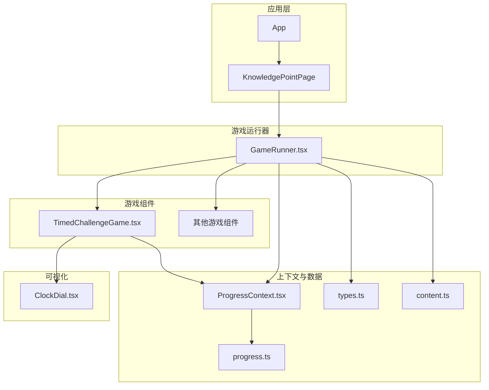
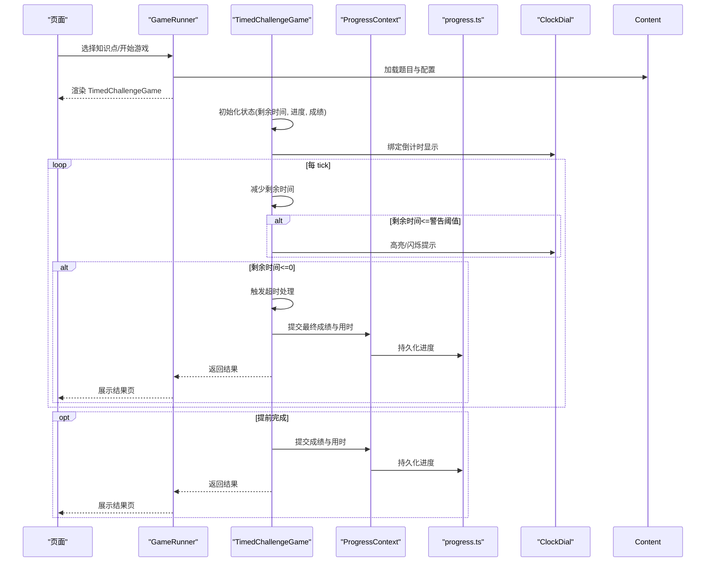
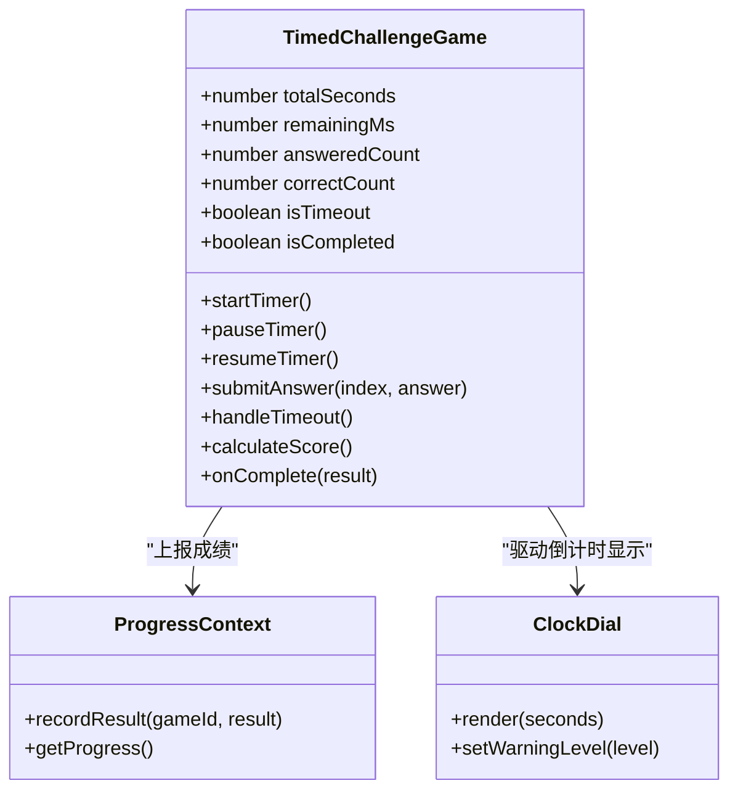
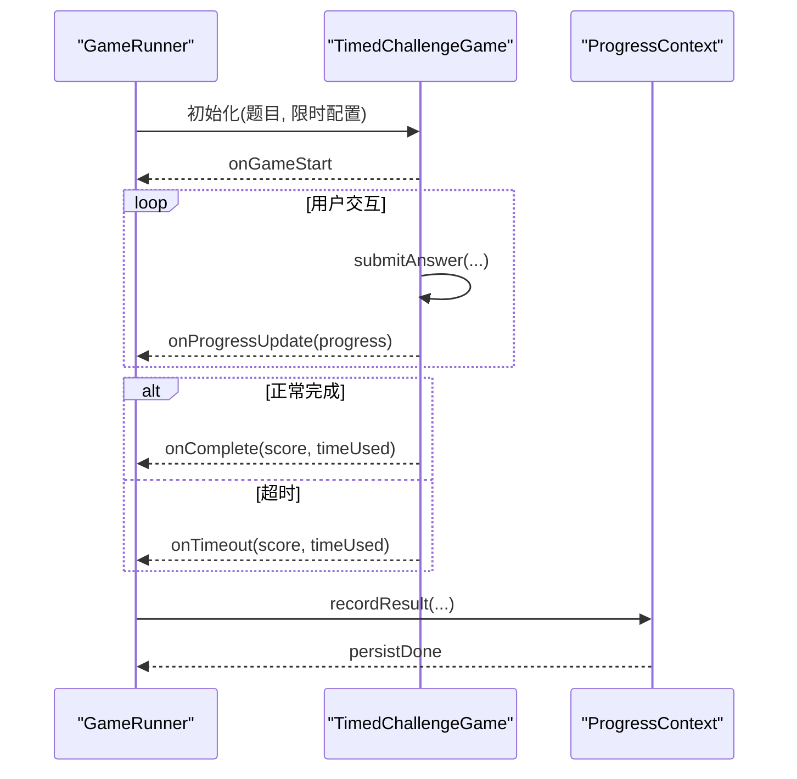
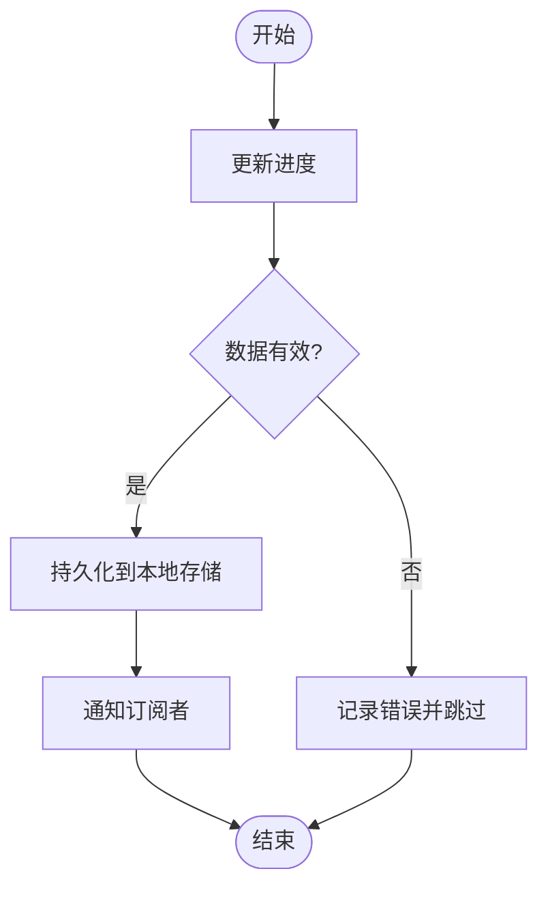
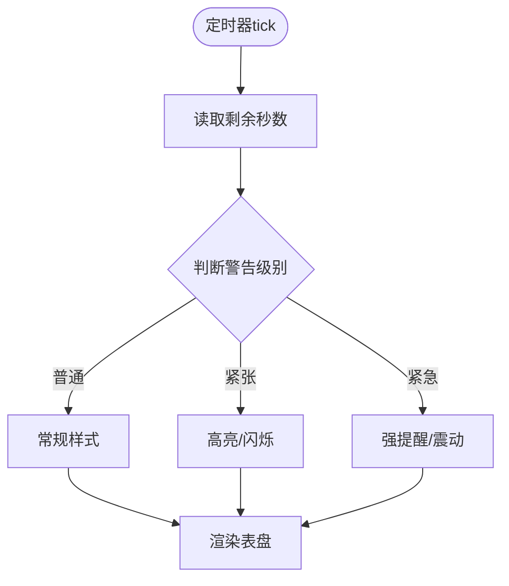
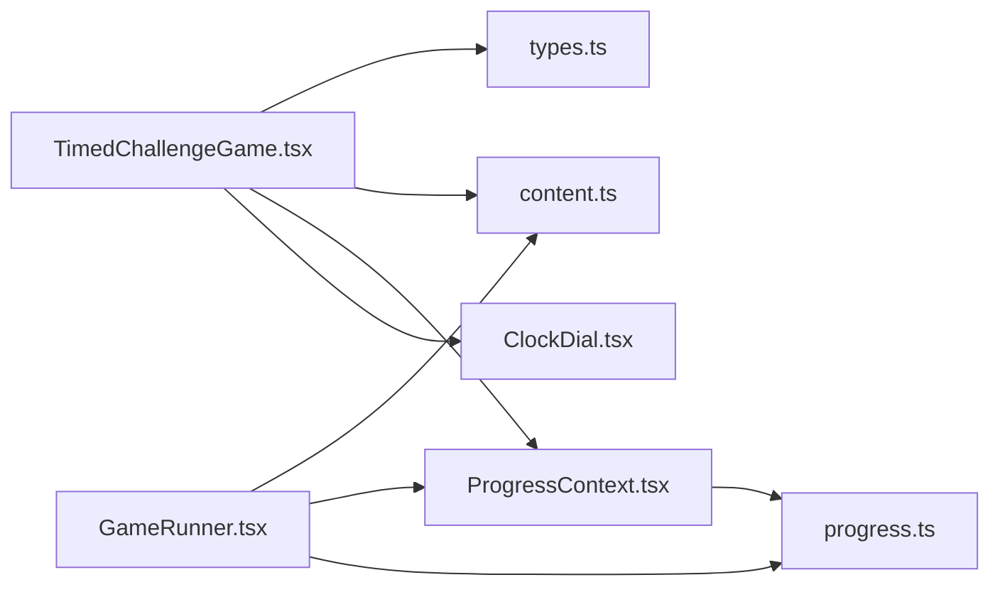

# 限时挑战游戏实现

<cite>
**本文引用的文件**   
- [TimedChallengeGame.tsx](file://src/components/games/TimedChallengeGame.tsx)
- [GameRunner.tsx](file://src/components/GameRunner.tsx)
- [ProgressContext.tsx](file://src/context/ProgressContext.tsx)
- [types.ts](file://src/lib/types.ts)
- [content.ts](file://src/lib/content.ts)
- [progress.ts](file://src/lib/progress.ts)
- [ClockDial.tsx](file://src/visualizations/ClockDial.tsx)
- [README.md](file://README.md)
</cite>

## 目录
1. [简介](#简介)
2. [项目结构](#项目结构)
3. [核心组件](#核心组件)
4. [架构总览](#架构总览)
5. [详细组件分析](#详细组件分析)
6. [依赖关系分析](#依赖关系分析)
7. [性能考虑](#性能考虑)
8. [故障排查指南](#故障排查指南)
9. [结论](#结论)
10. [附录](#附录)

## 简介
本文件为 math-k6 项目的“限时挑战游戏”提供完整实现文档，聚焦 TimedChallengeGame 组件的时间管理机制、状态管理、用户交互与结果展示，并给出不同难度级别的限时配置示例。同时说明与游戏引擎（GameRunner）的集成方式与扩展点，以及性能优化建议（定时器精度、内存管理等）。

## 项目结构
限时挑战游戏位于 components/games 目录下，由 GameRunner 统一调度，进度通过 ProgressContext 集中管理，类型定义在 lib/types.ts，内容加载在 lib/content.ts，进度持久化在 lib/progress.ts。可视化时钟使用 visualizations/ClockDial.tsx。

图表来源
- [GameRunner.tsx](file://src/components/GameRunner.tsx)
- [TimedChallengeGame.tsx](file://src/components/games/TimedChallengeGame.tsx)
- [ProgressContext.tsx](file://src/context/ProgressContext.tsx)
- [types.ts](file://src/lib/types.ts)
- [content.ts](file://src/lib/content.ts)
- [progress.ts](file://src/lib/progress.ts)
- [ClockDial.tsx](file://src/visualizations/ClockDial.tsx)

章节来源
- [README.md](file://README.md)

## 核心组件
- TimedChallengeGame：实现限时答题的核心逻辑，包括倒计时、时间警告、超时处理、答题进度与成绩计算。
- GameRunner：负责加载题目、驱动游戏生命周期、汇总成绩并上报进度。
- ProgressContext：全局进度上下文，保存答题记录、分数、用时等。
- types.ts：定义题目、游戏配置、成绩等类型。
- content.ts：按知识点加载题目与配置。
- progress.ts：本地存储与进度持久化。
- ClockDial：可视化倒计时表盘。

章节来源
- [TimedChallengeGame.tsx](file://src/components/games/TimedChallengeGame.tsx)
- [GameRunner.tsx](file://src/components/GameRunner.tsx)
- [ProgressContext.tsx](file://src/context/ProgressContext.tsx)
- [types.ts](file://src/lib/types.ts)
- [content.ts](file://src/lib/content.ts)
- [progress.ts](file://src/lib/progress.ts)
- [ClockDial.tsx](file://src/visualizations/ClockDial.tsx)

## 架构总览
限时挑战游戏的整体流程如下：
- GameRunner 根据当前知识点加载题目与配置（包含难度与限时参数）。
- 渲染 TimedChallengeGame，传入题目列表、限时配置与回调。
- TimedChallengeGame 内部维护剩余时间、已答题数、正确数、是否已超时等状态。
- 使用高精度定时器驱动倒计时；当进入低阈值时触发视觉与交互提示。
- 用户作答后更新进度与成绩；若未全部完成且时间耗尽则触发超时处理。
- 完成后将成绩与用时写入 ProgressContext，并由 progress.ts 持久化。

图表来源
- [GameRunner.tsx](file://src/components/GameRunner.tsx)
- [TimedChallengeGame.tsx](file://src/components/games/TimedChallengeGame.tsx)
- [ProgressContext.tsx](file://src/context/ProgressContext.tsx)
- [progress.ts](file://src/lib/progress.ts)
- [ClockDial.tsx](file://src/visualizations/ClockDial.tsx)

## 详细组件分析

### TimedChallengeGame 组件
职责与能力
- 时间管理：设置总时长、启动/暂停/恢复倒计时、精确到毫秒级的剩余时间更新。
- 状态管理：剩余时间、已答题数、正确数、错误数、是否已超时、是否已完成。
- 用户交互：时间警告（颜色变化、震动或音效）、紧急答题（最后阶段禁用非关键操作）、结果展示（得分、用时、正确率）。
- 成绩计算：基于正确数与总题数计算得分，结合用时进行加权或评级。
- 集成点：向 GameRunner 报告开始、完成、超时事件；从 ProgressContext 读写进度。

时间管理机制
- 倒计时器实现：使用高精度定时器（如 requestAnimationFrame 或 setInterval 配合时间戳校正），避免累积误差。
- 时间限制设置：支持从配置中读取不同难度对应的秒数，并在组件挂载时初始化。
- 超时处理：到达零时停止计时、锁定输入、计算最终成绩并上报。

状态管理要点
- 剩余时间：以毫秒为单位存储，渲染时转换为分:秒格式。
- 答题进度：记录每道题的作答状态（未答/已答/正确/错误）。
- 成绩计算：基础分=正确数×分值；可加入用时系数（用时越短加分越高）；总分上限与等级划分。

用户交互设计
- 时间警告：剩余时间低于阈值（如 30s、10s、5s）触发视觉与可选声音提示。
- 紧急答题：最后阶段自动放大倒计时、禁用无关按钮，提升专注度。
- 结果展示：展示得分、用时、正确率、每题耗时分布（可选）。

图表来源
- [TimedChallengeGame.tsx](file://src/components/games/TimedChallengeGame.tsx)
- [ProgressContext.tsx](file://src/context/ProgressContext.tsx)
- [ClockDial.tsx](file://src/visualizations/ClockDial.tsx)

章节来源
- [TimedChallengeGame.tsx](file://src/components/games/TimedChallengeGame.tsx)

### GameRunner 与 TimedChallengeGame 的集成
- 加载配置：根据知识点元数据与 game.json 中的难度与限时参数，构造 TimedChallengeGame 所需配置。
- 生命周期：控制开始、暂停、结束、重试等状态，确保定时器在组件卸载时清理。
- 结果汇总：收集各题作答与用时，生成最终成绩并写入 ProgressContext。

图表来源
- [GameRunner.tsx](file://src/components/GameRunner.tsx)
- [TimedChallengeGame.tsx](file://src/components/games/TimedChallengeGame.tsx)
- [ProgressContext.tsx](file://src/context/ProgressContext.tsx)

章节来源
- [GameRunner.tsx](file://src/components/GameRunner.tsx)

### 进度与持久化
- ProgressContext：集中管理答题记录、分数、用时、历史趋势。
- progress.ts：将进度序列化到本地存储（如 localStorage），支持跨会话恢复。

图表来源
- [ProgressContext.tsx](file://src/context/ProgressContext.tsx)
- [progress.ts](file://src/lib/progress.ts)

章节来源
- [ProgressContext.tsx](file://src/context/ProgressContext.tsx)
- [progress.ts](file://src/lib/progress.ts)

### 可视化倒计时
- ClockDial：根据剩余秒数绘制表盘指针/刻度，支持警告级别（普通、紧张、紧急）的视觉反馈。
- 与 TimedChallengeGame 联动：每帧更新显示，并在低阈值时切换样式。

图表来源
- [ClockDial.tsx](file://src/visualizations/ClockDial.tsx)
- [TimedChallengeGame.tsx](file://src/components/games/TimedChallengeGame.tsx)

章节来源
- [ClockDial.tsx](file://src/visualizations/ClockDial.tsx)

## 依赖关系分析
- TimedChallengeGame 依赖：
  - types.ts：题目与配置类型约束。
  - content.ts：题目与配置加载。
  - ProgressContext：进度上报与读取。
  - ClockDial：倒计时可视化。
- GameRunner 依赖：
  - content.ts：按知识点加载内容。
  - ProgressContext：统一进度管理。
  - progress.ts：持久化。
- 耦合与内聚：
  - TimedChallengeGame 与 GameRunner 通过回调接口解耦，便于替换计时策略或扩展新题型。
  - ProgressContext 作为单一事实源，避免分散状态导致不一致。

图表来源
- [TimedChallengeGame.tsx](file://src/components/games/TimedChallengeGame.tsx)
- [GameRunner.tsx](file://src/components/GameRunner.tsx)
- [types.ts](file://src/lib/types.ts)
- [content.ts](file://src/lib/content.ts)
- [ProgressContext.tsx](file://src/context/ProgressContext.tsx)
- [progress.ts](file://src/lib/progress.ts)
- [ClockDial.tsx](file://src/visualizations/ClockDial.tsx)

章节来源
- [types.ts](file://src/lib/types.ts)
- [content.ts](file://src/lib/content.ts)
- [ProgressContext.tsx](file://src/context/ProgressContext.tsx)
- [progress.ts](file://src/lib/progress.ts)

## 性能考虑
- 定时器精度
  - 优先使用 requestAnimationFrame 或高精度时间戳校正，避免 setInterval 漂移。
  - 对低频 UI 更新做节流（例如每 100ms 更新一次 DOM），降低重绘压力。
- 内存管理
  - 组件卸载时务必清除所有定时器与事件监听，防止泄漏。
  - 大数组（题目列表、历史记录）按需加载与分页渲染。
- 渲染优化
  - 使用 React.memo/shouldComponentUpdate 减少不必要的重渲染。
  - 将倒计时状态提升到最小必要范围，避免全树更新。
- I/O 与持久化
  - 批量合并进度写入，避免频繁写盘。
  - 异步持久化，不阻塞主线程。

[本节为通用指导，无需特定文件引用]

## 故障排查指南
常见问题与定位
- 倒计时不准确
  - 检查定时器实现是否使用时间戳校正，是否存在多次启动导致的叠加。
  - 确认组件卸载时清除了定时器。
- 进度未持久化
  - 检查 ProgressContext 的 recordResult 调用时机与参数。
  - 查看 progress.ts 的序列化与存储权限。
- 结果异常
  - 核对成绩计算公式与用时系数。
  - 确认超时分支是否正确统计已答题与正确数。

调试建议
- 在 TimedChallengeGame 的关键路径添加日志（开始、tick、警告、提交、超时、完成）。
- 使用浏览器性能面板观察定时器频率与渲染开销。
- 模拟极端场景（快速作答、长时间停顿、网络延迟）验证稳定性。

章节来源
- [TimedChallengeGame.tsx](file://src/components/games/TimedChallengeGame.tsx)
- [ProgressContext.tsx](file://src/context/ProgressContext.tsx)
- [progress.ts](file://src/lib/progress.ts)

## 结论
TimedChallengeGame 通过清晰的状态管理与高精度计时机制，实现了稳定可靠的限时挑战体验。与 GameRunner、ProgressContext 和 ClockDial 的协作确保了可扩展性与良好的用户体验。遵循本文的性能与排错建议，可在复杂场景下保持流畅与准确。

[本节为总结性内容，无需特定文件引用]

## 附录

### 不同难度级别的限时配置示例
以下为常见难度与推荐限时（单位：秒）参考值，具体数值可根据题目数量与复杂度调整：
- 简单：每题约 30–60 秒，总时长 = 题数 × 单题时长
- 中等：每题约 20–40 秒，总时长 = 题数 × 单题时长
- 困难：每题约 10–20 秒，总时长 = 题数 × 单题时长
- 极速挑战：每题约 5–10 秒，总时长 = 题数 × 单题时长

章节来源
- [types.ts](file://src/lib/types.ts)
- [content.ts](file://src/lib/content.ts)

### 与游戏引擎的集成与扩展点
- 扩展新题型：在 components/games 新增组件，实现与 TimedChallengeGame 相同的回调接口（开始、进度、完成、超时）。
- 自定义计时策略：替换 TimedChallengeGame 内部的定时器实现，保持对外 API 不变。
- 扩展评分规则：在 calculateScore 中增加用时系数、连击奖励、难度权重等。
- 扩展可视化：为 ClockDial 增加更多样式与动画，或在结果页增加图表。

章节来源
- [TimedChallengeGame.tsx](file://src/components/games/TimedChallengeGame.tsx)
- [GameRunner.tsx](file://src/components/GameRunner.tsx)
- [ClockDial.tsx](file://src/visualizations/ClockDial.tsx)