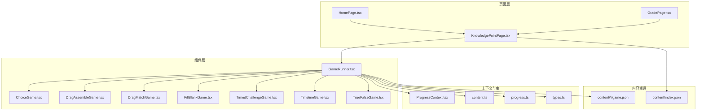
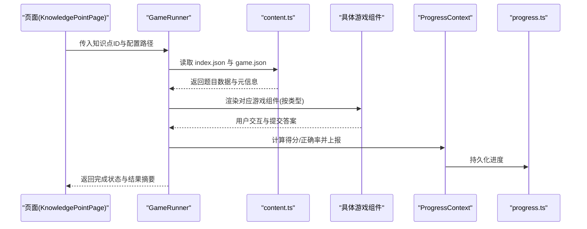
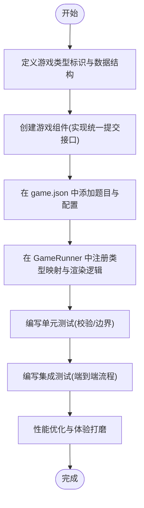
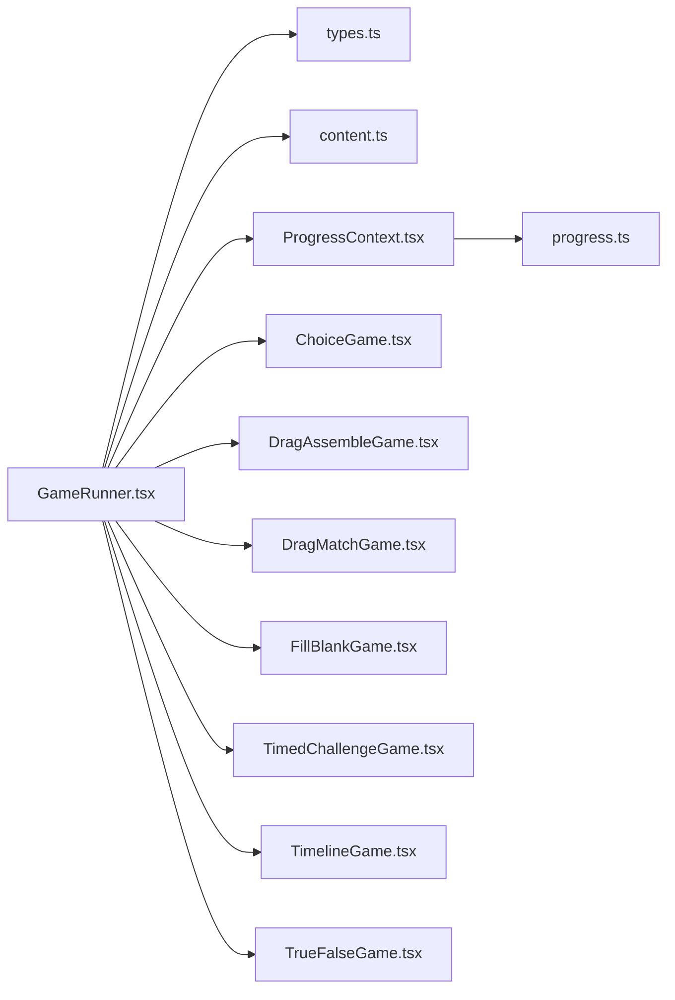

# 自定义游戏开发

<cite>
**本文引用的文件**   
- [GameRunner.tsx](file://src/components/GameRunner.tsx)
- [ChoiceGame.tsx](file://src/components/games/ChoiceGame.tsx)
- [DragAssembleGame.tsx](file://src/components/games/DragAssembleGame.tsx)
- [DragMatchGame.tsx](file://src/components/games/DragMatchGame.tsx)
- [FillBlankGame.tsx](file://src/components/games/FillBlankGame.tsx)
- [TimedChallengeGame.tsx](file://src/components/games/TimedChallengeGame.tsx)
- [TimelineGame.tsx](file://src/components/games/TimelineGame.tsx)
- [TrueFalseGame.tsx](file://src/components/games/TrueFalseGame.tsx)
- [ProgressContext.tsx](file://src/context/ProgressContext.tsx)
- [content.ts](file://src/lib/content.ts)
- [progress.ts](file://src/lib/progress.ts)
- [types.ts](file://src/lib/types.ts)
- [gameRunner.test.ts](file://src/test/gameRunner.test.ts)
- [content.test.ts](file://src/test/content.test.ts)
- [progress.test.ts](file://src/test/progress.test.ts)
- [setup.ts](file://src/test/setup.ts)
- [KnowledgePointPage.tsx](file://src/pages/KnowledgePointPage.tsx)
- [HomePage.tsx](file://src/pages/HomePage.tsx)
- [GradePage.tsx](file://src/pages/GradePage.tsx)
- [index.json](file://src/content/index.json)
</cite>

## 目录
1. [简介](#简介)
2. [项目结构](#项目结构)
3. [核心组件](#核心组件)
4. [架构总览](#架构总览)
5. [详细组件分析](#详细组件分析)
6. [依赖分析](#依赖分析)
7. [性能考虑](#性能考虑)
8. [故障排查指南](#故障排查指南)
9. [结论](#结论)
10. [附录](#附录)

## 简介
本指南面向希望在 math-k6 项目中创建“自定义游戏类型”的开发者。内容涵盖：
- 全新游戏类型的组件结构设计、接口定义与与 GameRunner 的集成方式
- 游戏配置文件（game.json）的格式规范与必需字段，包括题目数据、答案验证逻辑和用户反馈设置
- 游戏状态管理最佳实践：本地状态与全局状态的协调
- 测试策略：单元测试与集成测试的实现方法
- 性能优化技巧与用户体验设计原则
- 完整示例与常见问题解决方案

## 项目结构
math-k6 采用“按功能域组织”的结构：
- src/components/games：各具体游戏实现（选择题、拖拽匹配、填空、时间挑战等）
- src/components/GameRunner.tsx：统一的游戏运行器，负责加载配置、渲染游戏、收集结果并上报进度
- src/context/ProgressContext.tsx：全局学习进度上下文
- src/lib/*：通用库（内容加载、进度持久化、类型定义）
- src/pages/*：页面路由与入口（首页、年级页、知识点页）
- src/content/*：知识点内容与 game.json 配置
- src/test/*：测试用例与测试环境初始化

图表来源
- [GameRunner.tsx](file://src/components/GameRunner.tsx)
- [ChoiceGame.tsx](file://src/components/games/ChoiceGame.tsx)
- [DragAssembleGame.tsx](file://src/components/games/DragAssembleGame.tsx)
- [DragMatchGame.tsx](file://src/components/games/DragMatchGame.tsx)
- [FillBlankGame.tsx](file://src/components/games/FillBlankGame.tsx)
- [TimedChallengeGame.tsx](file://src/components/games/TimedChallengeGame.tsx)
- [TimelineGame.tsx](file://src/components/games/TimelineGame.tsx)
- [TrueFalseGame.tsx](file://src/components/games/TrueFalseGame.tsx)
- [ProgressContext.tsx](file://src/context/ProgressContext.tsx)
- [content.ts](file://src/lib/content.ts)
- [progress.ts](file://src/lib/progress.ts)
- [types.ts](file://src/lib/types.ts)
- [index.json](file://src/content/index.json)

章节来源
- [GameRunner.tsx](file://src/components/GameRunner.tsx)
- [ProgressContext.tsx](file://src/context/ProgressContext.tsx)
- [content.ts](file://src/lib/content.ts)
- [progress.ts](file://src/lib/progress.ts)
- [types.ts](file://src/lib/types.ts)
- [index.json](file://src/content/index.json)

## 核心组件
- GameRunner：统一加载 game.json，根据类型渲染对应游戏组件，维护答题流程、计时、提交与结果上报。
- 各游戏组件：实现具体题型交互与校验逻辑，向 GameRunner 暴露统一的提交接口。
- ProgressContext：提供全局学习进度读写能力，供 GameRunner 在答题完成后更新。
- content.ts / progress.ts / types.ts：分别负责内容解析、进度持久化与类型约束。

章节来源
- [GameRunner.tsx](file://src/components/GameRunner.tsx)
- [ProgressContext.tsx](file://src/context/ProgressContext.tsx)
- [content.ts](file://src/lib/content.ts)
- [progress.ts](file://src/lib/progress.ts)
- [types.ts](file://src/lib/types.ts)

## 架构总览
下图展示了从页面到游戏运行器的调用链路与数据流。

图表来源
- [KnowledgePointPage.tsx](file://src/pages/KnowledgePointPage.tsx)
- [GameRunner.tsx](file://src/components/GameRunner.tsx)
- [content.ts](file://src/lib/content.ts)
- [ProgressContext.tsx](file://src/context/ProgressContext.tsx)
- [progress.ts](file://src/lib/progress.ts)

## 详细组件分析

### GameRunner 集成要点
- 职责
  - 解析并缓存 game.json 配置
  - 根据配置中的游戏类型选择渲染对应组件
  - 管理答题生命周期（开始、进行中、提交、结算）
  - 将结果写入全局进度上下文
- 关键约定
  - 每个游戏组件需实现统一的提交接口（如 onAnswerSubmit），返回标准化结果对象
  - 支持可选的计时、提示、重试、难度等扩展字段
- 错误处理
  - 配置缺失或格式错误时回退到默认提示
  - 网络或异步加载失败时提供重试机制

章节来源
- [GameRunner.tsx](file://src/components/GameRunner.tsx)

### 游戏组件接口与数据结构
- 统一接口建议
  - 输入 props：题目数据、主题样式、回调函数（提交、重置、获取当前状态）
  - 输出事件：onAnswerSubmit(answer, metadata)
  - 内部状态：是否已提交、是否正确、剩余时间、提示次数等
- 数据结构建议
  - 题目数组：包含题干、选项/填空项、正确答案、解析、难度、分值等
  - 元数据：游戏名称、说明、允许重试、是否计时、计分规则等
- 校验与反馈
  - 即时校验（输入时）与提交校验（点击提交时）两种模式
  - 反馈文案可配置，支持多语言占位符

章节来源
- [types.ts](file://src/lib/types.ts)
- [content.ts](file://src/lib/content.ts)

### 各游戏组件概览
- 选择题（ChoiceGame）
  - 单选/多选；支持随机打乱选项；即时反馈与解析展示
- 拖拽组装（DragAssembleGame）
  - 拖放排序/拼接；边界校验与撤销操作
- 拖拽匹配（DragMatchGame）
  - 左右列匹配；连线或拖放配对；错误高亮
- 填空题（FillBlankGame）
  - 多空格输入；模糊匹配与单位容错；提示与纠错
- 限时挑战（TimedChallengeGame）
  - 倒计时、暂停/继续、超时自动提交；成绩与用时统计
- 时间线（TimelineGame）
  - 事件排序；历史顺序校验；可视化时间轴
- 判断题（TrueFalseGame）
  - 快速判断；批量提交；正确率统计

章节来源
- [ChoiceGame.tsx](file://src/components/games/ChoiceGame.tsx)
- [DragAssembleGame.tsx](file://src/components/games/DragAssembleGame.tsx)
- [DragMatchGame.tsx](file://src/components/games/DragMatchGame.tsx)
- [FillBlankGame.tsx](file://src/components/games/FillBlankGame.tsx)
- [TimedChallengeGame.tsx](file://src/components/games/TimedChallengeGame.tsx)
- [TimelineGame.tsx](file://src/components/games/TimelineGame.tsx)
- [TrueFalseGame.tsx](file://src/components/games/TrueFalseGame.tsx)

### 游戏配置文件（game.json）规范
- 必需字段
  - type：游戏类型标识（如 choice、drag_assemble、fill_blank 等）
  - title：游戏标题
  - description：简要说明
  - questions：题目数组，每项包含题干、答案、解析、难度、分值等
  - scoring：计分规则（每题分值、总分、是否允许部分得分）
  - feedback：用户反馈配置（成功/失败文案、提示语、是否显示解析）
  - options：运行时选项（是否计时、时长、是否允许重试、是否打乱顺序）
- 推荐字段
  - hints：提示策略（首次提示、二次提示、最终提示）
  - accessibility：无障碍相关（读屏文本、键盘导航）
  - analytics：埋点键值（用于数据分析）
- 校验与降级
  - 缺少必需字段时应给出明确错误提示
  - 对 questions 进行最小化校验（非空、类型正确）

章节来源
- [content.ts](file://src/lib/content.ts)
- [types.ts](file://src/lib/types.ts)

### 状态管理最佳实践
- 本地状态（组件内）
  - 仅保存 UI 与交互所需的状态（当前题号、已选答案、计时器等）
  - 避免跨组件共享复杂状态
- 全局状态（上下文）
  - 使用 ProgressContext 统一管理学习进度、得分、完成度
  - 通过 action 更新，确保不可变更新与幂等性
- 协调策略
  - 组件提交后触发 onAnswerSubmit，GameRunner 汇总结果并调用 ProgressContext
  - 进度持久化由 progress.ts 负责，避免重复写入

章节来源
- [ProgressContext.tsx](file://src/context/ProgressContext.tsx)
- [progress.ts](file://src/lib/progress.ts)

### 测试策略
- 单元测试
  - 针对 content.ts 的内容解析与校验
  - 针对 progress.ts 的进度计算与持久化
  - 针对各游戏组件的答案校验与边界条件
- 集成测试
  - 模拟 GameRunner 加载配置、渲染组件、提交答案、更新进度的完整流程
- 测试工具与环境
  - 使用 setup.ts 初始化测试环境（Mock DOM、定时器、存储）
  - 断言覆盖：正常路径、异常路径、边界值

章节来源
- [content.test.ts](file://src/test/content.test.ts)
- [progress.test.ts](file://src/test/progress.test.ts)
- [gameRunner.test.ts](file://src/test/gameRunner.test.ts)
- [setup.ts](file://src/test/setup.ts)

### 新增游戏类型步骤（示例流程）

图表来源
- [GameRunner.tsx](file://src/components/GameRunner.tsx)
- [types.ts](file://src/lib/types.ts)
- [content.ts](file://src/lib/content.ts)

## 依赖分析
- 组件耦合
  - GameRunner 与各游戏组件为松耦合，通过统一接口通信
  - 进度上下文与持久化库解耦，便于替换存储后端
- 外部依赖
  - 内容加载依赖文件系统/静态资源
  - 进度持久化依赖浏览器存储或后端 API（可扩展）

图表来源
- [GameRunner.tsx](file://src/components/GameRunner.tsx)
- [types.ts](file://src/lib/types.ts)
- [content.ts](file://src/lib/content.ts)
- [ProgressContext.tsx](file://src/context/ProgressContext.tsx)
- [progress.ts](file://src/lib/progress.ts)
- [ChoiceGame.tsx](file://src/components/games/ChoiceGame.tsx)
- [DragAssembleGame.tsx](file://src/components/games/DragAssembleGame.tsx)
- [DragMatchGame.tsx](file://src/components/games/DragMatchGame.tsx)
- [FillBlankGame.tsx](file://src/components/games/FillBlankGame.tsx)
- [TimedChallengeGame.tsx](file://src/components/games/TimedChallengeGame.tsx)
- [TimelineGame.tsx](file://src/components/games/TimelineGame.tsx)
- [TrueFalseGame.tsx](file://src/components/games/TrueFalseGame.tsx)

章节来源
- [GameRunner.tsx](file://src/components/GameRunner.tsx)
- [types.ts](file://src/lib/types.ts)
- [content.ts](file://src/lib/content.ts)
- [ProgressContext.tsx](file://src/context/ProgressContext.tsx)
- [progress.ts](file://src/lib/progress.ts)

## 性能考虑
- 渲染优化
  - 对长列表题目使用虚拟滚动或分页加载
  - 避免在高频交互中创建新对象（复用常量、memo 化子组件）
- 计算优化
  - 答案校验尽量纯函数化，必要时缓存中间结果
  - 计时器使用 requestAnimationFrame 或节流策略
- I/O 优化
  - 合并多次进度写入，减少存储写频率
  - 预加载常用 game.json 与解析结果
- 内存与体积
  - 按需加载大型可视化组件
  - 移除未使用的依赖与调试代码

[本节为通用指导，不直接分析具体文件]

## 故障排查指南
- 常见错误
  - game.json 缺少必需字段：检查 schema 校验与默认值回退
  - 题目数据格式不一致：统一类型定义与解析函数
  - 进度未更新：确认 ProgressContext 的 action 被调用且参数正确
  - 计时异常：检查定时器清理与边界条件
- 调试建议
  - 在 GameRunner 中打印关键生命周期日志
  - 使用浏览器开发者工具观察状态变化
  - 通过测试用例复现问题路径

章节来源
- [gameRunner.test.ts](file://src/test/gameRunner.test.ts)
- [content.test.ts](file://src/test/content.test.ts)
- [progress.test.ts](file://src/test/progress.test.ts)
- [setup.ts](file://src/test/setup.ts)

## 结论
通过统一的 GameRunner 与标准化的游戏组件接口，math-k6 能够以低耦合、高扩展的方式支持多种游戏类型。配合清晰的 game.json 配置、完善的测试与性能优化策略，开发者可以快速构建高质量的学习型互动游戏。

[本节为总结性内容，不直接分析具体文件]

## 附录
- 快速上手清单
  - 定义类型与数据结构（types.ts）
  - 创建游戏组件（实现提交接口）
  - 编写 game.json（题目与配置）
  - 在 GameRunner 中注册类型映射
  - 编写单测与集成测试
  - 性能优化与用户体验打磨
- 参考页面
  - 首页、年级页、知识点页作为入口，引导至 GameRunner

章节来源
- [HomePage.tsx](file://src/pages/HomePage.tsx)
- [GradePage.tsx](file://src/pages/GradePage.tsx)
- [KnowledgePointPage.tsx](file://src/pages/KnowledgePointPage.tsx)
- [index.json](file://src/content/index.json)