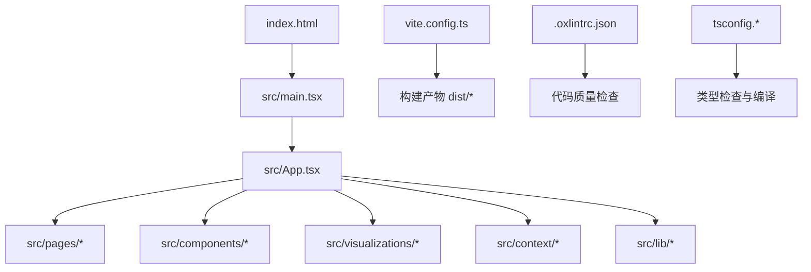
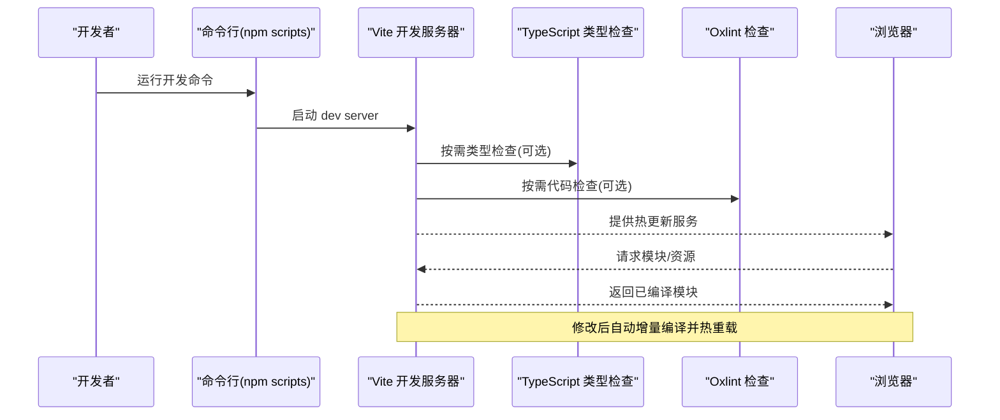
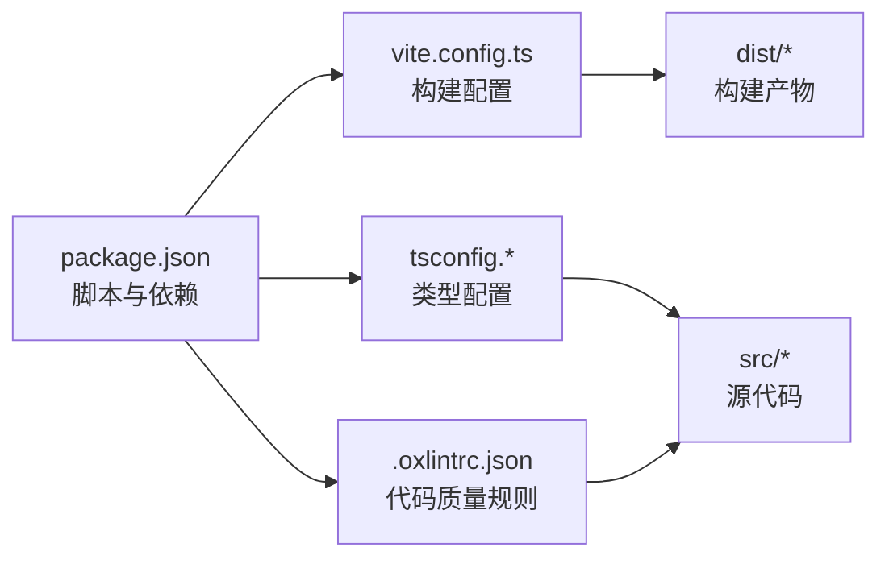

# 环境搭建与配置

<cite>
**本文引用的文件**
- [package.json](file://package.json)
- [vite.config.ts](file://vite.config.ts)
- [tsconfig.json](file://tsconfig.json)
- [tsconfig.app.json](file://tsconfig.app.json)
- [tsconfig.node.json](file://tsconfig.node.json)
- [.oxlintrc.json](file://.oxlintrc.json)
- [index.html](file://index.html)
- [README.md](file://README.md)
</cite>

## 目录
1. [简介](#简介)
2. [项目结构](#项目结构)
3. [核心组件](#核心组件)
4. [架构总览](#架构总览)
5. [详细组件分析](#详细组件分析)
6. [依赖分析](#依赖分析)
7. [性能考虑](#性能考虑)
8. [故障排查指南](#故障排查指南)
9. [结论](#结论)
10. [附录](#附录)

## 简介
本指南面向 math-k6 项目的开发与部署，目标是帮助你在本地快速完成环境搭建、理解构建与类型检查配置、掌握开发服务器与生产构建命令，并提供常见问题解决方案与调试技巧。内容覆盖 Node.js 版本要求、依赖安装、Vite 构建配置、TypeScript 配置选项、代码质量检查工具（Oxlint）配置、开发服务器与热重载、以及生产环境打包流程。

## 项目结构
math-k6 是一个基于 Vite + TypeScript + React 的前端项目，采用模块化目录组织：
- src：源代码目录，包含页面、组件、可视化模块、内容与状态管理等
- public：静态资源目录
- index.html：应用入口 HTML
- vite.config.ts：Vite 构建配置
- tsconfig.*：TypeScript 多项目配置
- .oxlintrc.json：Oxlint 代码质量规则
- package.json：脚本与依赖声明
- README.md：项目说明

图表来源
- [index.html:1-20](file://index.html#L1-L20)
- [vite.config.ts:1-60](file://vite.config.ts#L1-L60)
- [tsconfig.json:1-40](file://tsconfig.json#L1-L40)
- [.oxlintrc.json:1-40](file://.oxlintrc.json#L1-L40)

章节来源
- [README.md:1-50](file://README.md#L1-L50)

## 核心组件
- 构建系统：Vite（开发服务器、热重载、按需编译、生产优化）
- 语言与类型：TypeScript（多 tsconfig 分离前端与 Node 工具链）
- 代码质量：Oxlint（统一 ESLint 替代方案，高性能）
- 包管理：npm/yarn/pnpm（通过 package.json 脚本驱动）

章节来源
- [package.json:1-120](file://package.json#L1-L120)
- [vite.config.ts:1-60](file://vite.config.ts#L1-L60)
- [tsconfig.json:1-40](file://tsconfig.json#L1-L40)
- [.oxlintrc.json:1-40](file://.oxlintrc.json#L1-L40)

## 架构总览
下图展示了从源码到构建产物的整体流程，以及开发服务器与热重载的工作方式。

图表来源
- [package.json:1-120](file://package.json#L1-L120)
- [vite.config.ts:1-60](file://vite.config.ts#L1-L60)

## 详细组件分析

### Node.js 版本与环境准备
- 建议的 Node.js 版本：根据现代 Vite 生态，推荐使用 LTS 版本（如 18.x 或 20.x）。若遇到兼容性问题，请切换至匹配的 LTS。
- 包管理器：可使用 npm、yarn 或 pnpm。本项目通过 package.json 中的脚本统一管理命令。
- 环境变量：如需自定义端口或代理，可通过环境变量注入（例如在 package.json 脚本中设置或直接使用 .env 文件）。

章节来源
- [package.json:1-120](file://package.json#L1-L120)

### 依赖安装步骤
- 在项目根目录执行依赖安装命令（根据你的包管理器选择其一）：
  - npm install
  - yarn install
  - pnpm install
- 安装完成后，确保 node_modules 生成且无报错。

章节来源
- [package.json:1-120](file://package.json#L1-L120)

### 项目启动流程与开发服务器
- 启动开发服务器：
  - npm run dev
  - 该命令会启动 Vite 开发服务器，启用热重载与增量编译。
- 访问地址：默认监听 localhost:5173（具体以终端输出为准）。
- 热重载：修改 src 下的任意源文件，浏览器将自动刷新对应模块。

章节来源
- [package.json:1-120](file://package.json#L1-L120)
- [vite.config.ts:1-60](file://vite.config.ts#L1-L60)

### Vite 构建配置要点
- 入口与目标：Vite 默认以 index.html 为入口，构建产物输出到 dist 目录。
- 插件与优化：可根据需要添加插件（如路径别名、压缩、图片处理等）。
- 代理与跨域：开发阶段可配置 proxy，解决后端接口跨域问题。
- 环境变量：支持通过 import.meta.env 读取 .env 文件中的变量。

章节来源
- [vite.config.ts:1-60](file://vite.config.ts#L1-L60)
- [index.html:1-20](file://index.html#L1-L20)

### TypeScript 配置选项
- 多项目配置：
  - tsconfig.json：共享基础配置
  - tsconfig.app.json：前端应用编译选项（DOM、React JSX 等）
  - tsconfig.node.json：Node 工具链编译选项（CommonJS/ESM 等）
- 关键选项：
  - target：目标 ECMAScript 版本
  - module：模块系统（ESNext/NodeNext 等）
  - jsx：React JSX 模式（react-jsx）
  - strict：严格类型检查开关
  - paths：路径别名（如 @/src）
  - include/exclude：控制参与编译的文件范围

章节来源
- [tsconfig.json:1-40](file://tsconfig.json#L1-L40)
- [tsconfig.app.json:1-60](file://tsconfig.app.json#L1-L60)
- [tsconfig.node.json:1-60](file://tsconfig.node.json#L1-L60)

### 代码质量检查工具（Oxlint）
- Oxlint 是高性能的 lint 工具，配置文件位于 .oxlintrc.json。
- 常用命令：
  - npm run lint 或 npm run lint:fix（自动修复部分问题）
- 规则定制：可在 .oxlintrc.json 中启用/禁用规则，或引入预设规则集。

章节来源
- [.oxlintrc.json:1-40](file://.oxlintrc.json#L1-L40)
- [package.json:1-120](file://package.json#L1-L120)

### 生产环境构建命令
- 构建命令：
  - npm run build
- 预览构建产物：
  - npm run preview
- 产物位置：dist 目录，可直接部署到静态托管服务（如 Vercel、Netlify、GitHub Pages 等）。

章节来源
- [package.json:1-120](file://package.json#L1-L120)

## 依赖分析
下图展示主要依赖关系与职责划分。

图表来源
- [package.json:1-120](file://package.json#L1-L120)
- [vite.config.ts:1-60](file://vite.config.ts#L1-L60)
- [tsconfig.json:1-40](file://tsconfig.json#L1-L40)
- [.oxlintrc.json:1-40](file://.oxlintrc.json#L1-L40)

章节来源
- [package.json:1-120](file://package.json#L1-L120)

## 性能考虑
- 开发体验：
  - 使用 Vite 的按需编译与热重载，避免全量重建。
  - 合理拆分路由与组件，减少首屏体积。
- 构建优化：
  - 开启代码分割与 Tree Shaking（Vite 默认启用）。
  - 按需引入第三方库，避免全量导入。
  - 图片与字体等资源进行压缩与懒加载。
- 类型检查与 Lint：
  - 在 CI 中并行执行类型检查与 Lint，缩短反馈时间。
  - 使用增量检查与缓存提升速度。

[本节为通用指导，不直接分析具体文件]

## 故障排查指南
- 无法启动开发服务器：
  - 确认 Node.js 版本符合 Vite 要求（推荐 LTS）。
  - 清理缓存后重试：删除 node_modules 与锁文件，重新安装依赖。
  - 检查端口占用（默认 5173），必要时在 vite.config.ts 中修改端口。
- 类型检查失败：
  - 检查 tsconfig 的 target/module/jsx 是否匹配你的运行时与框架。
  - 确认路径别名与 include/exclude 配置正确。
- Lint 报错过多：
  - 先运行自动修复命令，再逐步手动修正剩余问题。
  - 调整 .oxlintrc.json 规则，避免与团队规范冲突。
- 构建失败：
  - 查看控制台错误定位具体模块或资源。
  - 检查是否有未解析的依赖或路径错误。
  - 尝试关闭某些插件或优化项以定位问题。

章节来源
- [package.json:1-120](file://package.json#L1-L120)
- [vite.config.ts:1-60](file://vite.config.ts#L1-L60)
- [tsconfig.json:1-40](file://tsconfig.json#L1-L40)
- [.oxlintrc.json:1-40](file://.oxlintrc.json#L1-L40)

## 结论
通过本指南，你应能顺利完成 math-k6 的环境搭建、理解 Vite 与 TypeScript 的配置要点、掌握开发服务器与生产构建命令，并使用 Oxlint 保障代码质量。遇到问题时，可参考故障排查指南快速定位与解决。建议在团队协作中统一 Node.js 版本与包管理器，并在 CI 中集成类型检查与 Lint，以提升交付质量与效率。

[本节为总结性内容，不直接分析具体文件]

## 附录
- 常用命令速查：
  - 安装依赖：npm install / yarn install / pnpm install
  - 启动开发：npm run dev
  - 类型检查：npm run type-check（如有）
  - 代码检查：npm run lint / npm run lint:fix
  - 构建产物：npm run build
  - 预览产物：npm run preview
- 配置文件作用一览：
  - package.json：脚本与依赖声明
  - vite.config.ts：Vite 构建与开发服务器配置
  - tsconfig.*：TypeScript 多项目类型配置
  - .oxlintrc.json：Oxlint 代码质量规则
  - index.html：应用入口 HTML

章节来源
- [package.json:1-120](file://package.json#L1-L120)
- [vite.config.ts:1-60](file://vite.config.ts#L1-L60)
- [tsconfig.json:1-40](file://tsconfig.json#L1-L40)
- [tsconfig.app.json:1-60](file://tsconfig.app.json#L1-L60)
- [tsconfig.node.json:1-60](file://tsconfig.node.json#L1-L60)
- [.oxlintrc.json:1-40](file://.oxlintrc.json#L1-L40)
- [index.html:1-20](file://index.html#L1-L20)