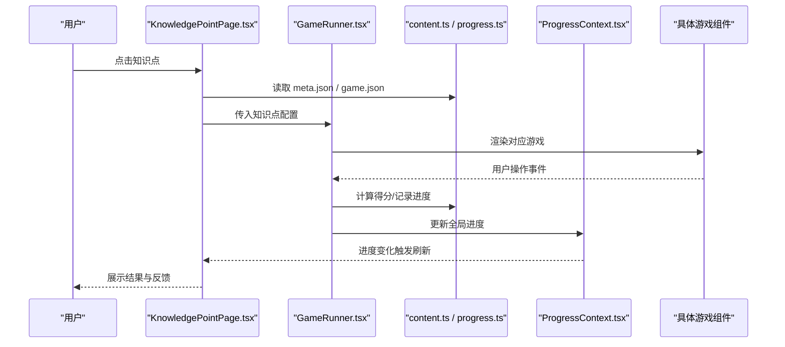
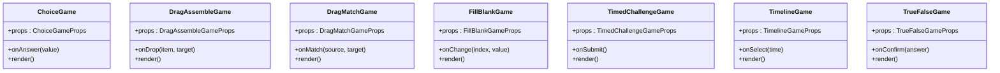
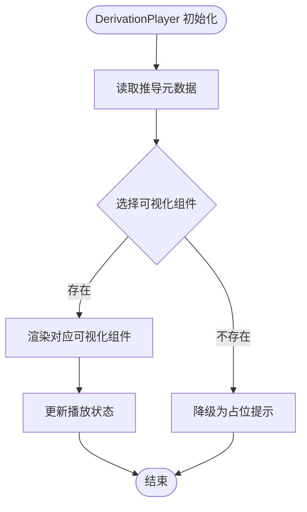
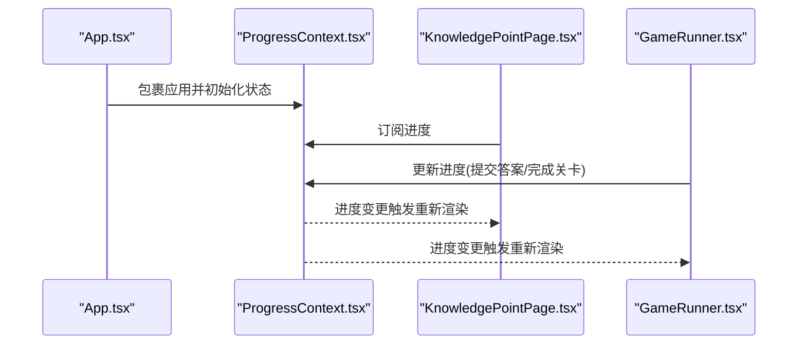
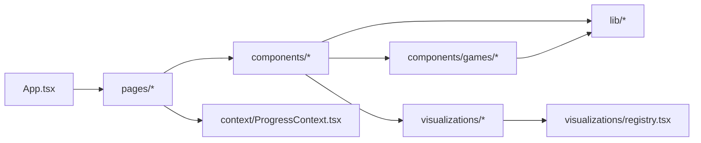

# 组件开发规范

<cite>
**本文引用的文件**   
- [App.tsx](file://src/App.tsx)
- [main.tsx](file://src/main.tsx)
- [index.css](file://src/index.css)
- [GameRunner.tsx](file://src/components/GameRunner.tsx)
- [Layout.tsx](file://src/components/Layout.tsx)
- [DerivationPlayer.tsx](file://src/components/DerivationPlayer.tsx)
- [KnowledgePoint.tsx](file://src/components/KnowledgePoint.tsx)
- [ChoiceGame.tsx](file://src/components/games/ChoiceGame.tsx)
- [DragAssembleGame.tsx](file://src/components/games/DragAssembleGame.tsx)
- [DragMatchGame.tsx](file://src/components/games/DragMatchGame.tsx)
- [FillBlankGame.tsx](file://src/components/games/FillBlankGame.tsx)
- [TimedChallengeGame.tsx](file://src/components/games/TimedChallengeGame.tsx)
- [TimelineGame.tsx](file://src/components/games/TimelineGame.tsx)
- [TrueFalseGame.tsx](file://src/components/games/TrueFalseGame.tsx)
- [ProgressContext.tsx](file://src/context/ProgressContext.tsx)
- [content.ts](file://src/lib/content.ts)
- [progress.ts](file://src/lib/progress.ts)
- [types.ts](file://src/lib/types.ts)
- [HomePage.tsx](file://src/pages/HomePage.tsx)
- [GradePage.tsx](file://src/pages/GradePage.tsx)
- [KnowledgePointPage.tsx](file://src/pages/KnowledgePointPage.tsx)
- [ProgressDashboard.tsx](file://src/pages/ProgressDashboard.tsx)
- [AreaGrid.tsx](file://src/visualizations/AreaGrid.tsx)
- [BalanceScale.tsx](file://src/visualizations/BalanceScale.tsx)
- [BarChart.tsx](file://src/visualizations/BarChart.tsx)
- [CircleUnroll.tsx](file://src/visualizations/CircleUnroll.tsx)
- [ClockDial.tsx](file://src/visualizations/ClockDial.tsx)
- [ConeModel.tsx](file://src/visualizations/ConeModel.tsx)
- [CoordinateGrid.tsx](file://src/visualizations/CoordinateGrid.tsx)
- [CuboidModel.tsx](file://src/visualizations/CuboidModel.tsx)
- [CylinderModel.tsx](file://src/visualizations/CylinderModel.tsx)
- [FractionPie.tsx](file://src/visualizations/FractionPie.tsx)
- [NumberLine.tsx](file://src/visualizations/NumberLine.tsx)
- [PieChart.tsx](file://src/visualizations/PieChart.tsx)
- [PlaceValueChart.tsx](file://src/visualizations/PlaceValueChart.tsx)
- [ProbabilityModel.tsx](file://src/visualizations/ProbabilityModel.tsx)
- [Protractor.tsx](file://src/visualizations/Protractor.tsx)
- [ShapeTransform.tsx](file://src/visualizations/ShapeTransform.tsx)
- [registry.tsx](file://src/visualizations/registry.tsx)
- [content.test.ts](file://src/test/content.test.ts)
- [gameRunner.test.ts](file://src/test/gameRunner.test.ts)
- [progress.test.ts](file://src/test/progress.test.ts)
- [setup.ts](file://src/test/setup.ts)
</cite>

## 目录
1. [简介](#简介)
2. [项目结构](#项目结构)
3. [核心组件](#核心组件)
4. [架构总览](#架构总览)
5. [详细组件分析](#详细组件分析)
6. [依赖关系分析](#依赖关系分析)
7. [性能考虑](#性能考虑)
8. [故障排查指南](#故障排查指南)
9. [结论](#结论)
10. [附录](#附录)

## 简介
本规范面向 math-k6 项目的 React + TypeScript 组件开发，目标是统一组件设计原则、类型定义、状态管理（含 Context API）、Props 接口与事件处理、副作用管理、可复用组件模式与组合策略、测试方法与性能优化，以及样式组织与 CSS 模块化实践。文档基于仓库现有结构与实现进行提炼，确保规范可直接落地到各知识点游戏与可视化组件的开发中。

## 项目结构
项目采用按功能域划分的目录组织：
- src/components：业务组件与游戏容器
- src/components/games：具体题型游戏组件
- src/visualizations：数学可视化组件
- src/context：全局上下文（如进度）
- src/lib：内容加载、进度存储与类型定义
- src/pages：页面级路由组件
- src/test：单元测试与测试配置

```mermaid
graph TB
subgraph "应用入口"
A["App.tsx"]
B["main.tsx"]
end
subgraph "页面层"
P1["HomePage.tsx"]
P2["GradePage.tsx"]
P3["KnowledgePointPage.tsx"]
P4["ProgressDashboard.tsx"]
end
subgraph "组件层"
C1["Layout.tsx"]
C2["GameRunner.tsx"]
C3["DerivationPlayer.tsx"]
C4["KnowledgePoint.tsx"]
end
subgraph "游戏组件"
G1["ChoiceGame.tsx"]
G2["DragAssembleGame.tsx"]
G3["DragMatchGame.tsx"]
G4["FillBlankGame.tsx"]
G5["TimedChallengeGame.tsx"]
G6["TimelineGame.tsx"]
G7["TrueFalseGame.tsx"]
end
subgraph "可视化组件"
V1["AreaGrid.tsx"]
V2["BalanceScale.tsx"]
V3["BarChart.tsx"]
V4["CircleUnroll.tsx"]
V5["ClockDial.tsx"]
V6["ConeModel.tsx"]
V7["CoordinateGrid.tsx"]
V8["CuboidModel.tsx"]
V9["CylinderModel.tsx"]
V10["FractionPie.tsx"]
V11["NumberLine.tsx"]
V12["PieChart.tsx"]
V13["PlaceValueChart.tsx"]
V14["ProbabilityModel.tsx"]
V15["Protractor.tsx"]
V16["ShapeTransform.tsx"]
R["registry.tsx"]
end
subgraph "上下文与库"
CTX["ProgressContext.tsx"]
L1["content.ts"]
L2["progress.ts"]
L3["types.ts"]
end
B --> A
A --> P1
A --> P2
A --> P3
A --> P4
P1 --> C1
P2 --> C1
P3 --> C1
P3 --> C2
P3 --> C3
P3 --> C4
C2 --> G1
C2 --> G2
C2 --> G3
C2 --> G4
C2 --> G5
C2 --> G6
C2 --> G7
C3 --> V1
C3 --> V2
C3 --> V3
C3 --> V4
C3 --> V5
C3 --> V6
C3 --> V7
C3 --> V8
C3 --> V9
C3 --> V10
C3 --> V11
C3 --> V12
C3 --> V13
C3 --> V14
C3 --> V15
C3 --> V16
C3 --> R
P3 --> CTX
P4 --> CTX
C2 --> L1
C2 --> L2
C2 --> L3
```

图表来源
- [App.tsx](file://src/App.tsx)
- [main.tsx](file://src/main.tsx)
- [HomePage.tsx](file://src/pages/HomePage.tsx)
- [GradePage.tsx](file://src/pages/GradePage.tsx)
- [KnowledgePointPage.tsx](file://src/pages/KnowledgePointPage.tsx)
- [ProgressDashboard.tsx](file://src/pages/ProgressDashboard.tsx)
- [Layout.tsx](file://src/components/Layout.tsx)
- [GameRunner.tsx](file://src/components/GameRunner.tsx)
- [DerivationPlayer.tsx](file://src/components/DerivationPlayer.tsx)
- [KnowledgePoint.tsx](file://src/components/KnowledgePoint.tsx)
- [ChoiceGame.tsx](file://src/components/games/ChoiceGame.tsx)
- [DragAssembleGame.tsx](file://src/components/games/DragAssembleGame.tsx)
- [DragMatchGame.tsx](file://src/components/games/DragMatchGame.tsx)
- [FillBlankGame.tsx](file://src/components/games/FillBlankGame.tsx)
- [TimedChallengeGame.tsx](file://src/components/games/TimedChallengeGame.tsx)
- [TimelineGame.tsx](file://src/components/games/TimelineGame.tsx)
- [TrueFalseGame.tsx](file://src/components/games/TrueFalseGame.tsx)
- [AreaGrid.tsx](file://src/visualizations/AreaGrid.tsx)
- [BalanceScale.tsx](file://src/visualizations/BalanceScale.tsx)
- [BarChart.tsx](file://src/visualizations/BarChart.tsx)
- [CircleUnroll.tsx](file://src/visualizations/CircleUnroll.tsx)
- [ClockDial.tsx](file://src/visualizations/ClockDial.tsx)
- [ConeModel.tsx](file://src/visualizations/ConeModel.tsx)
- [CoordinateGrid.tsx](file://src/visualizations/CoordinateGrid.tsx)
- [CuboidModel.tsx](file://src/visualizations/CuboidModel.tsx)
- [CylinderModel.tsx](file://src/visualizations/CylinderModel.tsx)
- -> [FractionPie.tsx](file://src/visualizations/FractionPie.tsx)
- [NumberLine.tsx](file://src/visualizations/NumberLine.tsx)
- [PieChart.tsx](file://src/visualizations/PieChart.tsx)
- [PlaceValueChart.tsx](file://src/visualizations/PlaceValueChart.tsx)
- [ProbabilityModel.tsx](file://src/visualizations/ProbabilityModel.tsx)
- [Protractor.tsx](file://src/visualizations/Protractor.tsx)
- [ShapeTransform.tsx](file://src/visualizations/ShapeTransform.tsx)
- [registry.tsx](file://src/visualizations/registry.tsx)
- [ProgressContext.tsx](file://src/context/ProgressContext.tsx)
- [content.ts](file://src/lib/content.ts)
- [progress.ts](file://src/lib/progress.ts)
- [types.ts](file://src/lib/types.ts)

章节来源
- [App.tsx](file://src/App.tsx)
- [main.tsx](file://src/main.tsx)
- [index.css](file://src/index.css)

## 核心组件
- GameRunner：负责根据知识点配置动态渲染对应游戏，协调数据加载、计时、提交与结果回写。
- DerivationPlayer：负责推导过程可视化播放，组合多种可视化组件完成教学演示。
- KnowledgePoint：知识点卡片与导航，聚合元信息与游戏入口。
- Layout：页面布局与全局样式容器，提供统一的边距、响应式与主题基础。

职责边界
- 页面层只负责路由与装配，不承载复杂业务逻辑。
- 组件层专注 UI 与交互，通过 Props 暴露能力，通过回调上报事件。
- 上下文层仅持有跨组件共享的状态（如学习进度），避免深层透传。

章节来源
- [GameRunner.tsx](file://src/components/GameRunner.tsx)
- [DerivationPlayer.tsx](file://src/components/DerivationPlayer.tsx)
- [KnowledgePoint.tsx](file://src/components/KnowledgePoint.tsx)
- [Layout.tsx](file://src/components/Layout.tsx)

## 架构总览
整体采用“页面 → 组件 → 可视化”的分层架构，配合 Context 进行跨层级状态同步，lib 层提供内容与进度管理能力。

图表来源
- [KnowledgePointPage.tsx](file://src/pages/KnowledgePointPage.tsx)
- [GameRunner.tsx](file://src/components/GameRunner.tsx)
- [content.ts](file://src/lib/content.ts)
- [progress.ts](file://src/lib/progress.ts)
- [ProgressContext.tsx](file://src/context/ProgressContext.tsx)

## 详细组件分析

### 游戏组件族（选择题、拖拽拼装、拖拽匹配、填空、限时挑战、时间线、判断）
设计原则
- 单一职责：每个游戏组件只实现一种题型逻辑。
- Props 驱动：所有外部输入通过 Props 传递，内部状态最小化。
- 事件上报：通过回调函数将用户行为上抛给父级，避免直接修改上层状态。
- 可访问性：键盘可达、语义化标签、ARIA 属性完善。

Props 接口设计规范
- 使用 TypeScript 的 interface 明确必填与可选字段。
- 枚举类型用于固定选项（如难度、题型）。
- 回调命名遵循 onEventName 约定，参数包含必要上下文。

事件处理
- 防抖/节流：对高频输入（如拖拽、计时）进行节流或防抖。
- 合成事件：优先使用 React 合成事件，避免原生事件泄漏。

副作用管理
- 使用 useEffect 管理定时器、订阅与资源清理。
- 在组件卸载时务必清理副作用，防止内存泄漏。

图表来源
- [ChoiceGame.tsx](file://src/components/games/ChoiceGame.tsx)
- [DragAssembleGame.tsx](file://src/components/games/DragAssembleGame.tsx)
- [DragMatchGame.tsx](file://src/components/games/DragMatchGame.tsx)
- [FillBlankGame.tsx](file://src/components/games/FillBlankGame.tsx)
- [TimedChallengeGame.tsx](file://src/components/games/TimedChallengeGame.tsx)
- [TimelineGame.tsx](file://src/components/games/TimelineGame.tsx)
- [TrueFalseGame.tsx](file://src/components/games/TrueFalseGame.tsx)

章节来源
- [ChoiceGame.tsx](file://src/components/games/ChoiceGame.tsx)
- [DragAssembleGame.tsx](file://src/components/games/DragAssembleGame.tsx)
- [DragMatchGame.tsx](file://src/components/games/DragMatchGame.tsx)
- [FillBlankGame.tsx](file://src/components/games/FillBlankGame.tsx)
- [TimedChallengeGame.tsx](file://src/components/games/TimedChallengeGame.tsx)
- [TimelineGame.tsx](file://src/components/games/TimelineGame.tsx)
- [TrueFalseGame.tsx](file://src/components/games/TrueFalseGame.tsx)

### 可视化组件族（面积网格、天平秤、柱状图、圆展开、钟面、圆锥模型、坐标网格、长方体模型、圆柱模型、分数饼图、数轴、饼图、位值表、概率模型、量角器、图形变换）
设计原则
- 纯函数渲染：相同 props 产生相同输出，便于缓存与测试。
- 尺寸自适应：支持响应式尺寸与缩放。
- 动画与过渡：使用 CSS 过渡或轻量动画库，避免阻塞主线程。

注册机制
- registry.tsx 集中注册可视化组件，供 DerivationPlayer 按需选择渲染。

图表来源
- [DerivationPlayer.tsx](file://src/components/DerivationPlayer.tsx)
- [registry.tsx](file://src/visualizations/registry.tsx)

章节来源
- [AreaGrid.tsx](file://src/visualizations/AreaGrid.tsx)
- [BalanceScale.tsx](file://src/visualizations/BalanceScale.tsx)
- [BarChart.tsx](file://src/visualizations/BarChart.tsx)
- [CircleUnroll.tsx](file://src/visualizations/CircleUnroll.tsx)
- [ClockDial.tsx](file://src/visualizations/ClockDial.tsx)
- [ConeModel.tsx](file://src/visualizations/ConeModel.tsx)
- [CoordinateGrid.tsx](file://src/visualizations/CoordinateGrid.tsx)
- [CuboidModel.tsx](file://src/visualizations/CuboidModel.tsx)
- [CylinderModel.tsx](file://src/visualizations/CylinderModel.tsx)
- [FractionPie.tsx](file://src/visualizations/FractionPie.tsx)
- [NumberLine.tsx](file://src/visualizations/NumberLine.tsx)
- [PieChart.tsx](file://src/visualizations/PieChart.tsx)
- [PlaceValueChart.tsx](file://src/visualizations/PlaceValueChart.tsx)
- [ProbabilityModel.tsx](file://src/visualizations/ProbabilityModel.tsx)
- [Protractor.tsx](file://src/visualizations/Protractor.tsx)
- [ShapeTransform.tsx](file://src/visualizations/ShapeTransform.tsx)
- [registry.tsx](file://src/visualizations/registry.tsx)

### 上下文与状态管理（ProgressContext）
使用模式
- 使用 createContext 创建进度上下文，提供初始状态与更新方法。
- 通过 Provider 包裹应用根节点，使任意子组件消费进度。
- 结合 localStorage 持久化，保证刷新后进度不丢失。

最佳实践
- 状态不可变更新：每次更新返回新对象，避免引用相等失效。
- 拆分作用域：仅在需要的组件内订阅，减少重渲染范围。
- 错误边界：对异步读写进行 try/catch，并提供降级显示。

图表来源
- [ProgressContext.tsx](file://src/context/ProgressContext.tsx)
- [App.tsx](file://src/App.tsx)
- [KnowledgePointPage.tsx](file://src/pages/KnowledgePointPage.tsx)
- [GameRunner.tsx](file://src/components/GameRunner.tsx)

章节来源
- [ProgressContext.tsx](file://src/context/ProgressContext.tsx)

### 内容加载与类型系统（content.ts / types.ts）
- content.ts：负责从 content/knowledge-points 下读取 meta.json、game.json、explain.md、derivation.json 等静态资源，并进行结构化解析。
- types.ts：集中定义知识点、游戏配置、进度数据结构，确保全链路类型安全。

建议
- 对外暴露的类型应严格校验输入，避免运行时错误。
- 对 JSON 数据进行 schema 校验后再进入渲染流程。

章节来源
- [content.ts](file://src/lib/content.ts)
- [types.ts](file://src/lib/types.ts)

### 进度管理（progress.ts）
职责
- 封装进度读写、合并、统计与导出。
- 提供增量更新与批量更新接口。

建议
- 使用不可变更新策略，避免浅比较失败导致的性能问题。
- 对本地存储读写进行异常捕获与降级处理。

章节来源
- [progress.ts](file://src/lib/progress.ts)

## 依赖关系分析
组件间依赖清晰分层：页面依赖组件，组件依赖可视化与 lib，上下文贯穿全局。

图表来源
- [App.tsx](file://src/App.tsx)
- [HomePage.tsx](file://src/pages/HomePage.tsx)
- [GradePage.tsx](file://src/pages/GradePage.tsx)
- [KnowledgePointPage.tsx](file://src/pages/KnowledgePointPage.tsx)
- [ProgressDashboard.tsx](file://src/pages/ProgressDashboard.tsx)
- [GameRunner.tsx](file://src/components/GameRunner.tsx)
- [DerivationPlayer.tsx](file://src/components/DerivationPlayer.tsx)
- [Content.ts](file://src/lib/content.ts)
- [Progress.ts](file://src/lib/progress.ts)
- [Types.ts](file://src/lib/types.ts)
- [ProgressContext.tsx](file://src/context/ProgressContext.tsx)
- [registry.tsx](file://src/visualizations/registry.tsx)

章节来源
- [App.tsx](file://src/App.tsx)
- [GameRunner.tsx](file://src/components/GameRunner.tsx)
- [ProgressContext.tsx](file://src/context/ProgressContext.tsx)
- [content.ts](file://src/lib/content.ts)
- [progress.ts](file://src/lib/progress.ts)
- [types.ts](file://src/lib/types.ts)
- [registry.tsx](file://src/visualizations/registry.tsx)

## 性能考虑
- 组件粒度：将频繁更新的 UI 拆分为独立小组件，减少不必要的重渲染。
- 状态提升：仅将必要的状态提升到最近公共祖先，避免全局状态泛滥。
- 列表渲染：为列表项提供稳定 key，避免 DOM 重建。
- 懒加载：对大型可视化组件使用 React.lazy 与 Suspense 延迟加载。
- 计算优化：对昂贵计算使用 useMemo/useCallback 缓存结果与回调。
- 动画优化：优先使用 CSS transform 与 opacity 动画，避免强制回流。
- 资源加载：对图片与模型进行压缩与懒加载，首屏关键路径优先。

## 故障排查指南
常见问题与定位
- 进度未持久化：检查 ProgressContext 的写入逻辑与 localStorage 权限。
- 游戏无法渲染：确认 game.json 配置与 types.ts 类型一致，查看 content.ts 解析是否成功。
- 可视化不显示：核对 registry.tsx 注册名与 DerivationPlayer 调用名一致。
- 事件无响应：检查事件冒泡与合成事件绑定是否正确，避免重复监听。
- 性能抖动：使用浏览器性能面板定位重渲染热点，优化状态更新频率。

调试建议
- 在关键路径添加日志输出，区分开发与生产环境。
- 使用 React DevTools 检查组件树与状态变化。
- 对复杂逻辑编写单测，覆盖边界条件与异常分支。

章节来源
- [ProgressContext.tsx](file://src/context/ProgressContext.tsx)
- [content.ts](file://src/lib/content.ts)
- [registry.tsx](file://src/visualizations/registry.tsx)
- [GameRunner.tsx](file://src/components/GameRunner.tsx)

## 结论
本规范围绕 math-k6 的组件体系，明确了 React + TypeScript 的设计原则、Context 状态管理模式、Props 与事件契约、副作用管理、可复用组件与组合策略、测试方法与性能优化，以及样式组织与 CSS 模块化实践。遵循本规范有助于提升代码质量、可维护性与用户体验，并为后续扩展与团队协作提供统一标准。

## 附录

### 组件测试方法与覆盖率
- 使用 Jest + React Testing Library 编写单元测试，聚焦组件行为与交互。
- 对内容加载与进度管理模块进行断言，确保数据流正确。
- 对游戏组件进行交互模拟，验证事件回调与状态更新。

章节来源
- [content.test.ts](file://src/test/content.test.ts)
- [gameRunner.test.ts](file://src/test/gameRunner.test.ts)
- [progress.test.ts](file://src/test/progress.test.ts)
- [setup.ts](file://src/test/setup.ts)

### 样式组织与 CSS 模块化
- 全局样式集中在 index.css，定义基础变量、重置与主题。
- 组件级样式建议使用 CSS Modules 或 styled-components，避免类名冲突。
- 响应式与主题通过 CSS 自定义属性统一管理，便于切换与扩展。

章节来源
- [index.css](file://src/index.css)