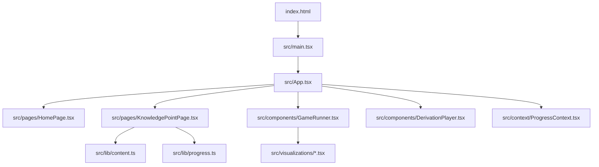
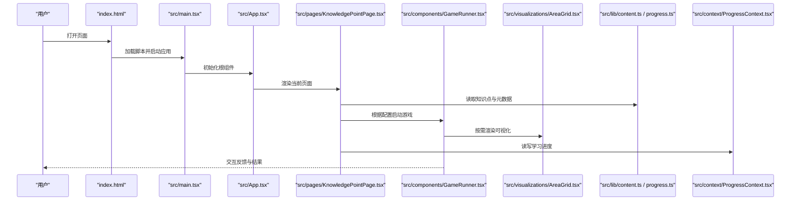
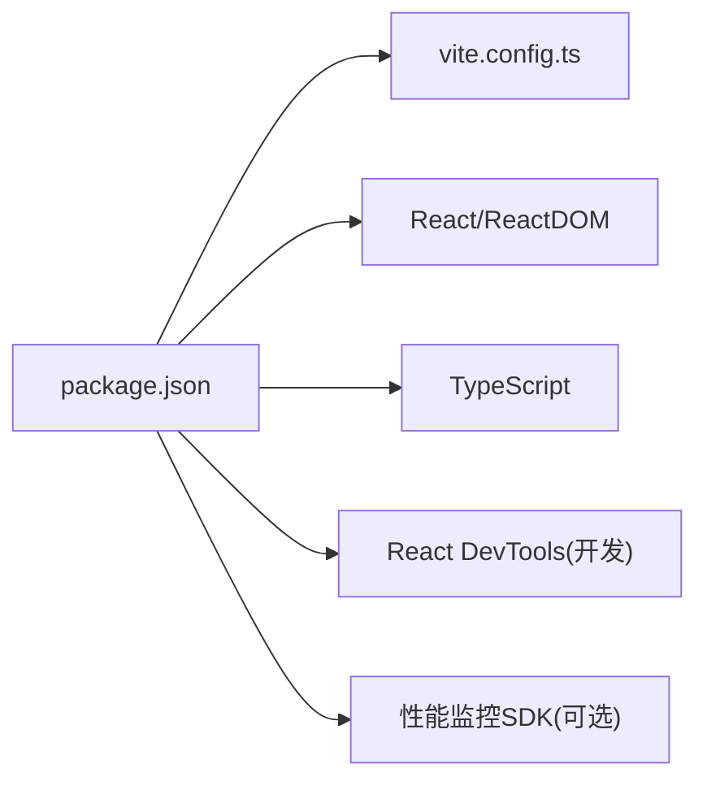
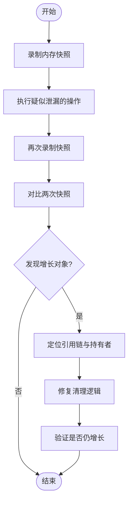

# 调试与性能优化

<cite>
**本文引用的文件**   
- [package.json](file://package.json)
- [vite.config.ts](file://vite.config.ts)
- [index.html](file://index.html)
- [src/main.tsx](file://src/main.tsx)
- [src/App.tsx](file://src/App.tsx)
- [src/pages/HomePage.tsx](file://src/pages/HomePage.tsx)
- [src/pages/KnowledgePointPage.tsx](file://src/pages/KnowledgePointPage.tsx)
- [src/components/GameRunner.tsx](file://src/components/GameRunner.tsx)
- [src/components/DerivationPlayer.tsx](file://src/components/DerivationPlayer.tsx)
- [src/lib/content.ts](file://src/lib/content.ts)
- [src/lib/progress.ts](file://src/lib/progress.ts)
- [src/context/ProgressContext.tsx](file://src/context/ProgressContext.tsx)
- [src/visualizations/AreaGrid.tsx](file://src/visualizations/AreaGrid.tsx)
- [src/visualizations/CircleUnroll.tsx](file://src/visualizations/CircleUnroll.tsx)
- [src/test/setup.ts](file://src/test/setup.ts)
</cite>

## 目录
1. [简介](#简介)
2. [项目结构](#项目结构)
3. [核心组件](#核心组件)
4. [架构总览](#架构总览)
5. [详细组件分析](#详细组件分析)
6. [依赖分析](#依赖分析)
7. [性能考虑](#性能考虑)
8. [故障排查指南](#故障排查指南)
9. [结论](#结论)
10. [附录](#附录)

## 简介
本指南面向 math-k6 项目的开发与维护人员，聚焦于调试技巧、性能分析与优化、内存泄漏检测、生产监控与错误追踪。内容覆盖开发环境（Vite + React）的调试方法、浏览器开发者工具使用要点、React DevTools 与组件级性能分析、代码分割与懒加载配置、资源优化策略，以及常见性能问题的诊断与解决路径。

## 项目结构
math-k6 基于 Vite 构建，采用 React + TypeScript。入口为 index.html 与 src/main.tsx，应用根组件为 src/App.tsx，页面位于 src/pages，游戏与可视化组件位于 src/components 与 src/visualizations，内容与进度数据通过 src/lib 提供，上下文状态集中在 src/context。

图表来源 
- [index.html:1-200](file://index.html#L1-L200)
- [src/main.tsx:1-200](file://src/main.tsx#L1-L200)
- [src/App.tsx:1-200](file://src/App.tsx#L1-L200)
- [src/pages/HomePage.tsx:1-200](file://src/pages/HomePage.tsx#L1-L200)
- [src/pages/KnowledgePointPage.tsx:1-200](file://src/pages/KnowledgePointPage.tsx#L1-L200)
- [src/components/GameRunner.tsx:1-200](file://src/components/GameRunner.tsx#L1-L200)
- [src/components/DerivationPlayer.tsx:1-200](file://src/components/DerivationPlayer.tsx#L1-L200)
- [src/lib/content.ts:1-200](file://src/lib/content.ts#L1-L200)
- [src/lib/progress.ts:1-200](file://src/lib/progress.ts#L1-L200)
- [src/context/ProgressContext.tsx:1-200](file://src/context/ProgressContext.tsx#L1-L200)

章节来源
- [package.json:1-200](file://package.json#L1-L200)
- [vite.config.ts:1-200](file://vite.config.ts#L1-L200)
- [index.html:1-200](file://index.html#L1-L200)
- [src/main.tsx:1-200](file://src/main.tsx#L1-L200)

## 核心组件
- 应用入口与挂载：main.tsx 负责创建 React 应用并挂载到 DOM。
- 根组件 App.tsx：组织路由或页面切换、全局上下文（如进度）。
- 页面层：HomePage.tsx、KnowledgePointPage.tsx 等承载业务视图。
- 游戏运行器 GameRunner.tsx：统一调度不同题型的游戏逻辑与渲染。
- 推导播放器 DerivationPlayer.tsx：展示数学推导过程与交互。
- 可视化组件：AreaGrid.tsx、CircleUnroll.tsx 等用于图形化表达数学概念。
- 数据与状态：content.ts 管理知识点内容，progress.ts 管理学习进度，ProgressContext.tsx 提供跨组件状态。

章节来源
- [src/main.tsx:1-200](file://src/main.tsx#L1-L200)
- [src/App.tsx:1-200](file://src/App.tsx#L1-L200)
- [src/pages/HomePage.tsx:1-200](file://src/pages/HomePage.tsx#L1-L200)
- [src/pages/KnowledgePointPage.tsx:1-200](file://src/pages/KnowledgePointPage.tsx#L1-L200)
- [src/components/GameRunner.tsx:1-200](file://src/components/GameRunner.tsx#L1-L200)
- [src/components/DerivationPlayer.tsx:1-200](file://src/components/DerivationPlayer.tsx#L1-L200)
- [src/visualizations/AreaGrid.tsx:1-200](file://src/visualizations/AreaGrid.tsx#L1-L200)
- [src/visualizations/CircleUnroll.tsx:1-200](file://src/visualizations/CircleUnroll.tsx#L1-L200)
- [src/lib/content.ts:1-200](file://src/lib/content.ts#L1-L200)
- [src/lib/progress.ts:1-200](file://src/lib/progress.ts#L1-L200)
- [src/context/ProgressContext.tsx:1-200](file://src/context/ProgressContext.tsx#L1-L200)

## 架构总览
下图展示了从入口到页面、组件、数据与上下文的调用关系，便于定位性能热点与调试切入点。

图表来源 
- [index.html:1-200](file://index.html#L1-L200)
- [src/main.tsx:1-200](file://src/main.tsx#L1-L200)
- [src/App.tsx:1-200](file://src/App.tsx#L1-L200)
- [src/pages/KnowledgePointPage.tsx:1-200](file://src/pages/KnowledgePointPage.tsx#L1-L200)
- [src/components/GameRunner.tsx:1-200](file://src/components/GameRunner.tsx#L1-L200)
- [src/visualizations/AreaGrid.tsx:1-200](file://src/visualizations/AreaGrid.tsx#L1-L200)
- [src/lib/content.ts:1-200](file://src/lib/content.ts#L1-L200)
- [src/lib/progress.ts:1-200](file://src/lib/progress.ts#L1-L200)
- [src/context/ProgressContext.tsx:1-200](file://src/context/ProgressContext.tsx#L1-L200)

## 详细组件分析

### 应用入口与根组件
- main.tsx：负责创建应用实例、挂载到 DOM，并可在此注入调试与性能监控初始化逻辑。
- App.tsx：组织页面与上下文，适合放置全局错误边界、性能埋点与路由相关逻辑。

建议实践
- 在开发模式启用 React StrictMode 以尽早发现副作用问题。
- 在 App 层集中处理未捕获异常与上报。

章节来源
- [src/main.tsx:1-200](file://src/main.tsx#L1-L200)
- [src/App.tsx:1-200](file://src/App.tsx#L1-L200)

### 页面与数据流
- KnowledgePointPage.tsx：加载知识点内容（meta/explain/game 等），驱动 GameRunner 渲染。
- HomePage.tsx：导航与概览，可结合进度上下文展示学习情况。

数据流
- 通过 content.ts 获取知识点元数据与内容。
- 通过 progress.ts 读写本地进度。
- 通过 ProgressContext.tsx 将进度提升为全局状态。

章节来源
- [src/pages/KnowledgePointPage.tsx:1-200](file://src/pages/KnowledgePointPage.tsx#L1-L200)
- [src/pages/HomePage.tsx:1-200](file://src/pages/HomePage.tsx#L1-L200)
- [src/lib/content.ts:1-200](file://src/lib/content.ts#L1-L200)
- [src/lib/progress.ts:1-200](file://src/lib/progress.ts#L1-L200)
- [src/context/ProgressContext.tsx:1-200](file://src/context/ProgressContext.tsx#L1-L200)

### 游戏运行器与可视化
- GameRunner.tsx：统一封装游戏生命周期（初始化、交互、评分、重置），是性能优化的关键位置。
- DerivationPlayer.tsx：渲染推导步骤，注意避免频繁重排与不必要的重渲染。
- 可视化组件（AreaGrid.tsx、CircleUnroll.tsx 等）：大量 DOM/SVG 操作时，需关注虚拟滚动、增量更新与动画帧节流。

章节来源
- [src/components/GameRunner.tsx:1-200](file://src/components/GameRunner.tsx#L1-L200)
- [src/components/DerivationPlayer.tsx:1-200](file://src/components/DerivationPlayer.tsx#L1-L200)
- [src/visualizations/AreaGrid.tsx:1-200](file://src/visualizations/AreaGrid.tsx#L1-L200)
- [src/visualizations/CircleUnroll.tsx:1-200](file://src/visualizations/CircleUnroll.tsx#L1-L200)

### 测试与调试辅助
- setup.ts：测试环境初始化，可用于模拟浏览器 API、设置全局变量，便于单元测试与集成测试。

章节来源
- [src/test/setup.ts:1-200](file://src/test/setup.ts#L1-L200)

## 依赖分析
- 构建与开发：Vite 作为构建工具，配合 React 与 TypeScript。
- 运行时依赖：React、ReactDOM、TypeScript 类型定义。
- 可选依赖：React DevTools（开发时）、性能监控 SDK（生产时）。

图表来源 
- [package.json:1-200](file://package.json#L1-L200)
- [vite.config.ts:1-200](file://vite.config.ts#L1-L200)

章节来源
- [package.json:1-200](file://package.json#L1-L200)
- [vite.config.ts:1-200](file://vite.config.ts#L1-L200)

## 性能考虑

### 开发环境调试技巧
- 浏览器开发者工具
  - Elements：检查 DOM 结构与样式计算，定位布局抖动。
  - Console：打印日志、断点调试、查看 Promise 与事件流。
  - Performance：录制时间线，识别长任务与主线程阻塞。
  - Memory：堆快照对比，查找内存增长与未释放引用。
  - Network：分析请求大小、缓存命中与重复请求。
- React DevTools
  - Components：查看组件树、props/state、高亮更新。
  - Profiler：记录渲染耗时，定位慢组件与多余渲染。
  - Hooks：检查自定义 Hook 的执行与依赖变化。

### 代码分割与懒加载
- 路由级拆分：对页面组件使用动态导入，减少首屏体积。
- 组件级拆分：对大型可视化组件与游戏模块进行按需加载。
- 资源拆分：图片、字体与第三方库按功能域拆分，利用 CDN 与缓存。

实施要点
- 在页面与重型组件处使用懒加载，确保首次渲染更快。
- 预加载关键资源，延迟非关键资源。
- 合理划分 chunk，避免过度拆分导致请求过多。

### 资源优化
- 图片与媒体：使用合适格式（WebP/AVIF）、尺寸适配、懒加载。
- 字体：仅加载必要字形，使用 font-display 策略。
- 缓存：开启强缓存与协商缓存，利用 HTTP 缓存头。
- 压缩：启用 gzip/brotli，减小传输体积。

### 渲染与交互优化
- React 层面：使用 useMemo/useCallback 稳定引用，避免子组件不必要更新；必要时使用 memo 包裹纯展示组件。
- 列表与大数据：虚拟滚动、分页加载、增量更新。
- 动画与 Canvas/SVG：使用 requestAnimationFrame，避免同步阻塞；批量更新 DOM。
- 事件处理：防抖与节流，减少高频事件带来的重渲染。

### 内存管理与泄漏检测
- 常见泄漏点：未清理的定时器、事件监听、订阅、DOM 引用、闭包持有大对象。
- 检测方法：Performance 面板的 Allocation Timeline、Memory 面板的 Heap Snapshot 对比。
- 修复策略：在 useEffect 返回清理函数；取消网络请求；移除事件监听；及时解绑订阅。

### 生产监控与错误追踪
- 错误上报：捕获未捕获异常与 Promise 拒绝，上报至监控系统。
- 性能指标：上报 LCP、FID、CLS、TTFB、JS 执行耗时等关键指标。
- 用户行为：记录关键交互路径与失败率，辅助定位问题。
- 版本关联：上报构建版本与环境信息，便于回溯。

### 常见性能问题与解决方法
- 首屏过慢：检查首屏依赖、启用代码分割、预取关键资源。
- 卡顿掉帧：定位长任务，拆分计算，使用 Web Worker 或分片渲染。
- 内存持续增长：排查泄漏点，确保清理与释放。
- 网络瓶颈：合并请求、启用缓存、CDN 加速、减少冗余数据。

## 故障排查指南

### 快速定位渲染问题
- 使用 React DevTools Profiler 录制一次用户操作，观察重渲染次数与耗时。
- 在可疑组件添加最小化日志，确认 props/state 变化是否触发预期更新。
- 检查是否存在父组件频繁重建导致子组件重新渲染。

### 内存泄漏排查流程

### 网络与资源问题
- 检查 Network 面板的重复请求与过大资源。
- 确认缓存策略是否正确生效。
- 使用 Preload/Prefetch 优化关键资源加载顺序。

### 错误追踪与上报
- 捕获全局错误与未处理 Promise 拒绝。
- 上报错误堆栈、用户代理、页面 URL、版本号。
- 聚合分析错误趋势与影响范围。

章节来源
- [src/test/setup.ts:1-200](file://src/test/setup.ts#L1-L200)
- [src/lib/progress.ts:1-200](file://src/lib/progress.ts#L1-L200)
- [src/context/ProgressContext.tsx:1-200](file://src/context/ProgressContext.tsx#L1-L200)

## 结论
通过系统化的调试方法与性能优化策略，可以显著提升 math-k6 的开发效率与用户体验。建议在开发阶段充分利用浏览器开发者工具与 React DevTools，在生产环境建立完善的监控与错误追踪体系，持续迭代优化关键路径与资源加载，确保应用的稳定性与高性能。

## 附录

### 常用命令与工具
- 启动开发服务器：npm run dev
- 构建生产版本：npm run build
- 预览构建产物：npm run preview
- 运行测试：npm test

章节来源
- [package.json:1-200](file://package.json#L1-L200)

### 参考文档与最佳实践
- Vite 官方文档：构建配置、插件生态、性能优化。
- React 官方文档：Hooks、性能优化、并发特性。
- Chrome 开发者工具手册：性能、内存、网络分析。
- Web Vitals：关键性能指标的定义与测量方法。