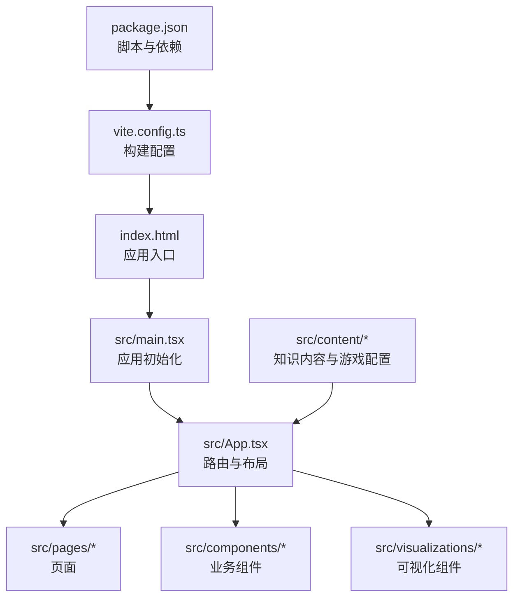
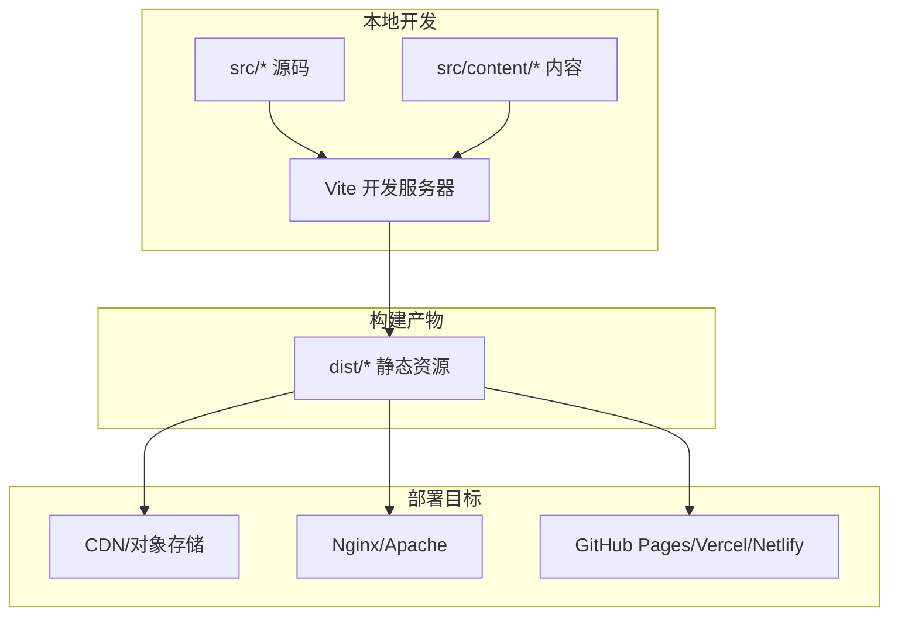
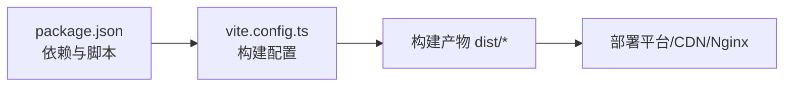

# 部署与发布

<cite>
**本文引用的文件**   
- [package.json](file://package.json)
- [vite.config.ts](file://vite.config.ts)
- [index.html](file://index.html)
- [README.md](file://README.md)
</cite>

## 目录
1. [简介](#简介)
2. [项目结构](#项目结构)
3. [核心组件](#核心组件)
4. [架构总览](#架构总览)
5. [详细组件分析](#详细组件分析)
6. [依赖分析](#依赖分析)
7. [性能考虑](#性能考虑)
8. [故障排查指南](#故障排查指南)
9. [结论](#结论)
10. [附录](#附录)

## 简介
本指南面向 math-k6 项目的生产环境构建、静态资源部署、容器化、环境变量与安全、版本管理与发布流程，以及部署后的监控与维护建议。项目为基于 Vite + React 的前端应用，内容数据以 Markdown/JSON 形式组织，最终产物为静态站点，适合通过 CDN/对象存储/Nginx 等方案进行分发。

## 项目结构
- 前端源码位于 src，包含页面、组件、可视化、内容与类型定义等。
- 构建工具使用 Vite，入口 HTML 在 index.html。
- 包管理与脚本由 package.json 管理。
- 文档说明见 README.md。

图表来源
- [package.json](file://package.json)
- [vite.config.ts](file://vite.config.ts)
- [index.html](file://index.html)

章节来源
- [package.json](file://package.json)
- [vite.config.ts](file://vite.config.ts)
- [index.html](file://index.html)
- [README.md](file://README.md)

## 核心组件
- 构建系统：Vite（开发/生产构建、优化、插件生态）
- 运行时：React + TypeScript
- 内容层：Markdown + JSON（知识点解释、游戏元数据与配置）
- 可视化：多种数学可视化组件（如分数饼图、柱状图、几何体模型等）

章节来源
- [README.md](file://README.md)

## 架构总览
math-k6 是纯前端静态站点，运行时无后端服务。构建阶段将 TSX/TS、CSS、图片等资源编译并优化为静态文件；部署阶段将这些静态文件托管到任意支持静态资源的平台。

[此图为概念性架构图，不直接映射具体代码文件]

## 详细组件分析

### 构建与优化（Vite）
- 构建命令与脚本：通过 package.json 的 scripts 字段提供开发与构建命令。
- 构建配置：vite.config.ts 中可配置输出目录、基础路径、插件、压缩、分包策略、代理等。
- 入口与资源：index.html 作为 SPA 入口，Vite 会注入必要的 JS/CSS。

建议的生产构建要点
- 启用生产模式与代码压缩（默认开启）。
- 合理拆分路由与大型组件，减少首屏体积。
- 静态资源命名加哈希，利于缓存命中。
- 按需加载可视化组件与内容，避免一次性加载全部资源。

章节来源
- [package.json](file://package.json)
- [vite.config.ts](file://vite.config.ts)
- [index.html](file://index.html)

### 环境变量与运行时配置
- 前端环境变量约定：Vite 支持以 VITE_ 前缀暴露给客户端的环境变量。
- 常见用途：API 地址、功能开关、埋点 ID、调试开关等。
- 安全注意：不要将敏感信息（密钥、令牌）放入前端环境变量；如需服务端能力，请通过后端 API 中转。

章节来源
- [vite.config.ts](file://vite.config.ts)
- [package.json](file://package.json)

### 内容系统与数据加载
- 内容组织：每个知识点目录下包含 explain.md、game.json、meta.json 等文件。
- 加载方式：构建期或运行期读取这些静态资源，渲染页面与游戏逻辑。
- 部署影响：确保内容文件随静态资源一同发布，且路径正确。

章节来源
- [README.md](file://README.md)

### 可视化与交互
- 可视化组件位于 src/visualizations，按主题划分，按需引入以减少打包体积。
- 游戏组件位于 src/components/games，结合 content 中的 game.json 驱动交互。

章节来源
- [README.md](file://README.md)

## 依赖分析
- 构建依赖：Vite、TypeScript、React 生态相关库。
- 运行依赖：浏览器原生能力为主，无服务端依赖。
- 外部集成：可通过环境变量接入第三方服务（如统计、CDN、鉴权网关等）。

图表来源
- [package.json](file://package.json)
- [vite.config.ts](file://vite.config.ts)

章节来源
- [package.json](file://package.json)
- [vite.config.ts](file://vite.config.ts)

## 性能考虑
- 首屏优化
  - 路由懒加载与组件异步导入。
  - 大体积可视化模块按需加载。
  - 预加载关键字体与样式。
- 缓存策略
  - 静态资源文件名带哈希，设置长期缓存。
  - HTML 与入口 JS 短缓存，便于快速回滚。
- 网络优化
  - 启用 Gzip/Brotli 压缩（Nginx/CDN 侧）。
  - 使用 HTTP/2 或 HTTP/3。
  - 合理设置 Cache-Control 与 ETag。
- 资源优化
  - 图片自动压缩与 WebP/AVIF 格式。
  - 字体子集化与延迟加载。
- 监控指标
  - LCP、FID、CLS、TTFB 等核心 Web 指标。
  - 错误率与用户行为埋点。

[本节为通用性能建议，不直接分析具体文件]

## 故障排查指南
常见问题与定位思路
- 构建失败
  - 检查 Node.js 版本与包管理器一致性。
  - 清理缓存后重试（node_modules/.cache、dist）。
  - 查看依赖冲突与类型错误。
- 部署后白屏或路由 404
  - 确认基础路径 base 配置与部署根路径一致。
  - 单页路由需配置服务端回退至 index.html。
- 资源 404
  - 检查静态资源路径与 CDN 域名配置。
  - 确认构建产物是否完整上传。
- 环境变量未生效
  - 确认变量名以 VITE_ 开头且在构建时可用。
  - 区分构建期与运行期变量。
- 性能退化
  - 使用浏览器开发者工具分析网络与性能面板。
  - 检查是否误引入了全量库或未启用按需加载。

章节来源
- [vite.config.ts](file://vite.config.ts)
- [package.json](file://package.json)

## 结论
math-k6 作为纯前端静态站点，具备构建简单、部署灵活、扩展性强的特点。通过合理的构建优化、缓存策略与环境变量管理，可在各类平台上稳定交付高质量体验。建议在 CI/CD 中固化构建与发布流程，配合监控与告警保障线上质量。

[本节为总结性内容，不直接分析具体文件]

## 附录

### 生产环境构建与优化清单
- 使用生产构建命令生成 dist 目录。
- 校验 base 路径与部署根路径一致。
- 启用压缩与资源指纹。
- 按需加载大模块与可视化组件。
- 配置 CDN 缓存策略与 HTTPS。
- 验证路由回退与 404 处理。

章节来源
- [package.json](file://package.json)
- [vite.config.ts](file://vite.config.ts)

### 静态资源部署步骤（多平台）
- GitHub Pages
  - 构建产物推送到指定分支或仓库。
  - 在设置中启用 Pages 并选择正确的源目录。
- Vercel / Netlify
  - 连接仓库，设置构建命令与输出目录。
  - 配置环境变量与重定向规则。
- Nginx/Apache
  - 将 dist 目录部署到 Web 服务器根目录。
  - 配置 SPA 路由回退与缓存头。
- 对象存储（OSS/S3）+ CDN
  - 上传 dist 目录，开启 CDN 加速与缓存策略。
  - 配置自定义域名与 HTTPS。

[本节为通用部署指导，不直接分析具体文件]

### Docker 容器化示例（概念）
- 多阶段构建
  - 构建阶段：安装依赖并执行构建命令，产出 dist。
  - 运行阶段：使用轻量级 Nginx 镜像托管 dist。
- 环境变量
  - 通过 Nginx 模板或反向代理注入必要的前端环境变量。
- 安全加固
  - 最小权限运行、只读文件系统、禁用不必要端口。
- 健康检查
  - 返回 200 的健康接口用于编排平台探测。

[本节为概念性容器化指导，不直接分析具体文件]

### 环境变量与安全设置
- 前端环境变量
  - 仅暴露非敏感配置（如 API 基址、功能开关）。
  - 使用构建时替换，避免泄露到运行时代码。
- 安全建议
  - 禁止在前端存放密钥与令牌。
  - 启用 CSP、HTTPS、HSTS 等安全头。
  - 对第三方脚本与资源进行白名单校验。
- 审计与合规
  - 定期扫描依赖漏洞。
  - 记录变更与发布版本，便于回溯。

章节来源
- [vite.config.ts](file://vite.config.ts)
- [package.json](file://package.json)

### 版本管理与发布流程
- 版本规范
  - 采用语义化版本（主版本.次版本.修订号）。
  - 通过 Git Tag 标记版本。
- 自动化流水线
  - 触发条件：合并到主干或创建标签。
  - 步骤：安装依赖 → 类型检查 → 测试 → 构建 → 部署。
- 灰度与回滚
  - 先灰度小流量，验证无误后全量发布。
  - 保留历史版本与制品，支持快速回滚。
- 发布物归档
  - 保存构建日志与产物快照。
  - 记录变更摘要与已知问题。

[本节为通用发布流程指导，不直接分析具体文件]

### 监控与维护建议
- 前端监控
  - 采集错误堆栈、性能指标与用户行为。
  - 设置阈值告警与通知渠道。
- 可用性监控
  - 定时探测关键页面与接口。
  - 监控 CDN 命中率与延迟。
- 维护计划
  - 定期更新依赖与修复漏洞。
  - 清理无用资源与日志。
  - 复盘线上问题并完善预案。

[本节为通用运维建议，不直接分析具体文件]