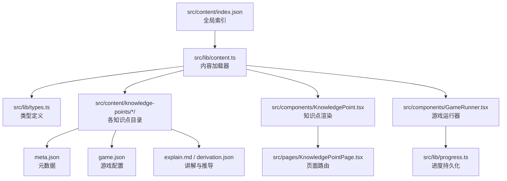
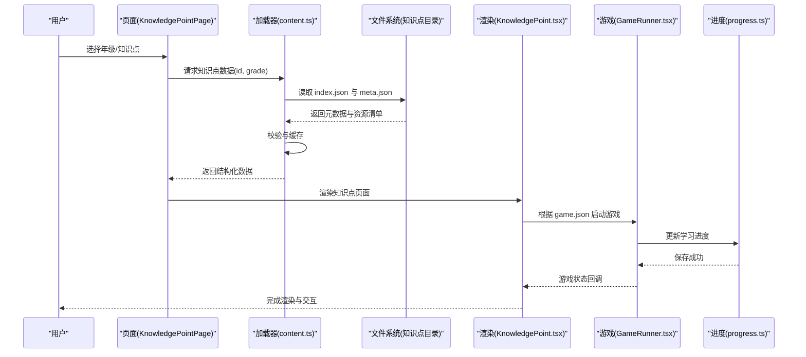
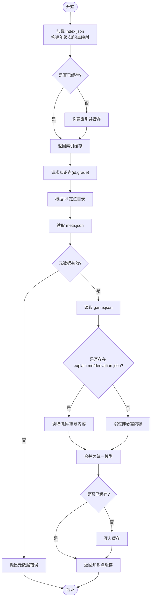
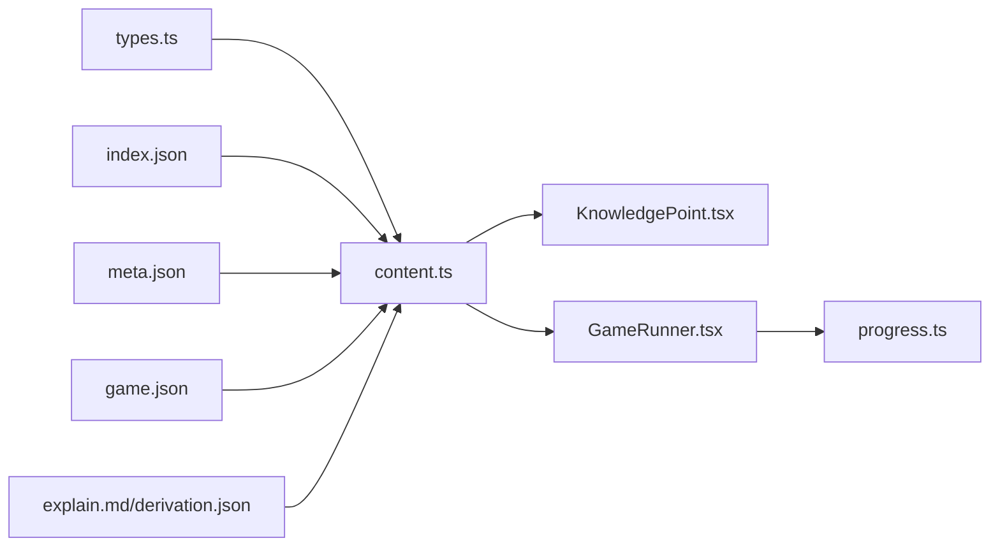

# 内容数据流

<cite>
**本文引用的文件**   
- [content.ts](file://src/lib/content.ts)
- [index.json](file://src/content/index.json)
- [KnowledgePoint.tsx](file://src/components/KnowledgePoint.tsx)
- [GradePage.tsx](file://src/pages/GradePage.tsx)
- [KnowledgePointPage.tsx](file://src/pages/KnowledgePointPage.tsx)
- [types.ts](file://src/lib/types.ts)
- [progress.ts](file://src/lib/progress.ts)
- [GameRunner.tsx](file://src/components/GameRunner.tsx)
- [meta.json](file://src/content/knowledge-points/g3-add-sub-10000/meta.json)
- [game.json](file://src/content/knowledge-points/g3-add-sub-10000/game.json)
- [explain.md](file://src/content/knowledge-points/g3-add-sub-10000/explain.md)
- [derivation.json](file://src/content/knowledge-points/g3-fraction-add-sub/derivation.json)
</cite>

## 目录
1. [简介](#简介)
2. [项目结构](#项目结构)
3. [核心组件](#核心组件)
4. [架构总览](#架构总览)
5. [详细组件分析](#详细组件分析)
6. [依赖关系分析](#依赖关系分析)
7. [性能考量](#性能考量)
8. [故障排查指南](#故障排查指南)
9. [结论](#结论)
10. [附录](#附录)

## 简介
本文件面向 math-k6 项目的“内容数据流”，聚焦知识点内容的加载机制与渲染链路。文档将系统阐述：
- JSON 文件结构与元数据规范（index.json、meta.json、game.json、derivation.json）
- 内容解析流程与验证策略
- 缓存策略与错误处理
- content.ts 的内容加载逻辑与动态导入方式
- 从文件系统到 UI 渲染的完整数据流转过程
- 各年级知识点的元数据管理与索引组织

## 项目结构
本项目采用“内容即代码”的组织方式，知识点以目录为单位存放于 src/content/knowledge-points，每个子目录包含该知识点的元数据、游戏配置、讲解文本与推导过程等。应用通过统一的索引与类型定义，在运行时按需加载并渲染。

图表来源
- [index.json](file://src/content/index.json)
- [content.ts](file://src/lib/content.ts)
- [types.ts](file://src/lib/types.ts)
- [KnowledgePoint.tsx](file://src/components/KnowledgePoint.tsx)
- [KnowledgePointPage.tsx](file://src/pages/KnowledgePointPage.tsx)
- [GameRunner.tsx](file://src/components/GameRunner.tsx)
- [progress.ts](file://src/lib/progress.ts)

章节来源
- [index.json](file://src/content/index.json)
- [content.ts](file://src/lib/content.ts)
- [types.ts](file://src/lib/types.ts)

## 核心组件
- 内容加载器（content.ts）
  - 负责读取 index.json 构建索引，按年级/知识点路径解析 meta.json、game.json、explain.md、derivation.json
  - 提供统一的数据模型与校验，支持懒加载与缓存
- 类型定义（types.ts）
  - 定义知识点、元数据、游戏配置、推导过程等数据结构
- 知识点渲染（KnowledgePoint.tsx）
  - 根据元数据与讲解/推导内容渲染页面
- 页面路由（GradePage.tsx、KnowledgePointPage.tsx）
  - 基于年级与知识点 ID 触发内容加载与渲染
- 游戏运行器（GameRunner.tsx）
  - 根据 game.json 动态加载并运行对应游戏
- 进度管理（progress.ts）
  - 记录学习进度并与内容交互

章节来源
- [content.ts](file://src/lib/content.ts)
- [types.ts](file://src/lib/types.ts)
- [KnowledgePoint.tsx](file://src/components/KnowledgePoint.tsx)
- [GradePage.tsx](file://src/pages/GradePage.tsx)
- [KnowledgePointPage.tsx](file://src/pages/KnowledgePointPage.tsx)
- [GameRunner.tsx](file://src/components/GameRunner.tsx)
- [progress.ts](file://src/lib/progress.ts)

## 架构总览
下图展示从索引到渲染的核心数据流与模块职责划分。

图表来源
- [KnowledgePointPage.tsx](file://src/pages/KnowledgePointPage.tsx)
- [content.ts](file://src/lib/content.ts)
- [KnowledgePoint.tsx](file://src/components/KnowledgePoint.tsx)
- [GameRunner.tsx](file://src/components/GameRunner.tsx)
- [progress.ts](file://src/lib/progress.ts)
- [index.json](file://src/content/index.json)

## 详细组件分析

### 内容加载器（content.ts）
- 功能要点
  - 读取并解析 index.json，构建年级到知识点 ID 列表的映射
  - 按知识点目录读取 meta.json、game.json、explain.md、derivation.json
  - 对数据进行类型校验与规范化，缺失字段给出明确错误
  - 实现内存级缓存，避免重复 IO；支持按需懒加载
  - 暴露统一 API：获取年级列表、获取知识点详情、批量预取
- 关键流程
  - 初始化：加载 index.json，建立索引缓存
  - 获取知识点：根据 id 定位目录，顺序读取必要文件，合并为统一模型
  - 校验：检查必填字段、枚举值、引用完整性
  - 缓存：命中则直接返回，未命中则写入缓存并返回
  - 错误：捕获 IO 失败、JSON 解析异常、校验失败，向上抛出结构化错误
- 动态导入
  - 针对游戏或可视化组件，使用条件式动态 import，减少首屏体积
  - 结合版本号或哈希进行缓存失效控制

图表来源
- [content.ts](file://src/lib/content.ts)
- [index.json](file://src/content/index.json)

章节来源
- [content.ts](file://src/lib/content.ts)

### 索引文件（index.json）
- 作用
  - 作为全局目录，列出所有年级及其包含的知识点 ID
  - 供加载器快速构建导航树与预取策略
- 结构建议
  - 顶层键为年级标识（如 g3、g4...）
  - 值为知识点 ID 数组，保证唯一性与可排序性
- 维护原则
  - 新增知识点必须同步更新 index.json
  - 删除或重命名需清理引用，避免死链

章节来源
- [index.json](file://src/content/index.json)

### 知识点元数据（meta.json）
- 作用
  - 描述知识点的标题、描述、难度、适用年级、标签、前置依赖等
  - 驱动 UI 展示与学习路径编排
- 关键字段
  - 标识：id、title、description
  - 分类：grade、tags、prerequisites
  - 资源：是否有 explain.md、derivation.json、game.json
- 校验规则
  - 必填字段校验、枚举值校验、依赖存在性校验

章节来源
- [meta.json](file://src/content/knowledge-points/g3-add-sub-10000/meta.json)

### 游戏配置（game.json）
- 作用
  - 定义游戏的类型、参数、关卡、提示、评分规则等
  - GameRunner 据此动态加载并实例化具体游戏
- 关键字段
  - type、params、levels、scoring、assets
- 动态加载
  - 根据 type 动态 import 对应游戏组件，避免全量打包

章节来源
- [game.json](file://src/content/knowledge-points/g3-add-sub-10000/game.json)

### 讲解与推导（explain.md / derivation.json）
- explain.md
  - Markdown 格式的讲解文本，用于知识点说明与教学引导
- derivation.json
  - 结构化推导步骤，便于交互式演示与动画播放

章节来源
- [explain.md](file://src/content/knowledge-points/g3-add-sub-10000/explain.md)
- [derivation.json](file://src/content/knowledge-points/g3-fraction-add-sub/derivation.json)

### 渲染与交互（KnowledgePoint.tsx、KnowledgePointPage.tsx、GameRunner.tsx）
- KnowledgePoint.tsx
  - 接收知识点数据，渲染标题、描述、讲解/推导内容与游戏入口
- KnowledgePointPage.tsx
  - 根据路由参数调用 content.ts 获取数据，驱动渲染
- GameRunner.tsx
  - 根据 game.json 动态加载游戏组件，管理生命周期与事件回调
  - 与 progress.ts 协作，记录答题结果与进度

章节来源
- [KnowledgePoint.tsx](file://src/components/KnowledgePoint.tsx)
- [KnowledgePointPage.tsx](file://src/pages/KnowledgePointPage.tsx)
- [GameRunner.tsx](file://src/components/GameRunner.tsx)

### 类型定义（types.ts）
- 定义知识点、元数据、游戏配置、推导步骤等 TypeScript 接口
- 确保数据一致性，辅助 IDE 提示与静态检查

章节来源
- [types.ts](file://src/lib/types.ts)

### 进度管理（progress.ts）
- 记录知识点访问、练习得分、掌握状态
- 提供查询与更新接口，支持本地持久化

章节来源
- [progress.ts](file://src/lib/progress.ts)

## 依赖关系分析
- 模块耦合
  - content.ts 依赖 types.ts 与文件系统（index.json、meta.json、game.json、explain.md、derivation.json）
  - KnowledgePoint.tsx 依赖 content.ts 输出数据
  - GameRunner.tsx 依赖 game.json 与 types.ts
  - ProgressContext/progress.ts 与 GameRunner.tsx 双向交互
- 潜在循环
  - 应避免 content.ts 反向依赖 UI 组件；UI 仅消费数据模型
- 外部依赖
  - 动态导入的游戏组件与可视化库按需加载

图表来源
- [types.ts](file://src/lib/types.ts)
- [content.ts](file://src/lib/content.ts)
- [index.json](file://src/content/index.json)
- [meta.json](file://src/content/knowledge-points/g3-add-sub-10000/meta.json)
- [game.json](file://src/content/knowledge-points/g3-add-sub-10000/game.json)
- [explain.md](file://src/content/knowledge-points/g3-add-sub-10000/explain.md)
- [derivation.json](file://src/content/knowledge-points/g3-fraction-add-sub/derivation.json)
- [KnowledgePoint.tsx](file://src/components/KnowledgePoint.tsx)
- [GameRunner.tsx](file://src/components/GameRunner.tsx)
- [progress.ts](file://src/lib/progress.ts)

章节来源
- [content.ts](file://src/lib/content.ts)
- [types.ts](file://src/lib/types.ts)
- [KnowledgePoint.tsx](file://src/components/KnowledgePoint.tsx)
- [GameRunner.tsx](file://src/components/GameRunner.tsx)
- [progress.ts](file://src/lib/progress.ts)

## 性能考量
- 懒加载与按需导入
  - 仅在需要时加载知识点内容与游戏组件，降低首屏体积
- 缓存策略
  - 内存级缓存知识点数据与索引，避免重复 IO
  - 对动态导入的模块设置版本/哈希，控制缓存失效
- 预取与并行
  - 对当前年级其他知识点进行轻量预取（仅元数据），提升切换速度
- 序列化与传输
  - 对大对象（如推导步骤）进行压缩或分页加载
- 渲染优化
  - 使用 React 的 memo/useMemo 避免不必要的重渲染
  - 游戏组件卸载时释放资源与监听器

[本节为通用指导，不直接分析具体文件]

## 故障排查指南
- 常见问题
  - 索引缺失或格式错误：检查 index.json 结构与语法
  - 元数据不完整：确认 meta.json 必填字段与枚举值
  - 游戏配置无效：核对 game.json 的 type 与 params
  - 动态导入失败：确认模块路径与导出名称
  - 缓存不一致：清除缓存后重试，检查版本号/哈希
- 错误处理策略
  - 捕获 IO 异常与解析异常，返回友好错误信息
  - 对校验失败提供详细字段级提示
  - 降级策略：缺少可选内容时回退到基础视图

章节来源
- [content.ts](file://src/lib/content.ts)
- [types.ts](file://src/lib/types.ts)

## 结论
math-k6 的内容数据流以 index.json 为入口，通过 content.ts 统一加载与校验，结合 types.ts 的类型约束，确保数据一致性与可维护性。UI 层按需渲染知识点与游戏，并通过 progress.ts 记录学习进度。合理的懒加载、缓存与错误处理策略保障了良好的用户体验与性能表现。

[本节为总结性内容，不直接分析具体文件]

## 附录
- 数据模型示例（路径参考）
  - 元数据：[meta.json](file://src/content/knowledge-points/g3-add-sub-10000/meta.json)
  - 游戏配置：[game.json](file://src/content/knowledge-points/g3-add-sub-10000/game.json)
  - 讲解文本：[explain.md](file://src/content/knowledge-points/g3-add-sub-10000/explain.md)
  - 推导过程：[derivation.json](file://src/content/knowledge-points/g3-fraction-add-sub/derivation.json)
- 关键实现路径
  - 内容加载器：[content.ts](file://src/lib/content.ts)
  - 类型定义：[types.ts](file://src/lib/types.ts)
  - 知识点渲染：[KnowledgePoint.tsx](file://src/components/KnowledgePoint.tsx)
  - 页面路由：[KnowledgePointPage.tsx](file://src/pages/KnowledgePointPage.tsx)
  - 游戏运行器：[GameRunner.tsx](file://src/components/GameRunner.tsx)
  - 进度管理：[progress.ts](file://src/lib/progress.ts)