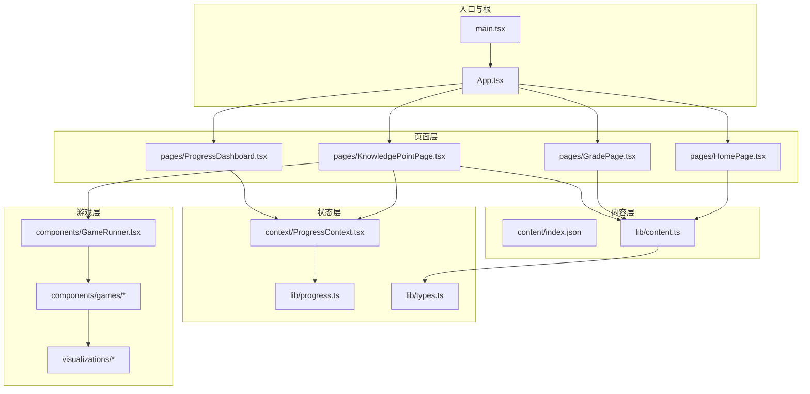
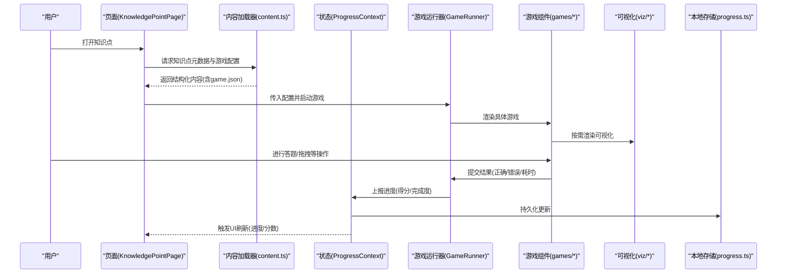
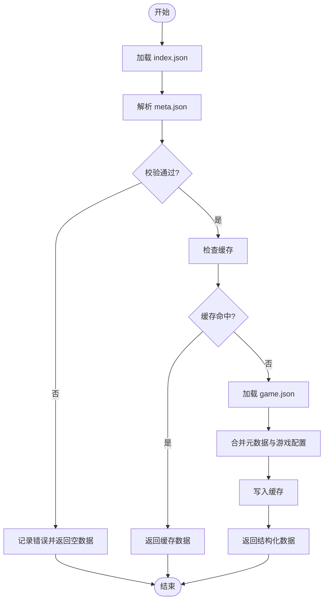
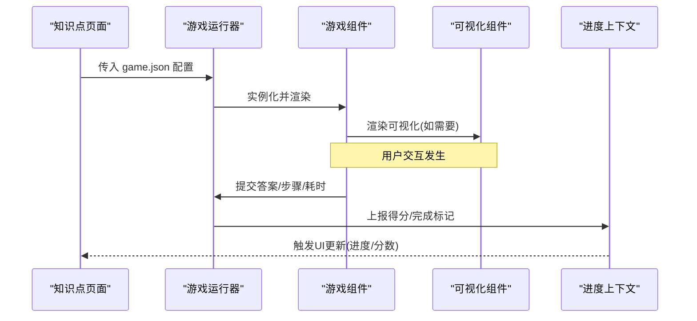
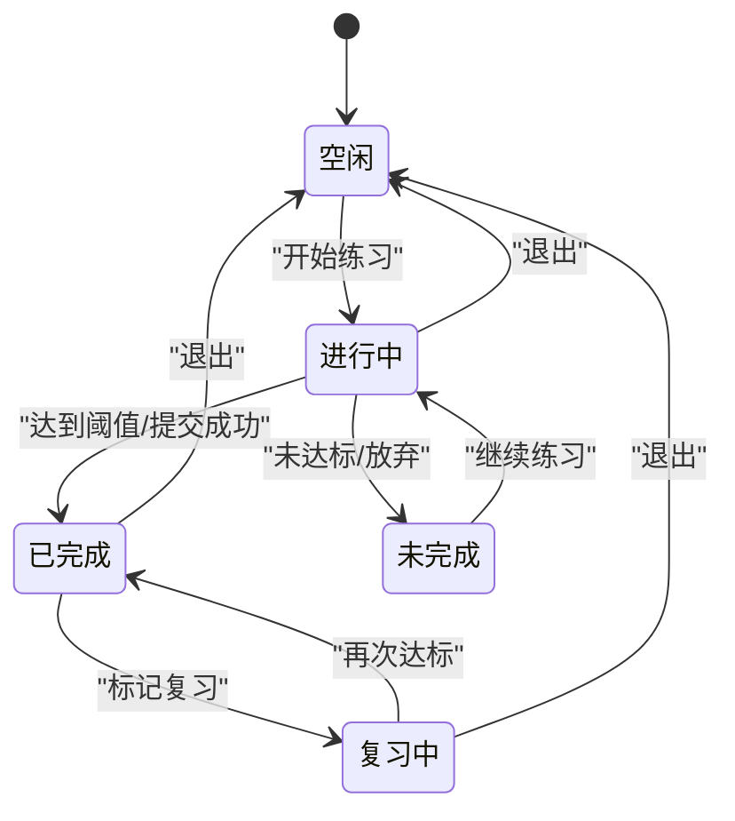
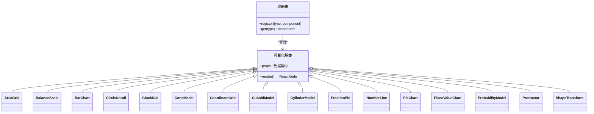
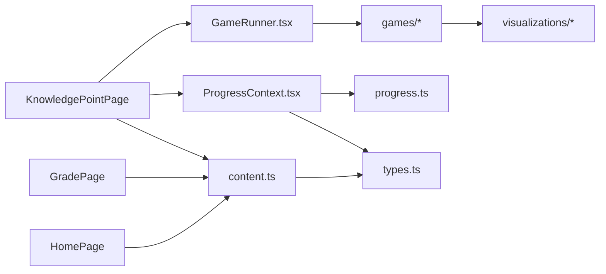

# 数据流设计

<cite>
**本文引用的文件**   
- [src/main.tsx](file://src/main.tsx)
- [src/App.tsx](file://src/App.tsx)
- [src/lib/content.ts](file://src/lib/content.ts)
- [src/lib/progress.ts](file://src/lib/progress.ts)
- [src/lib/types.ts](file://src/lib/types.ts)
- [src/context/ProgressContext.tsx](file://src/context/ProgressContext.tsx)
- [src/components/GameRunner.tsx](file://src/components/GameRunner.tsx)
- [src/components/KnowledgePoint.tsx](file://src/components/KnowledgePoint.tsx)
- [src/pages/HomePage.tsx](file://src/pages/HomePage.tsx)
- [src/pages/GradePage.tsx](file://src/pages/GradePage.tsx)
- [src/pages/KnowledgePointPage.tsx](file://src/pages/KnowledgePointPage.tsx)
- [src/pages/ProgressDashboard.tsx](file://src/pages/ProgressDashboard.tsx)
- [src/components/games/ChoiceGame.tsx](file://src/components/games/ChoiceGame.tsx)
- [src/components/games/DragAssembleGame.tsx](file://src/components/games/DragAssembleGame.tsx)
- [src/components/games/DragMatchGame.tsx](file://src/components/games/DragMatchGame.tsx)
- [src/components/games/FillBlankGame.tsx](file://src/components/games/FillBlankGame.tsx)
- [src/components/games/TimedChallengeGame.tsx](file://src/components/games/TimedChallengeGame.tsx)
- [src/components/games/TimelineGame.tsx](file://src/components/games/TimelineGame.tsx)
- [src/components/games/TrueFalseGame.tsx](file://src/components/games/TrueFalseGame.tsx)
- [src/visualizations/AreaGrid.tsx](file://src/visualizations/AreaGrid.tsx)
- [src/visualizations/BalanceScale.tsx](file://src/visualizations/BalanceScale.tsx)
- [src/visualizations/BarChart.tsx](file://src/visualizations/BarChart.tsx)
- [src/visualizations/CircleUnroll.tsx](file://src/visualizations/CircleUnroll.tsx)
- [src/visualizations/ClockDial.tsx](file://src/visualizations/ClockDial.tsx)
- [src/visualizations/ConeModel.tsx](file://src/visualizations/ConeModel.tsx)
- [src/visualizations/CoordinateGrid.tsx](file://src/visualizations/CoordinateGrid.tsx)
- [src/visualizations/CuboidModel.tsx](file://src/visualizations/CuboidModel.tsx)
- [src/visualizations/CylinderModel.tsx](file://src/visualizations/CylinderModel.tsx)
- [src/visualizations/FractionPie.tsx](file://src/visualizations/FractionPie.tsx)
- [src/visualizations/NumberLine.tsx](file://src/visualizations/NumberLine.tsx)
- [src/visualizations/PieChart.tsx](file://src/visualizations/PieChart.tsx)
- [src/visualizations/PlaceValueChart.tsx](file://src/visualizations/PlaceValueChart.tsx)
- [src/visualizations/ProbabilityModel.tsx](file://src/visualizations/ProbabilityModel.tsx)
- [src/visualizations/Protractor.tsx](file://src/visualizations/Protractor.tsx)
- [src/visualizations/ShapeTransform.tsx](file://src/visualizations/ShapeTransform.tsx)
- [src/visualizations/registry.tsx](file://src/visualizations/registry.tsx)
- [src/content/index.json](file://src/content/index.json)
</cite>

## 目录
1. [简介](#简介)
2. [项目结构](#项目结构)
3. [核心组件](#核心组件)
4. [架构总览](#架构总览)
5. [详细组件分析](#详细组件分析)
6. [依赖关系分析](#依赖关系分析)
7. [性能考虑](#性能考虑)
8. [故障排查指南](#故障排查指南)
9. [结论](#结论)
10. [附录](#附录)

## 简介
本文件为 math-k6 项目的数据流设计文档，聚焦以下目标：
- 内容管理系统的数据加载机制：JSON 文件 → Content Loader → State Management → UI 渲染
- 游戏执行的数据流：Game Config → Game Runner → Game Component → 用户交互 → 分数更新
- 进度跟踪的数据同步流程：用户操作 → Progress Context → Local Storage → Dashboard 更新
- 单向数据流原则、状态提升策略与组件间数据传递模式
- 数据验证、错误处理与缓存策略
- 提供数据流图与状态转换图，帮助读者理解端到端的数据流转

## 项目结构
项目采用按功能域组织的方式：
- src/lib：领域逻辑（内容加载、进度持久化、类型定义）
- src/context：全局上下文（进度状态）
- src/components：UI 组件（页面、游戏运行器、知识点展示、具体游戏实现）
- src/visualizations：可视化组件库（由游戏或讲解按需使用）
- src/pages：路由页面（首页、年级页、知识点页、进度看板）
- src/content：内容资源（index.json 与各知识点的 meta/game/explain/derivation 等 JSON/Markdown）

图表来源
- [src/main.tsx](file://src/main.tsx)
- [src/App.tsx](file://src/App.tsx)
- [src/lib/content.ts](file://src/lib/content.ts)
- [src/lib/progress.ts](file://src/lib/progress.ts)
- [src/lib/types.ts](file://src/lib/types.ts)
- [src/context/ProgressContext.tsx](file://src/context/ProgressContext.tsx)
- [src/components/GameRunner.tsx](file://src/components/GameRunner.tsx)
- [src/pages/HomePage.tsx](file://src/pages/HomePage.tsx)
- [src/pages/GradePage.tsx](file://src/pages/GradePage.tsx)
- [src/pages/KnowledgePointPage.tsx](file://src/pages/KnowledgePointPage.tsx)
- [src/pages/ProgressDashboard.tsx](file://src/pages/ProgressDashboard.tsx)

章节来源
- [src/main.tsx](file://src/main.tsx)
- [src/App.tsx](file://src/App.tsx)
- [src/lib/content.ts](file://src/lib/content.ts)
- [src/lib/progress.ts](file://src/lib/progress.ts)
- [src/lib/types.ts](file://src/lib/types.ts)
- [src/context/ProgressContext.tsx](file://src/context/ProgressContext.tsx)
- [src/components/GameRunner.tsx](file://src/components/GameRunner.tsx)
- [src/pages/HomePage.tsx](file://src/pages/HomePage.tsx)
- [src/pages/GradePage.tsx](file://src/pages/GradePage.tsx)
- [src/pages/KnowledgePointPage.tsx](file://src/pages/KnowledgePointPage.tsx)
- [src/pages/ProgressDashboard.tsx](file://src/pages/ProgressDashboard.tsx)

## 核心组件
- 内容加载器（Content Loader）
  - 职责：读取并解析 content/index.json 及各知识点的元数据与游戏配置；提供统一的查询接口；负责基础校验与缓存。
  - 关键能力：按年级/知识点检索、按需加载、错误边界、缓存命中。
- 进度上下文（Progress Context）
  - 职责：维护用户学习进度、得分、完成状态；提供读写 API；与本地存储同步。
  - 关键能力：增量更新、幂等写入、失败回退、订阅通知。
- 游戏运行器（Game Runner）
  - 职责：根据 game.json 启动对应游戏组件；管理生命周期、计时、提交结果；将结果上报至进度上下文。
  - 关键能力：动态组件选择、参数注入、事件聚合、超时处理。
- 可视化组件库（Visualizations）
  - 职责：为游戏与讲解提供可复用的可视化元素；通过 props 接收数据驱动渲染。
  - 关键能力：纯函数式渲染、无副作用、响应式更新。

章节来源
- [src/lib/content.ts](file://src/lib/content.ts)
- [src/lib/progress.ts](file://src/lib/progress.ts)
- [src/context/ProgressContext.tsx](file://src/context/ProgressContext.tsx)
- [src/components/GameRunner.tsx](file://src/components/GameRunner.tsx)
- [src/visualizations/registry.tsx](file://src/visualizations/registry.tsx)

## 架构总览
整体遵循单向数据流：数据从内容源进入加载器，进入状态层，再由 UI 消费；用户交互触发状态变更，经上下文持久化后，再反馈到 UI。

图表来源
- [src/pages/KnowledgePointPage.tsx](file://src/pages/KnowledgePointPage.tsx)
- [src/lib/content.ts](file://src/lib/content.ts)
- [src/context/ProgressContext.tsx](file://src/context/ProgressContext.tsx)
- [src/components/GameRunner.tsx](file://src/components/GameRunner.tsx)
- [src/components/games/ChoiceGame.tsx](file://src/components/games/ChoiceGame.tsx)
- [src/visualizations/registry.tsx](file://src/visualizations/registry.tsx)
- [src/lib/progress.ts](file://src/lib/progress.ts)

## 详细组件分析

### 内容管理系统数据流（JSON → Content Loader → State → UI）
- 数据源
  - 顶层索引：content/index.json
  - 各知识点目录：meta.json、game.json、explain.md、derivation.json
- 加载流程
  - 页面发起请求，调用内容加载器
  - 加载器解析 JSON，进行字段校验与默认值填充
  - 返回统一的结构化对象供上层使用
- 缓存策略
  - 内存缓存：避免重复网络请求
  - 失效策略：按知识点 ID 精确失效
- 错误处理
  - 网络异常：降级为空数据并提示
  - 格式错误：抛出明确错误，便于调试

图表来源
- [src/lib/content.ts](file://src/lib/content.ts)
- [src/content/index.json](file://src/content/index.json)

章节来源
- [src/lib/content.ts](file://src/lib/content.ts)
- [src/content/index.json](file://src/content/index.json)

### 游戏执行数据流（Game Config → Game Runner → Game Component → 用户交互 → Score Update）
- 配置驱动
  - game.json 描述题型、题目集合、可视化需求、评分规则
- 运行器职责
  - 根据配置选择并挂载具体游戏组件
  - 管理生命周期（初始化、进行中、结算）
  - 收集用户行为并计算得分
- 组件交互
  - 游戏组件仅关注交互与局部状态
  - 通过回调向运行器上报结果
- 结果上报
  - 运行器将结果标准化后提交至进度上下文

图表来源
- [src/components/GameRunner.tsx](file://src/components/GameRunner.tsx)
- [src/components/games/ChoiceGame.tsx](file://src/components/games/ChoiceGame.tsx)
- [src/components/games/DragAssembleGame.tsx](file://src/components/games/DragAssembleGame.tsx)
- [src/components/games/DragMatchGame.tsx](file://src/components/games/DragMatchGame.tsx)
- [src/components/games/FillBlankGame.tsx](file://src/components/games/FillBlankGame.tsx)
- [src/components/games/TimedChallengeGame.tsx](file://src/components/games/TimedChallengeGame.tsx)
- [src/components/games/TimelineGame.tsx](file://src/components/games/TimelineGame.tsx)
- [src/components/games/TrueFalseGame.tsx](file://src/components/games/TrueFalseGame.tsx)
- [src/context/ProgressContext.tsx](file://src/context/ProgressContext.tsx)

章节来源
- [src/components/GameRunner.tsx](file://src/components/GameRunner.tsx)
- [src/components/games/ChoiceGame.tsx](file://src/components/games/ChoiceGame.tsx)
- [src/components/games/DragAssembleGame.tsx](file://src/components/games/DragAssembleGame.tsx)
- [src/components/games/DragMatchGame.tsx](file://src/components/games/DragMatchGame.tsx)
- [src/components/games/FillBlankGame.tsx](file://src/components/games/FillBlankGame.tsx)
- [src/components/games/TimedChallengeGame.tsx](file://src/components/games/TimedChallengeGame.tsx)
- [src/components/games/TimelineGame.tsx](file://src/components/games/TimelineGame.tsx)
- [src/components/games/TrueFalseGame.tsx](file://src/components/games/TrueFalseGame.tsx)
- [src/context/ProgressContext.tsx](file://src/context/ProgressContext.tsx)

### 进度跟踪数据同步（User Action → Progress Context → Local Storage → Dashboard Update）
- 状态模型
  - 以知识点为单位记录：是否完成、得分、尝试次数、最后时间
- 同步策略
  - 增量更新：只写变更字段
  - 幂等写入：相同输入不产生额外副作用
  - 失败回退：写入失败时保留旧值并告警
- 视图更新
  - 进度看板订阅上下文变化，实时刷新统计与列表

图表来源
- [src/context/ProgressContext.tsx](file://src/context/ProgressContext.tsx)
- [src/lib/progress.ts](file://src/lib/progress.ts)
- [src/pages/ProgressDashboard.tsx](file://src/pages/ProgressDashboard.tsx)

章节来源
- [src/context/ProgressContext.tsx](file://src/context/ProgressContext.tsx)
- [src/lib/progress.ts](file://src/lib/progress.ts)
- [src/pages/ProgressDashboard.tsx](file://src/pages/ProgressDashboard.tsx)

### 可视化组件数据流
- 数据契约
  - 所有可视化组件通过 props 接收数据，内部保持无状态渲染
- 注册表
  - registry.tsx 集中注册可视化类型，供游戏或讲解按需引用
- 典型用法
  - 游戏组件根据题目类型选择对应的可视化，并传入数据驱动渲染

图表来源
- [src/visualizations/AreaGrid.tsx](file://src/visualizations/AreaGrid.tsx)
- [src/visualizations/BalanceScale.tsx](file://src/visualizations/BalanceScale.tsx)
- [src/visualizations/BarChart.tsx](file://src/visualizations/BarChart.tsx)
- [src/visualizations/CircleUnroll.tsx](file://src/visualizations/CircleUnroll.tsx)
- [src/visualizations/ClockDial.tsx](file://src/visualizations/ClockDial.tsx)
- [src/visualizations/ConeModel.tsx](file://src/visualizations/ConeModel.tsx)
- [src/visualizations/CoordinateGrid.tsx](file://src/visualizations/CoordinateGrid.tsx)
- [src/visualizations/CuboidModel.tsx](file://src/visualizations/CuboidModel.tsx)
- [src/visualizations/CylinderModel.tsx](file://src/visualizations/CylinderModel.tsx)
- [src/visualizations/FractionPie.tsx](file://src/visualizations/FractionPie.tsx)
- [src/visualizations/NumberLine.tsx](file://src/visualizations/NumberLine.tsx)
- [src/visualizations/PieChart.tsx](file://src/visualizations/PieChart.tsx)
- [src/visualizations/PlaceValueChart.tsx](file://src/visualizations/PlaceValueChart.tsx)
- [src/visualizations/ProbabilityModel.tsx](file://src/visualizations/ProbabilityModel.tsx)
- [src/visualizations/Protractor.tsx](file://src/visualizations/Protractor.tsx)
- [src/visualizations/ShapeTransform.tsx](file://src/visualizations/ShapeTransform.tsx)
- [src/visualizations/registry.tsx](file://src/visualizations/registry.tsx)

章节来源
- [src/visualizations/registry.tsx](file://src/visualizations/registry.tsx)

## 依赖关系分析
- 页面依赖内容加载器获取知识点与游戏配置
- 游戏运行器依赖具体游戏组件与可视化组件
- 进度上下文依赖本地存储模块进行持久化
- 类型定义贯穿内容、进度与组件接口，确保一致性

图表来源
- [src/pages/HomePage.tsx](file://src/pages/HomePage.tsx)
- [src/pages/GradePage.tsx](file://src/pages/GradePage.tsx)
- [src/pages/KnowledgePointPage.tsx](file://src/pages/KnowledgePointPage.tsx)
- [src/lib/content.ts](file://src/lib/content.ts)
- [src/components/GameRunner.tsx](file://src/components/GameRunner.tsx)
- [src/context/ProgressContext.tsx](file://src/context/ProgressContext.tsx)
- [src/lib/progress.ts](file://src/lib/progress.ts)
- [src/lib/types.ts](file://src/lib/types.ts)

章节来源
- [src/pages/HomePage.tsx](file://src/pages/HomePage.tsx)
- [src/pages/GradePage.tsx](file://src/pages/GradePage.tsx)
- [src/pages/KnowledgePointPage.tsx](file://src/pages/KnowledgePointPage.tsx)
- [src/lib/content.ts](file://src/lib/content.ts)
- [src/components/GameRunner.tsx](file://src/components/GameRunner.tsx)
- [src/context/ProgressContext.tsx](file://src/context/ProgressContext.tsx)
- [src/lib/progress.ts](file://src/lib/progress.ts)
- [src/lib/types.ts](file://src/lib/types.ts)

## 性能考虑
- 内容加载
  - 使用内存缓存减少重复请求
  - 按需加载知识点资源，避免一次性加载全部
- 游戏渲染
  - 可视化组件保持纯函数式，避免不必要的重渲染
  - 大组件懒加载与代码分割（在构建层面优化）
- 进度持久化
  - 批量写入与去抖更新，降低 I/O 频率
  - 失败重试与离线可用（基于 localStorage）
- 状态更新
  - 最小化状态粒度，避免全局风暴
  - 使用稳定引用与不可变更新，提高比较效率

[本节为通用指导，不直接分析具体文件]

## 故障排查指南
- 内容加载失败
  - 检查 index.json 与各知识点 JSON 的字段完整性
  - 查看控制台错误日志，确认解析与校验阶段
- 游戏无法启动
  - 核对 game.json 中的组件类型与注册表一致
  - 检查运行器是否正确注入 props 与回调
- 进度不同步
  - 确认上下文更新方法被调用且参数合法
  - 检查本地存储权限与配额限制
- 可视化异常
  - 校验传入数据结构是否符合契约
  - 逐步缩小数据范围定位渲染问题

章节来源
- [src/lib/content.ts](file://src/lib/content.ts)
- [src/components/GameRunner.tsx](file://src/components/GameRunner.tsx)
- [src/context/ProgressContext.tsx](file://src/context/ProgressContext.tsx)
- [src/lib/progress.ts](file://src/lib/progress.ts)
- [src/visualizations/registry.tsx](file://src/visualizations/registry.tsx)

## 结论
math-k6 的数据流设计遵循清晰的单向数据流与状态提升原则：
- 内容层通过加载器统一对外暴露结构化数据，并提供缓存与校验
- 游戏层以配置驱动，运行器负责生命周期管理与结果上报
- 进度层通过上下文集中管理，并与本地存储同步，保障跨会话一致性
- 可视化层保持无状态与高内聚，便于复用与维护
该设计在保证可扩展性的同时，兼顾了性能与可维护性，适合持续迭代与扩展新的题型与可视化能力。

[本节为总结性内容，不直接分析具体文件]

## 附录
- 数据契约建议
  - 内容模型：包含 id、title、grade、tags、game、meta 等字段
  - 进度模型：包含知识点 id、score、completed、attempts、lastTime 等字段
  - 游戏配置：包含 type、questions、rules、visualization 等字段
- 最佳实践
  - 所有外部数据在进入应用前进行严格校验
  - 组件间通过 props 与回调传递数据，避免隐式共享状态
  - 对异步操作设置超时与重试策略，保证用户体验

[本节为补充信息，不直接分析具体文件]