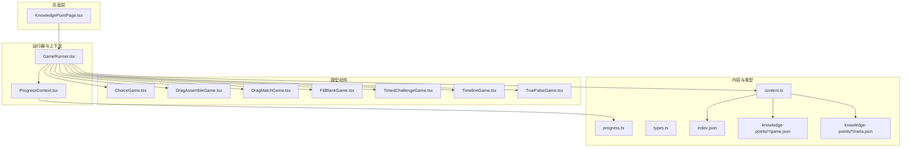
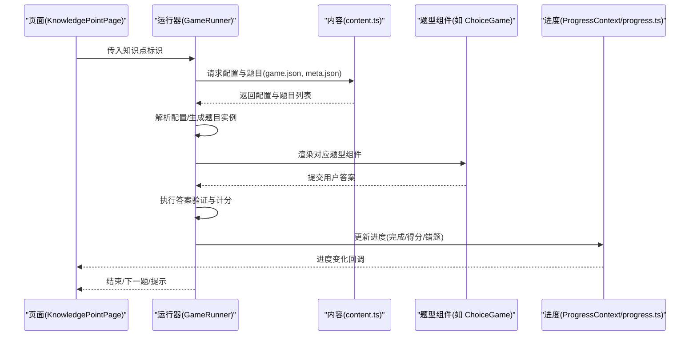
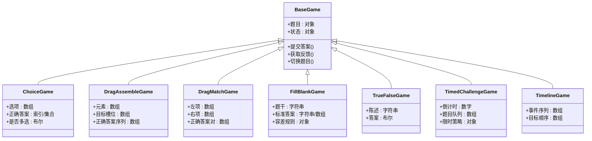
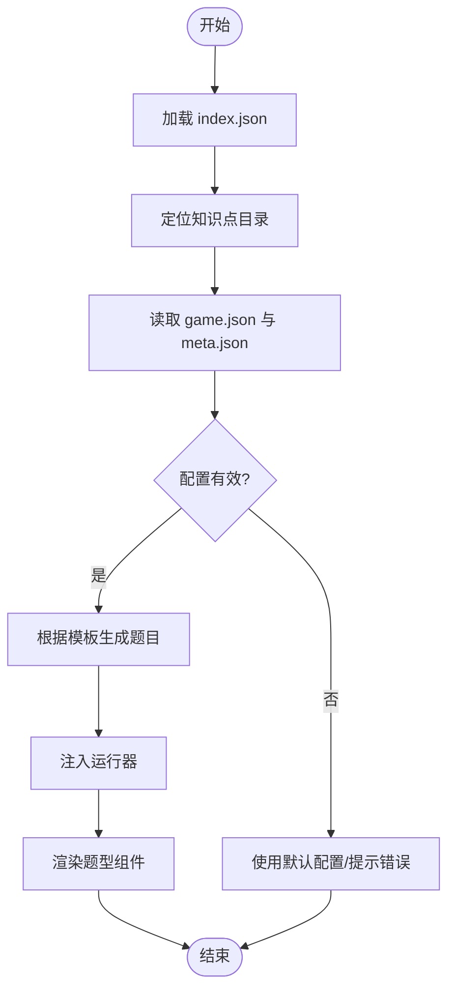
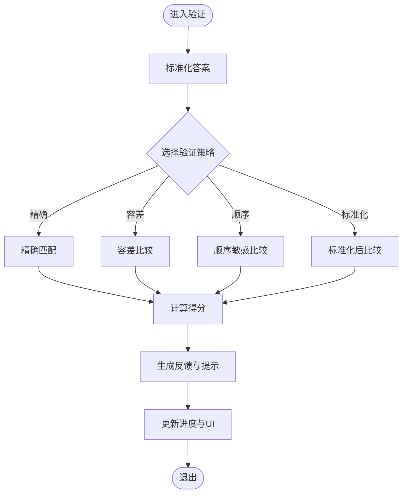
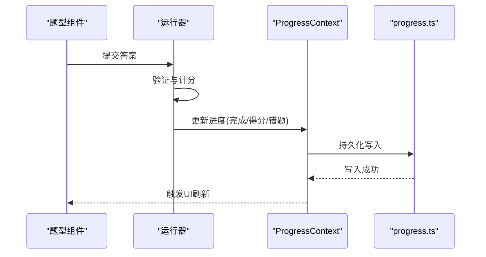
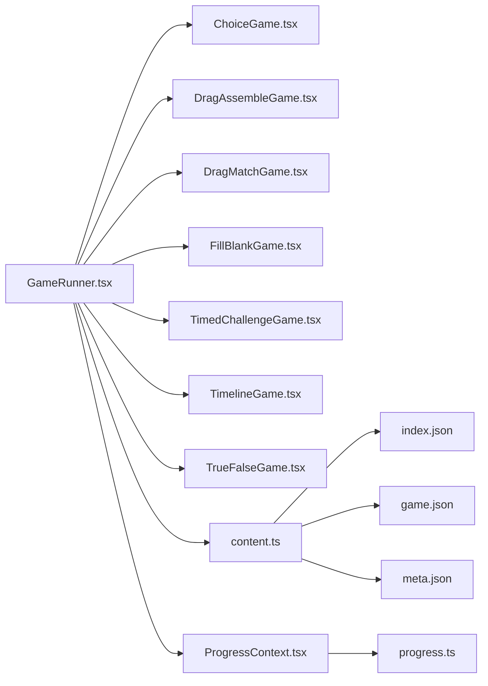

# 游戏数据流

<cite>
**本文引用的文件**   
- [GameRunner.tsx](file://src/components/GameRunner.tsx)
- [ChoiceGame.tsx](file://src/components/games/ChoiceGame.tsx)
- [DragAssembleGame.tsx](file://src/components/games/DragAssembleGame.tsx)
- [DragMatchGame.tsx](file://src/components/games/DragMatchGame.tsx)
- [FillBlankGame.tsx](file://src/components/games/FillBlankGame.tsx)
- [TimedChallengeGame.tsx](file://src/components/games/TimedChallengeGame.tsx)
- [TimelineGame.tsx](file://src/components/games/TimelineGame.tsx)
- [TrueFalseGame.tsx](file://src/components/games/TrueFalseGame.tsx)
- [ProgressContext.tsx](file://src/context/ProgressContext.tsx)
- [content.ts](file://src/lib/content.ts)
- [progress.ts](file://src/lib/progress.ts)
- [types.ts](file://src/lib/types.ts)
- [KnowledgePointPage.tsx](file://src/pages/KnowledgePointPage.tsx)
- [game.json](file://src/content/knowledge-points/g3-add-sub-10000/game.json)
- [meta.json](file://src/content/knowledge-points/g3-add-sub-10000/meta.json)
- [index.json](file://src/content/index.json)
</cite>

## 目录
1. [简介](#简介)
2. [项目结构](#项目结构)
3. [核心组件](#核心组件)
4. [架构总览](#架构总览)
5. [详细组件分析](#详细组件分析)
6. [依赖关系分析](#依赖关系分析)
7. [性能考量](#性能考量)
8. [故障排查指南](#故障排查指南)
9. [结论](#结论)
10. [附录](#附录)

## 简介
本文件面向 math-k6 项目的“游戏数据流”主题，系统性梳理从配置解析、题目生成、交互处理、答案验证到分数计算与状态同步的完整链路。重点围绕 GameRunner.tsx 的核心逻辑、不同题型的数据结构与交互流程、game.json 配置格式、以及进度与持久化机制进行说明，并提供可操作的自定义游戏实现指南。

## 项目结构
项目采用“内容驱动 + 组件化渲染”的组织方式：
- 内容层：每个知识点目录包含 game.json（游戏配置）、可选 explain.md（讲解文本）、derivation.json（推导过程）与 meta.json（元信息）。根级 index.json 作为索引。
- 组件层：GameRunner.tsx 作为统一入口，按类型分发至具体题型组件（选择题、拖拽、填空、判断、时间挑战等）。
- 上下文与工具：ProgressContext.tsx 提供全局进度上下文；lib 下 content.ts、progress.ts、types.ts 分别负责内容加载、进度管理与类型定义。
- 页面层：KnowledgePointPage.tsx 等页面负责路由与挂载 GameRunner。

图表来源
- [GameRunner.tsx](file://src/components/GameRunner.tsx)
- [KnowledgePointPage.tsx](file://src/pages/KnowledgePointPage.tsx)
- [ProgressContext.tsx](file://src/context/ProgressContext.tsx)
- [content.ts](file://src/lib/content.ts)
- [progress.ts](file://src/lib/progress.ts)
- [types.ts](file://src/lib/types.ts)
- [index.json](file://src/content/index.json)
- [game.json](file://src/content/knowledge-points/g3-add-sub-10000/game.json)
- [meta.json](file://src/content/knowledge-points/g3-add-sub-10000/meta.json)

章节来源
- [KnowledgePointPage.tsx](file://src/pages/KnowledgePointPage.tsx)
- [GameRunner.tsx](file://src/components/GameRunner.tsx)
- [ProgressContext.tsx](file://src/context/ProgressContext.tsx)
- [content.ts](file://src/lib/content.ts)
- [progress.ts](file://src/lib/progress.ts)
- [types.ts](file://src/lib/types.ts)
- [index.json](file://src/content/index.json)
- [game.json](file://src/content/knowledge-points/g3-add-sub-10000/game.json)
- [meta.json](file://src/content/knowledge-points/g3-add-sub-10000/meta.json)

## 核心组件
- GameRunner.tsx：统一加载配置、解析题型、初始化题目、管理答题状态、触发验证与计分、同步进度。
- 题型组件：ChoiceGame.tsx、DragAssembleGame.tsx、DragMatchGame.tsx、FillBlankGame.tsx、TimedChallengeGame.tsx、TimelineGame.tsx、TrueFalseGame.tsx，各自实现特定交互与校验逻辑。
- ProgressContext.tsx：集中维护学习进度（完成度、得分、错题记录），供上层页面与组件消费。
- content.ts：读取并解析 index.json、各知识点的 game.json 与 meta.json，提供统一的题目数据接口。
- progress.ts：封装进度读写、统计与持久化策略。
- types.ts：定义题目、配置、进度等核心类型契约。

章节来源
- [GameRunner.tsx](file://src/components/GameRunner.tsx)
- [ChoiceGame.tsx](file://src/components/games/ChoiceGame.tsx)
- [DragAssembleGame.tsx](file://src/components/games/DragAssembleGame.tsx)
- [DragMatchGame.tsx](file://src/components/games/DragMatchGame.tsx)
- [FillBlankGame.tsx](file://src/components/games/FillBlankGame.tsx)
- [TimedChallengeGame.tsx](file://src/components/games/TimedChallengeGame.tsx)
- [TimelineGame.tsx](file://src/components/games/TimelineGame.tsx)
- [TrueFalseGame.tsx](file://src/components/games/TrueFalseGame.tsx)
- [ProgressContext.tsx](file://src/context/ProgressContext.tsx)
- [content.ts](file://src/lib/content.ts)
- [progress.ts](file://src/lib/progress.ts)
- [types.ts](file://src/lib/types.ts)

## 架构总览
整体数据流遵循“配置驱动 → 题目生成 → 用户交互 → 答案验证 → 计分反馈 → 进度同步”的闭环。

图表来源
- [KnowledgePointPage.tsx](file://src/pages/KnowledgePointPage.tsx)
- [GameRunner.tsx](file://src/components/GameRunner.tsx)
- [content.ts](file://src/lib/content.ts)
- [ProgressContext.tsx](file://src/context/ProgressContext.tsx)
- [progress.ts](file://src/lib/progress.ts)

## 详细组件分析

### GameRunner.tsx：运行器核心
- 职责
  - 加载并解析 game.json 配置，确定题型、难度、题目数量、评分规则等。
  - 根据配置生成题目实例（含题干、选项、正确答案、干扰项、提示等）。
  - 管理生命周期：初始化、进行中、验证、反馈、完成、重置。
  - 将题目与配置下发给具体题型组件，接收其交互结果。
  - 调用验证与计分逻辑，更新进度上下文。
- 关键流程
  - 配置解析：校验必填字段、默认值填充、边界条件处理。
  - 题目生成：基于模板或算法生成多道题目，保证随机性与可重复性。
  - 交互收集：统一事件接口，屏蔽不同题型差异。
  - 答案验证：支持精确匹配、容差、顺序敏感/不敏感等策略。
  - 计分与反馈：按规则累计得分，给出即时反馈（正确/错误/提示）。
  - 进度同步：写入完成状态、得分、错题集，触发 UI 刷新。
- 错误处理
  - 配置缺失/非法时回退到安全默认或提示用户。
  - 题目生成失败时重试或降级为静态题库。
  - 验证异常时记录日志并跳过该题，继续流程。

章节来源
- [GameRunner.tsx](file://src/components/GameRunner.tsx)
- [content.ts](file://src/lib/content.ts)
- [types.ts](file://src/lib/types.ts)
- [ProgressContext.tsx](file://src/context/ProgressContext.tsx)
- [progress.ts](file://src/lib/progress.ts)

### 题型组件族：数据结构与交互
- 共同约定
  - 输入：题目对象（题干、选项/空位/目标等）、当前状态、回调函数（提交答案、获取反馈、切换题目）。
  - 输出：用户答案、交互事件（选择、拖拽、输入、确认）。
  - 反馈：即时提示（高亮、动画、语音/文字提示）。
- 选择题（ChoiceGame.tsx）
  - 数据结构：题干、选项数组、正确答案索引或集合、是否多选、权重。
  - 交互：单选/多选点击、提交、显示解析。
  - 验证：精确匹配或容差（如数值型选项）。
- 拖拽组装（DragAssembleGame.tsx）
  - 数据结构：待排序/拼接元素、目标槽位、正确答案序列。
  - 交互：拖拽放置、撤销/重做、提交。
  - 验证：顺序敏感比较，支持部分正确提示。
- 拖拽匹配（DragMatchGame.tsx）
  - 数据结构：左侧项、右侧项、映射关系、正确答案对。
  - 交互：拖拽连线或配对、批量提交。
  - 验证：成对匹配，允许部分正确计数。
- 填空题（FillBlankGame.tsx）
  - 数据结构：带占位的题干、标准答案、同义词/等价表达、容差规则。
  - 交互：输入框、自动补全、提交。
  - 验证：标准化后比对（去空格、大小写、单位换算等）。
- 判断题（TrueFalseGame.tsx）
  - 数据结构：陈述句、布尔答案、解析。
  - 交互：选择真/假、提交。
  - 验证：布尔匹配。
- 时间挑战（TimedChallengeGame.tsx）
  - 数据结构：倒计时、题目队列、限时策略。
  - 交互：计时器驱动、自动提交、超时处理。
  - 验证：结合时间与正确率综合计分。
- 时间线（TimelineGame.tsx）
  - 数据结构：事件序列、年份/阶段、目标顺序。
  - 交互：拖拽排序、提交。
  - 验证：顺序敏感比较。

图表来源
- [ChoiceGame.tsx](file://src/components/games/ChoiceGame.tsx)
- [DragAssembleGame.tsx](file://src/components/games/DragAssembleGame.tsx)
- [DragMatchGame.tsx](file://src/components/games/DragMatchGame.tsx)
- [FillBlankGame.tsx](file://src/components/games/FillBlankGame.tsx)
- [TrueFalseGame.tsx](file://src/components/games/TrueFalseGame.tsx)
- [TimedChallengeGame.tsx](file://src/components/games/TimedChallengeGame.tsx)
- [TimelineGame.tsx](file://src/components/games/TimelineGame.tsx)

章节来源
- [ChoiceGame.tsx](file://src/components/games/ChoiceGame.tsx)
- [DragAssembleGame.tsx](file://src/components/games/DragAssembleGame.tsx)
- [DragMatchGame.tsx](file://src/components/games/DragMatchGame.tsx)
- [FillBlankGame.tsx](file://src/components/games/FillBlankGame.tsx)
- [TrueFalseGame.tsx](file://src/components/games/TrueFalseGame.tsx)
- [TimedChallengeGame.tsx](file://src/components/games/TimedChallengeGame.tsx)
- [TimelineGame.tsx](file://src/components/games/TimelineGame.tsx)

### 配置与题目生成：game.json 与内容加载
- game.json 典型字段
  - 题型标识（type）：choice/drag_assemble/drag_match/fill_blank/true_false/timed_challenge/timeline
  - 难度等级（difficulty）：影响题目参数范围或干扰项强度
  - 题目数量（count）：本次练习的题目总数
  - 评分规则（scoring）：每题分值、总分上限、是否允许重试
  - 时间限制（timeLimit）：秒数，适用于限时题型
  - 题目模板（template）：用于动态生成的模板或规则
  - 解析与提示（hints/explanations）：每道题的解析文本或提示
- 内容加载流程
  - 通过 index.json 定位知识点目录
  - 读取 game.json 与 meta.json，合并元信息与配置
  - 若存在 derivation.json，则用于推导展示或辅助解释
  - 根据 template 与规则生成题目实例，注入到运行器

图表来源
- [content.ts](file://src/lib/content.ts)
- [index.json](file://src/content/index.json)
- [game.json](file://src/content/knowledge-points/g3-add-sub-10000/game.json)
- [meta.json](file://src/content/knowledge-points/g3-add-sub-10000/meta.json)

章节来源
- [content.ts](file://src/lib/content.ts)
- [index.json](file://src/content/index.json)
- [game.json](file://src/content/knowledge-points/g3-add-sub-10000/game.json)
- [meta.json](file://src/content/knowledge-points/g3-add-sub-10000/meta.json)

### 答案验证与分数计算
- 验证策略
  - 精确匹配：字符串、布尔、索引等直接比较
  - 容差匹配：数值类答案允许误差范围（如 ±0.01）
  - 顺序敏感/不敏感：拖拽排序与匹配题的关键差异
  - 标准化处理：去除空白、统一大小写、单位换算
- 计分逻辑
  - 每题分值 × 正确数 − 惩罚（如有）
  - 限时题型结合正确率与用时加权
  - 总分封顶与最低分保护
- 反馈机制
  - 即时高亮（正确绿色、错误红色）
  - 解析文本与提示逐步展开
  - 进度条与得分实时更新

图表来源
- [GameRunner.tsx](file://src/components/GameRunner.tsx)
- [types.ts](file://src/lib/types.ts)
- [progress.ts](file://src/lib/progress.ts)

章节来源
- [GameRunner.tsx](file://src/components/GameRunner.tsx)
- [types.ts](file://src/lib/types.ts)
- [progress.ts](file://src/lib/progress.ts)

### 用户交互事件与实时反馈
- 事件模型
  - 统一事件接口：onSubmit、onHint、onNext、onRetry
  - 防抖与节流：避免频繁提交与重复渲染
  - 异步处理：长耗时验证与网络请求的 Promise 链
- 实时反馈
  - 局部状态更新（React setState/useReducer）
  - 动画与音效（可选）
  - 无障碍支持（ARIA 标签、键盘导航）

章节来源
- [GameRunner.tsx](file://src/components/GameRunner.tsx)
- [ChoiceGame.tsx](file://src/components/games/ChoiceGame.tsx)
- [FillBlankGame.tsx](file://src/components/games/FillBlankGame.tsx)
- [TimedChallengeGame.tsx](file://src/components/games/TimedChallengeGame.tsx)

### 游戏状态同步与进度管理
- 状态结构
  - 当前题目索引、已答题目集合、得分、用时、错误记录
  - 全局进度：知识点完成度、历史得分趋势、错题清单
- 同步机制
  - ProgressContext 提供订阅/发布模式，组件监听变化
  - progress.ts 封装本地存储（localStorage/IndexedDB）与增量更新
  - 页面级聚合：Dashboard 汇总展示

图表来源
- [ProgressContext.tsx](file://src/context/ProgressContext.tsx)
- [progress.ts](file://src/lib/progress.ts)
- [GameRunner.tsx](file://src/components/GameRunner.tsx)

章节来源
- [ProgressContext.tsx](file://src/context/ProgressContext.tsx)
- [progress.ts](file://src/lib/progress.ts)
- [GameRunner.tsx](file://src/components/GameRunner.tsx)

## 依赖关系分析
- 组件耦合
  - GameRunner 与题型组件松耦合：通过统一接口传递题目与回调
  - 题型组件与 ProgressContext 解耦：仅通过回调更新进度
- 外部依赖
  - 内容加载依赖文件系统/静态资源（index.json、game.json、meta.json）
  - 进度持久化依赖浏览器存储 API
- 潜在循环依赖
  - 确保题型组件不反向依赖运行器内部实现，仅依赖公共接口

图表来源
- [GameRunner.tsx](file://src/components/GameRunner.tsx)
- [content.ts](file://src/lib/content.ts)
- [ProgressContext.tsx](file://src/context/ProgressContext.tsx)
- [progress.ts](file://src/lib/progress.ts)
- [index.json](file://src/content/index.json)
- [game.json](file://src/content/knowledge-points/g3-add-sub-10000/game.json)
- [meta.json](file://src/content/knowledge-points/g3-add-sub-10000/meta.json)

章节来源
- [GameRunner.tsx](file://src/components/GameRunner.tsx)
- [content.ts](file://src/lib/content.ts)
- [ProgressContext.tsx](file://src/context/ProgressContext.tsx)
- [progress.ts](file://src/lib/progress.ts)
- [index.json](file://src/content/index.json)
- [game.json](file://src/content/knowledge-points/g3-add-sub-10000/game.json)
- [meta.json](file://src/content/knowledge-points/g3-add-sub-10000/meta.json)

## 性能考量
- 懒加载与按需渲染：仅在需要时加载题目与解析
- 虚拟化列表：大量题目时使用虚拟滚动减少 DOM 压力
- 计算优化：答案验证与格式化缓存结果，避免重复计算
- 内存管理：及时释放定时器与事件监听，防止泄漏
- 网络与 I/O：合并请求、缓存静态资源，提升首屏速度

[本节为通用指导，无需引用具体文件]

## 故障排查指南
- 常见问题
  - 配置缺失或字段类型错误：检查 game.json 必填项与类型约束
  - 题目生成失败：确认模板变量与随机种子一致性
  - 验证不生效：核对标准化与容差策略
  - 进度未更新：检查 ProgressContext 订阅与持久化写入
- 调试建议
  - 在运行器中打印关键状态快照
  - 使用浏览器开发者工具断点调试交互事件
  - 单元测试覆盖验证与计分逻辑

章节来源
- [GameRunner.tsx](file://src/components/GameRunner.tsx)
- [progress.ts](file://src/lib/progress.ts)
- [types.ts](file://src/lib/types.ts)

## 结论
math-k6 的游戏数据流以配置为中心、组件化为载体，实现了从内容加载、题目生成、交互处理到验证计分与进度同步的完整闭环。通过统一接口与清晰分层，系统具备良好的扩展性与可维护性，便于快速新增题型与定制内容。

[本节为总结，无需引用具体文件]

## 附录
- 自定义游戏实现步骤
  - 定义题型组件：继承基础接口，实现交互与验证
  - 注册到运行器：在 GameRunner 的类型分支中添加新题型
  - 编写 game.json：补充模板、评分规则与提示
  - 测试与验收：覆盖正常路径与边界情况，确保进度同步
- 最佳实践
  - 保持配置简洁明确，避免过度复杂模板
  - 验证逻辑幂等且可复现
  - 反馈及时且友好，兼顾无障碍需求

[本节为通用指导，无需引用具体文件]