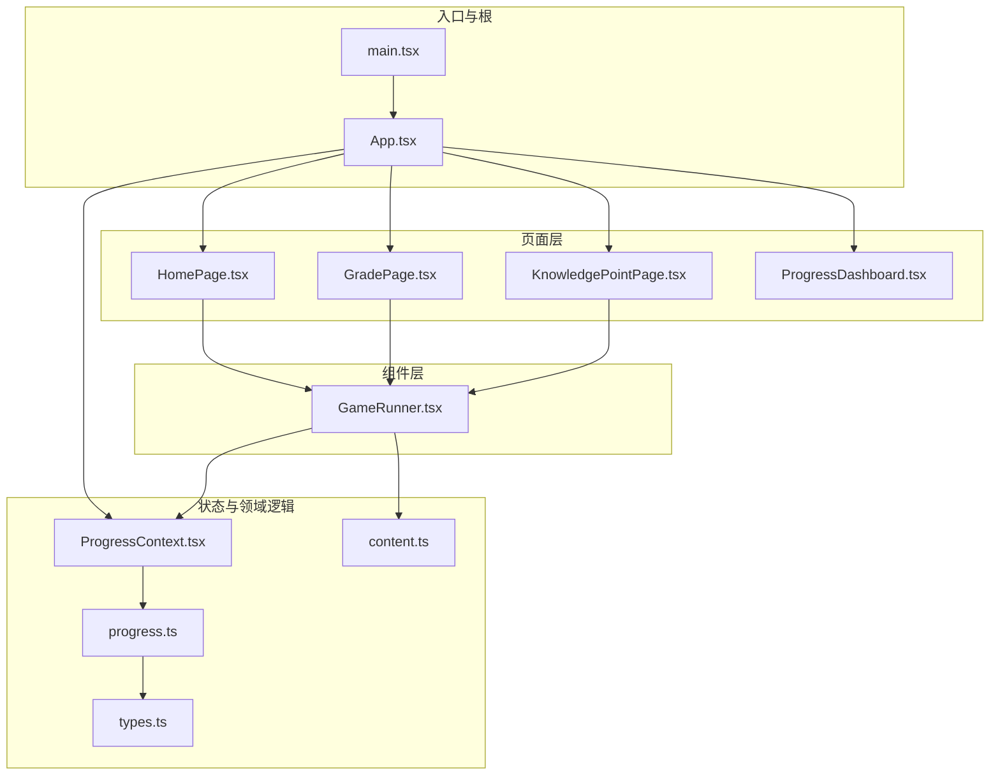
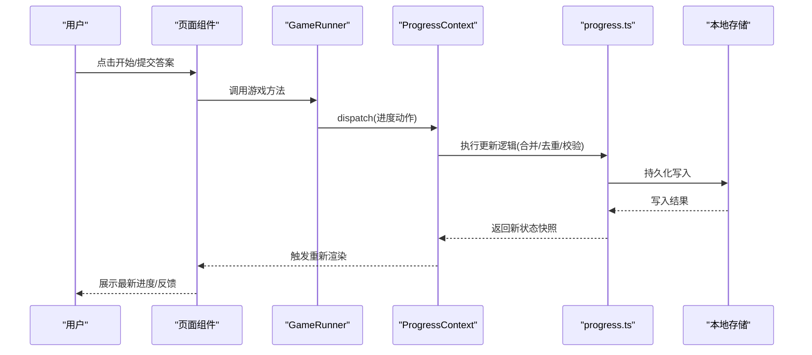
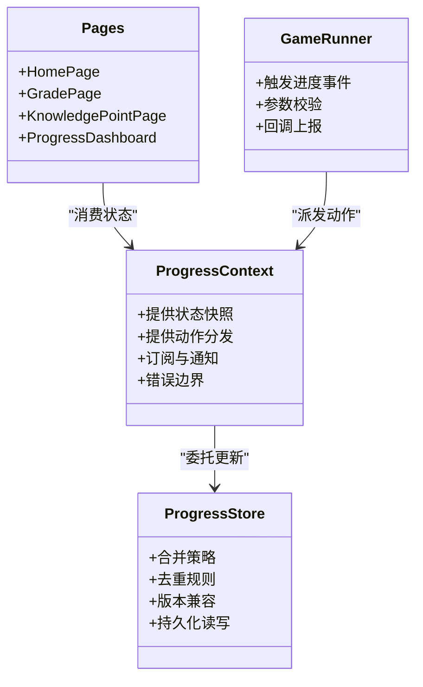
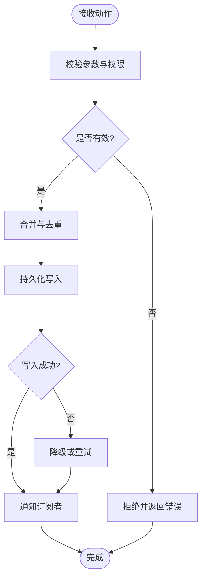
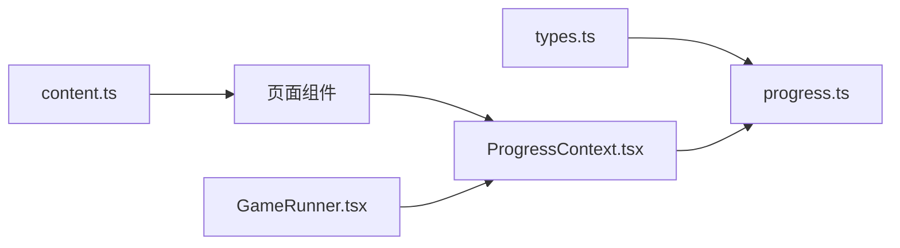

# 状态管理模式

<cite>
**本文引用的文件**   
- [ProgressContext.tsx](file://src/context/ProgressContext.tsx)
- [progress.ts](file://src/lib/progress.ts)
- [App.tsx](file://src/App.tsx)
- [main.tsx](file://src/main.tsx)
- [HomePage.tsx](file://src/pages/HomePage.tsx)
- [GradePage.tsx](file://src/pages/GradePage.tsx)
- [KnowledgePointPage.tsx](file://src/pages/KnowledgePointPage.tsx)
- [ProgressDashboard.tsx](file://src/pages/ProgressDashboard.tsx)
- [GameRunner.tsx](file://src/components/GameRunner.tsx)
- [Content.tsx](file://src/lib/content.ts)
- [types.ts](file://src/lib/types.ts)
</cite>

## 目录
1. [简介](#简介)
2. [项目结构](#项目结构)
3. [核心组件](#核心组件)
4. [架构总览](#架构总览)
5. [详细组件分析](#详细组件分析)
6. [依赖关系分析](#依赖关系分析)
7. [性能考量](#性能考量)
8. [故障排查指南](#故障排查指南)
9. [结论](#结论)
10. [附录](#附录)

## 简介
本文件面向 math-k6 项目的状态管理模式，聚焦于 React Context API 的使用模式与最佳实践。内容涵盖 Provider 组件设计、状态提升策略、性能优化技巧、应用级与组件级状态的划分原则、状态同步与冲突解决、单向数据流实现、避免循环依赖与数据竞争，以及状态调试工具、性能监控与内存泄漏防护。同时给出复杂状态场景的处理方案与重构建议，帮助读者在现有代码基础上构建稳定、可维护的状态体系。

## 项目结构
本项目采用按功能域组织的前端结构：页面层（pages）、业务组件（components）、可视化组件（visualizations）、内容与类型定义（lib）、上下文与全局状态（context）等。状态管理以 React Context 为核心，围绕学习进度这一关键领域进行集中管理，并通过 lib 层的持久化与类型系统提供支撑。

图表来源
- [main.tsx](file://src/main.tsx)
- [App.tsx](file://src/App.tsx)
- [ProgressContext.tsx](file://src/context/ProgressContext.tsx)
- [progress.ts](file://src/lib/progress.ts)
- [HomePage.tsx](file://src/pages/HomePage.tsx)
- [GradePage.tsx](file://src/pages/GradePage.tsx)
- [KnowledgePointPage.tsx](file://src/pages/KnowledgePointPage.tsx)
- [ProgressDashboard.tsx](file://src/pages/ProgressDashboard.tsx)
- [GameRunner.tsx](file://src/components/GameRunner.tsx)
- [Content.tsx](file://src/lib/content.ts)
- [types.ts](file://src/lib/types.ts)

章节来源
- [main.tsx](file://src/main.tsx)
- [App.tsx](file://src/App.tsx)
- [ProgressContext.tsx](file://src/context/ProgressContext.tsx)
- [progress.ts](file://src/lib/progress.ts)
- [types.ts](file://src/lib/types.ts)

## 核心组件
- ProgressContext：作为应用级学习进度的单一事实来源，提供读取与更新接口，封装增量更新、去重合并、持久化等能力。
- progress.ts：负责本地存储读写、数据结构转换、版本兼容与错误恢复。
- GameRunner：游戏运行器，触发用户交互事件并上报进度变更。
- 页面组件：HomePage、GradePage、KnowledgePointPage、ProgressDashboard 通过 Context 订阅进度变化，驱动 UI 渲染。

章节来源
- [ProgressContext.tsx](file://src/context/ProgressContext.tsx)
- [progress.ts](file://src/lib/progress.ts)
- [GameRunner.tsx](file://src/components/GameRunner.tsx)
- [HomePage.tsx](file://src/pages/HomePage.tsx)
- [GradePage.tsx](file://src/pages/GradePage.tsx)
- [KnowledgePointPage.tsx](file://src/pages/KnowledgePointPage.tsx)
- [ProgressDashboard.tsx](file://src/pages/ProgressDashboard.tsx)

## 架构总览
下图展示了基于 React Context 的单向数据流与状态更新路径。Provider 位于应用根部，页面与组件通过消费 Context 获取只读状态；所有变更通过统一 action 进入 progress.ts 处理，再回写至 Context，确保数据一致性。

图表来源
- [ProgressContext.tsx](file://src/context/ProgressContext.tsx)
- [progress.ts](file://src/lib/progress.ts)
- [GameRunner.tsx](file://src/components/GameRunner.tsx)
- [HomePage.tsx](file://src/pages/HomePage.tsx)
- [GradePage.tsx](file://src/pages/GradePage.tsx)
- [KnowledgePointPage.tsx](file://src/pages/KnowledgePointPage.tsx)
- [ProgressDashboard.tsx](file://src/pages/ProgressDashboard.tsx)

## 详细组件分析

### ProgressContext：Provider 设计与状态提升
- 职责边界：仅暴露最小化的状态与动作集合，避免将无关数据放入 Context，减少不必要的重渲染。
- 状态提升策略：将“学习进度”从多个页面与游戏组件提升到应用级，保证跨页面一致性与可观测性。
- 性能优化：
  - 使用稳定的对象引用与选择性订阅，避免全量更新。
  - 对频繁更新的字段进行拆分，按需发布。
  - 批量更新动作，减少多次渲染。
- 错误处理：对非法动作进行防御性校验，记录不可恢复错误并提供降级路径。

章节来源
- [ProgressContext.tsx](file://src/context/ProgressContext.tsx)

#### 类图（概念映射到实际模块）

图表来源
- [ProgressContext.tsx](file://src/context/ProgressContext.tsx)
- [progress.ts](file://src/lib/progress.ts)
- [GameRunner.tsx](file://src/components/GameRunner.tsx)
- [HomePage.tsx](file://src/pages/HomePage.tsx)
- [GradePage.tsx](file://src/pages/GradePage.tsx)
- [KnowledgePointPage.tsx](file://src/pages/KnowledgePointPage.tsx)
- [ProgressDashboard.tsx](file://src/pages/ProgressDashboard.tsx)

### progress.ts：持久化与数据一致性
- 数据模型：定义进度项的结构、必填字段与约束，确保类型安全。
- 合并策略：支持增量更新、幂等合并、冲突检测与回退。
- 持久化：读写本地存储，处理序列化异常与损坏数据恢复。
- 性能：批量写入、延迟刷新、缓存热点数据。

章节来源
- [progress.ts](file://src/lib/progress.ts)
- [types.ts](file://src/lib/types.ts)

#### 流程图（更新与持久化）

图表来源
- [progress.ts](file://src/lib/progress.ts)

### GameRunner：事件触发与上报
- 职责：封装游戏流程，收集用户行为，生成标准化进度事件。
- 防抖与节流：对高频操作进行限流，降低更新频率。
- 错误隔离：捕获运行时异常，避免影响主线程渲染。

章节来源
- [GameRunner.tsx](file://src/components/GameRunner.tsx)

### 页面组件：消费状态与单向数据流
- HomePage、GradePage、KnowledgePointPage：根据当前知识点与年级选择游戏，订阅进度变化，驱动导航与提示。
- ProgressDashboard：汇总展示学习进度，支持筛选与导出。
- 单向数据流：页面只读 Context 状态，通过动作派发更新，禁止直接修改共享状态。

章节来源
- [HomePage.tsx](file://src/pages/HomePage.tsx)
- [GradePage.tsx](file://src/pages/GradePage.tsx)
- [KnowledgePointPage.tsx](file://src/pages/KnowledgePointPage.tsx)
- [ProgressDashboard.tsx](file://src/pages/ProgressDashboard.tsx)

### 内容与类型系统：为状态提供契约
- content.ts：加载知识点元数据与游戏配置，为进度项提供维度键值。
- types.ts：定义进度、游戏、知识点等类型，确保前后端与组件间的数据契约一致。

章节来源
- [Content.tsx](file://src/lib/content.ts)
- [types.ts](file://src/lib/types.ts)

## 依赖关系分析
- 低耦合：Context 仅依赖 progress.ts 的类型与持久化逻辑，不感知具体页面实现。
- 高内聚：progress.ts 聚合了数据模型、合并策略与持久化，便于测试与维护。
- 无环依赖：页面与组件仅消费 Context，不反向依赖 Context 内部实现细节。

图表来源
- [types.ts](file://src/lib/types.ts)
- [progress.ts](file://src/lib/progress.ts)
- [Content.tsx](file://src/lib/content.ts)
- [ProgressContext.tsx](file://src/context/ProgressContext.tsx)
- [GameRunner.tsx](file://src/components/GameRunner.tsx)
- [HomePage.tsx](file://src/pages/HomePage.tsx)
- [GradePage.tsx](file://src/pages/GradePage.tsx)
- [KnowledgePointPage.tsx](file://src/pages/KnowledgePointPage.tsx)
- [ProgressDashboard.tsx](file://src/pages/ProgressDashboard.tsx)

章节来源
- [types.ts](file://src/lib/types.ts)
- [progress.ts](file://src/lib/progress.ts)
- [Content.tsx](file://src/lib/content.ts)
- [ProgressContext.tsx](file://src/context/ProgressContext.tsx)
- [GameRunner.tsx](file://src/components/GameRunner.tsx)
- [HomePage.tsx](file://src/pages/HomePage.tsx)
- [GradePage.tsx](file://src/pages/GradePage.tsx)
- [KnowledgePointPage.tsx](file://src/pages/KnowledgePointPage.tsx)
- [ProgressDashboard.tsx](file://src/pages/ProgressDashboard.tsx)

## 性能考量
- 最小化 Context 粒度：将频繁变化的字段拆分为独立 Context，避免全树重渲染。
- 选择性订阅：组件仅订阅所需字段，减少无效更新。
- 批量更新：合并多次小更新为一次大更新，降低渲染次数。
- 惰性初始化：按需加载大型资源与计算密集型逻辑。
- 防抖/节流：对输入与高频事件进行限流，避免抖动导致的性能问题。
- 持久化优化：批量写入与延迟落盘，避免阻塞主线程。

[本节为通用指导，无需列出具体文件来源]

## 故障排查指南
- 常见问题定位：
  - 状态未更新：检查动作是否正确派发，订阅是否覆盖目标字段。
  - 重复渲染：确认是否存在多余 Context 提供者或宽泛订阅。
  - 数据不一致：核对合并策略与去重规则，检查并发更新顺序。
  - 持久化失败：查看本地存储权限、序列化异常与损坏数据恢复。
- 调试工具：
  - 使用浏览器开发者工具的 React DevTools 观察组件树与状态变化。
  - 在 progress.ts 中增加日志输出，追踪动作生命周期与持久化结果。
  - 对关键路径添加单元测试，验证合并与持久化逻辑。
- 内存泄漏防护：
  - 清理定时器与事件监听器，避免组件卸载后继续执行。
  - 避免在 Context 中持有大对象引用，必要时进行弱引用或释放。
  - 谨慎使用闭包捕获可变变量，防止意外引用链延长。

章节来源
- [progress.ts](file://src/lib/progress.ts)
- [ProgressContext.tsx](file://src/context/ProgressContext.tsx)
- [GameRunner.tsx](file://src/components/GameRunner.tsx)

## 结论
math-k6 的状态管理以 React Context 为核心，结合 lib 层的持久化与类型系统，构建了清晰、可维护的单向数据流。通过 Provider 的最小化设计、选择性订阅与批量更新，实现了良好的性能与可扩展性。建议在后续迭代中持续细化 Context 粒度、完善错误恢复机制，并引入更丰富的调试与监控手段，以应对复杂状态场景与规模增长。

[本节为总结性内容，无需列出具体文件来源]

## 附录
- 最佳实践清单：
  - 明确应用级与组件级状态边界，优先局部状态，必要时提升。
  - 使用类型系统约束状态结构，避免隐式约定。
  - 对异步与持久化操作进行错误边界保护。
  - 保持动作幂等，确保重复派发不会产生副作用。
  - 定期审查重渲染热点，优化订阅范围与更新频率。
- 重构建议：
  - 将高频更新字段拆分至独立 Context，降低耦合。
  - 抽象通用的合并与持久化策略，形成可复用库。
  - 引入中间件模式，扩展日志、埋点与监控能力。

[本节为通用指导，无需列出具体文件来源]