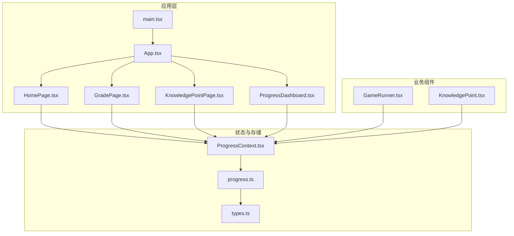
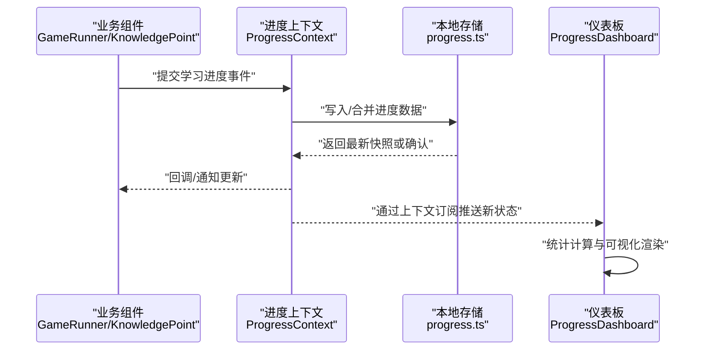
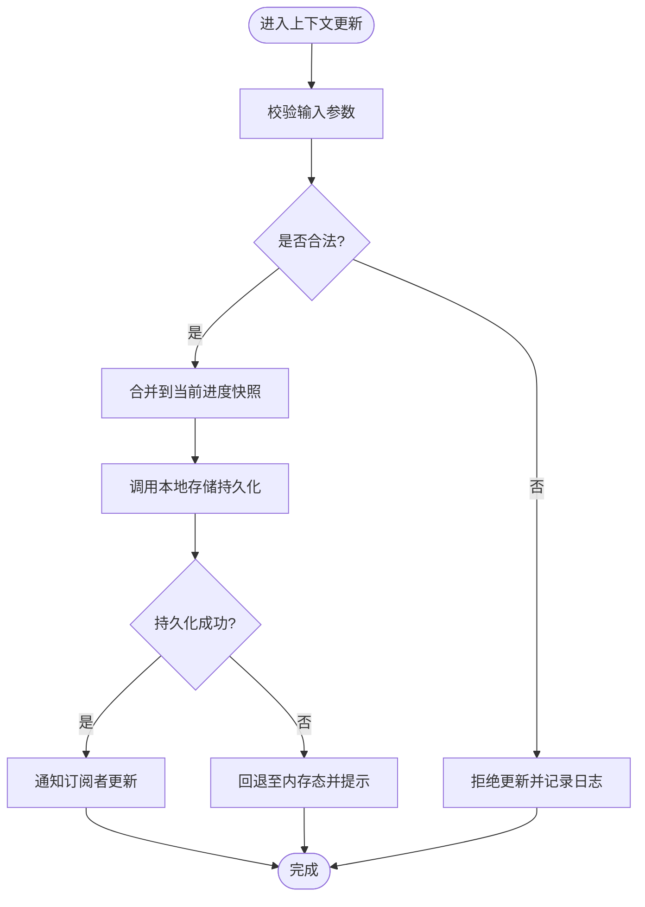
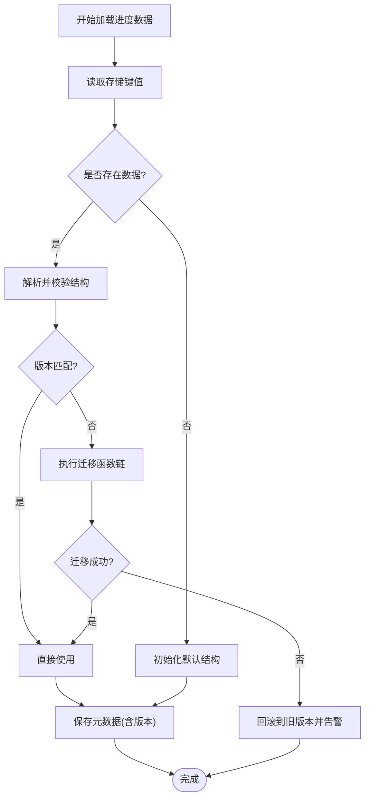
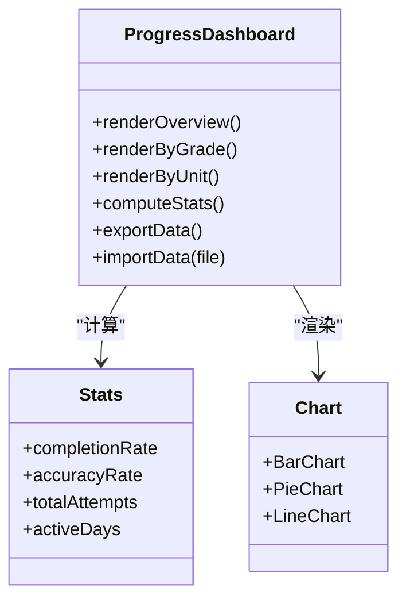
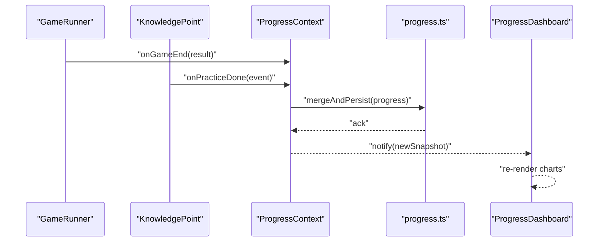
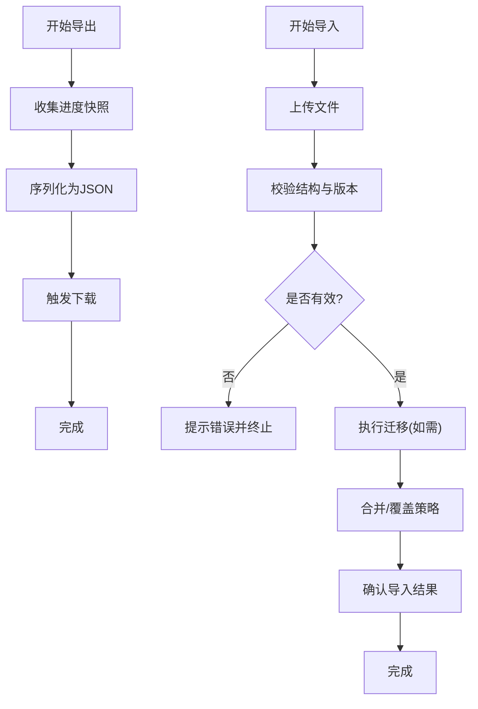
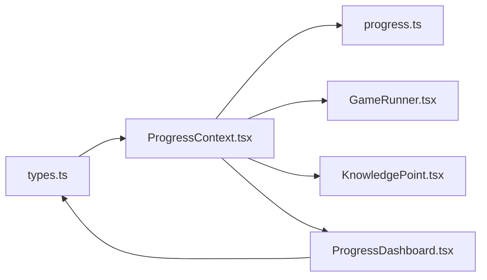

# 进度数据流

<cite>
**本文引用的文件**   
- [ProgressContext.tsx](file://src/context/ProgressContext.tsx)
- [progress.ts](file://src/lib/progress.ts)
- [types.ts](file://src/lib/types.ts)
- [ProgressDashboard.tsx](file://src/pages/ProgressDashboard.tsx)
- [GameRunner.tsx](file://src/components/GameRunner.tsx)
- [KnowledgePoint.tsx](file://src/components/KnowledgePoint.tsx)
- [HomePage.tsx](file://src/pages/HomePage.tsx)
- [GradePage.tsx](file://src/pages/GradePage.tsx)
- [KnowledgePointPage.tsx](file://src/pages/KnowledgePointPage.tsx)
- [App.tsx](file://src/App.tsx)
- [main.tsx](file://src/main.tsx)
</cite>

## 目录
1. [简介](#简介)
2. [项目结构](#项目结构)
3. [核心组件](#核心组件)
4. [架构总览](#架构总览)
5. [详细组件分析](#详细组件分析)
6. [依赖关系分析](#依赖关系分析)
7. [性能考量](#性能考量)
8. [故障排查指南](#故障排查指南)
9. [结论](#结论)
10. [附录](#附录)

## 简介
本文件聚焦 math-k6 项目的“学习进度”数据流，围绕以下目标展开：
- 全局状态管理：基于 ProgressContext.tsx 的上下文状态、数据结构与更新机制。
- 本地存储逻辑：基于 progress.ts 的数据持久化、版本兼容与迁移策略。
- 仪表板展示：ProgressDashboard.tsx 的数据聚合、统计计算与可视化呈现。
- 事件监听与实时更新：游戏运行过程中的进度上报、订阅与渲染优化。
- 导入导出与备份恢复：进度数据的序列化、校验、导入导出与回滚方案。

## 项目结构
进度相关代码主要分布在 context、lib、pages 与 components 四个层次：
- context/ProgressContext.tsx：提供全局进度状态与更新方法，供应用层消费。
- lib/progress.ts：封装本地存储（如 localStorage）读写、版本迁移与校验。
- lib/types.ts：定义进度相关类型与接口契约。
- pages/ProgressDashboard.tsx：进度仪表盘页面，负责数据聚合与图表展示。
- components/GameRunner.tsx、KnowledgePoint.tsx：触发进度变更的业务入口。
- pages/HomePage.tsx、GradePage.tsx、KnowledgePointPage.tsx：页面级使用进度上下文。
- App.tsx、main.tsx：应用启动与上下文挂载。

**图示来源** 
- [App.tsx](file://src/App.tsx)
- [main.tsx](file://src/main.tsx)
- [HomePage.tsx](file://src/pages/HomePage.tsx)
- [GradePage.tsx](file://src/pages/GradePage.tsx)
- [KnowledgePointPage.tsx](file://src/pages/KnowledgePointPage.tsx)
- [ProgressDashboard.tsx](file://src/pages/ProgressDashboard.tsx)
- [GameRunner.tsx](file://src/components/GameRunner.tsx)
- [KnowledgePoint.tsx](file://src/components/KnowledgePoint.tsx)
- [ProgressContext.tsx](file://src/context/ProgressContext.tsx)
- [progress.ts](file://src/lib/progress.ts)
- [types.ts](file://src/lib/types.ts)

**章节来源**
- [App.tsx](file://src/App.tsx)
- [main.tsx](file://src/main.tsx)
- [ProgressContext.tsx](file://src/context/ProgressContext.tsx)
- [progress.ts](file://src/lib/progress.ts)
- [types.ts](file://src/lib/types.ts)
- [ProgressDashboard.tsx](file://src/pages/ProgressDashboard.tsx)
- [GameRunner.tsx](file://src/components/GameRunner.tsx)
- [KnowledgePoint.tsx](file://src/components/KnowledgePoint.tsx)
- [HomePage.tsx](file://src/pages/HomePage.tsx)
- [GradePage.tsx](file://src/pages/GradePage.tsx)
- [KnowledgePointPage.tsx](file://src/pages/KnowledgePointPage.tsx)

## 核心组件
- 全局进度上下文（ProgressContext.tsx）
  - 职责：维护学习进度的全局状态，暴露读取与更新 API，协调本地存储读写。
  - 关键点：状态初始化、增量更新、批量更新、去抖/节流、错误边界处理。
- 本地存储模块（progress.ts）
  - 职责：封装持久化读写、版本检测与迁移、数据校验与降级策略。
  - 关键点：键名约定、Schema 版本、迁移函数、读写异常兜底。
- 类型契约（types.ts）
  - 职责：定义进度模型、事件结构、统计指标等类型。
  - 关键点：必填字段、枚举值、扩展点设计。

**章节来源**
- [ProgressContext.tsx](file://src/context/ProgressContext.tsx)
- [progress.ts](file://src/lib/progress.ts)
- [types.ts](file://src/lib/types.ts)

## 架构总览
进度数据流遵循“组件触发 → 上下文更新 → 存储落盘 → 仪表板订阅渲染”的闭环。

**图示来源** 
- [GameRunner.tsx](file://src/components/GameRunner.tsx)
- [KnowledgePoint.tsx](file://src/components/KnowledgePoint.tsx)
- [ProgressContext.tsx](file://src/context/ProgressContext.tsx)
- [progress.ts](file://src/lib/progress.ts)
- [ProgressDashboard.tsx](file://src/pages/ProgressDashboard.tsx)

## 详细组件分析

### 全局状态管理（ProgressContext.tsx）
- 数据结构
  - 以知识点为维度记录学习进度，包含完成度、尝试次数、正确率、最近学习时间等字段。
  - 支持按年级/单元聚合的全局视图，便于仪表板统计。
- 状态更新机制
  - 单条更新：针对单个知识点的增量更新（如 +1 次尝试、+1 正确）。
  - 批量更新：在关卡结算时一次性合并多条结果，减少重渲染。
  - 幂等性：基于时间戳或版本号避免重复提交导致的数据不一致。
- 组件间通信模式
  - 通过 React Context 提供 useProgress hook，组件订阅后自动响应变化。
  - 对高频更新场景采用防抖/节流策略，降低渲染压力。
- 错误处理
  - 捕获存储异常并回退到内存态，保证 UI 可用。
  - 对非法输入进行校验与丢弃，防止污染数据。

**图示来源** 
- [ProgressContext.tsx](file://src/context/ProgressContext.tsx)
- [progress.ts](file://src/lib/progress.ts)

**章节来源**
- [ProgressContext.tsx](file://src/context/ProgressContext.tsx)

### 本地存储逻辑（progress.ts）
- 数据持久化
  - 统一键名管理，避免冲突；支持多用户/多设备隔离（可扩展）。
  - 读写操作封装，统一异常处理与重试策略。
- 版本兼容性与迁移
  - 存储元数据中包含 schemaVersion，加载时对比当前版本。
  - 若版本不匹配，执行迁移函数链，逐步升级到最新结构。
  - 迁移失败保留旧数据并提供回滚入口。
- 数据校验
  - 加载后进行 Schema 校验，缺失字段补默认值，非法字段清理。
  - 对关键指标（如正确率）做范围裁剪与一致性检查。

**图示来源** 
- [progress.ts](file://src/lib/progress.ts)

**章节来源**
- [progress.ts](file://src/lib/progress.ts)

### 进度仪表板（ProgressDashboard.tsx）
- 数据展示逻辑
  - 从上下文获取全局进度快照，按年级/单元分组展示。
  - 支持筛选（年级、单元、知识点）、排序（完成度、最近学习时间）。
- 统计计算方法
  - 总体完成率：已完成知识点数 / 总知识点数。
  - 平均正确率：加权平均（按尝试次数权重）。
  - 学习时长：累计练习时间与最近活跃时间。
  - 趋势指标：近 N 日/周的正确率与完成量折线。
- 可视化呈现
  - 使用柱状图、饼图、折线图等多维图表组合。
  - 交互：点击知识点跳转详情，悬停显示明细。

**图示来源** 
- [ProgressDashboard.tsx](file://src/pages/ProgressDashboard.tsx)

**章节来源**
- [ProgressDashboard.tsx](file://src/pages/ProgressDashboard.tsx)

### 事件监听与实时更新
- 事件来源
  - GameRunner.tsx：游戏结束或阶段结算时上报答题结果、耗时、难度等。
  - KnowledgePoint.tsx：知识点浏览、练习、测验等行为上报。
- 实时机制
  - 上下文通过发布/订阅模式将变更广播给所有订阅者（如仪表板）。
  - 对高频事件进行批处理与去抖，避免频繁重渲染。
- 性能优化
  - 局部更新：仅更新受影响的知识点节点。
  - 虚拟列表：大数据量下的列表渲染优化。
  - 懒加载：按需加载图表与统计模块。

**图示来源** 
- [GameRunner.tsx](file://src/components/GameRunner.tsx)
- [KnowledgePoint.tsx](file://src/components/KnowledgePoint.tsx)
- [ProgressContext.tsx](file://src/context/ProgressContext.tsx)
- [progress.ts](file://src/lib/progress.ts)
- [ProgressDashboard.tsx](file://src/pages/ProgressDashboard.tsx)

**章节来源**
- [GameRunner.tsx](file://src/components/GameRunner.tsx)
- [KnowledgePoint.tsx](file://src/components/KnowledgePoint.tsx)
- [ProgressContext.tsx](file://src/context/ProgressContext.tsx)
- [progress.ts](file://src/lib/progress.ts)
- [ProgressDashboard.tsx](file://src/pages/ProgressDashboard.tsx)

### 导入导出与备份恢复
- 导出
  - 生成 JSON 快照，包含进度数据与元数据（版本、时间戳）。
  - 支持选择导出范围（全量/按年级/按单元）。
- 导入
  - 校验文件格式与 Schema 版本，必要时执行迁移。
  - 冲突解决：覆盖/合并/跳过策略可选。
- 备份恢复
  - 定时备份：定期生成带时间戳的备份文件。
  - 一键恢复：从备份文件还原，失败时提供回滚。

**图示来源** 
- [ProgressDashboard.tsx](file://src/pages/ProgressDashboard.tsx)
- [progress.ts](file://src/lib/progress.ts)

**章节来源**
- [ProgressDashboard.tsx](file://src/pages/ProgressDashboard.tsx)
- [progress.ts](file://src/lib/progress.ts)

## 依赖关系分析
- 组件依赖
  - 页面与组件依赖 ProgressContext 提供的状态与更新方法。
  - 仪表板依赖 types.ts 定义的统计与图表数据结构。
- 存储依赖
  - progress.ts 作为唯一持久化入口，被上下文与仪表板共同调用。
- 潜在循环依赖
  - 通过类型解耦与单向数据流避免循环引用。

**图示来源** 
- [types.ts](file://src/lib/types.ts)
- [ProgressContext.tsx](file://src/context/ProgressContext.tsx)
- [progress.ts](file://src/lib/progress.ts)
- [GameRunner.tsx](file://src/components/GameRunner.tsx)
- [KnowledgePoint.tsx](file://src/components/KnowledgePoint.tsx)
- [ProgressDashboard.tsx](file://src/pages/ProgressDashboard.tsx)

**章节来源**
- [types.ts](file://src/lib/types.ts)
- [ProgressContext.tsx](file://src/context/ProgressContext.tsx)
- [progress.ts](file://src/lib/progress.ts)
- [GameRunner.tsx](file://src/components/GameRunner.tsx)
- [KnowledgePoint.tsx](file://src/components/KnowledgePoint.tsx)
- [ProgressDashboard.tsx](file://src/pages/ProgressDashboard.tsx)

## 性能考量
- 渲染优化
  - 使用 memo/useMemo 缓存统计结果与图表数据。
  - 列表虚拟化与分页加载，避免大 DOM 渲染。
- 更新频率控制
  - 对高频事件进行批处理与去抖，降低上下文更新频率。
  - 仅在必要字段变化时触发重渲染。
- I/O 优化
  - 本地存储读写合并，避免频繁磁盘操作。
  - 异步持久化，优先保证 UI 流畅。

[本节为通用指导，无需特定文件来源]

## 故障排查指南
- 常见问题
  - 进度未持久化：检查存储权限与键名冲突。
  - 版本不兼容：查看 schemaVersion 与迁移函数执行情况。
  - 仪表板数据不同步：确认上下文订阅与事件上报链路。
- 诊断步骤
  - 打开控制台日志，定位异常堆栈。
  - 导出当前快照，验证数据结构完整性。
  - 回滚到上一版本备份，验证问题是否复现。

**章节来源**
- [progress.ts](file://src/lib/progress.ts)
- [ProgressContext.tsx](file://src/context/ProgressContext.tsx)
- [ProgressDashboard.tsx](file://src/pages/ProgressDashboard.tsx)

## 结论
math-k6 的进度数据流以上下文为核心、本地存储为基石，形成清晰的双向数据通道：业务组件上报事件，上下文统一更新并持久化，仪表板订阅渲染。通过版本迁移、数据校验与性能优化，系统在易用性与稳定性之间取得平衡。建议持续完善导入导出与备份恢复能力，提升数据可移植性与容灾能力。

[本节为总结性内容，无需特定文件来源]

## 附录
- 术语表
  - 进度快照：某一时刻的学习进度完整数据集合。
  - 迁移函数：用于将旧版数据结构升级到新版结构的函数。
  - 幂等更新：多次相同更新不会产生副作用。
- 最佳实践
  - 保持 Schema 向后兼容，新增字段设置默认值。
  - 对关键路径添加单元测试与集成测试。
  - 监控存储大小与读写延迟，及时优化。

[本节为补充信息，无需特定文件来源]