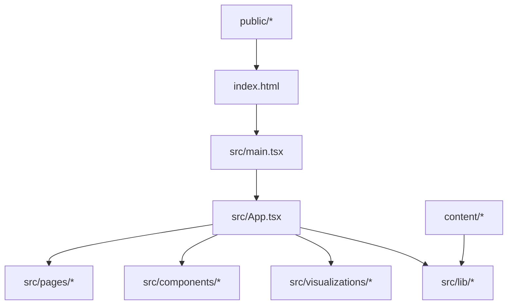
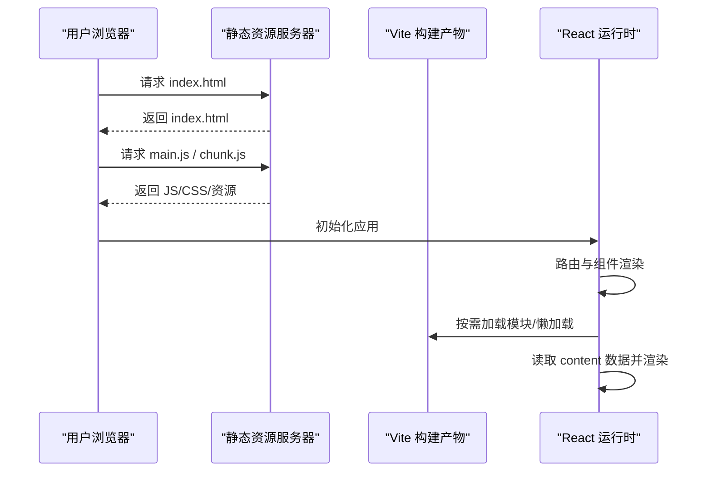
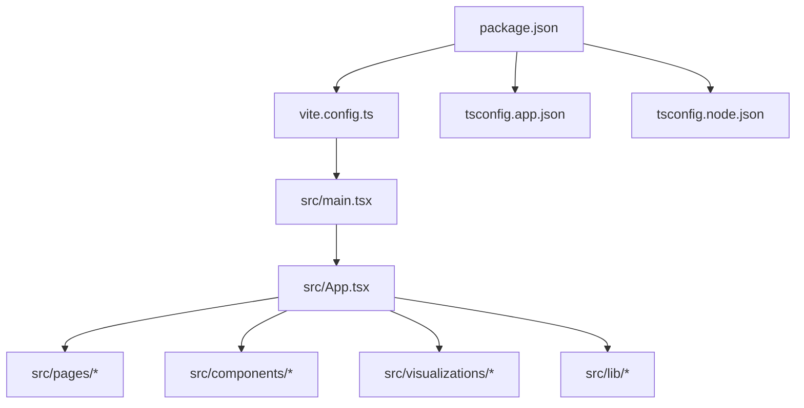

# 构建部署

<cite>
**本文引用的文件**   
- [package.json](file://package.json)
- [vite.config.ts](file://vite.config.ts)
- [tsconfig.app.json](file://tsconfig.app.json)
- [tsconfig.node.json](file://tsconfig.node.json)
- [tsconfig.json](file://tsconfig.json)
- [index.html](file://index.html)
- [src/main.tsx](file://src/main.tsx)
- [src/App.tsx](file://src/App.tsx)
- [src/pages/HomePage.tsx](file://src/pages/HomePage.tsx)
- [src/pages/GradePage.tsx](file://src/pages/GradePage.tsx)
- [src/pages/KnowledgePointPage.tsx](file://src/pages/KnowledgePointPage.tsx)
- [src/pages/ProgressDashboard.tsx](file://src/pages/ProgressDashboard.tsx)
- [src/components/GameRunner.tsx](file://src/components/GameRunner.tsx)
- [src/lib/content.ts](file://src/lib/content.ts)
- [src/lib/progress.ts](file://src/lib/progress.ts)
- [src/test/setup.ts](file://src/test/setup.ts)
- [public/](file://public/)
</cite>

## 目录
1. [简介](#简介)
2. [项目结构](#项目结构)
3. [核心组件](#核心组件)
4. [架构总览](#架构总览)
5. [详细组件分析](#详细组件分析)
6. [依赖分析](#依赖分析)
7. [性能考虑](#性能考虑)
8. [故障排除指南](#故障排除指南)
9. [结论](#结论)
10. [附录](#附录)

## 简介
本文件为 math-k6 项目的构建与部署指南，覆盖 Vite 构建配置与优化、TypeScript 编译与类型检查、开发与生产环境差异、代码分割与懒加载、静态资源与样式打包、环境变量与 API 代理、Docker 容器化、CI/CD 流水线与自动化测试、构建产物分析与性能监控、错误追踪、部署清单与故障排除。文档面向不同技术背景的读者，提供从概览到落地的完整说明。

## 项目结构
项目采用 Vite + React + TypeScript 的前端工程化方案，核心入口为 index.html 与 src/main.tsx，页面与组件位于 src 下，内容数据通过 content 目录的 JSON/Markdown 驱动，可视化组件集中于 visualizations，测试位于 test 目录。

图表来源
- [index.html:1-200](file://index.html#L1-L200)
- [src/main.tsx:1-200](file://src/main.tsx#L1-L200)
- [src/App.tsx:1-200](file://src/App.tsx#L1-L200)

章节来源
- [index.html:1-200](file://index.html#L1-L200)
- [src/main.tsx:1-200](file://src/main.tsx#L1-L200)
- [src/App.tsx:1-200](file://src/App.tsx#L1-L200)

## 核心组件
- 构建工具：Vite（开发服务器、热更新、按需编译、插件生态）
- 前端框架：React（组件化 UI）
- 语言与类型：TypeScript（类型安全、编译时检查）
- 包管理：npm（脚本与依赖）
- 测试：基于 Vite 的测试运行器（Jest/Vitest，具体以 package.json 脚本为准）

章节来源
- [package.json:1-200](file://package.json#L1-L200)
- [vite.config.ts:1-200](file://vite.config.ts#L1-L200)
- [tsconfig.app.json:1-200](file://tsconfig.app.json#L1-L200)
- [tsconfig.node.json:1-200](file://tsconfig.node.json#L1-L200)
- [tsconfig.json:1-200](file://tsconfig.json#L1-L200)

## 架构总览
下图展示从浏览器到应用启动的关键路径，以及构建产物与服务端的交互关系。

图表来源
- [index.html:1-200](file://index.html#L1-L200)
- [src/main.tsx:1-200](file://src/main.tsx#L1-L200)
- [src/App.tsx:1-200](file://src/App.tsx#L1-L200)

## 详细组件分析

### Vite 构建配置与优化策略
- 构建目标与环境变量
  - 使用 Vite 内置的环境变量注入机制，区分开发/生产环境。
  - 可通过命令行或 .env.* 文件注入变量，并在构建时替换。
- 输出与缓存
  - 生产构建启用代码压缩、Tree Shaking、CSS 提取与哈希文件名。
  - 合理设置分包策略，提升缓存命中率。
- 插件与扩展
  - 可集成 React、TypeScript、路径别名、图片字体处理等插件。
- 开发体验
  - 开启热更新、Source Map、端口与代理配置。

章节来源
- [vite.config.ts:1-200](file://vite.config.ts#L1-L200)
- [package.json:1-200](file://package.json#L1-L200)

### TypeScript 编译配置与类型检查
- tsconfig 分层
  - tsconfig.json 作为根配置，聚合 app/node 子配置。
  - tsconfig.app.json 用于应用代码编译与类型检查。
  - tsconfig.node.json 用于 Node 侧脚本与 Vite 插件相关类型。
- 关键选项
  - 严格模式、模块解析、路径别名、JSX 支持、输出目录与声明文件。
- 类型检查流程
  - 开发阶段通过编辑器与 CLI 进行即时检查。
  - CI 中执行类型检查与构建，确保质量门禁。

章节来源
- [tsconfig.json:1-200](file://tsconfig.json#L1-L200)
- [tsconfig.app.json:1-200](file://tsconfig.app.json#L1-L200)
- [tsconfig.node.json:1-200](file://tsconfig.node.json#L1-L200)

### 开发与生产环境的差异化配置
- 环境变量
  - 开发：本地调试、API 代理、详细日志、Source Map。
  - 生产：最小化、禁用调试、启用缓存与 CDN。
- 构建脚本
  - 开发脚本：启动 Vite Dev Server，监听变更。
  - 生产脚本：构建静态资源，输出至 dist。
- 代理与跨域
  - 开发环境通过 Vite 代理转发后端接口，避免跨域问题。
  - 生产环境由反向代理或网关统一处理跨域。

章节来源
- [package.json:1-200](file://package.json#L1-L200)
- [vite.config.ts:1-200](file://vite.config.ts#L1-L200)

### 代码分割与懒加载策略
- 路由级拆分
  - 将页面组件按路由进行动态导入，减少首屏体积。
- 组件级拆分
  - 对重型可视化组件按需加载，降低初始渲染压力。
- 第三方库拆分
  - 将大依赖独立成 chunk，利用浏览器并行下载与缓存。
- 预取与预加载
  - 根据用户行为预测性加载资源，提升交互流畅度。

章节来源
- [src/App.tsx:1-200](file://src/App.tsx#L1-L200)
- [src/pages/HomePage.tsx:1-200](file://src/pages/HomePage.tsx#L1-L200)
- [src/pages/GradePage.tsx:1-200](file://src/pages/GradePage.tsx#L1-L200)
- [src/pages/KnowledgePointPage.tsx:1-200](file://src/pages/KnowledgePointPage.tsx#L1-L200)
- [src/pages/ProgressDashboard.tsx:1-200](file://src/pages/ProgressDashboard.tsx#L1-L200)
- [src/components/GameRunner.tsx:1-200](file://src/components/GameRunner.tsx#L1-L200)

### 静态资源处理、CSS 样式打包与字体优化
- 静态资源
  - public 目录下的文件直接复制到构建产物，适合 favicon、manifest 等。
  - 源码内引入的资源会被 Vite 处理，生成带哈希的文件名。
- CSS 打包
  - 自动提取、合并、压缩；可按需分离组件样式。
  - 支持 PostCSS、Tailwind 等生态（如项目使用）。
- 字体优化
  - 使用 woff2/woff 格式，配合 font-display 策略。
  - 按需加载字体，避免阻塞首屏。

章节来源
- [public/:1-200](file://public/#L1-L200)
- [vite.config.ts:1-200](file://vite.config.ts#L1-L200)
- [src/index.css:1-200](file://src/index.css#L1-L200)

### 环境变量配置、API 代理与跨域处理
- 环境变量
  - 使用 .env.development/.env.production 管理不同环境配置。
  - 在 Vite 中通过 import.meta.env 访问。
- API 代理
  - 开发环境配置 proxy，将 /api 请求转发至后端服务。
- 跨域处理
  - 生产环境通过 Nginx/网关统一处理 CORS 与鉴权头。

章节来源
- [vite.config.ts:1-200](file://vite.config.ts#L1-L200)
- [package.json:1-200](file://package.json#L1-L200)

### Docker 容器化部署方案
- 多阶段构建
  - 构建阶段：安装依赖、执行 Vite 构建，产出静态资源。
  - 运行阶段：使用轻量镜像（如 Nginx）托管静态文件。
- 镜像优化
  - 仅复制必要文件，启用层缓存，减小镜像体积。
- 部署方式
  - 容器编排（Kubernetes/Docker Compose），结合 Ingress 与证书管理。

章节来源
- [package.json:1-200](file://package.json#L1-L200)
- [vite.config.ts:1-200](file://vite.config.ts#L1-L200)

### CI/CD 流水线配置与自动化测试集成
- 流水线步骤
  - 拉取代码 → 安装依赖 → 类型检查 → 单元测试 → 构建 → 产物上传。
- 缓存与并行
  - 缓存 node_modules 与构建缓存，加速流水线。
- 测试集成
  - 使用 Vite 测试运行器执行测试用例，生成覆盖率报告。
- 发布策略
  - 分支保护、语义化版本、制品归档与回滚策略。

章节来源
- [package.json:1-200](file://package.json#L1-L200)
- [src/test/setup.ts:1-200](file://src/test/setup.ts#L1-L200)

### 构建产物分析、性能监控与错误追踪
- 产物分析
  - 使用 bundle 分析工具识别大包与重复依赖，优化拆分。
- 性能监控
  - 接入 Web Vitals、自定义指标上报，观察 LCP/FID/CLS。
- 错误追踪
  - 集成 Sentry 等错误上报平台，捕获未处理异常与 Promise 拒绝。

章节来源
- [package.json:1-200](file://package.json#L1-L200)
- [vite.config.ts:1-200](file://vite.config.ts#L1-L200)

### 部署清单与故障排除指南
- 部署清单
  - 域名与证书、Nginx 配置、环境变量、健康检查、日志收集。
- 常见问题
  - 构建失败：检查 Node 版本、依赖完整性、TS 类型错误。
  - 运行时白屏：检查路由、懒加载、资源路径与 CSP。
  - 跨域错误：确认代理与后端 CORS 配置。
  - 性能问题：分析 bundle、网络瀑布图与内存占用。

章节来源
- [package.json:1-200](file://package.json#L1-L200)
- [vite.config.ts:1-200](file://vite.config.ts#L1-L200)

## 依赖分析
下图展示主要依赖与职责划分，便于理解构建与运行时的依赖关系。

图表来源
- [package.json:1-200](file://package.json#L1-L200)
- [vite.config.ts:1-200](file://vite.config.ts#L1-L200)
- [src/main.tsx:1-200](file://src/main.tsx#L1-L200)
- [src/App.tsx:1-200](file://src/App.tsx#L1-L200)

章节来源
- [package.json:1-200](file://package.json#L1-L200)
- [vite.config.ts:1-200](file://vite.config.ts#L1-L200)

## 性能考虑
- 首屏优化
  - 路由懒加载、关键 CSS 内联、字体延迟加载。
- 缓存策略
  - 长缓存文件名、HTTP 缓存头、Service Worker 缓存（可选）。
- 资源优化
  - 图片压缩与格式转换、SVG 内联、按需加载第三方库。
- 运行时优化
  - 减少重排重绘、虚拟列表、Web Workers（复杂计算）。

[本节为通用指导，不直接分析具体文件]

## 故障排除指南
- 构建阶段
  - 清理缓存后重试，检查 Node 与依赖版本一致性。
  - 查看 TS 类型错误与 Vite 警告，定位问题模块。
- 运行阶段
  - 打开开发者工具检查网络请求与资源加载。
  - 核对环境变量与代理配置，验证后端可达性。
- 性能问题
  - 使用性能面板分析主线程任务与长任务。
  - 对比不同设备与网络的加载表现。

章节来源
- [package.json:1-200](file://package.json#L1-L200)
- [vite.config.ts:1-200](file://vite.config.ts#L1-L200)
- [src/test/setup.ts:1-200](file://src/test/setup.ts#L1-L200)

## 结论
通过合理的 Vite 构建配置、严格的 TypeScript 类型检查、精细的代码分割与资源优化，math-k6 可在开发与生产环境获得稳定高效的构建与运行体验。结合容器化与 CI/CD，可实现自动化测试与持续交付。建议持续监控性能与错误，迭代优化用户体验。

[本节为总结，不直接分析具体文件]

## 附录
- 常用命令
  - 开发：启动本地服务器与热更新。
  - 构建：生成生产静态资源。
  - 测试：执行单元测试与覆盖率统计。
- 最佳实践
  - 小步提交、分支策略、代码审查。
  - 环境变量隔离、敏感信息不上仓。
  - 构建产物签名与校验。

[本节为补充信息，不直接分析具体文件]