# 架构设计

<cite>
**本文引用的文件**   
- [App.tsx](file://src/App.tsx)
- [main.tsx](file://src/main.tsx)
- [Layout.tsx](file://src/components/Layout.tsx)
- [GameRunner.tsx](file://src/components/GameRunner.tsx)
- [DerivationPlayer.tsx](file://src/components/DerivationPlayer.tsx)
- [KnowledgePoint.tsx](file://src/components/KnowledgePoint.tsx)
- [HomePage.tsx](file://src/pages/HomePage.tsx)
- [GradePage.tsx](file://src/pages/GradePage.tsx)
- [KnowledgePointPage.tsx](file://src/pages/KnowledgePointPage.tsx)
- [ProgressDashboard.tsx](file://src/pages/ProgressDashboard.tsx)
- [ProgressContext.tsx](file://src/context/ProgressContext.tsx)
- [content.ts](file://src/lib/content.ts)
- [progress.ts](file://src/lib/progress.ts)
- [types.ts](file://src/lib/types.ts)
- [registry.tsx](file://src/visualizations/registry.tsx)
- [index.json](file://src/content/index.json)
- [package.json](file://package.json)
- [vite.config.ts](file://vite.config.ts)
</cite>

## 目录
1. [简介](#简介)
2. [项目结构](#项目结构)
3. [核心组件](#核心组件)
4. [架构总览](#架构总览)
5. [详细组件分析](#详细组件分析)
6. [依赖分析](#依赖分析)
7. [性能考虑](#性能考虑)
8. [故障排查指南](#故障排查指南)
9. [结论](#结论)
10. [附录](#附录)

## 简介
本文件为 math-k6 项目的全面架构设计文档，面向教学与游戏化学习场景，采用 React + Vite 技术栈。系统以“内容驱动”为核心策略：知识点、讲解、推导与游戏均由声明式配置（JSON/Markdown）驱动，运行时通过统一的游戏引擎接口加载并执行不同题型，配合可视化组件库进行数学概念的动态演示。状态管理基于 React Context API，进度持久化到本地存储，页面路由由 React Router 组织。整体目标是实现可扩展的数学内容生产流水线、统一的交互体验以及可观测、可维护的前端工程体系。

## 项目结构
项目采用按功能域划分的目录组织方式：
- src/pages：页面级路由组件（首页、年级页、知识点页、进度看板）
- src/components：通用 UI 与业务组件（布局、游戏运行器、推导播放器、知识点卡片等）
- src/visualizations：数学可视化组件及注册表
- src/content：内容资源（知识点元数据、讲解、推导、游戏配置）
- src/context：全局状态上下文（学习进度）
- src/lib：领域逻辑与工具（内容加载、进度管理、类型定义）
- public：静态资源
- 根目录配置文件：Vite、TypeScript、包管理等

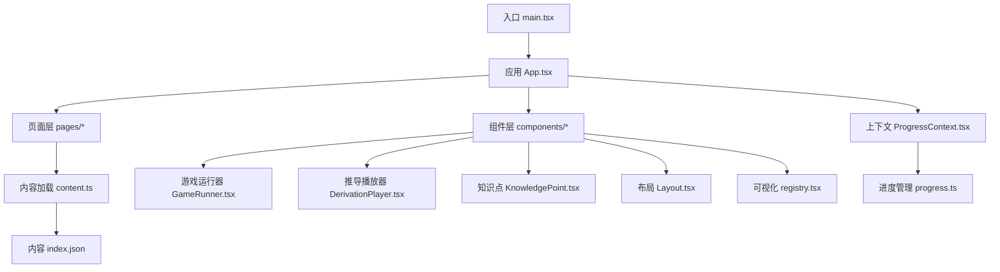

**图表来源** 
- [main.tsx:1-50](file://src/main.tsx#L1-L50)
- [App.tsx:1-120](file://src/App.tsx#L1-L120)
- [GameRunner.tsx:1-200](file://src/components/GameRunner.tsx#L1-L200)
- [DerivationPlayer.tsx:1-150](file://src/components/DerivationPlayer.tsx#L1-L150)
- [KnowledgePoint.tsx:1-120](file://src/components/KnowledgePoint.tsx#L1-L120)
- [Layout.tsx:1-100](file://src/components/Layout.tsx#L1-L100)
- [content.ts:1-120](file://src/lib/content.ts#L1-L120)
- [registry.tsx:1-120](file://src/visualizations/registry.tsx#L1-L120)
- [ProgressContext.tsx:1-120](file://src/context/ProgressContext.tsx#L1-L120)
- [progress.ts:1-120](file://src/lib/progress.ts#L1-L120)
- [index.json:1-50](file://src/content/index.json#L1-L50)

**章节来源**
- [main.tsx:1-50](file://src/main.tsx#L1-L50)
- [App.tsx:1-120](file://src/App.tsx#L1-L120)

## 核心组件
- 应用壳与路由：入口挂载 React 应用，初始化路由与全局上下文，提供页面导航与布局框架。
- 页面组件：首页展示年级与知识点概览；年级页聚合知识点列表；知识点页承载讲解、推导与游戏；进度看板汇总学习数据。
- 游戏运行器：根据 game.json 配置动态渲染对应题型组件，封装生命周期（开始、答题、校验、反馈、完成）。
- 推导播放器：解析 derivation.json，逐步呈现数学推导过程，支持交互控制。
- 知识点卡片：展示知识点元信息与跳转入口。
- 可视化注册表：集中注册数学可视化组件，供游戏与讲解按需调用。
- 上下文与进度：使用 Context 暴露学习进度读写能力，结合本地存储实现持久化。

**章节来源**
- [HomePage.tsx:1-120](file://src/pages/HomePage.tsx#L1-L120)
- [GradePage.tsx:1-150](file://src/pages/GradePage.tsx#L1-L150)
- [KnowledgePointPage.tsx:1-200](file://src/pages/KnowledgePointPage.tsx#L1-L200)
- [ProgressDashboard.tsx:1-150](file://src/pages/ProgressDashboard.tsx#L1-L150)
- [GameRunner.tsx:1-200](file://src/components/GameRunner.tsx#L1-L200)
- [DerivationPlayer.tsx:1-150](file://src/components/DerivationPlayer.tsx#L1-L150)
- [KnowledgePoint.tsx:1-120](file://src/components/KnowledgePoint.tsx#L1-L120)
- [registry.tsx:1-120](file://src/visualizations/registry.tsx#L1-L120)
- [ProgressContext.tsx:1-120](file://src/context/ProgressContext.tsx#L1-L120)
- [progress.ts:1-120](file://src/lib/progress.ts#L1-L120)

## 架构总览
系统采用分层与插件化相结合的设计：
- 表现层：React 页面与组件，负责用户交互与渲染
- 业务层：内容加载、进度管理、游戏运行器、推导播放器
- 数据层：JSON/Markdown 内容资源与本地存储
- 扩展点：可视化组件注册表、题型组件注册机制

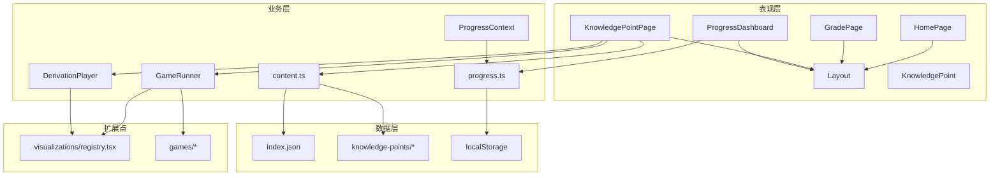

**图表来源** 
- [App.tsx:1-120](file://src/App.tsx#L1-L120)
- [GameRunner.tsx:1-200](file://src/components/GameRunner.tsx#L1-L200)
- [DerivationPlayer.tsx:1-150](file://src/components/DerivationPlayer.tsx#L1-L150)
- [content.ts:1-120](file://src/lib/content.ts#L1-L120)
- [progress.ts:1-120](file://src/lib/progress.ts#L1-L120)
- [registry.tsx:1-120](file://src/visualizations/registry.tsx#L1-L120)
- [index.json:1-50](file://src/content/index.json#L1-L50)

## 详细组件分析

### 应用与路由（App.tsx / main.tsx）
- 职责：挂载根组件、初始化路由、注入全局上下文、设置主题与样式
- 关键流程：入口创建根节点 -> 包裹路由与上下文 -> 渲染页面树
- 约束：保持轻量，避免在入口引入重型模块

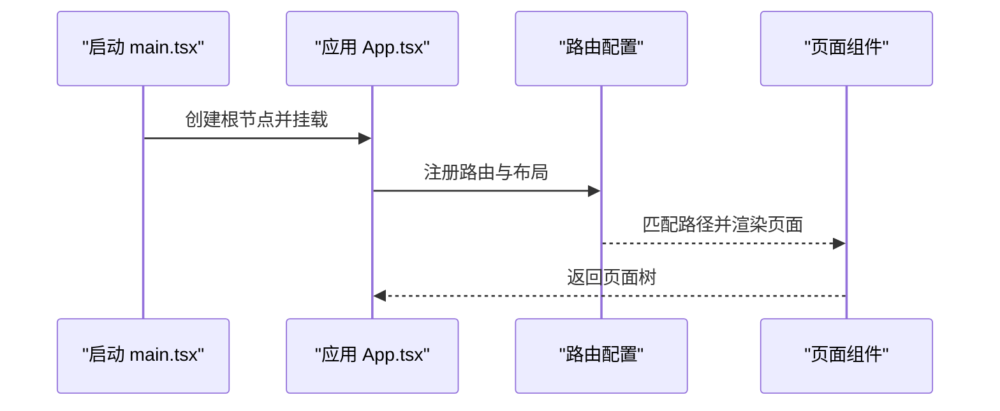

**图表来源** 
- [main.tsx:1-50](file://src/main.tsx#L1-L50)
- [App.tsx:1-120](file://src/App.tsx#L1-L120)

**章节来源**
- [main.tsx:1-50](file://src/main.tsx#L1-L50)
- [App.tsx:1-120](file://src/App.tsx#L1-L120)

### 页面组件（HomePage / GradePage / KnowledgePointPage / ProgressDashboard）
- 职责：组织内容展示与用户导航，聚合业务组件
- 数据流：从 content.ts 获取知识点索引与元信息，传递给子组件
- 交互：点击跳转到年级或知识点详情，查看进度看板

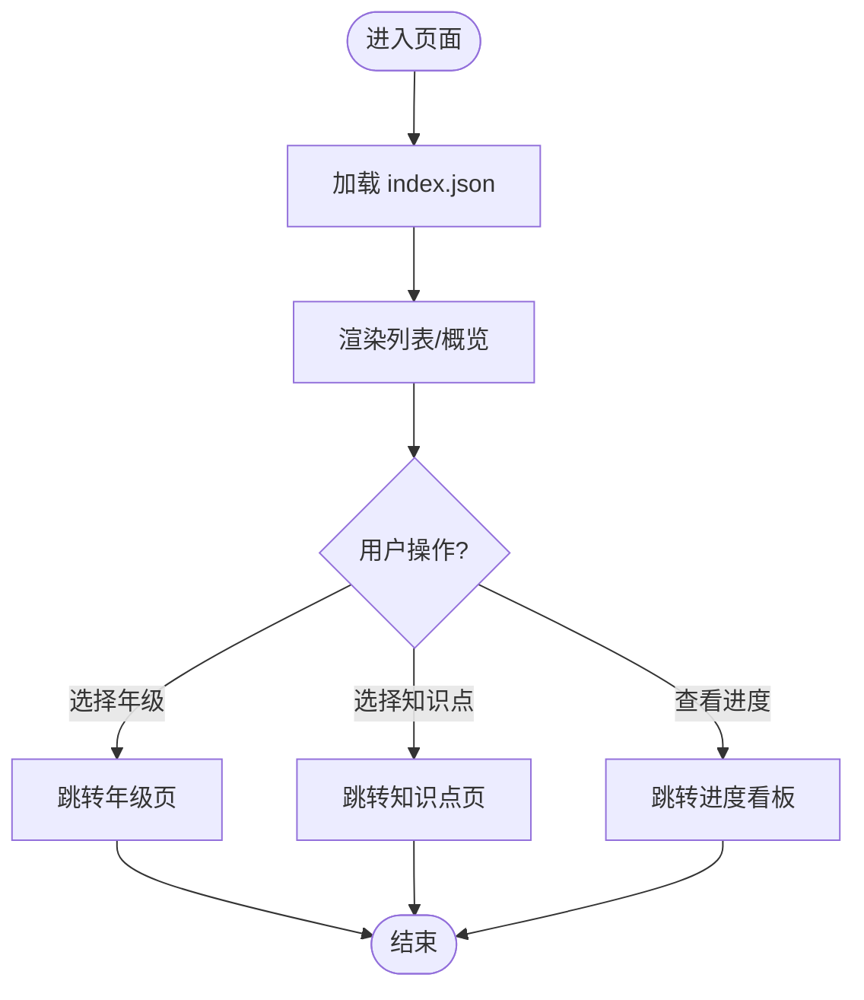

**图表来源** 
- [HomePage.tsx:1-120](file://src/pages/HomePage.tsx#L1-L120)
- [GradePage.tsx:1-150](file://src/pages/GradePage.tsx#L1-L150)
- [KnowledgePointPage.tsx:1-200](file://src/pages/KnowledgePointPage.tsx#L1-L200)
- [ProgressDashboard.tsx:1-150](file://src/pages/ProgressDashboard.tsx#L1-L150)
- [content.ts:1-120](file://src/lib/content.ts#L1-L120)

**章节来源**
- [HomePage.tsx:1-120](file://src/pages/HomePage.tsx#L1-L120)
- [GradePage.tsx:1-150](file://src/pages/GradePage.tsx#L1-L150)
- [KnowledgePointPage.tsx:1-200](file://src/pages/KnowledgePointPage.tsx#L1-L200)
- [ProgressDashboard.tsx:1-150](file://src/pages/ProgressDashboard.tsx#L1-L150)

### 游戏运行器（GameRunner.tsx）
- 职责：根据 game.json 配置动态加载并运行具体题型组件，统一管理游戏生命周期与结果上报
- 关键流程：读取配置 -> 解析题型 -> 渲染对应组件 -> 收集答题数据 -> 更新进度
- 扩展性：新增题型只需在 games/* 中实现组件并按约定注册

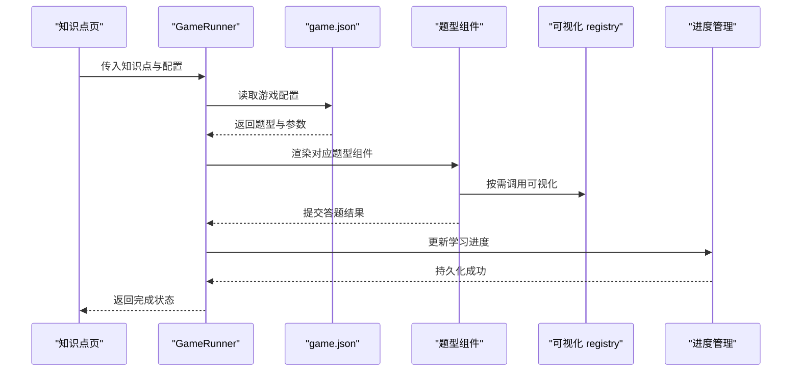

**图表来源** 
- [GameRunner.tsx:1-200](file://src/components/GameRunner.tsx#L1-L200)
- [registry.tsx:1-120](file://src/visualizations/registry.tsx#L1-L120)
- [progress.ts:1-120](file://src/lib/progress.ts#L1-L120)

**章节来源**
- [GameRunner.tsx:1-200](file://src/components/GameRunner.tsx#L1-L200)

### 推导播放器（DerivationPlayer.tsx）
- 职责：解析 derivation.json 步骤序列，逐步展示推导过程，支持前进/后退与交互
- 关键流程：加载推导数据 -> 渲染当前步骤 -> 监听用户控制 -> 更新步骤状态

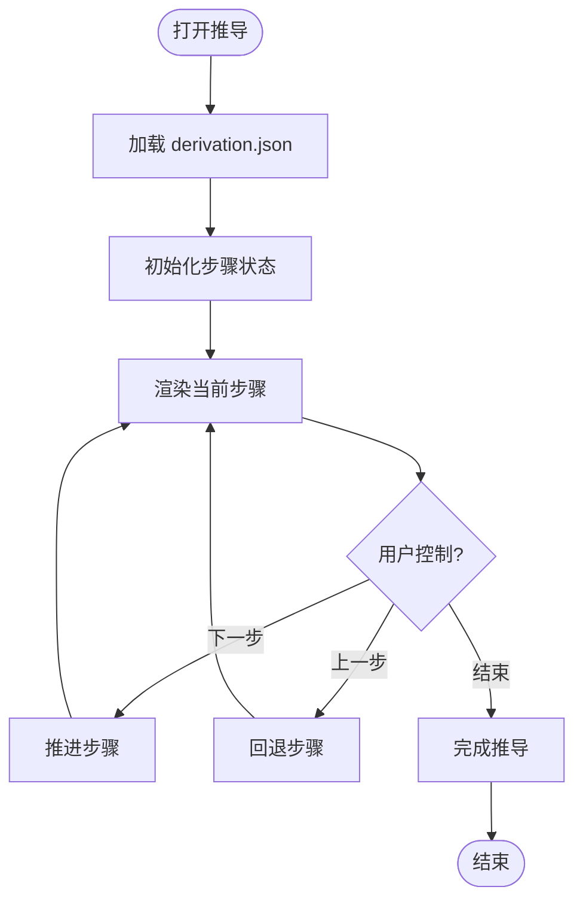

**图表来源** 
- [DerivationPlayer.tsx:1-150](file://src/components/DerivationPlayer.tsx#L1-L150)

**章节来源**
- [DerivationPlayer.tsx:1-150](file://src/components/DerivationPlayer.tsx#L1-L150)

### 知识点与布局（KnowledgePoint.tsx / Layout.tsx）
- 职责：知识点卡片展示元信息；布局组件提供统一页面结构与导航
- 交互：点击跳转至知识点详情页；布局内嵌路由与头部/侧边栏

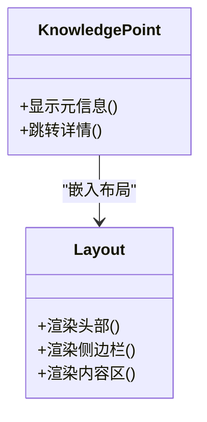

**图表来源** 
- [KnowledgePoint.tsx:1-120](file://src/components/KnowledgePoint.tsx#L1-L120)
- [Layout.tsx:1-100](file://src/components/Layout.tsx#L1-L100)

**章节来源**
- [KnowledgePoint.tsx:1-120](file://src/components/KnowledgePoint.tsx#L1-L120)
- [Layout.tsx:1-100](file://src/components/Layout.tsx#L1-L100)

### 可视化注册表（registry.tsx）
- 职责：集中注册数学可视化组件，提供按名称查找与实例化的能力
- 模式：插件式注册，便于扩展新的可视化图形

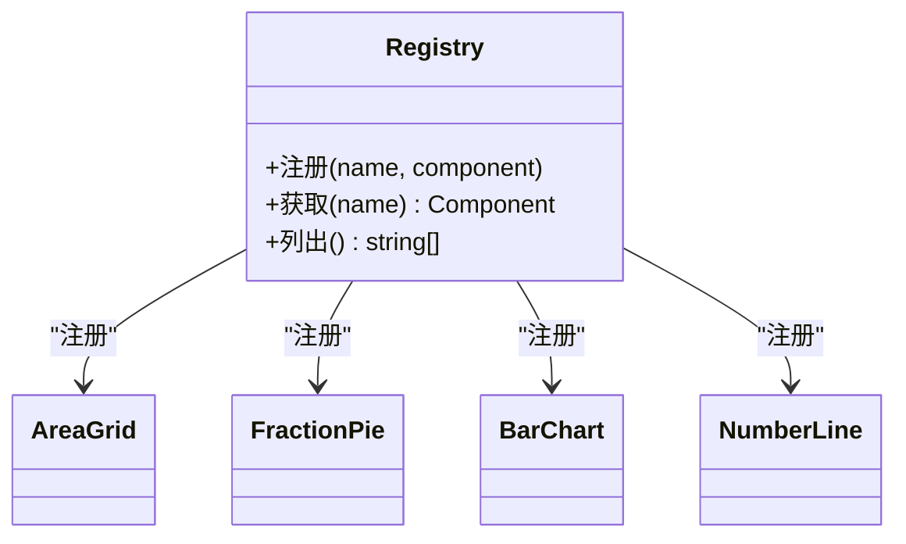

**图表来源** 
- [registry.tsx:1-120](file://src/visualizations/registry.tsx#L1-L120)

**章节来源**
- [registry.tsx:1-120](file://src/visualizations/registry.tsx#L1-L120)

### 内容与进度（content.ts / progress.ts / types.ts）
- 内容加载：统一读取 index.json 与知识点目录下的 JSON/Markdown，提供结构化数据
- 进度管理：读写本地存储，记录完成度、得分、时间戳等
- 类型定义：规范知识点、游戏配置、进度数据结构

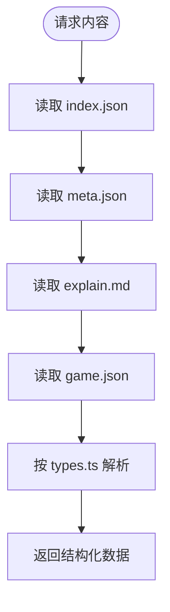

**图表来源** 
- [content.ts:1-120](file://src/lib/content.ts#L1-L120)
- [progress.ts:1-120](file://src/lib/progress.ts#L1-L120)
- [types.ts:1-120](file://src/lib/types.ts#L1-L120)
- [index.json:1-50](file://src/content/index.json#L1-L50)

**章节来源**
- [content.ts:1-120](file://src/lib/content.ts#L1-L120)
- [progress.ts:1-120](file://src/lib/progress.ts#L1-L120)
- [types.ts:1-120](file://src/lib/types.ts#L1-L120)

### 上下文与进度（ProgressContext.tsx）
- 职责：通过 Context 暴露进度读写方法，组件订阅变化并触发重渲染
- 策略：合并增量更新，避免全量覆盖；失败时降级到默认值

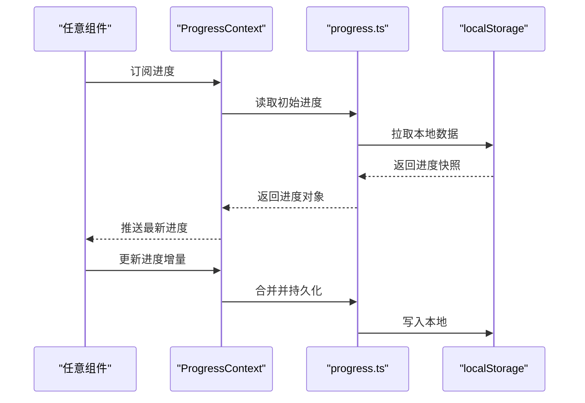

**图表来源** 
- [ProgressContext.tsx:1-120](file://src/context/ProgressContext.tsx#L1-L120)
- [progress.ts:1-120](file://src/lib/progress.ts#L1-L120)

**章节来源**
- [ProgressContext.tsx:1-120](file://src/context/ProgressContext.tsx#L1-L120)
- [progress.ts:1-120](file://src/lib/progress.ts#L1-L120)

## 依赖分析
- 外部依赖：React、Vite、TypeScript、React Router（用于路由）、可选的可视化库（如 Canvas/SVG 工具）
- 内部依赖：页面依赖内容与上下文；组件依赖可视化注册表；游戏运行器依赖题型组件与进度管理
- 版本兼容性：遵循 package.json 中声明的版本范围；构建产物由 Vite 生成

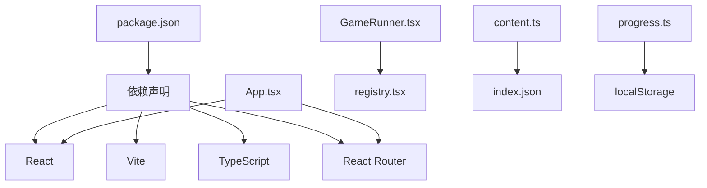

**图表来源** 
- [package.json:1-120](file://package.json#L1-L120)
- [App.tsx:1-120](file://src/App.tsx#L1-L120)
- [GameRunner.tsx:1-200](file://src/components/GameRunner.tsx#L1-L200)
- [content.ts:1-120](file://src/lib/content.ts#L1-L120)
- [progress.ts:1-120](file://src/lib/progress.ts#L1-L120)

**章节来源**
- [package.json:1-120](file://package.json#L1-L120)
- [vite.config.ts:1-120](file://vite.config.ts#L1-L120)

## 性能考虑
- 代码分割与懒加载：页面与重型组件按需加载，减少首屏体积
- 内容缓存：对 index.json 与常用元数据进行内存缓存，避免重复 IO
- 渲染优化：使用 React.memo、useMemo、useCallback 减少不必要的重渲染
- 可视化性能：大数据集使用虚拟滚动或分帧渲染，限制动画频率
- 存储访问：批量合并进度更新，降低 localStorage 写入频率

[本节为通用指导，不直接分析具体文件]

## 故障排查指南
- 内容加载失败：检查 index.json 与知识点目录结构是否符合约定；确认网络与权限
- 游戏无法运行：核对 game.json 字段与题型组件注册；查看控制台错误
- 进度未持久化：检查 localStorage 可用性与配额；确认进度更新逻辑是否被调用
- 可视化异常：确认 registry 中组件名称一致；检查 props 传递与数据类型

**章节来源**
- [content.ts:1-120](file://src/lib/content.ts#L1-L120)
- [progress.ts:1-120](file://src/lib/progress.ts#L1-L120)
- [registry.tsx:1-120](file://src/visualizations/registry.tsx#L1-L120)

## 结论
math-k6 通过“内容驱动 + 统一游戏引擎 + 可视化注册”的架构，实现了高扩展性的数学学习与练习平台。React 组件化与 Context API 状态管理保证了良好的可维护性与用户体验；JSON/Markdown 内容格式降低了内容生产成本。未来可在离线缓存、服务端同步、A/B 测试与更丰富的可视化方面持续演进。

[本节为总结性内容，不直接分析具体文件]

## 附录
- 基础设施要求：现代浏览器、Node.js LTS、Vite 构建环境
- 部署拓扑：静态站点托管（CDN），可选后端用于进度同步与分析
- 安全建议：输入校验、XSS 防护、敏感数据脱敏
- 监控与日志：前端埋点、错误上报、性能指标采集
- 灾难恢复：本地数据备份与恢复、内容版本回滚

[本节为通用指导，不直接分析具体文件]