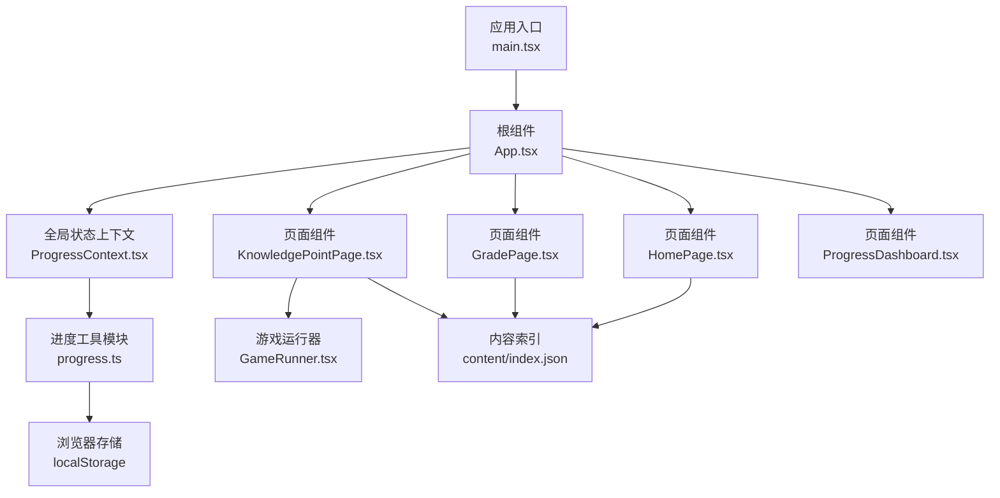
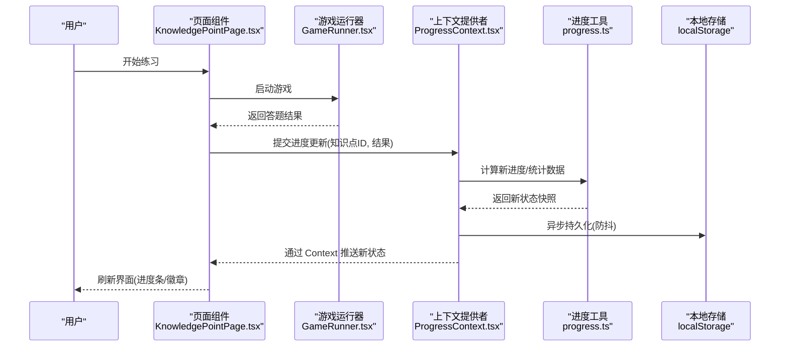
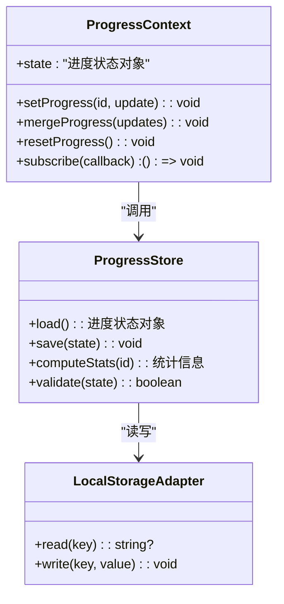
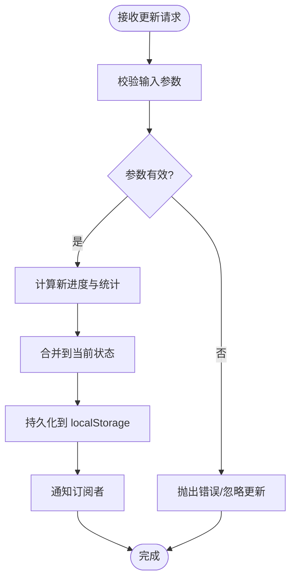
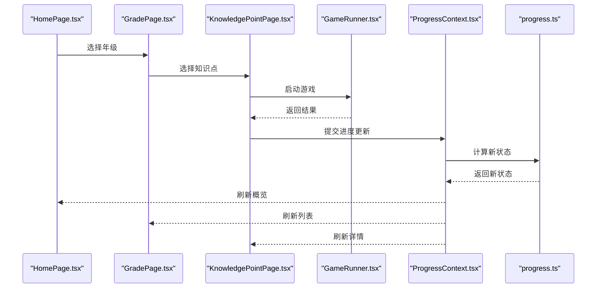
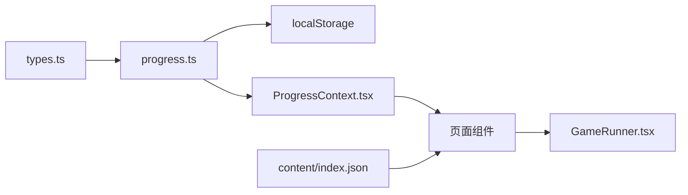

# 状态管理

<cite>
**本文引用的文件**   
- [ProgressContext.tsx](file://src/context/ProgressContext.tsx)
- [progress.ts](file://src/lib/progress.ts)
- [types.ts](file://src/lib/types.ts)
- [App.tsx](file://src/App.tsx)
- [main.tsx](file://src/main.tsx)
- [KnowledgePointPage.tsx](file://src/pages/KnowledgePointPage.tsx)
- [GradePage.tsx](file://src/pages/GradePage.tsx)
- [HomePage.tsx](file://src/pages/HomePage.tsx)
- [ProgressDashboard.tsx](file://src/pages/ProgressDashboard.tsx)
- [GameRunner.tsx](file://src/components/GameRunner.tsx)
- [index.json](file://src/content/index.json)
</cite>

## 目录
1. [简介](#简介)
2. [项目结构](#项目结构)
3. [核心组件](#核心组件)
4. [架构总览](#架构总览)
5. [详细组件分析](#详细组件分析)
6. [依赖关系分析](#依赖关系分析)
7. [性能考虑](#性能考虑)
8. [故障排查指南](#故障排查指南)
9. [结论](#结论)
10. [附录](#附录)

## 简介
本文件为 math-k6 项目的状态管理文档，聚焦于 React Context API 的使用模式与最佳实践，围绕 ProgressContext 全局状态管理进行系统化说明。内容涵盖学习进度的存储、更新与同步机制；局部状态与全局状态的划分原则；组件内状态提升策略；类型安全的状态定义（TypeScript 接口设计）；状态持久化方案（localStorage 集成）；数据同步机制；以及状态更新的最佳实践、性能优化技巧（useMemo、useCallback）和调试方法。文末提供状态流转图与组件状态关系图，帮助读者快速理解并高效维护系统。

## 项目结构
本项目采用“按功能域组织”的结构：
- context：全局状态上下文（ProgressContext）
- lib：领域逻辑与类型定义（progress 工具、types 类型）
- pages：页面级组件（首页、年级页、知识点页、进度看板）
- components：业务组件（游戏运行器、布局等）
- content：知识点元数据与配置（index.json）
- App.tsx / main.tsx：应用入口与根节点

图表来源
- [main.tsx](file://src/main.tsx)
- [App.tsx](file://src/App.tsx)
- [ProgressContext.tsx](file://src/context/ProgressContext.tsx)
- [progress.ts](file://src/lib/progress.ts)
- [HomePage.tsx](file://src/pages/HomePage.tsx)
- [GradePage.tsx](file://src/pages/GradePage.tsx)
- [KnowledgePointPage.tsx](file://src/pages/KnowledgePointPage.tsx)
- [ProgressDashboard.tsx](file://src/pages/ProgressDashboard.tsx)
- [GameRunner.tsx](file://src/components/GameRunner.tsx)
- [index.json](file://src/content/index.json)

章节来源
- [main.tsx](file://src/main.tsx)
- [App.tsx](file://src/App.tsx)
- [ProgressContext.tsx](file://src/context/ProgressContext.tsx)
- [progress.ts](file://src/lib/progress.ts)
- [index.json](file://src/content/index.json)

## 核心组件
- ProgressContext：提供全局学习进度状态与更新方法，封装读写 localStorage 的副作用，暴露订阅式消费能力。
- progress.ts：实现进度数据的增删改查、聚合统计、校验与序列化/反序列化逻辑。
- types.ts：定义进度数据结构、知识点标识、游戏结果枚举等类型契约。
- 页面与组件：通过 useContext 消费进度状态，触发更新；在合适时机将局部状态提升到全局，保证跨组件一致性。

章节来源
- [ProgressContext.tsx](file://src/context/ProgressContext.tsx)
- [progress.ts](file://src/lib/progress.ts)
- [types.ts](file://src/lib/types.ts)

## 架构总览
ProgressContext 作为单一事实源，集中管理学习进度。其职责边界清晰：
- 读取：从 localStorage 初始化或增量合并
- 写入：原子更新单个知识点进度，批量提交
- 同步：防抖/节流持久化，避免频繁 IO
- 发布：基于 React Context 的订阅通知，驱动 UI 重渲染

图表来源
- [KnowledgePointPage.tsx](file://src/pages/KnowledgePointPage.tsx)
- [GameRunner.tsx](file://src/components/GameRunner.tsx)
- [ProgressContext.tsx](file://src/context/ProgressContext.tsx)
- [progress.ts](file://src/lib/progress.ts)

## 详细组件分析

### ProgressContext 全局状态管理
- 状态模型：以知识点 ID 为键，记录完成度、正确率、最近练习时间等字段。
- 更新策略：提供 setProgress、mergeProgress、resetProgress 等方法，确保不可变更新与最小化重渲染。
- 持久化：在更新后调用 progress.ts 的序列化函数，写入 localStorage；支持加载时合并默认值与历史数据。
- 订阅机制：通过 Context.Provider 包裹子树，使用 useContext 消费；对高频更新可结合 useMemo/useSelector 思想减少重渲染。

图表来源
- [ProgressContext.tsx](file://src/context/ProgressContext.tsx)
- [progress.ts](file://src/lib/progress.ts)

章节来源
- [ProgressContext.tsx](file://src/context/ProgressContext.tsx)
- [progress.ts](file://src/lib/progress.ts)

### 进度工具模块 progress.ts
- 数据结构：定义知识点进度条目、整体进度汇总、统计指标等类型。
- 算法：
  - 增量更新：根据答题结果更新正确数、尝试次数、完成标志。
  - 聚合统计：计算各知识点掌握度、总体完成率、趋势指标。
  - 校验：确保数值范围、必填字段、一致性约束。
- 序列化：JSON 序列化/反序列化，兼容版本迁移与默认值填充。

图表来源
- [progress.ts](file://src/lib/progress.ts)

章节来源
- [progress.ts](file://src/lib/progress.ts)

### 类型安全的状态定义（types.ts）
- 知识点标识：统一使用字符串或枚举，避免硬编码。
- 进度条目：包含尝试次数、正确次数、完成标记、最后更新时间等。
- 全局状态：包含所有知识点的进度映射、汇总统计、版本信息等。
- 变更事件：定义更新动作的类型与载荷，便于日志与审计。

章节来源
- [types.ts](file://src/lib/types.ts)

### 页面与组件中的状态使用
- HomePage：展示概览与导航，读取总体完成率与推荐知识点。
- GradePage：按年级分组展示知识点列表，显示每个知识点的完成度。
- KnowledgePointPage：进入具体知识点练习，提交答题结果并更新进度。
- ProgressDashboard：可视化展示学习趋势、薄弱点与建议。
- GameRunner：封装游戏生命周期，完成后回调进度更新。

图表来源
- [HomePage.tsx](file://src/pages/HomePage.tsx)
- [GradePage.tsx](file://src/pages/GradePage.tsx)
- [KnowledgePointPage.tsx](file://src/pages/KnowledgePointPage.tsx)
- [GameRunner.tsx](file://src/components/GameRunner.tsx)
- [ProgressContext.tsx](file://src/context/ProgressContext.tsx)
- [progress.ts](file://src/lib/progress.ts)

章节来源
- [HomePage.tsx](file://src/pages/HomePage.tsx)
- [GradePage.tsx](file://src/pages/GradePage.tsx)
- [KnowledgePointPage.tsx](file://src/pages/KnowledgePointPage.tsx)
- [GameRunner.tsx](file://src/components/GameRunner.tsx)

### 局部状态与全局状态的划分原则
- 局部状态：
  - 仅在当前组件生命周期内有效（如表单输入、临时筛选条件）。
  - 不需要跨组件共享或持久化。
- 全局状态：
  - 需要跨层级共享（如学习进度、用户偏好）。
  - 需要持久化或在多个页面保持一致性。
- 状态提升策略：
  - 当两个兄弟组件需要同步状态时，提升到共同父组件或全局上下文。
  - 当状态涉及持久化或复杂计算时，放入 ProgressContext 并通过 progress.ts 处理。

### 数据同步机制
- 初始化：应用启动时从 localStorage 加载进度，合并默认值与历史数据。
- 实时更新：每次更新后触发防抖持久化，避免频繁 IO。
- 冲突解决：以最后一次提交为准，必要时引入版本号或时间戳。
- 离线优先：网络不可用时仍可使用 localStorage 缓存，后续再同步。

### 状态更新的最佳实践
- 不可变更新：始终返回新状态对象，避免直接修改。
- 最小化重渲染：使用 useMemo 缓存派生数据，useCallback 稳定函数引用。
- 批量更新：合并多次小更新为一次提交，降低持久化频率。
- 错误边界：对异常输入进行防御性校验，失败回滚或降级。

### 性能优化技巧
- useMemo：
  - 用于计算知识点列表、统计指标、过滤结果等昂贵操作。
- useCallback：
  - 用于传递给子组件的更新函数，避免不必要的重新绑定。
- 懒加载：
  - 按需加载页面与可视化组件，减少首屏体积。
- 虚拟滚动：
  - 长列表场景下使用虚拟滚动提升渲染性能。

### 调试方法
- 打印状态快照：在关键路径输出进度状态变化。
- 时间旅行：记录状态变更历史，支持回放与对比。
- 断点调试：在进度更新与持久化处设置断点，检查数据流。
- 单元测试：覆盖进度计算、校验与持久化逻辑。

## 依赖关系分析
ProgressContext 依赖 progress.ts 进行数据处理，progress.ts 依赖 localStorage 进行持久化。页面组件通过 Context 消费状态，GameRunner 负责业务回调。

图表来源
- [types.ts](file://src/lib/types.ts)
- [progress.ts](file://src/lib/progress.ts)
- [ProgressContext.tsx](file://src/context/ProgressContext.tsx)
- [HomePage.tsx](file://src/pages/HomePage.tsx)
- [GradePage.tsx](file://src/pages/GradePage.tsx)
- [KnowledgePointPage.tsx](file://src/pages/KnowledgePointPage.tsx)
- [ProgressDashboard.tsx](file://src/pages/ProgressDashboard.tsx)
- [GameRunner.tsx](file://src/components/GameRunner.tsx)
- [index.json](file://src/content/index.json)

章节来源
- [types.ts](file://src/lib/types.ts)
- [progress.ts](file://src/lib/progress.ts)
- [ProgressContext.tsx](file://src/context/ProgressContext.tsx)
- [index.json](file://src/content/index.json)

## 性能考虑
- 减少重渲染：通过 useMemo 与 useCallback 稳定引用，避免子组件不必要更新。
- 批处理更新：合并多次进度更新，降低 localStorage 写入频率。
- 惰性加载：按需加载页面与可视化组件，缩短首屏时间。
- 内存管理：及时清理订阅与定时器，防止内存泄漏。

## 故障排查指南
- 常见问题：
  - 进度未持久化：检查 localStorage 权限与序列化逻辑。
  - 状态不同步：确认更新路径是否经过 ProgressContext，避免直接修改。
  - 性能下降：排查 useMemo/useCallback 使用是否正确，是否存在大对象频繁重建。
- 定位步骤：
  - 在更新函数中打印入参与返回值。
  - 检查 localStorage 中的数据格式与版本兼容性。
  - 使用浏览器开发者工具监控重渲染次数。

## 结论
通过 ProgressContext 与 progress.ts 的协作，math-k6 实现了类型安全、可持久化、易扩展的学习进度状态管理。遵循局部与全局状态的划分原则、状态提升策略与性能优化技巧，能够构建出高性能、可维护的前端应用。建议持续完善单元测试与调试工具，保障状态一致性与用户体验。

## 附录
- 术语表：
  - 进度：指知识点维度的练习结果与完成度。
  - 持久化：将状态保存到 localStorage 以便下次加载恢复。
  - 订阅：组件监听状态变化并触发重渲染。
- 参考文件：
  - [ProgressContext.tsx](file://src/context/ProgressContext.tsx)
  - [progress.ts](file://src/lib/progress.ts)
  - [types.ts](file://src/lib/types.ts)
  - [App.tsx](file://src/App.tsx)
  - [main.tsx](file://src/main.tsx)
  - [HomePage.tsx](file://src/pages/HomePage.tsx)
  - [GradePage.tsx](file://src/pages/GradePage.tsx)
  - [KnowledgePointPage.tsx](file://src/pages/KnowledgePointPage.tsx)
  - [ProgressDashboard.tsx](file://src/pages/ProgressDashboard.tsx)
  - [GameRunner.tsx](file://src/components/GameRunner.tsx)
  - [index.json](file://src/content/index.json)