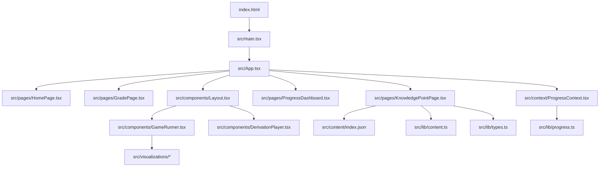
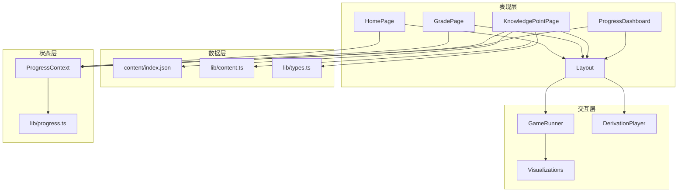
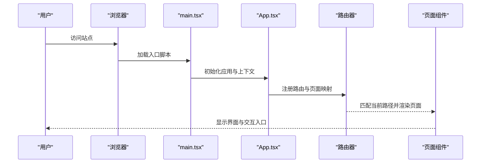
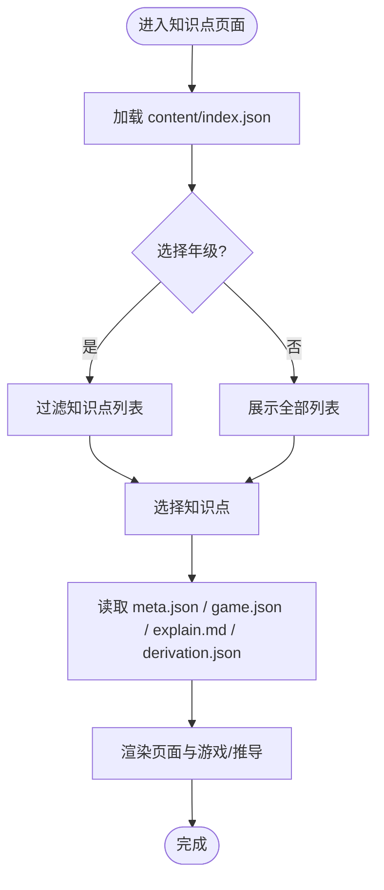
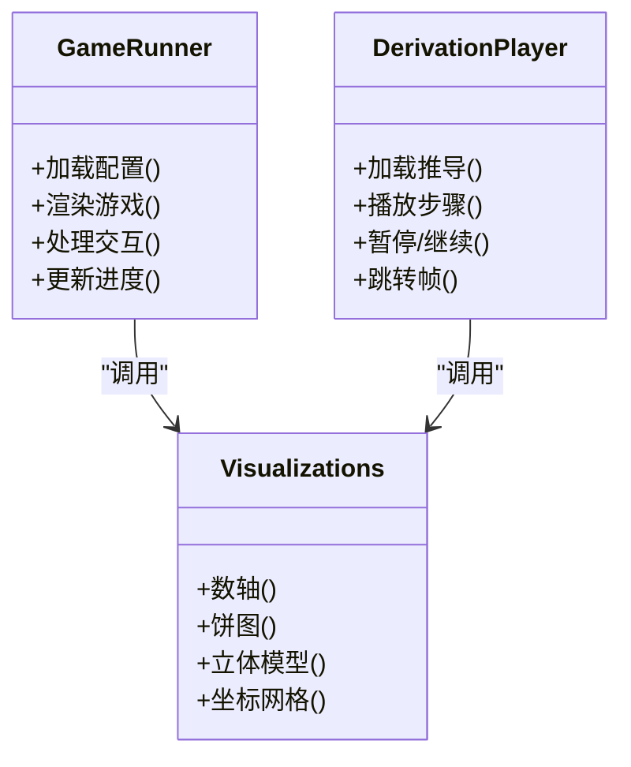
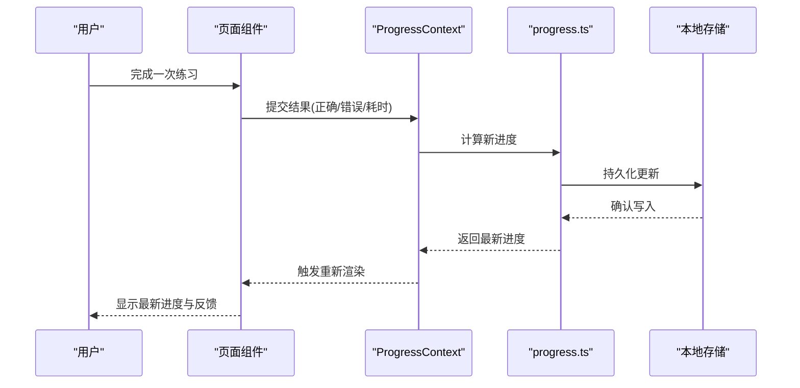
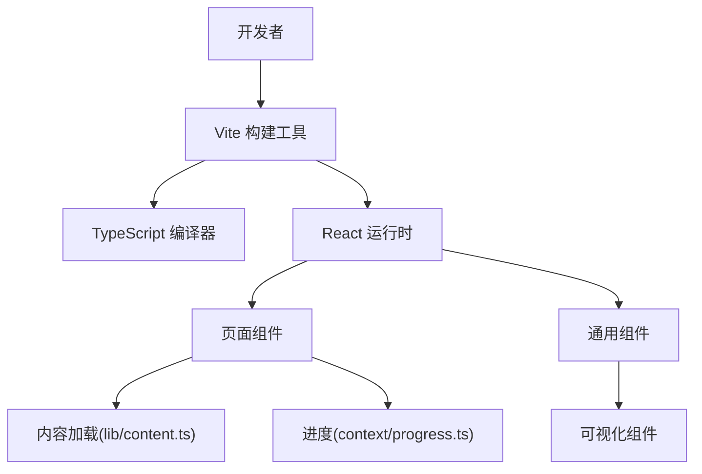

# 系统概览

<cite>
**本文引用的文件**   
- [package.json](file://package.json)
- [vite.config.ts](file://vite.config.ts)
- [tsconfig.json](file://tsconfig.json)
- [index.html](file://index.html)
- [src/main.tsx](file://src/main.tsx)
- [src/App.tsx](file://src/App.tsx)
- [src/pages/HomePage.tsx](file://src/pages/HomePage.tsx)
- [src/pages/GradePage.tsx](file://src/pages/GradePage.tsx)
- [src/pages/KnowledgePointPage.tsx](file://src/pages/KnowledgePointPage.tsx)
- [src/pages/ProgressDashboard.tsx](file://src/pages/ProgressDashboard.tsx)
- [src/components/Layout.tsx](file://src/components/Layout.tsx)
- [src/components/GameRunner.tsx](file://src/components/GameRunner.tsx)
- [src/components/DerivationPlayer.tsx](file://src/components/DerivationPlayer.tsx)
- [src/content/index.json](file://src/content/index.json)
- [src/lib/content.ts](file://src/lib/content.ts)
- [src/lib/types.ts](file://src/lib/types.ts)
- [src/context/ProgressContext.tsx](file://src/context/ProgressContext.tsx)
- [src/lib/progress.ts](file://src/lib/progress.ts)
</cite>

## 目录
1. [简介](#简介)
2. [项目结构](#项目结构)
3. [核心组件](#核心组件)
4. [架构总览](#架构总览)
5. [详细组件分析](#详细组件分析)
6. [依赖分析](#依赖分析)
7. [性能考虑](#性能考虑)
8. [故障排查指南](#故障排查指南)
9. [结论](#结论)
10. [附录](#附录)

## 简介
math-k6 是一个面向小学高年级的数学学习应用，采用 React + TypeScript 构建，使用 Vite 作为开发与构建工具。应用通过“知识点”组织内容，结合多种互动游戏与可视化组件，帮助学生在练习中掌握数学概念。整体设计强调模块化、数据驱动与可扩展性：页面路由清晰、内容与逻辑分离、状态管理集中且可追踪。

## 项目结构
项目采用以功能域划分的目录结构：
- src/pages：页面级组件（首页、年级选择、知识点详情、进度看板）
- src/components：通用 UI 与业务组件（布局、游戏运行器、推导播放器等）
- src/visualizations：数学可视化组件（数轴、饼图、立体模型等）
- src/content：按知识点组织的静态资源（元数据、说明文档、游戏配置）
- src/lib：领域逻辑与类型定义（内容加载、进度跟踪、类型声明）
- src/context：全局状态上下文（学习进度）
- 根目录：Vite 配置、TypeScript 配置、入口 HTML、包管理清单

图表来源
- [index.html:1-200](file://index.html#L1-L200)
- [src/main.tsx:1-200](file://src/main.tsx#L1-L200)
- [src/App.tsx:1-200](file://src/App.tsx#L1-L200)
- [src/pages/HomePage.tsx:1-200](file://src/pages/HomePage.tsx#L1-L200)
- [src/pages/GradePage.tsx:1-200](file://src/pages/GradePage.tsx#L1-L200)
- [src/pages/KnowledgePointPage.tsx:1-200](file://src/pages/KnowledgePointPage.tsx#L1-L200)
- [src/pages/ProgressDashboard.tsx:1-200](file://src/pages/ProgressDashboard.tsx#L1-L200)
- [src/components/Layout.tsx:1-200](file://src/components/Layout.tsx#L1-L200)
- [src/components/GameRunner.tsx:1-200](file://src/components/GameRunner.tsx#L1-L200)
- [src/components/DerivationPlayer.tsx:1-200](file://src/components/DerivationPlayer.tsx#L1-L200)
- [src/content/index.json:1-200](file://src/content/index.json#L1-L200)
- [src/lib/content.ts:1-200](file://src/lib/content.ts#L1-L200)
- [src/lib/types.ts:1-200](file://src/lib/types.ts#L1-L200)
- [src/context/ProgressContext.tsx:1-200](file://src/context/ProgressContext.tsx#L1-L200)
- [src/lib/progress.ts:1-200](file://src/lib/progress.ts#L1-L200)

章节来源
- [package.json:1-200](file://package.json#L1-L200)
- [vite.config.ts:1-200](file://vite.config.ts#L1-L200)
- [tsconfig.json:1-200](file://tsconfig.json#L1-L200)
- [index.html:1-200](file://index.html#L1-L200)

## 核心组件
- 应用入口与路由
  - main.tsx：初始化 React 应用并挂载到 DOM
  - App.tsx：顶层路由与全局上下文提供者
  - pages/*：页面组件负责导航与内容编排
- 布局与容器
  - Layout.tsx：统一页面框架（头部、侧边栏、主内容区）
- 学习与交互
  - GameRunner.tsx：根据 game.json 配置动态渲染游戏
  - DerivationPlayer.tsx：播放推导过程或步骤演示
- 可视化
  - visualizations/*：数学概念的交互式图形（如分数饼图、数轴、立体模型等）
- 数据与状态
  - content/index.json：知识点索引
  - lib/content.ts：内容加载与解析
  - lib/types.ts：共享类型定义
  - context/ProgressContext.tsx：学习进度上下文
  - lib/progress.ts：进度持久化与计算

章节来源
- [src/main.tsx:1-200](file://src/main.tsx#L1-L200)
- [src/App.tsx:1-200](file://src/App.tsx#L1-L200)
- [src/components/Layout.tsx:1-200](file://src/components/Layout.tsx#L1-L200)
- [src/components/GameRunner.tsx:1-200](file://src/components/GameRunner.tsx#L1-L200)
- [src/components/DerivationPlayer.tsx:1-200](file://src/components/DerivationPlayer.tsx#L1-L200)
- [src/content/index.json:1-200](file://src/content/index.json#L1-L200)
- [src/lib/content.ts:1-200](file://src/lib/content.ts#L1-L200)
- [src/lib/types.ts:1-200](file://src/lib/types.ts#L1-L200)
- [src/context/ProgressContext.tsx:1-200](file://src/context/ProgressContext.tsx#L1-L200)
- [src/lib/progress.ts:1-200](file://src/lib/progress.ts#L1-L200)

## 架构总览
应用遵循“页面-组件-数据”的分层架构：
- 表现层：React 组件（页面与通用组件）
- 交互层：GameRunner 与 DerivationPlayer 协调用户操作与可视化
- 数据层：content/index.json 与 lib/content.ts 提供知识图谱与资源定位
- 状态层：ProgressContext 与 progress.ts 管理学习进度与持久化

图表来源
- [src/pages/HomePage.tsx:1-200](file://src/pages/HomePage.tsx#L1-L200)
- [src/pages/GradePage.tsx:1-200](file://src/pages/GradePage.tsx#L1-L200)
- [src/pages/KnowledgePointPage.tsx:1-200](file://src/pages/KnowledgePointPage.tsx#L1-L200)
- [src/pages/ProgressDashboard.tsx:1-200](file://src/pages/ProgressDashboard.tsx#L1-L200)
- [src/components/Layout.tsx:1-200](file://src/components/Layout.tsx#L1-L200)
- [src/components/GameRunner.tsx:1-200](file://src/components/GameRunner.tsx#L1-L200)
- [src/components/DerivationPlayer.tsx:1-200](file://src/components/DerivationPlayer.tsx#L1-L200)
- [src/content/index.json:1-200](file://src/content/index.json#L1-L200)
- [src/lib/content.ts:1-200](file://src/lib/content.ts#L1-L200)
- [src/lib/types.ts:1-200](file://src/lib/types.ts#L1-L200)
- [src/context/ProgressContext.tsx:1-200](file://src/context/ProgressContext.tsx#L1-L200)
- [src/lib/progress.ts:1-200](file://src/lib/progress.ts#L1-L200)

## 详细组件分析

### 入口与路由
- 入口文件 main.tsx 负责创建 React 根节点并挂载到 index.html
- App.tsx 定义路由与全局上下文（进度），将页面组件挂载到对应路径
- 页面组件职责：
  - HomePage：导航入口与概览
  - GradePage：按年级筛选知识点
  - KnowledgePointPage：展示知识点详情、加载游戏与推导
  - ProgressDashboard：汇总学习进度与统计

图表来源
- [index.html:1-200](file://index.html#L1-L200)
- [src/main.tsx:1-200](file://src/main.tsx#L1-L200)
- [src/App.tsx:1-200](file://src/App.tsx#L1-L200)
- [src/pages/HomePage.tsx:1-200](file://src/pages/HomePage.tsx#L1-L200)
- [src/pages/GradePage.tsx:1-200](file://src/pages/GradePage.tsx#L1-L200)
- [src/pages/KnowledgePointPage.tsx:1-200](file://src/pages/KnowledgePointPage.tsx#L1-L200)
- [src/pages/ProgressDashboard.tsx:1-200](file://src/pages/ProgressDashboard.tsx#L1-L200)

章节来源
- [src/main.tsx:1-200](file://src/main.tsx#L1-L200)
- [src/App.tsx:1-200](file://src/App.tsx#L1-L200)
- [src/pages/HomePage.tsx:1-200](file://src/pages/HomePage.tsx#L1-L200)
- [src/pages/GradePage.tsx:1-200](file://src/pages/GradePage.tsx#L1-L200)
- [src/pages/KnowledgePointPage.tsx:1-200](file://src/pages/KnowledgePointPage.tsx#L1-L200)
- [src/pages/ProgressDashboard.tsx:1-200](file://src/pages/ProgressDashboard.tsx#L1-L200)

### 知识点与内容加载
- content/index.json 提供知识点索引（年级、标题、描述、资源路径）
- lib/content.ts 负责读取索引、解析各知识点的 meta.json、game.json 与 explain.md/derivation.json
- lib/types.ts 定义统一的类型契约，确保内容结构与运行时一致

图表来源
- [src/content/index.json:1-200](file://src/content/index.json#L1-L200)
- [src/lib/content.ts:1-200](file://src/lib/content.ts#L1-L200)
- [src/lib/types.ts:1-200](file://src/lib/types.ts#L1-L200)
- [src/pages/KnowledgePointPage.tsx:1-200](file://src/pages/KnowledgePointPage.tsx#L1-L200)

章节来源
- [src/content/index.json:1-200](file://src/content/index.json#L1-L200)
- [src/lib/content.ts:1-200](file://src/lib/content.ts#L1-L200)
- [src/lib/types.ts:1-200](file://src/lib/types.ts#L1-L200)
- [src/pages/KnowledgePointPage.tsx:1-200](file://src/pages/KnowledgePointPage.tsx#L1-L200)

### 游戏运行器与可视化
- GameRunner.tsx 根据 game.json 配置实例化具体游戏组件，处理答题、反馈与计分
- DerivationPlayer.tsx 播放推导步骤，支持前进/后退与关键帧控制
- visualizations/* 提供数学概念的可交互图形，供游戏与推导复用

图表来源
- [src/components/GameRunner.tsx:1-200](file://src/components/GameRunner.tsx#L1-L200)
- [src/components/DerivationPlayer.tsx:1-200](file://src/components/DerivationPlayer.tsx#L1-L200)
- [src/visualizations/AreaGrid.tsx:1-200](file://src/visualizations/AreaGrid.tsx#L1-L200)
- [src/visualizations/BalanceScale.tsx:1-200](file://src/visualizations/BalanceScale.tsx#L1-L200)
- [src/visualizations/CircleUnroll.tsx:1-200](file://src/visualizations/CircleUnroll.tsx#L1-L200)
- [src/visualizations/ConeModel.tsx:1-200](file://src/visualizations/ConeModel.tsx#L1-L200)
- [src/visualizations/CylinderModel.tsx:1-200](file://src/visualizations/CylinderModel.tsx#L1-L200)
- [src/visualizations/FractionPie.tsx:1-200](file://src/visualizations/FractionPie.tsx#L1-L200)
- [src/visualizations/NumberLine.tsx:1-200](file://src/visualizations/NumberLine.tsx#L1-L200)
- [src/visualizations/PieChart.tsx:1-200](file://src/visualizations/PieChart.tsx#L1-L200)
- [src/visualizations/PlaceValueChart.tsx:1-200](file://src/visualizations/PlaceValueChart.tsx#L1-L200)
- [src/visualizations/ProbabilityModel.tsx:1-200](file://src/visualizations/ProbabilityModel.tsx#L1-L200)
- [src/visualizations/Protractor.tsx:1-200](file://src/visualizations/Protractor.tsx#L1-L200)
- [src/visualizations/ShapeTransform.tsx:1-200](file://src/visualizations/ShapeTransform.tsx#L1-L200)

章节来源
- [src/components/GameRunner.tsx:1-200](file://src/components/GameRunner.tsx#L1-L200)
- [src/components/DerivationPlayer.tsx:1-200](file://src/components/DerivationPlayer.tsx#L1-L200)
- [src/visualizations/AreaGrid.tsx:1-200](file://src/visualizations/AreaGrid.tsx#L1-L200)
- [src/visualizations/BalanceScale.tsx:1-200](file://src/visualizations/BalanceScale.tsx#L1-L200)
- [src/visualizations/CircleUnroll.tsx:1-200](file://src/visualizations/CircleUnroll.tsx#L1-L200)
- [src/visualizations/ConeModel.tsx:1-200](file://src/visualizations/ConeModel.tsx#L1-L200)
- [src/visualizations/CylinderModel.tsx:1-200](file://src/visualizations/CylinderModel.tsx#L1-L200)
- [src/visualizations/FractionPie.tsx:1-200](file://src/visualizations/FractionPie.tsx#L1-L200)
- [src/visualizations/NumberLine.tsx:1-200](file://src/visualizations/NumberLine.tsx#L1-L200)
- [src/visualizations/PieChart.tsx:1-200](file://src/visualizations/PieChart.tsx#L1-L200)
- [src/visualizations/PlaceValueChart.tsx:1-200](file://src/visualizations/PlaceValueChart.tsx#L1-L200)
- [src/visualizations/ProbabilityModel.tsx:1-200](file://src/visualizations/ProbabilityModel.tsx#L1-L200)
- [src/visualizations/Protractor.tsx:1-200](file://src/visualizations/Protractor.tsx#L1-L200)
- [src/visualizations/ShapeTransform.tsx:1-200](file://src/visualizations/ShapeTransform.tsx#L1-L200)

### 进度管理与持久化
- ProgressContext.tsx 提供全局进度状态与更新方法
- lib/progress.ts 实现进度计算、合并与本地存储（如 localStorage）
- 页面组件通过上下文订阅进度变化，实时更新仪表盘与反馈

图表来源
- [src/context/ProgressContext.tsx:1-200](file://src/context/ProgressContext.tsx#L1-L200)
- [src/lib/progress.ts:1-200](file://src/lib/progress.ts#L1-L200)
- [src/pages/ProgressDashboard.tsx:1-200](file://src/pages/ProgressDashboard.tsx#L1-L200)

章节来源
- [src/context/ProgressContext.tsx:1-200](file://src/context/ProgressContext.tsx#L1-L200)
- [src/lib/progress.ts:1-200](file://src/lib/progress.ts#L1-L200)
- [src/pages/ProgressDashboard.tsx:1-200](file://src/pages/ProgressDashboard.tsx#L1-L200)

## 依赖分析
- 构建与开发工具
  - Vite：快速热重载、按需编译、插件生态
  - TypeScript：类型安全与更好的开发体验
- 运行时依赖
  - React：组件化 UI 与状态管理
  - 可选：路由库（由 App.tsx 集成）、可视化库（由各可视化组件引入）
- 配置要点
  - vite.config.ts：开发服务器、别名、插件、生产优化
  - tsconfig.*：模块解析、严格模式、路径映射

图表来源
- [vite.config.ts:1-200](file://vite.config.ts#L1-L200)
- [tsconfig.json:1-200](file://tsconfig.json#L1-L200)
- [package.json:1-200](file://package.json#L1-L200)
- [src/lib/content.ts:1-200](file://src/lib/content.ts#L1-L200)
- [src/context/ProgressContext.tsx:1-200](file://src/context/ProgressContext.tsx#L1-L200)
- [src/lib/progress.ts:1-200](file://src/lib/progress.ts#L1-L200)

章节来源
- [package.json:1-200](file://package.json#L1-L200)
- [vite.config.ts:1-200](file://vite.config.ts#L1-L200)
- [tsconfig.json:1-200](file://tsconfig.json#L1-L200)

## 性能考虑
- 代码分割与懒加载：页面与大型可视化组件可按需加载，减少首屏体积
- 资源预取与缓存：知识点索引与常用资源可在后台预取，提升切换速度
- 渲染优化：避免不必要的重渲染，合理使用 memo/useMemo/useCallback
- 构建优化：启用 Vite 生产模式优化（压缩、Tree-shaking、分包策略）

[本节为通用指导，不直接分析具体文件]

## 故障排查指南
- 启动失败
  - 检查 Node 版本与依赖安装是否完整
  - 查看 vite.config.ts 与 tsconfig 配置是否正确
- 页面空白或路由无效
  - 确认 App.tsx 路由注册与页面组件导出正常
  - 检查浏览器控制台是否有类型错误或运行时异常
- 内容无法加载
  - 验证 content/index.json 与子目录资源是否存在
  - 检查 lib/content.ts 的路径解析与 JSON/Markdown 解析逻辑
- 进度不更新
  - 检查 ProgressContext 与 progress.ts 的状态更新流程
  - 确认本地存储权限与写入成功

章节来源
- [src/App.tsx:1-200](file://src/App.tsx#L1-L200)
- [src/lib/content.ts:1-200](file://src/lib/content.ts#L1-L200)
- [src/context/ProgressContext.tsx:1-200](file://src/context/ProgressContext.tsx#L1-L200)
- [src/lib/progress.ts:1-200](file://src/lib/progress.ts#L1-L200)

## 结论
math-k6 以清晰的模块化设计与数据驱动的内容组织，实现了可扩展的数学学习体验。React + TypeScript 提供了类型安全与良好的工程化能力，Vite 提升了开发与构建效率。通过“页面-组件-数据-状态”的分层架构，系统在可维护性与性能之间取得平衡，适合持续迭代与扩展新的知识点与游戏类型。

[本节为总结，不直接分析具体文件]

## 附录
- 技术栈选择理由
  - React：组件化、生态成熟、易于测试与维护
  - TypeScript：类型约束降低运行时错误，提升重构信心
  - Vite：极速冷启动与热更新，插件丰富，构建产物优化
- 开发环境要求
  - Node.js（建议 LTS 版本）
  - 包管理器（npm/yarn/pnpm）
  - 现代浏览器（支持 ES2020+）
- 依赖管理与构建流程
  - 安装依赖：执行包管理器命令
  - 开发模式：启动 Vite 开发服务器
  - 构建生产：执行构建命令生成静态资源
  - 部署：将 dist 目录部署至静态托管服务

[本节为通用信息，不直接分析具体文件]