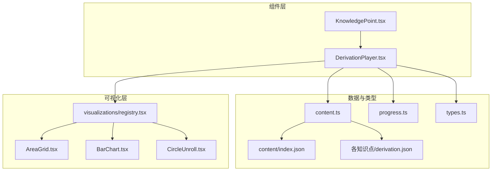
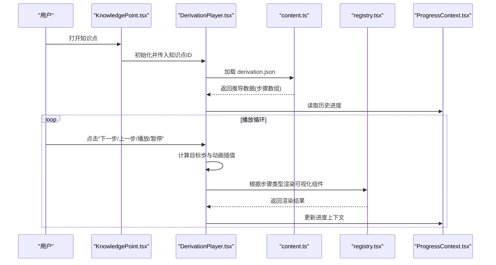
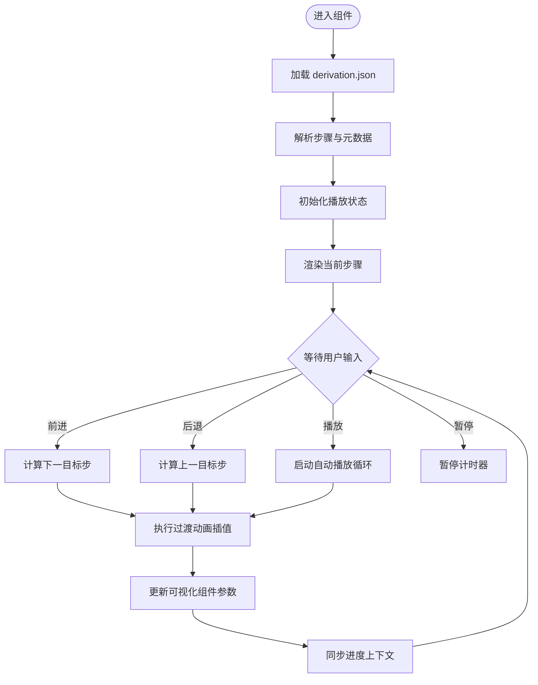
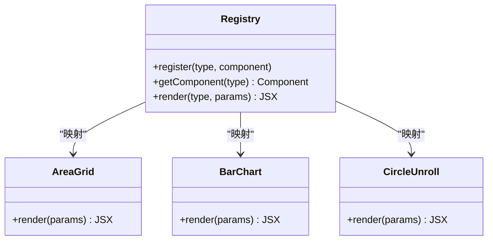
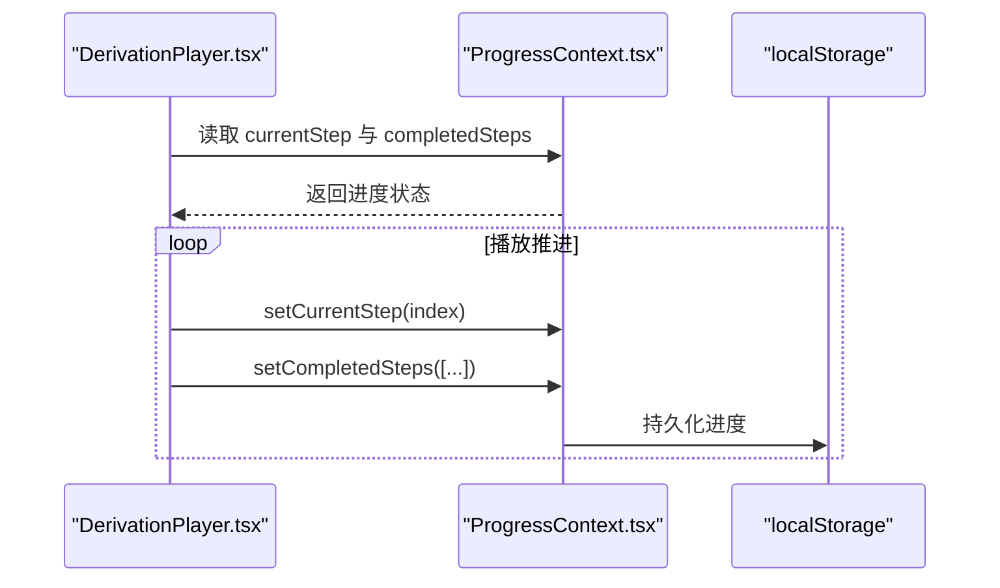
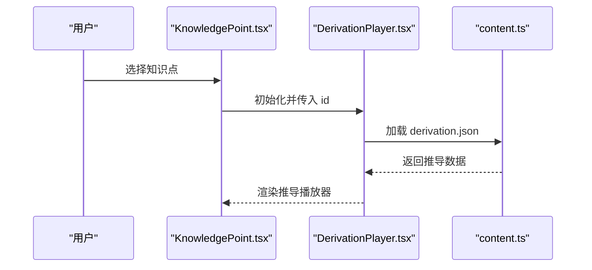
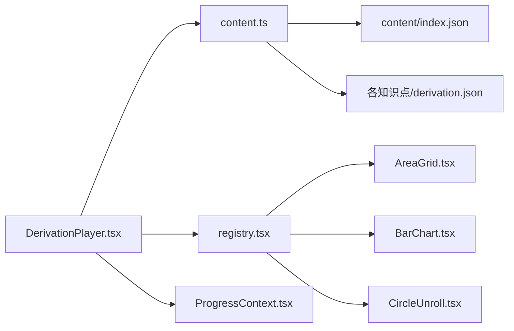

# DerivationPlayer 推导播放器

<cite>
**本文引用的文件**   
- [DerivationPlayer.tsx](file://src/components/DerivationPlayer.tsx)
- [KnowledgePoint.tsx](file://src/components/KnowledgePoint.tsx)
- [ProgressContext.tsx](file://src/context/ProgressContext.tsx)
- [content.ts](file://src/lib/content.ts)
- [progress.ts](file://src/lib/progress.ts)
- [types.ts](file://src/lib/types.ts)
- [index.json](file://src/content/index.json)
- [g3-fraction-add-sub/derivation.json](file://src/content/knowledge-points/g3-fraction-add-sub/derivation.json)
- [g3-mult-1digit/derivation.json](file://src/content/knowledge-points/g3-mult-1digit/derivation.json)
- [g4-arith-laws/derivation.json](file://src/content/knowledge-points/g4-arith-laws/derivation.json)
- [g5-equation/derivation.json](file://src/content/knowledge-points/g5-equation/derivation.json)
- [g6-circle-area/derivation.json](file://src/content/knowledge-points/g6-circle-area/derivation.json)
- [AreaGrid.tsx](file://src/visualizations/AreaGrid.tsx)
- [BarChart.tsx](file://src/visualizations/BarChart.tsx)
- [CircleUnroll.tsx](file://src/visualizations/CircleUnroll.tsx)
- [registry.tsx](file://src/visualizations/registry.tsx)
</cite>

## 目录
1. [简介](#简介)
2. [项目结构](#项目结构)
3. [核心组件](#核心组件)
4. [架构总览](#架构总览)
5. [详细组件分析](#详细组件分析)
6. [依赖关系分析](#依赖关系分析)
7. [性能考虑](#性能考虑)
8. [故障排查指南](#故障排查指南)
9. [结论](#结论)
10. [附录：API 参考与使用示例](#附录api-参考与使用示例)

## 简介
本技术文档围绕 DerivationPlayer 推导播放器组件，系统阐述数学推导过程的可视化播放机制。内容涵盖步骤动画控制、进度管理、用户交互处理与状态同步；详细说明推导数据的格式规范、播放器的控制接口以及与知识点组件的集成方式；解释动画引擎的实现原理、性能优化策略，并给出扩展新推导类型的实践方法。文末提供完整的 API 参考与使用示例，帮助开发者快速上手与二次开发。

## 项目结构
DerivationPlayer 位于 src/components 下，作为知识点的可视化播放入口，负责加载 derivation.json 数据、驱动渲染器（可视化组件）并按步播放。其关键依赖包括：
- 内容加载：src/lib/content.ts 负责读取与解析 content/index.json 与各知识点的 derivation.json
- 进度上下文：src/context/ProgressContext.tsx 提供全局进度状态与持久化
- 类型定义：src/lib/types.ts 定义推导数据结构与播放器接口
- 可视化注册：src/visualizations/registry.tsx 集中注册各类可视化组件，供播放器按需渲染

图表来源 
- [DerivationPlayer.tsx](file://src/components/DerivationPlayer.tsx)
- [KnowledgePoint.tsx](file://src/components/KnowledgePoint.tsx)
- [content.ts](file://src/lib/content.ts)
- [progress.ts](file://src/lib/progress.ts)
- [types.ts](file://src/lib/types.ts)
- [index.json](file://src/content/index.json)
- [registry.tsx](file://src/visualizations/registry.tsx)
- [AreaGrid.tsx](file://src/visualizations/AreaGrid.tsx)
- [BarChart.tsx](file://src/visualizations/BarChart.tsx)
- [CircleUnroll.tsx](file://src/visualizations/CircleUnroll.tsx)

章节来源
- [DerivationPlayer.tsx](file://src/components/DerivationPlayer.tsx)
- [content.ts](file://src/lib/content.ts)
- [progress.ts](file://src/lib/progress.ts)
- [types.ts](file://src/lib/types.ts)
- [registry.tsx](file://src/visualizations/registry.tsx)

## 核心组件
- DerivationPlayer：推导播放器主组件，负责加载推导数据、维护播放状态（当前步、是否播放中、速度等）、驱动动画帧更新、响应键盘与鼠标交互、与进度上下文同步。
- KnowledgePoint：知识点容器，负责展示标题、说明与嵌入 DerivationPlayer，并在切换知识点时重置或恢复播放状态。
- ProgressContext：全局进度上下文，提供“已完成的推导步骤”集合、进度条百分比、以及跨页面持久化能力。
- content.ts：统一的内容加载器，按知识点路径聚合 index.json 与 derivation.json，返回结构化数据。
- types.ts：定义推导数据结构（如步骤数组、动画参数、可视化类型标识等）与播放器对外接口类型。
- registry.tsx：可视化组件注册表，将“可视化类型标识”映射到具体 React 组件，支持动态渲染。

章节来源
- [DerivationPlayer.tsx](file://src/components/DerivationPlayer.tsx)
- [KnowledgePoint.tsx](file://src/components/KnowledgePoint.tsx)
- [ProgressContext.tsx](file://src/context/ProgressContext.tsx)
- [content.ts](file://src/lib/content.ts)
- [types.ts](file://src/lib/types.ts)
- [registry.tsx](file://src/visualizations/registry.tsx)

## 架构总览
DerivationPlayer 采用“数据驱动 + 事件驱动”的架构：
- 数据驱动：从 derivation.json 读取步骤序列，每步包含可视化类型、参数与过渡动画配置。
- 事件驱动：用户操作（前进/后退/暂停/跳转）与定时器触发帧更新，驱动动画引擎推进到目标步。
- 渲染管线：根据当前步的可视化类型，通过 registry 查找对应组件并传入该步的参数进行渲染。
- 状态同步：播放进度与全局进度上下文双向同步，确保刷新后仍可恢复。

图表来源 
- [DerivationPlayer.tsx](file://src/components/DerivationPlayer.tsx)
- [content.ts](file://src/lib/content.ts)
- [registry.tsx](file://src/visualizations/registry.tsx)
- [ProgressContext.tsx](file://src/context/ProgressContext.tsx)

## 详细组件分析

### DerivationPlayer 组件
职责与流程
- 数据加载：根据知识点 ID 调用 content.ts 获取 derivation.json，解析为步骤列表。
- 状态管理：维护当前步索引、播放状态（播放/暂停）、速度、是否自动播放、是否循环等。
- 动画引擎：基于时间片推进，对相邻两步进行插值，实现平滑过渡。
- 交互处理：支持键盘（左右箭头、空格）、鼠标（点击进度条跳转）、手势（移动端滑动）。
- 进度同步：将当前步写入 ProgressContext，支持跨页面持久化与恢复。
- 错误处理：当步骤缺失、类型未知或资源加载失败时，降级显示提示并记录日志。

关键实现要点
- 步骤数据结构：每个步骤包含可视化类型、参数对象、过渡时长与缓动函数等。
- 插值算法：对数值型参数进行线性或曲线插值，对布尔/枚举型参数进行离散切换。
- 渲染调度：使用 requestAnimationFrame 保证动画流畅，避免阻塞主线程。
- 可访问性：为关键控件提供 aria 标签与键盘导航支持。

图表来源 
- [DerivationPlayer.tsx](file://src/components/DerivationPlayer.tsx)
- [content.ts](file://src/lib/content.ts)
- [ProgressContext.tsx](file://src/context/ProgressContext.tsx)

章节来源
- [DerivationPlayer.tsx](file://src/components/DerivationPlayer.tsx)
- [content.ts](file://src/lib/content.ts)
- [ProgressContext.tsx](file://src/context/ProgressContext.tsx)

### 推导数据格式规范（derivation.json）
字段约定（以实际仓库中的示例为准）
- id：知识点唯一标识
- title：推导标题
- steps：步骤数组，每项包含：
  - type：可视化类型标识（如 area-grid、bar-chart、circle-unroll 等）
  - params：该步骤的渲染参数（数值、颜色、尺寸、文本等）
  - duration：过渡时长（毫秒）
  - easing：缓动函数名（如 linear、easeInOut）
- meta：可选元数据（作者、版本、语言等）

示例文件位置
- [g3-fraction-add-sub/derivation.json](file://src/content/knowledge-points/g3-fraction-add-sub/derivation.json)
- [g3-mult-1digit/derivation.json](file://src/content/knowledge-points/g3-mult-1digit/derivation.json)
- [g4-arith-laws/derivation.json](file://src/content/knowledge-points/g4-arith-laws/derivation.json)
- [g5-equation/derivation.json](file://src/content/knowledge-points/g5-equation/derivation.json)
- [g6-circle-area/derivation.json](file://src/content/knowledge-points/g6-circle-area/derivation.json)

章节来源
- [g3-fraction-add-sub/derivation.json](file://src/content/knowledge-points/g3-fraction-add-sub/derivation.json)
- [g3-mult-1digit/derivation.json](file://src/content/knowledge-points/g3-mult-1digit/derivation.json)
- [g4-arith-laws/derivation.json](file://src/content/knowledge-points/g4-arith-laws/derivation.json)
- [g5-equation/derivation.json](file://src/content/knowledge-points/g5-equation/derivation.json)
- [g6-circle-area/derivation.json](file://src/content/knowledge-points/g6-circle-area/derivation.json)

### 可视化组件与注册表
- registry.tsx：维护“类型标识 -> 组件”映射，播放器根据步骤 type 动态选择渲染组件。
- 典型可视化组件：
  - AreaGrid.tsx：面积网格模型，用于分数加减等概念演示
  - BarChart.tsx：柱状图，用于统计与比较
  - CircleUnroll.tsx：圆展开模型，用于周长与面积推导

图表来源 
- [registry.tsx](file://src/visualizations/registry.tsx)
- [AreaGrid.tsx](file://src/visualizations/AreaGrid.tsx)
- [BarChart.tsx](file://src/visualizations/BarChart.tsx)
- [CircleUnroll.tsx](file://src/visualizations/CircleUnroll.tsx)

章节来源
- [registry.tsx](file://src/visualizations/registry.tsx)
- [AreaGrid.tsx](file://src/visualizations/AreaGrid.tsx)
- [BarChart.tsx](file://src/visualizations/BarChart.tsx)
- [CircleUnroll.tsx](file://src/visualizations/CircleUnroll.tsx)

### 进度管理与状态同步
- ProgressContext 提供：
  - completedSteps：已完成步骤集合
  - currentStep：当前步骤索引
  - setCompletedSteps / setCurrentStep：更新方法
  - 持久化：localStorage 存储与恢复
- DerivationPlayer 在每一步完成后更新 completedSteps，并在组件挂载时恢复上次进度。

图表来源 
- [ProgressContext.tsx](file://src/context/ProgressContext.tsx)
- [DerivationPlayer.tsx](file://src/components/DerivationPlayer.tsx)

章节来源
- [ProgressContext.tsx](file://src/context/ProgressContext.tsx)
- [progress.ts](file://src/lib/progress.ts)

### 与知识点组件的集成
- KnowledgePoint.tsx 负责：
  - 加载知识点元数据（title、description、id）
  - 渲染 DerivationPlayer 并传入知识点 ID
  - 在切换知识点时重置播放状态或恢复历史进度

图表来源 
- [KnowledgePoint.tsx](file://src/components/KnowledgePoint.tsx)
- [DerivationPlayer.tsx](file://src/components/DerivationPlayer.tsx)
- [content.ts](file://src/lib/content.ts)

章节来源
- [KnowledgePoint.tsx](file://src/components/KnowledgePoint.tsx)
- [content.ts](file://src/lib/content.ts)

## 依赖关系分析
- DerivationPlayer 依赖 content.ts 加载推导数据，依赖 registry.tsx 渲染可视化组件，依赖 ProgressContext.tsx 管理进度。
- content.ts 依赖 index.json 与各知识点的 derivation.json。
- registry.tsx 依赖具体可视化组件（AreaGrid、BarChart、CircleUnroll 等）。
- 类型定义集中在 types.ts，确保数据结构一致性。

图表来源 
- [DerivationPlayer.tsx](file://src/components/DerivationPlayer.tsx)
- [content.ts](file://src/lib/content.ts)
- [registry.tsx](file://src/visualizations/registry.tsx)
- [ProgressContext.tsx](file://src/context/ProgressContext.tsx)
- [index.json](file://src/content/index.json)
- [AreaGrid.tsx](file://src/visualizations/AreaGrid.tsx)
- [BarChart.tsx](file://src/visualizations/BarChart.tsx)
- [CircleUnroll.tsx](file://src/visualizations/CircleUnroll.tsx)

章节来源
- [DerivationPlayer.tsx](file://src/components/DerivationPlayer.tsx)
- [content.ts](file://src/lib/content.ts)
- [registry.tsx](file://src/visualizations/registry.tsx)
- [ProgressContext.tsx](file://src/context/ProgressContext.tsx)

## 性能考虑
- 动画帧调度：使用 requestAnimationFrame 减少重排与重绘，避免阻塞 UI。
- 增量渲染：仅更新当前步骤相关组件，避免全量重渲染。
- 数据缓存：content.ts 对 derivation.json 进行内存缓存，避免重复请求。
- 懒加载可视化组件：registry.tsx 可按需导入组件，降低初始包体积。
- 防抖与节流：对频繁的用户输入（如拖拽进度条）进行节流，减少不必要的计算。
- 内存管理：在组件卸载时清理定时器与事件监听，防止内存泄漏。

[本节为通用指导，不直接分析具体文件]

## 故障排查指南
常见问题与定位方法
- 推导数据加载失败：检查 derivation.json 路径与字段完整性，确认 content.ts 的解析逻辑。
- 可视化类型未知：确认 registry.tsx 已注册对应类型，且步骤 type 与注册键一致。
- 进度未恢复：检查 ProgressContext 的持久化逻辑与 localStorage 权限。
- 动画卡顿：检查插值计算复杂度与渲染组件开销，必要时简化参数或拆分步骤。
- 键盘/鼠标事件无效：确认事件绑定与作用域，检查无障碍属性是否正确设置。

建议调试手段
- 在 DerivationPlayer 中添加步骤日志，输出当前步索引与参数。
- 使用浏览器性能面板分析渲染耗时与主线程占用。
- 对 content.ts 的加载过程添加网络请求监控。

章节来源
- [DerivationPlayer.tsx](file://src/components/DerivationPlayer.tsx)
- [content.ts](file://src/lib/content.ts)
- [registry.tsx](file://src/visualizations/registry.tsx)
- [ProgressContext.tsx](file://src/context/ProgressContext.tsx)

## 结论
DerivationPlayer 以数据驱动的推导步骤为核心，结合事件驱动的动画引擎与统一的可视化注册表，实现了灵活、可扩展的数学推导播放体验。通过与 ProgressContext 的深度集成，播放器具备跨页面进度持久化能力；借助 registry 的动态渲染机制，新增推导类型只需注册新组件即可无缝接入。整体架构清晰、职责分明，便于维护与扩展。

[本节为总结性内容，不直接分析具体文件]

## 附录：API 参考与使用示例

### DerivationPlayer 接口概览
- 输入属性
  - knowledgeId：知识点唯一标识，用于加载对应的 derivation.json
  - autoPlay：是否自动播放
  - speed：播放速度（倍率）
  - loop：是否循环播放
  - onStepChange：步骤变化回调（currentStep, totalSteps）
  - onComplete：完成回调
- 公共方法
  - play()：开始播放
  - pause()：暂停播放
  - next()：下一步
  - prev()：上一步
  - jumpTo(stepIndex)：跳转到指定步骤
  - reset()：重置播放状态
- 事件
  - stepEnter：进入某一步骤
  - stepLeave：离开某一步骤
  - progressUpdate：进度更新（currentStep, percentage）

章节来源
- [DerivationPlayer.tsx](file://src/components/DerivationPlayer.tsx)
- [types.ts](file://src/lib/types.ts)

### 推导数据字段说明（derivation.json）
- id：字符串，知识点标识
- title：字符串，推导标题
- steps：数组，每项包含：
  - type：字符串，可视化类型标识
  - params：对象，渲染参数
  - duration：数字，过渡时长（毫秒）
  - easing：字符串，缓动函数名
- meta：对象，可选元数据（author、version、lang 等）

章节来源
- [g3-fraction-add-sub/derivation.json](file://src/content/knowledge-points/g3-fraction-add-sub/derivation.json)
- [g3-mult-1digit/derivation.json](file://src/content/knowledge-points/g3-mult-1digit/derivation.json)
- [g4-arith-laws/derivation.json](file://src/content/knowledge-points/g4-arith-laws/derivation.json)
- [g5-equation/derivation.json](file://src/content/knowledge-points/g5-equation/derivation.json)
- [g6-circle-area/derivation.json](file://src/content/knowledge-points/g6-circle-area/derivation.json)

### 与知识点组件集成示例
- 在 KnowledgePoint.tsx 中引入 DerivationPlayer，并传入 knowledgeId。
- 在页面路由切换时，保持 ProgressContext 的进度状态，确保恢复播放位置。
- 如需自定义控制栏，可通过 onStepChange 与 public methods 对接。

章节来源
- [KnowledgePoint.tsx](file://src/components/KnowledgePoint.tsx)
- [DerivationPlayer.tsx](file://src/components/DerivationPlayer.tsx)
- [ProgressContext.tsx](file://src/context/ProgressContext.tsx)

### 扩展新推导类型
- 新增可视化组件：在 visualizations 目录下创建新组件，实现 render(params) 接口。
- 注册类型：在 registry.tsx 中将新类型标识映射到新组件。
- 编写推导数据：在对应知识点的 derivation.json 中添加 steps，指定 type 与 params。
- 测试验证：通过 DerivationPlayer 播放新类型，检查动画与交互是否正常。

章节来源
- [registry.tsx](file://src/visualizations/registry.tsx)
- [AreaGrid.tsx](file://src/visualizations/AreaGrid.tsx)
- [BarChart.tsx](file://src/visualizations/BarChart.tsx)
- [CircleUnroll.tsx](file://src/visualizations/CircleUnroll.tsx)