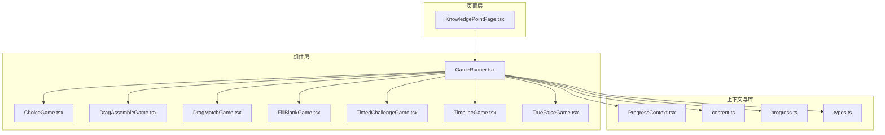
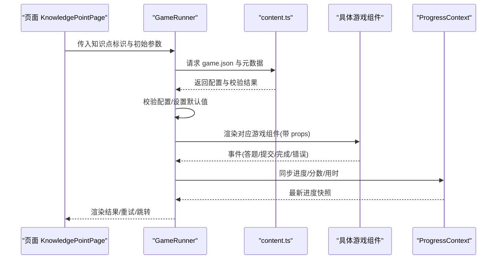
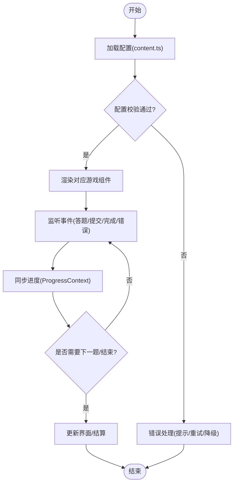
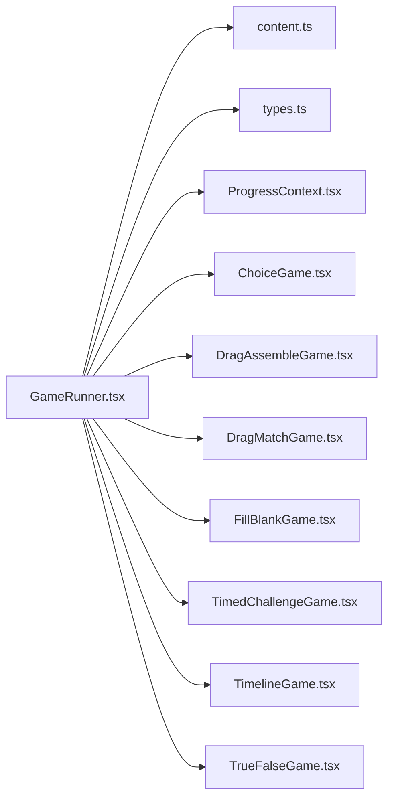

# GameRunner 游戏运行器

<cite>
**本文引用的文件**   
- [GameRunner.tsx](file://src/components/GameRunner.tsx)
- [ChoiceGame.tsx](file://src/components/games/ChoiceGame.tsx)
- [DragAssembleGame.tsx](file://src/components/games/DragAssembleGame.tsx)
- [DragMatchGame.tsx](file://src/components/games/DragMatchGame.tsx)
- [FillBlankGame.tsx](file://src/components/games/FillBlankGame.tsx)
- [TimedChallengeGame.tsx](file://src/components/games/TimedChallengeGame.tsx)
- [TimelineGame.tsx](file://src/components/games/TimelineGame.tsx)
- [TrueFalseGame.tsx](file://src/components/games/TrueFalseGame.tsx)
- [ProgressContext.tsx](file://src/context/ProgressContext.tsx)
- [content.ts](file://src/lib/content.ts)
- [progress.ts](file://src/lib/progress.ts)
- [types.ts](file://src/lib/types.ts)
- [KnowledgePointPage.tsx](file://src/pages/KnowledgePointPage.tsx)
- [gameRunner.test.ts](file://src/test/gameRunner.test.ts)
</cite>

## 目录
1. [简介](#简介)
2. [项目结构](#项目结构)
3. [核心组件](#核心组件)
4. [架构总览](#架构总览)
5. [详细组件分析](#详细组件分析)
6. [依赖关系分析](#依赖关系分析)
7. [性能考量](#性能考量)
8. [故障排查指南](#故障排查指南)
9. [结论](#结论)
10. [附录：新游戏类型开发指南](#附录新游戏类型开发指南)

## 简介
本技术文档围绕 GameRunner 游戏运行器组件，系统阐述其核心架构与运行机制，包括：
- 游戏类型识别与运行时调度
- 生命周期管理与状态同步机制
- 七种游戏类型的统一接口设计
- 配置校验、错误处理与性能监控
- 新游戏类型的开发与集成示例

目标是帮助开发者快速理解并扩展该运行器，确保新增或修改游戏类型时具备一致的行为与可观测性。

## 项目结构
GameRunner 位于组件层，负责加载知识点的游戏配置、解析并渲染具体游戏组件，同时与进度上下文和类型定义协作，完成状态同步与结果上报。

图表来源
- [GameRunner.tsx](file://src/components/GameRunner.tsx)
- [KnowledgePointPage.tsx](file://src/pages/KnowledgePointPage.tsx)
- [ProgressContext.tsx](file://src/context/ProgressContext.tsx)
- [content.ts](file://src/lib/content.ts)
- [progress.ts](file://src/lib/progress.ts)
- [types.ts](file://src/lib/types.ts)

章节来源
- [GameRunner.tsx](file://src/components/GameRunner.tsx)
- [KnowledgePointPage.tsx](file://src/pages/KnowledgePointPage.tsx)
- [ProgressContext.tsx](file://src/context/ProgressContext.tsx)
- [content.ts](file://src/lib/content.ts)
- [progress.ts](file://src/lib/progress.ts)
- [types.ts](file://src/lib/types.ts)

## 核心组件
- GameRunner 运行器
  - 职责：根据知识点配置选择并渲染对应游戏组件；管理初始化、交互、提交、重试等生命周期；与进度上下文同步状态；对配置进行校验与错误兜底。
  - 关键流程：加载配置 → 校验 → 实例化游戏 → 监听事件 → 更新进度 → 结束结算。
- 七类游戏组件
  - ChoiceGame、DragAssembleGame、DragMatchGame、FillBlankGame、TimedChallengeGame、TimelineGame、TrueFalseGame
  - 统一接口约定：输入 props（题目数据、主题、难度、时间限制等）、输出事件（答题、提交、完成、错误）与状态（当前题号、得分、用时、是否完成）。
- 上下文与工具
  - ProgressContext：集中管理学习进度、得分、完成度、历史记录等。
  - content.ts：读取与解析知识点内容（含 game.json 元数据）。
  - progress.ts：进度计算、持久化与合并策略。
  - types.ts：统一的类型定义（如 GameConfig、GameState、EventPayload 等）。

章节来源
- [GameRunner.tsx](file://src/components/GameRunner.tsx)
- [ChoiceGame.tsx](file://src/components/games/ChoiceGame.tsx)
- [DragAssembleGame.tsx](file://src/components/games/DragAssembleGame.tsx)
- [DragMatchGame.tsx](file://src/components/games/DragMatchGame.tsx)
- [FillBlankGame.tsx](file://src/components/games/FillBlankGame.tsx)
- [TimedChallengeGame.tsx](file://src/components/games/TimedChallengeGame.tsx)
- [TimelineGame.tsx](file://src/components/games/TimelineGame.tsx)
- [TrueFalseGame.tsx](file://src/components/games/TrueFalseGame.tsx)
- [ProgressContext.tsx](file://src/context/ProgressContext.tsx)
- [content.ts](file://src/lib/content.ts)
- [progress.ts](file://src/lib/progress.ts)
- [types.ts](file://src/lib/types.ts)

## 架构总览
GameRunner 作为“控制器 + 调度器”，将数据流与事件流解耦，保证各游戏类型以统一契约接入。

图表来源
- [GameRunner.tsx](file://src/components/GameRunner.tsx)
- [content.ts](file://src/lib/content.ts)
- [ProgressContext.tsx](file://src/context/ProgressContext.tsx)

## 详细组件分析

### GameRunner 运行器
- 功能要点
  - 配置加载与校验：从 content.ts 获取 game.json，按 types.ts 中的约束校验必填字段、取值范围、依赖资源等。
  - 运行时调度：依据配置中的 type 字段映射到具体游戏组件，动态挂载与卸载。
  - 生命周期管理：init → render → onAnswer/onSubmit/onComplete/onError → dispose。
  - 状态同步：通过 ProgressContext 聚合答题结果、用时、正确率、完成标记等。
  - 错误处理：捕获加载失败、配置不合法、组件异常等，提供降级展示与重试入口。
  - 性能监控：统计首帧渲染耗时、交互延迟、内存占用（可通过埋点上报）。

图表来源
- [GameRunner.tsx](file://src/components/GameRunner.tsx)
- [content.ts](file://src/lib/content.ts)
- [ProgressContext.tsx](file://src/context/ProgressContext.tsx)

章节来源
- [GameRunner.tsx](file://src/components/GameRunner.tsx)
- [content.ts](file://src/lib/content.ts)
- [ProgressContext.tsx](file://src/context/ProgressContext.tsx)

### 统一接口设计（七种游戏类型）
- 共同 Props
  - 题目数据、主题样式、难度等级、时间限制、语言/本地化键、回调函数（onAnswer、onSubmit、onComplete、onError）。
- 共同事件
  - onAnswer：用户作答（支持多次尝试）。
  - onSubmit：提交答案（触发评分与反馈）。
  - onComplete：完成关卡（包含用时、得分、正确率）。
  - onError：内部错误（网络、资源缺失、逻辑异常）。
- 共同状态
  - currentQuestionIndex、score、timeLeft、isCompleted、feedback、error。
- 行为约定
  - 必须实现“可访问性”（键盘导航、屏幕阅读器友好）。
  - 必须在超时或错误时安全退出并上报。
  - 所有副作用需可清理（定时器、事件监听器等）。

章节来源
- [ChoiceGame.tsx](file://src/components/games/ChoiceGame.tsx)
- [DragAssembleGame.tsx](file://src/components/games/DragAssembleGame.tsx)
- [DragMatchGame.tsx](file://src/components/games/DragMatchGame.tsx)
- [FillBlankGame.tsx](file://src/components/games/FillBlankGame.tsx)
- [TimedChallengeGame.tsx](file://src/components/games/TimedChallengeGame.tsx)
- [TimelineGame.tsx](file://src/components/games/TimelineGame.tsx)
- [TrueFalseGame.tsx](file://src/components/games/TrueFalseGame.tsx)
- [types.ts](file://src/lib/types.ts)

### 配置验证机制
- 校验维度
  - 必填字段：type、questions、options（视类型而定）。
  - 取值范围：timeLimit、difficulty、maxAttempts。
  - 数据结构：questions 数组项的 id、text、answer、distractors（选择题）、matchPairs（拖拽匹配）等。
  - 资源引用：图片、音频、可视化模型是否存在。
- 校验策略
  - 静态校验：在加载阶段执行，失败则回退至默认配置或提示错误。
  - 动态校验：在交互过程中对输入进行即时校验（如填空长度、拖拽合法性）。
- 错误分类
  - 致命错误：阻止渲染（如缺少 questions）。
  - 非致命错误：降级显示（如某题资源缺失跳过）。

章节来源
- [content.ts](file://src/lib/content.ts)
- [types.ts](file://src/lib/types.ts)
- [gameRunner.test.ts](file://src/test/gameRunner.test.ts)

### 错误处理策略
- 加载期错误
  - 网络失败：重试次数上限、指数退避、离线缓存。
  - 配置非法：抛出明确错误信息，提供修复建议。
- 运行期错误
  - 组件异常：捕获堆栈、上报日志、回退到上一题或结束。
  - 超时：强制提交或终止计时，给出提示。
- 恢复路径
  - 重试按钮、继续练习、查看解析、返回上一页。

章节来源
- [GameRunner.tsx](file://src/components/GameRunner.tsx)
- [ProgressContext.tsx](file://src/context/ProgressContext.tsx)
- [gameRunner.test.ts](file://src/test/gameRunner.test.ts)

### 性能监控
- 指标采集
  - 首帧渲染时间、交互响应延迟、内存峰值、定时器开销。
- 采样策略
  - 关键路径打点（加载、渲染、提交），避免阻塞主线程。
- 上报与可视化
  - 汇总到 ProgressContext 或外部监控平台，提供仪表盘视图。

章节来源
- [ProgressContext.tsx](file://src/context/ProgressContext.tsx)
- [gameRunner.test.ts](file://src/test/gameRunner.test.ts)

## 依赖关系分析
GameRunner 依赖内容加载、类型定义与进度上下文，各游戏组件仅依赖统一接口与基础 UI 能力。

图表来源
- [GameRunner.tsx](file://src/components/GameRunner.tsx)
- [content.ts](file://src/lib/content.ts)
- [types.ts](file://src/lib/types.ts)
- [ProgressContext.tsx](file://src/context/ProgressContext.tsx)
- [ChoiceGame.tsx](file://src/components/games/ChoiceGame.tsx)
- [DragAssembleGame.tsx](file://src/components/games/DragAssembleGame.tsx)
- [DragMatchGame.tsx](file://src/components/games/DragMatchGame.tsx)
- [FillBlankGame.tsx](file://src/components/games/FillBlankGame.tsx)
- [TimedChallengeGame.tsx](file://src/components/games/TimedChallengeGame.tsx)
- [TimelineGame.tsx](file://src/components/games/TimelineGame.tsx)
- [TrueFalseGame.tsx](file://src/components/games/TrueFalseGame.tsx)

章节来源
- [GameRunner.tsx](file://src/components/GameRunner.tsx)
- [content.ts](file://src/lib/content.ts)
- [types.ts](file://src/lib/types.ts)
- [ProgressContext.tsx](file://src/context/ProgressContext.tsx)

## 性能考量
- 懒加载与按需渲染
  - 仅在需要时加载特定游戏组件与资源，减少初始包体积。
- 事件节流与防抖
  - 高频交互（拖拽、输入）采用节流/防抖降低重渲染频率。
- 状态最小化
  - 使用不可变更新与局部状态，避免全局状态频繁扩散。
- 资源优化
  - 图片压缩、音频格式选择、字体子集化。
- 监控与回归
  - 关键指标纳入测试与 CI，防止性能退化。

[本节为通用指导，无需列出章节来源]

## 故障排查指南
- 常见问题定位
  - 配置错误：检查 game.json 结构与必填字段，参考 types.ts 定义。
  - 资源缺失：确认图片/音频路径与打包产物。
  - 事件未触发：检查组件内事件绑定与清理逻辑。
  - 进度不同步：确认 ProgressContext 的更新时机与幂等性。
- 调试手段
  - 启用开发模式日志，观察事件流与状态变化。
  - 使用单元测试覆盖边界用例（空配置、超长文本、极端时间）。
- 恢复操作
  - 提供重试、重置、跳过、查看解析等入口。

章节来源
- [gameRunner.test.ts](file://src/test/gameRunner.test.ts)
- [ProgressContext.tsx](file://src/context/ProgressContext.tsx)
- [content.ts](file://src/lib/content.ts)

## 结论
GameRunner 通过统一接口与清晰的职责划分，实现了多类型游戏的稳定运行与可扩展性。配合完善的配置校验、错误处理与性能监控，能够保障学习体验的一致性与可靠性。新增游戏类型只需遵循统一契约，即可无缝集成。

[本节为总结性内容，无需列出章节来源]

## 附录：新游戏类型开发指南
- 步骤概览
  1. 定义类型与配置
     - 在 types.ts 中补充新的 GameType 与对应的 Config 结构。
  2. 创建游戏组件
     - 新建组件文件（如 NewGame.tsx），实现统一 Props、事件与状态。
  3. 注册与调度
     - 在 GameRunner 的类型映射表中注册新类型，确保能正确渲染。
  4. 配置与校验
     - 在 content.ts 的校验逻辑中加入新类型的规则。
  5. 进度与监控
     - 在 ProgressContext 中扩展必要的指标（如用时、正确率）。
  6. 测试与验收
     - 编写单元测试与集成测试，覆盖正常与异常路径。
- 最佳实践
  - 保持组件无副作用或可清理副作用。
  - 提供无障碍支持与键盘导航。
  - 对长耗时操作进行异步化与分片。
  - 对错误进行分类与上报，便于定位问题。

章节来源
- [types.ts](file://src/lib/types.ts)
- [GameRunner.tsx](file://src/components/GameRunner.tsx)
- [content.ts](file://src/lib/content.ts)
- [ProgressContext.tsx](file://src/context/ProgressContext.tsx)
- [gameRunner.test.ts](file://src/test/gameRunner.test.ts)