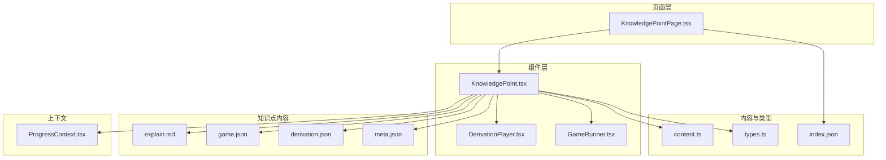
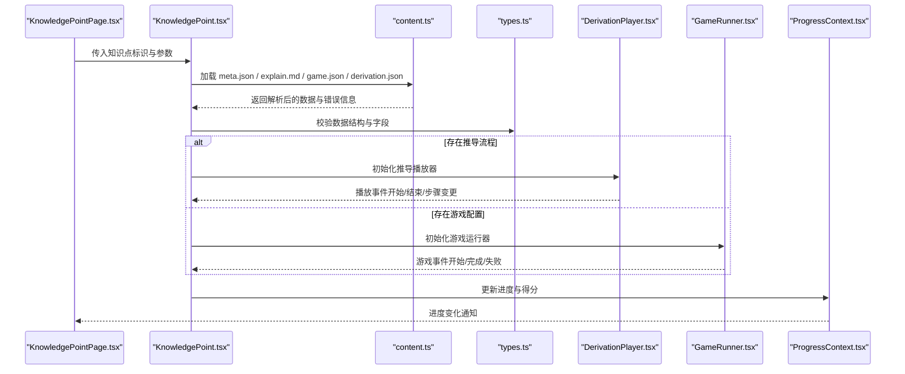
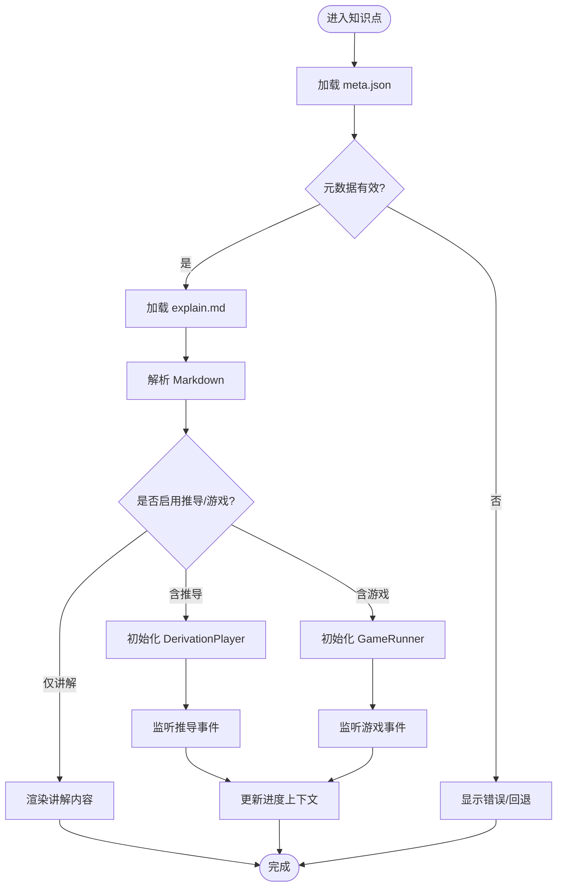
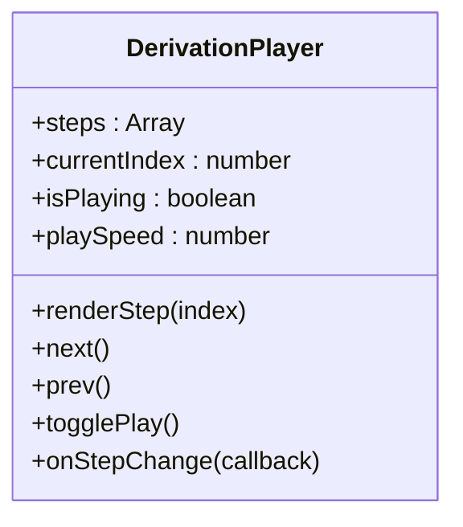
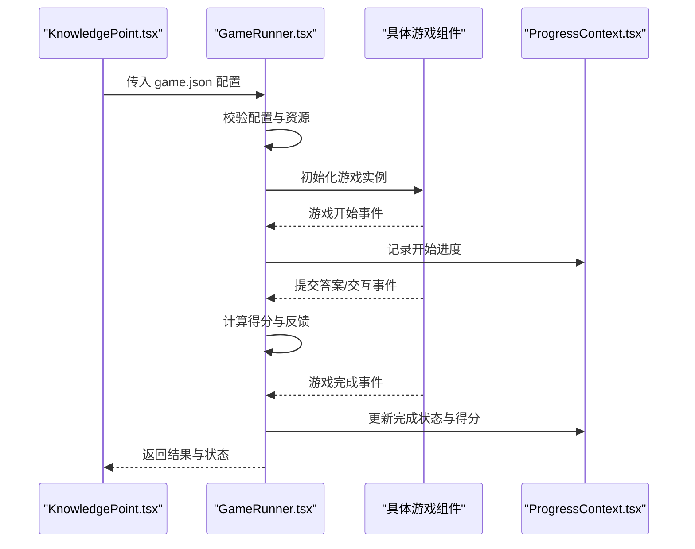
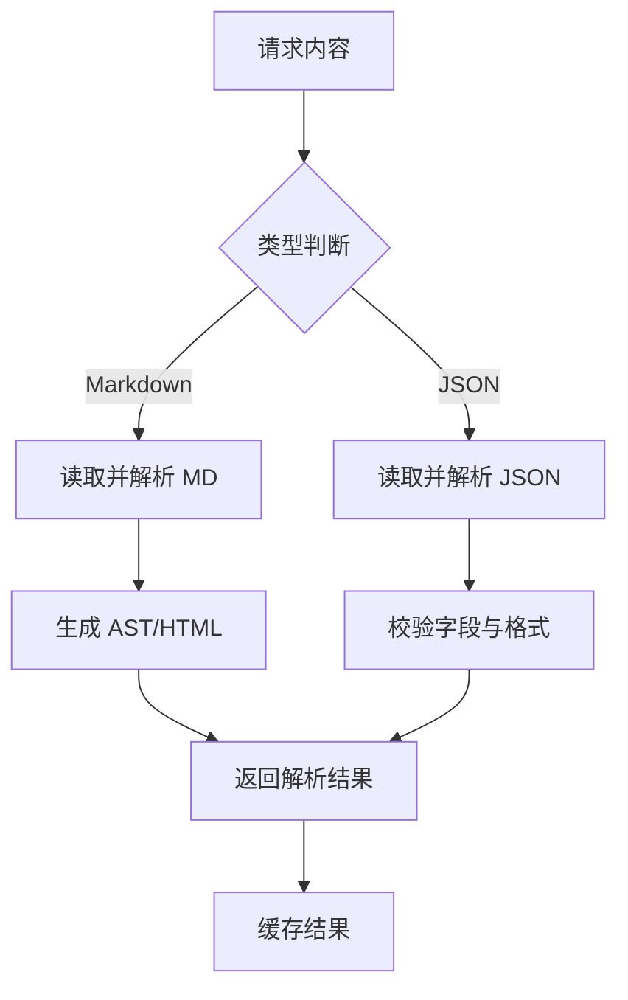
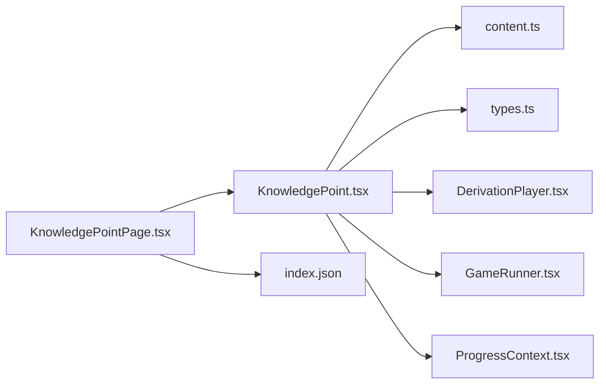

# KnowledgePoint 知识点组件

<cite>
**本文引用的文件**   
- [KnowledgePoint.tsx](file://src/components/KnowledgePoint.tsx)
- [DerivationPlayer.tsx](file://src/components/DerivationPlayer.tsx)
- [GameRunner.tsx](file://src/components/GameRunner.tsx)
- [content.ts](file://src/lib/content.ts)
- [types.ts](file://src/lib/types.ts)
- [ProgressContext.tsx](file://src/context/ProgressContext.tsx)
- [KnowledgePointPage.tsx](file://src/pages/KnowledgePointPage.tsx)
- [index.json](file://src/content/index.json)
- [g3-fraction-add-sub/explain.md](file://src/content/knowledge-points/g3-fraction-add-sub/explain.md)
- [g3-fraction-add-sub/game.json](file://src/content/knowledge-points/g3-fraction-add-sub/game.json)
- [g3-fraction-add-sub/meta.json](file://src/content/knowledge-points/g3-fraction-add-sub/meta.json)
- [g3-fraction-add-sub/derivation.json](file://src/content/knowledge-points/g3-fraction-add-sub/derivation.json)
</cite>

## 目录
1. [简介](#简介)
2. [项目结构](#项目结构)
3. [核心组件](#核心组件)
4. [架构总览](#架构总览)
5. [详细组件分析](#详细组件分析)
6. [依赖关系分析](#依赖关系分析)
7. [性能考虑](#性能考虑)
8. [故障排查指南](#故障排查指南)
9. [结论](#结论)
10. [附录](#附录)

## 简介
本技术文档围绕 KnowledgePoint 知识点组件，系统性阐述其动态渲染机制与数据流设计。重点覆盖：
- Markdown 内容解析与渲染
- 游戏配置加载与运行（game.json）
- 推导流程加载与播放（derivation.json）
- 元数据管理（meta.json）
- 状态管理与交互逻辑
- 与 DerivationPlayer、GameRunner 的集成方式
- 错误处理策略与性能优化技巧
- 自定义内容类型的扩展指南与最佳实践

## 项目结构
KnowledgePoint 组件位于 src/components 下，配合 src/lib 的内容与类型工具、src/context 进度上下文、以及 src/pages 页面层进行组合。知识点内容以文件夹为单位组织在 src/content/knowledge-points 中，每个知识点包含 explain.md、game.json、derivation.json（可选）、meta.json 等文件。

图表来源
- [KnowledgePoint.tsx](file://src/components/KnowledgePoint.tsx)
- [DerivationPlayer.tsx](file://src/components/DerivationPlayer.tsx)
- [GameRunner.tsx](file://src/components/GameRunner.tsx)
- [content.ts](file://src/lib/content.ts)
- [types.ts](file://src/lib/types.ts)
- [ProgressContext.tsx](file://src/context/ProgressContext.tsx)
- [KnowledgePointPage.tsx](file://src/pages/KnowledgePointPage.tsx)
- [index.json](file://src/content/index.json)

章节来源
- [KnowledgePoint.tsx](file://src/components/KnowledgePoint.tsx)
- [content.ts](file://src/lib/content.ts)
- [types.ts](file://src/lib/types.ts)
- [ProgressContext.tsx](file://src/context/ProgressContext.tsx)
- [KnowledgePointPage.tsx](file://src/pages/KnowledgePointPage.tsx)
- [index.json](file://src/content/index.json)

## 核心组件
- KnowledgePoint.tsx：知识点容器组件，负责加载并协调 explain.md、game.json、derivation.json、meta.json，驱动 DerivationPlayer 与 GameRunner，维护本地与全局状态。
- DerivationPlayer.tsx：推导播放器，按步骤渲染推导过程，支持前进/后退、自动播放、暂停等交互。
- GameRunner.tsx：游戏运行器，根据 game.json 配置实例化具体游戏（如选择题、拖拽匹配、填空等），管理游戏生命周期与结果上报。
- content.ts：内容加载与解析工具，提供 Markdown 读取、JSON 配置加载、元数据处理、缓存与错误封装。
- types.ts：统一类型定义，包括知识点元数据、游戏配置、推导步骤、渲染模式等。
- ProgressContext.tsx：全局进度上下文，记录学习进度、完成状态、得分等，供多组件共享。

章节来源
- [KnowledgePoint.tsx](file://src/components/KnowledgePoint.tsx)
- [DerivationPlayer.tsx](file://src/components/DerivationPlayer.tsx)
- [GameRunner.tsx](file://src/components/GameRunner.tsx)
- [content.ts](file://src/lib/content.ts)
- [types.ts](file://src/lib/types.ts)
- [ProgressContext.tsx](file://src/context/ProgressContext.tsx)

## 架构总览
KnowledgePoint 采用“内容驱动 + 组件编排”的架构：页面层通过路由或索引选择知识点，KnowledgePoint 组件根据标识加载对应内容，解析 Markdown 与 JSON 配置后，按需渲染推导播放器或游戏运行器，并通过上下文同步进度。

图表来源
- [KnowledgePoint.tsx](file://src/components/KnowledgePoint.tsx)
- [content.ts](file://src/lib/content.ts)
- [types.ts](file://src/lib/types.ts)
- [DerivationPlayer.tsx](file://src/components/DerivationPlayer.tsx)
- [GameRunner.tsx](file://src/components/GameRunner.tsx)
- [ProgressContext.tsx](file://src/context/ProgressContext.tsx)

## 详细组件分析

### KnowledgePoint 组件
职责与行为
- 接收知识点标识，定位内容目录并加载资源
- 解析 Markdown 文本为可渲染内容（HTML/AST）
- 加载并校验 game.json、derivation.json、meta.json
- 根据配置决定渲染模式：纯讲解、推导+讲解、游戏+讲解、仅游戏等
- 管理本地状态（加载态、错误态、当前步骤、游戏状态）
- 与 DerivationPlayer、GameRunner 通信，转发事件
- 将进度与结果上报至 ProgressContext

关键数据流
- 输入：知识点标识、URL 参数、上下文进度
- 输出：渲染树、事件回调、进度更新

错误处理
- 网络请求失败：重试/降级显示
- JSON 解析失败：回退到默认配置或提示用户
- Markdown 解析异常：显示占位内容并记录日志

性能优化
- 内容缓存：对已加载的 Markdown 与 JSON 做内存缓存
- 懒加载：仅在需要时加载推导或游戏资源
- 防抖节流：对频繁交互事件进行节流

图表来源
- [KnowledgePoint.tsx](file://src/components/KnowledgePoint.tsx)
- [content.ts](file://src/lib/content.ts)
- [types.ts](file://src/lib/types.ts)

章节来源
- [KnowledgePoint.tsx](file://src/components/KnowledgePoint.tsx)
- [content.ts](file://src/lib/content.ts)
- [types.ts](file://src/lib/types.ts)

### DerivationPlayer 组件
职责与行为
- 接收推导步骤数组，按步渲染
- 支持导航控制（上一步/下一步）、自动播放、暂停、速度调节
- 触发步骤变更事件，便于上层统计与联动

状态管理
- 当前步骤索引、播放状态、计时器
- 步骤有效性校验与边界保护

交互逻辑
- 键盘快捷键、点击按钮、滑动手势（可选）
- 与进度上下文联动，标记步骤完成度

图表来源
- [DerivationPlayer.tsx](file://src/components/DerivationPlayer.tsx)

章节来源
- [DerivationPlayer.tsx](file://src/components/DerivationPlayer.tsx)

### GameRunner 组件
职责与行为
- 根据 game.json 配置实例化具体游戏组件（如 ChoiceGame、DragMatchGame 等）
- 管理游戏生命周期：初始化、开始、进行中、完成、失败
- 收集游戏结果并上报进度上下文

配置解析
- 校验必填字段（题型、题目、选项、答案等）
- 动态加载可视化组件（如 AreaGrid、BarChart 等）

事件与状态
- 内部状态：分数、尝试次数、时间限制
- 对外事件：开始、提交、完成、失败

图表来源
- [GameRunner.tsx](file://src/components/GameRunner.tsx)
- [ProgressContext.tsx](file://src/context/ProgressContext.tsx)

章节来源
- [GameRunner.tsx](file://src/components/GameRunner.tsx)
- [ProgressContext.tsx](file://src/context/ProgressContext.tsx)

### 内容加载与解析（content.ts）
功能要点
- 读取 Markdown 文件并转换为 HTML/AST
- 加载并解析 JSON 配置（game.json、derivation.json、meta.json）
- 提供缓存机制，避免重复请求
- 统一错误封装与降级策略

数据类型
- 使用 types.ts 中的接口进行强类型校验
- 支持扩展字段与版本兼容

图表来源
- [content.ts](file://src/lib/content.ts)
- [types.ts](file://src/lib/types.ts)

章节来源
- [content.ts](file://src/lib/content.ts)
- [types.ts](file://src/lib/types.ts)

### 元数据管理（meta.json）
作用
- 描述知识点的标题、难度、标签、适用年级、前置知识点等
- 用于页面展示、筛选与推荐

结构建议
- id、title、grade、difficulty、tags、prerequisites、author、version
- 可扩展字段：学习目标、评估标准、资源链接

章节来源
- [g3-fraction-add-sub/meta.json](file://src/content/knowledge-points/g3-fraction-add-sub/meta.json)

### 讲解内容（explain.md）
作用
- 使用 Markdown 编写知识点讲解，支持公式、图片、列表等
- 由 content.ts 解析为可渲染内容

最佳实践
- 保持段落清晰，合理使用标题层级
- 插入必要的图示与示例
- 避免过长段落，提升可读性

章节来源
- [g3-fraction-add-sub/explain.md](file://src/content/knowledge-points/g3-fraction-add-sub/explain.md)

### 游戏配置（game.json）
作用
- 定义游戏题型、题目、选项、答案、评分规则、可视化组件等
- 支持多题型切换与动态内容生成

结构建议
- type、questions、options、answers、scoring、visualizations、rules
- 可扩展字段：提示、动画、音效、难度系数

章节来源
- [g3-fraction-add-sub/game.json](file://src/content/knowledge-points/g3-fraction-add-sub/game.json)

### 推导流程（derivation.json）
作用
- 定义推导步骤、每步说明、图示、交互点
- 由 DerivationPlayer 逐步渲染

结构建议
- steps[].title、description、illustration、interaction、hints
- 支持条件分支与验证

章节来源
- [g3-fraction-add-sub/derivation.json](file://src/content/knowledge-points/g3-fraction-add-sub/derivation.json)

## 依赖关系分析
- KnowledgePoint 依赖 content.ts 进行内容加载与解析，依赖 types.ts 进行类型校验
- DerivationPlayer 与 GameRunner 作为子组件被 KnowledgePoint 编排
- ProgressContext 提供跨组件的进度与状态共享
- index.json 作为知识点索引，供页面层快速定位

图表来源
- [KnowledgePoint.tsx](file://src/components/KnowledgePoint.tsx)
- [content.ts](file://src/lib/content.ts)
- [types.ts](file://src/lib/types.ts)
- [DerivationPlayer.tsx](file://src/components/DerivationPlayer.tsx)
- [GameRunner.tsx](file://src/components/GameRunner.tsx)
- [ProgressContext.tsx](file://src/context/ProgressContext.tsx)
- [KnowledgePointPage.tsx](file://src/pages/KnowledgePointPage.tsx)
- [index.json](file://src/content/index.json)

章节来源
- [KnowledgePoint.tsx](file://src/components/KnowledgePoint.tsx)
- [content.ts](file://src/lib/content.ts)
- [types.ts](file://src/lib/types.ts)
- [ProgressContext.tsx](file://src/context/ProgressContext.tsx)
- [KnowledgePointPage.tsx](file://src/pages/KnowledgePointPage.tsx)
- [index.json](file://src/content/index.json)

## 性能考虑
- 内容缓存：对 Markdown 与 JSON 内容进行内存缓存，减少重复请求
- 懒加载：仅在用户进入知识点时加载资源，避免首屏阻塞
- 增量渲染：对长推导步骤与复杂游戏进行分片渲染
- 事件节流：对频繁交互事件进行节流，降低重渲染频率
- 错误降级：在网络或解析失败时提供降级方案，保证用户体验

## 故障排查指南
常见问题与解决
- 内容加载失败：检查网络连接、文件路径、权限设置；查看控制台错误日志
- JSON 解析错误：校验 game.json、derivation.json、meta.json 的语法与字段完整性
- Markdown 渲染异常：检查语法兼容性，必要时简化内容或使用替代格式
- 游戏无法启动：确认 game.json 配置完整，依赖的可视化组件已注册
- 进度不同步：检查 ProgressContext 的事件订阅与更新逻辑

调试建议
- 使用浏览器开发者工具监控网络请求与状态变化
- 在关键节点添加日志输出，追踪数据流与事件传递
- 编写单元测试覆盖内容解析、游戏初始化、推导播放等核心路径

章节来源
- [content.ts](file://src/lib/content.ts)
- [GameRunner.tsx](file://src/components/GameRunner.tsx)
- [DerivationPlayer.tsx](file://src/components/DerivationPlayer.tsx)
- [ProgressContext.tsx](file://src/context/ProgressContext.tsx)

## 结论
KnowledgePoint 组件通过内容驱动与组件编排，实现了灵活的知识点动态渲染。结合 Markdown 解析、JSON 配置加载、推导播放与游戏运行，形成完整的学习闭环。通过统一的类型定义、上下文状态管理与错误处理策略，保证了系统的稳定性与可扩展性。未来可进一步引入更多可视化组件与题型，提升学习体验。

## 附录

### 自定义内容类型扩展指南
- 新增内容类型
  - 在 types.ts 中定义新类型接口
  - 在 content.ts 中增加解析逻辑与校验规则
  - 在 KnowledgePoint 中增加渲染分支与状态管理
- 新增游戏类型
  - 实现新的游戏组件（如 NewGame.tsx）
  - 在 GameRunner 中注册新类型与配置映射
  - 在 game.json 中使用新类型并填写必要字段
- 新增推导步骤类型
  - 在 derivation.json 中定义新步骤结构
  - 在 DerivationPlayer 中增加渲染与交互逻辑
- 最佳实践
  - 保持向后兼容，避免破坏现有配置
  - 提供默认值与降级策略
  - 完善类型校验与错误提示
  - 编写测试用例确保稳定性

章节来源
- [types.ts](file://src/lib/types.ts)
- [content.ts](file://src/lib/content.ts)
- [KnowledgePoint.tsx](file://src/components/KnowledgePoint.tsx)
- [GameRunner.tsx](file://src/components/GameRunner.tsx)
- [DerivationPlayer.tsx](file://src/components/DerivationPlayer.tsx)