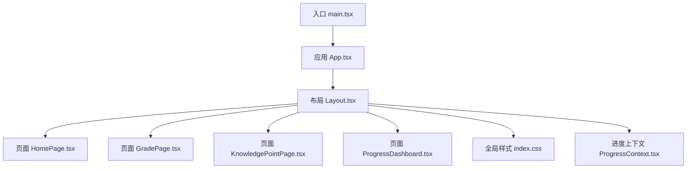
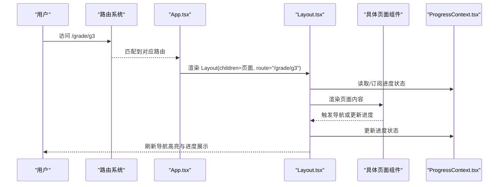
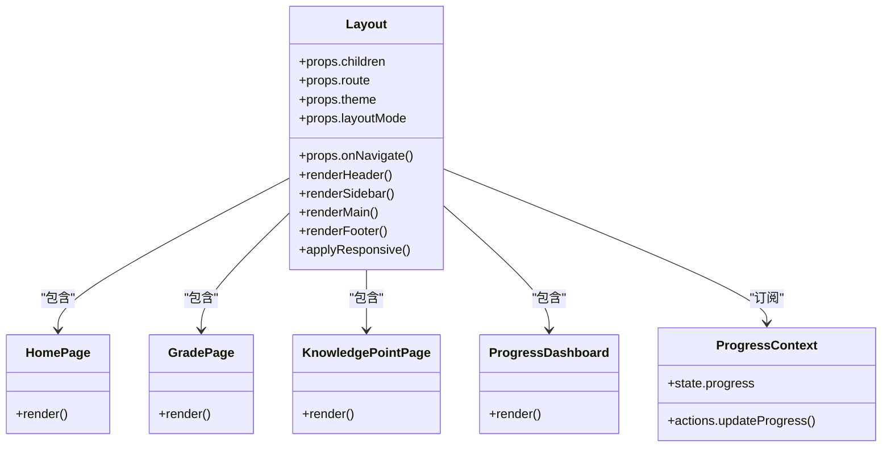
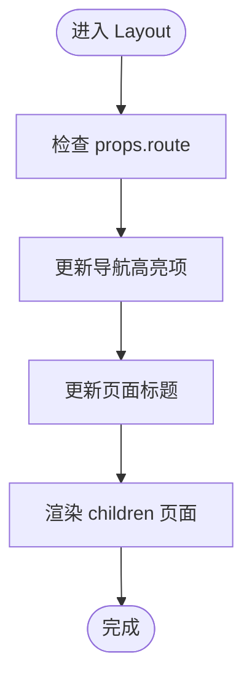
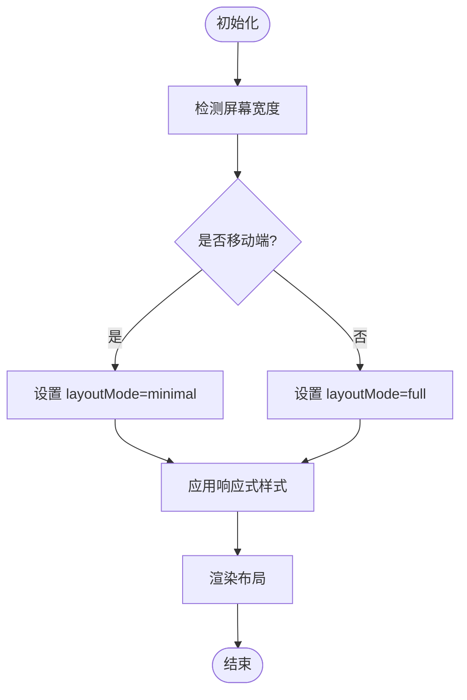
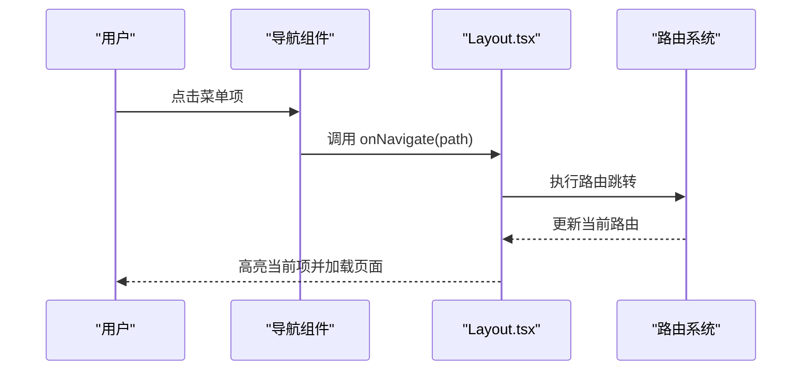
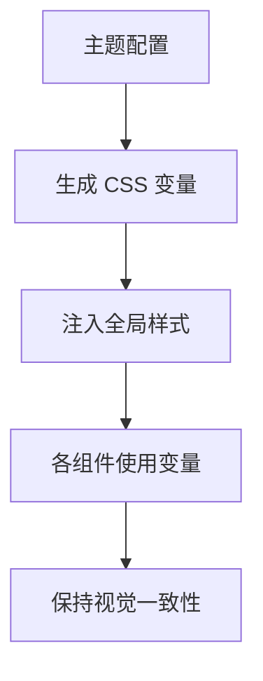
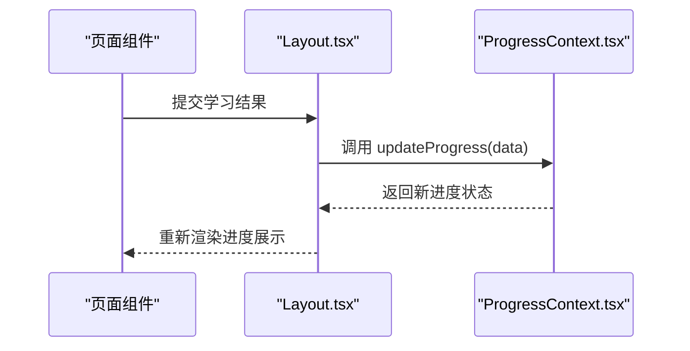
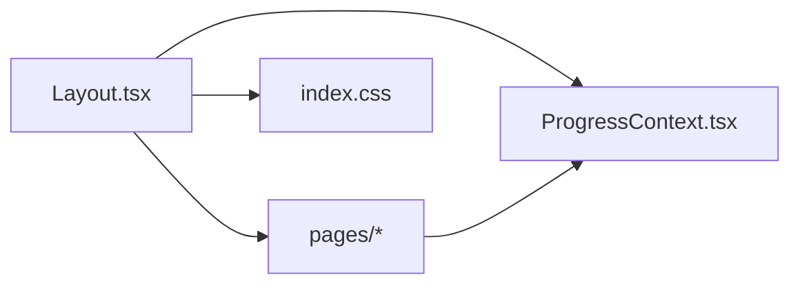

# Layout 布局组件

<cite>
**本文引用的文件**   
- [Layout.tsx](file://src/components/Layout.tsx)
- [App.tsx](file://src/App.tsx)
- [main.tsx](file://src/main.tsx)
- [index.css](file://src/index.css)
- [HomePage.tsx](file://src/pages/HomePage.tsx)
- [GradePage.tsx](file://src/pages/GradePage.tsx)
- [KnowledgePointPage.tsx](file://src/pages/KnowledgePointPage.tsx)
- [ProgressDashboard.tsx](file://src/pages/ProgressDashboard.tsx)
- [ProgressContext.tsx](file://src/context/ProgressContext.tsx)
</cite>

## 目录
1. [简介](#简介)
2. [项目结构](#项目结构)
3. [核心组件](#核心组件)
4. [架构总览](#架构总览)
5. [详细组件分析](#详细组件分析)
6. [依赖关系分析](#依赖关系分析)
7. [性能考量](#性能考量)
8. [故障排查指南](#故障排查指南)
9. [结论](#结论)
10. [附录](#附录)

## 简介
本技术文档围绕 Layout 布局组件展开，系统阐述其在数学学习应用中的容器模式设计、页面结构组织、响应式布局实现、导航系统集成与全局样式管理。同时，详细说明 Props 接口设计、children 渲染机制、路由变化处理、用户状态同步策略以及性能优化手段，并提供扩展新页面类型的实践方法。

## 项目结构
本项目采用基于功能分层的组织方式：
- 组件层：通用 UI 组件（如 Layout）与业务组件（如游戏、可视化图表）分离
- 页面层：按页面职责划分（首页、年级页、知识点页、进度看板）
- 上下文层：全局状态（学习进度）通过 Context 提供
- 资源层：样式与静态资源集中管理

**图示来源**
- [main.tsx](file://src/main.tsx)
- [App.tsx](file://src/App.tsx)
- [Layout.tsx](file://src/components/Layout.tsx)
- [HomePage.tsx](file://src/pages/HomePage.tsx)
- [GradePage.tsx](file://src/pages/GradePage.tsx)
- [KnowledgePointPage.tsx](file://src/pages/KnowledgePointPage.tsx)
- [ProgressDashboard.tsx](file://src/pages/ProgressDashboard.tsx)
- [index.css](file://src/index.css)
- [ProgressContext.tsx](file://src/context/ProgressContext.tsx)

**章节来源**
- [main.tsx](file://src/main.tsx)
- [App.tsx](file://src/App.tsx)
- [Layout.tsx](file://src/components/Layout.tsx)

## 核心组件
Layout 作为应用的根容器，承担以下职责：
- 统一页面骨架：头部导航、侧边栏（可选）、主内容区、底部信息
- 响应式适配：根据屏幕尺寸切换布局模式（桌面/平板/手机）
- 导航集成：与路由联动，高亮当前页面并支持跳转
- 全局样式注入：主题、间距、排版等基础样式由布局统一管理
- 状态同步：与进度上下文集成，实时更新学习进度展示

Props 接口设计要点：
- children：用于注入具体页面内容
- route：当前路由路径，用于导航高亮与条件渲染
- theme：主题配置（颜色、字体、间距等）
- layoutMode：布局模式（full、sidebar、minimal 等）
- onNavigate：导航回调，供子组件触发页面跳转

**章节来源**
- [Layout.tsx](file://src/components/Layout.tsx)

## 架构总览
Layout 在应用中处于“容器”位置，负责组合页面与全局能力。其典型交互流程如下：

**图示来源**
- [App.tsx](file://src/App.tsx)
- [Layout.tsx](file://src/components/Layout.tsx)
- [ProgressContext.tsx](file://src/context/ProgressContext.tsx)

## 详细组件分析

### Layout 组件类图
Layout 通过组合多个子模块形成完整布局，下图展示了其与页面、上下文和样式的关系。

**图示来源**
- [Layout.tsx](file://src/components/Layout.tsx)
- [HomePage.tsx](file://src/pages/HomePage.tsx)
- [GradePage.tsx](file://src/pages/GradePage.tsx)
- [KnowledgePointPage.tsx](file://src/pages/KnowledgePointPage.tsx)
- [ProgressDashboard.tsx](file://src/pages/ProgressDashboard.tsx)
- [ProgressContext.tsx](file://src/context/ProgressContext.tsx)

**章节来源**
- [Layout.tsx](file://src/components/Layout.tsx)
- [HomePage.tsx](file://src/pages/HomePage.tsx)
- [GradePage.tsx](file://src/pages/GradePage.tsx)
- [KnowledgePointPage.tsx](file://src/pages/KnowledgePointPage.tsx)
- [ProgressDashboard.tsx](file://src/pages/ProgressDashboard.tsx)
- [ProgressContext.tsx](file://src/context/ProgressContext.tsx)

### 路由变化处理流程
Layout 监听路由变化以更新导航高亮与页面标题，确保用户体验一致。

**图示来源**
- [Layout.tsx](file://src/components/Layout.tsx)
- [App.tsx](file://src/App.tsx)

**章节来源**
- [Layout.tsx](file://src/components/Layout.tsx)
- [App.tsx](file://src/App.tsx)

### 响应式布局实现
Layout 根据屏幕宽度动态切换布局模式，保证在不同设备上均有良好体验。

**图示来源**
- [Layout.tsx](file://src/components/Layout.tsx)
- [index.css](file://src/index.css)

**章节来源**
- [Layout.tsx](file://src/components/Layout.tsx)
- [index.css](file://src/index.css)

### 导航系统集成
Layout 将导航数据与路由结合，提供统一的导航入口。

**图示来源**
- [Layout.tsx](file://src/components/Layout.tsx)
- [App.tsx](file://src/App.tsx)

**章节来源**
- [Layout.tsx](file://src/components/Layout.tsx)
- [App.tsx](file://src/App.tsx)

### 全局样式管理
Layout 通过 CSS 变量与主题配置统一管理全局样式，确保一致性。

**图示来源**
- [Layout.tsx](file://src/components/Layout.tsx)
- [index.css](file://src/index.css)

**章节来源**
- [Layout.tsx](file://src/components/Layout.tsx)
- [index.css](file://src/index.css)

### 用户状态同步
Layout 与进度上下文集成，实时同步学习进度。

**图示来源**
- [Layout.tsx](file://src/components/Layout.tsx)
- [ProgressContext.tsx](file://src/context/ProgressContext.tsx)

**章节来源**
- [Layout.tsx](file://src/components/Layout.tsx)
- [ProgressContext.tsx](file://src/context/ProgressContext.tsx)

## 依赖关系分析
Layout 的依赖关系清晰，主要依赖页面组件、上下文与样式资源。

**图示来源**
- [Layout.tsx](file://src/components/Layout.tsx)
- [HomePage.tsx](file://src/pages/HomePage.tsx)
- [GradePage.tsx](file://src/pages/GradePage.tsx)
- [KnowledgePointPage.tsx](file://src/pages/KnowledgePointPage.tsx)
- [ProgressDashboard.tsx](file://src/pages/ProgressDashboard.tsx)
- [ProgressContext.tsx](file://src/context/ProgressContext.tsx)
- [index.css](file://src/index.css)

**章节来源**
- [Layout.tsx](file://src/components/Layout.tsx)
- [ProgressContext.tsx](file://src/context/ProgressContext.tsx)

## 性能考量
- 懒加载页面：按需加载页面组件，减少初始包体积
- 状态提升：将频繁更新的进度状态提升到 Context，避免重复渲染
- 样式优化：使用 CSS 变量与媒体查询，减少运行时计算
- 事件节流：导航与滚动事件进行节流处理，提升流畅度
- 内存管理：及时清理事件监听器与定时器，防止内存泄漏

[本节为通用指导，无需特定文件引用]

## 故障排查指南
常见问题与解决方案：
- 路由不更新：检查路由配置与 Layout 的 route 属性传递
- 样式错乱：确认 CSS 变量是否正确注入，检查媒体查询断点
- 状态不同步：验证 Context 的提供者与消费者是否正确连接
- 导航失效：检查 onNavigate 回调是否被正确调用
- 性能问题：使用浏览器性能面板分析重渲染与长任务

**章节来源**
- [Layout.tsx](file://src/components/Layout.tsx)
- [ProgressContext.tsx](file://src/context/ProgressContext.tsx)

## 结论
Layout 布局组件作为应用的容器核心，通过清晰的职责划分与良好的设计模式，实现了页面结构组织、响应式适配、导航集成与全局样式管理的统一。其 Props 接口设计灵活，children 渲染机制简洁，与上下文和路由系统的集成紧密，为扩展新页面类型提供了坚实基础。

[本节为总结性内容，无需特定文件引用]

## 附录

### 扩展新页面类型的步骤
1. 创建新的页面组件（如 NewPage.tsx）
2. 在路由配置中添加新页面的路由映射
3. 在 Layout 的导航数据中注册新页面
4. 根据需要调整布局模式与样式
5. 测试响应式效果与导航功能

**章节来源**
- [Layout.tsx](file://src/components/Layout.tsx)
- [App.tsx](file://src/App.tsx)

### 最佳实践建议
- 保持 Layout 的职责单一，专注于布局与容器功能
- 使用 TypeScript 定义严格的 Props 接口
- 遵循响应式设计原则，优先移动端体验
- 合理拆分组件，提高可复用性与可维护性
- 添加适当的错误边界与加载状态

[本节为通用指导，无需特定文件引用]