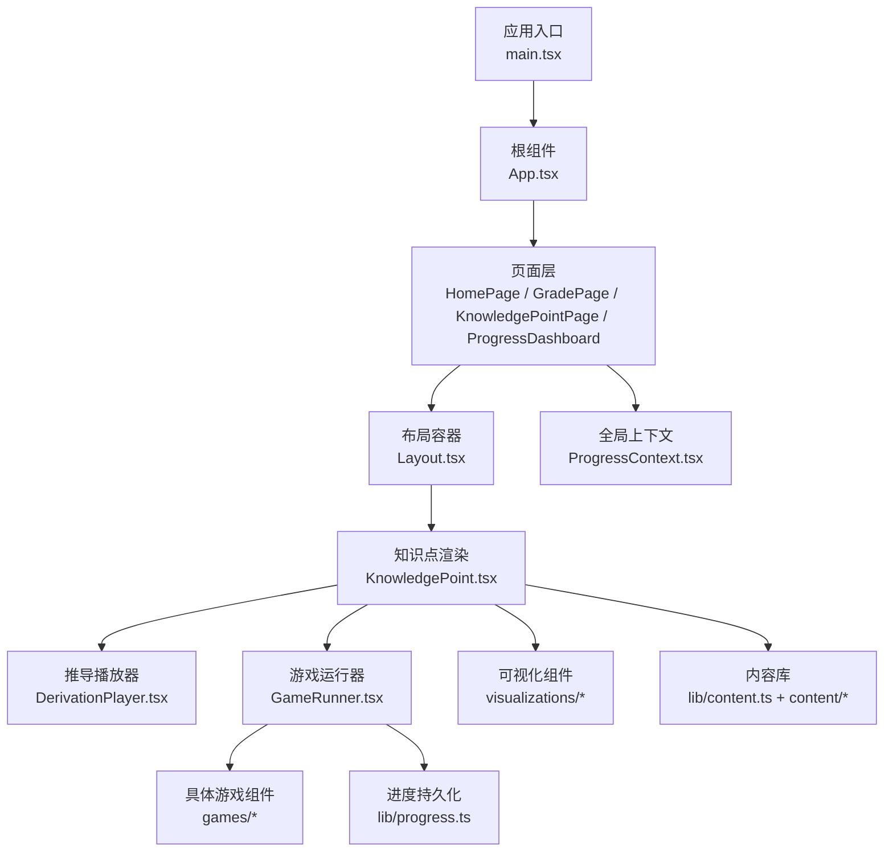
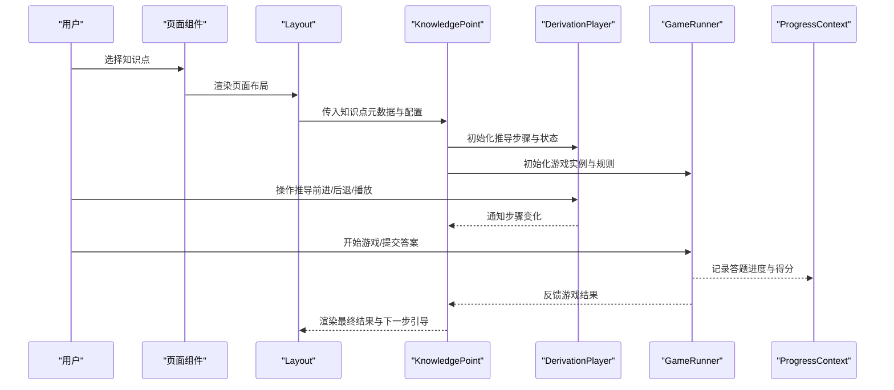
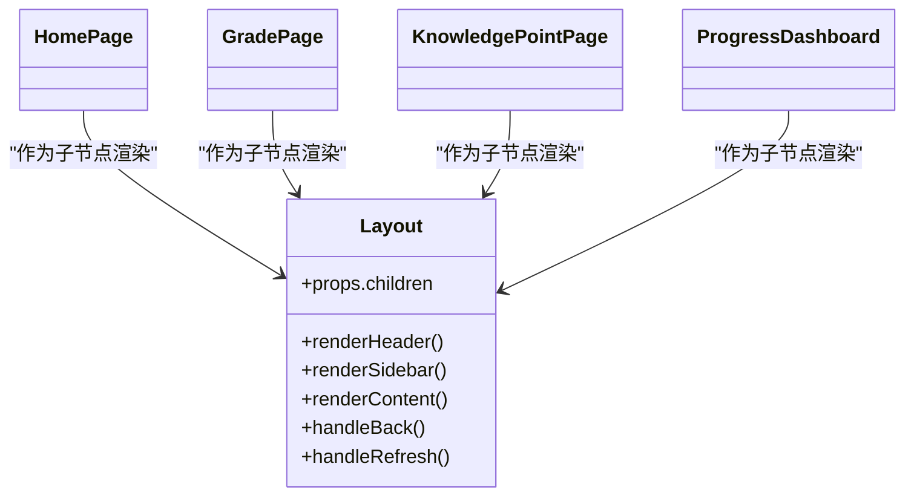
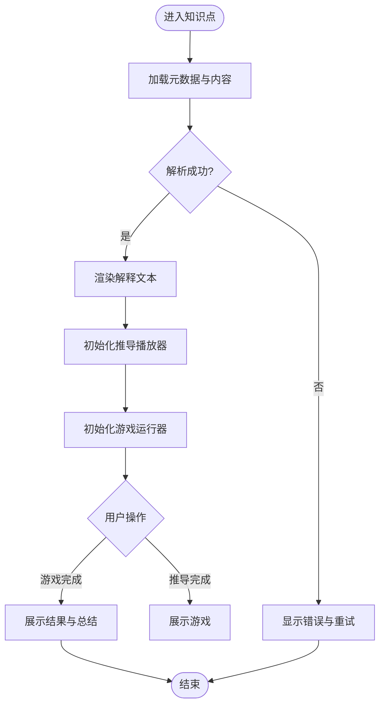
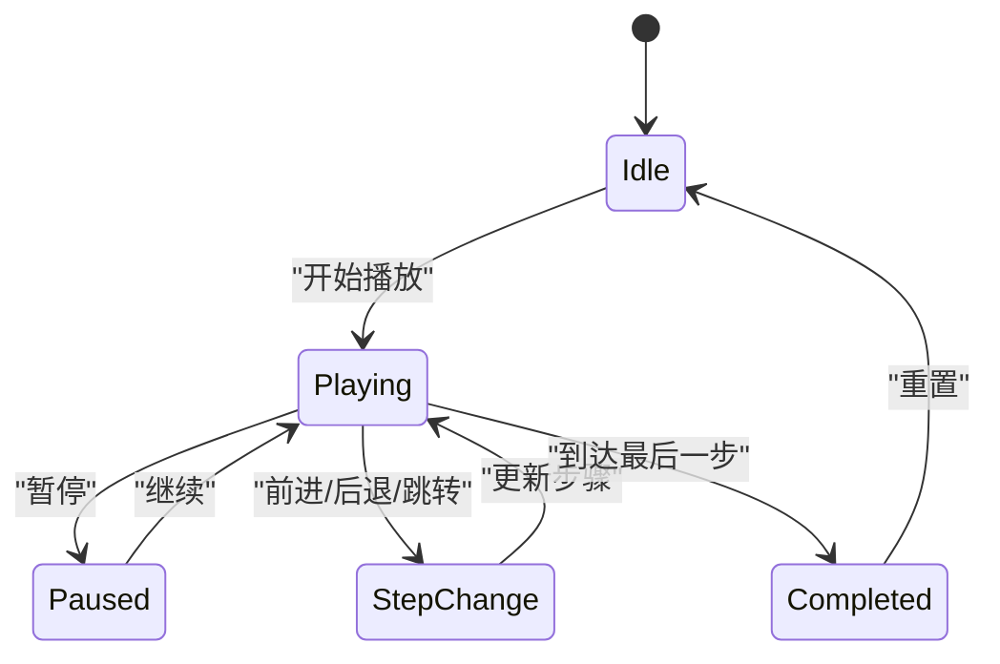
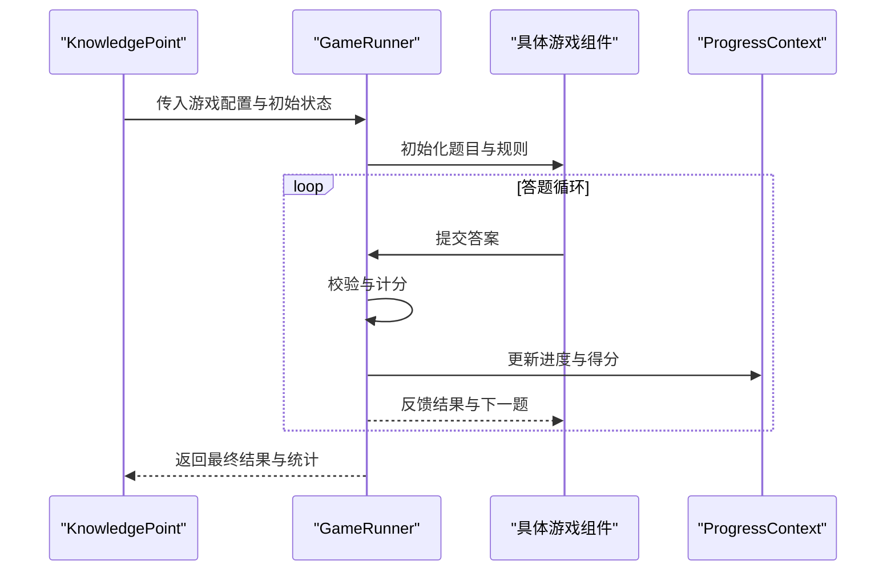
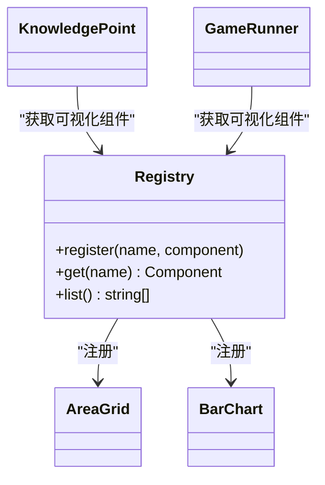
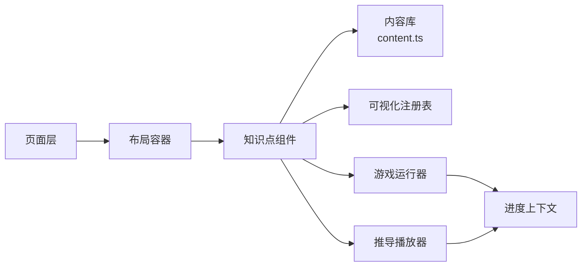

# 组件架构

<cite>
**本文引用的文件**   
- [App.tsx](file://src/App.tsx)
- [main.tsx](file://src/main.tsx)
- [Layout.tsx](file://src/components/Layout.tsx)
- [KnowledgePoint.tsx](file://src/components/KnowledgePoint.tsx)
- [DerivationPlayer.tsx](file://src/components/DerivationPlayer.tsx)
- [GameRunner.tsx](file://src/components/GameRunner.tsx)
- [ProgressContext.tsx](file://src/context/ProgressContext.tsx)
- [content.ts](file://src/lib/content.ts)
- [progress.ts](file://src/lib/progress.ts)
- [types.ts](file://src/lib/types.ts)
- [HomePage.tsx](file://src/pages/HomePage.tsx)
- [GradePage.tsx](file://src/pages/GradePage.tsx)
- [KnowledgePointPage.tsx](file://src/pages/KnowledgePointPage.tsx)
- [ProgressDashboard.tsx](file://src/pages/ProgressDashboard.tsx)
- [index.json](file://src/content/index.json)
- [AreaGrid.tsx](file://src/visualizations/AreaGrid.tsx)
- [BarChart.tsx](file://src/visualizations/BarChart.tsx)
- [registry.tsx](file://src/visualizations/registry.tsx)
</cite>

## 目录
1. [简介](#简介)
2. [项目结构](#项目结构)
3. [核心组件](#核心组件)
4. [架构总览](#架构总览)
5. [详细组件分析](#详细组件分析)
6. [依赖关系分析](#依赖关系分析)
7. [性能考虑](#性能考虑)
8. [故障排查指南](#故障排查指南)
9. [结论](#结论)
10. [附录](#附录)

## 简介
本文件为 math-k6 项目的组件架构文档，聚焦 React 组件化设计模式、组件层次与职责分离。重点阐述：
- Layout 布局组件的容器模式
- KnowledgePoint 知识点组件的内容渲染机制
- DerivationPlayer 推导播放器的状态管理
- GameRunner 游戏运行器的调度逻辑
同时说明组件间通信（Props、Context、事件）、复用策略与组合模式应用，并给出生命周期管理、性能优化与错误处理策略，以及组件关系图和数据流向图。

## 项目结构
项目采用按功能域划分的目录组织：
- src/components：核心业务组件（Layout、KnowledgePoint、DerivationPlayer、GameRunner）及 games 子模块
- src/pages：页面级路由入口（首页、年级页、知识点页、进度看板）
- src/context：全局上下文（学习进度）
- src/lib：内容加载、进度存储与类型定义
- src/visualizations：可视化图表与教具模型，供知识点与游戏复用
- src/content：知识点元数据与资源（explain.md、derivation.json、game.json、meta.json）

**图示来源** 
- [main.tsx](file://src/main.tsx)
- [App.tsx](file://src/App.tsx)
- [HomePage.tsx](file://src/pages/HomePage.tsx)
- [GradePage.tsx](file://src/pages/GradePage.tsx)
- [KnowledgePointPage.tsx](file://src/pages/KnowledgePointPage.tsx)
- [ProgressDashboard.tsx](file://src/pages/ProgressDashboard.tsx)
- [Layout.tsx](file://src/components/Layout.tsx)
- [KnowledgePoint.tsx](file://src/components/KnowledgePoint.tsx)
- [DerivationPlayer.tsx](file://src/components/DerivationPlayer.tsx)
- [GameRunner.tsx](file://src/components/GameRunner.tsx)
- [ProgressContext.tsx](file://src/context/ProgressContext.tsx)
- [content.ts](file://src/lib/content.ts)
- [progress.ts](file://src/lib/progress.ts)

**章节来源**
- [main.tsx](file://src/main.tsx)
- [App.tsx](file://src/App.tsx)
- [HomePage.tsx](file://src/pages/HomePage.tsx)
- [GradePage.tsx](file://src/pages/GradePage.tsx)
- [KnowledgePointPage.tsx](file://src/pages/KnowledgePointPage.tsx)
- [ProgressDashboard.tsx](file://src/pages/ProgressDashboard.tsx)

## 核心组件
- Layout 布局容器：负责页面骨架、导航与区域划分，以“容器模式”聚合子视图，统一样式与交互框架。
- KnowledgePoint 知识点：根据元数据与解释文本动态渲染知识点内容，协调推导与游戏两个子模块。
- DerivationPlayer 推导播放器：管理推导步骤的状态机（当前步、前进/后退、自动播放、暂停），驱动可视化更新。
- GameRunner 游戏运行器：封装游戏生命周期（初始化、开始、答题校验、结果统计、重试/完成），与进度系统联动。

**章节来源**
- [Layout.tsx](file://src/components/Layout.tsx)
- [KnowledgePoint.tsx](file://src/components/KnowledgePoint.tsx)
- [DerivationPlayer.tsx](file://src/components/DerivationPlayer.tsx)
- [GameRunner.tsx](file://src/components/GameRunner.tsx)

## 架构总览
整体采用“页面-布局-内容-交互”的分层架构：
- 页面层负责路由与数据装配
- 布局层提供统一的容器与导航
- 内容层（知识点）组合推导与游戏
- 交互层（播放器与运行器）管理各自状态并与进度上下文同步

**图示来源** 
- [KnowledgePoint.tsx](file://src/components/KnowledgePoint.tsx)
- [DerivationPlayer.tsx](file://src/components/DerivationPlayer.tsx)
- [GameRunner.tsx](file://src/components/GameRunner.tsx)
- [ProgressContext.tsx](file://src/context/ProgressContext.tsx)

## 详细组件分析

### Layout 布局组件（容器模式）
- 职责：提供页面外壳、顶部导航、侧边栏或主内容区占位；承载页面级状态（如主题、语言、导航路径）。
- 容器模式：通过 props.children 注入不同页面内容，保持布局稳定，降低耦合。
- 通信方式：接收页面层传递的路由参数与用户偏好；向子组件派发通用事件（如返回、刷新）。
- 生命周期：在挂载时初始化全局监听（如键盘快捷键、窗口尺寸变化），卸载时清理。
- 性能：使用 React.memo 包裹静态区域，避免不必要的重渲染。

**图示来源** 
- [Layout.tsx](file://src/components/Layout.tsx)
- [HomePage.tsx](file://src/pages/HomePage.tsx)
- [GradePage.tsx](file://src/pages/GradePage.tsx)
- [KnowledgePointPage.tsx](file://src/pages/KnowledgePointPage.tsx)
- [ProgressDashboard.tsx](file://src/pages/ProgressDashboard.tsx)

**章节来源**
- [Layout.tsx](file://src/components/Layout.tsx)

### KnowledgePoint 知识点组件（内容渲染机制）
- 数据来源：从 lib/content.ts 读取 index.json 与各知识点的 explain.md、derivation.json、game.json、meta.json。
- 渲染流程：解析元数据 -> 渲染解释文本 -> 渲染推导播放器 -> 渲染游戏运行器 -> 汇总结果。
- 组合模式：将推导与游戏作为可插拔子模块，便于扩展新的知识点形式。
- 通信方式：通过 props 向下传递配置，通过回调函数向上汇报状态（如推导完成、游戏通关）。
- 错误处理：对缺失文件或格式异常进行降级展示与提示。

**图示来源** 
- [KnowledgePoint.tsx](file://src/components/KnowledgePoint.tsx)
- [content.ts](file://src/lib/content.ts)
- [index.json](file://src/content/index.json)

**章节来源**
- [KnowledgePoint.tsx](file://src/components/KnowledgePoint.tsx)
- [content.ts](file://src/lib/content.ts)
- [index.json](file://src/content/index.json)

### DerivationPlayer 推导播放器（状态管理）
- 状态模型：步骤列表、当前索引、播放状态（播放/暂停）、计时器、动画进度。
- 状态机：支持前进、后退、跳转到指定步骤、自动播放与暂停。
- 副作用：在步骤切换时触发可视化更新与进度上报。
- 性能：使用 useMemo/useCallback 缓存步骤计算与回调；必要时使用节流/防抖控制高频更新。
- 错误处理：对无效步骤索引与空数据进行保护性检查。

**图示来源** 
- [DerivationPlayer.tsx](file://src/components/DerivationPlayer.tsx)

**章节来源**
- [DerivationPlayer.tsx](file://src/components/DerivationPlayer.tsx)

### GameRunner 游戏运行器（调度逻辑）
- 生命周期：初始化 -> 开始 -> 答题循环 -> 校验 -> 统计 -> 完成/重试。
- 调度策略：根据 game.json 的规则生成题目、判定答案、累计得分与正确率。
- 集成点：与 ProgressContext 同步学习进度；与可视化组件交互呈现反馈。
- 错误处理：对非法输入、超时、网络失败等进行回退与提示。

**图示来源** 
- [GameRunner.tsx](file://src/components/GameRunner.tsx)
- [ProgressContext.tsx](file://src/context/ProgressContext.tsx)

**章节来源**
- [GameRunner.tsx](file://src/components/GameRunner.tsx)
- [ProgressContext.tsx](file://src/context/ProgressContext.tsx)

### 可视化组件与注册表
- 可视化组件：如 AreaGrid、BarChart 等，用于数学概念的直观表达。
- 注册表：集中管理可视化组件名称与实现，供知识点与游戏按需调用。
- 复用策略：通过统一接口暴露渲染方法，便于在不同上下文中复用。

**图示来源** 
- [registry.tsx](file://src/visualizations/registry.tsx)
- [AreaGrid.tsx](file://src/visualizations/AreaGrid.tsx)
- [BarChart.tsx](file://src/visualizations/BarChart.tsx)
- [KnowledgePoint.tsx](file://src/components/KnowledgePoint.tsx)
- [GameRunner.tsx](file://src/components/GameRunner.tsx)

**章节来源**
- [registry.tsx](file://src/visualizations/registry.tsx)
- [AreaGrid.tsx](file://src/visualizations/AreaGrid.tsx)
- [BarChart.tsx](file://src/visualizations/BarChart.tsx)

## 依赖关系分析
- 页面到布局：页面组件作为 Layout 的子节点渲染，共享布局能力。
- 知识点到内容与可视化：KnowledgePoint 依赖 content.ts 与 visualization registry。
- 播放器与运行器：各自独立管理状态，通过 KnowledgePoint 协调。
- 进度上下文：全局共享学习进度，被运行器与播放器写入，页面层读取。

**图示来源** 
- [HomePage.tsx](file://src/pages/HomePage.tsx)
- [GradePage.tsx](file://src/pages/GradePage.tsx)
- [KnowledgePointPage.tsx](file://src/pages/KnowledgePointPage.tsx)
- [Layout.tsx](file://src/components/Layout.tsx)
- [KnowledgePoint.tsx](file://src/components/KnowledgePoint.tsx)
- [content.ts](file://src/lib/content.ts)
- [registry.tsx](file://src/visualizations/registry.tsx)
- [DerivationPlayer.tsx](file://src/components/DerivationPlayer.tsx)
- [GameRunner.tsx](file://src/components/GameRunner.tsx)
- [ProgressContext.tsx](file://src/context/ProgressContext.tsx)

**章节来源**
- [content.ts](file://src/lib/content.ts)
- [progress.ts](file://src/lib/progress.ts)
- [types.ts](file://src/lib/types.ts)

## 性能考虑
- 组件粒度：将频繁更新的子组件（如播放器步骤、游戏计时）拆分为独立组件并使用 React.memo。
- 状态提升：仅在必要层级提升状态，避免深层重渲染。
- 计算缓存：使用 useMemo 缓存复杂计算（如步骤序列、题目生成），useCallback 缓存事件处理器。
- 懒加载：对大型可视化组件与游戏资源进行按需加载。
- 渲染优化：避免在 render 中创建新对象或函数；合理使用 key 提升列表渲染性能。
- 内存管理：在 useEffect 中清理定时器与事件监听，防止泄漏。

[本节为通用指导，不直接分析具体文件]

## 故障排查指南
- 内容加载失败：检查 content.ts 的解析逻辑与 index.json 格式；对缺失字段进行降级处理。
- 推导步骤异常：验证步骤索引边界与数据结构；确保步骤切换时状态一致性。
- 游戏运行异常：核对 game.json 规则与输入校验；捕获非法输入并提示用户。
- 进度不同步：确认 ProgressContext 的写入与读取路径；避免并发更新导致竞态。
- 可视化渲染问题：检查 registry 注册名与组件导出；确保接口一致。

**章节来源**
- [content.ts](file://src/lib/content.ts)
- [progress.ts](file://src/lib/progress.ts)
- [types.ts](file://src/lib/types.ts)

## 结论
math-k6 的组件架构以清晰的职责分离与组合模式为核心，Layout 提供稳定容器，KnowledgePoint 整合内容与交互，DerivationPlayer 与 GameRunner 分别管理推导与游戏的状态与调度。通过 Context 共享进度、通过 Props 与事件进行组件通信，结合可视化注册表实现高内聚低耦合。遵循上述生命周期管理、性能优化与错误处理策略，可进一步提升系统的可维护性与用户体验。

[本节为总结，不直接分析具体文件]

## 附录
- 组件通信方式
  - Props：父子组件间的数据与回调传递
  - Context：全局状态（进度）共享
  - 事件：子组件向父组件上报行为（如完成、错误）
- 复用策略
  - 组合模式：将推导与游戏作为可插拔模块
  - 注册表：可视化组件的统一接入与按需使用
- 最佳实践
  - 单一职责：每个组件只关注一个领域
  - 不可变数据：减少副作用与状态漂移
  - 渐进增强：先保证基础功能，再叠加高级特性

[本节为概念性内容，不直接分析具体文件]