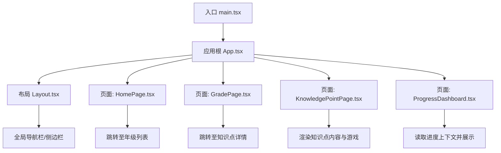
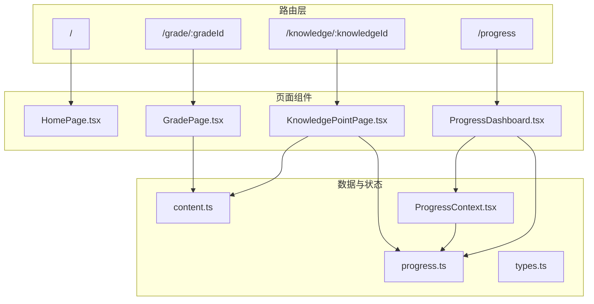
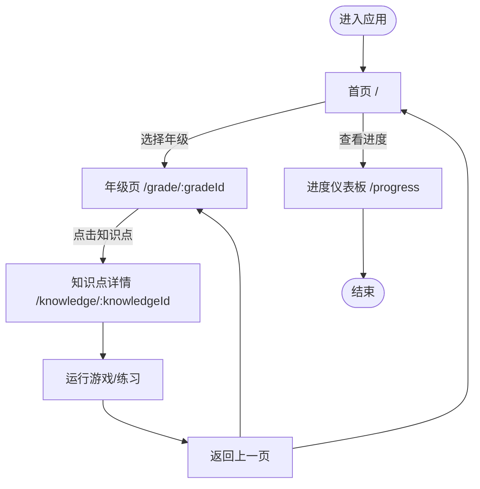
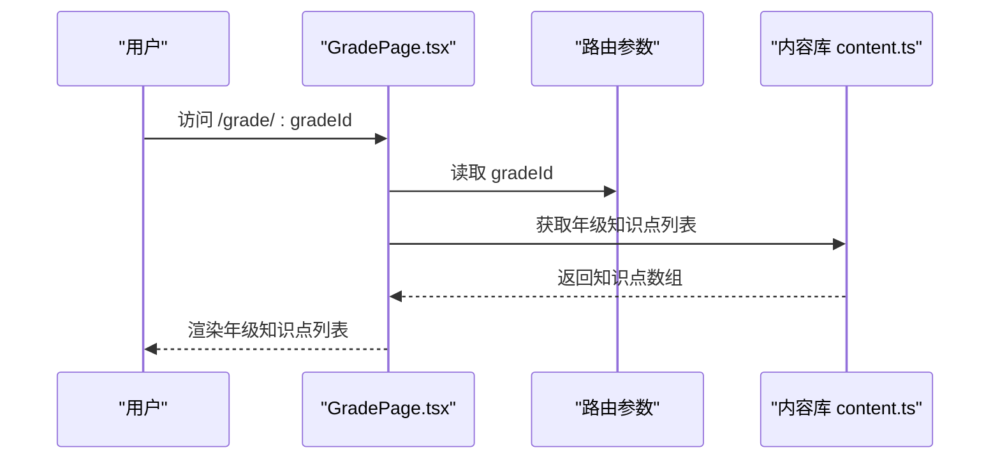
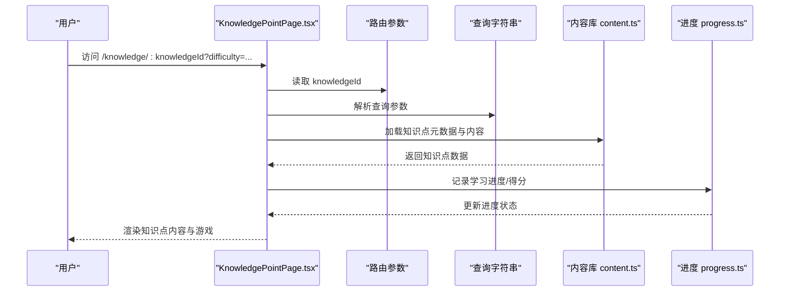
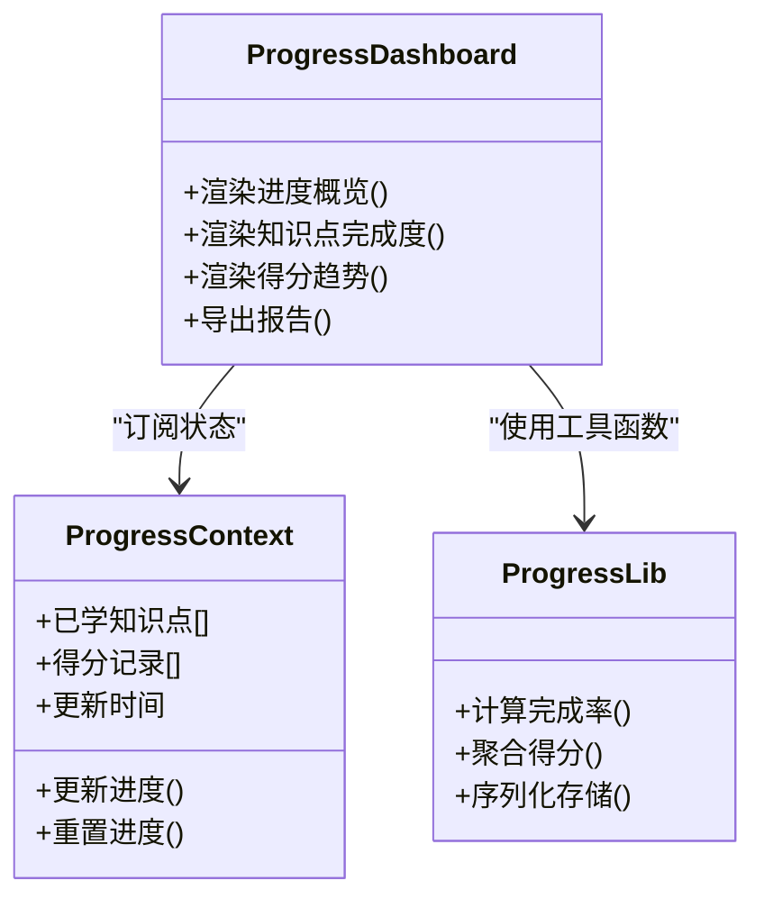
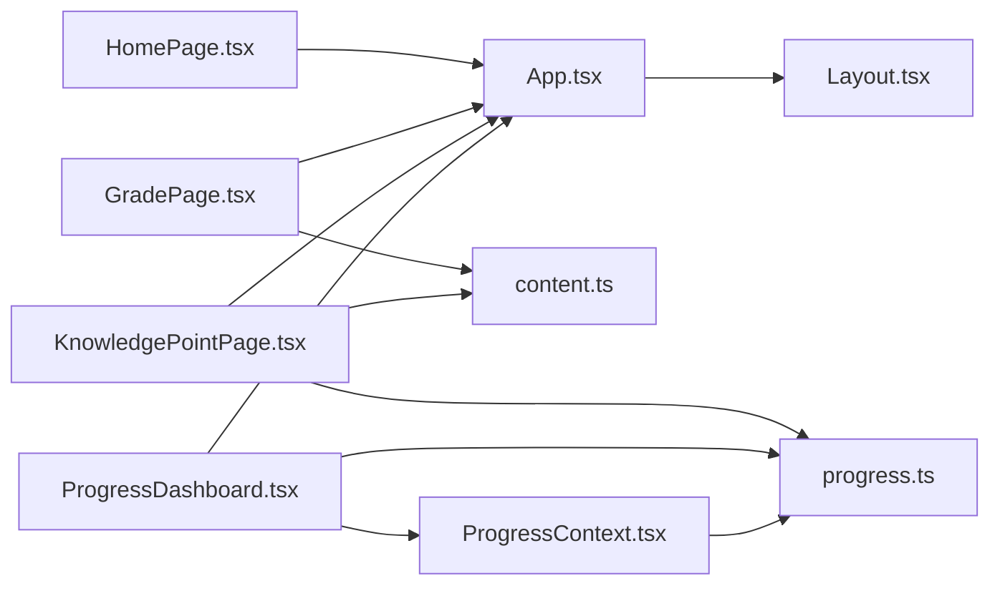
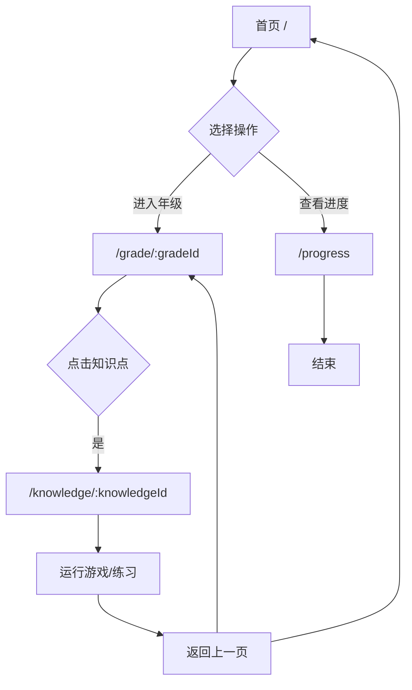

# 路由导航

<cite>
**本文引用的文件**   
- [App.tsx](file://src/App.tsx)
- [main.tsx](file://src/main.tsx)
- [HomePage.tsx](file://src/pages/HomePage.tsx)
- [GradePage.tsx](file://src/pages/GradePage.tsx)
- [KnowledgePointPage.tsx](file://src/pages/KnowledgePointPage.tsx)
- [ProgressDashboard.tsx](file://src/pages/ProgressDashboard.tsx)
- [Layout.tsx](file://src/components/Layout.tsx)
- [ProgressContext.tsx](file://src/context/ProgressContext.tsx)
- [content.ts](file://src/lib/content.ts)
- [progress.ts](file://src/lib/progress.ts)
- [types.ts](file://src/lib/types.ts)
</cite>

## 目录
1. [简介](#简介)
2. [项目结构](#项目结构)
3. [核心组件](#核心组件)
4. [架构总览](#架构总览)
5. [详细组件分析](#详细组件分析)
6. [依赖关系分析](#依赖关系分析)
7. [性能考虑](#性能考虑)
8. [故障排查指南](#故障排查指南)
9. [结论](#结论)
10. [附录](#附录)

## 简介
本文件为 math-k6 项目的“路由导航”文档，聚焦于应用的路由结构设计、页面组件组织与导航逻辑。内容涵盖：
- HomePage 首页入口设计
- GradePage 年级选择页面的层级结构
- KnowledgePointPage 知识点详情页面的动态路由
- ProgressDashboard 进度仪表板的数据绑定
- 路由参数传递、查询字符串处理与浏览器历史记录管理
- 导航守卫、权限控制与路由懒加载策略
- 响应式导航设计与移动端适配方案
- 路由映射表与导航流程图

## 项目结构
本项目采用基于 React 的前端工程，页面级组件位于 pages 目录，布局与通用 UI 在 components 目录，数据与类型定义在 lib 目录，上下文状态在 context 目录。路由相关代码集中在 App 与 main 入口文件中，页面组件通过路由框架进行挂载与切换。

图表来源
- [main.tsx](file://src/main.tsx)
- [App.tsx](file://src/App.tsx)
- [Layout.tsx](file://src/components/Layout.tsx)
- [HomePage.tsx](file://src/pages/HomePage.tsx)
- [GradePage.tsx](file://src/pages/GradePage.tsx)
- [KnowledgePointPage.tsx](file://src/pages/KnowledgePointPage.tsx)
- [ProgressDashboard.tsx](file://src/pages/ProgressDashboard.tsx)

章节来源
- [main.tsx](file://src/main.tsx)
- [App.tsx](file://src/App.tsx)

## 核心组件
- App.tsx：应用根组件，负责注册路由、挂载布局与页面组件，统一处理导航与全局状态初始化。
- Layout.tsx：页面布局容器，提供顶部导航、面包屑或侧边栏，承载子路由视图。
- HomePage.tsx：首页入口，引导用户进入年级选择或进度仪表板。
- GradePage.tsx：年级选择页，按年级维度组织知识点列表，支持跳转到具体知识点。
- KnowledgePointPage.tsx：知识点详情页，根据路由参数动态加载知识点元数据与内容，并运行对应游戏。
- ProgressDashboard.tsx：进度仪表板，从上下文读取学习进度并进行可视化展示。

章节来源
- [App.tsx](file://src/App.tsx)
- [Layout.tsx](file://src/components/Layout.tsx)
- [HomePage.tsx](file://src/pages/HomePage.tsx)
- [GradePage.tsx](file://src/pages/GradePage.tsx)
- [KnowledgePointPage.tsx](file://src/pages/KnowledgePointPage.tsx)
- [ProgressDashboard.tsx](file://src/pages/ProgressDashboard.tsx)

## 架构总览
下图展示了路由与页面组件的交互关系，以及数据流向（如进度上下文与内容库）。

图表来源
- [App.tsx](file://src/App.tsx)
- [HomePage.tsx](file://src/pages/HomePage.tsx)
- [GradePage.tsx](file://src/pages/GradePage.tsx)
- [KnowledgePointPage.tsx](file://src/pages/KnowledgePointPage.tsx)
- [ProgressDashboard.tsx](file://src/pages/ProgressDashboard.tsx)
- [ProgressContext.tsx](file://src/context/ProgressContext.tsx)
- [content.ts](file://src/lib/content.ts)
- [progress.ts](file://src/lib/progress.ts)
- [types.ts](file://src/lib/types.ts)

## 详细组件分析

### 路由结构与页面组织
- 路由根路径用于首页入口，提供年级选择与进度查看的快速通道。
- 年级路由以动态段标识年级，页面根据该 ID 筛选并展示对应知识点列表。
- 知识点路由以动态段标识知识点，页面根据该 ID 加载元数据、解释内容与游戏配置。
- 进度仪表板路由独立存在，集中展示学习进度与统计。

章节来源
- [App.tsx](file://src/App.tsx)
- [HomePage.tsx](file://src/pages/HomePage.tsx)
- [GradePage.tsx](file://src/pages/GradePage.tsx)
- [KnowledgePointPage.tsx](file://src/pages/KnowledgePointPage.tsx)
- [ProgressDashboard.tsx](file://src/pages/ProgressDashboard.tsx)

### HomePage 首页入口设计
- 作为应用入口，提供“开始学习”“查看进度”等关键入口按钮。
- 支持通过查询字符串携带初始意图（例如默认年级或推荐知识点），在首次渲染时解析并自动跳转。
- 与布局组件集成，确保导航栏与面包屑一致。

章节来源
- [HomePage.tsx](file://src/pages/HomePage.tsx)
- [Layout.tsx](file://src/components/Layout.tsx)

### GradePage 年级选择页面的层级结构
- 接收路由参数 gradeId，用于筛选当前年级的知识点集合。
- 列表项包含知识点标题、难度标签与简要说明，点击后跳转到对应知识点详情。
- 支持搜索与过滤（如按难度、主题），提升导航效率。

图表来源
- [GradePage.tsx](file://src/pages/GradePage.tsx)
- [content.ts](file://src/lib/content.ts)

章节来源
- [GradePage.tsx](file://src/pages/GradePage.tsx)
- [content.ts](file://src/lib/content.ts)

### KnowledgePointPage 知识点详情页面的动态路由
- 通过路由参数 knowledgeId 定位知识点，加载 meta.json 与 explain.md 等元数据与内容。
- 根据 game.json 配置启动相应游戏组件，完成练习与反馈。
- 支持查询字符串参数（如 difficulty、mode）影响渲染与行为。

图表来源
- [KnowledgePointPage.tsx](file://src/pages/KnowledgePointPage.tsx)
- [content.ts](file://src/lib/content.ts)
- [progress.ts](file://src/lib/progress.ts)

章节来源
- [KnowledgePointPage.tsx](file://src/pages/KnowledgePointPage.tsx)
- [content.ts](file://src/lib/content.ts)
- [progress.ts](file://src/lib/progress.ts)

### ProgressDashboard 进度仪表板的数据绑定
- 从 ProgressContext 读取全局学习进度，包括已完成知识点、得分与时间统计。
- 结合 progress.ts 提供的工具函数进行数据聚合与格式化。
- 支持刷新与导出功能，便于家长或教师查看学习情况。

图表来源
- [ProgressDashboard.tsx](file://src/pages/ProgressDashboard.tsx)
- [ProgressContext.tsx](file://src/context/ProgressContext.tsx)
- [progress.ts](file://src/lib/progress.ts)

章节来源
- [ProgressDashboard.tsx](file://src/pages/ProgressDashboard.tsx)
- [ProgressContext.tsx](file://src/context/ProgressContext.tsx)
- [progress.ts](file://src/lib/progress.ts)

### 路由参数传递、查询字符串与历史记录
- 路由参数：通过动态段（如 :gradeId、:knowledgeId）传递关键标识，页面组件直接读取。
- 查询字符串：用于附加可选参数（如难度、模式），在页面中解析并影响渲染与行为。
- 历史记录：利用浏览器历史 API 实现前进/后退与页面栈管理，保证导航体验连贯。

章节来源
- [HomePage.tsx](file://src/pages/HomePage.tsx)
- [GradePage.tsx](file://src/pages/GradePage.tsx)
- [KnowledgePointPage.tsx](file://src/pages/KnowledgePointPage.tsx)
- [ProgressDashboard.tsx](file://src/pages/ProgressDashboard.tsx)

### 导航守卫、权限控制与路由懒加载
- 导航守卫：在路由切换前校验登录态或学习权限，未授权时重定向到登录或提示页。
- 权限控制：针对特定页面或功能（如高级练习）进行角色或等级检查。
- 路由懒加载：按需加载页面组件，减少首屏体积，提升加载速度。

章节来源
- [App.tsx](file://src/App.tsx)
- [Layout.tsx](file://src/components/Layout.tsx)

### 响应式导航设计与移动端适配
- 布局组件在不同屏幕尺寸下切换导航样式（顶部导航/侧边栏/抽屉菜单）。
- 触摸友好的交互元素与字号调整，提升移动端可用性。
- 键盘与无障碍支持，确保多设备一致性体验。

章节来源
- [Layout.tsx](file://src/components/Layout.tsx)

## 依赖关系分析
- 页面组件依赖内容库与进度库，分别负责知识点数据与学习进度。
- 上下文提供跨页面共享的状态，避免重复请求与状态不一致。
- 类型定义统一数据结构，保障前后端与组件间契约一致。

图表来源
- [App.tsx](file://src/App.tsx)
- [HomePage.tsx](file://src/pages/HomePage.tsx)
- [GradePage.tsx](file://src/pages/GradePage.tsx)
- [KnowledgePointPage.tsx](file://src/pages/KnowledgePointPage.tsx)
- [ProgressDashboard.tsx](file://src/pages/ProgressDashboard.tsx)
- [Layout.tsx](file://src/components/Layout.tsx)
- [ProgressContext.tsx](file://src/context/ProgressContext.tsx)
- [content.ts](file://src/lib/content.ts)
- [progress.ts](file://src/lib/progress.ts)

章节来源
- [App.tsx](file://src/App.tsx)
- [content.ts](file://src/lib/content.ts)
- [progress.ts](file://src/lib/progress.ts)
- [ProgressContext.tsx](file://src/context/ProgressContext.tsx)

## 性能考虑
- 路由懒加载：将页面组件拆分为独立模块，仅在访问时加载，降低首屏压力。
- 数据缓存：对知识点元数据与进度数据进行本地缓存，减少重复请求。
- 渲染优化：使用 memoization 与虚拟滚动技术，提升长列表渲染性能。
- 资源压缩：静态资源与图片进行压缩与懒加载，提高网络传输效率。

[本节为通用指导，不直接分析具体文件]

## 故障排查指南
- 路由无法匹配：检查动态段命名与页面组件注册是否一致。
- 查询字符串未生效：确认页面是否正确解析与使用查询参数。
- 进度不更新：检查上下文订阅与进度库调用是否正确。
- 导航异常：验证历史记录 API 的使用与浏览器兼容性。

章节来源
- [App.tsx](file://src/App.tsx)
- [ProgressContext.tsx](file://src/context/ProgressContext.tsx)
- [progress.ts](file://src/lib/progress.ts)

## 结论
math-k6 的路由导航以清晰的页面分层与数据流为基础，结合动态路由、查询字符串与上下文状态管理，实现了良好的用户体验与可维护性。通过懒加载、缓存与响应式设计，进一步提升了性能与适配能力。建议持续完善导航守卫与权限控制，确保安全性与可扩展性。

[本节为总结，不直接分析具体文件]

## 附录

### 路由映射表
- / → HomePage.tsx（首页入口）
- /grade/:gradeId → GradePage.tsx（年级选择）
- /knowledge/:knowledgeId → KnowledgePointPage.tsx（知识点详情）
- /progress → ProgressDashboard.tsx（进度仪表板）

章节来源
- [App.tsx](file://src/App.tsx)
- [HomePage.tsx](file://src/pages/HomePage.tsx)
- [GradePage.tsx](file://src/pages/GradePage.tsx)
- [KnowledgePointPage.tsx](file://src/pages/KnowledgePointPage.tsx)
- [ProgressDashboard.tsx](file://src/pages/ProgressDashboard.tsx)

### 导航流程图

图表来源
- [HomePage.tsx](file://src/pages/HomePage.tsx)
- [GradePage.tsx](file://src/pages/GradePage.tsx)
- [KnowledgePointPage.tsx](file://src/pages/KnowledgePointPage.tsx)
- [ProgressDashboard.tsx](file://src/pages/ProgressDashboard.tsx)