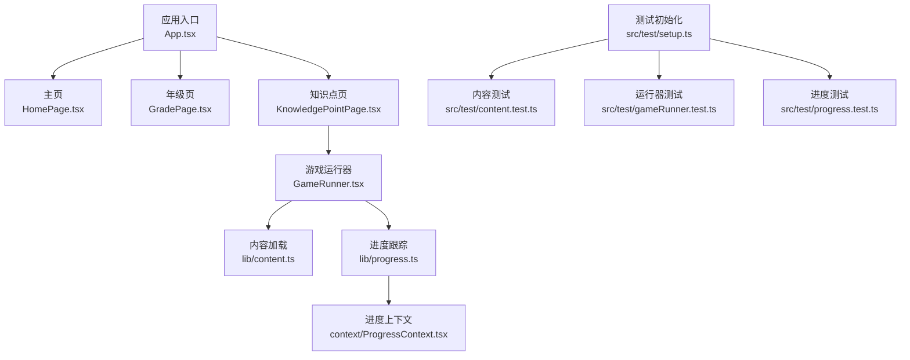
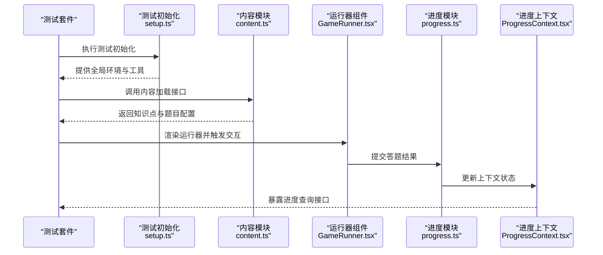
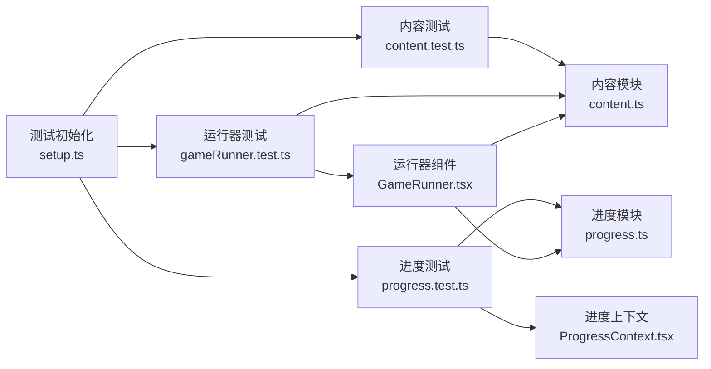

# 测试策略

<cite>
**本文引用的文件**   
- [package.json](file://package.json)
- [vite.config.ts](file://vite.config.ts)
- [src/test/setup.ts](file://src/test/setup.ts)
- [src/test/content.test.ts](file://src/test/content.test.ts)
- [src/test/gameRunner.test.ts](file://src/test/gameRunner.test.ts)
- [src/test/progress.test.ts](file://src/test/progress.test.ts)
- [src/lib/content.ts](file://src/lib/content.ts)
- [src/lib/progress.ts](file://src/lib/progress.ts)
- [src/components/GameRunner.tsx](file://src/components/GameRunner.tsx)
- [src/context/ProgressContext.tsx](file://src/context/ProgressContext.tsx)
- [src/pages/KnowledgePointPage.tsx](file://src/pages/KnowledgePointPage.tsx)
- [src/pages/GradePage.tsx](file://src/pages/GradePage.tsx)
- [src/pages/HomePage.tsx](file://src/pages/HomePage.tsx)
- [src/App.tsx](file://src/App.tsx)
- [index.html](file://index.html)
</cite>

## 目录
1. [简介](#简介)
2. [项目结构](#项目结构)
3. [核心组件](#核心组件)
4. [架构总览](#架构总览)
5. [详细组件分析](#详细组件分析)
6. [依赖分析](#依赖分析)
7. [性能考虑](#性能考虑)
8. [故障排查指南](#故障排查指南)
9. [结论](#结论)
10. [附录](#附录)

## 简介
本测试策略文档面向 math-k6 项目的测试体系建设，覆盖单元测试框架配置、测试环境搭建、用例编写规范、内容加载与游戏运行器测试、进度跟踪测试、组件测试策略、模拟数据与断言库使用、端到端测试方案、性能测试与兼容性测试、覆盖率要求、持续集成配置以及最佳实践与调试技巧。目标是帮助开发者快速建立稳定、可维护且高效的测试体系，保障知识内容与游戏化学习体验的质量。

## 项目结构
本项目采用 Vite + React + TypeScript 的前端工程结构，测试代码位于 src/test 目录，包含测试初始化与三类核心测试：内容加载、游戏运行器、进度跟踪。关键入口与上下文包括 App、页面组件、GameRunner 组件、ProgressContext 以及 lib 层的 content 与 progress 模块。

图表来源
- [src/App.tsx](file://src/App.tsx)
- [src/pages/HomePage.tsx](file://src/pages/HomePage.tsx)
- [src/pages/GradePage.tsx](file://src/pages/GradePage.tsx)
- [src/pages/KnowledgePointPage.tsx](file://src/pages/KnowledgePointPage.tsx)
- [src/components/GameRunner.tsx](file://src/components/GameRunner.tsx)
- [src/lib/content.ts](file://src/lib/content.ts)
- [src/lib/progress.ts](file://src/lib/progress.ts)
- [src/context/ProgressContext.tsx](file://src/context/ProgressContext.tsx)
- [src/test/setup.ts](file://src/test/setup.ts)
- [src/test/content.test.ts](file://src/test/content.test.ts)
- [src/test/gameRunner.test.ts](file://src/test/gameRunner.test.ts)
- [src/test/progress.test.ts](file://src/test/progress.test.ts)

章节来源
- [package.json](file://package.json)
- [vite.config.ts](file://vite.config.ts)
- [src/test/setup.ts](file://src/test/setup.ts)
- [src/test/content.test.ts](file://src/test/content.test.ts)
- [src/test/gameRunner.test.ts](file://src/test/gameRunner.test.ts)
- [src/test/progress.test.ts](file://src/test/progress.test.ts)

## 核心组件
- 内容加载（content.ts）：负责从静态资源或 API 加载知识点元数据与题目配置，提供统一的数据访问接口。
- 游戏运行器（GameRunner.tsx）：根据知识点配置动态渲染对应游戏组件，管理生命周期与交互事件。
- 进度跟踪（progress.ts + ProgressContext.tsx）：持久化用户答题进度与统计，通过 Context 在组件树中共享状态。
- 页面层（HomePage/GradePage/KnowledgePointPage）：组织导航与内容展示，驱动 GameRunner 与进度上下文。

章节来源
- [src/lib/content.ts](file://src/lib/content.ts)
- [src/components/GameRunner.tsx](file://src/components/GameRunner.tsx)
- [src/lib/progress.ts](file://src/lib/progress.ts)
- [src/context/ProgressContext.tsx](file://src/context/ProgressContext.tsx)
- [src/pages/HomePage.tsx](file://src/pages/HomePage.tsx)
- [src/pages/GradePage.tsx](file://src/pages/GradePage.tsx)
- [src/pages/KnowledgePointPage.tsx](file://src/pages/KnowledgePointPage.tsx)

## 架构总览
下图展示了测试与运行时组件的交互关系：测试初始化加载环境后，分别对内容加载、运行器与进度进行验证；运行时由页面驱动 GameRunner，读取内容并更新进度。

图表来源
- [src/test/setup.ts](file://src/test/setup.ts)
- [src/lib/content.ts](file://src/lib/content.ts)
- [src/components/GameRunner.tsx](file://src/components/GameRunner.tsx)
- [src/lib/progress.ts](file://src/lib/progress.ts)
- [src/context/ProgressContext.tsx](file://src/context/ProgressContext.tsx)

## 详细组件分析

### 单元测试框架与环境配置
- 框架选择：基于 Vite 生态，推荐使用 Vitest 作为单元测试与快照测试框架，Jest 亦可兼容。
- 环境初始化：在 src/test/setup.ts 中完成 DOM/JSDOM、全局变量、自定义匹配器与模拟环境的配置。
- 脚本命令：在 package.json 中定义 test、test:watch、test:coverage 等命令，便于本地与 CI 执行。
- 配置文件：vite.config.ts 中启用测试相关插件与路径别名，确保模块解析一致。

章节来源
- [package.json](file://package.json)
- [vite.config.ts](file://vite.config.ts)
- [src/test/setup.ts](file://src/test/setup.ts)

### 内容加载测试（content.test.ts）
- 目标：验证知识点元数据、题目配置的结构完整性与一致性。
- 要点：
  - 模拟文件系统或网络请求，避免真实 I/O。
  - 校验必填字段、枚举值范围、关联引用有效性。
  - 边界场景：空配置、缺失字段、非法类型。
- 断言建议：使用结构化断言（如 JSON Schema 或自定义匹配器）提升可读性与稳定性。

章节来源
- [src/test/content.test.ts](file://src/test/content.test.ts)
- [src/lib/content.ts](file://src/lib/content.ts)

### 游戏运行器测试（gameRunner.test.ts）
- 目标：验证 GameRunner 渲染逻辑、事件处理与与内容/进度的集成。
- 要点：
  - 使用 React Testing Library 渲染组件，模拟用户交互（点击、拖拽、输入）。
  - 隔离外部依赖：mock content 与 progress，聚焦组件行为。
  - 验证状态变化：题目切换、得分计算、提示反馈。
- 常见陷阱：异步渲染未等待、事件冒泡顺序、键盘事件兼容性。

章节来源
- [src/test/gameRunner.test.ts](file://src/test/gameRunner.test.ts)
- [src/components/GameRunner.tsx](file://src/components/GameRunner.tsx)

### 进度跟踪测试（progress.test.ts）
- 目标：验证进度持久化、上下文状态同步与跨组件一致性。
- 要点：
  - 模拟存储后端（localStorage/sessionStorage），保证测试隔离。
  - 验证增量更新、去重、回滚与错误恢复。
  - 结合 ProgressContext 断言订阅与发布行为。
- 并发与事务：在高并发提交时保证最终一致性。

章节来源
- [src/test/progress.test.ts](file://src/test/progress.test.ts)
- [src/lib/progress.ts](file://src/lib/progress.ts)
- [src/context/ProgressContext.tsx](file://src/context/ProgressContext.tsx)

### 组件测试策略
- 原则：以用户行为为中心，关注可见输出与可观察状态。
- 方法：
  - 渲染最小化：仅挂载必要子组件，减少副作用。
  - 交互模拟：优先使用 fireEvent/userEvent，贴近真实操作。
  - 快照测试：谨慎使用，配合差异对比与回归说明。
- 推荐：为复杂可视化组件（AreaGrid、PieChart 等）增加行为测试而非纯快照。

章节来源
- [src/components/GameRunner.tsx](file://src/components/GameRunner.tsx)
- [src/pages/KnowledgePointPage.tsx](file://src/pages/KnowledgePointPage.tsx)

### 模拟数据与断言库
- 模拟数据：集中存放于测试目录，按功能域划分，支持工厂函数生成随机但合法的数据。
- 断言库：建议使用 expect 与扩展匹配器，必要时引入专门库（如 zod 做运行时校验）。
- 最佳实践：
  - 明确“给定-当-那么”结构，增强可读性。
  - 将重复断言封装为自定义匹配器。
  - 避免过度断言，聚焦关键契约。

章节来源
- [src/test/setup.ts](file://src/test/setup.ts)

### 端到端测试方案
- 工具选择：Playwright 或 Cypress，支持跨浏览器与移动端仿真。
- 场景设计：
  - 用户从首页进入年级页，选择知识点，启动游戏并完成答题。
  - 验证进度面板更新、历史记录与导出功能。
- 数据准备：使用固定种子数据与清理脚本，保证可重复性。
- 并行执行：按特性分组并行，缩短 CI 时间。

章节来源
- [src/pages/HomePage.tsx](file://src/pages/HomePage.tsx)
- [src/pages/GradePage.tsx](file://src/pages/GradePage.tsx)
- [src/pages/KnowledgePointPage.tsx](file://src/pages/KnowledgePointPage.tsx)

### 性能测试
- 单元级：基准测试关键算法（如进度聚合、题目生成），使用微基准库。
- 组件级：渲染耗时与内存占用监控，识别重渲染热点。
- 系统级：Lighthouse 或 WebPageTest 评估首屏、交互延迟与资源体积。
- 指标阈值：设定性能预算并在 CI 中阻断回归。

章节来源
- [src/lib/progress.ts](file://src/lib/progress.ts)
- [src/components/GameRunner.tsx](file://src/components/GameRunner.tsx)

### 兼容性测试
- 浏览器矩阵：Chrome/Firefox/Safari/Edge 最新两个版本及移动端内核。
- 设备矩阵：桌面分辨率、平板与手机视口。
- 能力检测：WebGL、Canvas、IndexedDB 等特性降级策略验证。
- 自动化：在 CI 中并行执行多浏览器用例。

章节来源
- [index.html](file://index.html)

## 依赖分析
测试与运行时依赖关系如下：测试初始化提供环境与工具，内容模块被运行器与页面使用，进度模块通过上下文共享状态。

图表来源
- [src/test/setup.ts](file://src/test/setup.ts)
- [src/test/content.test.ts](file://src/test/content.test.ts)
- [src/test/gameRunner.test.ts](file://src/test/gameRunner.test.ts)
- [src/test/progress.test.ts](file://src/test/progress.test.ts)
- [src/lib/content.ts](file://src/lib/content.ts)
- [src/components/GameRunner.tsx](file://src/components/GameRunner.tsx)
- [src/lib/progress.ts](file://src/lib/progress.ts)
- [src/context/ProgressContext.tsx](file://src/context/ProgressContext.tsx)

章节来源
- [src/test/setup.ts](file://src/test/setup.ts)
- [src/lib/content.ts](file://src/lib/content.ts)
- [src/components/GameRunner.tsx](file://src/components/GameRunner.tsx)
- [src/lib/progress.ts](file://src/lib/progress.ts)
- [src/context/ProgressContext.tsx](file://src/context/ProgressContext.tsx)

## 性能考虑
- 测试隔离：每个用例独立环境，避免共享状态污染。
- 异步控制：合理设置超时与重试，避免偶发性失败。
- 资源优化：懒加载大资源，按需引入测试依赖。
- 报告与可视化：生成覆盖率与性能报告，纳入质量门禁。

[本节为通用指导，不直接分析具体文件]

## 故障排查指南
- 常见问题：
  - DOM 未就绪：检查 setup 是否正确初始化 JSDOM。
  - 异步未等待：确保 await 渲染与事件回调完成。
  - 存储冲突：清理 localStorage 或使用沙箱。
  - 路径别名失效：确认 vite.config.ts 与测试配置一致。
- 调试技巧：
  - 使用断点与日志输出定位问题。
  - 缩小测试范围，逐步复现。
  - 借助浏览器 DevTools 与 Playwright Trace。

章节来源
- [src/test/setup.ts](file://src/test/setup.ts)
- [vite.config.ts](file://vite.config.ts)

## 结论
通过分层测试策略（单元、组件、端到端、性能与兼容性），结合严格的覆盖率与 CI 门禁，math-k6 项目可在快速迭代中保持高质量。建议持续完善测试资产、沉淀最佳实践，并以数据驱动改进用户体验与系统稳定性。

[本节为总结性内容，不直接分析具体文件]

## 附录
- 覆盖率要求：行覆盖率≥80%，分支覆盖率≥70%，关键模块≥90%。
- CI 配置：在流水线中执行 lint、测试、覆盖率与性能基线检查，失败即阻断合并。
- 最佳实践：
  - 小步提交，单测先行。
  - 用例命名清晰，描述预期行为。
  - 定期清理过时用例与数据。
  - 将测试视为产品一部分，持续维护。

[本节为补充信息，不直接分析具体文件]