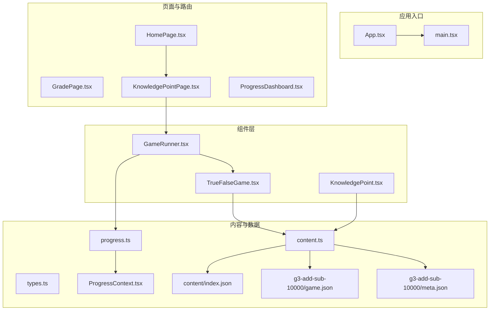
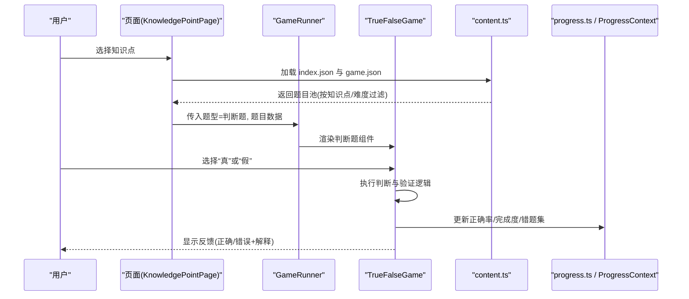
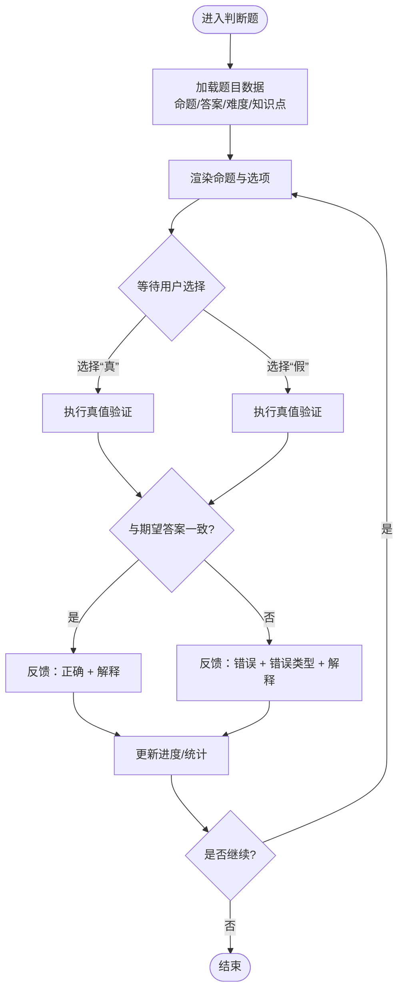
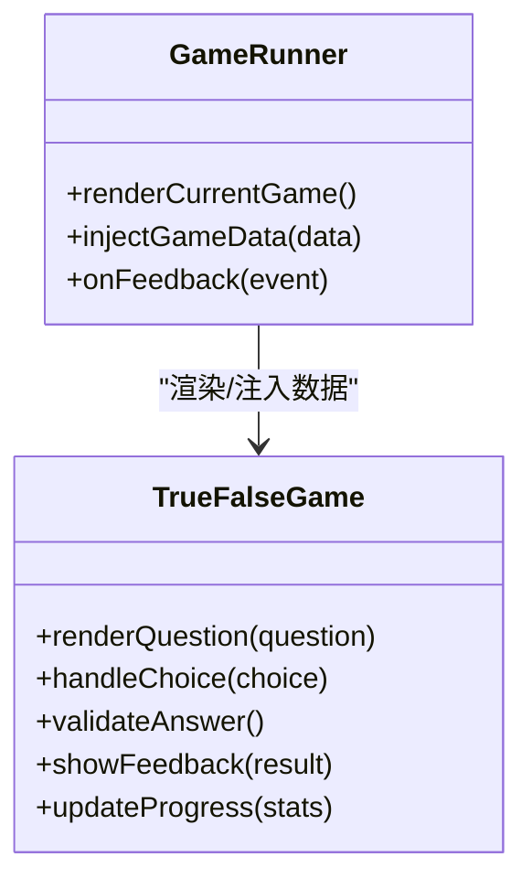
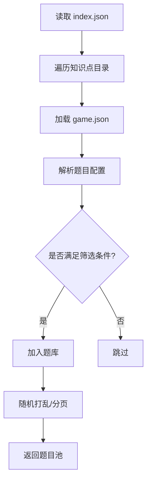
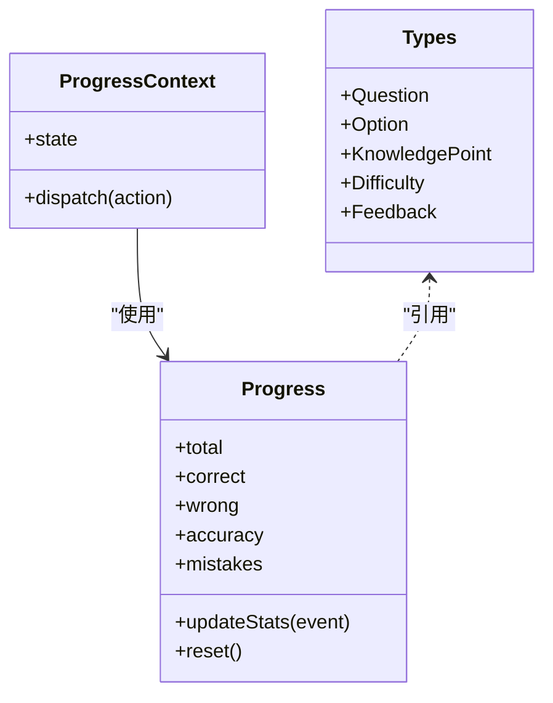
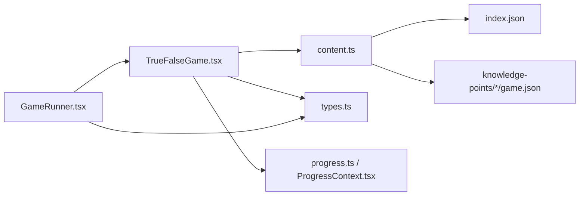

# 判断题游戏

<cite>
**本文引用的文件**   
- [TrueFalseGame.tsx](file://src/components/games/TrueFalseGame.tsx)
- [GameRunner.tsx](file://src/components/GameRunner.tsx)
- [content.ts](file://src/lib/content.ts)
- [types.ts](file://src/lib/types.ts)
- [progress.ts](file://src/lib/progress.ts)
- [ProgressContext.tsx](file://src/context/ProgressContext.tsx)
- [KnowledgePoint.tsx](file://src/components/KnowledgePoint.tsx)
- [index.json](file://src/content/index.json)
- [g3-add-sub-10000/game.json](file://src/content/knowledge-points/g3-add-sub-10000/game.json)
- [g3-add-sub-10000/meta.json](file://src/content/knowledge-points/g3-add-sub-10000/meta.json)
</cite>

## 目录
1. [简介](#简介)
2. [项目结构](#项目结构)
3. [核心组件](#核心组件)
4. [架构总览](#架构总览)
5. [详细组件分析](#详细组件分析)
6. [依赖关系分析](#依赖关系分析)
7. [性能考量](#性能考量)
8. [故障排查指南](#故障排查指南)
9. [结论](#结论)
10. [附录：自定义判断题开发指南](#附录自定义判断题开发指南)

## 简介
本技术文档围绕 math-k6 的“判断题”游戏展开，重点解析 TrueFalseGame 组件的判断逻辑、答案验证与反馈机制；说明数学命题的真值判断、条件分析与错误类型识别；记录题目的自动生成、难度分级与知识点关联；并提供自定义判断题的开发指南，包括复杂数学命题构建方法与教学效果评估标准。

## 项目结构
- 组件层
  - 游戏组件位于 src/components/games，其中 TrueFalseGame.tsx 实现判断题交互与判定流程。
  - GameRunner.tsx 负责统一调度不同题型（含判断题）的渲染与状态流转。
- 内容与数据层
  - src/lib/content.ts 提供内容加载与题目生成能力。
  - src/lib/types.ts 定义通用类型（如题目、知识点、进度等）。
  - src/lib/progress.ts 管理学习进度与统计。
  - src/context/ProgressContext.tsx 以 React Context 暴露进度上下文。
  - src/content/index.json 为知识点索引，指向各知识点的 game.json 与 meta.json。
  - 各知识点目录（如 g3-add-sub-10000）包含 game.json（题目配置）、meta.json（元信息）以及可选的解释或推导文件。
- 可视化层
  - src/visualizations 提供多种数学可视化组件，可在判断题中用于辅助理解。

图表来源
- [GameRunner.tsx](file://src/components/GameRunner.tsx)
- [TrueFalseGame.tsx](file://src/components/games/TrueFalseGame.tsx)
- [content.ts](file://src/lib/content.ts)
- [types.ts](file://src/lib/types.ts)
- [progress.ts](file://src/lib/progress.ts)
- [ProgressContext.tsx](file://src/context/ProgressContext.tsx)
- [index.json](file://src/content/index.json)
- [g3-add-sub-10000/game.json](file://src/content/knowledge-points/g3-add-sub-10000/game.json)
- [g3-add-sub-10000/meta.json](file://src/content/knowledge-points/g3-add-sub-10000/meta.json)

章节来源
- [TrueFalseGame.tsx](file://src/components/games/TrueFalseGame.tsx)
- [GameRunner.tsx](file://src/components/GameRunner.tsx)
- [content.ts](file://src/lib/content.ts)
- [types.ts](file://src/lib/types.ts)
- [progress.ts](file://src/lib/progress.ts)
- [ProgressContext.tsx](file://src/context/ProgressContext.tsx)
- [index.json](file://src/content/index.json)
- [g3-add-sub-10000/game.json](file://src/content/knowledge-points/g3-add-sub-10000/game.json)
- [g3-add-sub-10000/meta.json](file://src/content/knowledge-points/g3-add-sub-10000/meta.json)

## 核心组件
- TrueFalseGame.tsx：判断题的核心交互与判定组件，负责展示命题、接收用户选择（真/假）、执行验证并给出反馈，同时更新进度与统计数据。
- GameRunner.tsx：统一的游戏运行器，根据当前题型渲染对应组件，并在判断题模式下将题目数据注入到 TrueFalseGame。
- content.ts：从 index.json 与各知识点 game.json 中读取题目配置，支持按知识点筛选、随机抽取、难度过滤与生成题库。
- types.ts：定义题目、选项、知识点、进度等数据结构，确保组件间数据一致性。
- progress.ts 与 ProgressContext.tsx：维护答题正确率、完成度、错题集等学习进度，并通过 Context 在组件树中共享。

章节来源
- [TrueFalseGame.tsx](file://src/components/games/TrueFalseGame.tsx)
- [GameRunner.tsx](file://src/components/GameRunner.tsx)
- [content.ts](file://src/lib/content.ts)
- [types.ts](file://src/lib/types.ts)
- [progress.ts](file://src/lib/progress.ts)
- [ProgressContext.tsx](file://src/context/ProgressContext.tsx)

## 架构总览
判断题游戏的整体流程如下：
- 页面层选择知识点后，由 KnowledgePoint.tsx 或页面组件加载该知识点的题目配置。
- content.ts 解析 index.json 与各 game.json，生成题目池并按难度与知识点过滤。
- GameRunner.tsx 根据题型选择 TrueFalseGame 进行渲染。
- TrueFalseGame 接收题目数据，展示命题与选项，处理用户输入，调用验证逻辑，输出反馈并更新进度。

图表来源
- [GameRunner.tsx](file://src/components/GameRunner.tsx)
- [TrueFalseGame.tsx](file://src/components/games/TrueFalseGame.tsx)
- [content.ts](file://src/lib/content.ts)
- [progress.ts](file://src/lib/progress.ts)
- [ProgressContext.tsx](file://src/context/ProgressContext.tsx)

## 详细组件分析

### TrueFalseGame 组件分析
- 功能职责
  - 展示数学命题与“真/假”选项。
  - 对用户选择进行验证，计算结果并与预期答案比对。
  - 根据验证结果输出反馈（正确/错误），必要时提供解释或可视化辅助。
  - 更新学习进度（正确数、错误数、正确率、错题记录）。
- 判断逻辑与验证
  - 命题解析：从题目数据中提取命题表达式与期望真值。
  - 条件分析：对命题中的数学条件进行求值（如数值比较、单位换算、几何性质判断等）。
  - 错误类型识别：区分“概念性错误”“计算错误”“单位/量纲错误”“边界条件误判”等，便于针对性反馈。
- 反馈机制
  - 即时反馈：选择后立即显示是否正确及简要解释。
  - 强化反馈：对常见错误类型给出提示与纠正思路。
  - 可视化辅助：结合 visualization 组件帮助理解（如数轴、面积模型等）。
- 数据流
  - 输入：题目对象（含命题、正确答案、难度、知识点标签、解释文本等）。
  - 处理：验证函数执行、错误分类、进度更新。
  - 输出：UI 反馈、进度上下文更新、下一题触发。

图表来源
- [TrueFalseGame.tsx](file://src/components/games/TrueFalseGame.tsx)
- [content.ts](file://src/lib/content.ts)
- [progress.ts](file://src/lib/progress.ts)

章节来源
- [TrueFalseGame.tsx](file://src/components/games/TrueFalseGame.tsx)
- [content.ts](file://src/lib/content.ts)
- [progress.ts](file://src/lib/progress.ts)

### GameRunner 与题型调度
- 职责
  - 根据当前题型动态渲染对应游戏组件（选择题、填空题、拖拽匹配、时间挑战、时间线、判断题等）。
  - 向各组件注入统一的题目数据与进度上下文。
- 与判断题的关系
  - 当题型为“判断题”时，GameRunner 将题目数据传递给 TrueFalseGame，并监听其反馈事件以推进流程。

图表来源
- [GameRunner.tsx](file://src/components/GameRunner.tsx)
- [TrueFalseGame.tsx](file://src/components/games/TrueFalseGame.tsx)

章节来源
- [GameRunner.tsx](file://src/components/GameRunner.tsx)
- [TrueFalseGame.tsx](file://src/components/games/TrueFalseGame.tsx)

### 内容加载与题目生成（content.ts）
- 功能要点
  - 读取 index.json 获取知识点列表与路径映射。
  - 针对每个知识点加载 game.json，解析题目配置（题干、选项、答案、难度、知识点标签、解释等）。
  - 支持按知识点、难度、题型筛选，随机抽样生成题库。
  - 提供题目去重、打乱顺序、分页等能力。
- 与判断题的关系
  - 为 TrueFalseGame 提供结构化题目数据，确保命题格式统一、可被验证函数解析。

图表来源
- [content.ts](file://src/lib/content.ts)
- [index.json](file://src/content/index.json)
- [g3-add-sub-10000/game.json](file://src/content/knowledge-points/g3-add-sub-10000/game.json)

章节来源
- [content.ts](file://src/lib/content.ts)
- [index.json](file://src/content/index.json)
- [g3-add-sub-10000/game.json](file://src/content/knowledge-points/g3-add-sub-10000/game.json)

### 数据类型与进度管理（types.ts、progress.ts、ProgressContext.tsx）
- types.ts
  - 定义题目对象、选项、知识点、难度等级、反馈信息等结构，保证组件间数据契约稳定。
- progress.ts
  - 维护答题统计（总题数、正确数、错误数、正确率）、错题集、知识点掌握度等。
  - 提供增量更新接口，避免重复计算。
- ProgressContext.tsx
  - 通过 React Context 暴露进度数据与更新方法，供各游戏组件订阅与更新。

图表来源
- [types.ts](file://src/lib/types.ts)
- [progress.ts](file://src/lib/progress.ts)
- [ProgressContext.tsx](file://src/context/ProgressContext.tsx)

章节来源
- [types.ts](file://src/lib/types.ts)
- [progress.ts](file://src/lib/progress.ts)
- [ProgressContext.tsx](file://src/context/ProgressContext.tsx)

## 依赖关系分析
- 组件耦合
  - TrueFalseGame 依赖 content.ts 提供的题目数据与 types.ts 的数据结构。
  - GameRunner 作为调度中心，弱耦合各题型组件，仅通过统一接口传递数据与事件。
- 外部依赖
  - 进度管理通过 ProgressContext 与 progress.ts 解耦 UI 与状态。
  - 知识点索引与题目配置通过 JSON 文件驱动，便于扩展与维护。
- 潜在循环依赖
  - 组件层不直接依赖页面层，避免反向耦合。
  - 内容层与组件层通过 types.ts 契约隔离，降低耦合风险。

图表来源
- [TrueFalseGame.tsx](file://src/components/games/TrueFalseGame.tsx)
- [GameRunner.tsx](file://src/components/GameRunner.tsx)
- [content.ts](file://src/lib/content.ts)
- [types.ts](file://src/lib/types.ts)
- [progress.ts](file://src/lib/progress.ts)
- [ProgressContext.tsx](file://src/context/ProgressContext.tsx)
- [index.json](file://src/content/index.json)

章节来源
- [TrueFalseGame.tsx](file://src/components/games/TrueFalseGame.tsx)
- [GameRunner.tsx](file://src/components/GameRunner.tsx)
- [content.ts](file://src/lib/content.ts)
- [types.ts](file://src/lib/types.ts)
- [progress.ts](file://src/lib/progress.ts)
- [ProgressContext.tsx](file://src/context/ProgressContext.tsx)
- [index.json](file://src/content/index.json)

## 性能考量
- 题目生成优化
  - 预解析与缓存：对频繁使用的知识点题目进行内存缓存，减少重复 IO。
  - 按需加载：仅在切换知识点或刷新时重新加载配置，避免不必要的解析。
- 渲染与交互
  - 最小化重渲染：通过 React 状态管理与 memoization 减少不必要的组件更新。
  - 批量更新进度：合并多次答题事件，降低上下文更新频率。
- 可扩展性
  - 新增题型或知识点只需扩展 JSON 配置与类型定义，无需改动核心逻辑。

[本节为通用指导，不直接分析具体文件]

## 故障排查指南
- 常见问题
  - 题目未加载：检查 index.json 与 game.json 的路径与字段完整性。
  - 判断结果异常：确认命题解析与验证逻辑是否与题目语义一致。
  - 进度不更新：检查 ProgressContext 的 dispatch 是否正确调用。
  - 反馈缺失：确认题目配置中包含解释字段，且组件渲染逻辑覆盖反馈分支。
- 调试建议
  - 在 TrueFalseGame 中添加日志输出关键步骤（命题解析、验证结果、错误类型）。
  - 使用浏览器开发者工具检查网络请求与 JSON 解析结果。
  - 对复杂命题增加单元测试，覆盖边界条件与常见错误场景。

章节来源
- [TrueFalseGame.tsx](file://src/components/games/TrueFalseGame.tsx)
- [content.ts](file://src/lib/content.ts)
- [progress.ts](file://src/lib/progress.ts)
- [ProgressContext.tsx](file://src/context/ProgressContext.tsx)

## 结论
TrueFalseGame 组件通过清晰的判断逻辑、严格的验证与丰富的反馈机制，有效支撑了数学判断题的教学目标。结合 content.ts 的内容驱动与 progress.ts 的进度管理，系统具备良好的可扩展性与可维护性。通过遵循本文档的开发指南，教师与开发者可以高效构建高质量、可评估的自定义判断题。

[本节为总结，不直接分析具体文件]

## 附录：自定义判断题开发指南

### 命题构建规范
- 基本结构
  - 题干：清晰表述数学命题，避免歧义。
  - 答案：明确标注“真”或“假”。
  - 难度：使用统一难度等级（如简单、中等、困难）。
  - 知识点：关联至具体知识点目录与标签。
  - 解释：提供正确/错误的理由与纠正思路。
- 复杂命题
  - 多条件组合：使用明确的逻辑连接词（且、或、非）。
  - 单位与量纲：明确单位要求与换算规则。
  - 边界条件：涵盖临界值与极端情况。
  - 可视化辅助：必要时搭配 visualization 组件增强理解。

### 难度分级策略
- 简单：单一概念或一步计算。
- 中等：两步以上推理或多概念综合。
- 困难：复杂条件组合、反例构造或证明思路。

### 知识点关联
- 在 game.json 中声明知识点 ID 与名称，确保与 index.json 映射一致。
- 利用 meta.json 补充教学目标与先决知识。

### 教学效果评估标准
- 正确率：反映学生对知识点的掌握程度。
- 错误类型分布：识别常见误区，指导教学改进。
- 响应时间：衡量熟练度与自动化水平。
- 知识点掌握度：基于答题历史计算各知识点的掌握概率。

### 开发步骤
1. 创建知识点目录与配置文件（game.json、meta.json）。
2. 在 content.ts 中扩展解析逻辑（如需新字段）。
3. 在 TrueFalseGame 中实现对应的验证与反馈逻辑。
4. 编写测试用例覆盖典型与边界场景。
5. 集成进度统计与可视化反馈。

章节来源
- [g3-add-sub-10000/game.json](file://src/content/knowledge-points/g3-add-sub-10000/game.json)
- [g3-add-sub-10000/meta.json](file://src/content/knowledge-points/g3-add-sub-10000/meta.json)
- [content.ts](file://src/lib/content.ts)
- [TrueFalseGame.tsx](file://src/components/games/TrueFalseGame.tsx)
- [progress.ts](file://src/lib/progress.ts)
- [ProgressContext.tsx](file://src/context/ProgressContext.tsx)