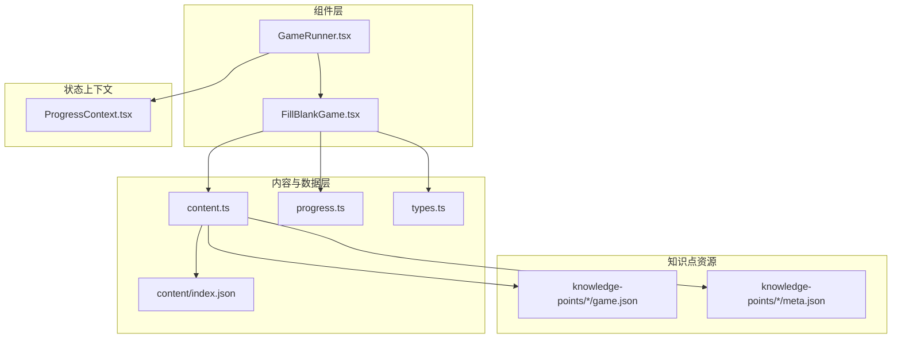
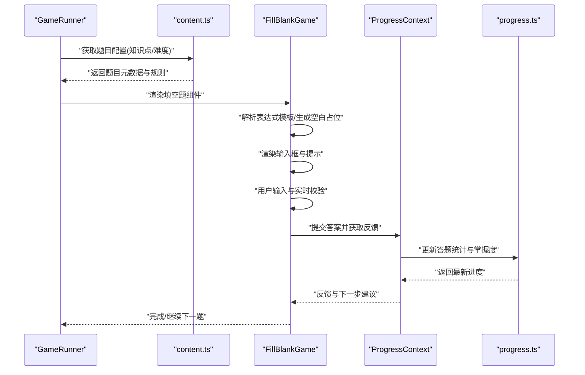
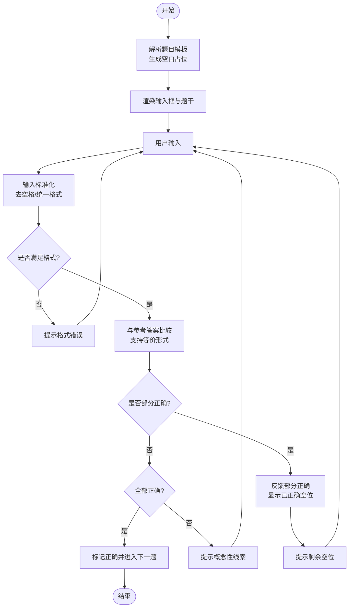
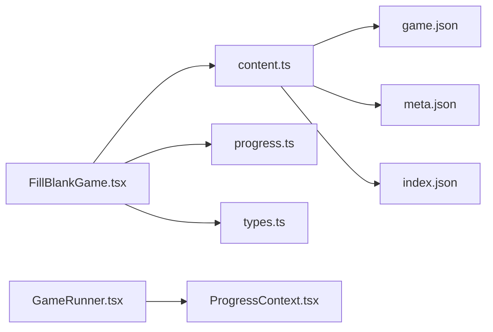

# 填空题游戏

<cite>
**本文档引用的文件**   
- [FillBlankGame.tsx](file://src/components/games/FillBlankGame.tsx)
- [GameRunner.tsx](file://src/components/GameRunner.tsx)
- [ProgressContext.tsx](file://src/context/ProgressContext.tsx)
- [content.ts](file://src/lib/content.ts)
- [progress.ts](file://src/lib/progress.ts)
- [types.ts](file://src/lib/types.ts)
- [game.json](file://src/content/knowledge-points/g3-add-sub-10000/game.json)
- [meta.json](file://src/content/knowledge-points/g3-add-sub-10000/meta.json)
- [index.json](file://src/content/index.json)
</cite>

## 目录
1. [简介](#简介)
2. [项目结构](#项目结构)
3. [核心组件](#核心组件)
4. [架构总览](#架构总览)
5. [详细组件分析](#详细组件分析)
6. [依赖关系分析](#依赖关系分析)
7. [性能考量](#性能考量)
8. [故障排查指南](#故障排查指南)
9. [结论](#结论)
10. [附录：自定义填空题开发指南](#附录自定义填空题开发指南)

## 简介
本技术文档面向 math-k6 的“填空题”游戏，围绕 FillBlankGame 组件的实现原理进行系统化说明。内容涵盖输入框渲染、答案验证、提示系统与错误处理；数学表达式的解析与格式化；部分正确答案的处理逻辑；题目的动态生成、难度调节与学习路径设计；以及扩展自定义复杂题型的实践指南。文档力求在保持技术深度的同时，兼顾非专业读者的可理解性。

## 项目结构
math-k6 采用按功能分层与知识点目录组织的方式：
- 组件层：包含各类题型（选择题、拖拽匹配、填空等）及通用容器（如 GameRunner）。
- 内容与数据层：以知识点为单位组织 game.json、meta.json、explain.md 等资源，并通过 content.ts、progress.ts、types.ts 提供统一的数据访问与类型定义。
- 上下文与状态：ProgressContext 管理学习进度与表现数据。
- 可视化层：为不同题型提供图形化辅助（如数轴、饼图、坐标系等）。

图表来源
- [GameRunner.tsx:1-200](file://src/components/GameRunner.tsx#L1-L200)
- [FillBlankGame.tsx:1-300](file://src/components/games/FillBlankGame.tsx#L1-L300)
- [content.ts:1-200](file://src/lib/content.ts#L1-L200)
- [progress.ts:1-200](file://src/lib/progress.ts#L1-L200)
- [types.ts:1-200](file://src/lib/types.ts#L1-L200)
- [index.json:1-200](file://src/content/index.json#L1-L200)

章节来源
- [GameRunner.tsx:1-200](file://src/components/GameRunner.tsx#L1-L200)
- [FillBlankGame.tsx:1-300](file://src/components/games/FillBlankGame.tsx#L1-L300)
- [content.ts:1-200](file://src/lib/content.ts#L1-L200)
- [progress.ts:1-200](file://src/lib/progress.ts#L1-L200)
- [types.ts:1-200](file://src/lib/types.ts#L1-L200)
- [index.json:1-200](file://src/content/index.json#L1-L200)

## 核心组件
- FillBlankGame：填空题的核心交互与校验逻辑，负责渲染题目片段、空白输入框、提示与反馈、提交与重试流程。
- GameRunner：题型运行器，负责加载题目配置、驱动题型组件生命周期、汇总结果并上报进度。
- ProgressContext：全局学习进度上下文，记录答题正确率、尝试次数、掌握度等指标。
- content.ts / progress.ts / types.ts：统一的题目数据读取、进度计算与类型定义。

章节来源
- [FillBlankGame.tsx:1-300](file://src/components/games/FillBlankGame.tsx#L1-L300)
- [GameRunner.tsx:1-200](file://src/components/GameRunner.tsx#L1-L200)
- [ProgressContext.tsx:1-200](file://src/context/ProgressContext.tsx#L1-L200)
- [content.ts:1-200](file://src/lib/content.ts#L1-L200)
- [progress.ts:1-200](file://src/lib/progress.ts#L1-L200)
- [types.ts:1-200](file://src/lib/types.ts#L1-L200)

## 架构总览
填空题游戏的整体调用链如下：
- GameRunner 根据当前知识点与难度选择题目配置（来自 game.json），初始化 FillBlankGame。
- FillBlankGame 解析表达式模板，渲染题干与输入框，接收用户输入并进行标准化与校验。
- 校验结果通过 ProgressContext 更新学习进度，并在 UI 上给出即时反馈与提示。

图表来源
- [GameRunner.tsx:1-200](file://src/components/GameRunner.tsx#L1-L200)
- [content.ts:1-200](file://src/lib/content.ts#L1-L200)
- [FillBlankGame.tsx:1-300](file://src/components/games/FillBlankGame.tsx#L1-L300)
- [ProgressContext.tsx:1-200](file://src/context/ProgressContext.tsx#L1-L200)
- [progress.ts:1-200](file://src/lib/progress.ts#L1-L200)

## 详细组件分析

### FillBlankGame 组件
- 输入框渲染
  - 将题干中的空白占位符映射为独立输入框，支持数字、分数、小数、单位等格式。
  - 对输入进行本地格式化（如去除多余空格、规范化小数点、统一分数表示）。
- 答案验证
  - 对用户输入进行标准化后与参考答案比对，支持等价形式（如 0.5 与 1/2）。
  - 支持部分正确答案：当题目包含多个空时，允许部分空正确即判定为部分正确。
- 提示系统
  - 基于错误类型提供分层次提示：格式错误、数值偏差、概念性提示。
  - 提示内容来源于题目配置的 hint 字段或默认策略。
- 错误处理
  - 捕获解析异常与边界情况（如除零、负数根号等），给出友好提示。
  - 对非法输入进行拦截与回退，保证界面稳定。

图表来源
- [FillBlankGame.tsx:1-300](file://src/components/games/FillBlankGame.tsx#L1-L300)

章节来源
- [FillBlankGame.tsx:1-300](file://src/components/games/FillBlankGame.tsx#L1-L300)

### 数学表达式解析与答案格式化
- 表达式解析
  - 支持基础四则运算、括号优先级、分数与小数混合。
  - 对特殊符号（如百分号、单位）进行归一化处理。
- 答案格式化
  - 将用户输入转换为内部标准形式（如最简分数、固定小数位数）。
  - 支持等价判断（如 2/4 与 1/2 视为相同）。
- 部分正确答案处理
  - 多空题目中，逐个空位独立校验，累计正确比例。
  - 当达到阈值时给予部分正确反馈，引导继续完善。

章节来源
- [FillBlankGame.tsx:1-300](file://src/components/games/FillBlankGame.tsx#L1-L300)
- [types.ts:1-200](file://src/lib/types.ts#L1-L200)

### 题目动态生成与难度调节
- 动态生成
  - 依据知识点与难度参数随机生成数值范围、运算符组合与干扰项。
  - 通过 game.json 的规则描述控制生成策略（如约束条件、目标值范围）。
- 难度调节
  - 根据历史正确率与尝试次数动态调整数值范围与复杂度。
  - 支持渐进式难度提升与回退机制，确保学习曲线平滑。
- 学习路径设计
  - 结合 meta.json 的知识图谱，推荐前置知识点与后续拓展。
  - 通过 ProgressContext 跟踪掌握度，自动规划下一题方向。

章节来源
- [content.ts:1-200](file://src/lib/content.ts#L1-L200)
- [progress.ts:1-200](file://src/lib/progress.ts#L1-L200)
- [game.json:1-200](file://src/content/knowledge-points/g3-add-sub-10000/game.json#L1-L200)
- [meta.json:1-200](file://src/content/knowledge-points/g3-add-sub-10000/meta.json#L1-L200)

### 与 GameRunner 的集成
- 生命周期管理
  - GameRunner 负责加载配置、初始化组件、处理提交与跳转。
  - FillBlankGame 仅关注题目交互与校验，降低耦合。
- 结果上报
  - 每次提交后，GameRunner 汇总结果并调用 ProgressContext 更新进度。
  - 支持批量提交与单题即时反馈两种模式。

章节来源
- [GameRunner.tsx:1-200](file://src/components/GameRunner.tsx#L1-L200)
- [ProgressContext.tsx:1-200](file://src/context/ProgressContext.tsx#L1-L200)

## 依赖关系分析
- 组件依赖
  - FillBlankGame 依赖 content.ts 读取题目配置，依赖 progress.ts 计算进度，依赖 types.ts 的类型定义。
  - GameRunner 依赖 ProgressContext 进行状态同步。
- 外部资源
  - game.json 与 meta.json 提供题目规则与知识图谱信息。
  - index.json 作为知识点索引，便于导航与检索。

图表来源
- [FillBlankGame.tsx:1-300](file://src/components/games/FillBlankGame.tsx#L1-L300)
- [GameRunner.tsx:1-200](file://src/components/GameRunner.tsx#L1-L200)
- [content.ts:1-200](file://src/lib/content.ts#L1-L200)
- [progress.ts:1-200](file://src/lib/progress.ts#L1-L200)
- [types.ts:1-200](file://src/lib/types.ts#L1-L200)
- [game.json:1-200](file://src/content/knowledge-points/g3-add-sub-10000/game.json#L1-L200)
- [meta.json:1-200](file://src/content/knowledge-points/g3-add-sub-10000/meta.json#L1-L200)
- [index.json:1-200](file://src/content/index.json#L1-L200)

章节来源
- [FillBlankGame.tsx:1-300](file://src/components/games/FillBlankGame.tsx#L1-L300)
- [GameRunner.tsx:1-200](file://src/components/GameRunner.tsx#L1-L200)
- [content.ts:1-200](file://src/lib/content.ts#L1-L200)
- [progress.ts:1-200](file://src/lib/progress.ts#L1-L200)
- [types.ts:1-200](file://src/lib/types.ts#L1-L200)
- [game.json:1-200](file://src/content/knowledge-points/g3-add-sub-10000/game.json#L1-L200)
- [meta.json:1-200](file://src/content/knowledge-points/g3-add-sub-10000/meta.json#L1-L200)
- [index.json:1-200](file://src/content/index.json#L1-L200)

## 性能考量
- 输入标准化与校验应在本地快速执行，避免频繁重渲染。
- 表达式解析可采用缓存策略，减少重复计算。
- 大量题目生成时，按需懒加载与分页渲染，降低首屏压力。
- 进度更新采用批处理，减少上下文切换开销。

[本节为通用指导，不直接分析具体文件]

## 故障排查指南
- 常见错误
  - 输入格式不合法：检查标准化逻辑与正则规则。
  - 答案等价判断失败：确认分数约分与小数精度处理。
  - 提示未显示：核查 hint 字段与默认策略覆盖。
- 调试建议
  - 打印中间态数据（标准化前后、解析树、比较结果）。
  - 使用单元测试覆盖边界用例（如零、负数、极大值）。
  - 在 ProgressContext 中增加日志输出，追踪进度更新链路。

章节来源
- [FillBlankGame.tsx:1-300](file://src/components/games/FillBlankGame.tsx#L1-L300)
- [progress.ts:1-200](file://src/lib/progress.ts#L1-L200)

## 结论
FillBlankGame 组件通过清晰的输入渲染、严格的验证与友好的提示系统，构建了稳定的填空题体验。结合动态生成与难度调节，能够适配不同学习阶段的需求。通过模块化设计与明确的数据流，系统具备良好的可扩展性与可维护性。

[本节为总结性内容，不直接分析具体文件]

## 附录：自定义填空题开发指南
- 新增题型步骤
  - 在 knowledge-points 下创建新目录，编写 game.json 与 meta.json，定义题目规则与知识图谱。
  - 在 components/games 中实现新的题型组件，复用 FillBlankGame 的输入与校验能力。
  - 在 content.ts 中注册新题型，确保 GameRunner 能正确加载与渲染。
- 复杂数学题型实现
  - 在表达式解析层扩展语法支持（如根号、指数、函数）。
  - 在答案格式化层增加等价判断规则（如三角函数恒等式）。
  - 在提示系统中引入概念性线索，帮助用户理解解题思路。
- 用户体验优化
  - 提供即时反馈与渐进式提示，避免一次性挫败感。
  - 支持键盘导航与无障碍特性，提升可访问性。
  - 针对移动端优化输入框大小与布局，提升触控体验。

章节来源
- [game.json:1-200](file://src/content/knowledge-points/g3-add-sub-10000/game.json#L1-L200)
- [meta.json:1-200](file://src/content/knowledge-points/g3-add-sub-10000/meta.json#L1-L200)
- [content.ts:1-200](file://src/lib/content.ts#L1-L200)
- [FillBlankGame.tsx:1-300](file://src/components/games/FillBlankGame.tsx#L1-L300)