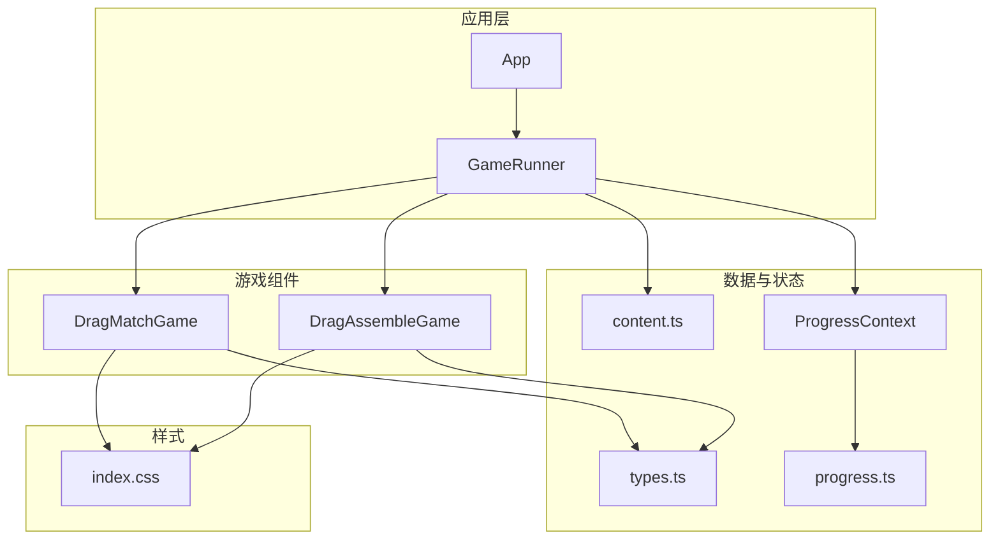
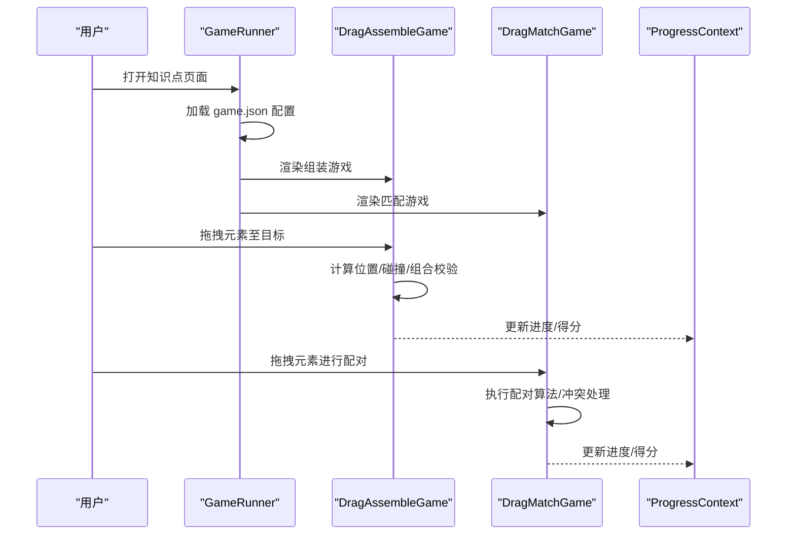
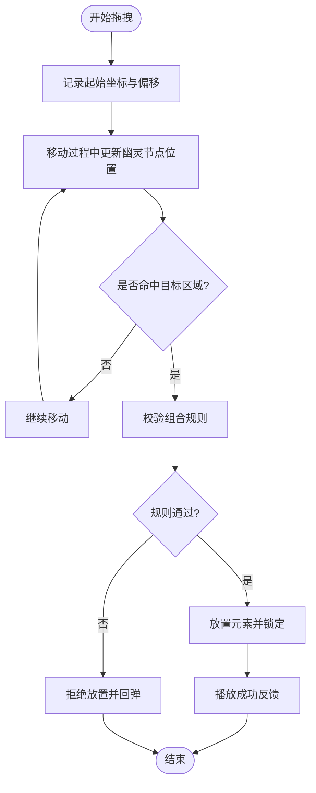
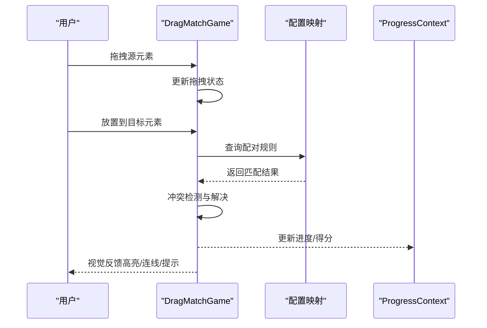
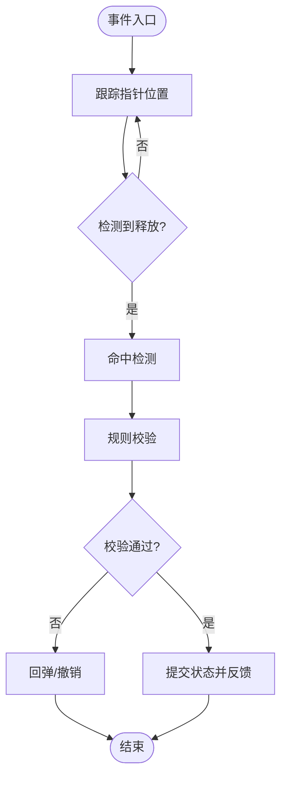
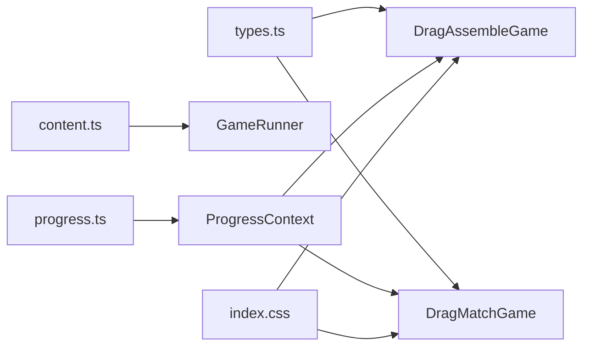

# 拖拽类游戏

<cite>
**本文引用的文件**   
- [DragAssembleGame.tsx](file://src/components/games/DragAssembleGame.tsx)
- [DragMatchGame.tsx](file://src/components/games/DragMatchGame.tsx)
- [GameRunner.tsx](file://src/components/GameRunner.tsx)
- [ProgressContext.tsx](file://src/context/ProgressContext.tsx)
- [types.ts](file://src/lib/types.ts)
- [content.ts](file://src/lib/content.ts)
- [progress.ts](file://src/lib/progress.ts)
- [index.css](file://src/index.css)
</cite>

## 目录
1. [简介](#简介)
2. [项目结构](#项目结构)
3. [核心组件](#核心组件)
4. [架构总览](#架构总览)
5. [详细组件分析](#详细组件分析)
6. [依赖关系分析](#依赖关系分析)
7. [性能考量](#性能考量)
8. [故障排查指南](#故障排查指南)
9. [结论](#结论)
10. [附录：自定义拖拽游戏开发指南与最佳实践](#附录自定义拖拽游戏开发指南与最佳实践)

## 简介
本技术文档聚焦 math-k6 中的拖拽类游戏，重点解析 DragAssembleGame（拖拽组装）与 DragMatchGame（拖拽匹配）两大组件的实现机制。内容涵盖拖拽事件处理、位置计算、碰撞检测、视觉反馈、元素组合逻辑与配对算法，并补充无障碍支持、移动端适配与性能优化建议。文末提供自定义拖拽游戏的开发指南与最佳实践，帮助开发者快速扩展新的拖拽玩法。

## 项目结构
- 游戏组件位于 src/components/games，包含多种题型实现，其中 DragAssembleGame.tsx 与 DragMatchGame.tsx 为拖拽类核心。
- GameRunner.tsx 负责统一加载题目配置、渲染具体游戏组件以及管理进度。
- ProgressContext.tsx 提供全局进度上下文，用于记录答题状态与结果。
- lib/types.ts 定义通用类型；lib/content.ts 与 lib/progress.ts 分别负责内容加载与进度持久化。
- index.css 提供全局样式，包括拖拽交互的视觉反馈基础样式。

图表来源
- [GameRunner.tsx](file://src/components/GameRunner.tsx)
- [DragAssembleGame.tsx](file://src/components/games/DragAssembleGame.tsx)
- [DragMatchGame.tsx](file://src/components/games/DragMatchGame.tsx)
- [types.ts](file://src/lib/types.ts)
- [content.ts](file://src/lib/content.ts)
- [ProgressContext.tsx](file://src/context/ProgressContext.tsx)
- [progress.ts](file://src/lib/progress.ts)
- [index.css](file://src/index.css)

章节来源
- [GameRunner.tsx](file://src/components/GameRunner.tsx)
- [DragAssembleGame.tsx](file://src/components/games/DragAssembleGame.tsx)
- [DragMatchGame.tsx](file://src/components/games/DragMatchGame.tsx)
- [types.ts](file://src/lib/types.ts)
- [content.ts](file://src/lib/content.ts)
- [ProgressContext.tsx](file://src/context/ProgressContext.tsx)
- [progress.ts](file://src/lib/progress.ts)
- [index.css](file://src/index.css)

## 核心组件
- DragAssembleGame（拖拽组装）：将多个可拖拽元素按规则放置到目标区域，完成“组装”任务。核心能力包括拖拽源与目标的绑定、坐标与尺寸计算、命中判定、组合校验与成功反馈。
- DragMatchGame（拖拽匹配）：在两组或多组元素之间建立配对关系，通过拖拽连线或放置进行匹配。核心能力包括配对规则引擎、多对一/一对多匹配策略、冲突解决与撤销重做。

章节来源
- [DragAssembleGame.tsx](file://src/components/games/DragAssembleGame.tsx)
- [DragMatchGame.tsx](file://src/components/games/DragMatchGame.tsx)

## 架构总览
整体采用“配置驱动 + 组件化”的架构：
- 配置层：game.json 描述关卡、元素、目标区域、规则等元数据。
- 运行层：GameRunner 读取配置，实例化对应游戏组件。
- 表现层：各游戏组件基于 React 状态驱动 UI，使用 CSS 提供拖拽视觉反馈。
- 数据层：ProgressContext 与 progress.ts 管理进度与持久化。

图表来源
- [GameRunner.tsx](file://src/components/GameRunner.tsx)
- [DragAssembleGame.tsx](file://src/components/games/DragAssembleGame.tsx)
- [DragMatchGame.tsx](file://src/components/games/DragMatchGame.tsx)
- [ProgressContext.tsx](file://src/context/ProgressContext.tsx)

## 详细组件分析

### DragAssembleGame（拖拽组装）
- 拖拽事件处理
  - 监听鼠标与触摸事件，统一封装为 PointerEvent，确保桌面与移动端一致体验。
  - 在 mousedown/touchstart 时记录起始点与元素偏移，创建“幽灵节点”跟随移动。
  - mousemove/touchmove 中更新幽灵节点位置，避免频繁重排，使用 transform 提升性能。
  - mouseup/touchend 触发落点判定与状态更新。
- 位置计算与碰撞检测
  - 使用 getBoundingClientRect 获取目标区域与元素边界，计算中心点或重叠面积阈值。
  - 支持吸附（snap-to-grid）与弹性回弹，失败时自动回到原位。
  - 针对复杂布局，优先使用几何相交判断，必要时引入网格化加速。
- 元素组合逻辑
  - 根据配置定义的组合规则（如顺序约束、互斥关系、数量限制）进行校验。
  - 成功后锁定元素，播放动画与音效提示，并触发进度上报。
- 视觉反馈
  - 高亮目标区域、显示阴影与缩放效果，错误时抖动提示。
  - 使用 CSS 过渡与关键帧动画，减少 JS 动画开销。

图表来源
- [DragAssembleGame.tsx](file://src/components/games/DragAssembleGame.tsx)

章节来源
- [DragAssembleGame.tsx](file://src/components/games/DragAssembleGame.tsx)

### DragMatchGame（拖拽匹配）
- 拖拽事件处理
  - 支持从“源集合”拖拽到“目标集合”，或双向拖拽建立连接。
  - 使用指针事件统一处理跨设备输入，维护当前拖拽状态机。
- 配对算法
  - 基于配置的映射表进行匹配，支持一对一、一对多、多对一与多对多。
  - 冲突检测：当目标已被占用时，触发交换或撤销前一次匹配。
  - 容错与提示：部分匹配允许保留，全部匹配完成后进入验证阶段。
- 视觉反馈
  - 连线绘制（SVG/Canvas），动态更新连接路径。
  - 匹配成功高亮，失败抖动或变灰，支持撤销与重做。

图表来源
- [DragMatchGame.tsx](file://src/components/games/DragMatchGame.tsx)
- [ProgressContext.tsx](file://src/context/ProgressContext.tsx)

章节来源
- [DragMatchGame.tsx](file://src/components/games/DragMatchGame.tsx)

### 概念性概览
以下流程图展示拖拽交互的通用生命周期，适用于组装与匹配两类游戏：

[本图为概念流程，不直接映射具体源码文件]

## 依赖关系分析
- 组件耦合
  - DragAssembleGame 与 DragMatchGame 均依赖 types.ts 的类型定义，保证数据结构一致性。
  - GameRunner 作为编排者，解耦了内容加载与组件渲染。
  - ProgressContext 与 progress.ts 提供状态管理与持久化，降低组件间耦合。
- 外部依赖
  - 浏览器原生 PointerEvent API 用于统一鼠标与触摸事件。
  - CSS 动画与过渡用于视觉反馈，减少 JS 计算压力。

图表来源
- [types.ts](file://src/lib/types.ts)
- [DragAssembleGame.tsx](file://src/components/games/DragAssembleGame.tsx)
- [DragMatchGame.tsx](file://src/components/games/DragMatchGame.tsx)
- [content.ts](file://src/lib/content.ts)
- [ProgressContext.tsx](file://src/context/ProgressContext.tsx)
- [progress.ts](file://src/lib/progress.ts)
- [index.css](file://src/index.css)

章节来源
- [types.ts](file://src/lib/types.ts)
- [DragAssembleGame.tsx](file://src/components/games/DragAssembleGame.tsx)
- [DragMatchGame.tsx](file://src/components/games/DragMatchGame.tsx)
- [content.ts](file://src/lib/content.ts)
- [ProgressContext.tsx](file://src/context/ProgressContext.tsx)
- [progress.ts](file://src/lib/progress.ts)
- [index.css](file://src/index.css)

## 性能考量
- 事件节流与防抖
  - 在高频 move 事件中合并状态更新，避免每帧触发重绘。
  - 使用 requestAnimationFrame 批量更新 DOM。
- 渲染优化
  - 使用 transform 与 opacity 进行动画，避免触发布局重排。
  - 对大量元素采用虚拟滚动或分片渲染。
- 碰撞检测优化
  - 预计算边界框与网格索引，降低 O(n^2) 复杂度。
  - 对静态目标区域缓存命中结果，仅在元素移动时重新计算。
- 内存与资源
  - 及时清理事件监听器与定时器，防止内存泄漏。
  - 图片与音效按需加载，避免首屏阻塞。

[本节为通用指导，不直接分析具体文件]

## 故障排查指南
- 常见问题
  - 拖拽无响应：检查指针事件绑定与默认行为阻止是否正确。
  - 命中不准确：确认 getBoundingClientRect 调用时机与容器缩放比例。
  - 组合/配对失败：核对配置映射与规则优先级，打印中间状态定位问题。
  - 移动端异常：验证 touch 事件兼容性与手势冲突。
- 调试建议
  - 在关键函数入口输出日志，记录坐标、边界与规则校验结果。
  - 使用浏览器性能面板分析重排与重绘热点。
  - 逐步禁用动画与特效，缩小问题范围。

章节来源
- [DragAssembleGame.tsx](file://src/components/games/DragAssembleGame.tsx)
- [DragMatchGame.tsx](file://src/components/games/DragMatchGame.tsx)

## 结论
DragAssembleGame 与 DragMatchGame 以配置驱动与组件化为核心，结合统一的指针事件处理、高效的碰撞检测与清晰的规则引擎，实现了稳定且可扩展的拖拽交互。通过合理的性能优化与无障碍支持，可在多端环境下提供流畅的学习体验。开发者可基于本文档的模式与最佳实践，快速构建新的拖拽游戏。

[本节为总结，不直接分析具体文件]

## 附录：自定义拖拽游戏开发指南与最佳实践
- 设计原则
  - 单一职责：每个组件只负责一类交互逻辑。
  - 配置优先：将关卡、元素、规则抽象为 JSON，便于编辑与复用。
  - 状态集中：使用 Context 或状态库统一管理进度与结果。
- 实现步骤
  - 定义类型与配置结构（参考 types.ts）。
  - 实现事件处理器与状态机（统一 PointerEvent）。
  - 编写碰撞检测与规则校验模块（可插拔）。
  - 添加视觉反馈与无障碍标签（aria-*、键盘导航）。
  - 接入进度与持久化（ProgressContext + progress.ts）。
- 移动端适配
  - 使用 touch 事件与手势识别，避免与页面滚动冲突。
  - 增大触控热区，提供触觉与声音反馈。
- 性能优化清单
  - 节流/防抖、requestAnimationFrame、transform 动画、边界框缓存、懒加载资源。
- 无障碍支持
  - 提供键盘操作（方向键移动、Enter 确认、Esc 取消）。
  - 使用 aria-label、role 与 live region 播报状态变化。
  - 确保颜色对比度与焦点可见性。

[本节为通用指导，不直接分析具体文件]