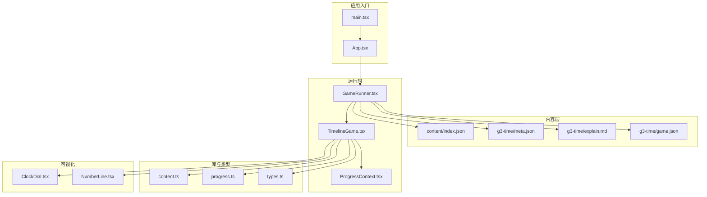
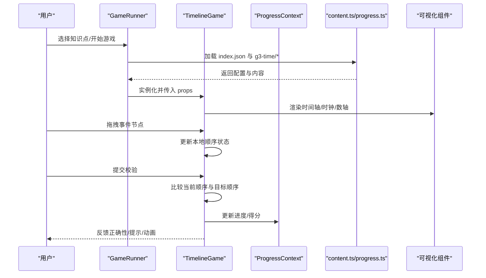
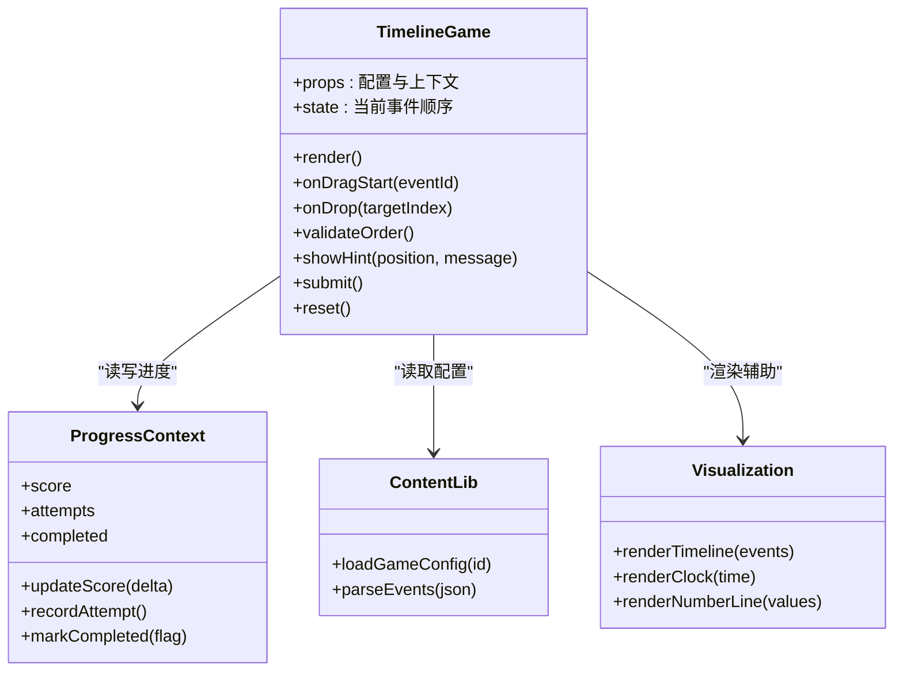
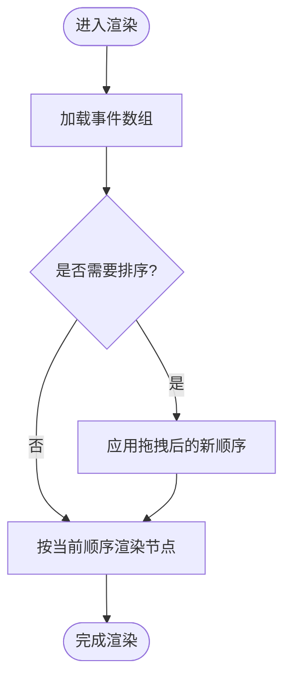
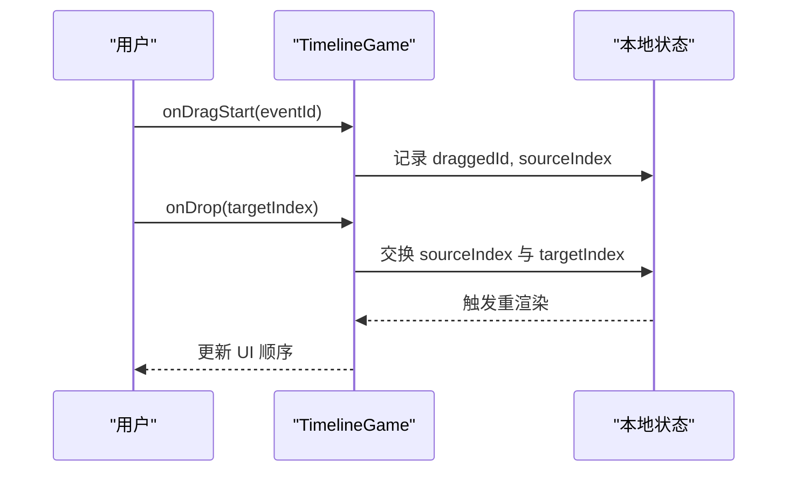
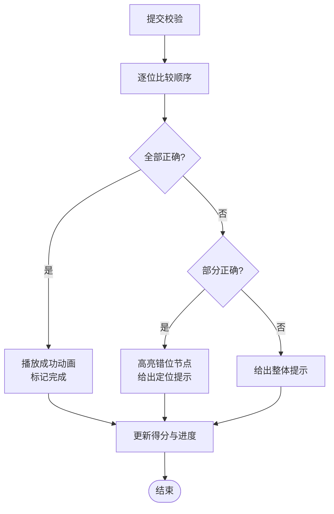
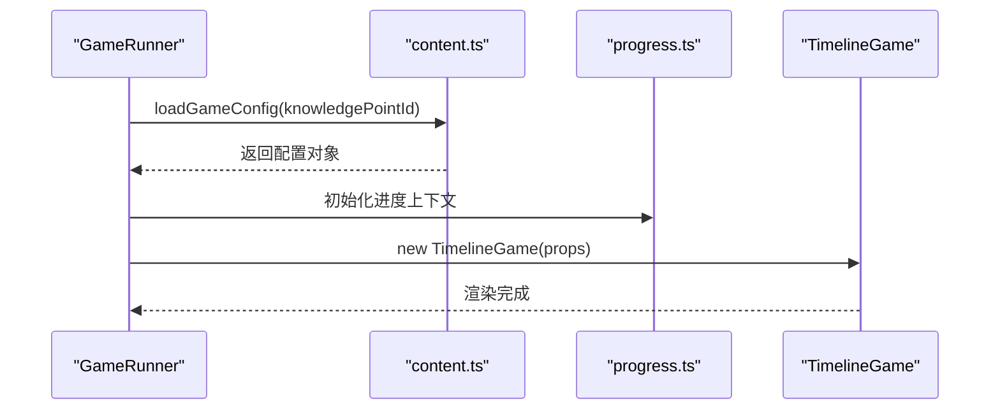
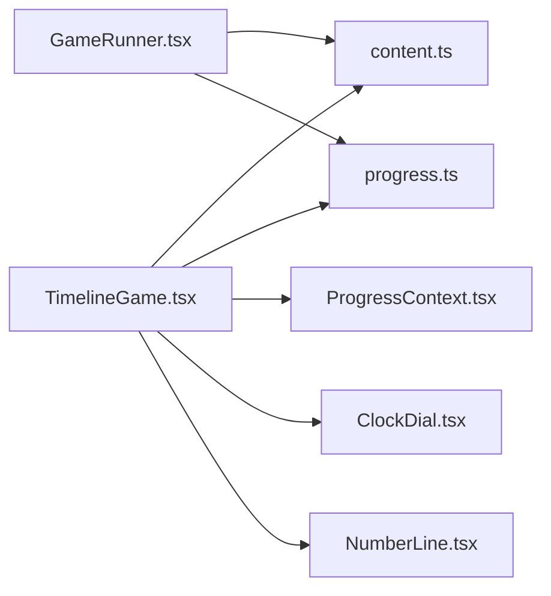

# 时间线游戏

<cite>
**本文引用的文件**   
- [TimelineGame.tsx](file://src/components/games/TimelineGame.tsx)
- [GameRunner.tsx](file://src/components/GameRunner.tsx)
- [ProgressContext.tsx](file://src/context/ProgressContext.tsx)
- [content.ts](file://src/lib/content.ts)
- [progress.ts](file://src/lib/progress.ts)
- [types.ts](file://src/lib/types.ts)
- [g3-time/game.json](file://src/content/knowledge-points/g3-time/game.json)
- [g3-time/explain.md](file://src/content/knowledge-points/g3-time/explain.md)
- [g3-time/meta.json](file://src/content/knowledge-points/g3-time/meta.json)
- [index.json](file://src/content/index.json)
- [ClockDial.tsx](file://src/visualizations/ClockDial.tsx)
- [NumberLine.tsx](file://src/visualizations/NumberLine.tsx)
- [App.tsx](file://src/App.tsx)
- [main.tsx](file://src/main.tsx)
</cite>

## 目录
1. [简介](#简介)
2. [项目结构](#项目结构)
3. [核心组件](#核心组件)
4. [架构总览](#架构总览)
5. [详细组件分析](#详细组件分析)
6. [依赖关系分析](#依赖关系分析)
7. [性能考量](#性能考量)
8. [故障排查指南](#故障排查指南)
9. [结论](#结论)
10. [附录：自定义时间线游戏开发指南](#附录自定义时间线游戏开发指南)

## 简介
本技术文档围绕 math-k6 中的“时间线游戏”展开，聚焦 TimelineGame 组件的时间轴渲染、事件排序与交互逻辑，覆盖历史事件的可视化展示、时间顺序验证、拖拽重排功能，以及数学概念的时间序列表示、动画效果与用户引导机制。同时提供扩展与自定义时间线游戏的实践指南，帮助开发者构建复杂时间关系的教学内容。

## 项目结构
时间线游戏位于 React + TypeScript 前端项目中，采用按功能模块划分的目录组织方式。核心实现集中在 components/games 下的 TimelineGame.tsx，并通过 GameRunner 统一加载与运行各类游戏；内容与配置通过 content 目录的 JSON/Markdown 描述；进度与状态由 context 与 lib 层管理；可视化能力由 visualizations 提供（如时钟表盘、数轴等）。

**图表来源** 
- [main.tsx](file://src/main.tsx)
- [App.tsx](file://src/App.tsx)
- [GameRunner.tsx](file://src/components/GameRunner.tsx)
- [TimelineGame.tsx](file://src/components/games/TimelineGame.tsx)
- [ProgressContext.tsx](file://src/context/ProgressContext.tsx)
- [content.ts](file://src/lib/content.ts)
- [progress.ts](file://src/lib/progress.ts)
- [types.ts](file://src/lib/types.ts)
- [ClockDial.tsx](file://src/visualizations/ClockDial.tsx)
- [NumberLine.tsx](file://src/visualizations/NumberLine.tsx)
- [index.json](file://src/content/index.json)
- [g3-time/meta.json](file://src/content/knowledge-points/g3-time/meta.json)
- [g3-time/explain.md](file://src/content/knowledge-points/g3-time/explain.md)
- [g3-time/game.json](file://src/content/knowledge-points/g3-time/game.json)

**章节来源**
- [main.tsx](file://src/main.tsx)
- [App.tsx](file://src/App.tsx)
- [GameRunner.tsx](file://src/components/GameRunner.tsx)
- [TimelineGame.tsx](file://src/components/games/TimelineGame.tsx)
- [ProgressContext.tsx](file://src/context/ProgressContext.tsx)
- [content.ts](file://src/lib/content.ts)
- [progress.ts](file://src/lib/progress.ts)
- [types.ts](file://src/lib/types.ts)
- [ClockDial.tsx](file://src/visualizations/ClockDial.tsx)
- [NumberLine.tsx](file://src/visualizations/NumberLine.tsx)
- [index.json](file://src/content/index.json)
- [g3-time/meta.json](file://src/content/knowledge-points/g3-time/meta.json)
- [g3-time/explain.md](file://src/content/knowledge-points/g3-time/explain.md)
- [g3-time/game.json](file://src/content/knowledge-points/g3-time/game.json)

## 核心组件
- TimelineGame：时间线游戏的核心交互与渲染组件，负责事件列表的展示、排序校验、拖拽重排、提示与反馈、动画过渡及结果统计。
- GameRunner：统一的游戏加载器，根据知识点配置动态加载 game.json、explain.md、meta.json，并实例化对应游戏组件。
- ProgressContext：全局进度上下文，记录学习进度、得分与完成状态，供各游戏组件读写。
- content.ts / progress.ts / types.ts：内容解析、进度管理与类型定义的基础库。
- 可视化组件：ClockDial、NumberLine 等用于辅助表达时间与数值关系。

**章节来源**
- [TimelineGame.tsx](file://src/components/games/TimelineGame.tsx)
- [GameRunner.tsx](file://src/components/GameRunner.tsx)
- [ProgressContext.tsx](file://src/context/ProgressContext.tsx)
- [content.ts](file://src/lib/content.ts)
- [progress.ts](file://src/lib/progress.ts)
- [types.ts](file://src/lib/types.ts)
- [ClockDial.tsx](file://src/visualizations/ClockDial.tsx)
- [NumberLine.tsx](file://src/visualizations/NumberLine.tsx)

## 架构总览
时间线游戏的数据流遵循“配置驱动 + 状态驱动”的模式：
- 配置层：game.json 定义事件集合、初始顺序、目标顺序、提示文案、难度与校验规则；explain.md 提供教学说明；meta.json 提供元信息。
- 运行时：GameRunner 读取配置并初始化 TimelineGame；TimelineGame 将事件渲染为可交互的时间线节点，支持拖拽重排与顺序校验。
- 状态层：ProgressContext 维护全局进度；progress.ts 提供持久化与计算工具；types.ts 定义数据结构契约。
- 可视化层：ClockDial、NumberLine 等按需嵌入，增强时间概念的直观理解。

**图表来源** 
- [GameRunner.tsx](file://src/components/GameRunner.tsx)
- [TimelineGame.tsx](file://src/components/games/TimelineGame.tsx)
- [ProgressContext.tsx](file://src/context/ProgressContext.tsx)
- [content.ts](file://src/lib/content.ts)
- [progress.ts](file://src/lib/progress.ts)
- [ClockDial.tsx](file://src/visualizations/ClockDial.tsx)
- [NumberLine.tsx](file://src/visualizations/NumberLine.tsx)
- [index.json](file://src/content/index.json)
- [g3-time/game.json](file://src/content/knowledge-points/g3-time/game.json)

## 详细组件分析

### TimelineGame 组件分析
TimelineGame 是时间线游戏的核心，承担以下职责：
- 数据绑定：从 game.json 中读取事件列表、目标顺序、提示与校验规则。
- 渲染策略：将事件渲染为可拖拽的卡片或节点，按当前顺序排列在时间线上；可选嵌入时钟表盘或数轴以强化时间概念。
- 交互逻辑：支持拖拽重排、点击选中、撤销/重置、提交校验；对非法操作进行拦截与提示。
- 排序校验：比较当前顺序与目标顺序，判定是否完全匹配或部分正确，给出相应反馈。
- 动画与引导：在拖拽、提交、错误时触发过渡动画；根据错误位置提供针对性提示。
- 进度上报：将得分、尝试次数、完成状态写入 ProgressContext，便于仪表盘汇总。

**图表来源** 
- [TimelineGame.tsx](file://src/components/games/TimelineGame.tsx)
- [ProgressContext.tsx](file://src/context/ProgressContext.tsx)
- [content.ts](file://src/lib/content.ts)
- [ClockDial.tsx](file://src/visualizations/ClockDial.tsx)
- [NumberLine.tsx](file://src/visualizations/NumberLine.tsx)

#### 时间轴渲染与事件排序
- 渲染流程：读取事件数组后，按当前顺序生成 DOM 节点；每个节点包含标题、时间戳、描述与图标。
- 排序算法：内部维护一个索引映射，拖拽时交换索引并重新渲染；提交时与目标顺序比对，计算错位数量与正确位置数。
- 复杂度：单次拖拽 O(1) 交换，O(n) 重绘；提交校验 O(n)。

**图表来源** 
- [TimelineGame.tsx](file://src/components/games/TimelineGame.tsx)

**章节来源**
- [TimelineGame.tsx](file://src/components/games/TimelineGame.tsx)

#### 拖拽重排与交互细节
- 拖拽起始：记录被拖拽事件 ID 与源索引。
- 放置目标：计算目标索引，交换两个事件的位置，触发局部重渲染。
- 边界处理：防止重复拖拽到同一位置；对不可移动的事件进行禁用。
- 反馈机制：成功重排无提示；提交后若顺序错误，高亮错位节点并显示提示。

**图表来源** 
- [TimelineGame.tsx](file://src/components/games/TimelineGame.tsx)

**章节来源**
- [TimelineGame.tsx](file://src/components/games/TimelineGame.tsx)

#### 时间顺序验证与反馈
- 验证策略：逐位比较当前顺序与目标顺序，统计完全正确位置数与错位事件。
- 反馈呈现：全部正确则播放成功动画并标记完成；部分正确则提示具体错位位置；全部错误则给出整体提示。
- 计分规则：基于尝试次数与正确率计算得分，并记录到进度上下文。

**图表来源** 
- [TimelineGame.tsx](file://src/components/games/TimelineGame.tsx)
- [ProgressContext.tsx](file://src/context/ProgressContext.tsx)

**章节来源**
- [TimelineGame.tsx](file://src/components/games/TimelineGame.tsx)
- [ProgressContext.tsx](file://src/context/ProgressContext.tsx)

#### 动画效果与用户引导
- 动画类型：拖拽过渡、节点高亮、错误抖动、成功闪烁。
- 引导机制：首次进入时显示简要说明；错误时提供逐步提示；完成后展示总结与建议。
- 可访问性：键盘导航支持、屏幕阅读器标签、对比度与字体大小可调。

**章节来源**
- [TimelineGame.tsx](file://src/components/games/TimelineGame.tsx)

### GameRunner 与内容加载
- 加载流程：根据知识点 ID 读取 index.json 与对应 game.json、explain.md、meta.json。
- 实例化：将配置与上下文注入 TimelineGame，启动游戏。
- 错误处理：缺失文件或格式异常时回退到默认提示。

**图表来源** 
- [GameRunner.tsx](file://src/components/GameRunner.tsx)
- [content.ts](file://src/lib/content.ts)
- [progress.ts](file://src/lib/progress.ts)
- [TimelineGame.tsx](file://src/components/games/TimelineGame.tsx)

**章节来源**
- [GameRunner.tsx](file://src/components/GameRunner.tsx)
- [content.ts](file://src/lib/content.ts)
- [progress.ts](file://src/lib/progress.ts)

### 可视化组件集成
- ClockDial：用于展示时间点与时间间隔，适合“时刻”类事件。
- NumberLine：用于展示时间区间与相对顺序，适合“时段”类事件。
- 集成方式：TimelineGame 根据事件类型选择合适可视化组件进行辅助展示。

**章节来源**
- [ClockDial.tsx](file://src/visualizations/ClockDial.tsx)
- [NumberLine.tsx](file://src/visualizations/NumberLine.tsx)
- [TimelineGame.tsx](file://src/components/games/TimelineGame.tsx)

## 依赖关系分析
- TimelineGame 依赖 content.ts 解析配置，依赖 progress.ts 管理进度，依赖 ProgressContext 共享状态。
- GameRunner 依赖 content.ts 与 progress.ts，作为编排者协调内容加载与状态初始化。
- 可视化组件独立于业务逻辑，通过 props 接收数据渲染。

**图表来源** 
- [TimelineGame.tsx](file://src/components/games/TimelineGame.tsx)
- [GameRunner.tsx](file://src/components/GameRunner.tsx)
- [content.ts](file://src/lib/content.ts)
- [progress.ts](file://src/lib/progress.ts)
- [ProgressContext.tsx](file://src/context/ProgressContext.tsx)
- [ClockDial.tsx](file://src/visualizations/ClockDial.tsx)
- [NumberLine.tsx](file://src/visualizations/NumberLine.tsx)

**章节来源**
- [TimelineGame.tsx](file://src/components/games/TimelineGame.tsx)
- [GameRunner.tsx](file://src/components/GameRunner.tsx)
- [content.ts](file://src/lib/content.ts)
- [progress.ts](file://src/lib/progress.ts)
- [ProgressContext.tsx](file://src/context/ProgressContext.tsx)
- [ClockDial.tsx](file://src/visualizations/ClockDial.tsx)
- [NumberLine.tsx](file://src/visualizations/NumberLine.tsx)

## 性能考量
- 渲染优化：仅对受拖拽影响的节点进行局部更新，避免全量重绘。
- 排序算法：使用索引交换而非数组重建，降低时间复杂度。
- 动画控制：限制并发动画数量，避免主线程阻塞。
- 内存管理：及时释放拖拽临时状态与监听器。

[本节为通用性能建议，不直接分析具体文件]

## 故障排查指南
- 配置加载失败：检查 index.json 与 g3-time/* 文件是否存在且格式正确。
- 拖拽无效：确认事件节点未被禁用，且目标索引合法。
- 校验不生效：核对目标顺序与当前顺序的比较逻辑，确保索引一致。
- 进度未更新：检查 ProgressContext 的更新方法是否被调用，以及持久化是否正确。

**章节来源**
- [GameRunner.tsx](file://src/components/GameRunner.tsx)
- [TimelineGame.tsx](file://src/components/games/TimelineGame.tsx)
- [ProgressContext.tsx](file://src/context/ProgressContext.tsx)
- [content.ts](file://src/lib/content.ts)
- [progress.ts](file://src/lib/progress.ts)

## 结论
TimelineGame 通过配置驱动与状态驱动相结合，实现了时间线事件的可视化、排序校验与交互体验。借助可视化组件与进度上下文，系统能够灵活支持不同数学概念的时间序列教学。开发者可基于现有架构快速扩展新的时间线游戏，满足复杂时间关系的表达与教学需求。

[本节为总结性内容，不直接分析具体文件]

## 附录：自定义时间线游戏开发指南
- 配置设计
  - 事件定义：包含标题、时间戳、描述、图标与类型（时刻/时段）。
  - 目标顺序：明确期望的正确顺序，用于校验。
  - 提示策略：定义错误时的定位提示与整体提示。
  - 难度参数：调整事件数量、干扰项与提示强度。
- 内容组织
  - explain.md：编写教学说明与学习目标。
  - meta.json：标注年级、知识点、适用场景。
  - game.json：结构化事件与规则。
- 复杂时间关系处理
  - 多事件重叠：使用区间表示与时序约束，避免歧义。
  - 循环与周期：引入模运算与周期性提示。
  - 条件依赖：某些事件仅在特定前置事件完成后解锁。
- 教学引导机制
  - 分步引导：将任务拆分为小步骤，逐步揭示规则。
  - 即时反馈：错误时高亮并解释原因，正确时给予正向激励。
  - 自适应提示：根据错误模式动态调整提示内容。
- 可视化增强
  - 时钟表盘：适用于“时刻”事件，强调时间点。
  - 数轴：适用于“时段”事件，强调区间与相对顺序。
  - 组合视图：同时展示多种可视化以强化理解。

**章节来源**
- [g3-time/game.json](file://src/content/knowledge-points/g3-time/game.json)
- [g3-time/explain.md](file://src/content/knowledge-points/g3-time/explain.md)
- [g3-time/meta.json](file://src/content/knowledge-points/g3-time/meta.json)
- [index.json](file://src/content/index.json)
- [ClockDial.tsx](file://src/visualizations/ClockDial.tsx)
- [NumberLine.tsx](file://src/visualizations/NumberLine.tsx)
- [TimelineGame.tsx](file://src/components/games/TimelineGame.tsx)