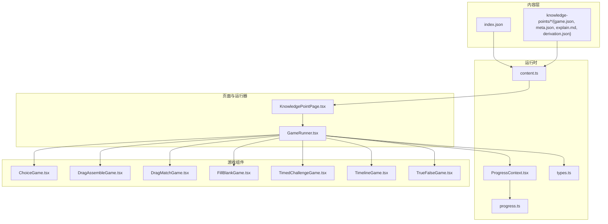
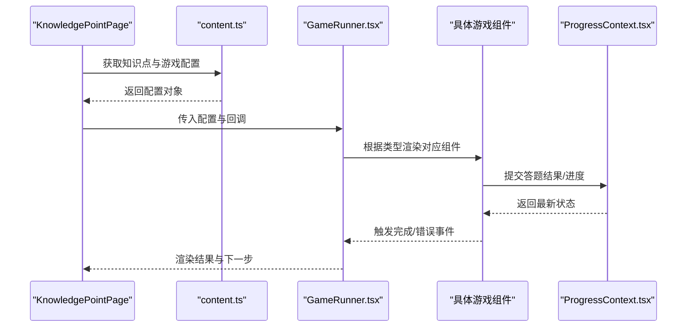
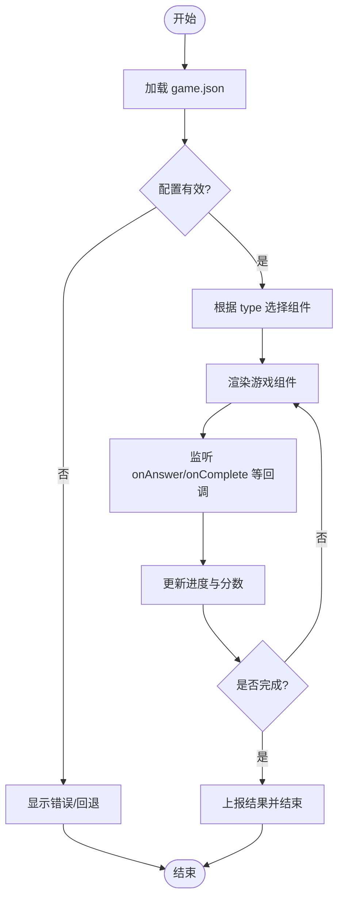
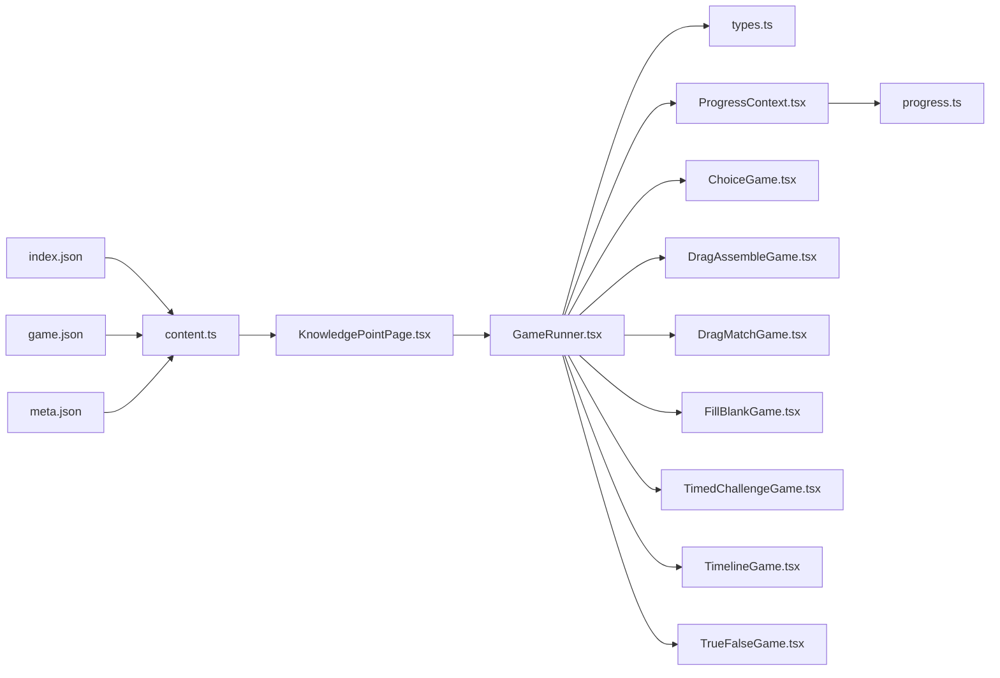

# 游戏引擎

<cite>
**本文引用的文件**   
- [GameRunner.tsx](file://src/components/GameRunner.tsx)
- [ChoiceGame.tsx](file://src/components/games/ChoiceGame.tsx)
- [DragAssembleGame.tsx](file://src/components/games/DragAssembleGame.tsx)
- [DragMatchGame.tsx](file://src/components/games/DragMatchGame.tsx)
- [FillBlankGame.tsx](file://src/components/games/FillBlankGame.tsx)
- [TimedChallengeGame.tsx](file://src/components/games/TimedChallengeGame.tsx)
- [TimelineGame.tsx](file://src/components/games/TimelineGame.tsx)
- [TrueFalseGame.tsx](file://src/components/games/TrueFalseGame.tsx)
- [ProgressContext.tsx](file://src/context/ProgressContext.tsx)
- [content.ts](file://src/lib/content.ts)
- [progress.ts](file://src/lib/progress.ts)
- [types.ts](file://src/lib/types.ts)
- [KnowledgePointPage.tsx](file://src/pages/KnowledgePointPage.tsx)
- [game.json](file://src/content/knowledge-points/g3-add-sub-10000/game.json)
- [meta.json](file://src/content/knowledge-points/g3-add-sub-10000/meta.json)
- [index.json](file://src/content/index.json)
</cite>

## 目录
1. [简介](#简介)
2. [项目结构](#项目结构)
3. [核心组件](#核心组件)
4. [架构总览](#架构总览)
5. [详细组件分析](#详细组件分析)
6. [依赖关系分析](#依赖关系分析)
7. [性能考量](#性能考量)
8. [故障排查指南](#故障排查指南)
9. [结论](#结论)
10. [附录：自定义游戏开发指南](#附录自定义游戏开发指南)

## 简介
本技术文档面向 math-k7 数学练习游戏引擎，系统性阐述运行器架构、统一的游戏接口设计、不同类型游戏的实现模式与扩展方式。重点说明 GameRunner 如何协调选择题、拖拽组装、匹配、填空、限时挑战、时间线排序、判断对错等游戏类型的执行流程；记录游戏配置接口、状态管理机制与用户交互处理；并提供从组件开发到配置文件编写的完整指南与最佳实践。

## 项目结构
项目采用“内容驱动 + 组件化”的架构：
- 内容层：以 knowledge-points 为粒度组织每个知识点的解释、元数据与游戏配置（game.json、meta.json、explain.md、derivation.json）。
- 运行时：通过 content.ts 加载并解析内容索引与知识点信息，由 ProgressContext 管理学习进度与持久化。
- 渲染层：页面组件（如 KnowledgePointPage）负责导航与挂载 GameRunner；GameRunner 根据 game.json 动态选择并渲染具体游戏组件。
- 可视化层：visualizations 提供通用数学可视化组件，供各游戏复用。

图表来源
- [content.ts](file://src/lib/content.ts)
- [ProgressContext.tsx](file://src/context/ProgressContext.tsx)
- [progress.ts](file://src/lib/progress.ts)
- [types.ts](file://src/lib/types.ts)
- [KnowledgePointPage.tsx](file://src/pages/KnowledgePointPage.tsx)
- [GameRunner.tsx](file://src/components/GameRunner.tsx)
- [index.json](file://src/content/index.json)
- [game.json](file://src/content/knowledge-points/g3-add-sub-10000/game.json)
- [meta.json](file://src/content/knowledge-points/g3-add-sub-10000/meta.json)

章节来源
- [content.ts](file://src/lib/content.ts)
- [ProgressContext.tsx](file://src/context/ProgressContext.tsx)
- [progress.ts](file://src/lib/progress.ts)
- [types.ts](file://src/lib/types.ts)
- [KnowledgePointPage.tsx](file://src/pages/KnowledgePointPage.tsx)
- [GameRunner.tsx](file://src/components/GameRunner.tsx)
- [index.json](file://src/content/index.json)
- [game.json](file://src/content/knowledge-points/g3-add-sub-10000/game.json)
- [meta.json](file://src/content/knowledge-points/g3-add-sub-10000/meta.json)

## 核心组件
- 内容加载器 content.ts：聚合 index.json 与各知识点的 game.json/meta.json，提供按知识点查询与校验能力。
- 进度上下文 ProgressContext.tsx：集中管理学习进度、得分、完成状态，支持本地持久化与跨组件共享。
- 运行器 GameRunner.tsx：根据当前知识点配置动态选择并渲染对应游戏组件，统一生命周期与结果上报。
- 游戏组件族：ChoiceGame、DragAssembleGame、DragMatchGame、FillBlankGame、TimedChallengeGame、TimelineGame、TrueFalseGame，均遵循统一接口契约。
- 类型定义 types.ts：定义游戏配置、状态、事件回调的统一类型约束。

章节来源
- [content.ts](file://src/lib/content.ts)
- [ProgressContext.tsx](file://src/context/ProgressContext.tsx)
- [GameRunner.tsx](file://src/components/GameRunner.tsx)
- [types.ts](file://src/lib/types.ts)

## 架构总览
系统采用“配置驱动 + 组件路由”的运行模式：
- 配置驱动：每个知识点通过 game.json 声明游戏类型、题目集、参数与评分规则。
- 组件路由：GameRunner 读取配置后，将 props 注入到对应的游戏组件实例。
- 状态同步：游戏组件通过回调向 ProgressContext 提交答题结果，统一更新进度与分数。
- 页面集成：KnowledgePointPage 负责加载知识点内容与挂载运行器。

图表来源
- [KnowledgePointPage.tsx](file://src/pages/KnowledgePointPage.tsx)
- [content.ts](file://src/lib/content.ts)
- [GameRunner.tsx](file://src/components/GameRunner.tsx)
- [ProgressContext.tsx](file://src/context/ProgressContext.tsx)

## 详细组件分析

### 统一游戏接口设计
所有游戏组件遵循统一的输入输出契约，便于 GameRunner 无差别调度：
- 输入属性（props）
  - 配置：包含题型、题目集合、选项、答案、提示、难度、计时等字段。
  - 回调：onAnswer、onComplete、onError、onExit 等事件。
  - 上下文：进度上下文、主题、语言等。
- 输出事件
  - 答题反馈：正确/错误判定与即时反馈。
  - 完成信号：提交最终结果与用时统计。
  - 错误处理：非法输入或配置缺失时的降级策略。

章节来源
- [types.ts](file://src/lib/types.ts)
- [GameRunner.tsx](file://src/components/GameRunner.tsx)

### 运行器 GameRunner
职责
- 解析 game.json，校验必要字段。
- 根据 type 字段映射到具体游戏组件。
- 统一管理生命周期：初始化、进行中、完成、重试、退出。
- 汇总结果并上报至 ProgressContext。

关键流程
- 配置校验：检查必填字段与数据类型。
- 组件选择：基于 type 进行条件渲染。
- 状态同步：监听子组件回调，更新进度与分数。
- 错误边界：捕获渲染异常与运行时错误，提供回退视图。

图表来源
- [GameRunner.tsx](file://src/components/GameRunner.tsx)
- [content.ts](file://src/lib/content.ts)

章节来源
- [GameRunner.tsx](file://src/components/GameRunner.tsx)
- [content.ts](file://src/lib/content.ts)

### 选择题 ChoiceGame
- 目标：从多个选项中选出正确答案，支持单选/多选。
- 交互：点击选项、提交答案、即时反馈。
- 计分：按正确率与用时计算得分。
- 适配：支持图文混排与公式展示。

章节来源
- [ChoiceGame.tsx](file://src/components/games/ChoiceGame.tsx)

### 拖拽组装 DragAssembleGame
- 目标：将打散的片段拖拽到正确位置，组成完整表达式或图形。
- 交互：拖放区域、吸附校验、撤销重排。
- 计分：按步骤数与错误次数加权。
- 适配：支持多行文本与几何图形拼接。

章节来源
- [DragAssembleGame.tsx](file://src/components/games/DragAssembleGame.tsx)

### 拖拽匹配 DragMatchGame
- 目标：将左右两列元素进行配对连线。
- 交互：拖拽起点与终点、连线高亮、冲突检测。
- 计分：按配对正确率与耗时评估。
- 适配：支持数值、符号、图像等多模态元素。

章节来源
- [DragMatchGame.tsx](file://src/components/games/DragMatchGame.tsx)

### 填空题 FillBlankGame
- 目标：在空白处填入正确的数字或表达式。
- 交互：输入校验、自动格式化、容错比较。
- 计分：按精确度与尝试次数计算。
- 适配：支持单位、小数、分数等多种格式。

章节来源
- [FillBlankGame.tsx](file://src/components/games/FillBlankGame.tsx)

### 限时挑战 TimedChallengeGame
- 目标：在限定时间内完成若干题目。
- 交互：倒计时、暂停/继续、提前提交。
- 计分：按完成题数与剩余时间加权。
- 适配：可与其他题型组合使用。

章节来源
- [TimedChallengeGame.tsx](file://src/components/games/TimedChallengeGame.tsx)

### 时间线排序 TimelineGame
- 目标：将事件或步骤按正确顺序排列。
- 交互：拖拽排序、插入删除、预览效果。
- 计分：按序列相似度与操作步数评估。
- 适配：适用于解题步骤、历史事件等场景。

章节来源
- [TimelineGame.tsx](file://src/components/games/TimelineGame.tsx)

### 判断题 TrueFalseGame
- 目标：对陈述句进行真假判断。
- 交互：切换开关、确认提交、即时反馈。
- 计分：按正确率与响应速度计算。
- 适配：适合概念辨析与性质判断。

章节来源
- [TrueFalseGame.tsx](file://src/components/games/TrueFalseGame.tsx)

## 依赖关系分析
- 内容依赖：content.ts 依赖 index.json 与各知识点的 game.json/meta.json。
- 运行依赖：GameRunner 依赖 types.ts 的类型定义与 ProgressContext 的状态管理。
- 页面依赖：KnowledgePointPage 依赖 content.ts 与 GameRunner。
- 游戏组件依赖：各游戏组件依赖 types.ts 与 ProgressContext。

图表来源
- [content.ts](file://src/lib/content.ts)
- [types.ts](file://src/lib/types.ts)
- [ProgressContext.tsx](file://src/context/ProgressContext.tsx)
- [progress.ts](file://src/lib/progress.ts)
- [KnowledgePointPage.tsx](file://src/pages/KnowledgePointPage.tsx)
- [GameRunner.tsx](file://src/components/GameRunner.tsx)
- [index.json](file://src/content/index.json)
- [game.json](file://src/content/knowledge-points/g3-add-sub-10000/game.json)
- [meta.json](file://src/content/knowledge-points/g3-add-sub-10000/meta.json)

章节来源
- [content.ts](file://src/lib/content.ts)
- [types.ts](file://src/lib/types.ts)
- [ProgressContext.tsx](file://src/context/ProgressContext.tsx)
- [progress.ts](file://src/lib/progress.ts)
- [KnowledgePointPage.tsx](file://src/pages/KnowledgePointPage.tsx)
- [GameRunner.tsx](file://src/components/GameRunner.tsx)
- [index.json](file://src/content/index.json)
- [game.json](file://src/content/knowledge-points/g3-add-sub-10000/game.json)
- [meta.json](file://src/content/knowledge-points/g3-add-sub-10000/meta.json)

## 性能考量
- 懒加载与按需渲染：仅在需要时渲染当前游戏组件，避免一次性加载全部资源。
- 状态最小化：仅保留必要的 UI 状态，减少重渲染范围。
- 计算优化：复杂校验与比较逻辑应缓存结果，避免重复计算。
- 动画与交互：限制同时进行的动画数量，使用 requestAnimationFrame 平滑过渡。
- 内存管理：及时清理定时器与事件监听器，防止内存泄漏。

[本节为通用指导，不直接分析具体文件]

## 故障排查指南
常见问题与定位方法：
- 配置缺失或类型错误：检查 game.json 的必填字段与类型是否符合 types.ts 定义。
- 进度未更新：确认游戏组件是否正确调用 onAnswer/onComplete 回调，且 ProgressContext 已订阅。
- 渲染异常：查看 GameRunner 的错误边界日志，定位具体组件与入参。
- 交互卡顿：检查拖拽与动画逻辑，确保没有阻塞主线程的计算。

章节来源
- [GameRunner.tsx](file://src/components/GameRunner.tsx)
- [ProgressContext.tsx](file://src/context/ProgressContext.tsx)
- [types.ts](file://src/lib/types.ts)

## 结论
math-k7 游戏引擎通过“配置驱动 + 组件路由”的架构，实现了灵活可扩展的多题型数学练习平台。GameRunner 作为中枢，统一了不同游戏的生命周期与状态管理；ProgressContext 提供了稳定的进度与分数持久化；types.ts 确保了类型安全与一致性。开发者只需遵循统一接口与配置规范，即可快速接入新题型与可视化能力。

[本节为总结性内容，不直接分析具体文件]

## 附录：自定义游戏开发指南

### 开发步骤
- 新建游戏组件：在 components/games 下创建新组件，遵循统一 props 与回调约定。
- 定义类型：在 types.ts 中补充新的配置字段与事件类型。
- 编写配置：在对应知识点的 game.json 中添加新题型条目，确保必填字段齐全。
- 集成运行器：确认 GameRunner 能识别新 type 并正确渲染。
- 测试验证：覆盖正常路径、边界条件与错误分支，确保进度上报无误。

### 配置文件规范（game.json）
- 必填字段
  - type：游戏类型标识（如 choice、drag_assemble、fill_blank 等）。
  - questions：题目数组，包含题干、选项、答案、提示等。
  - scoring：评分规则，包括权重、超时惩罚、容错阈值等。
  - settings：可选设置，如主题、语言、是否允许重试等。
- 推荐字段
  - difficulty：难度等级。
  - hints：提示列表。
  - media：媒体资源引用（图片、音频、视频）。
  - validation：自定义校验函数或规则描述。

章节来源
- [game.json](file://src/content/knowledge-points/g3-add-sub-10000/game.json)
- [meta.json](file://src/content/knowledge-points/g3-add-sub-10000/meta.json)
- [types.ts](file://src/lib/types.ts)

### 最佳实践
- 单一职责：每个游戏组件只关注一种题型的核心交互。
- 可配置化：将可变部分抽离为配置项，避免硬编码。
- 可访问性：提供键盘导航与屏幕阅读器支持。
- 可测试性：为关键逻辑编写单元测试，覆盖边界情况。
- 可维护性：保持代码结构与命名一致，添加必要注释。

[本节为通用指导，不直接分析具体文件]