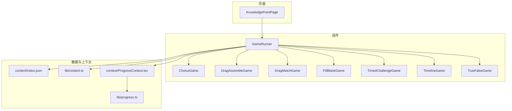
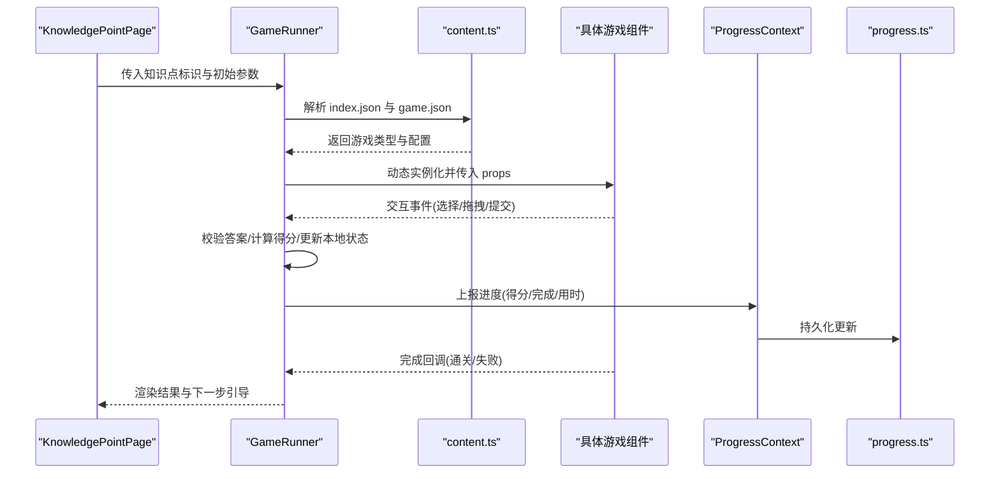
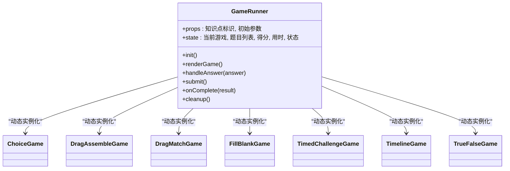
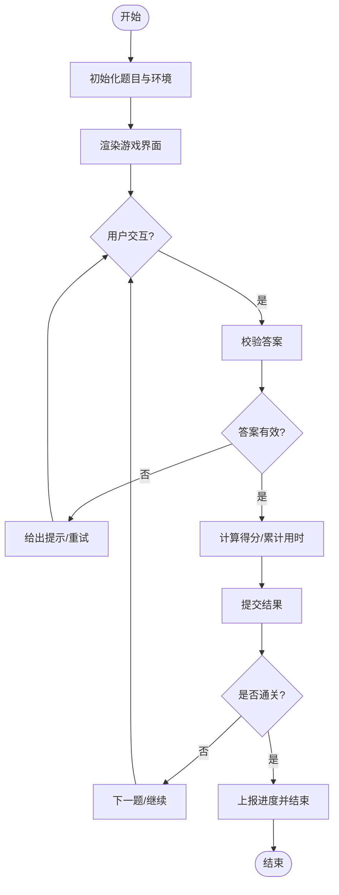
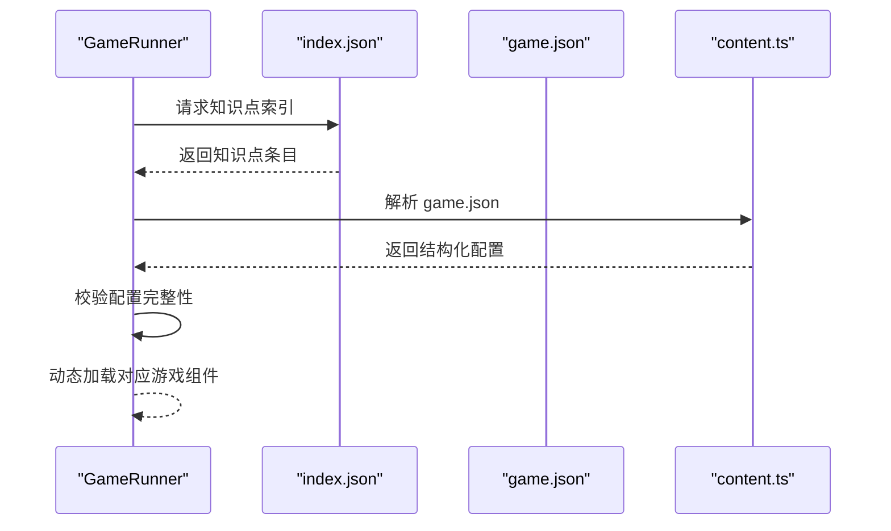
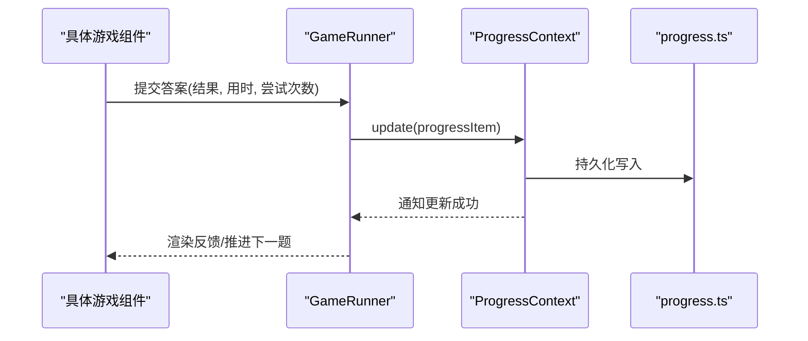
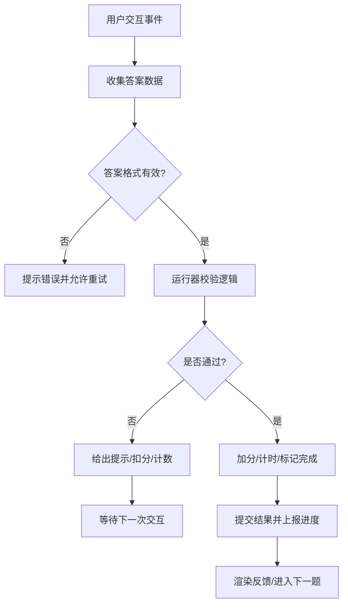
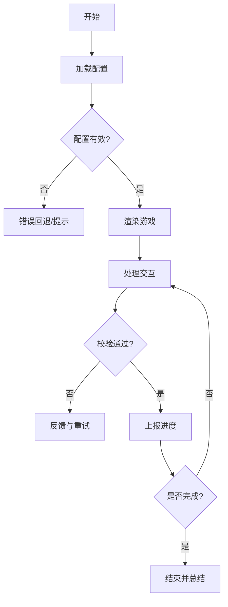
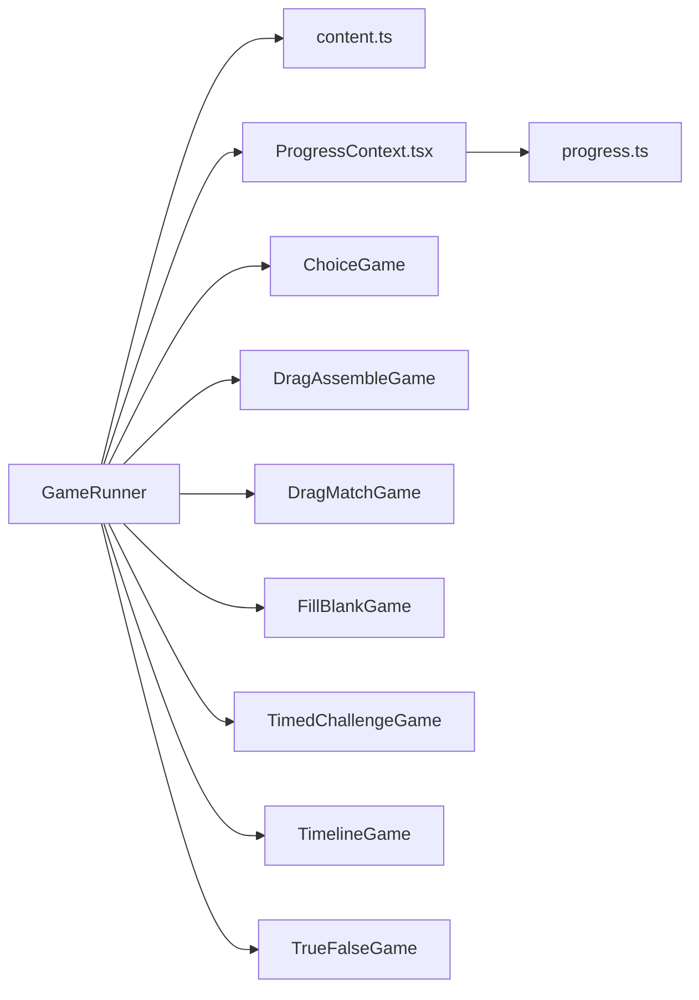

# 游戏运行器架构

<cite>
**本文引用的文件**   
- [GameRunner.tsx](file://src/components/GameRunner.tsx)
- [ChoiceGame.tsx](file://src/components/games/ChoiceGame.tsx)
- [DragAssembleGame.tsx](file://src/components/games/DragAssembleGame.tsx)
- [DragMatchGame.tsx](file://src/components/games/DragMatchGame.tsx)
- [FillBlankGame.tsx](file://src/components/games/FillBlankGame.tsx)
- [TimedChallengeGame.tsx](file://src/components/games/TimedChallengeGame.tsx)
- [TimelineGame.tsx](file://src/components/games/TimelineGame.tsx)
- [TrueFalseGame.tsx](file://src/components/games/TrueFalseGame.tsx)
- [ProgressContext.tsx](file://src/context/ProgressContext.tsx)
- [content.ts](file://src/lib/content.ts)
- [progress.ts](file://src/lib/progress.ts)
- [types.ts](file://src/lib/types.ts)
- [KnowledgePointPage.tsx](file://src/pages/KnowledgePointPage.tsx)
- [index.json](file://src/content/index.json)
</cite>

## 目录
1. [简介](#简介)
2. [项目结构](#项目结构)
3. [核心组件](#核心组件)
4. [架构总览](#架构总览)
5. [详细组件分析](#详细组件分析)
6. [依赖关系分析](#依赖关系分析)
7. [性能考量](#性能考量)
8. [故障排查指南](#故障排查指南)
9. [结论](#结论)
10. [附录](#附录)

## 简介
本技术文档围绕 math-k6 的“游戏运行器”架构展开，重点解析 GameRunner 组件如何动态加载并协调多种数学练习游戏。文档涵盖统一的游戏接口设计、生命周期管理、状态同步机制与用户交互处理流程，并记录游戏配置解析、错误处理与性能优化策略。同时提供扩展新游戏的最佳实践与示例路径，帮助开发者快速接入新的游戏类型。

## 项目结构
- 组件层
  - GameRunner：统一的游戏运行器，负责根据知识点配置动态选择并渲染具体游戏组件，管理生命周期与状态同步。
  - games/*：各类具体游戏实现（选择题、拖拽拼装、拖拽匹配、填空、限时挑战、时间线、判断对错等）。
  - DerivationPlayer、KnowledgePoint、Layout：辅助展示与布局组件。
- 数据与上下文
  - content/index.json：知识点索引，用于导航与内容组织。
  - lib/content.ts：知识点与游戏配置的读取与解析。
  - lib/progress.ts：学习进度读写与持久化。
  - context/ProgressContext.tsx：全局进度上下文，供各组件订阅更新。
- 页面层
  - KnowledgePointPage：知识点详情页，集成 GameRunner 进行游戏运行。
- 可视化库
  - visualizations/*：数学可视化组件，被不同游戏复用。

**图表来源** 
- [KnowledgePointPage.tsx](file://src/pages/KnowledgePointPage.tsx)
- [GameRunner.tsx](file://src/components/GameRunner.tsx)
- [content.ts](file://src/lib/content.ts)
- [index.json](file://src/content/index.json)
- [ProgressContext.tsx](file://src/context/ProgressContext.tsx)
- [progress.ts](file://src/lib/progress.ts)

**章节来源**
- [KnowledgePointPage.tsx](file://src/pages/KnowledgePointPage.tsx)
- [GameRunner.tsx](file://src/components/GameRunner.tsx)
- [content.ts](file://src/lib/content.ts)
- [index.json](file://src/content/index.json)
- [ProgressContext.tsx](file://src/context/ProgressContext.tsx)
- [progress.ts](file://src/lib/progress.ts)

## 核心组件
- GameRunner 职责
  - 解析知识点配置，确定要运行的游戏类型与参数。
  - 动态加载对应游戏组件，挂载/卸载生命周期管理。
  - 维护游戏运行状态（题目、答案、得分、计时、提示等），并与全局进度上下文同步。
  - 处理用户交互事件，校验答案、计算得分、触发反馈与下一题推进。
  - 错误边界与降级策略：当配置或资源异常时回退到安全视图。
- 统一游戏接口
  - 输入：题目数据、难度、主题、可视化参数等。
  - 输出：答题结果、得分增量、完成标志、额外元数据（用时、尝试次数）。
  - 生命周期：初始化、渲染、交互回调、提交校验、完成回调、销毁清理。
- 状态同步机制
  - 通过 ProgressContext 将每次答题结果上报，持久化至 progress.ts。
  - 支持实时刷新与跨组件共享进度。

**章节来源**
- [GameRunner.tsx](file://src/components/GameRunner.tsx)
- [ProgressContext.tsx](file://src/context/ProgressContext.tsx)
- [progress.ts](file://src/lib/progress.ts)

## 架构总览
下图展示了从页面到运行器再到具体游戏的数据流与控制流。

**图表来源** 
- [KnowledgePointPage.tsx](file://src/pages/KnowledgePointPage.tsx)
- [GameRunner.tsx](file://src/components/GameRunner.tsx)
- [content.ts](file://src/lib/content.ts)
- [ProgressContext.tsx](file://src/context/ProgressContext.tsx)
- [progress.ts](file://src/lib/progress.ts)

## 详细组件分析

### GameRunner 组件分析
- 设计模式
  - 工厂模式：根据配置动态创建具体游戏实例。
  - 观察者模式：订阅进度上下文变化，驱动 UI 更新。
  - 策略模式：不同游戏实现统一的交互与结果接口，便于替换与扩展。
- 生命周期管理
  - 初始化阶段：拉取配置、校验必要字段、准备默认状态。
  - 运行阶段：渲染游戏、监听交互、校验答案、累计得分、计时控制。
  - 结束阶段：汇总结果、上报进度、释放资源、清理定时器。
- 状态同步
  - 使用 ProgressContext 作为单一事实源，确保多组件一致。
  - 对关键操作进行防抖/节流，避免频繁写入存储。
- 错误处理
  - 配置缺失或格式错误：回退到默认游戏或显示错误页。
  - 运行时异常：捕获并上报，保留可调试信息。
- 性能优化
  - 按需加载游戏组件，减少首屏体积。
  - 使用 React.memo/懒加载优化重渲染。
  - 批量合并进度更新，降低 I/O 压力。

**图表来源** 
- [GameRunner.tsx](file://src/components/GameRunner.tsx)
- [ChoiceGame.tsx](file://src/components/games/ChoiceGame.tsx)
- [DragAssembleGame.tsx](file://src/components/games/DragAssembleGame.tsx)
- [DragMatchGame.tsx](file://src/components/games/DragMatchGame.tsx)
- [FillBlankGame.tsx](file://src/components/games/FillBlankGame.tsx)
- [TimedChallengeGame.tsx](file://src/components/games/TimedChallengeGame.tsx)
- [TimelineGame.tsx](file://src/components/games/TimelineGame.tsx)
- [TrueFalseGame.tsx](file://src/components/games/TrueFalseGame.tsx)

**章节来源**
- [GameRunner.tsx](file://src/components/GameRunner.tsx)

### 统一游戏接口设计
- 输入契约
  - 题目数据：题干、选项/目标、正确答案、提示、难度等级。
  - 环境参数：主题、可视化开关、计时限制、重试次数。
- 输出契约
  - 答题结果：正确/错误、得分、用时、尝试次数。
  - 完成信号：是否通关、是否需要进入下一关。
- 生命周期钩子
  - onInit：初始化题目与状态。
  - onAnswer：接收用户答案并返回校验结果。
  - onSubmit：提交最终答案，触发得分与进度上报。
  - onComplete：完成回调，供运行器汇总统计。
  - onDestroy：清理定时器与事件监听。

**图表来源** 
- [GameRunner.tsx](file://src/components/GameRunner.tsx)

**章节来源**
- [GameRunner.tsx](file://src/components/GameRunner.tsx)

### 配置解析与加载流程
- 配置文件
  - index.json：知识点索引，包含标题、描述、关联游戏 ID 等。
  - game.json：每个知识点的游戏配置，定义游戏类型、题目集、规则与参数。
- 解析步骤
  - 读取 index.json，定位目标知识点。
  - 根据知识点 ID 获取 game.json，解析游戏类型与参数。
  - 校验必填字段（如游戏类型、题目数组），缺失则回退。
  - 将解析后的配置传递给 GameRunner，由其动态加载游戏组件。

**图表来源** 
- [GameRunner.tsx](file://src/components/GameRunner.tsx)
- [content.ts](file://src/lib/content.ts)
- [index.json](file://src/content/index.json)

**章节来源**
- [content.ts](file://src/lib/content.ts)
- [index.json](file://src/content/index.json)

### 状态同步与进度上报
- 上下文模型
  - ProgressContext 提供 get/set/update 方法，集中管理进度。
  - 进度项包括：知识点ID、题目ID、得分、用时、完成状态、尝试次数。
- 同步策略
  - 每次提交答案后调用 update，触发订阅者更新。
  - 使用防抖合并多次更新，降低存储写入频率。
  - 持久化到 localStorage 或后端 API（由 progress.ts 决定）。

**图表来源** 
- [ProgressContext.tsx](file://src/context/ProgressContext.tsx)
- [progress.ts](file://src/lib/progress.ts)
- [GameRunner.tsx](file://src/components/GameRunner.tsx)

**章节来源**
- [ProgressContext.tsx](file://src/context/ProgressContext.tsx)
- [progress.ts](file://src/lib/progress.ts)

### 用户交互处理流程
- 交互类型
  - 选择题：点击选项，即时校验或延迟提交。
  - 拖拽类：拖放落点校验，支持撤销与重置。
  - 填空题：输入校验，正则匹配或模糊匹配。
  - 限时挑战：倒计时控制，超时自动提交。
  - 时间线：排序/定位，区间判定。
  - 判断对错：布尔选择，即时反馈。
- 处理原则
  - 统一入口：所有交互通过 onAnswer 回调进入运行器。
  - 校验策略：先本地校验，再提交；错误给出明确提示。
  - 防误触：重复提交保护，提交后禁用输入直到反馈。

**图表来源** 
- [GameRunner.tsx](file://src/components/GameRunner.tsx)

**章节来源**
- [GameRunner.tsx](file://src/components/GameRunner.tsx)

### 具体游戏组件分析（示例）
- ChoiceGame
  - 特点：单选/多选，支持随机打乱选项，即时反馈。
  - 关键点：选项去重、答案标准化、易混淆项提示。
- DragAssembleGame
  - 特点：拖拽拼装图形或表达式，落点校验严格。
  - 关键点：坐标映射、碰撞检测、撤销栈。
- DragMatchGame
  - 特点：左右配对拖拽，支持部分完成保存。
  - 关键点：双向绑定、匹配唯一性约束。
- FillBlankGame
  - 特点：填空输入，支持单位与精度容差。
  - 关键点：输入清洗、正则验证、错误高亮。
- TimedChallengeGame
  - 特点：限时作答，倒计时与自动提交。
  - 关键点：定时器管理、暂停/恢复、超时处理。
- TimelineGame
  - 特点：时间轴排序或定位，区间判定。
  - 关键点：时间解析、相对顺序校验、可视化反馈。
- TrueFalseGame
  - 特点：判断对错，简单直接。
  - 关键点：快速反馈、连续正确奖励。

**章节来源**
- [ChoiceGame.tsx](file://src/components/games/ChoiceGame.tsx)
- [DragAssembleGame.tsx](file://src/components/games/DragAssembleGame.tsx)
- [DragMatchGame.tsx](file://src/components/games/DragMatchGame.tsx)
- [FillBlankGame.tsx](file://src/components/games/FillBlankGame.tsx)
- [TimedChallengeGame.tsx](file://src/components/games/TimedChallengeGame.tsx)
- [TimelineGame.tsx](file://src/components/games/TimelineGame.tsx)
- [TrueFalseGame.tsx](file://src/components/games/TrueFalseGame.tsx)

### 概念总览
以下流程图概括了运行器的通用工作流，不绑定具体代码文件，适用于任何新增游戏类型的接入。

[本图为概念流程，无需图表来源]

## 依赖关系分析
- 组件耦合
  - GameRunner 与 content.ts 强耦合（配置解析），与 ProgressContext 松耦合（状态同步）。
  - 各游戏组件仅依赖统一接口，低耦合高内聚。
- 外部依赖
  - 存储层：progress.ts 抽象持久化，便于切换后端或缓存策略。
  - 可视化库：visualizations/* 被多个游戏复用，提升一致性。
- 潜在循环依赖
  - 避免在 progress.ts 中反向引用 GameRunner，保持单向依赖。

**图表来源** 
- [GameRunner.tsx](file://src/components/GameRunner.tsx)
- [content.ts](file://src/lib/content.ts)
- [ProgressContext.tsx](file://src/context/ProgressContext.tsx)
- [progress.ts](file://src/lib/progress.ts)

**章节来源**
- [GameRunner.tsx](file://src/components/GameRunner.tsx)
- [content.ts](file://src/lib/content.ts)
- [ProgressContext.tsx](file://src/context/ProgressContext.tsx)
- [progress.ts](file://src/lib/progress.ts)

## 性能考量
- 组件级优化
  - 使用 React.memo 包裹纯展示组件，减少不必要重渲染。
  - 对大型题目集合采用分页或虚拟滚动。
- 运行时优化
  - 懒加载游戏组件，按需引入，降低首屏体积。
  - 合并进度更新，使用防抖/节流减少 I/O 频率。
  - 定时器管理：及时清理，避免内存泄漏。
- 数据层优化
  - 缓存已解析的配置，避免重复 IO。
  - 使用增量更新而非全量覆盖，提高响应速度。

[本节为通用指导，无需章节来源]

## 故障排查指南
- 常见问题
  - 配置缺失或格式错误：检查 index.json 与 game.json 的必填字段与类型。
  - 进度未更新：确认 ProgressContext 的 update 调用与持久化链路。
  - 游戏无响应：检查交互事件绑定与答案校验逻辑。
  - 内存泄漏：确认定时器与事件监听在 onDestroy 中清理。
- 调试建议
  - 在 GameRunner 的关键节点添加日志，追踪状态变化。
  - 使用浏览器开发者工具监控网络与存储写入。
  - 对复杂游戏增加单元测试，覆盖边界条件。

**章节来源**
- [GameRunner.tsx](file://src/components/GameRunner.tsx)
- [ProgressContext.tsx](file://src/context/ProgressContext.tsx)
- [progress.ts](file://src/lib/progress.ts)

## 结论
GameRunner 通过统一接口、工厂模式与上下文同步，实现了灵活可扩展的游戏运行体系。开发者只需遵循统一契约，即可快速接入新游戏类型。配合合理的配置解析、错误处理与性能优化策略，系统具备良好的可维护性与扩展性。

[本节为总结，无需章节来源]

## 附录
- 扩展新游戏最佳实践
  - 定义统一接口：确保 onInit/onAnswer/onSubmit/onComplete/onDestroy 完整实现。
  - 编写最小可用版本：先实现核心交互与校验，再逐步增强功能。
  - 注册与配置：在 index.json 中添加条目，在 game.json 中声明类型与参数。
  - 测试覆盖：针对边界条件与异常路径编写用例。
- 参考实现路径
  - 选择题示例：[ChoiceGame.tsx](file://src/components/games/ChoiceGame.tsx)
  - 拖拽拼装示例：[DragAssembleGame.tsx](file://src/components/games/DragAssembleGame.tsx)
  - 限时挑战示例：[TimedChallengeGame.tsx](file://src/components/games/TimedChallengeGame.tsx)

[本节为补充说明，无需章节来源]