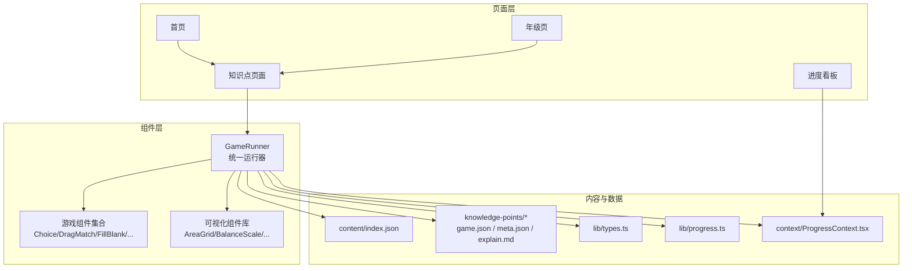
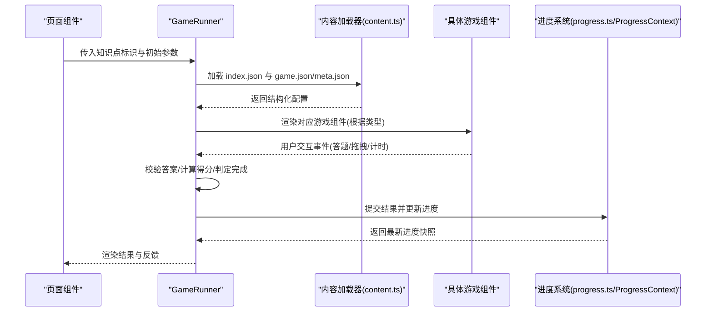
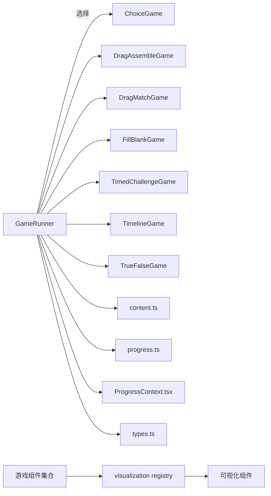
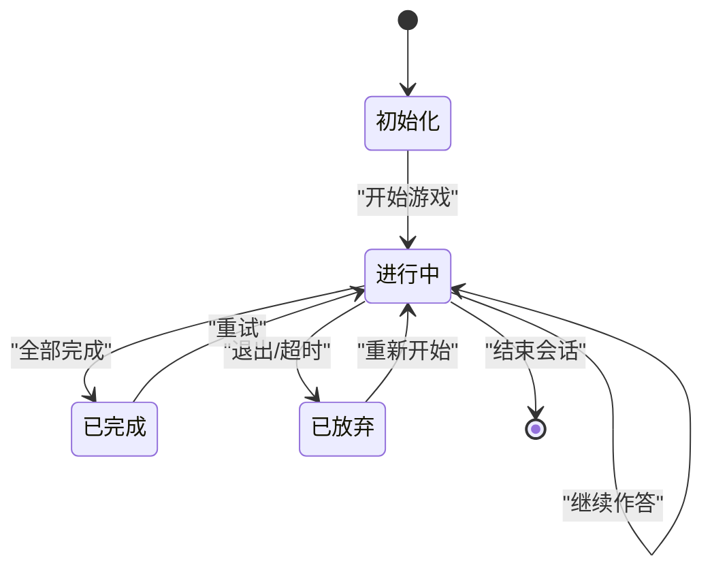

# 自定义游戏开发

<cite>
**本文引用的文件**   
- [GameRunner.tsx](file://src/components/GameRunner.tsx)
- [ChoiceGame.tsx](file://src/components/games/ChoiceGame.tsx)
- [DragAssembleGame.tsx](file://src/components/games/DragAssembleGame.tsx)
- [DragMatchGame.tsx](file://src/components/games/DragMatchGame.tsx)
- [FillBlankGame.tsx](file://src/components/games/FillBlankGame.tsx)
- [TimedChallengeGame.tsx](file://src/components/games/TimedChallengeGame.tsx)
- [TimelineGame.tsx](file://src/components/games/TimelineGame.tsx)
- [TrueFalseGame.tsx](file://src/components/games/TrueFalseGame.tsx)
- [ProgressContext.tsx](file://src/context/ProgressContext.tsx)
- [progress.ts](file://src/lib/progress.ts)
- [types.ts](file://src/lib/types.ts)
- [content.ts](file://src/lib/content.ts)
- [index.json](file://src/content/index.json)
- [game.json](file://src/content/knowledge-points/g3-add-sub-10000/game.json)
- [meta.json](file://src/content/knowledge-points/g3-add-sub-10000/meta.json)
- [explain.md](file://src/content/knowledge-points/g3-add-sub-10000/explain.md)
- [derivation.json](file://src/content/knowledge-points/g3-fraction-add-sub/derivation.json)
- [AreaGrid.tsx](file://src/visualizations/AreaGrid.tsx)
- [BalanceScale.tsx](file://src/visualizations/BalanceScale.tsx)
- [BarChart.tsx](file://src/visualizations/BarChart.tsx)
- [CircleUnroll.tsx](file://src/visualizations/CircleUnroll.tsx)
- [ClockDial.tsx](file://src/visualizations/ClockDial.tsx)
- [ConeModel.tsx](file://src/visualizations/ConeModel.tsx)
- [CoordinateGrid.tsx](file://src/visualizations/CoordinateGrid.tsx)
- [CuboidModel.tsx](file://src/visualizations/CuboidModel.tsx)
- [CylinderModel.tsx](file://src/visualizations/CylinderModel.tsx)
- [FractionPie.tsx](file://src/visualizations/FractionPie.tsx)
- [NumberLine.tsx](file://src/visualizations/NumberLine.tsx)
- [PieChart.tsx](file://src/visualizations/PieChart.tsx)
- [PlaceValueChart.tsx](file://src/visualizations/PlaceValueChart.tsx)
- [ProbabilityModel.tsx](file://src/visualizations/ProbabilityModel.tsx)
- [Protractor.tsx](file://src/visualizations/Protractor.tsx)
- [ShapeTransform.tsx](file://src/visualizations/ShapeTransform.tsx)
- [registry.tsx](file://src/visualizations/registry.tsx)
</cite>

## 目录
1. [简介](#简介)
2. [项目结构](#项目结构)
3. [核心组件](#核心组件)
4. [架构总览](#架构总览)
5. [详细组件分析](#详细组件分析)
6. [依赖关系分析](#依赖关系分析)
7. [性能考量](#性能考量)
8. [故障排查指南](#故障排查指南)
9. [结论](#结论)
10. [附录](#附录)

## 简介
本指南面向希望在 math-k6 中开发“自定义数学游戏”的开发者。内容覆盖：
- 如何创建新的游戏类型（组件结构、接口约定、与 GameRunner 集成）
- 游戏配置文件的标准格式、字段定义与数据验证规则
- 游戏状态管理、用户交互处理、评分系统与进度跟踪的实现方法
- 从基础到高级的开发示例，包括复杂数学游戏的开发模式与性能优化技巧

目标读者：前端开发者、教育产品工程师、对 React + TypeScript 有基本了解的学习者。

## 项目结构
math-k6 采用“按功能域组织”的结构：
- src/components/games：具体游戏实现（如选择题、拖拽匹配、填空等）
- src/components/GameRunner.tsx：统一的游戏运行器，负责加载配置、渲染游戏、收集结果并上报进度
- src/context/ProgressContext.tsx：全局进度上下文，提供进度读写能力
- src/lib：类型定义、内容加载、进度持久化等通用库
- src/content：知识点内容（解释、元信息、游戏配置），每个知识点一个目录
- src/visualizations：可视化组件库，供游戏或讲解使用
- src/pages：页面路由与展示

图表来源
- [GameRunner.tsx](file://src/components/GameRunner.tsx)
- [index.json](file://src/content/index.json)
- [progress.ts](file://src/lib/progress.ts)
- [ProgressContext.tsx](file://src/context/ProgressContext.tsx)
- [types.ts](file://src/lib/types.ts)

章节来源
- [GameRunner.tsx](file://src/components/GameRunner.tsx)
- [index.json](file://src/content/index.json)
- [progress.ts](file://src/lib/progress.ts)
- [ProgressContext.tsx](file://src/context/ProgressContext.tsx)
- [types.ts](file://src/lib/types.ts)

## 核心组件
- GameRunner：统一入口，负责解析知识点目录下的 game.json，选择并渲染对应游戏组件，管理生命周期、提交结果、更新进度。
- 游戏组件：每个游戏实现统一的交互契约（输入、校验、得分、完成回调），并通过 props 与 GameRunner 通信。
- 进度系统：ProgressContext 提供全局状态，progress.ts 负责持久化存储与计算。
- 内容系统：content.ts 读取 index.json 与各知识点的 game.json/meta.json/explain.md，为页面与运行器提供结构化数据。
- 可视化库：按需被游戏或讲解模块引用，用于增强交互体验。

章节来源
- [GameRunner.tsx](file://src/components/GameRunner.tsx)
- [progress.ts](file://src/lib/progress.ts)
- [ProgressContext.tsx](file://src/context/ProgressContext.tsx)
- [content.ts](file://src/lib/content.ts)
- [types.ts](file://src/lib/types.ts)

## 架构总览
下图展示了从页面到运行器、再到具体游戏与进度系统的调用链。

图表来源
- [GameRunner.tsx](file://src/components/GameRunner.tsx)
- [content.ts](file://src/lib/content.ts)
- [progress.ts](file://src/lib/progress.ts)
- [ProgressContext.tsx](file://src/context/ProgressContext.tsx)

## 详细组件分析

### GameRunner 集成规范
- 职责
  - 解析 content/index.json 与知识点目录下的 game.json/meta.json
  - 根据 game.json.type 选择并渲染对应的游戏组件
  - 维护游戏生命周期：初始化、进行中、完成、重试
  - 聚合用户操作，计算得分与正确率，提交至进度系统
- 关键约定
  - 通过 props 向游戏注入：题目数据、时间限制、是否只读模式、回调函数（onComplete/onScoreChange）
  - 游戏组件需暴露：当前状态、提交答案的方法、重置方法（可选）
- 错误处理
  - 配置缺失或类型不合法时回退到默认提示
  - 网络或资源加载失败时显示友好错误

章节来源
- [GameRunner.tsx](file://src/components/GameRunner.tsx)

### 游戏组件接口与实现要点
- 统一接口建议
  - 输入：题目集、难度、时间限制、提示策略
  - 输出：每次作答的结果（正确/错误/部分正确）、累计得分、完成标志
  - 回调：onComplete(result)、onScoreChange(score)、onHint(hintText)
- 常见交互模式
  - 选择题：选项点击、即时反馈、可重选
  - 拖拽类：拖放命中检测、配对校验、顺序约束
  - 填空题：输入校验、正则匹配、容错策略
  - 限时挑战：倒计时、自动提交、超时处理
  - 判断对错：快速决策、连续正确奖励
  - 时间线排序：区间比较、相对位置校验
- 状态管理
  - 本地状态：当前题号、已选答案、临时草稿
  - 全局状态：总分、用时、正确率、提示次数
  - 与进度系统对接：每步或批量提交，避免频繁重渲染

章节来源
- [ChoiceGame.tsx](file://src/components/games/ChoiceGame.tsx)
- [DragAssembleGame.tsx](file://src/components/games/DragAssembleGame.tsx)
- [DragMatchGame.tsx](file://src/components/games/DragMatchGame.tsx)
- [FillBlankGame.tsx](file://src/components/games/FillBlankGame.tsx)
- [TimedChallengeGame.tsx](file://src/components/games/TimedChallengeGame.tsx)
- [TimelineGame.tsx](file://src/components/games/TimelineGame.tsx)
- [TrueFalseGame.tsx](file://src/components/games/TrueFalseGame.tsx)

### 游戏配置文件标准（game.json）
- 文件位置：每个知识点目录下
- 关键字段（建议）
  - type：游戏类型标识（如 choice/drag_match/fill_blank/timed_challenge/true_false/timeline）
  - title：标题
  - description：描述
  - difficulty：难度等级
  - questions：题目数组
    - id：唯一标识
    - question：题干
    - options：选项（选择题）
    - answer：正确答案或校验函数
    - hints：提示文本
    - score：分值
    - timeLimit：单题时限（秒）
  - settings：全局设置
    - totalTime：总时长
    - allowRetry：是否允许重试
    - showHints：是否显示提示
    - randomizeOrder：是否随机打乱
  - validation：校验规则
    - strict：严格模式
    - tolerance：数值容差
    - regex：正则表达式（填空题）
- 数据验证规则
  - 必填字段校验：type、title、questions
  - 题目级校验：id 唯一、answer 存在且可判分
  - 数值范围：difficulty、score、timeLimit 合理区间
  - 兼容性：未知字段忽略，避免破坏性升级

章节来源
- [game.json](file://src/content/knowledge-points/g3-add-sub-10000/game.json)
- [types.ts](file://src/lib/types.ts)

### 元信息与讲解（meta.json 与 explain.md）
- meta.json：知识点元数据（名称、年级、标签、先决条件、关联知识点）
- explain.md：讲解内容（Markdown），支持公式与图示引用
- 用途：页面导航、学习路径规划、内容检索

章节来源
- [meta.json](file://src/content/knowledge-points/g3-add-sub-10000/meta.json)
- [explain.md](file://src/content/knowledge-points/g3-add-sub-10000/explain.md)

### 推导过程（derivation.json）
- 作用：记录解题步骤、关键变换、教学提示
- 结构建议：steps[]（步骤对象：说明、公式、图示引用、耗时估算）
- 使用场景：在讲解或复盘时逐步展开

章节来源
- [derivation.json](file://src/content/knowledge-points/g3-fraction-add-sub/derivation.json)

### 进度系统与评分
- 进度上下文（ProgressContext）
  - 提供 get/set 进度、订阅更新、重置进度
  - 与 UI 解耦，便于跨组件共享
- 进度库（progress.ts）
  - 数据结构：知识点维度、题型维度、分数、用时、正确率、尝试次数
  - 持久化：localStorage 或后端同步（可扩展）
  - 统计：汇总、趋势、薄弱点识别
- 评分模型
  - 基础分：每题固定分值
  - 奖励分：连续正确、用时短、少提示
  - 惩罚项：超时、多次错误
  - 归一化：将不同题型分数映射到统一量表

章节来源
- [ProgressContext.tsx](file://src/context/ProgressContext.tsx)
- [progress.ts](file://src/lib/progress.ts)

### 可视化组件集成
- 适用场景：几何面积、比例、概率、数轴、时钟、量角器等
- 集成方式
  - 作为游戏子组件渲染
  - 通过 props 驱动状态变化
  - 与交互事件联动（点击、拖拽、缩放）
- 注册机制（registry.tsx）
  - 集中注册可视化组件，按名称动态加载
  - 便于扩展与维护

章节来源
- [AreaGrid.tsx](file://src/visualizations/AreaGrid.tsx)
- [BalanceScale.tsx](file://src/visualizations/BalanceScale.tsx)
- [BarChart.tsx](file://src/visualizations/BarChart.tsx)
- [CircleUnroll.tsx](file://src/visualizations/CircleUnroll.tsx)
- [ClockDial.tsx](file://src/visualizations/ClockDial.tsx)
- [ConeModel.tsx](file://src/visualizations/ConeModel.tsx)
- [CoordinateGrid.tsx](file://src/visualizations/CoordinateGrid.tsx)
- [CuboidModel.tsx](file://src/visualizations/CuboidModel.tsx)
- [CylinderModel.tsx](file://src/visualizations/CylinderModel.tsx)
- [FractionPie.tsx](file://src/visualizations/FractionPie.tsx)
- [NumberLine.tsx](file://src/visualizations/NumberLine.tsx)
- [PieChart.tsx](file://src/visualizations/PieChart.tsx)
- [PlaceValueChart.tsx](file://src/visualizations/PlaceValueChart.tsx)
- [ProbabilityModel.tsx](file://src/visualizations/ProbabilityModel.tsx)
- [Protractor.tsx](file://src/visualizations/Protractor.tsx)
- [ShapeTransform.tsx](file://src/visualizations/ShapeTransform.tsx)
- [registry.tsx](file://src/visualizations/registry.tsx)

## 依赖关系分析
- 组件耦合
  - GameRunner 与游戏组件：松耦合，通过类型标识与统一接口通信
  - 游戏组件与可视化库：按需引入，避免全量打包
  - 进度系统：通过 Context 与 lib 解耦，便于替换存储后端
- 外部依赖
  - 内容加载：content.ts 依赖文件系统或 API（构建期静态加载）
  - 类型定义：types.ts 贯穿全栈，确保一致性

图表来源
- [GameRunner.tsx](file://src/components/GameRunner.tsx)
- [content.ts](file://src/lib/content.ts)
- [progress.ts](file://src/lib/progress.ts)
- [ProgressContext.tsx](file://src/context/ProgressContext.tsx)
- [types.ts](file://src/lib/types.ts)
- [registry.tsx](file://src/visualizations/registry.tsx)

章节来源
- [GameRunner.tsx](file://src/components/GameRunner.tsx)
- [content.ts](file://src/lib/content.ts)
- [progress.ts](file://src/lib/progress.ts)
- [ProgressContext.tsx](file://src/context/ProgressContext.tsx)
- [types.ts](file://src/lib/types.ts)
- [registry.tsx](file://src/visualizations/registry.tsx)

## 性能考量
- 渲染优化
  - 使用 React.memo 包裹纯展示组件
  - 大列表虚拟化（长题目集分页/懒加载）
  - 避免在高频交互中创建新对象（复用常量、缓存计算结果）
- 状态更新
  - 合并多次状态变更，减少重渲染
  - 使用稳定引用（useMemo/useCallback）避免不必要的子组件更新
- 资源加载
  - 图片与可视化资源按需加载
  - 预取常用知识点配置，降低首屏延迟
- 计算开销
  - 答案校验尽量使用 O(1) 查找或哈希表
  - 数值比较使用容差而非精确相等
- 内存管理
  - 及时清理定时器与事件监听
  - 避免闭包持有大对象引用

[本节为通用指导，无需特定文件来源]

## 故障排查指南
- 常见问题
  - game.json 缺少必填字段：检查 type、title、questions
  - 题目答案不可判分：确认 answer 类型与校验逻辑一致
  - 进度未更新：检查 onScoreChange 与进度提交调用链路
  - 可视化不显示：确认 registry 注册与组件名称匹配
- 调试建议
  - 在 GameRunner 中打印配置解析结果
  - 在游戏组件内记录关键交互事件
  - 使用浏览器开发者工具监控状态变化与性能指标

章节来源
- [GameRunner.tsx](file://src/components/GameRunner.tsx)
- [progress.ts](file://src/lib/progress.ts)
- [registry.tsx](file://src/visualizations/registry.tsx)

## 结论
通过统一的 GameRunner 与标准化的 game.json 配置，math-k6 能够以低耦合、高扩展的方式承载多种数学游戏。结合进度系统与可视化库，开发者可以快速构建从简单到复杂的互动学习体验。遵循本文的接口约定、配置规范与性能建议，可显著提升开发效率与用户体验。

[本节为总结性内容，无需特定文件来源]

## 附录

### 新增游戏类型的步骤清单
- 定义类型标识与数据结构（types.ts）
- 实现游戏组件（src/components/games/YourGame.tsx）
  - 实现输入/输出/回调契约
  - 处理用户交互与边界情况
- 编写 game.json 配置
  - 填写 type、title、questions、settings、validation
- 在 GameRunner 中注册类型映射（如需）
- 接入进度系统并提交结果
- 测试用例覆盖（单元测试/集成测试）

章节来源
- [types.ts](file://src/lib/types.ts)
- [GameRunner.tsx](file://src/components/GameRunner.tsx)
- [progress.ts](file://src/lib/progress.ts)

### 复杂数学游戏开发模式
- 多阶段流程：准备→练习→测评→复盘
- 自适应难度：根据历史表现调整题目难度与数量
- 混合题型：在同一知识点下组合选择题、拖拽、填空等
- 可视化驱动：用图形化辅助理解抽象概念（分数、几何、概率）

[本节为概念性内容，无需特定文件来源]

### 数据流与状态图（示例）

[本图为概念性状态图，不直接映射具体源码，故无图表来源]