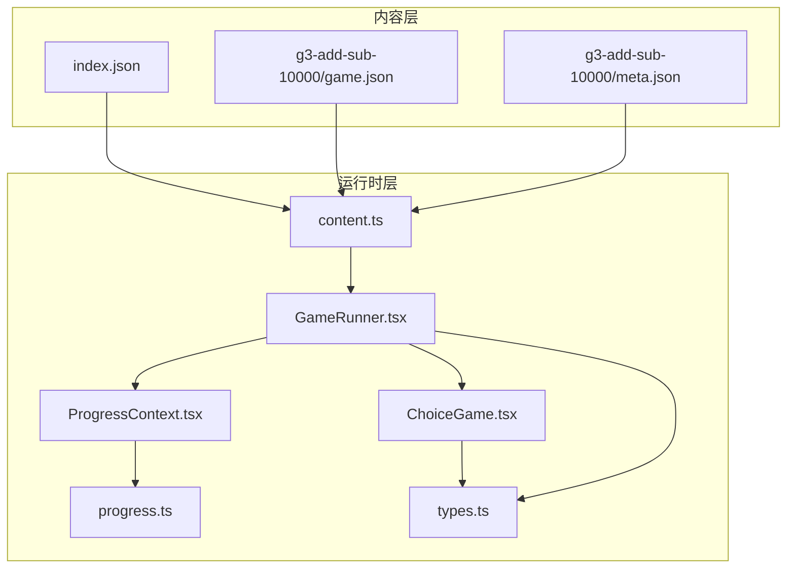
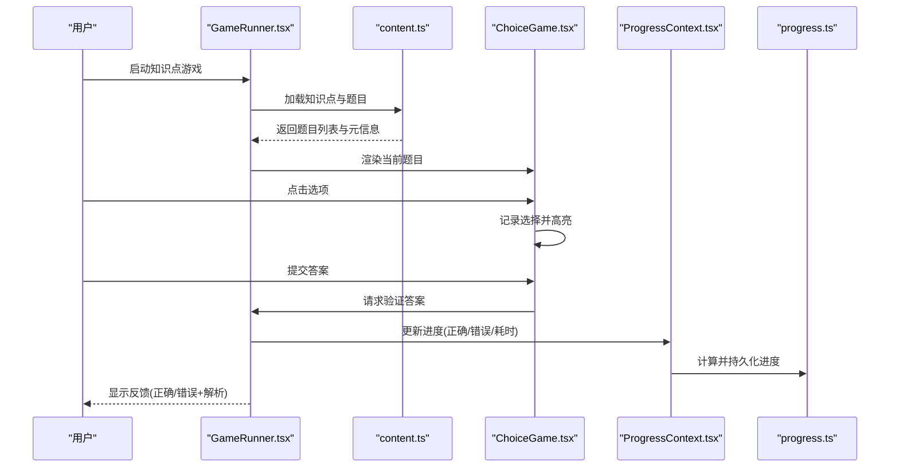
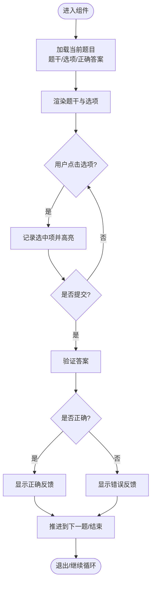
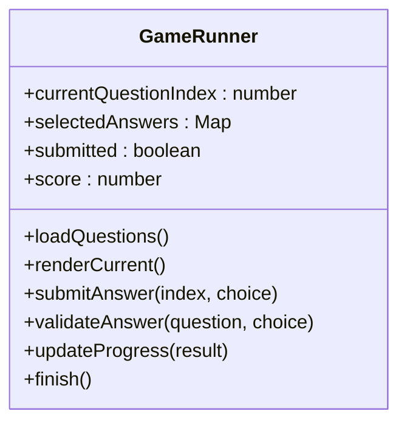
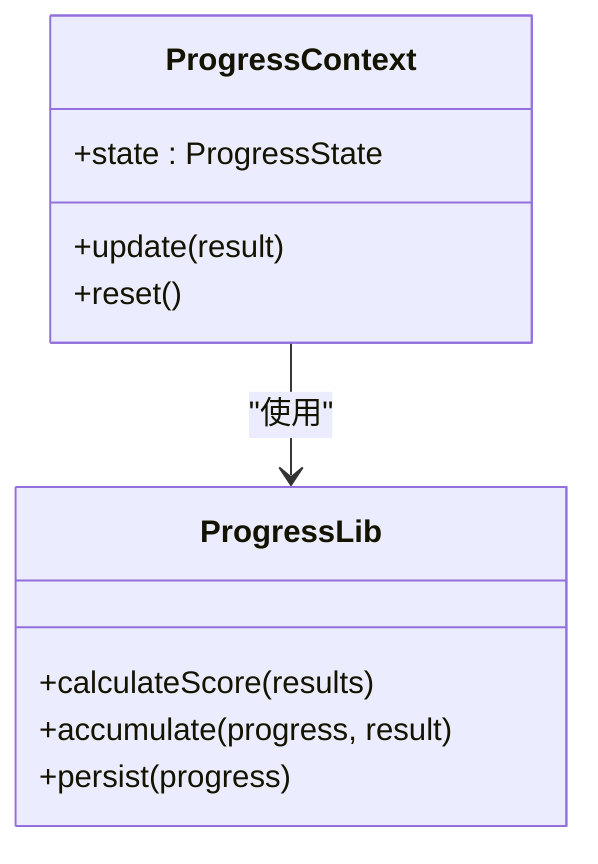
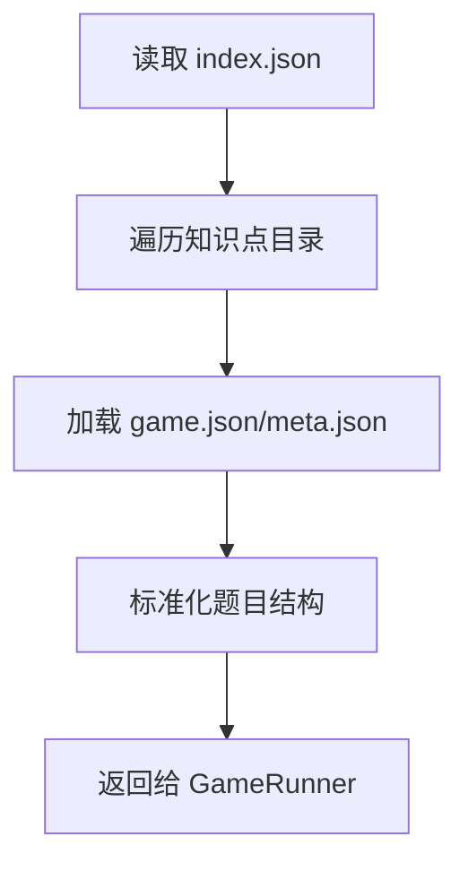
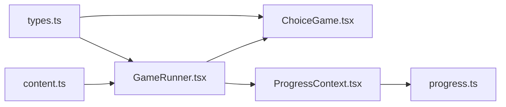

# 选择题游戏

<cite>
**本文引用的文件**   
- [ChoiceGame.tsx](file://src/components/games/ChoiceGame.tsx)
- [GameRunner.tsx](file://src/components/GameRunner.tsx)
- [ProgressContext.tsx](file://src/context/ProgressContext.tsx)
- [progress.ts](file://src/lib/progress.ts)
- [types.ts](file://src/lib/types.ts)
- [content.ts](file://src/lib/content.ts)
- [index.json](file://src/content/index.json)
- [g3-add-sub-10000/game.json](file://src/content/knowledge-points/g3-add-sub-10000/game.json)
- [g3-add-sub-10000/meta.json](file://src/content/knowledge-points/g3-add-sub-10000/meta.json)
</cite>

## 目录
1. [简介](#简介)
2. [项目结构](#项目结构)
3. [核心组件](#核心组件)
4. [架构总览](#架构总览)
5. [详细组件分析](#详细组件分析)
6. [依赖分析](#依赖分析)
7. [性能考虑](#性能考虑)
8. [故障排查指南](#故障排查指南)
9. [结论](#结论)
10. [附录](#附录)

## 简介
本开发文档面向 math-k6 项目的“选择题游戏”模块，聚焦 ChoiceGame 组件的实现原理与扩展方法。内容涵盖：
- 题目渲染、选项交互、答案验证与反馈机制
- 游戏配置格式、题目数据结构、评分算法与进度跟踪
- 自定义题目开发指南（数学表达式处理、选项生成逻辑、难度控制）
- 代码示例路径与常见问题解决方案

该文档旨在帮助开发者快速理解并扩展选择题题型，同时保证与整体知识体系与进度系统无缝集成。

## 项目结构
math-k6 采用“按知识点组织内容 + 统一游戏运行时”的结构：
- 知识点内容位于 src/content/knowledge-points/<id>/ 下，每个知识点包含 meta.json、game.json 以及可选的 explain.md、derivation.json 等
- 游戏运行时与通用组件位于 src/components/ 与 src/lib/
- 进度上下文与持久化位于 src/context/ 与 src/lib/progress.ts
- 类型定义位于 src/lib/types.ts
- 内容加载与索引由 src/lib/content.ts 提供

图表来源
- [index.json](file://src/content/index.json)
- [g3-add-sub-10000/game.json](file://src/content/knowledge-points/g3-add-sub-10000/game.json)
- [g3-add-sub-10000/meta.json](file://src/content/knowledge-points/g3-add-sub-10000/meta.json)
- [content.ts](file://src/lib/content.ts)
- [GameRunner.tsx](file://src/components/GameRunner.tsx)
- [ChoiceGame.tsx](file://src/components/games/ChoiceGame.tsx)
- [ProgressContext.tsx](file://src/context/ProgressContext.tsx)
- [progress.ts](file://src/lib/progress.ts)
- [types.ts](file://src/lib/types.ts)

章节来源
- [index.json](file://src/content/index.json)
- [content.ts](file://src/lib/content.ts)
- [GameRunner.tsx](file://src/components/GameRunner.tsx)
- [ChoiceGame.tsx](file://src/components/games/ChoiceGame.tsx)

## 核心组件
- ChoiceGame.tsx：选择题渲染与交互的核心组件，负责题目展示、选项选择、答案校验、即时反馈与得分统计
- GameRunner.tsx：游戏运行器，负责从内容层加载题目、驱动答题流程、管理回合与结束状态
- ProgressContext.tsx：全局进度上下文，聚合答题结果、正确率、完成度等
- progress.ts：进度计算与持久化逻辑（如累计正确数、尝试次数、时间戳等）
- types.ts：题目、选项、游戏配置、进度等类型定义
- content.ts：知识点与题目的加载、解析与索引

章节来源
- [ChoiceGame.tsx](file://src/components/games/ChoiceGame.tsx)
- [GameRunner.tsx](file://src/components/GameRunner.tsx)
- [ProgressContext.tsx](file://src/context/ProgressContext.tsx)
- [progress.ts](file://src/lib/progress.ts)
- [types.ts](file://src/lib/types.ts)
- [content.ts](file://src/lib/content.ts)

## 架构总览
选择题游戏的整体数据流如下：
- 内容层通过 index.json 与 game.json 描述知识点与题目集合
- 运行时通过 content.ts 加载并解析题目
- GameRunner.tsx 维护当前题号、已选答案、提交状态、得分等
- ChoiceGame.tsx 渲染题目与选项，处理用户交互，调用验证逻辑并更新 UI
- ProgressContext.tsx 与 progress.ts 汇总成绩并持久化

图表来源
- [GameRunner.tsx](file://src/components/GameRunner.tsx)
- [content.ts](file://src/lib/content.ts)
- [ChoiceGame.tsx](file://src/components/games/ChoiceGame.tsx)
- [ProgressContext.tsx](file://src/context/ProgressContext.tsx)
- [progress.ts](file://src/lib/progress.ts)

## 详细组件分析

### ChoiceGame 组件分析
ChoiceGame 负责：
- 渲染题干与选项
- 处理选项点击与选中态
- 提交答案并进行验证
- 给出即时反馈（正确/错误、解析提示）
- 触发下一题或结束流程

图表来源
- [ChoiceGame.tsx](file://src/components/games/ChoiceGame.tsx)

章节来源
- [ChoiceGame.tsx](file://src/components/games/ChoiceGame.tsx)

### GameRunner 组件分析
GameRunner 负责：
- 从 content.ts 获取知识点与题目
- 管理答题流程（当前题号、已选答案、提交状态、得分）
- 协调 ChoiceGame 渲染与进度更新
- 在结束时汇总成绩并写入进度上下文

图表来源
- [GameRunner.tsx](file://src/components/GameRunner.tsx)

章节来源
- [GameRunner.tsx](file://src/components/GameRunner.tsx)

### 进度与评分
- ProgressContext.tsx 暴露进度状态与更新方法
- progress.ts 实现评分与进度计算（如正确率、累计正确数、尝试次数、时间戳等）
- GameRunner 在每次提交后调用进度更新，确保数据一致性

图表来源
- [ProgressContext.tsx](file://src/context/ProgressContext.tsx)
- [progress.ts](file://src/lib/progress.ts)

章节来源
- [ProgressContext.tsx](file://src/context/ProgressContext.tsx)
- [progress.ts](file://src/lib/progress.ts)

### 内容加载与索引
- content.ts 负责读取 index.json 与各知识点的 game.json/meta.json
- 将题目标准化为内部结构供 GameRunner 使用

图表来源
- [content.ts](file://src/lib/content.ts)
- [index.json](file://src/content/index.json)
- [g3-add-sub-10000/game.json](file://src/content/knowledge-points/g3-add-sub-10000/game.json)
- [g3-add-sub-10000/meta.json](file://src/content/knowledge-points/g3-add-sub-10000/meta.json)

章节来源
- [content.ts](file://src/lib/content.ts)
- [index.json](file://src/content/index.json)

## 依赖分析
- ChoiceGame 依赖 types.ts 中的题目与选项类型
- GameRunner 依赖 content.ts 进行内容加载，依赖 ProgressContext.tsx 与 progress.ts 进行进度管理
- ProgressContext 依赖 progress.ts 进行计算与持久化
- 内容层依赖 index.json 与各知识点的 game.json/meta.json

图表来源
- [types.ts](file://src/lib/types.ts)
- [content.ts](file://src/lib/content.ts)
- [GameRunner.tsx](file://src/components/GameRunner.tsx)
- [ChoiceGame.tsx](file://src/components/games/ChoiceGame.tsx)
- [ProgressContext.tsx](file://src/context/ProgressContext.tsx)
- [progress.ts](file://src/lib/progress.ts)

章节来源
- [types.ts](file://src/lib/types.ts)
- [content.ts](file://src/lib/content.ts)
- [GameRunner.tsx](file://src/components/GameRunner.tsx)
- [ChoiceGame.tsx](file://src/components/games/ChoiceGame.tsx)
- [ProgressContext.tsx](file://src/context/ProgressContext.tsx)
- [progress.ts](file://src/lib/progress.ts)

## 性能考虑
- 题目渲染优化：避免重复计算与不必要的重渲染，仅在选项选择或提交时更新状态
- 批量进度更新：合并多次提交后的进度更新，减少上下文重渲染
- 内容加载缓存：对已加载的知识点与题目进行内存缓存，避免重复 IO
- 大题库分页：当题目数量较大时，按需加载与分页渲染，降低首屏压力

[本节为通用指导，不直接分析具体文件]

## 故障排查指南
- 题目无法渲染
  - 检查 content.ts 是否正确解析 game.json/meta.json
  - 确认 index.json 中知识点 ID 与目录一致
- 选项交互无响应
  - 检查 ChoiceGame 的事件绑定与状态更新
  - 确认 types.ts 中选项类型字段完整
- 答案验证失败
  - 核对题目正确答案与用户选择的比较逻辑
  - 检查字符串/数值规范化（去空格、大小写、小数精度）
- 进度不更新
  - 检查 ProgressContext.update 调用时机
  - 确认 progress.ts 的累积与持久化逻辑

章节来源
- [content.ts](file://src/lib/content.ts)
- [ChoiceGame.tsx](file://src/components/games/ChoiceGame.tsx)
- [types.ts](file://src/lib/types.ts)
- [ProgressContext.tsx](file://src/context/ProgressContext.tsx)
- [progress.ts](file://src/lib/progress.ts)

## 结论
ChoiceGame 作为 math-k6 选择题游戏的核心，提供了完整的题目渲染、交互与反馈能力；配合 GameRunner、ProgressContext 与 progress.ts，形成稳定的答题与进度闭环。通过标准化的内容结构与类型定义，开发者可便捷地扩展新题目与玩法，并保持与整体系统的兼容性。

[本节为总结性内容，不直接分析具体文件]

## 附录

### 游戏配置格式与题目数据结构
- 知识点索引 index.json：列出所有知识点 ID 与基本信息
- 知识点元信息 meta.json：描述知识点名称、年级、主题等
- 题目配置 game.json：定义题目集合、每题的题干、选项、正确答案、解析、难度等

建议字段（以 g3-add-sub-10000 为例）：
- 题目对象
  - id：唯一标识
  - question：题干文本（支持简单标记）
  - options：选项数组（每项含 id、text、isCorrect）
  - answer：正确答案的 id
  - explanation：解析说明
  - difficulty：难度等级（如 easy/medium/hard）
  - tags：标签（用于筛选与推荐）
- 元信息 meta.json
  - title：知识点标题
  - grade：年级
  - subject：学科
  - description：简要描述

章节来源
- [index.json](file://src/content/index.json)
- [g3-add-sub-10000/meta.json](file://src/content/knowledge-points/g3-add-sub-10000/meta.json)
- [g3-add-sub-10000/game.json](file://src/content/knowledge-points/g3-add-sub-10000/game.json)

### 评分算法与进度跟踪
- 评分规则
  - 单次正确得分为固定值（如 1 分），错误或未答为 0
  - 总分 = 正确数 × 单题分值
  - 正确率 = 正确数 / 总题数
- 进度跟踪
  - 累计正确数、尝试次数、最近答题时间戳
  - 每道题的作答时间与结果（用于分析与回溯）
- 持久化
  - 使用 progress.ts 的 accumulate 与 persist 方法保存进度

章节来源
- [progress.ts](file://src/lib/progress.ts)
- [ProgressContext.tsx](file://src/context/ProgressContext.tsx)

### 自定义题目开发指南
- 数学表达式处理
  - 题干与选项可使用简单标记（如加粗、上标、分数表示）
  - 若需复杂公式，建议在解释中使用可视化组件或图片链接
- 选项生成逻辑
  - 基于题干参数随机生成干扰项（如加减法范围、近似值、常见错误答案）
  - 确保至少一个 isCorrect=true 的选项
- 难度控制
  - 根据数值范围、运算复杂度、步骤数设置 difficulty
  - 结合 tags 进行知识点关联与推荐

章节来源
- [g3-add-sub-10000/game.json](file://src/content/knowledge-points/g3-add-sub-10000/game.json)
- [types.ts](file://src/lib/types.ts)

### 代码示例路径
- 题目渲染与交互：[ChoiceGame.tsx](file://src/components/games/ChoiceGame.tsx)
- 游戏流程控制：[GameRunner.tsx](file://src/components/GameRunner.tsx)
- 进度上下文与计算：[ProgressContext.tsx](file://src/context/ProgressContext.tsx)、[progress.ts](file://src/lib/progress.ts)
- 内容加载与索引：[content.ts](file://src/lib/content.ts)、[index.json](file://src/content/index.json)
- 题目与元信息样例：[g3-add-sub-10000/game.json](file://src/content/knowledge-points/g3-add-sub-10000/game.json)、[g3-add-sub-10000/meta.json](file://src/content/knowledge-points/g3-add-sub-10000/meta.json)