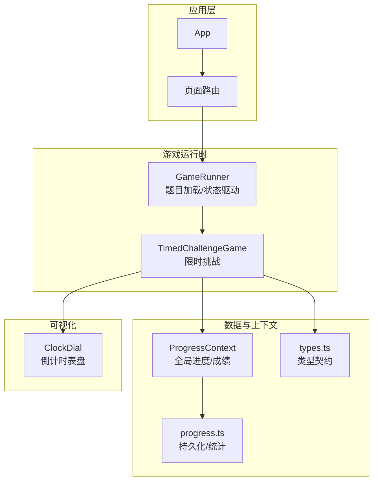
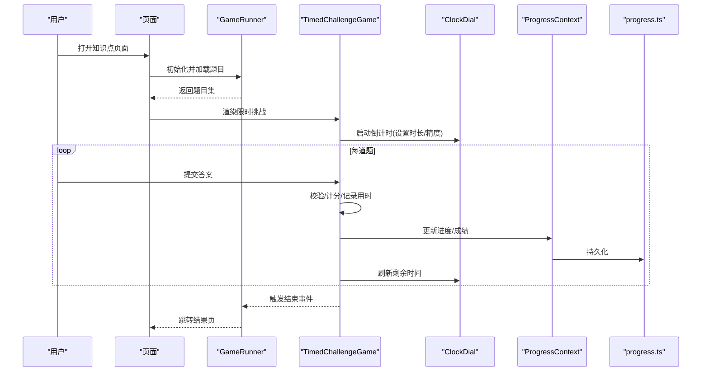
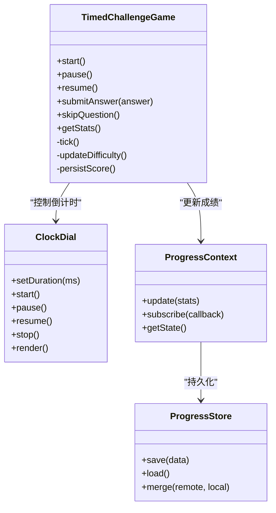
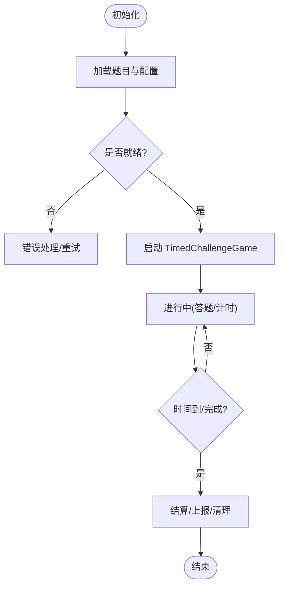
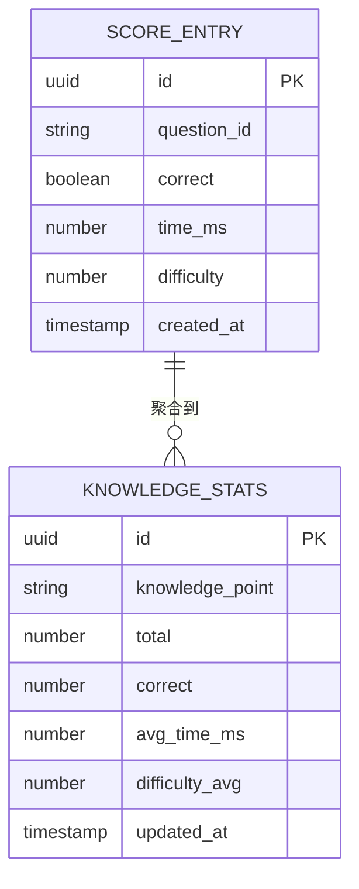
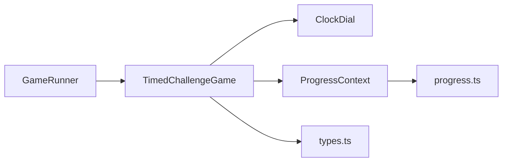

# 限时挑战游戏

<cite>
**本文档引用的文件**   
- [TimedChallengeGame.tsx](file://src/components/games/TimedChallengeGame.tsx)
- [GameRunner.tsx](file://src/components/GameRunner.tsx)
- [ProgressContext.tsx](file://src/context/ProgressContext.tsx)
- [progress.ts](file://src/lib/progress.ts)
- [types.ts](file://src/lib/types.ts)
- [ClockDial.tsx](file://src/visualizations/ClockDial.tsx)
- [README.md](file://README.md)
</cite>

## 目录
1. [简介](#简介)
2. [项目结构](#项目结构)
3. [核心组件](#核心组件)
4. [架构总览](#架构总览)
5. [详细组件分析](#详细组件分析)
6. [依赖关系分析](#依赖关系分析)
7. [性能考量](#性能考量)
8. [故障排查指南](#故障排查指南)
9. [结论](#结论)
10. [附录：自定义限时游戏开发指南](#附录自定义限时游戏开发指南)

## 简介
本技术文档围绕 math-k6 的“限时挑战”玩法，聚焦 TimedChallengeGame 组件的时间管理机制、挑战模式设计、难度递增算法与成绩统计系统，并补充用户交互响应、暂停恢复功能以及网络同步机制的实现要点。同时提供面向二次开发的自定义限时游戏指南，涵盖计时器优化、用户体验设计与防作弊策略。

## 项目结构
本项目采用按功能域组织的前端工程结构：
- 游戏组件位于 src/components/games，其中 TimedChallengeGame.tsx 为核心限时挑战实现。
- 游戏运行器 GameRunner.tsx 负责加载题目、驱动渲染与状态流转。
- 进度与成绩通过 ProgressContext.tsx 与 progress.ts 管理，持久化到本地存储。
- 可视化时钟 ClockDial.tsx 用于倒计时展示。
- 类型定义集中在 types.ts，统一数据结构契约。

图表来源 
- [GameRunner.tsx](file://src/components/GameRunner.tsx)
- [TimedChallengeGame.tsx](file://src/components/games/TimedChallengeGame.tsx)
- [ProgressContext.tsx](file://src/context/ProgressContext.tsx)
- [progress.ts](file://src/lib/progress.ts)
- [types.ts](file://src/lib/types.ts)
- [ClockDial.tsx](file://src/visualizations/ClockDial.tsx)

章节来源
- [README.md](file://README.md)

## 核心组件
- TimedChallengeGame：封装限时挑战的核心逻辑，包括倒计时控制、答题流程、暂停/恢复、结果计算与上报。
- GameRunner：根据知识点配置动态加载题目，驱动游戏生命周期（开始、进行中、结束）。
- ProgressContext + progress.ts：维护全局进度、得分、用时等指标，并提供持久化能力。
- ClockDial：以可视化方式呈现剩余时间，支持动画与精度控制。

章节来源
- [TimedChallengeGame.tsx](file://src/components/games/TimedChallengeGame.tsx)
- [GameRunner.tsx](file://src/components/GameRunner.tsx)
- [ProgressContext.tsx](file://src/context/ProgressContext.tsx)
- [progress.ts](file://src/lib/progress.ts)
- [ClockDial.tsx](file://src/visualizations/ClockDial.tsx)

## 架构总览
限时挑战的整体调用链如下：页面进入后由 GameRunner 初始化并加载题目，随后渲染 TimedChallengeGame；该组件启动倒计时并在每次答题后更新成绩与进度；最终在时间耗尽或完成全部题目时结算并上报。

图表来源 
- [GameRunner.tsx](file://src/components/GameRunner.tsx)
- [TimedChallengeGame.tsx](file://src/components/games/TimedChallengeGame.tsx)
- [ClockDial.tsx](file://src/visualizations/ClockDial.tsx)
- [ProgressContext.tsx](file://src/context/ProgressContext.tsx)
- [progress.ts](file://src/lib/progress.ts)

## 详细组件分析

### TimedChallengeGame 组件
职责与边界
- 管理倒计时生命周期：启动、暂停、恢复、结束。
- 处理用户交互：答题、跳过、确认、提交。
- 计算成绩：正确率、平均用时、总分、等级。
- 与上下文和持久化模块对接，保证数据一致性。

时间管理机制
- 倒计时逻辑：基于高精度时间源（如 performance.now）累计实际流逝时间，避免 requestAnimationFrame 抖动导致的累积误差。
- 时间精度控制：将剩余时间映射为毫秒级显示，必要时四舍五入至百毫秒，减少重绘频率。
- 性能优化：使用节流/防抖限制 UI 更新频率；仅在必要状态变更时触发渲染；批量更新进度。

挑战模式与难度递增
- 模式：固定时长内尽可能多答；或固定题数内尽量缩短用时。
- 难度递增：依据已答题目正确率与用时动态调整下一题难度系数；错误率上升则降低难度，连续正确且用时短则提升难度。
- 自适应阈值：可配置的正确率阈值、用时阈值与难度步进，便于不同学段适配。

成绩统计系统
- 指标：正确数、错误数、未答题、总用时、平均用时、正确率、等级分。
- 聚合：按知识点维度聚合，支持历史对比与趋势图。
- 持久化：增量写入本地存储，避免全量覆盖导致的数据丢失。

用户交互与暂停恢复
- 交互：键盘快捷键（空格暂停）、移动端手势（长按暂停）、UI 按钮。
- 暂停恢复：冻结计时器与题目推进，保留当前题目状态；恢复后从冻结点继续。
- 异常恢复：页面失焦/切后台时自动暂停，重新激活时恢复。

网络同步机制
- 离线优先：所有成绩与进度先落盘，再异步上传。
- 冲突解决：以服务端时间戳为准，合并增量差异；失败重试与退避策略。
- 安全校验：对关键操作进行签名与幂等键，防止重复提交。

图表来源 
- [TimedChallengeGame.tsx](file://src/components/games/TimedChallengeGame.tsx)
- [ClockDial.tsx](file://src/visualizations/ClockDial.tsx)
- [ProgressContext.tsx](file://src/context/ProgressContext.tsx)
- [progress.ts](file://src/lib/progress.ts)

章节来源
- [TimedChallengeGame.tsx](file://src/components/games/TimedChallengeGame.tsx)
- [ClockDial.tsx](file://src/visualizations/ClockDial.tsx)
- [ProgressContext.tsx](file://src/context/ProgressContext.tsx)
- [progress.ts](file://src/lib/progress.ts)

### GameRunner 组件
职责
- 根据知识点元数据与题目配置生成题目序列。
- 驱动游戏生命周期：准备、开始、进行中、结束。
- 与 TimedChallengeGame 协作，传递题目与配置参数。

关键流程
- 初始化：解析配置、预取题目、构建题库。
- 启动：创建实例并注入配置（时长、模式、难度策略）。
- 结束：收集结果、触发上报、清理资源。

图表来源 
- [GameRunner.tsx](file://src/components/GameRunner.tsx)
- [TimedChallengeGame.tsx](file://src/components/games/TimedChallengeGame.tsx)

章节来源
- [GameRunner.tsx](file://src/components/GameRunner.tsx)

### 进度与统计（ProgressContext + progress.ts）
职责
- 维护全局进度与成绩状态，提供订阅与更新接口。
- 本地持久化：增量保存、版本兼容、冲突合并。
- 统计聚合：按知识点、日期、难度等多维度汇总。

数据结构
- 成绩条目：包含题目ID、是否正确、用时、难度等级、时间戳。
- 聚合视图：正确率曲线、用时分布、难度通过率。

图表来源 
- [ProgressContext.tsx](file://src/context/ProgressContext.tsx)
- [progress.ts](file://src/lib/progress.ts)
- [types.ts](file://src/lib/types.ts)

章节来源
- [ProgressContext.tsx](file://src/context/ProgressContext.tsx)
- [progress.ts](file://src/lib/progress.ts)
- [types.ts](file://src/lib/types.ts)

### 倒计时可视化（ClockDial）
职责
- 接收剩余时间并绘制表盘指针/刻度。
- 支持动画帧率控制与低电量模式降级。
- 提供精确到毫秒的读取接口供业务层使用。

章节来源
- [ClockDial.tsx](file://src/visualizations/ClockDial.tsx)

## 依赖关系分析
- TimedChallengeGame 依赖 ClockDial 进行时间展示，依赖 ProgressContext 进行成绩更新。
- ProgressContext 依赖 progress.ts 进行持久化与合并。
- GameRunner 依赖题目配置与类型定义，驱动 TimedChallengeGame。

图表来源 
- [TimedChallengeGame.tsx](file://src/components/games/TimedChallengeGame.tsx)
- [ClockDial.tsx](file://src/visualizations/ClockDial.tsx)
- [ProgressContext.tsx](file://src/context/ProgressContext.tsx)
- [progress.ts](file://src/lib/progress.ts)
- [GameRunner.tsx](file://src/components/GameRunner.tsx)
- [types.ts](file://src/lib/types.ts)

章节来源
- [TimedChallengeGame.tsx](file://src/components/games/TimedChallengeGame.tsx)
- [GameRunner.tsx](file://src/components/GameRunner.tsx)
- [ProgressContext.tsx](file://src/context/ProgressContext.tsx)
- [progress.ts](file://src/lib/progress.ts)
- [types.ts](file://src/lib/types.ts)

## 性能考量
- 计时精度：使用高精度时间源与差值累加，避免逐帧漂移；必要时使用 rAF 节流。
- 渲染优化：仅当剩余时间变化超过阈值或用户交互时更新 UI；批量更新进度。
- 内存管理：及时释放定时器与事件监听；避免闭包引用大对象。
- 网络请求：合并上报、失败重试、指数退避；离线缓存队列。
- 兼容性：低端设备降级为秒级显示，关闭复杂动画。

## 故障排查指南
常见问题与定位
- 倒计时不准：检查高精度时间源与 rAF 节流；确认无阻塞主线程任务。
- 成绩未持久化：查看本地存储权限与版本兼容；检查增量合并逻辑。
- 暂停恢复异常：确认页面可见性 API 与焦点事件；确保定时器状态一致。
- 网络同步失败：检查重试策略与服务器响应码；核对幂等键与签名。

调试建议
- 增加关键路径日志（时间起点、间隔、渲染帧率）。
- 使用浏览器性能面板分析长任务与掉帧。
- 模拟弱网与断网场景验证离线行为。

章节来源
- [TimedChallengeGame.tsx](file://src/components/games/TimedChallengeGame.tsx)
- [progress.ts](file://src/lib/progress.ts)
- [ProgressContext.tsx](file://src/context/ProgressContext.tsx)

## 结论
TimedChallengeGame 通过高精度计时、自适应难度与稳健的持久化机制，提供了流畅且可靠的限时挑战体验。结合 GameRunner 的题目编排与 ProgressContext 的成绩统计，整体架构清晰、可扩展性强。遵循本文的性能与可用性建议，可在不同设备上稳定运行，并为二次开发提供良好基础。

## 附录：自定义限时游戏开发指南
- 计时器优化
  - 使用高精度时间源与差值累加；rAF 节流更新 UI。
  - 设置最小更新粒度（如 100ms），降低重绘压力。
  - 页面失焦自动暂停，激活时恢复。
- 用户体验设计
  - 明确提示剩余时间与目标；提供暂停/恢复入口。
  - 答题反馈即时且友好；错误时给出简要提示。
  - 支持键盘与触摸快捷操作。
- 防作弊策略
  - 记录操作时间戳与顺序，检测异常快速点击。
  - 关键步骤签名与幂等键，防止重复提交。
  - 服务端校验正确率与用时合理性，标记可疑数据。
- 扩展建议
  - 抽象难度策略接口，便于替换算法。
  - 统一成绩上报协议，支持多端同步。
  - 引入 A/B 测试评估不同策略效果。