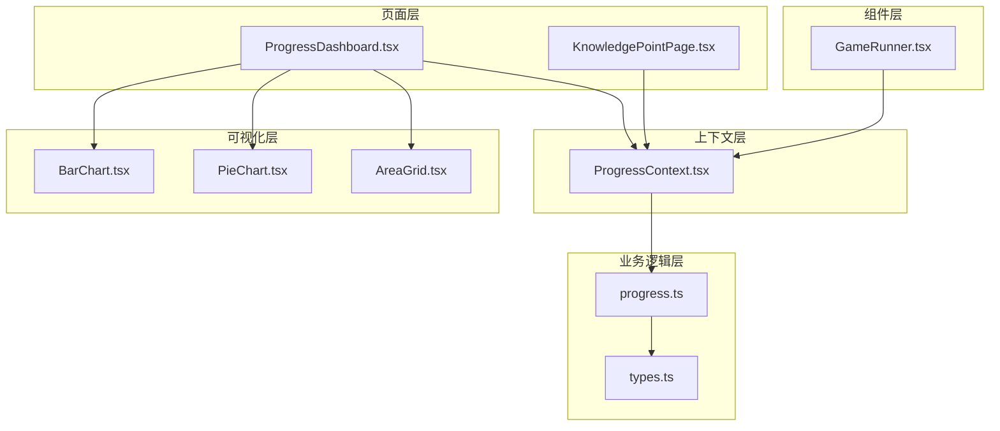
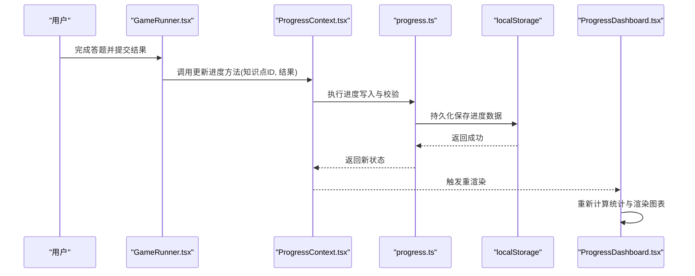
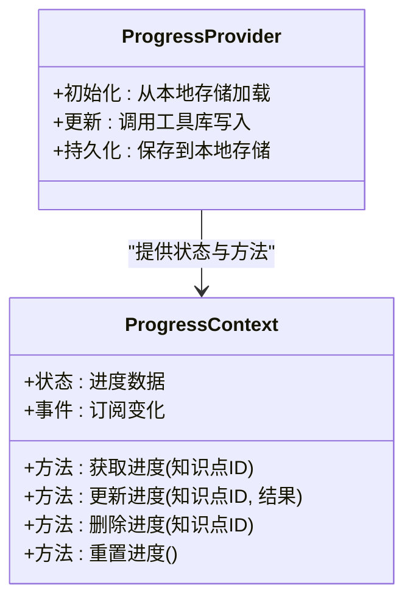
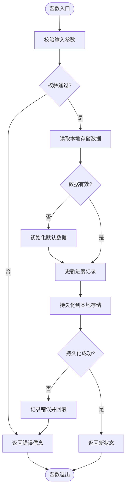
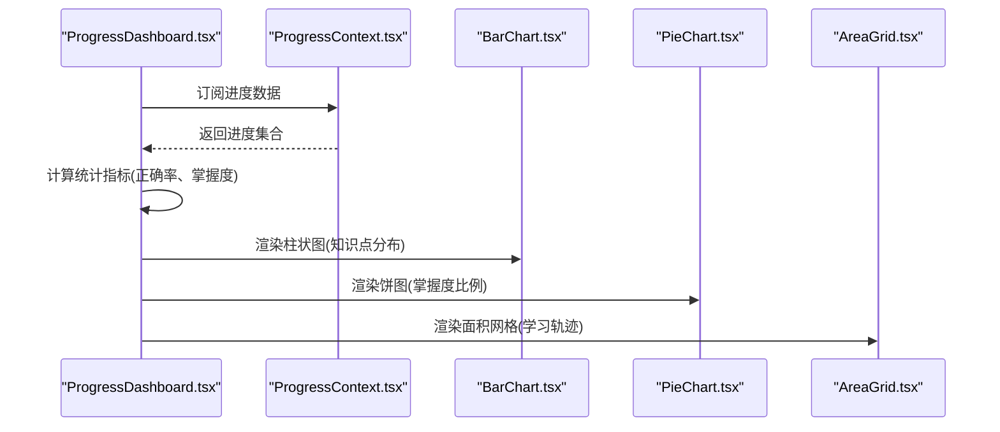
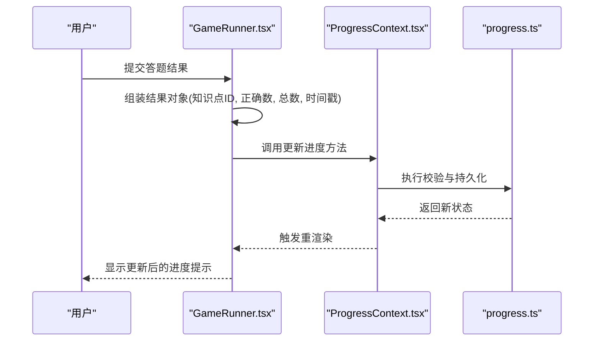
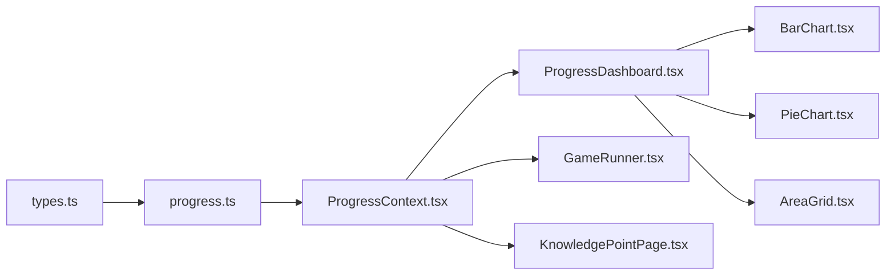

# 进度跟踪系统

<cite>
**本文档引用的文件**   
- [ProgressContext.tsx](file://src/context/ProgressContext.tsx)
- [progress.ts](file://src/lib/progress.ts)
- [types.ts](file://src/lib/types.ts)
- [ProgressDashboard.tsx](file://src/pages/ProgressDashboard.tsx)
- [GameRunner.tsx](file://src/components/GameRunner.tsx)
- [KnowledgePointPage.tsx](file://src/pages/KnowledgePointPage.tsx)
- [BarChart.tsx](file://src/visualizations/BarChart.tsx)
- [PieChart.tsx](file://src/visualizations/PieChart.tsx)
- [AreaGrid.tsx](file://src/visualizations/AreaGrid.tsx)
- [index.json](file://src/content/index.json)
- [package.json](file://package.json)
</cite>

## 目录
1. [简介](#简介)
2. [项目结构](#项目结构)
3. [核心组件](#核心组件)
4. [架构总览](#架构总览)
5. [详细组件分析](#详细组件分析)
6. [依赖关系分析](#依赖关系分析)
7. [性能考虑](#性能考虑)
8. [故障排查指南](#故障排查指南)
9. [结论](#结论)
10. [附录](#附录)

## 简介
本技术文档围绕 math-k6 的“进度跟踪系统”展开，聚焦以下目标：
- 学习进度数据结构设计、全局状态管理机制与本地存储策略
- ProgressContext 跨组件状态共享的实现方式
- 进度数据的持久化方案与数据同步机制
- 进度仪表板的数据展示逻辑、统计分析与可视化呈现
- 进度数据的增删改查操作、数据验证规则与错误处理策略
- 扩展指南与性能优化建议

该系统的核心在于以 React Context 为中心的状态管理，结合本地存储（localStorage）实现跨页面、跨组件的进度数据共享与持久化。

## 项目结构
进度跟踪相关代码主要分布在 context、lib、pages、components 与 visualizations 等目录中：
- context/ProgressContext.tsx：提供全局进度上下文与状态更新方法
- lib/progress.ts：封装进度数据的读写、校验、统计与持久化逻辑
- lib/types.ts：定义进度相关的类型与接口
- pages/ProgressDashboard.tsx：进度仪表板页面，聚合统计与可视化
- components/GameRunner.tsx：游戏运行器，负责记录答题结果并触发进度更新
- pages/KnowledgePointPage.tsx：知识点页面，读取进度并渲染相应状态
- visualizations/*：图表组件用于可视化展示进度与统计

**图示来源**
- [ProgressContext.tsx](file://src/context/ProgressContext.tsx)
- [progress.ts](file://src/lib/progress.ts)
- [types.ts](file://src/lib/types.ts)
- [ProgressDashboard.tsx](file://src/pages/ProgressDashboard.tsx)
- [GameRunner.tsx](file://src/components/GameRunner.tsx)
- [KnowledgePointPage.tsx](file://src/pages/KnowledgePointPage.tsx)
- [BarChart.tsx](file://src/visualizations/BarChart.tsx)
- [PieChart.tsx](file://src/visualizations/PieChart.tsx)
- [AreaGrid.tsx](file://src/visualizations/AreaGrid.tsx)

**章节来源**
- [ProgressContext.tsx](file://src/context/ProgressContext.tsx)
- [progress.ts](file://src/lib/progress.ts)
- [types.ts](file://src/lib/types.ts)
- [ProgressDashboard.tsx](file://src/pages/ProgressDashboard.tsx)
- [GameRunner.tsx](file://src/components/GameRunner.tsx)
- [KnowledgePointPage.tsx](file://src/pages/KnowledgePointPage.tsx)
- [BarChart.tsx](file://src/visualizations/BarChart.tsx)
- [PieChart.tsx](file://src/visualizations/PieChart.tsx)
- [AreaGrid.tsx](file://src/visualizations/AreaGrid.tsx)

## 核心组件
- ProgressContext：提供全局进度状态与更新方法，供页面与组件订阅与消费
- progress.ts：封装进度数据的增删改查、校验、统计计算与本地存储读写
- types.ts：定义进度实体、统计指标、存储键名与错误码等类型
- ProgressDashboard：聚合各知识点的进度与统计，调用可视化组件进行展示
- GameRunner：在答题流程结束后将结果写入进度上下文，触发持久化与重渲染
- KnowledgePointPage：根据当前知识点 ID 查询进度，渲染学习状态与下一步建议

**章节来源**
- [ProgressContext.tsx](file://src/context/ProgressContext.tsx)
- [progress.ts](file://src/lib/progress.ts)
- [types.ts](file://src/lib/types.ts)
- [ProgressDashboard.tsx](file://src/pages/ProgressDashboard.tsx)
- [GameRunner.tsx](file://src/components/GameRunner.tsx)
- [KnowledgePointPage.tsx](file://src/pages/KnowledgePointPage.tsx)

## 架构总览
进度跟踪系统采用“上下文 + 工具库 + 可视化”的分层架构：
- 上下文层：通过 React Context 暴露统一的进度状态与更新 API
- 工具层：封装数据模型、校验、统计与本地存储读写
- 页面与组件层：消费上下文，驱动 UI 更新与交互
- 可视化层：基于图表组件渲染进度分布、正确率、掌握度等指标

**图示来源**
- [GameRunner.tsx](file://src/components/GameRunner.tsx)
- [ProgressContext.tsx](file://src/context/ProgressContext.tsx)
- [progress.ts](file://src/lib/progress.ts)
- [ProgressDashboard.tsx](file://src/pages/ProgressDashboard.tsx)

## 详细组件分析

### ProgressContext：跨组件状态共享
- 职责：维护全局进度状态，提供订阅与更新能力
- 关键能力：
  - 初始化时从本地存储加载进度数据
  - 提供统一的方法用于新增、更新、删除进度记录
  - 变更时触发依赖组件重渲染
  - 错误捕获与降级策略（如本地存储不可用时回退到内存状态）

**图示来源**
- [ProgressContext.tsx](file://src/context/ProgressContext.tsx)

**章节来源**
- [ProgressContext.tsx](file://src/context/ProgressContext.tsx)

### progress.ts：进度数据工具库
- 职责：封装进度数据的增删改查、校验、统计与本地存储读写
- 关键能力：
  - 数据模型：知识点 ID、答题次数、正确次数、最近时间戳、掌握度评分
  - 校验规则：必填字段、数值范围、时间格式、唯一性约束
  - 统计计算：正确率、掌握度、趋势指标
  - 本地存储：读写 localStorage，支持版本迁移与容错

**图示来源**
- [progress.ts](file://src/lib/progress.ts)

**章节来源**
- [progress.ts](file://src/lib/progress.ts)
- [types.ts](file://src/lib/types.ts)

### types.ts：类型与接口定义
- 定义进度实体、统计指标、存储键名、错误码等类型
- 保证类型安全与一致性，便于工具库与上下文协作

**章节来源**
- [types.ts](file://src/lib/types.ts)

### ProgressDashboard：进度仪表板
- 职责：聚合各知识点进度，计算统计指标，渲染可视化图表
- 数据来源：ProgressContext 提供的进度数据
- 可视化：使用 BarChart、PieChart、AreaGrid 等组件展示分布、比例与面积网格

**图示来源**
- [ProgressDashboard.tsx](file://src/pages/ProgressDashboard.tsx)
- [BarChart.tsx](file://src/visualizations/BarChart.tsx)
- [PieChart.tsx](file://src/visualizations/PieChart.tsx)
- [AreaGrid.tsx](file://src/visualizations/AreaGrid.tsx)

**章节来源**
- [ProgressDashboard.tsx](file://src/pages/ProgressDashboard.tsx)
- [BarChart.tsx](file://src/visualizations/BarChart.tsx)
- [PieChart.tsx](file://src/visualizations/PieChart.tsx)
- [AreaGrid.tsx](file://src/visualizations/AreaGrid.tsx)

### GameRunner：答题结果写入进度
- 职责：在游戏结束时收集答题结果，调用上下文更新进度
- 关键点：批量更新、去重、错误回滚、用户反馈

**图示来源**
- [GameRunner.tsx](file://src/components/GameRunner.tsx)
- [ProgressContext.tsx](file://src/context/ProgressContext.tsx)
- [progress.ts](file://src/lib/progress.ts)

**章节来源**
- [GameRunner.tsx](file://src/components/GameRunner.tsx)
- [ProgressContext.tsx](file://src/context/ProgressContext.tsx)
- [progress.ts](file://src/lib/progress.ts)

### KnowledgePointPage：知识点页面进度展示
- 职责：根据当前知识点 ID 查询进度，渲染学习状态与下一步建议
- 数据来源：ProgressContext 提供的进度数据
- 行为：未开始、进行中、已完成等不同状态的 UI 分支

**章节来源**
- [KnowledgePointPage.tsx](file://src/pages/KnowledgePointPage.tsx)
- [ProgressContext.tsx](file://src/context/ProgressContext.tsx)

## 依赖关系分析
- ProgressContext 依赖 progress.ts 与 types.ts
- ProgressDashboard 依赖 ProgressContext 与可视化组件
- GameRunner 依赖 ProgressContext 与 progress.ts
- KnowledgePointPage 依赖 ProgressContext

**图示来源**
- [types.ts](file://src/lib/types.ts)
- [progress.ts](file://src/lib/progress.ts)
- [ProgressContext.tsx](file://src/context/ProgressContext.tsx)
- [ProgressDashboard.tsx](file://src/pages/ProgressDashboard.tsx)
- [GameRunner.tsx](file://src/components/GameRunner.tsx)
- [KnowledgePointPage.tsx](file://src/pages/KnowledgePointPage.tsx)
- [BarChart.tsx](file://src/visualizations/BarChart.tsx)
- [PieChart.tsx](file://src/visualizations/PieChart.tsx)
- [AreaGrid.tsx](file://src/visualizations/AreaGrid.tsx)

**章节来源**
- [types.ts](file://src/lib/types.ts)
- [progress.ts](file://src/lib/progress.ts)
- [ProgressContext.tsx](file://src/context/ProgressContext.tsx)
- [ProgressDashboard.tsx](file://src/pages/ProgressDashboard.tsx)
- [GameRunner.tsx](file://src/components/GameRunner.tsx)
- [KnowledgePointPage.tsx](file://src/pages/KnowledgePointPage.tsx)
- [BarChart.tsx](file://src/visualizations/BarChart.tsx)
- [PieChart.tsx](file://src/visualizations/PieChart.tsx)
- [AreaGrid.tsx](file://src/visualizations/AreaGrid.tsx)

## 性能考虑
- 本地存储读写：
  - 批量更新合并，减少频繁 I/O
  - 使用防抖/节流避免重复写入
- 状态更新：
  - 最小化重渲染范围，仅更新依赖进度的组件
  - 使用选择器或派生状态减少不必要的计算
- 可视化渲染：
  - 按需加载图表组件，避免首屏过重
  - 大数据集时使用分页或采样
- 错误恢复：
  - 本地存储失败时回退到内存状态，保证可用性
  - 记录错误日志以便定位问题

[本节为通用指导，不直接分析具体文件]

## 故障排查指南
- 常见问题：
  - 进度数据未持久化：检查本地存储权限与存储空间
  - 进度不同步：确认上下文更新是否触发重渲染
  - 图表数据异常：校验输入数据与统计逻辑
- 调试建议：
  - 打印进度变更记录与错误堆栈
  - 使用浏览器开发者工具监控 localStorage 变化
  - 对关键路径添加单元测试覆盖

**章节来源**
- [progress.ts](file://src/lib/progress.ts)
- [ProgressContext.tsx](file://src/context/ProgressContext.tsx)

## 结论
math-k6 的进度跟踪系统通过 React Context 与工具库的组合，实现了跨组件的状态共享与本地持久化。仪表板与可视化组件提供了直观的学习进度展示。建议在后续迭代中进一步优化性能与错误处理，提升用户体验与系统稳定性。

[本节为总结，不直接分析具体文件]

## 附录
- 内容索引：知识点元数据与游戏配置位于 content/index.json
- 包依赖：项目依赖与脚本定义见 package.json

**章节来源**
- [index.json](file://src/content/index.json)
- [package.json](file://package.json)