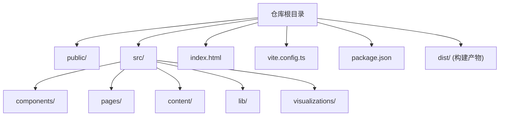
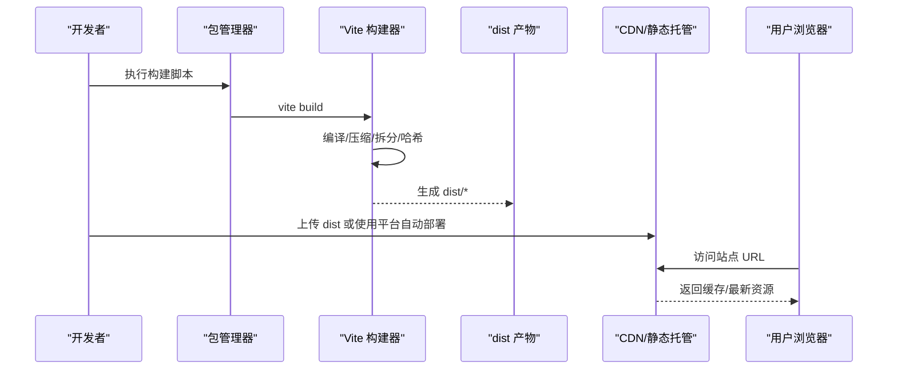
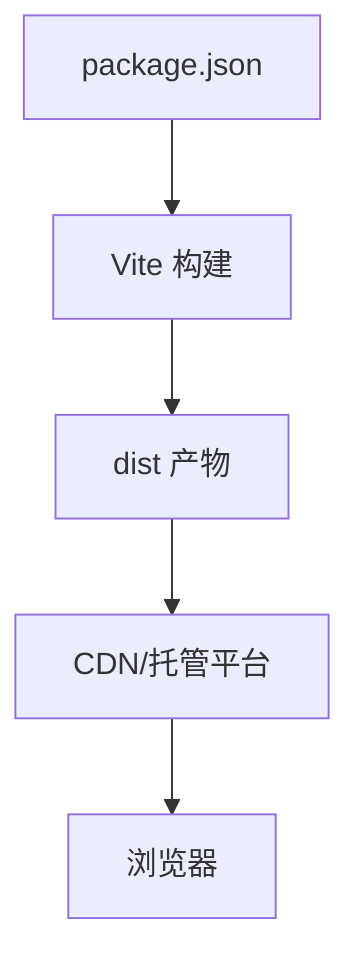

# 部署与生产环境

<cite>
**本文引用的文件**   
- [package.json](file://package.json)
- [vite.config.ts](file://vite.config.ts)
- [index.html](file://index.html)
- [README.md](file://README.md)
</cite>

## 目录
1. [简介](#简介)
2. [项目结构](#项目结构)
3. [核心组件](#核心组件)
4. [架构总览](#架构总览)
5. [详细组件分析](#详细组件分析)
6. [依赖分析](#依赖分析)
7. [性能考虑](#性能考虑)
8. [故障排除指南](#故障排除指南)
9. [结论](#结论)
10. [附录](#附录)

## 简介
本文件面向 math-k6 项目的构建、打包与生产部署，覆盖以下主题：
- 构建配置优化（基于 Vite）
- 生产环境打包与静态资源处理
- 多平台部署步骤（GitHub Pages、Vercel、Netlify）
- 环境变量配置、CDN 设置与缓存策略
- 性能优化技巧、SEO 优化与监控日志
- 故障排除、回滚策略与安全加固
- 自动化部署流水线与持续集成最佳实践

## 项目结构
math-k6 是一个基于 Vite + React/TypeScript 的前端应用。根目录包含入口 HTML、构建配置与包管理脚本；业务代码位于 src 目录，静态资源在 public 目录。生产构建产物将输出到 dist 目录，可直接被静态托管服务或 CDN 分发。

图表来源
- [package.json](file://package.json)
- [vite.config.ts](file://vite.config.ts)
- [index.html](file://index.html)

章节来源
- [package.json](file://package.json)
- [vite.config.ts](file://vite.config.ts)
- [index.html](file://index.html)

## 核心组件
- 构建工具链：Vite（开发服务器、快速热更新、生产构建）
- 包管理与脚本：npm/yarn/pnpm（通过 package.json 的 scripts）
- 入口与路由：index.html 作为 SPA 入口，页面组件位于 pages/
- 内容数据：content/ 下的知识内容与元数据由运行时加载
- 可视化组件：visualizations/ 提供数学可视化能力

章节来源
- [package.json](file://package.json)
- [vite.config.ts](file://vite.config.ts)
- [index.html](file://index.html)

## 架构总览
下图展示了从源码到生产产物的构建与部署流程，以及各平台的接入点。

图表来源
- [package.json](file://package.json)
- [vite.config.ts](file://vite.config.ts)
- [index.html](file://index.html)

## 详细组件分析

### 构建配置与优化（Vite）
- 构建目标与环境：通过 vite.config.ts 定义构建选项，如基础路径、输出目录、插件与优化策略。
- 资源处理：静态资源与图片等默认会被 Vite 处理并添加内容哈希，利于长期缓存。
- 代码分割：按需拆分模块，减少首屏体积。
- 压缩与 Tree-shaking：生产构建启用压缩与无用代码剔除。
- 环境变量：通过 Vite 的环境变量机制注入（例如构建时使用的 API 地址、功能开关）。

建议关注点
- base 路径：根据部署子路径调整，确保资源引用正确。
- 构建产物命名：保留哈希文件名以启用强缓存。
- 插件扩展：按需引入压缩、SVG 内联、字体处理等插件。

章节来源
- [vite.config.ts](file://vite.config.ts)
- [package.json](file://package.json)

### 生产打包与静态资源处理
- 构建命令：通过 package.json 的 scripts 调用 Vite 构建。
- 产物目录：默认输出至 dist，包含 HTML、JS、CSS 与静态资源。
- 资源策略：
  - 文本与样式：开启压缩与合并
  - JS：按路由/组件进行代码分割
  - 图片与媒体：使用合适格式与尺寸，必要时懒加载
  - 字体：自托管并设置合适的缓存头

章节来源
- [package.json](file://package.json)
- [vite.config.ts](file://vite.config.ts)

### 环境变量配置
- 构建期变量：在 vite.config.ts 中读取环境变量，用于控制 API 地址、功能开关等。
- 运行期变量：HTML 或入口脚本中暴露必要的全局变量（谨慎使用，避免泄露敏感信息）。
- 安全建议：仅暴露非敏感配置；敏感信息应放在服务端或平台密钥管理中。

章节来源
- [vite.config.ts](file://vite.config.ts)
- [index.html](file://index.html)

### 多平台部署步骤

#### GitHub Pages
- 适用场景：开源项目文档与演示站点
- 部署方式：
  - 手动：构建后上传 dist 到 gh-pages 分支或 GitHub Actions
  - 自动：使用 GitHub Actions 触发构建与发布
- 注意事项：
  - 设置正确的 base 路径（若部署在子路径）
  - 开启 HTTP 缓存与 Gzip/Brotli（由 GitHub 托管默认支持）

章节来源
- [package.json](file://package.json)
- [vite.config.ts](file://vite.config.ts)

#### Vercel
- 适用场景：快速部署与预览链接
- 部署方式：
  - CLI：安装 vercel 并执行 vercel deploy
  - Git 集成：推送代码自动构建与部署
- 注意事项：
  - 构建命令与输出目录识别（通常自动识别 Vite）
  - 环境变量在平台设置中配置
  - 自定义域名与 HTTPS 开箱即用

章节来源
- [package.json](file://package.json)
- [vite.config.ts](file://vite.config.ts)

#### Netlify
- 适用场景：静态站点与函数边缘计算
- 部署方式：
  - CLI：netlify deploy --prod
  - Git 集成：推送代码自动构建与部署
- 注意事项：
  - 构建命令与发布目录设置
  - 环境变量在平台设置中配置
  - 重定向与缓存规则可通过配置文件或控制台设置

章节来源
- [package.json](file://package.json)
- [vite.config.ts](file://vite.config.ts)

### CDN 设置与缓存策略
- CDN 选择：Cloudflare、阿里云 OSS+CDN、AWS CloudFront 等
- 缓存策略：
  - 资源文件：使用内容哈希文件名，设置长缓存（一年）
  - HTML：短缓存或无缓存，确保版本更新及时生效
  - 预取与预连接：对关键资源使用 rel="preconnect" 与 rel="prefetch"
- 压缩：启用 Brotli/Gzip
- 安全：强制 HTTPS、CSP、HSTS、SRI（可选）

章节来源
- [vite.config.ts](file://vite.config.ts)
- [index.html](file://index.html)

### 性能优化技巧
- 首屏优化：
  - 路由级代码分割与懒加载
  - 关键 CSS 内联与关键资源预加载
  - 图片懒加载与 WebP/AVIF 格式
- 网络优化：
  - 启用 HTTP/2 或 HTTP/3
  - 合理设置 Cache-Control 与 ETag
  - 使用 CDN 就近分发
- 渲染优化：
  - 减少主线程阻塞
  - 使用虚拟列表与分页加载大数据集
  - 避免不必要的重排与重绘

章节来源
- [vite.config.ts](file://vite.config.ts)
- [index.html](file://index.html)

### SEO 优化
- 标题与描述：在 index.html 中设置 meta title、description、keywords
- Open Graph 与 Twitter Card：便于社交分享展示
- 结构化数据：为知识点与课程添加 JSON-LD 结构化数据
- 站点地图与 robots.txt：提升搜索引擎抓取效率
- 可访问性：语义化标签与 alt 文本

章节来源
- [index.html](file://index.html)

### 监控日志配置
- 前端错误监控：接入 Sentry、LogRocket 等平台
- 性能监控：使用 Performance API、Lighthouse CI 与 Web Vitals
- 访问统计：Google Analytics 或自建埋点
- 日志规范：统一错误码、请求 ID 与上下文信息

章节来源
- [index.html](file://index.html)

### 故障排除指南
- 构建失败：检查 Node 版本、依赖完整性与构建脚本
- 资源 404：确认 base 路径与 CDN 路径一致
- 缓存问题：清理浏览器缓存与服务端缓存，验证版本号
- 环境变量未生效：确认平台配置与构建期注入
- 跨域问题：后端 CORS 配置与代理设置

章节来源
- [package.json](file://package.json)
- [vite.config.ts](file://vite.config.ts)

### 回滚策略
- 版本化部署：每次发布生成唯一版本号（Git tag 或构建号）
- 灰度发布：先小流量验证再全量发布
- 快速回滚：平台一键回滚到上一个稳定版本
- 健康检查：部署后自动执行冒烟测试与可用性检测

章节来源
- [package.json](file://package.json)

### 安全加固措施
- 最小权限：CI/CD 使用专用令牌与受限权限
- 依赖安全：定期扫描漏洞（npm audit、Dependabot）
- 输入校验：对用户输入进行严格校验与转义
- 安全头：CSP、X-Frame-Options、Referrer-Policy 等
- 密钥管理：不将敏感信息放入前端代码

章节来源
- [package.json](file://package.json)
- [vite.config.ts](file://vite.config.ts)

### 自动化部署流水线与持续集成最佳实践
- CI 流程：
  - 拉取代码与缓存依赖
  - 安装依赖与类型检查
  - 单元测试与覆盖率
  - 构建生产产物
  - 部署到目标平台
- 触发条件：push、PR、tag 发布
- 并行任务：lint、test、build 并行执行
- 制品归档：保存构建产物以便回滚与审计

章节来源
- [package.json](file://package.json)

## 依赖分析
- 构建依赖：Vite、TypeScript、React 生态
- 运行依赖：浏览器兼容与 polyfill（按需）
- 外部服务：CDN、监控与分析平台

图表来源
- [package.json](file://package.json)
- [vite.config.ts](file://vite.config.ts)

章节来源
- [package.json](file://package.json)
- [vite.config.ts](file://vite.config.ts)

## 性能考虑
- 构建优化：启用代码分割、Tree-shaking、资源压缩
- 网络优化：HTTP/2、CDN、缓存策略、预加载
- 渲染优化：懒加载、虚拟滚动、减少重排
- 监控指标：FCP、LCP、CLS、TBT 等 Web Vitals

[本节为通用指导，无需特定文件来源]

## 故障排除指南
- 常见问题定位：构建日志、浏览器控制台、网络面板
- 缓存冲突：清除缓存、强制刷新、版本号变更
- 环境变量：检查平台配置与注入时机
- 跨域与权限：CORS、Cookie 与 SameSite 设置

章节来源
- [package.json](file://package.json)
- [vite.config.ts](file://vite.config.ts)

## 结论
通过合理的构建配置、严格的缓存策略与完善的 CI/CD 流水线，math-k6 可以在主流平台上实现高效、稳定与安全的部署。结合性能与 SEO 优化、监控与故障排除，能够持续提升用户体验与可维护性。

[本节为总结，无需特定文件来源]

## 附录
- 参考命令：
  - 本地开发：npm run dev
  - 构建生产：npm run build
  - 预览构建：npm run preview
- 平台文档：
  - GitHub Pages 部署指南
  - Vercel 部署指南
  - Netlify 部署指南

章节来源
- [package.json](file://package.json)
- [README.md](file://README.md)