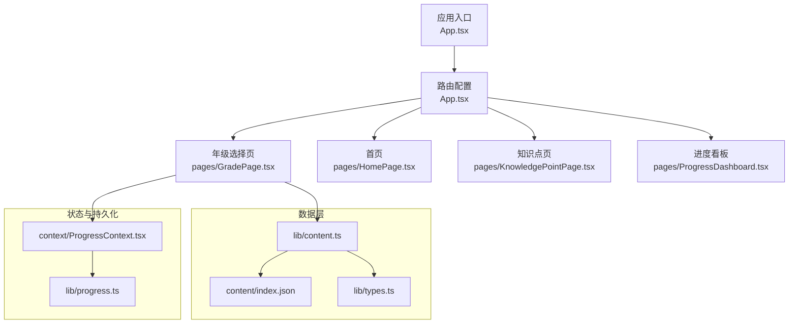
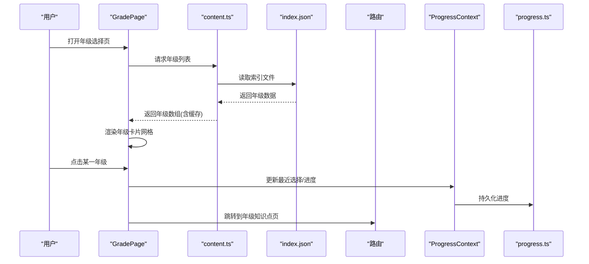
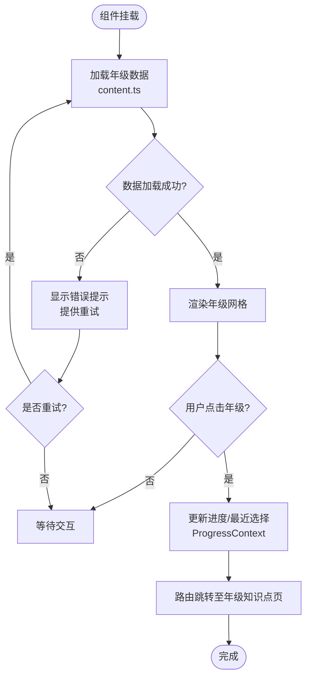
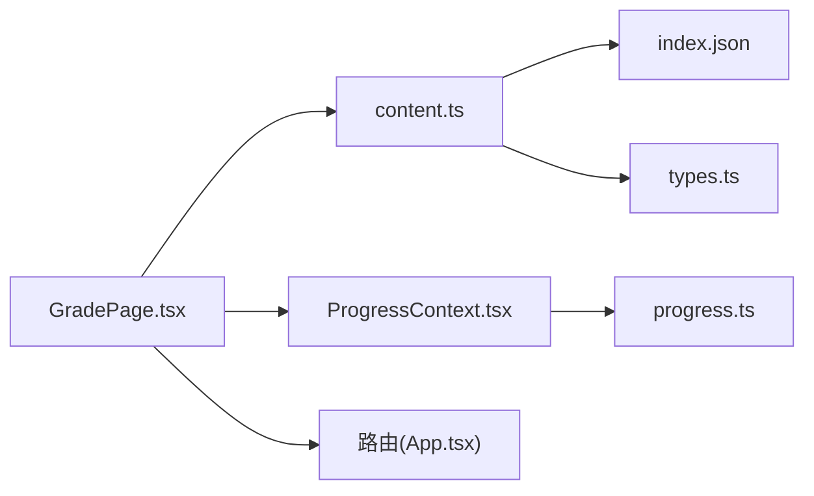

# GradePage 年级选择页

<cite>
**本文档引用的文件**
- [GradePage.tsx](file://src/pages/GradePage.tsx)
- [HomePage.tsx](file://src/pages/HomePage.tsx)
- [KnowledgePointPage.tsx](file://src/pages/KnowledgePointPage.tsx)
- [ProgressDashboard.tsx](file://src/pages/ProgressDashboard.tsx)
- [App.tsx](file://src/App.tsx)
- [content.ts](file://src/lib/content.ts)
- [types.ts](file://src/lib/types.ts)
- [index.json](file://src/content/index.json)
- [ProgressContext.tsx](file://src/context/ProgressContext.tsx)
- [progress.ts](file://src/lib/progress.ts)
</cite>

## 目录
1. [简介](#简介)
2. [项目结构](#项目结构)
3. [核心组件](#核心组件)
4. [架构总览](#架构总览)
5. [详细组件分析](#详细组件分析)
6. [依赖关系分析](#依赖关系分析)
7. [性能考虑](#性能考虑)
8. [故障排查指南](#故障排查指南)
9. [结论](#结论)
10. [附录](#附录)

## 简介
本文件为 GradePage 年级选择页的完整技术文档。内容覆盖：
- 年级列表展示、选择逻辑与路由跳转
- 组件数据结构、状态管理与用户交互流程
- 年级数据获取方式、缓存策略与错误处理机制
- 页面布局设计、动画效果与用户体验优化
- 扩展方法：添加新年级与自定义年级展示

## 项目结构
GradePage 位于 pages 目录，作为年级入口页，负责渲染年级卡片并导航到知识点详情页或学习仪表盘。其数据来源于 content/index.json，并通过 lib/content.ts 进行解析与缓存；状态管理由 context/ProgressContext.tsx 提供，持久化通过 lib/progress.ts 实现。

图表来源
- [App.tsx](file://src/App.tsx)
- [GradePage.tsx](file://src/pages/GradePage.tsx)
- [content.ts](file://src/lib/content.ts)
- [types.ts](file://src/lib/types.ts)
- [index.json](file://src/content/index.json)
- [ProgressContext.tsx](file://src/context/ProgressContext.tsx)
- [progress.ts](file://src/lib/progress.ts)

章节来源
- [App.tsx](file://src/App.tsx)
- [GradePage.tsx](file://src/pages/GradePage.tsx)
- [content.ts](file://src/lib/content.ts)
- [types.ts](file://src/lib/types.ts)
- [index.json](file://src/content/index.json)
- [ProgressContext.tsx](file://src/context/ProgressContext.tsx)
- [progress.ts](file://src/lib/progress.ts)

## 核心组件
- GradePage（年级选择页）
  - 职责：加载年级列表、渲染年级卡片、处理点击选择、路由跳转到对应知识点集合页或学习路径。
  - 关键能力：数据获取与缓存、空态与错误态处理、无障碍与可访问性、响应式布局。
- 数据与类型
  - types.ts：定义年级、知识点、游戏等数据结构。
  - content.ts：读取 index.json，提供年级聚合与缓存。
- 状态与持久化
  - ProgressContext.tsx：全局学习进度上下文。
  - progress.ts：本地存储读写与版本迁移。

章节来源
- [GradePage.tsx](file://src/pages/GradePage.tsx)
- [content.ts](file://src/lib/content.ts)
- [types.ts](file://src/lib/types.ts)
- [ProgressContext.tsx](file://src/context/ProgressContext.tsx)
- [progress.ts](file://src/lib/progress.ts)

## 架构总览
GradePage 的数据流与交互流程如下：
- 初始化时从 content/index.json 拉取年级索引，经 content.ts 解析并缓存。
- 渲染年级卡片网格，支持筛选与排序（如按年级顺序）。
- 用户点击某一年级后，保存最近选择（可选），并路由跳转到该年级对应的知识点集合页。
- 进度信息通过 ProgressContext 与 progress.ts 同步至本地存储。

图表来源
- [GradePage.tsx](file://src/pages/GradePage.tsx)
- [content.ts](file://src/lib/content.ts)
- [index.json](file://src/content/index.json)
- [ProgressContext.tsx](file://src/context/ProgressContext.tsx)
- [progress.ts](file://src/lib/progress.ts)

## 详细组件分析

### GradePage 组件分析
- 数据模型
  - 年级项：包含年级标识、名称、图标/颜色、知识点集合等字段。
  - 知识点集合：每个年级下包含若干知识点条目，条目包含标题、难度、游戏资源等。
- 状态管理
  - 本地状态：加载中、错误信息、已选年级、搜索关键词、排序方式。
  - 全局状态：学习进度、最近选择（通过 ProgressContext）。
- 数据获取与缓存
  - 首次加载调用 content.ts 的年级接口，内部对 index.json 做内存缓存与可选持久化。
  - 失败重试与降级：网络/读取失败时显示错误提示并提供重试按钮。
- 用户交互
  - 点击年级卡片触发路由跳转，携带年级参数。
  - 支持键盘导航与焦点管理，提升可访问性。
- 布局与动效
  - 网格布局自适应屏幕尺寸，移动端单列/双列，桌面端多列。
  - 卡片悬停与选中态过渡动画，进入页面的渐入动画。
- 错误处理
  - 捕获数据加载异常，展示友好提示与重试入口。
  - 对缺失字段进行防御性校验，避免渲染崩溃。

图表来源
- [GradePage.tsx](file://src/pages/GradePage.tsx)
- [content.ts](file://src/lib/content.ts)
- [ProgressContext.tsx](file://src/context/ProgressContext.tsx)

章节来源
- [GradePage.tsx](file://src/pages/GradePage.tsx)
- [content.ts](file://src/lib/content.ts)
- [ProgressContext.tsx](file://src/context/ProgressContext.tsx)

### 数据结构与类型（types.ts）
- 年级类型：id、name、order、icon/color、knowledgePoints[]。
- 知识点类型：id、title、difficulty、game、meta 等。
- 游戏与元数据：用于渲染与运行游戏。
- 使用建议：新增年级需遵循现有类型定义，确保字段完整性与一致性。

章节来源
- [types.ts](file://src/lib/types.ts)

### 数据源与缓存（content.ts + index.json）
- 数据源：src/content/index.json 维护年级与知识点的索引。
- 解析与缓存：content.ts 负责读取、解析、去重与缓存，减少重复 IO。
- 扩展点：在 index.json 中追加年级条目即可被自动识别。

章节来源
- [content.ts](file://src/lib/content.ts)
- [index.json](file://src/content/index.json)

### 进度与持久化（ProgressContext.tsx + progress.ts）
- ProgressContext：提供全局进度状态与更新方法。
- progress.ts：封装本地存储读写、版本兼容与增量更新。
- 使用场景：记录最近选择的年级、已完成知识点、得分等。

章节来源
- [ProgressContext.tsx](file://src/context/ProgressContext.tsx)
- [progress.ts](file://src/lib/progress.ts)

### 路由与页面跳转（App.tsx 与各页面）
- App.tsx 集中配置路由，将 /grade 映射到 GradePage，/knowledge/:gradeId 映射到知识点集合页。
- GradePage 点击年级后，通过路由库跳转到目标页面并传递年级参数。

章节来源
- [App.tsx](file://src/App.tsx)
- [GradePage.tsx](file://src/pages/GradePage.tsx)
- [KnowledgePointPage.tsx](file://src/pages/KnowledgePointPage.tsx)

## 依赖关系分析
GradePage 的依赖关系如下：
- UI 层：GradePage 依赖路由库与样式系统。
- 数据层：content.ts 依赖 index.json 与 types.ts。
- 状态层：ProgressContext 依赖 progress.ts 进行持久化。
- 页面间通信：通过路由参数与全局上下文传递数据。

图表来源
- [GradePage.tsx](file://src/pages/GradePage.tsx)
- [content.ts](file://src/lib/content.ts)
- [index.json](file://src/content/index.json)
- [types.ts](file://src/lib/types.ts)
- [ProgressContext.tsx](file://src/context/ProgressContext.tsx)
- [progress.ts](file://src/lib/progress.ts)
- [App.tsx](file://src/App.tsx)

章节来源
- [GradePage.tsx](file://src/pages/GradePage.tsx)
- [content.ts](file://src/lib/content.ts)
- [index.json](file://src/content/index.json)
- [types.ts](file://src/lib/types.ts)
- [ProgressContext.tsx](file://src/context/ProgressContext.tsx)
- [progress.ts](file://src/lib/progress.ts)
- [App.tsx](file://src/App.tsx)

## 性能考虑
- 数据加载
  - 使用内存缓存避免重复读取 index.json。
  - 按需懒加载年级详情，首屏仅渲染必要字段。
- 渲染优化
  - 列表虚拟化（当年级或知识点数量较大时）。
  - 防抖搜索与分页加载。
- 动画与交互
  - 使用 CSS 过渡与硬件加速，避免重排重绘。
  - 大列表滚动时使用 requestAnimationFrame 节流。
- 可访问性
  - 键盘导航、ARIA 标签、焦点管理。
- 错误恢复
  - 快速失败与重试机制，离线降级展示缓存数据。

[本节为通用指导，不直接分析具体文件]

## 故障排查指南
- 数据加载失败
  - 检查 index.json 格式与字段完整性。
  - 查看 content.ts 的错误分支与日志输出。
- 路由跳转异常
  - 确认 App.tsx 路由配置与参数传递是否正确。
  - 检查目标页面是否接收并处理年级参数。
- 进度未持久化
  - 验证 ProgressContext 的更新方法与 progress.ts 的写入逻辑。
  - 检查浏览器本地存储权限与配额。
- 渲染异常
  - 对缺失字段进行防御性校验，避免 undefined 访问。
  - 使用边界测试用例覆盖极端输入。

章节来源
- [content.ts](file://src/lib/content.ts)
- [ProgressContext.tsx](file://src/context/ProgressContext.tsx)
- [progress.ts](file://src/lib/progress.ts)
- [App.tsx](file://src/App.tsx)

## 结论
GradePage 作为年级选择入口，具备清晰的数据流、稳健的状态管理与良好的可扩展性。通过 index.json 与 content.ts 的组合，新增年级只需配置数据即可生效；借助 ProgressContext 与 progress.ts，学习进度得以持久化。建议在后续迭代中引入列表虚拟化与更完善的错误监控，以提升大规模数据下的性能与稳定性。

[本节为总结，不直接分析具体文件]

## 附录

### 添加新年级的步骤
- 在 index.json 中新增年级条目，包含 id、name、order、knowledgePoints[] 等字段。
- 确保 types.ts 中的类型定义与新字段兼容。
- 刷新页面，GradePage 会自动渲染新年级卡片。
- 如需自定义展示，可在 GradePage 中根据年级 id/name 进行差异化渲染。

章节来源
- [index.json](file://src/content/index.json)
- [types.ts](file://src/lib/types.ts)
- [GradePage.tsx](file://src/pages/GradePage.tsx)

### 自定义年级展示的建议
- 使用条件渲染：根据年级属性切换布局或主题色。
- 插槽模式：为不同年级注入不同的头部/说明文案。
- 动画增强：为特定年级添加入场或选中动画。
- 无障碍优化：为自定义元素补充 ARIA 标签与键盘支持。

章节来源
- [GradePage.tsx](file://src/pages/GradePage.tsx)