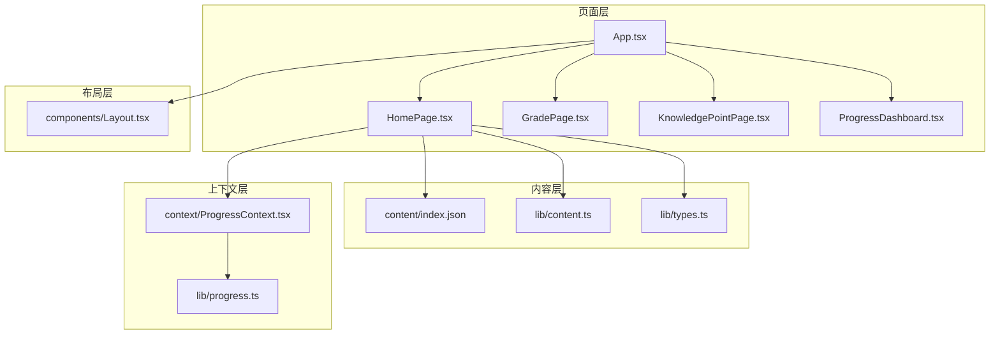
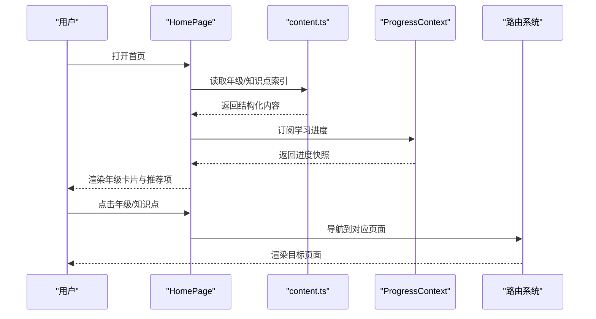
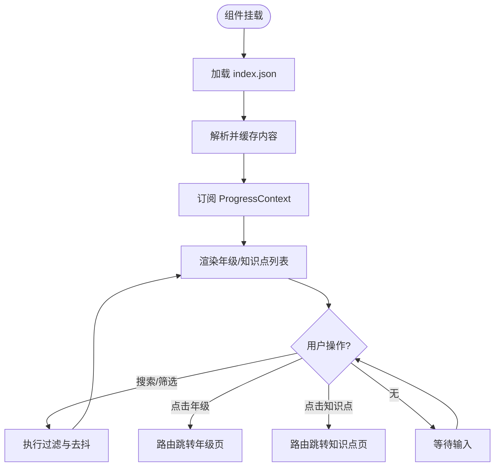
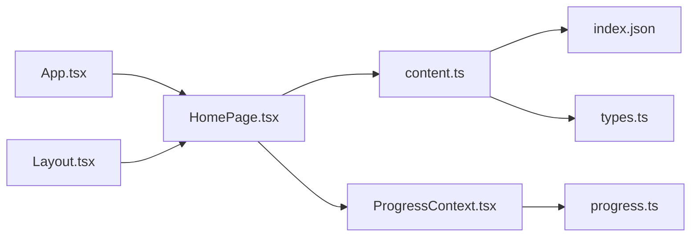

# HomePage 首页组件

<cite>
**本文引用的文件**   
- [HomePage.tsx](file://src/pages/HomePage.tsx)
- [App.tsx](file://src/App.tsx)
- [index.json](file://src/content/index.json)
- [content.ts](file://src/lib/content.ts)
- [types.ts](file://src/lib/types.ts)
- [ProgressContext.tsx](file://src/context/ProgressContext.tsx)
- [progress.ts](file://src/lib/progress.ts)
- [Layout.tsx](file://src/components/Layout.tsx)
</cite>

## 目录
1. [简介](#简介)
2. [项目结构](#项目结构)
3. [核心组件](#核心组件)
4. [架构总览](#架构总览)
5. [详细组件分析](#详细组件分析)
6. [依赖关系分析](#依赖关系分析)
7. [性能考虑](#性能考虑)
8. [故障排查指南](#故障排查指南)
9. [结论](#结论)
10. [附录](#附录)

## 简介
本文件为 HomePage 首页组件的权威文档。HomePage 作为应用入口，承担年级导航、内容概览与用户引导三大职责：通过年级维度组织知识点，提供学习路径概览，并基于进度上下文进行个性化引导。文档从设计理念、实现细节、Props 接口、状态管理、交互逻辑、布局与响应式、性能优化、路由集成、数据加载与错误处理，以及扩展方法等方面进行全面说明，帮助开发者快速理解并高效定制首页。

## 项目结构
HomePage 位于 pages 层，负责顶层导航与内容聚合；内容与类型定义在 lib 层；进度上下文在 context 层；页面容器由 App.tsx 与 Layout.tsx 共同承载。整体采用“页面-内容-上下文”的分层组织方式，便于按年级与知识点扩展。

图表来源
- [App.tsx](file://src/App.tsx)
- [HomePage.tsx](file://src/pages/HomePage.tsx)
- [index.json](file://src/content/index.json)
- [content.ts](file://src/lib/content.ts)
- [types.ts](file://src/lib/types.ts)
- [ProgressContext.tsx](file://src/context/ProgressContext.tsx)
- [progress.ts](file://src/lib/progress.ts)
- [Layout.tsx](file://src/components/Layout.tsx)

章节来源
- [HomePage.tsx](file://src/pages/HomePage.tsx)
- [App.tsx](file://src/App.tsx)
- [index.json](file://src/content/index.json)
- [content.ts](file://src/lib/content.ts)
- [types.ts](file://src/lib/types.ts)
- [ProgressContext.tsx](file://src/context/ProgressContext.tsx)
- [progress.ts](file://src/lib/progress.ts)
- [Layout.tsx](file://src/components/Layout.tsx)

## 核心组件
- HomePage（页面入口）
  - 职责：渲染年级导航卡片、展示内容概览、根据进度推荐下一步学习、处理点击跳转。
  - 数据来源：本地 content/index.json 与 lib/content.ts 解析；可选结合 ProgressContext 获取学习进度。
  - 交互：点击年级卡片进入年级页；点击知识点进入详情页或游戏；支持搜索/筛选（若实现）。
- 相关支撑
  - content.ts：统一读取与缓存 index.json，提供按年级/知识点查询能力。
  - types.ts：定义年级、知识点、元数据等类型契约。
  - ProgressContext.tsx + progress.ts：全局学习进度读写，驱动首页个性化推荐。
  - Layout.tsx：页面骨架、导航栏、侧边栏与响应式布局。

章节来源
- [HomePage.tsx](file://src/pages/HomePage.tsx)
- [content.ts](file://src/lib/content.ts)
- [types.ts](file://src/lib/types.ts)
- [ProgressContext.tsx](file://src/context/ProgressContext.tsx)
- [progress.ts](file://src/lib/progress.ts)
- [Layout.tsx](file://src/components/Layout.tsx)

## 架构总览
HomePage 作为入口，遵循“数据驱动+上下文驱动”的架构模式：
- 数据流：静态内容 index.json → content.ts 解析 → HomePage 渲染；进度数据由 ProgressContext 注入。
- 控制流：用户点击 → 路由跳转至 GradePage/KnowledgePointPage → 子页面按需加载详情。
- 状态流：ProgressContext 维护学习进度，HomePage 订阅变化以更新推荐与高亮。

图表来源
- [HomePage.tsx](file://src/pages/HomePage.tsx)
- [content.ts](file://src/lib/content.ts)
- [ProgressContext.tsx](file://src/context/ProgressContext.tsx)
- [App.tsx](file://src/App.tsx)

## 详细组件分析

### 组件：HomePage
- 设计目标
  - 清晰呈现年级结构与知识点分布，降低新用户认知成本。
  - 基于学习进度给出“下一步”建议，提升学习连贯性。
  - 保持可扩展性，新增年级/知识点无需改动核心逻辑。
- Props 接口（概念性描述）
  - 无强制外部 Props，内部通过上下文与本地内容源驱动。
  - 可配置项（如主题、文案、是否显示推荐）可通过上下文或配置对象注入（若实现）。
- 状态管理
  - 本地状态：当前筛选条件、搜索关键词、加载状态、错误信息。
  - 上下文状态：ProgressContext 提供的进度快照与更新函数。
- 数据加载机制
  - 启动时同步读取 index.json，并通过 content.ts 缓存结果。
  - 进度数据通过 Context 订阅，避免重复请求。
- 用户交互逻辑
  - 年级卡片点击：跳转到年级页，携带年级标识。
  - 知识点条目点击：跳转到知识点页或启动游戏。
  - 搜索/筛选：过滤年级或知识点列表，实时更新视图。
- 错误处理
  - 内容加载失败：降级展示空状态与重试按钮。
  - 进度读取异常：忽略异常并使用默认推荐策略。
- 布局与响应式
  - 使用栅格/弹性布局适配不同屏幕尺寸。
  - 移动端优先，卡片堆叠；平板/桌面端多列展示。
- 性能优化
  - 内容缓存：index.json 解析后缓存，避免重复 IO。
  - 懒加载：大列表分页或虚拟滚动（若实现）。
  - 防抖搜索：减少频繁过滤计算。
  - 最小化重渲染：拆分小组件、使用稳定键值。

图表来源
- [HomePage.tsx](file://src/pages/HomePage.tsx)
- [content.ts](file://src/lib/content.ts)
- [ProgressContext.tsx](file://src/context/ProgressContext.tsx)

章节来源
- [HomePage.tsx](file://src/pages/HomePage.tsx)
- [content.ts](file://src/lib/content.ts)
- [ProgressContext.tsx](file://src/context/ProgressContext.tsx)

### 组件：Layout（首页容器）
- 职责：提供页面框架、顶部导航、侧边栏、主内容区与底部信息。
- 响应式：移动端隐藏侧边栏，保留关键导航；桌面端双栏布局。
- 与 HomePage 的关系：HomePage 作为主内容区渲染，Layout 负责全局样式与布局约束。

章节来源
- [Layout.tsx](file://src/components/Layout.tsx)
- [HomePage.tsx](file://src/pages/HomePage.tsx)

### 组件：App（路由与上下文装配）
- 职责：初始化路由、注入 ProgressContext、挂载页面组件。
- 与 HomePage 的关系：HomePage 作为根路由之一被 App 渲染。

章节来源
- [App.tsx](file://src/App.tsx)
- [HomePage.tsx](file://src/pages/HomePage.tsx)

## 依赖关系分析
- 模块耦合
  - HomePage 依赖 content.ts（内容）、ProgressContext（进度）、路由系统（导航）。
  - content.ts 依赖 index.json（静态数据）与 types.ts（类型定义）。
  - ProgressContext 依赖 progress.ts（持久化/内存存储）。
- 潜在循环依赖
  - 页面层不反向依赖内容层，避免循环。
  - 上下文仅暴露 API，不直接引用页面组件。
- 外部依赖
  - 路由系统（React Router/Vike 等，视项目配置而定）。
  - 文件系统/构建工具用于读取 index.json。

图表来源
- [HomePage.tsx](file://src/pages/HomePage.tsx)
- [content.ts](file://src/lib/content.ts)
- [index.json](file://src/content/index.json)
- [types.ts](file://src/lib/types.ts)
- [ProgressContext.tsx](file://src/context/ProgressContext.tsx)
- [progress.ts](file://src/lib/progress.ts)
- [App.tsx](file://src/App.tsx)
- [Layout.tsx](file://src/components/Layout.tsx)

章节来源
- [HomePage.tsx](file://src/pages/HomePage.tsx)
- [content.ts](file://src/lib/content.ts)
- [index.json](file://src/content/index.json)
- [types.ts](file://src/lib/types.ts)
- [ProgressContext.tsx](file://src/context/ProgressContext.tsx)
- [progress.ts](file://src/lib/progress.ts)
- [App.tsx](file://src/App.tsx)
- [Layout.tsx](file://src/components/Layout.tsx)

## 性能考虑
- 内容缓存
  - 将 index.json 解析结果缓存于内存，避免重复 IO。
  - 对大型内容集合可采用分块加载与惰性求值。
- 渲染优化
  - 列表项使用稳定 key，避免不必要的重排。
  - 搜索与筛选使用防抖，降低高频计算开销。
  - 大列表考虑虚拟滚动或分页加载。
- 状态同步
  - 通过 Context 订阅最小粒度更新，避免全量刷新。
  - 进度更新合并批量写入，减少持久化频率。
- 资源加载
  - 首屏只加载必要内容，其他按需加载。
  - 图片与可视化资源延迟加载与压缩。

[本节为通用指导，不直接分析具体文件]

## 故障排查指南
- 内容无法加载
  - 检查 index.json 路径与格式是否正确。
  - 确认 content.ts 的读取逻辑与缓存策略。
  - 查看控制台网络请求与 JSON 解析错误。
- 进度不更新
  - 验证 ProgressContext 的订阅与更新函数调用。
  - 检查 progress.ts 的持久化存储是否可用。
- 路由跳转异常
  - 确认 App.tsx 中路由配置与参数传递。
  - 检查页面组件是否接收正确参数。
- 性能问题
  - 使用浏览器性能面板定位重渲染热点。
  - 增加缓存与懒加载，减少首屏负载。

章节来源
- [content.ts](file://src/lib/content.ts)
- [ProgressContext.tsx](file://src/context/ProgressContext.tsx)
- [progress.ts](file://src/lib/progress.ts)
- [App.tsx](file://src/App.tsx)

## 结论
HomePage 作为应用入口，通过清晰的年级导航、内容概览与进度驱动的个性化推荐，为用户提供了直观的学习起点。其模块化设计与稳定的类型契约，使得扩展新年级与知识点变得简单可靠。配合合理的性能优化与错误处理策略，可在不同设备上提供流畅体验。建议在生产环境中启用内容缓存、懒加载与进度合并写入，以获得更佳性能与稳定性。

[本节为总结性内容，不直接分析具体文件]

## 附录

### 自定义首页内容的扩展方法
- 新增年级/知识点
  - 在 index.json 中添加条目，确保字段符合 types.ts 定义。
  - 如需元数据，可在对应知识点的 meta.json 中补充。
- 修改推荐策略
  - 在 ProgressContext 或 progress.ts 中调整推荐算法（如未完成优先、难度递增）。
- 扩展筛选与搜索
  - 在 HomePage 中增加搜索框与筛选器，使用防抖优化性能。
- 主题与文案
  - 通过上下文或配置对象注入主题色、文案与布局选项。

章节来源
- [index.json](file://src/content/index.json)
- [types.ts](file://src/lib/types.ts)
- [ProgressContext.tsx](file://src/context/ProgressContext.tsx)
- [progress.ts](file://src/lib/progress.ts)
- [HomePage.tsx](file://src/pages/HomePage.tsx)

### 最佳实践指南
- 保持内容数据结构稳定，避免破坏向后兼容。
- 对长列表实施分页或虚拟滚动，避免首屏卡顿。
- 使用稳定的 key 与不可变数据更新，减少重渲染。
- 对异步操作添加错误边界与用户提示。
- 通过单元测试覆盖内容解析与推荐逻辑。

[本节为通用指导，不直接分析具体文件]