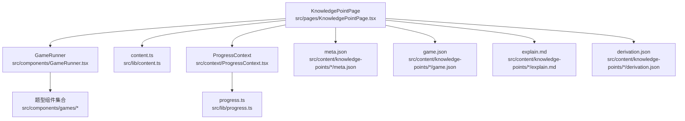
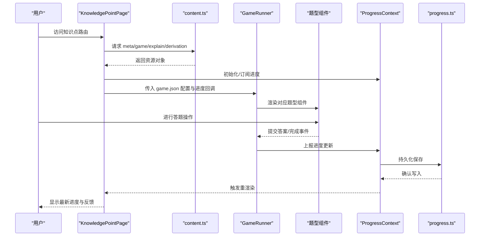
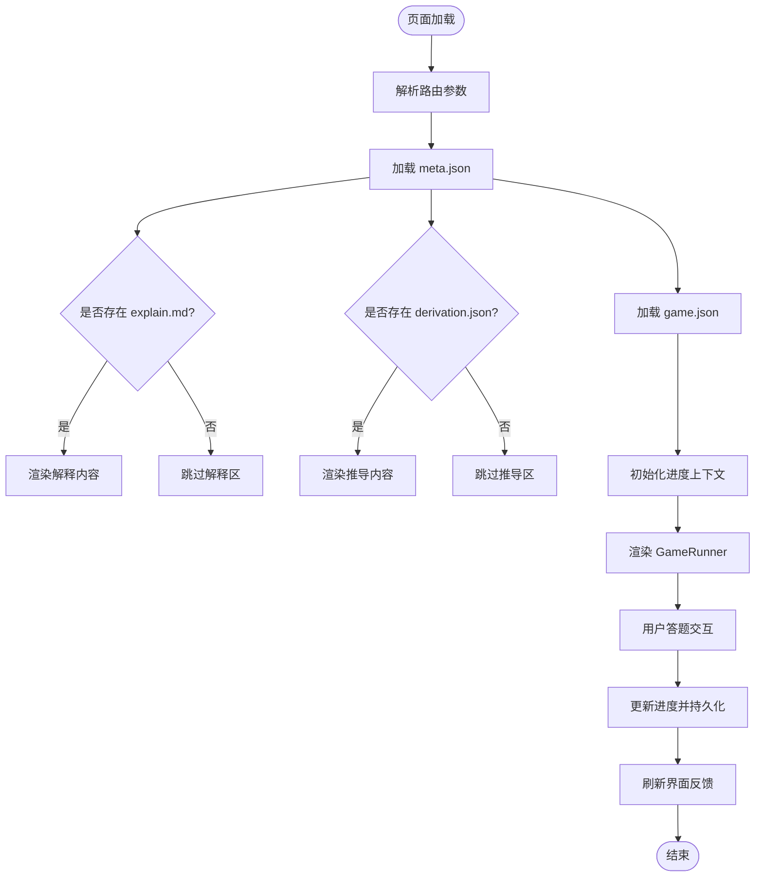
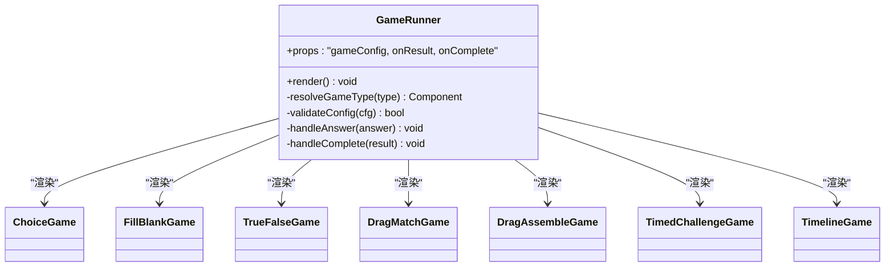
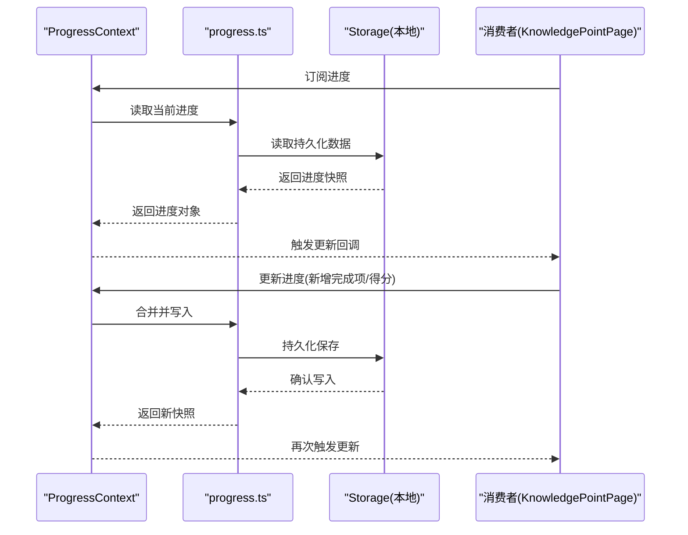
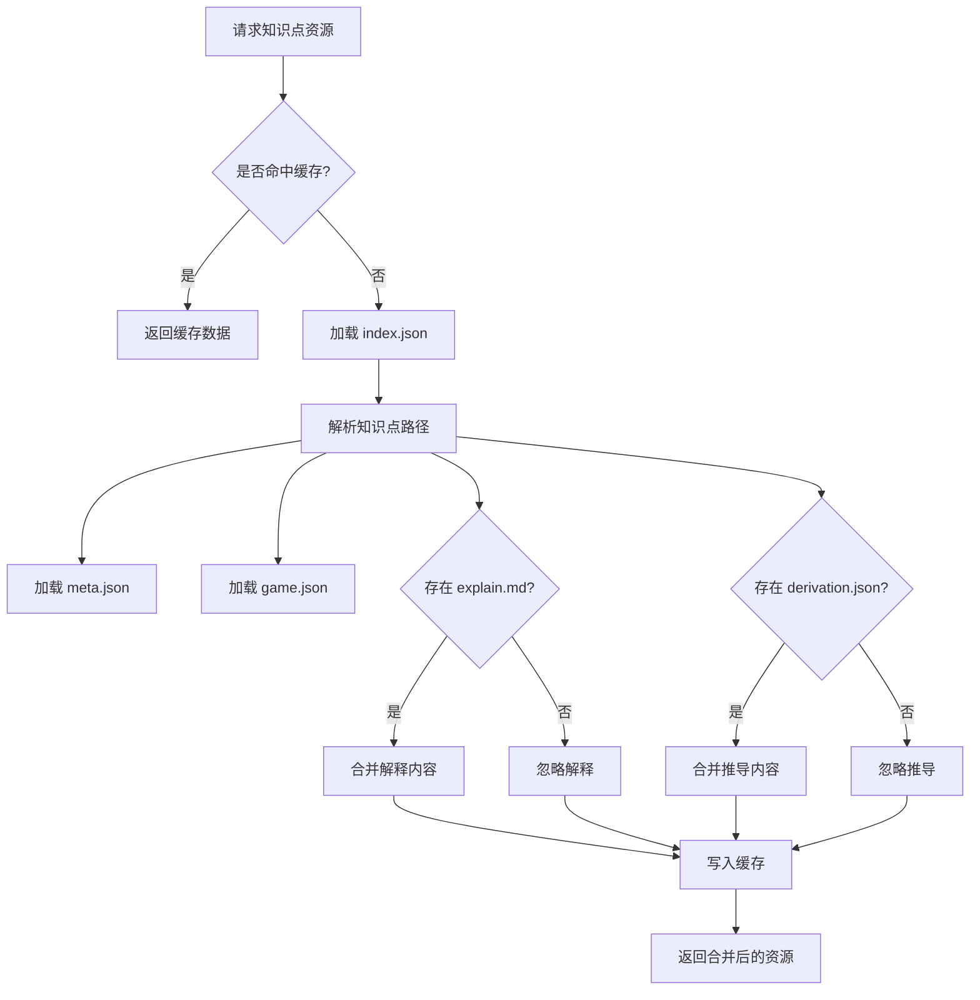
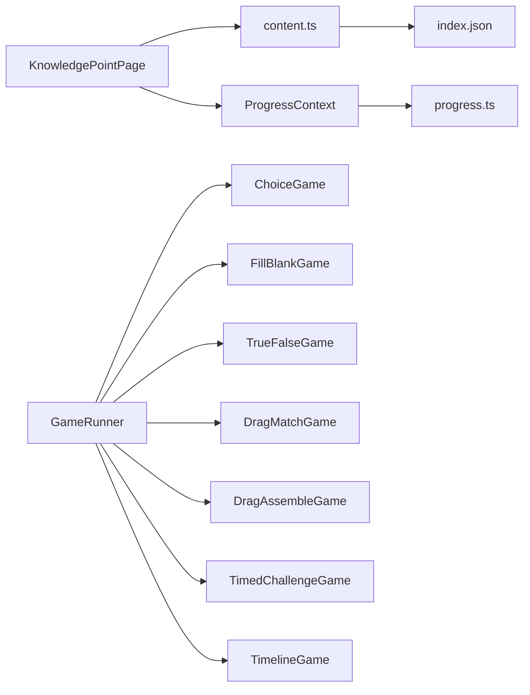

# KnowledgePointPage 知识点详情页

<cite>
**本文引用的文件**   
- [KnowledgePointPage.tsx](file://src/pages/KnowledgePointPage.tsx)
- [GameRunner.tsx](file://src/components/GameRunner.tsx)
- [ProgressContext.tsx](file://src/context/ProgressContext.tsx)
- [progress.ts](file://src/lib/progress.ts)
- [content.ts](file://src/lib/content.ts)
- [types.ts](file://src/lib/types.ts)
- [index.json](file://src/content/index.json)
- [g3-add-sub-10000/meta.json](file://src/content/knowledge-points/g3-add-sub-10000/meta.json)
- [g3-add-sub-10000/game.json](file://src/content/knowledge-points/g3-add-sub-10000/game.json)
- [g3-fraction-add-sub/explain.md](file://src/content/knowledge-points/g3-fraction-add-sub/explain.md)
- [g3-fraction-add-sub/derivation.json](file://src/content/knowledge-points/g3-fraction-add-sub/derivation.json)
- [ChoiceGame.tsx](file://src/components/games/ChoiceGame.tsx)
- [FillBlankGame.tsx](file://src/components/games/FillBlankGame.tsx)
- [TrueFalseGame.tsx](file://src/components/games/TrueFalseGame.tsx)
- [DragMatchGame.tsx](file://src/components/games/DragMatchGame.tsx)
- [DragAssembleGame.tsx](file://src/components/games/DragAssembleGame.tsx)
- [TimedChallengeGame.tsx](file://src/components/games/TimedChallengeGame.tsx)
- [TimelineGame.tsx](file://src/components/games/TimelineGame.tsx)
</cite>

## 目录
1. [简介](#简介)
2. [项目结构](#项目结构)
3. [核心组件](#核心组件)
4. [架构总览](#架构总览)
5. [详细组件分析](#详细组件分析)
6. [依赖关系分析](#依赖关系分析)
7. [性能考虑](#性能考虑)
8. [故障排查指南](#故障排查指南)
9. [结论](#结论)
10. [附录](#附录)

## 简介
本文件为 KnowledgePointPage（知识点详情页）提供系统化、可操作的文档。内容覆盖：
- 知识点内容展示（解释文本、推导过程、元数据）
- 游戏运行器集成（动态加载与渲染不同题型）
- 学习进度跟踪（持久化、状态同步、更新机制）
- 数据流管理、状态同步与用户交互处理
- 渲染逻辑、游戏配置解析与进度更新机制
- 页面加载优化、错误边界与用户反馈设计
- 自定义知识点展示与游戏集成的开发指南

## 项目结构
KnowledgePointPage 位于 pages 层，负责路由级页面编排；其依赖 components 中的 GameRunner 与知识点的 content 资源（meta.json、game.json、explain.md、derivation.json）。进度通过 context 与 lib/progress 模块统一管理。

图表来源
- [KnowledgePointPage.tsx](file://src/pages/KnowledgePointPage.tsx)
- [GameRunner.tsx](file://src/components/GameRunner.tsx)
- [content.ts](file://src/lib/content.ts)
- [ProgressContext.tsx](file://src/context/ProgressContext.tsx)
- [progress.ts](file://src/lib/progress.ts)
- [index.json](file://src/content/index.json)
- [g3-add-sub-10000/meta.json](file://src/content/knowledge-points/g3-add-sub-10000/meta.json)
- [g3-add-sub-10000/game.json](file://src/content/knowledge-points/g3-add-sub-10000/game.json)
- [g3-fraction-add-sub/explain.md](file://src/content/knowledge-points/g3-fraction-add-sub/explain.md)
- [g3-fraction-add-sub/derivation.json](file://src/content/knowledge-points/g3-fraction-add-sub/derivation.json)

章节来源
- [KnowledgePointPage.tsx](file://src/pages/KnowledgePointPage.tsx)
- [content.ts](file://src/lib/content.ts)
- [ProgressContext.tsx](file://src/context/ProgressContext.tsx)
- [progress.ts](file://src/lib/progress.ts)
- [index.json](file://src/content/index.json)

## 核心组件
- KnowledgePointPage：页面入口，负责根据路由参数加载知识点资源（元信息、解释、推导、游戏配置），组装 UI，并驱动 GameRunner 与进度上下文。
- GameRunner：统一的游戏运行时，依据 game.json 配置动态选择并渲染具体题型组件，处理答题回调与结果上报。
- ProgressContext + progress.ts：全局学习进度上下文与持久化存储，提供读取、更新、合并与订阅能力。
- content.ts：知识点资源的加载与缓存，支持 index.json 索引与按路径拉取 meta/game/explain/derivation。

章节来源
- [KnowledgePointPage.tsx](file://src/pages/KnowledgePointPage.tsx)
- [GameRunner.tsx](file://src/components/GameRunner.tsx)
- [ProgressContext.tsx](file://src/context/ProgressContext.tsx)
- [progress.ts](file://src/lib/progress.ts)
- [content.ts](file://src/lib/content.ts)

## 架构总览
KnowledgePointPage 的数据流遵循“路由参数 → 资源加载 → 状态装配 → 渲染 → 用户交互 → 进度更新”的闭环。

图表来源
- [KnowledgePointPage.tsx](file://src/pages/KnowledgePointPage.tsx)
- [content.ts](file://src/lib/content.ts)
- [GameRunner.tsx](file://src/components/GameRunner.tsx)
- [ProgressContext.tsx](file://src/context/ProgressContext.tsx)
- [progress.ts](file://src/lib/progress.ts)

## 详细组件分析

### KnowledgePointPage 组件
职责
- 解析路由参数，确定知识点标识
- 调用 content.ts 获取 meta.json、game.json、explain.md、derivation.json
- 将资源与进度上下文组合，渲染知识点标题、解释、推导与游戏区域
- 监听用户交互，驱动 GameRunner 与进度更新

关键流程
- 页面挂载时加载资源与进度
- 资源就绪后渲染解释区与推导区（若存在）
- 渲染 GameRunner，并传递游戏配置与进度回调
- 进度变化时局部刷新界面（如完成标记、得分提示）

数据流
- 输入：路由参数、index.json 索引
- 输出：知识点详情 UI、游戏运行容器、进度指示

错误处理
- 资源缺失或格式异常时降级展示（仅显示可用部分）
- 网络或异步加载失败时给出友好提示

图表来源
- [KnowledgePointPage.tsx](file://src/pages/KnowledgePointPage.tsx)
- [content.ts](file://src/lib/content.ts)
- [ProgressContext.tsx](file://src/context/ProgressContext.tsx)
- [progress.ts](file://src/lib/progress.ts)

章节来源
- [KnowledgePointPage.tsx](file://src/pages/KnowledgePointPage.tsx)
- [content.ts](file://src/lib/content.ts)
- [ProgressContext.tsx](file://src/context/ProgressContext.tsx)
- [progress.ts](file://src/lib/progress.ts)

### GameRunner 组件
职责
- 接收 game.json 配置，解析题型类型与参数
- 动态选择并渲染对应题型组件（选择题、填空题、判断题、拖拽匹配、拖拽拼装、限时挑战、时间线等）
- 收集答题结果，调用进度回调以更新学习进度
- 处理游戏生命周期（开始、进行中、完成、重试）

关键流程
- 校验配置有效性
- 映射题型到具体组件
- 向子组件注入初始状态与回调
- 汇总结果并上报

图表来源
- [GameRunner.tsx](file://src/components/GameRunner.tsx)
- [ChoiceGame.tsx](file://src/components/games/ChoiceGame.tsx)
- [FillBlankGame.tsx](file://src/components/games/FillBlankGame.tsx)
- [TrueFalseGame.tsx](file://src/components/games/TrueFalseGame.tsx)
- [DragMatchGame.tsx](file://src/components/games/DragMatchGame.tsx)
- [DragAssembleGame.tsx](file://src/components/games/DragAssembleGame.tsx)
- [TimedChallengeGame.tsx](file://src/components/games/TimedChallengeGame.tsx)
- [TimelineGame.tsx](file://src/components/games/TimelineGame.tsx)

章节来源
- [GameRunner.tsx](file://src/components/GameRunner.tsx)
- [ChoiceGame.tsx](file://src/components/games/ChoiceGame.tsx)
- [FillBlankGame.tsx](file://src/components/games/FillBlankGame.tsx)
- [TrueFalseGame.tsx](file://src/components/games/TrueFalseGame.tsx)
- [DragMatchGame.tsx](file://src/components/games/DragMatchGame.tsx)
- [DragAssembleGame.tsx](file://src/components/games/DragAssembleGame.tsx)
- [TimedChallengeGame.tsx](file://src/components/games/TimedChallengeGame.tsx)
- [TimelineGame.tsx](file://src/components/games/TimelineGame.tsx)

### 进度上下文与持久化（ProgressContext + progress.ts）
职责
- 提供全局学习进度状态（已完成题目、得分、用时等）
- 提供读取、更新、合并与订阅接口
- 将进度持久化到本地存储，确保跨会话一致性

关键流程
- 初始化时从持久化源加载进度
- 订阅变更并通知消费者（如 KnowledgePointPage）
- 增量更新与幂等合并，避免重复计数
- 错误回退与降级策略（如存储不可用）

图表来源
- [ProgressContext.tsx](file://src/context/ProgressContext.tsx)
- [progress.ts](file://src/lib/progress.ts)

章节来源
- [ProgressContext.tsx](file://src/context/ProgressContext.tsx)
- [progress.ts](file://src/lib/progress.ts)

### 知识点资源加载（content.ts + index.json）
职责
- 维护知识点索引（index.json）
- 按路径拉取 meta.json、game.json、explain.md、derivation.json
- 提供缓存与错误处理

关键流程
- 首次访问时加载索引
- 按需拉取单个知识点资源
- 对缺失字段进行容错处理

图表来源
- [content.ts](file://src/lib/content.ts)
- [index.json](file://src/content/index.json)

章节来源
- [content.ts](file://src/lib/content.ts)
- [index.json](file://src/content/index.json)

### 知识点资源模型（types.ts）
职责
- 定义知识点相关数据结构（元数据、游戏配置、解释与推导）
- 为各模块提供类型约束，保证数据一致性

要点
- 明确必填与可选字段
- 定义题型枚举与参数规范
- 定义进度记录的结构与版本兼容

章节来源
- [types.ts](file://src/lib/types.ts)

### 知识点示例资源
- g3-add-sub-10000：包含 meta.json 与 game.json，用于基础加减法知识点
- g3-fraction-add-sub：包含 explain.md 与 derivation.json，用于分数加减法的解释与推导

章节来源
- [g3-add-sub-10000/meta.json](file://src/content/knowledge-points/g3-add-sub-10000/meta.json)
- [g3-add-sub-10000/game.json](file://src/content/knowledge-points/g3-add-sub-10000/game.json)
- [g3-fraction-add-sub/explain.md](file://src/content/knowledge-points/g3-fraction-add-sub/explain.md)
- [g3-fraction-add-sub/derivation.json](file://src/content/knowledge-points/g3-fraction-add-sub/derivation.json)

## 依赖关系分析
- KnowledgePointPage 依赖 content.ts 获取资源，依赖 ProgressContext 管理进度
- GameRunner 依赖题型组件集合，依据 game.json 动态渲染
- ProgressContext 依赖 progress.ts 进行持久化读写
- content.ts 依赖 index.json 作为知识点索引

图表来源
- [KnowledgePointPage.tsx](file://src/pages/KnowledgePointPage.tsx)
- [content.ts](file://src/lib/content.ts)
- [ProgressContext.tsx](file://src/context/ProgressContext.tsx)
- [progress.ts](file://src/lib/progress.ts)
- [GameRunner.tsx](file://src/components/GameRunner.tsx)
- [index.json](file://src/content/index.json)

章节来源
- [KnowledgePointPage.tsx](file://src/pages/KnowledgePointPage.tsx)
- [GameRunner.tsx](file://src/components/GameRunner.tsx)
- [ProgressContext.tsx](file://src/context/ProgressContext.tsx)
- [progress.ts](file://src/lib/progress.ts)
- [content.ts](file://src/lib/content.ts)
- [index.json](file://src/content/index.json)

## 性能考虑
- 资源懒加载：仅在需要时加载 explain.md 与 derivation.json，减少首屏体积
- 索引缓存：index.json 与知识点资源在内存中缓存，避免重复请求
- 进度更新节流：批量更新与防抖，降低频繁持久化带来的开销
- 组件拆分：题型组件按需加载，避免主包膨胀
- 错误降级：当某资源缺失时，仍展示可用内容，提升可用性

[本节为通用指导，不直接分析具体文件]

## 故障排查指南
常见问题与定位方法
- 知识点资源未加载：检查 index.json 与路径解析是否正确；查看 content.ts 的错误分支
- 游戏无法渲染：核对 game.json 的题型类型与参数是否符合 types.ts 定义；检查 GameRunner 的类型映射
- 进度未更新：确认 ProgressContext 的订阅与更新回调是否被触发；检查 progress.ts 的持久化写入是否成功
- 页面卡顿：排查大量渲染或频繁状态更新；使用浏览器性能面板定位瓶颈

建议的调试步骤
- 打开控制台日志，观察资源加载顺序与错误信息
- 验证本地存储中的进度数据是否与预期一致
- 逐步注释渲染逻辑，缩小问题范围

章节来源
- [content.ts](file://src/lib/content.ts)
- [GameRunner.tsx](file://src/components/GameRunner.tsx)
- [ProgressContext.tsx](file://src/context/ProgressContext.tsx)
- [progress.ts](file://src/lib/progress.ts)

## 结论
KnowledgePointPage 通过清晰的分层与模块化设计，实现了知识点内容的灵活展示、游戏的动态集成与学习进度的可靠跟踪。借助 content.ts 的资源管理与 ProgressContext 的状态同步，页面具备良好的可扩展性与健壮性。遵循本文档的开发指南，可快速扩展新的知识点与题型，同时保持用户体验的一致性。

[本节为总结，不直接分析具体文件]

## 附录

### 自定义知识点展示指南
- 在 src/content/knowledge-points 下新建文件夹，命名遵循年级-主题规则
- 编写 meta.json（标题、描述、标签等）、可选 explain.md（解释内容）、可选 derivation.json（推导过程）
- 编写 game.json（题型类型、参数、题目数据等）
- 在 index.json 中添加条目，确保路径与文件名一致
- 在 KnowledgePointPage 中无需修改代码，即可自动识别与渲染

章节来源
- [g3-add-sub-10000/meta.json](file://src/content/knowledge-points/g3-add-sub-10000/meta.json)
- [g3-add-sub-10000/game.json](file://src/content/knowledge-points/g3-add-sub-10000/game.json)
- [g3-fraction-add-sub/explain.md](file://src/content/knowledge-points/g3-fraction-add-sub/explain.md)
- [g3-fraction-add-sub/derivation.json](file://src/content/knowledge-points/g3-fraction-add-sub/derivation.json)
- [index.json](file://src/content/index.json)

### 自定义游戏集成指南
- 在 src/components/games 下实现新题型组件，遵循统一的 props 与回调约定
- 在 GameRunner 中注册新题型类型，完成类型映射与渲染逻辑
- 在 types.ts 中补充题型参数与结果结构定义
- 在 game.json 中配置新题型的实例数据与参数
- 测试答题回调与进度上报，确保进度更新正确

章节来源
- [GameRunner.tsx](file://src/components/GameRunner.tsx)
- [types.ts](file://src/lib/types.ts)
- [ChoiceGame.tsx](file://src/components/games/ChoiceGame.tsx)
- [FillBlankGame.tsx](file://src/components/games/FillBlankGame.tsx)
- [TrueFalseGame.tsx](file://src/components/games/TrueFalseGame.tsx)
- [DragMatchGame.tsx](file://src/components/games/DragMatchGame.tsx)
- [DragAssembleGame.tsx](file://src/components/games/DragAssembleGame.tsx)
- [TimedChallengeGame.tsx](file://src/components/games/TimedChallengeGame.tsx)
- [TimelineGame.tsx](file://src/components/games/TimelineGame.tsx)