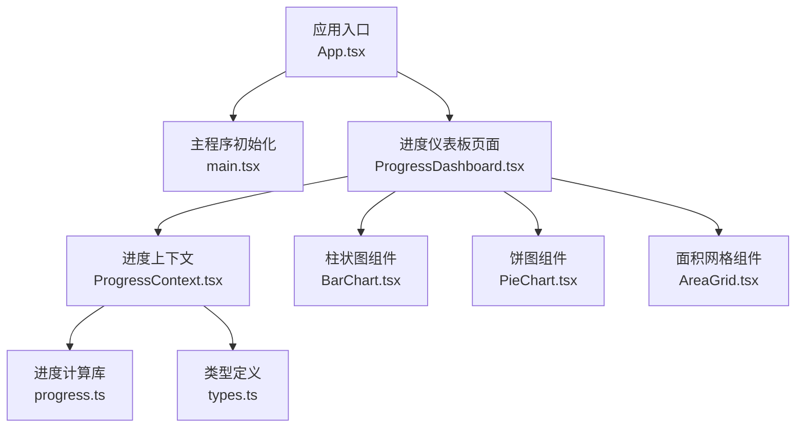
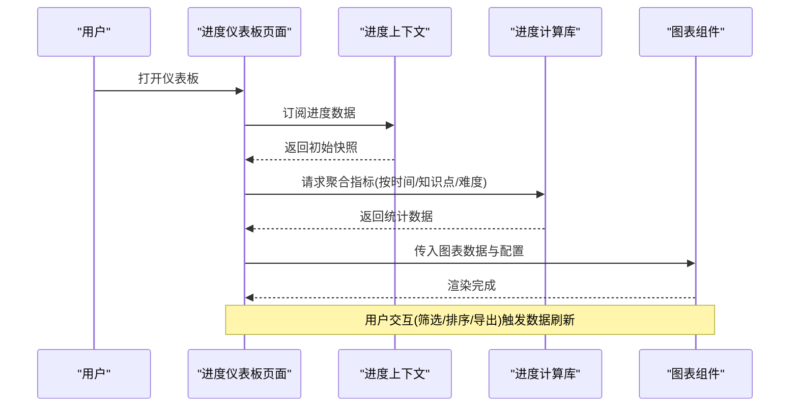
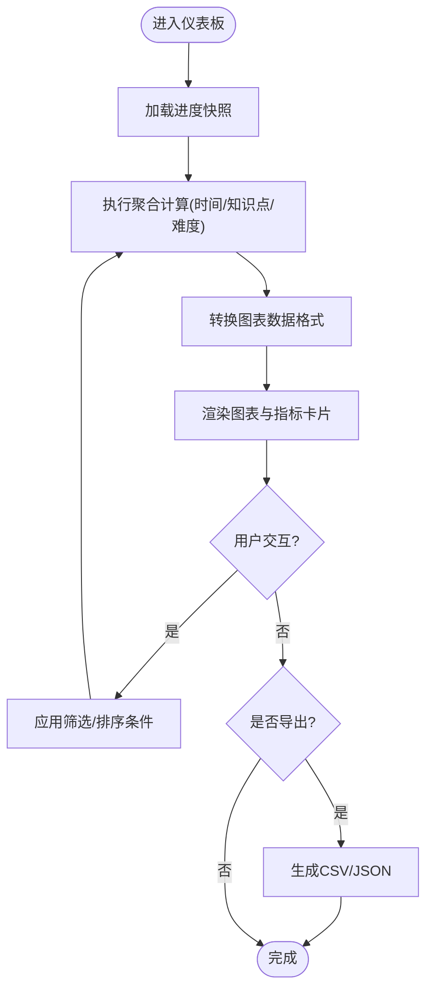
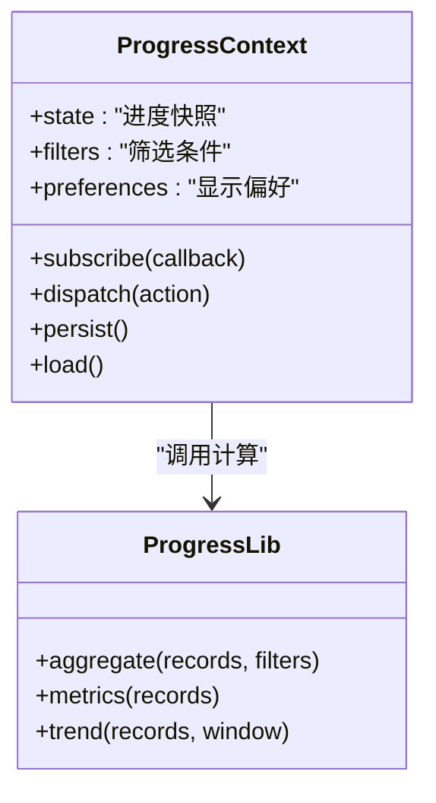
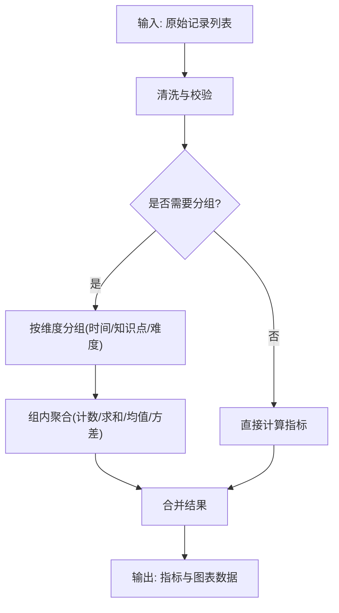
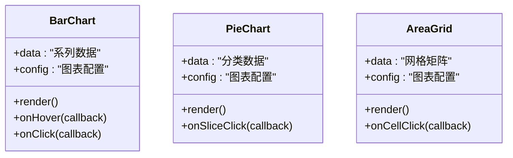
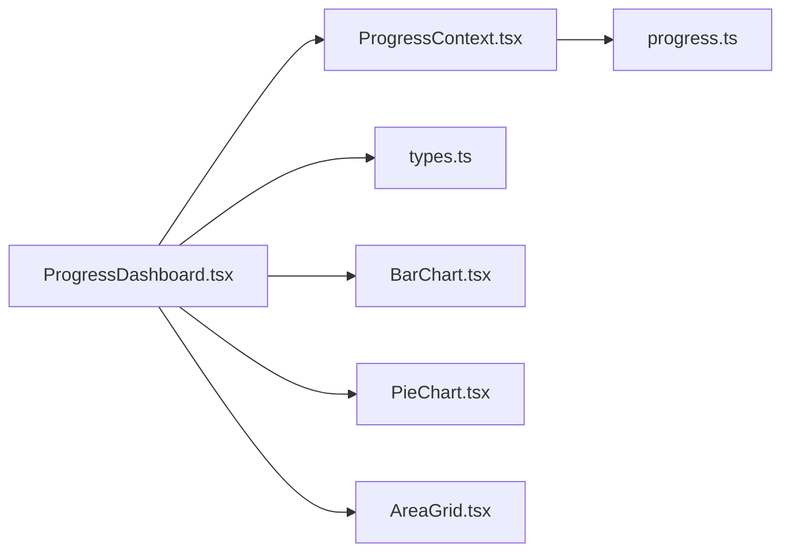

# ProgressDashboard 学习进度仪表板

<cite>
**本文引用的文件**   
- [ProgressDashboard.tsx](file://src/pages/ProgressDashboard.tsx)
- [ProgressContext.tsx](file://src/context/ProgressContext.tsx)
- [progress.ts](file://src/lib/progress.ts)
- [types.ts](file://src/lib/types.ts)
- [BarChart.tsx](file://src/visualizations/BarChart.tsx)
- [PieChart.tsx](file://src/visualizations/PieChart.tsx)
- [AreaGrid.tsx](file://src/visualizations/AreaGrid.tsx)
- [App.tsx](file://src/App.tsx)
- [main.tsx](file://src/main.tsx)
- [package.json](file://package.json)
</cite>

## 目录
1. [简介](#简介)
2. [项目结构](#项目结构)
3. [核心组件](#核心组件)
4. [架构总览](#架构总览)
5. [详细组件分析](#详细组件分析)
6. [依赖关系分析](#依赖关系分析)
7. [性能考量](#性能考量)
8. [故障排查指南](#故障排查指南)
9. [结论](#结论)
10. [附录](#附录)

## 简介
本文件为 ProgressDashboard 学习进度仪表板的完整技术文档，聚焦数据可视化、统计聚合、成绩分析与报告生成。内容涵盖：
- 进度统计与成绩分析的指标定义与计算方式
- 图表渲染与用户交互设计
- 数据的计算、存储策略与实时更新机制
- 数据导出、个性化设置与响应式布局
- 自定义统计维度与扩展分析方法

## 项目结构
ProgressDashboard 位于 pages 层，通过 context 管理全局学习进度状态，lib 层提供类型定义与进度计算逻辑，visualizations 层提供可复用的图表组件。整体采用“页面-上下文-库函数-可视化”的分层组织。

**图示来源** 
- [App.tsx](file://src/App.tsx)
- [main.tsx](file://src/main.tsx)
- [ProgressDashboard.tsx](file://src/pages/ProgressDashboard.tsx)
- [ProgressContext.tsx](file://src/context/ProgressContext.tsx)
- [progress.ts](file://src/lib/progress.ts)
- [types.ts](file://src/lib/types.ts)
- [BarChart.tsx](file://src/visualizations/BarChart.tsx)
- [PieChart.tsx](file://src/visualizations/PieChart.tsx)
- [AreaGrid.tsx](file://src/visualizations/AreaGrid.tsx)

**章节来源**
- [App.tsx](file://src/App.tsx)
- [main.tsx](file://src/main.tsx)
- [ProgressDashboard.tsx](file://src/pages/ProgressDashboard.tsx)
- [ProgressContext.tsx](file://src/context/ProgressContext.tsx)
- [progress.ts](file://src/lib/progress.ts)
- [types.ts](file://src/lib/types.ts)
- [BarChart.tsx](file://src/visualizations/BarChart.tsx)
- [PieChart.tsx](file://src/visualizations/PieChart.tsx)
- [AreaGrid.tsx](file://src/visualizations/AreaGrid.tsx)

## 核心组件
- 进度仪表板页面（ProgressDashboard）
  - 负责汇总展示学习进度、成绩分布、知识点掌握度等关键指标
  - 集成多种图表进行可视化呈现，并支持筛选、排序与导出
- 进度上下文（ProgressContext）
  - 集中管理学习进度数据、更新事件与持久化策略
  - 暴露统一的订阅与派发接口供页面与图表消费
- 进度计算库（progress.ts）
  - 实现指标计算、聚合与统计方法
  - 提供时间窗口、知识点维度、难度等级等多维聚合能力
- 类型定义（types.ts）
  - 统一定义进度记录、成绩条目、图表数据模型与配置项
- 可视化组件（BarChart、PieChart、AreaGrid）
  - 基于统一数据契约渲染图表，支持主题、尺寸与交互回调

**章节来源**
- [ProgressDashboard.tsx](file://src/pages/ProgressDashboard.tsx)
- [ProgressContext.tsx](file://src/context/ProgressContext.tsx)
- [progress.ts](file://src/lib/progress.ts)
- [types.ts](file://src/lib/types.ts)
- [BarChart.tsx](file://src/visualizations/BarChart.tsx)
- [PieChart.tsx](file://src/visualizations/PieChart.tsx)
- [AreaGrid.tsx](file://src/visualizations/AreaGrid.tsx)

## 架构总览
仪表板采用“上下文驱动 + 库函数计算 + 组件渲染”的架构模式。页面订阅上下文中的进度快照，当数据变更时触发重渲染；计算逻辑集中在库函数中，保证一致性与可测试性；图表组件仅关注数据到视图的映射。

**图示来源** 
- [ProgressDashboard.tsx](file://src/pages/ProgressDashboard.tsx)
- [ProgressContext.tsx](file://src/context/ProgressContext.tsx)
- [progress.ts](file://src/lib/progress.ts)
- [BarChart.tsx](file://src/visualizations/BarChart.tsx)
- [PieChart.tsx](file://src/visualizations/PieChart.tsx)
- [AreaGrid.tsx](file://src/visualizations/AreaGrid.tsx)

## 详细组件分析

### 进度仪表板页面（ProgressDashboard）
- 职责
  - 聚合多维度指标：总体完成率、正确率、用时趋势、知识点掌握度
  - 组合图表：柱状图用于对比不同知识点的得分或完成量，饼图用于展示成绩分布，面积网格用于展示学习密度或时间热力
  - 交互：时间范围选择、知识点筛选、难度过滤、排序与导出
- 数据流
  - 从上下文获取原始进度记录，调用库函数进行聚合
  - 将聚合结果转换为图表所需的数据结构
  - 监听用户操作，重新计算并刷新视图
- 关键点
  - 使用防抖/节流优化频繁筛选导致的重算
  - 对大数据集进行分页或采样渲染
  - 导出功能支持 CSV/JSON，便于二次分析

**图示来源** 
- [ProgressDashboard.tsx](file://src/pages/ProgressDashboard.tsx)
- [progress.ts](file://src/lib/progress.ts)

**章节来源**
- [ProgressDashboard.tsx](file://src/pages/ProgressDashboard.tsx)

### 进度上下文（ProgressContext）
- 职责
  - 维护全局进度状态：原始记录、聚合结果、筛选条件、主题与显示偏好
  - 提供增删改查接口与事件订阅，确保多组件一致性
  - 管理本地持久化（如 localStorage）与增量同步
- 更新机制
  - 新增练习记录后触发增量更新，避免全量重算
  - 批量导入时合并去重，保持数据一致性
- 错误处理
  - 校验输入字段完整性与类型
  - 捕获序列化/反序列化异常并提供回退策略

**图示来源** 
- [ProgressContext.tsx](file://src/context/ProgressContext.tsx)
- [progress.ts](file://src/lib/progress.ts)

**章节来源**
- [ProgressContext.tsx](file://src/context/ProgressContext.tsx)

### 进度计算库（progress.ts）
- 职责
  - 指标计算：完成率、正确率、平均用时、进步曲线
  - 聚合方法：按时间窗口（日/周/月）、知识点、难度等级分组
  - 趋势分析：移动平均、同比环比、异常点检测
- 复杂度与优化
  - 聚合通常 O(n log n) 或 O(n)，可通过索引与缓存降低重复计算
  - 对大规模数据集采用分块计算与懒加载
- 可扩展性
  - 提供插件式指标注册接口，便于新增自定义统计维度

**图示来源** 
- [progress.ts](file://src/lib/progress.ts)

**章节来源**
- [progress.ts](file://src/lib/progress.ts)

### 类型定义（types.ts）
- 关键类型
  - 进度记录：包含时间戳、知识点标识、难度、得分、用时、是否正确等
  - 图表数据：系列、标签、数值、颜色、提示文本
  - 配置项：主题、语言、单位、时间粒度、导出格式
- 约束与校验
  - 必填字段、枚举值、取值范围与格式校验规则

**章节来源**
- [types.ts](file://src/lib/types.ts)

### 可视化组件（BarChart、PieChart、AreaGrid）
- 数据契约
  - 统一接收数组型数据与配置对象，内部进行归一化处理
- 渲染策略
  - 柱状图：按类别分组，支持堆叠与对比
  - 饼图：按占比展示，支持环形与百分比标注
  - 面积网格：按时间或维度填充单元格，支持热力强度映射
- 交互能力
  - 悬停提示、点击筛选、缩放与平移
  - 响应式布局适配移动端与桌面端

**图示来源** 
- [BarChart.tsx](file://src/visualizations/BarChart.tsx)
- [PieChart.tsx](file://src/visualizations/PieChart.tsx)
- [AreaGrid.tsx](file://src/visualizations/AreaGrid.tsx)

**章节来源**
- [BarChart.tsx](file://src/visualizations/BarChart.tsx)
- [PieChart.tsx](file://src/visualizations/PieChart.tsx)
- [AreaGrid.tsx](file://src/visualizations/AreaGrid.tsx)

## 依赖关系分析
- 页面依赖上下文提供的状态与事件
- 上下文依赖库函数进行数据计算
- 页面与图表组件依赖类型定义确保数据结构一致
- 外部依赖由包管理器声明，图表库与工具库按需引入

**图示来源** 
- [ProgressDashboard.tsx](file://src/pages/ProgressDashboard.tsx)
- [ProgressContext.tsx](file://src/context/ProgressContext.tsx)
- [progress.ts](file://src/lib/progress.ts)
- [types.ts](file://src/lib/types.ts)
- [BarChart.tsx](file://src/visualizations/BarChart.tsx)
- [PieChart.tsx](file://src/visualizations/PieChart.tsx)
- [AreaGrid.tsx](file://src/visualizations/AreaGrid.tsx)

**章节来源**
- [package.json](file://package.json)

## 性能考量
- 计算优化
  - 增量更新：仅对变更的记录进行重算
  - 缓存与索引：对常用聚合结果进行缓存，减少重复计算
  - 分块与懒加载：大数据集分批渲染，提升首屏速度
- 渲染优化
  - 虚拟滚动与按需渲染
  - 防抖/节流：对频繁交互进行节流，避免过度重绘
- 内存管理
  - 及时释放不再使用的中间数据
  - 限制历史快照数量，避免内存膨胀

[本节为通用指导，不直接分析具体文件]

## 故障排查指南
- 常见问题
  - 数据缺失或类型错误：检查类型定义与输入校验
  - 图表不更新：确认上下文订阅与事件派发是否正常
  - 导出失败：检查文件格式与编码设置
- 调试建议
  - 在上下文层打印状态变化与事件流
  - 在库函数层断点验证聚合结果
  - 使用浏览器开发者工具监控网络与本地存储

**章节来源**
- [ProgressContext.tsx](file://src/context/ProgressContext.tsx)
- [progress.ts](file://src/lib/progress.ts)
- [types.ts](file://src/lib/types.ts)

## 结论
ProgressDashboard 以清晰的层次结构与稳定的数据流为基础，提供了强大的学习进度可视化与分析能力。通过上下文集中管理状态、库函数统一计算指标、组件专注渲染与交互，系统具备良好的可维护性与扩展性。未来可在指标插件化、实时同步与更丰富的图表类型上持续演进。

[本节为总结性内容，不直接分析具体文件]

## 附录
- 数据导出
  - 支持 CSV/JSON 导出，包含原始记录与聚合结果
  - 可配置字段与分隔符，便于第三方工具导入
- 个性化设置
  - 主题切换、语言本地化、单位与时间粒度配置
  - 默认筛选条件与图表布局偏好
- 响应式布局
  - 自适应栅格与弹性布局，确保移动端体验
  - 图表尺寸与交互方式根据设备自动调整
- 自定义统计维度
  - 在库函数中注册新指标与聚合规则
  - 在类型定义中扩展数据结构与校验规则
  - 在页面中接入新的筛选与展示组件

[本节为概念性说明，不直接分析具体文件]