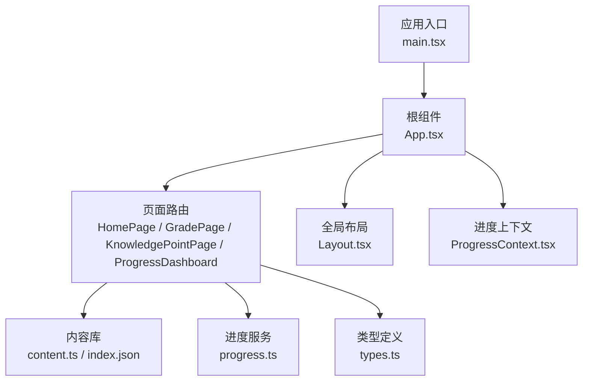
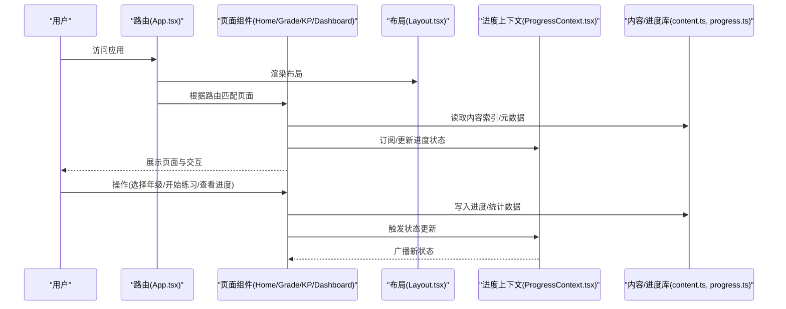
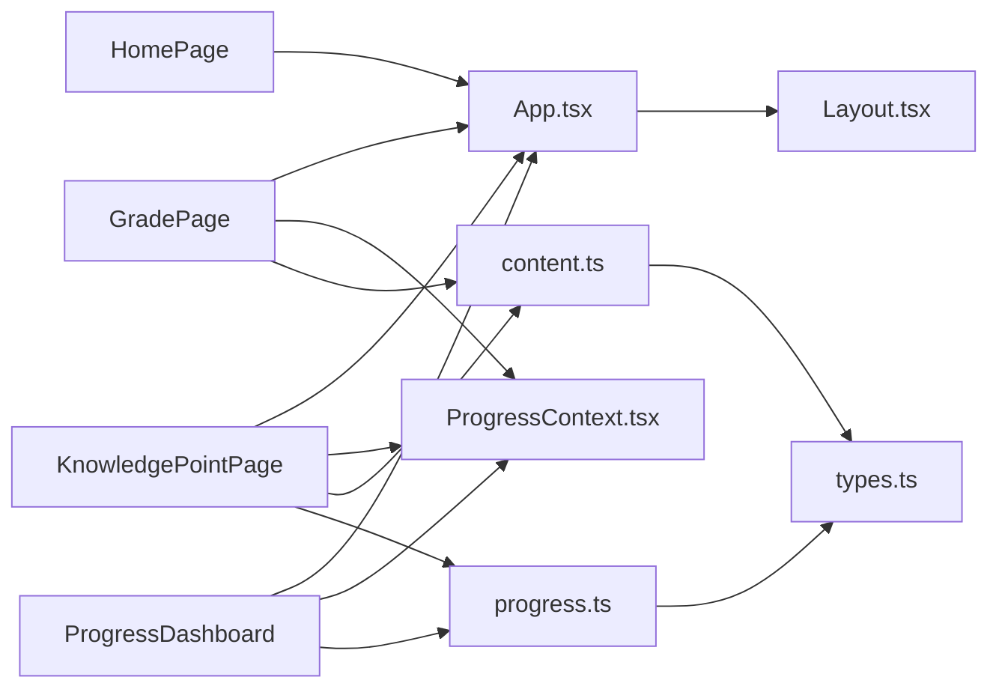

# 页面组件与路由

<cite>
**本文引用的文件**   
- [App.tsx](file://src/App.tsx)
- [main.tsx](file://src/main.tsx)
- [HomePage.tsx](file://src/pages/HomePage.tsx)
- [GradePage.tsx](file://src/pages/GradePage.tsx)
- [KnowledgePointPage.tsx](file://src/pages/KnowledgePointPage.tsx)
- [ProgressDashboard.tsx](file://src/pages/ProgressDashboard.tsx)
- [Layout.tsx](file://src/components/Layout.tsx)
- [ProgressContext.tsx](file://src/context/ProgressContext.tsx)
- [content.ts](file://src/lib/content.ts)
- [progress.ts](file://src/lib/progress.ts)
- [types.ts](file://src/lib/types.ts)
- [index.json](file://src/content/index.json)
</cite>

## 目录
1. [简介](#简介)
2. [项目结构](#项目结构)
3. [核心组件](#核心组件)
4. [架构总览](#架构总览)
5. [详细组件分析](#详细组件分析)
6. [依赖关系分析](#依赖关系分析)
7. [性能考虑](#性能考虑)
8. [故障排查指南](#故障排查指南)
9. [结论](#结论)
10. [附录：扩展与自定义页面开发指南](#附录扩展与自定义页面开发指南)

## 简介
本文件面向 math-k6 的页面组件与路由系统，系统性梳理应用入口、年级选择、知识点展示与学习进度仪表板等关键页面的职责与交互。文档覆盖路由配置、导航逻辑、页面间数据传递、状态管理、用户体验优化（懒加载、错误边界）、以及扩展与自定义页面的方法。目标是帮助开发者快速理解并高效扩展该学习平台的前端页面层。

## 项目结构
math-k6 采用基于 React + Vite 的单页应用结构，页面集中在 src/pages，通用布局与上下文在 src/components 与 src/context，内容与进度数据通过 src/lib 提供统一接口，静态内容以 Markdown/JSON 形式组织于 src/content。

图表来源
- [main.tsx](file://src/main.tsx)
- [App.tsx](file://src/App.tsx)
- [Layout.tsx](file://src/components/Layout.tsx)
- [ProgressContext.tsx](file://src/context/ProgressContext.tsx)
- [content.ts](file://src/lib/content.ts)
- [progress.ts](file://src/lib/progress.ts)
- [types.ts](file://src/lib/types.ts)
- [index.json](file://src/content/index.json)

章节来源
- [main.tsx](file://src/main.tsx)
- [App.tsx](file://src/App.tsx)

## 核心组件
- HomePage：应用首页，负责引导用户进入年级选择或学习路径。
- GradePage：年级选择页，按年级维度聚合知识点，支持跳转至具体知识点。
- KnowledgePointPage：知识点详情页，渲染解释内容、可视化与游戏化练习，记录学习进度。
- ProgressDashboard：学习进度仪表板，汇总各年级/知识点的完成度与表现趋势。
- Layout：全局布局容器，承载导航栏、侧边栏与页面主体区域。
- ProgressContext：跨页面共享的学习进度状态与持久化能力。
- content.ts：内容索引与元数据解析，提供知识点清单、分组与检索能力。
- progress.ts：进度读写封装，对接本地存储与统计计算。
- types.ts：统一的类型定义，确保页面与内容/进度的数据结构一致性。

章节来源
- [HomePage.tsx](file://src/pages/HomePage.tsx)
- [GradePage.tsx](file://src/pages/GradePage.tsx)
- [KnowledgePointPage.tsx](file://src/pages/KnowledgePointPage.tsx)
- [ProgressDashboard.tsx](file://src/pages/ProgressDashboard.tsx)
- [Layout.tsx](file://src/components/Layout.tsx)
- [ProgressContext.tsx](file://src/context/ProgressContext.tsx)
- [content.ts](file://src/lib/content.ts)
- [progress.ts](file://src/lib/progress.ts)
- [types.ts](file://src/lib/types.ts)

## 架构总览
下图展示了页面组件与数据层的交互关系，包括路由导航、内容加载、进度更新与状态共享。

图表来源
- [App.tsx](file://src/App.tsx)
- [Layout.tsx](file://src/components/Layout.tsx)
- [ProgressContext.tsx](file://src/context/ProgressContext.tsx)
- [content.ts](file://src/lib/content.ts)
- [progress.ts](file://src/lib/progress.ts)

## 详细组件分析

### HomePage（应用入口）
- 职责：作为应用入口，提供导航到年级选择与学习进度的快捷入口；可包含欢迎信息与使用指引。
- 路由：通常映射到根路径“/”，作为默认页面。
- 数据流：不直接依赖内容/进度数据，但可通过上下文获取全局状态用于个性化提示。
- 用户体验：强调清晰导航与最小认知负担，避免首屏信息过载。

章节来源
- [HomePage.tsx](file://src/pages/HomePage.tsx)
- [App.tsx](file://src/App.tsx)

### GradePage（年级选择）
- 职责：按年级维度展示知识点集合，支持筛选与跳转；为后续知识点学习提供入口。
- 路由：映射到如“/grade/:gradeId”的动态路由，参数用于过滤知识点列表。
- 数据流：从 content.ts 获取年级与知识点索引，结合 types.ts 的类型约束渲染列表。
- 交互：点击知识点卡片跳转到对应知识点详情；支持搜索与排序。
- 性能：列表项可采用懒加载与虚拟滚动策略提升大列表体验。

章节来源
- [GradePage.tsx](file://src/pages/GradePage.tsx)
- [content.ts](file://src/lib/content.ts)
- [types.ts](file://src/lib/types.ts)

### KnowledgePointPage（知识点详情）
- 职责：展示知识点解释、可视化演示与游戏化练习；记录学习行为与结果。
- 路由：映射到如“/knowledge/:id”的动态路由，参数用于定位知识点资源。
- 数据流：
  - 从 content.ts 加载知识点元数据与内容文件（Markdown/JSON）。
  - 通过 progress.ts 记录练习结果与完成度。
  - 将进度同步到 ProgressContext 供其他页面消费。
- 交互：练习提交后即时反馈，支持回看错题与重练。
- 错误处理：内容缺失或格式异常时降级显示友好提示。

章节来源
- [KnowledgePointPage.tsx](file://src/pages/KnowledgePointPage.tsx)
- [content.ts](file://src/lib/content.ts)
- [progress.ts](file://src/lib/progress.ts)
- [types.ts](file://src/lib/types.ts)

### ProgressDashboard（学习进度仪表板）
- 职责：汇总各年级/知识点的完成度、正确率与学习时长，生成可视化图表。
- 路由：映射到如“/progress”的路径，独立于知识点浏览流程。
- 数据流：从 progress.ts 读取历史数据，结合 types.ts 的结构进行聚合与计算。
- 交互：支持时间范围筛选、年级维度切换与导出报告。
- 性能：大数据量时建议分页/增量计算与缓存。

章节来源
- [ProgressDashboard.tsx](file://src/pages/ProgressDashboard.tsx)
- [progress.ts](file://src/lib/progress.ts)
- [types.ts](file://src/lib/types.ts)

### Layout（全局布局）
- 职责：统一页面框架，承载导航栏、侧边栏与主内容区；提供路由跳转与面包屑。
- 集成：与 App.tsx 的路由器协作，确保页面切换时的布局一致性。
- 可扩展性：支持主题切换与多语言文案占位。

章节来源
- [Layout.tsx](file://src/components/Layout.tsx)
- [App.tsx](file://src/App.tsx)

### ProgressContext（进度上下文）
- 职责：集中管理学习进度状态，提供订阅与更新接口；实现本地持久化。
- 数据模型：依据 types.ts 定义，包含年级、知识点、练习结果与时间戳。
- 事件机制：状态变更时通知所有订阅者，保证仪表板与详情页的一致性。

章节来源
- [ProgressContext.tsx](file://src/context/ProgressContext.tsx)
- [types.ts](file://src/lib/types.ts)

### content.ts（内容库）
- 职责：解析 src/content/index.json 与知识点目录，提供按年级/ID检索的能力。
- 数据契约：返回结构与 types.ts 保持一致，便于页面组件直接使用。
- 扩展点：新增知识点只需在 index.json 中登记，无需修改页面代码。

章节来源
- [content.ts](file://src/lib/content.ts)
- [index.json](file://src/content/index.json)
- [types.ts](file://src/lib/types.ts)

### progress.ts（进度服务）
- 职责：封装进度的读取、写入与统计计算；支持本地存储与离线可用性。
- 接口设计：提供原子操作（记录练习、查询完成度、导出报表），避免状态不一致。
- 错误处理：对无效输入与存储异常进行捕获与降级。

章节来源
- [progress.ts](file://src/lib/progress.ts)
- [types.ts](file://src/lib/types.ts)

## 依赖关系分析
页面组件与数据层之间的依赖关系如下：

图表来源
- [App.tsx](file://src/App.tsx)
- [HomePage.tsx](file://src/pages/HomePage.tsx)
- [GradePage.tsx](file://src/pages/GradePage.tsx)
- [KnowledgePointPage.tsx](file://src/pages/KnowledgePointPage.tsx)
- [ProgressDashboard.tsx](file://src/pages/ProgressDashboard.tsx)
- [Layout.tsx](file://src/components/Layout.tsx)
- [ProgressContext.tsx](file://src/context/ProgressContext.tsx)
- [content.ts](file://src/lib/content.ts)
- [progress.ts](file://src/lib/progress.ts)
- [types.ts](file://src/lib/types.ts)

章节来源
- [App.tsx](file://src/App.tsx)
- [content.ts](file://src/lib/content.ts)
- [progress.ts](file://src/lib/progress.ts)
- [types.ts](file://src/lib/types.ts)

## 性能考虑
- 路由级懒加载：对非首屏页面（如 ProgressDashboard）采用动态导入，减少初始包体积。
- 列表虚拟化：年级列表与知识点列表在数据量大时使用虚拟滚动，降低渲染压力。
- 内容预取：在进入年级页前预取知识点元数据，缩短跳转等待时间。
- 进度缓存：进度数据本地缓存与增量更新，避免重复计算。
- 错误边界：为页面组件包裹错误边界，防止单点失败导致整页崩溃。

[本节为通用指导，不直接分析具体文件]

## 故障排查指南
- 内容加载失败：检查 content.ts 的索引解析与 index.json 的完整性；确认知识点目录结构符合约定。
- 进度未保存：验证 progress.ts 的写入逻辑与本地存储权限；检查类型校验是否通过。
- 路由跳转异常：确认 App.tsx 的路由配置与页面组件的 props 传递是否正确。
- 状态不同步：检查 ProgressContext 的订阅与更新是否一致；避免竞态条件。
- 性能问题：使用浏览器性能面板定位渲染瓶颈；必要时引入分页与缓存。

章节来源
- [content.ts](file://src/lib/content.ts)
- [progress.ts](file://src/lib/progress.ts)
- [App.tsx](file://src/App.tsx)

## 结论
math-k6 的页面组件与路由系统以清晰的职责划分与数据契约为基础，实现了从入口到年级选择、知识点学习与进度追踪的完整学习闭环。通过上下文与内容/进度服务的解耦，系统具备良好的可扩展性与维护性。遵循本文档的扩展指南，可快速添加新页面与功能模块。

[本节为总结，不直接分析具体文件]

## 附录：扩展与自定义页面开发指南
- 新增页面步骤：
  1. 在 src/pages 下创建新页面组件，明确其职责与路由路径。
  2. 在 App.tsx 中注册路由，按需懒加载页面组件。
  3. 如需内容驱动，参考 content.ts 的数据模型，在 index.json 中登记元数据。
  4. 如需记录进度，调用 progress.ts 的接口并订阅 ProgressContext。
  5. 在 Layout.tsx 中补充导航项与面包屑，确保一致的导航体验。
- 最佳实践：
  - 保持页面组件无副作用，数据请求与状态更新下沉到 lib 层。
  - 使用 types.ts 严格约束数据结构，避免运行时错误。
  - 对复杂页面增加错误边界与加载状态，提升用户体验。
  - 对大数据列表采用虚拟化与分页，控制内存占用。
- 常见问题：
  - 路由参数未正确传递：检查动态路由定义与组件 props 接收。
  - 进度数据丢失：确认本地存储可用性与写入幂等性。
  - 内容解析失败：校验 JSON/Markdown 格式与字段完整性。

章节来源
- [App.tsx](file://src/App.tsx)
- [content.ts](file://src/lib/content.ts)
- [progress.ts](file://src/lib/progress.ts)
- [types.ts](file://src/lib/types.ts)
- [Layout.tsx](file://src/components/Layout.tsx)