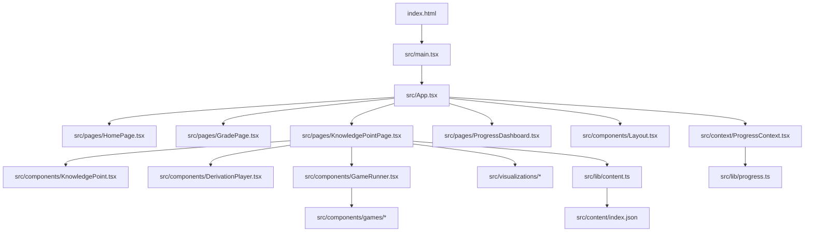
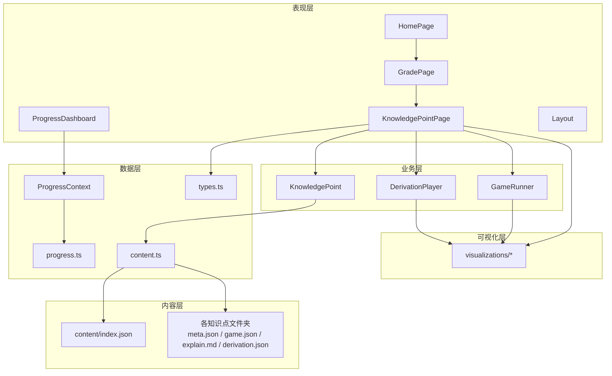
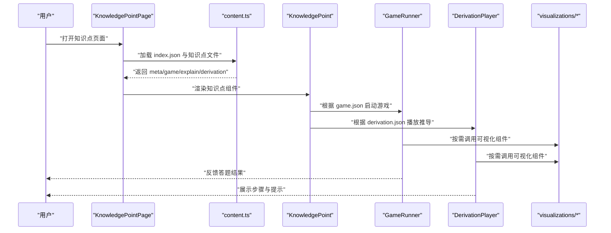
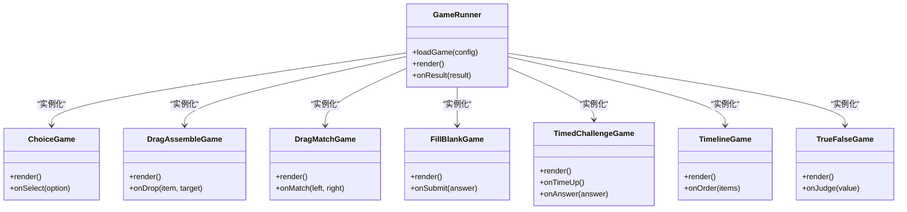
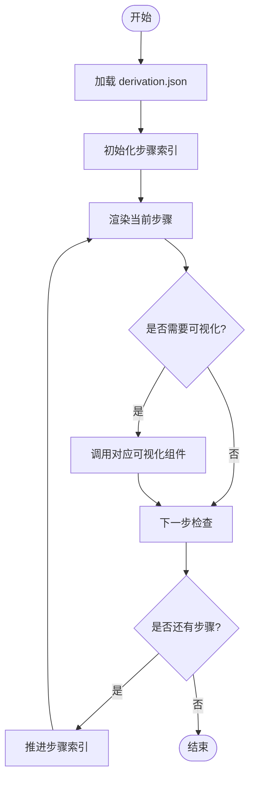
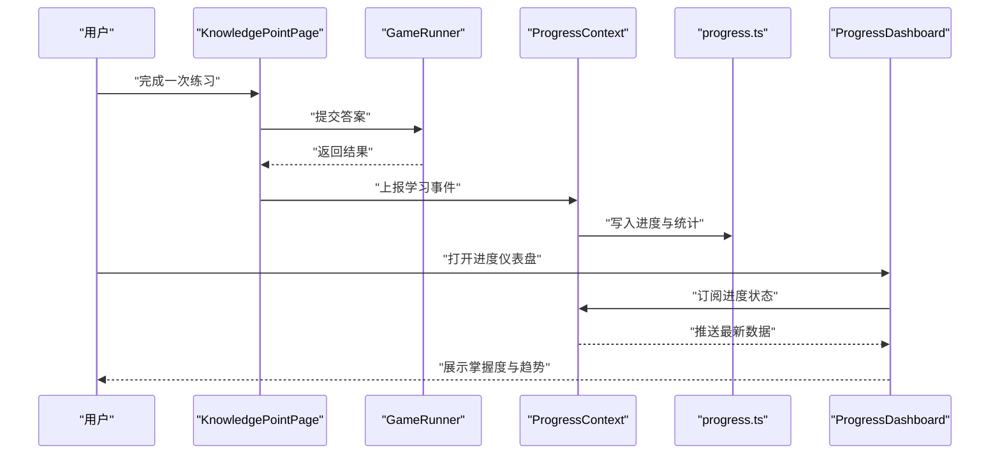
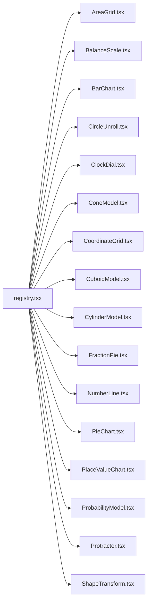
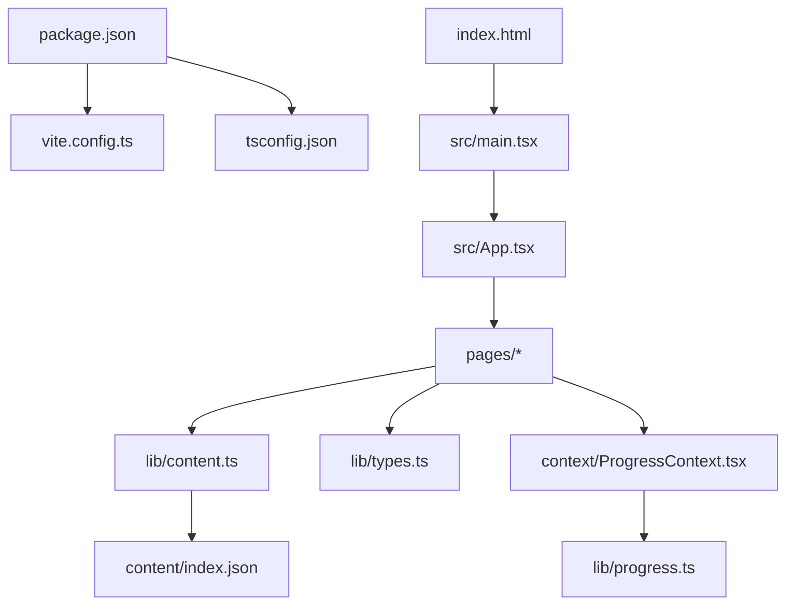

# 项目概述

<cite>
**本文引用的文件**   
- [README.md](file://README.md)
- [package.json](file://package.json)
- [vite.config.ts](file://vite.config.ts)
- [tsconfig.json](file://tsconfig.json)
- [index.html](file://index.html)
- [src/main.tsx](file://src/main.tsx)
- [src/App.tsx](file://src/App.tsx)
- [src/pages/HomePage.tsx](file://src/pages/HomePage.tsx)
- [src/pages/GradePage.tsx](file://src/pages/GradePage.tsx)
- [src/pages/KnowledgePointPage.tsx](file://src/pages/KnowledgePointPage.tsx)
- [src/pages/ProgressDashboard.tsx](file://src/pages/ProgressDashboard.tsx)
- [src/components/Layout.tsx](file://src/components/Layout.tsx)
- [src/components/GameRunner.tsx](file://src/components/GameRunner.tsx)
- [src/components/DerivationPlayer.tsx](file://src/components/DerivationPlayer.tsx)
- [src/components/KnowledgePoint.tsx](file://src/components/KnowledgePoint.tsx)
- [src/components/games/ChoiceGame.tsx](file://src/components/games/ChoiceGame.tsx)
- [src/components/games/DragAssembleGame.tsx](file://src/components/games/DragAssembleGame.tsx)
- [src/components/games/DragMatchGame.tsx](file://src/components/games/DragMatchGame.tsx)
- [src/components/games/FillBlankGame.tsx](file://src/components/games/FillBlankGame.tsx)
- [src/components/games/TimedChallengeGame.tsx](file://src/components/games/TimedChallengeGame.tsx)
- [src/components/games/TimelineGame.tsx](file://src/components/games/TimelineGame.tsx)
- [src/components/games/TrueFalseGame.tsx](file://src/components/games/TrueFalseGame.tsx)
- [src/content/index.json](file://src/content/index.json)
- [src/lib/content.ts](file://src/lib/content.ts)
- [src/lib/types.ts](file://src/lib/types.ts)
- [src/lib/progress.ts](file://src/lib/progress.ts)
- [src/context/ProgressContext.tsx](file://src/context/ProgressContext.tsx)
- [src/visualizations/AreaGrid.tsx](file://src/visualizations/AreaGrid.tsx)
- [src/visualizations/BalanceScale.tsx](file://src/visualizations/BalanceScale.tsx)
- [src/visualizations/BarChart.tsx](file://src/visualizations/BarChart.tsx)
- [src/visualizations/CircleUnroll.tsx](file://src/visualizations/CircleUnroll.tsx)
- [src/visualizations/ClockDial.tsx](file://src/visualizations/ClockDial.tsx)
- [src/visualizations/ConeModel.tsx](file://src/visualizations/ConeModel.tsx)
- [src/visualizations/CoordinateGrid.tsx](file://src/visualizations/CoordinateGrid.tsx)
- [src/visualizations/CuboidModel.tsx](file://src/visualizations/CuboidModel.tsx)
- [src/visualizations/CylinderModel.tsx](file://src/visualizations/CylinderModel.tsx)
- [src/visualizations/FractionPie.tsx](file://src/visualizations/FractionPie.tsx)
- [src/visualizations/NumberLine.tsx](file://src/visualizations/NumberLine.tsx)
- [src/visualizations/PieChart.tsx](file://src/visualizations/PieChart.tsx)
- [src/visualizations/PlaceValueChart.tsx](file://src/visualizations/PlaceValueChart.tsx)
- [src/visualizations/ProbabilityModel.tsx](file://src/visualizations/ProbabilityModel.tsx)
- [src/visualizations/Protractor.tsx](file://src/visualizations/Protractor.tsx)
- [src/visualizations/ShapeTransform.tsx](file://src/visualizations/ShapeTransform.tsx)
- [src/visualizations/registry.tsx](file://src/visualizations/registry.tsx)
</cite>

## 目录
1. [简介](#简介)
2. [项目结构](#项目结构)
3. [核心组件](#核心组件)
4. [架构总览](#架构总览)
5. [详细组件分析](#详细组件分析)
6. [依赖关系分析](#依赖关系分析)
7. [性能考量](#性能考量)
8. [故障排查指南](#故障排查指南)
9. [结论](#结论)
10. [附录](#附录)

## 简介
math-k6 是一款面向 K-6 年级的小数学教学平台，基于 React + TypeScript + Vite 构建。项目通过“知识点内容 + 交互式游戏 + 可视化教具 + 学习进度跟踪”的组合，帮助学生在趣味练习中掌握小学阶段的核心数学概念。整体设计理念强调：
- 以知识点为中心组织内容，支持按年级与主题导航
- 用可插拔的游戏类型承载不同题型（选择、拖拽、填空、限时挑战等）
- 借助丰富的可视化组件将抽象概念具象化（分数饼图、数轴、量角器、立体模型等）
- 提供学习进度追踪与仪表盘，便于学生与家长了解学习情况

技术栈选择理由：
- React：组件化开发，适合构建交互丰富的教学界面
- TypeScript：类型安全，提升大型项目的可维护性与协作效率
- Vite：快速开发与热更新，优化构建与调试体验

与其他组件的关系：
- 内容层：content/index.json 与各知识点的 meta/game/explain/derivation 文件构成“内容即配置”的数据驱动模式
- 运行时：GameRunner 根据 game.json 动态加载并运行具体游戏组件
- 可视化层：visualizations 提供通用可视化工具，被知识点页面或游戏复用
- 进度系统：ProgressContext + progress.ts 管理学习状态与持久化

使用场景示例：
- 三年级“分数的初步认识”：先阅读 explain.md 的讲解，再进入 FractionPie 可视化进行直观理解，最后通过 ChoiceGame 完成选择题巩固
- 四年级“小数加减法”：在 KnowledgePointPage 中观看推导过程（derivation.json），结合 NumberLine 与 PlaceValueChart 进行练习，并通过 TimedChallengeGame 提升计算速度
- 五年级“长方体体积”：使用 CuboidModel 观察三维展开与体积变化，随后在 FillBlankGame 中填写关键步骤，最终在 ProgressDashboard 查看掌握度

## 项目结构
项目采用“功能域 + 资源分层”的组织方式：
- src/pages：页面路由与视图（首页、年级页、知识点页、进度仪表盘）
- src/components：通用组件与游戏容器（布局、游戏运行器、推导播放器、知识点卡片）
- src/components/games：具体游戏实现（选择、拖拽、填空、时间挑战、时间线、判断等）
- src/content：知识点内容数据（元信息、游戏配置、讲解文本、推导脚本）
- src/visualizations：可视化教具库（面积网格、天平、条形图、扇形图、时钟、立体模型等）
- src/lib：工具与类型定义（内容加载、进度管理、类型声明）
- src/context：全局上下文（学习进度状态共享）
- 根级配置：Vite、TypeScript、入口 HTML 与包管理

图表来源
- [index.html:1-20](file://index.html#L1-L20)
- [src/main.tsx:1-40](file://src/main.tsx#L1-L40)
- [src/App.tsx:1-60](file://src/App.tsx#L1-L60)
- [src/pages/HomePage.tsx:1-40](file://src/pages/HomePage.tsx#L1-L40)
- [src/pages/GradePage.tsx:1-60](file://src/pages/GradePage.tsx#L1-L60)
- [src/pages/KnowledgePointPage.tsx:1-80](file://src/pages/KnowledgePointPage.tsx#L1-L80)
- [src/components/Layout.tsx:1-40](file://src/components/Layout.tsx#L1-L40)
- [src/components/GameRunner.tsx:1-60](file://src/components/GameRunner.tsx#L1-L60)
- [src/components/DerivationPlayer.tsx:1-40](file://src/components/DerivationPlayer.tsx#L1-L40)
- [src/components/KnowledgePoint.tsx:1-40](file://src/components/KnowledgePoint.tsx#L1-L40)
- [src/context/ProgressContext.tsx:1-60](file://src/context/ProgressContext.tsx#L1-L60)
- [src/lib/progress.ts:1-60](file://src/lib/progress.ts#L1-L60)
- [src/lib/content.ts:1-60](file://src/lib/content.ts#L1-L60)
- [src/content/index.json:1-40](file://src/content/index.json#L1-L40)

章节来源
- [package.json:1-40](file://package.json#L1-L40)
- [vite.config.ts:1-40](file://vite.config.ts#L1-L40)
- [tsconfig.json:1-30](file://tsconfig.json#L1-L30)
- [index.html:1-20](file://index.html#L1-L20)
- [src/main.tsx:1-40](file://src/main.tsx#L1-L40)
- [src/App.tsx:1-60](file://src/App.tsx#L1-L60)

## 核心组件
- 页面层
  - HomePage：展示年级入口与推荐内容
  - GradePage：按年级组织知识点列表与导航
  - KnowledgePointPage：加载知识点元数据、讲解、推导与游戏，渲染可视化与练习
  - ProgressDashboard：汇总学习进度、正确率与薄弱点
- 组件层
  - Layout：应用级布局与导航
  - GameRunner：根据 game.json 动态加载并运行具体游戏组件
  - DerivationPlayer：播放推导脚本（derivation.json），逐步演示解题思路
  - KnowledgePoint：封装知识点页面的内容与交互逻辑
- 游戏组件
  - ChoiceGame、DragAssembleGame、DragMatchGame、FillBlankGame、TimedChallengeGame、TimelineGame、TrueFalseGame
- 可视化组件
  - AreaGrid、BalanceScale、BarChart、CircleUnroll、ClockDial、ConeModel、CoordinateGrid、CuboidModel、CylinderModel、FractionPie、NumberLine、PieChart、PlaceValueChart、ProbabilityModel、Protractor、ShapeTransform、registry
- 数据与上下文
  - content.ts：统一加载与解析 content/index.json 及各知识点文件
  - types.ts：定义知识点、游戏、进度等类型
  - progress.ts：进度读写与统计
  - ProgressContext.tsx：全局进度状态与更新方法

章节来源
- [src/pages/HomePage.tsx:1-40](file://src/pages/HomePage.tsx#L1-L40)
- [src/pages/GradePage.tsx:1-60](file://src/pages/GradePage.tsx#L1-L60)
- [src/pages/KnowledgePointPage.tsx:1-80](file://src/pages/KnowledgePointPage.tsx#L1-L80)
- [src/pages/ProgressDashboard.tsx:1-60](file://src/pages/ProgressDashboard.tsx#L1-L60)
- [src/components/Layout.tsx:1-40](file://src/components/Layout.tsx#L1-L40)
- [src/components/GameRunner.tsx:1-60](file://src/components/GameRunner.tsx#L1-L60)
- [src/components/DerivationPlayer.tsx:1-40](file://src/components/DerivationPlayer.tsx#L1-L40)
- [src/components/KnowledgePoint.tsx:1-40](file://src/components/KnowledgePoint.tsx#L1-L40)
- [src/components/games/ChoiceGame.tsx:1-40](file://src/components/games/ChoiceGame.tsx#L1-L40)
- [src/components/games/DragAssembleGame.tsx:1-40](file://src/components/games/DragAssembleGame.tsx#L1-L40)
- [src/components/games/DragMatchGame.tsx:1-40](file://src/components/games/DragMatchGame.tsx#L1-L40)
- [src/components/games/FillBlankGame.tsx:1-40](file://src/components/games/FillBlankGame.tsx#L1-L40)
- [src/components/games/TimedChallengeGame.tsx:1-40](file://src/components/games/TimedChallengeGame.tsx#L1-L40)
- [src/components/games/TimelineGame.tsx:1-40](file://src/components/games/TimelineGame.tsx#L1-L40)
- [src/components/games/TrueFalseGame.tsx:1-40](file://src/components/games/TrueFalseGame.tsx#L1-L40)
- [src/visualizations/registry.tsx:1-40](file://src/visualizations/registry.tsx#L1-L40)
- [src/lib/content.ts:1-60](file://src/lib/content.ts#L1-L60)
- [src/lib/types.ts:1-60](file://src/lib/types.ts#L1-L60)
- [src/lib/progress.ts:1-60](file://src/lib/progress.ts#L1-L60)
- [src/context/ProgressContext.tsx:1-60](file://src/context/ProgressContext.tsx#L1-L60)

## 架构总览
系统采用“内容驱动 + 组件化 + 可视化”的分层架构：
- 内容层：以 JSON/Markdown/JSON 脚本形式描述知识点、游戏与推导流程
- 表现层：React 页面与组件负责 UI 与交互
- 业务层：GameRunner 与 DerivationPlayer 编排学习与练习流程
- 数据层：progress.ts 与 ProgressContext 管理学习状态与持久化
- 可视化层：独立的可复用可视化组件，按需挂载到知识点或游戏中

图表来源
- [src/pages/HomePage.tsx:1-40](file://src/pages/HomePage.tsx#L1-L40)
- [src/pages/GradePage.tsx:1-60](file://src/pages/GradePage.tsx#L1-L60)
- [src/pages/KnowledgePointPage.tsx:1-80](file://src/pages/KnowledgePointPage.tsx#L1-L80)
- [src/pages/ProgressDashboard.tsx:1-60](file://src/pages/ProgressDashboard.tsx#L1-L60)
- [src/components/KnowledgePoint.tsx:1-40](file://src/components/KnowledgePoint.tsx#L1-L40)
- [src/components/GameRunner.tsx:1-60](file://src/components/GameRunner.tsx#L1-L60)
- [src/components/DerivationPlayer.tsx:1-40](file://src/components/DerivationPlayer.tsx#L1-L40)
- [src/lib/content.ts:1-60](file://src/lib/content.ts#L1-L60)
- [src/lib/progress.ts:1-60](file://src/lib/progress.ts#L1-L60)
- [src/context/ProgressContext.tsx:1-60](file://src/context/ProgressContext.tsx#L1-L60)
- [src/visualizations/registry.tsx:1-40](file://src/visualizations/registry.tsx#L1-L40)

## 详细组件分析

### 知识点页面与内容加载
知识点页面负责聚合讲解、推导与游戏，并按需渲染可视化。内容加载流程如下：
- 读取 index.json 获取知识点清单
- 根据知识点 ID 加载 meta.json、game.json、explain.md、derivation.json
- 将内容注入到 KnowledgePoint 组件，由 GameRunner 与 DerivationPlayer 分别处理

图表来源
- [src/pages/KnowledgePointPage.tsx:1-80](file://src/pages/KnowledgePointPage.tsx#L1-L80)
- [src/lib/content.ts:1-60](file://src/lib/content.ts#L1-L60)
- [src/components/KnowledgePoint.tsx:1-40](file://src/components/KnowledgePoint.tsx#L1-L40)
- [src/components/GameRunner.tsx:1-60](file://src/components/GameRunner.tsx#L1-L60)
- [src/components/DerivationPlayer.tsx:1-40](file://src/components/DerivationPlayer.tsx#L1-L40)
- [src/visualizations/registry.tsx:1-40](file://src/visualizations/registry.tsx#L1-L40)

章节来源
- [src/pages/KnowledgePointPage.tsx:1-80](file://src/pages/KnowledgePointPage.tsx#L1-L80)
- [src/lib/content.ts:1-60](file://src/lib/content.ts#L1-L60)
- [src/components/KnowledgePoint.tsx:1-40](file://src/components/KnowledgePoint.tsx#L1-L40)

### 游戏运行器与游戏组件
GameRunner 作为统一入口，依据 game.json 的配置动态加载并运行具体游戏组件。游戏组件遵循一致的接口约定，便于扩展新题型。

图表来源
- [src/components/GameRunner.tsx:1-60](file://src/components/GameRunner.tsx#L1-L60)
- [src/components/games/ChoiceGame.tsx:1-40](file://src/components/games/ChoiceGame.tsx#L1-L40)
- [src/components/games/DragAssembleGame.tsx:1-40](file://src/components/games/DragAssembleGame.tsx#L1-L40)
- [src/components/games/DragMatchGame.tsx:1-40](file://src/components/games/DragMatchGame.tsx#L1-L40)
- [src/components/games/FillBlankGame.tsx:1-40](file://src/components/games/FillBlankGame.tsx#L1-L40)
- [src/components/games/TimedChallengeGame.tsx:1-40](file://src/components/games/TimedChallengeGame.tsx#L1-L40)
- [src/components/games/TimelineGame.tsx:1-40](file://src/components/games/TimelineGame.tsx#L1-L40)
- [src/components/games/TrueFalseGame.tsx:1-40](file://src/components/games/TrueFalseGame.tsx#L1-L40)

章节来源
- [src/components/GameRunner.tsx:1-60](file://src/components/GameRunner.tsx#L1-L60)
- [src/components/games/ChoiceGame.tsx:1-40](file://src/components/games/ChoiceGame.tsx#L1-L40)
- [src/components/games/DragAssembleGame.tsx:1-40](file://src/components/games/DragAssembleGame.tsx#L1-L40)
- [src/components/games/DragMatchGame.tsx:1-40](file://src/components/games/DragMatchGame.tsx#L1-L40)
- [src/components/games/FillBlankGame.tsx:1-40](file://src/components/games/FillBlankGame.tsx#L1-L40)
- [src/components/games/TimedChallengeGame.tsx:1-40](file://src/components/games/TimedChallengeGame.tsx#L1-L40)
- [src/components/games/TimelineGame.tsx:1-40](file://src/components/games/TimelineGame.tsx#L1-L40)
- [src/components/games/TrueFalseGame.tsx:1-40](file://src/components/games/TrueFalseGame.tsx#L1-L40)

### 推导播放器与可视化
DerivationPlayer 负责按步骤播放推导脚本，配合可视化组件将抽象过程具象化。例如：
- 分数除法：使用 CircleUnroll 与 FractionPie 展示“除以一个分数等于乘以倒数”的几何意义
- 圆柱体积：使用 CylinderModel 与 AreaGrid 演示底面积与高的关系

图表来源
- [src/components/DerivationPlayer.tsx:1-40](file://src/components/DerivationPlayer.tsx#L1-L40)
- [src/visualizations/CircleUnroll.tsx:1-40](file://src/visualizations/CircleUnroll.tsx#L1-L40)
- [src/visualizations/FractionPie.tsx:1-40](file://src/visualizations/FractionPie.tsx#L1-L40)
- [src/visualizations/CylinderModel.tsx:1-40](file://src/visualizations/CylinderModel.tsx#L1-L40)
- [src/visualizations/AreaGrid.tsx:1-40](file://src/visualizations/AreaGrid.tsx#L1-L40)

章节来源
- [src/components/DerivationPlayer.tsx:1-40](file://src/components/DerivationPlayer.tsx#L1-L40)
- [src/visualizations/CircleUnroll.tsx:1-40](file://src/visualizations/CircleUnroll.tsx#L1-L40)
- [src/visualizations/FractionPie.tsx:1-40](file://src/visualizations/FractionPie.tsx#L1-L40)
- [src/visualizations/CylinderModel.tsx:1-40](file://src/visualizations/CylinderModel.tsx#L1-L40)
- [src/visualizations/AreaGrid.tsx:1-40](file://src/visualizations/AreaGrid.tsx#L1-L40)

### 进度系统与仪表盘
进度系统通过 ProgressContext 与 progress.ts 统一管理学习状态，包括知识点掌握度、答题统计与错误记录。ProgressDashboard 将这些数据可视化呈现，帮助学生定位薄弱环节。

图表来源
- [src/pages/KnowledgePointPage.tsx:1-80](file://src/pages/KnowledgePointPage.tsx#L1-L80)
- [src/components/GameRunner.tsx:1-60](file://src/components/GameRunner.tsx#L1-L60)
- [src/context/ProgressContext.tsx:1-60](file://src/context/ProgressContext.tsx#L1-L60)
- [src/lib/progress.ts:1-60](file://src/lib/progress.ts#L1-L60)
- [src/pages/ProgressDashboard.tsx:1-60](file://src/pages/ProgressDashboard.tsx#L1-L60)

章节来源
- [src/context/ProgressContext.tsx:1-60](file://src/context/ProgressContext.tsx#L1-L60)
- [src/lib/progress.ts:1-60](file://src/lib/progress.ts#L1-L60)
- [src/pages/ProgressDashboard.tsx:1-60](file://src/pages/ProgressDashboard.tsx#L1-L60)

### 可视化组件注册与使用
visualizations/registry.tsx 集中注册可视化组件，供 GameRunner 与 DerivationPlayer 按名称动态调用。新增可视化只需在 registry 中注册并在内容配置中引用即可。

图表来源
- [src/visualizations/registry.tsx:1-40](file://src/visualizations/registry.tsx#L1-L40)
- [src/visualizations/AreaGrid.tsx:1-40](file://src/visualizations/AreaGrid.tsx#L1-L40)
- [src/visualizations/BalanceScale.tsx:1-40](file://src/visualizations/BalanceScale.tsx#L1-L40)
- [src/visualizations/BarChart.tsx:1-40](file://src/visualizations/BarChart.tsx#L1-L40)
- [src/visualizations/CircleUnroll.tsx:1-40](file://src/visualizations/CircleUnroll.tsx#L1-L40)
- [src/visualizations/ClockDial.tsx:1-40](file://src/visualizations/ClockDial.tsx#L1-L40)
- [src/visualizations/ConeModel.tsx:1-40](file://src/visualizations/ConeModel.tsx#L1-L40)
- [src/visualizations/CoordinateGrid.tsx:1-40](file://src/visualizations/CoordinateGrid.tsx#L1-L40)
- [src/visualizations/CuboidModel.tsx:1-40](file://src/visualizations/CuboidModel.tsx#L1-L40)
- [src/visualizations/CylinderModel.tsx:1-40](file://src/visualizations/CylinderModel.tsx#L1-L40)
- [src/visualizations/FractionPie.tsx:1-40](file://src/visualizations/FractionPie.tsx#L1-L40)
- [src/visualizations/NumberLine.tsx:1-40](file://src/visualizations/NumberLine.tsx#L1-L40)
- [src/visualizations/PieChart.tsx:1-40](file://src/visualizations/PieChart.tsx#L1-L40)
- [src/visualizations/PlaceValueChart.tsx:1-40](file://src/visualizations/PlaceValueChart.tsx#L1-L40)
- [src/visualizations/ProbabilityModel.tsx:1-40](file://src/visualizations/ProbabilityModel.tsx#L1-L40)
- [src/visualizations/Protractor.tsx:1-40](file://src/visualizations/Protractor.tsx#L1-L40)
- [src/visualizations/ShapeTransform.tsx:1-40](file://src/visualizations/ShapeTransform.tsx#L1-L40)

章节来源
- [src/visualizations/registry.tsx:1-40](file://src/visualizations/registry.tsx#L1-L40)

## 依赖关系分析
- 构建与工程
  - package.json：定义依赖与脚本（React、TypeScript、Vite 等）
  - vite.config.ts：开发服务器、插件与构建优化
  - tsconfig.json：TypeScript 编译选项与路径映射
- 应用入口
  - index.html：HTML 模板
  - src/main.tsx：应用初始化与根组件挂载
  - src/App.tsx：路由与页面装配
- 数据与内容
  - src/lib/content.ts：统一内容加载与缓存
  - src/content/index.json：知识点索引
  - src/lib/types.ts：类型定义
- 状态与进度
  - src/context/ProgressContext.tsx：全局进度上下文
  - src/lib/progress.ts：进度存储与统计

图表来源
- [package.json:1-40](file://package.json#L1-L40)
- [vite.config.ts:1-40](file://vite.config.ts#L1-L40)
- [tsconfig.json:1-30](file://tsconfig.json#L1-L30)
- [index.html:1-20](file://index.html#L1-L20)
- [src/main.tsx:1-40](file://src/main.tsx#L1-L40)
- [src/App.tsx:1-60](file://src/App.tsx#L1-L60)
- [src/lib/content.ts:1-60](file://src/lib/content.ts#L1-L60)
- [src/content/index.json:1-40](file://src/content/index.json#L1-L40)
- [src/lib/types.ts:1-60](file://src/lib/types.ts#L1-L60)
- [src/context/ProgressContext.tsx:1-60](file://src/context/ProgressContext.tsx#L1-L60)
- [src/lib/progress.ts:1-60](file://src/lib/progress.ts#L1-L60)

章节来源
- [package.json:1-40](file://package.json#L1-L40)
- [vite.config.ts:1-40](file://vite.config.ts#L1-L40)
- [tsconfig.json:1-30](file://tsconfig.json#L1-L30)
- [src/lib/content.ts:1-60](file://src/lib/content.ts#L1-L60)
- [src/lib/types.ts:1-60](file://src/lib/types.ts#L1-L60)
- [src/lib/progress.ts:1-60](file://src/lib/progress.ts#L1-L60)
- [src/context/ProgressContext.tsx:1-60](file://src/context/ProgressContext.tsx#L1-L60)

## 性能考量
- 构建与加载
  - 使用 Vite 的开发服务器与按需热更新，缩短迭代周期
  - 对大体积可视化组件进行懒加载与按需引入，减少首屏体积
- 渲染优化
  - 将频繁更新的进度状态拆分至独立上下文，避免不必要的重渲染
  - 游戏组件内部使用稳定的 props 与最小化 state 变更
- 数据访问
  - 内容加载增加缓存策略，避免重复请求相同知识点文件
  - 进度写入批量合并，降低 I/O 频率

[本节为通用指导，不直接分析具体文件]

## 故障排查指南
- 内容加载失败
  - 检查 content/index.json 与知识点文件夹中的 meta.json、game.json、explain.md、derivation.json 是否存在且格式正确
  - 确认 content.ts 的路径解析与命名约定一致
- 游戏无法运行
  - 核对 game.json 中的组件名是否在 visualizations/registry.tsx 中正确注册
  - 检查游戏组件的接口是否符合约定（渲染、输入回调、结果上报）
- 进度不更新
  - 确认 ProgressContext 已包裹应用并提供正确的初始状态
  - 检查 progress.ts 的写入方法与本地存储权限
- 可视化异常
  - 验证传入参数类型与范围（如角度、坐标、比例）
  - 在浏览器开发者工具中检查控制台错误与 DOM 结构

章节来源
- [src/lib/content.ts:1-60](file://src/lib/content.ts#L1-L60)
- [src/visualizations/registry.tsx:1-40](file://src/visualizations/registry.tsx#L1-L40)
- [src/context/ProgressContext.tsx:1-60](file://src/context/ProgressContext.tsx#L1-L60)
- [src/lib/progress.ts:1-60](file://src/lib/progress.ts#L1-L60)

## 结论
math-k6 通过“内容驱动 + 组件化 + 可视化 + 进度追踪”的整体设计，为 K-6 年级学生提供了系统化、互动性强且易于扩展的数学学习平台。对于初学者，可从知识点页面入手，逐步理解内容结构与游戏运行机制；对于有经验的开发者，可在游戏与可视化层面进行二次开发，丰富教学内容与交互体验。

[本节为总结性内容，不直接分析具体文件]

## 附录
- 术语说明
  - 知识点：按年级与主题划分的数学概念单元，包含讲解、推导与练习
  - 游戏：以题型为核心的交互练习模块，支持多种题型与难度
  - 可视化：用于直观展示数学概念的图形与动画组件
  - 进度：记录学生学习行为与结果的统计数据
- 使用建议
  - 新增知识点：在 content 下创建文件夹，编写 meta.json、game.json、explain.md、derivation.json，并在 index.json 中登记
  - 新增游戏：实现游戏组件并在 GameRunner 中注册，确保接口一致
  - 新增可视化：实现组件并在 registry.tsx 中注册，供内容与游戏复用

[本节为补充信息，不直接分析具体文件]